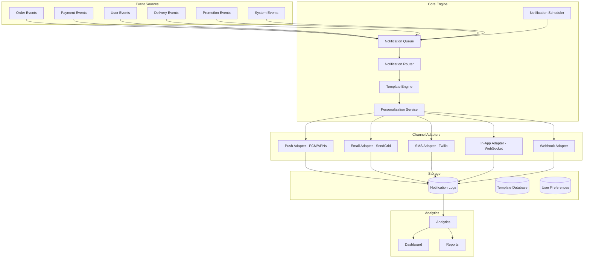

# Software Requirements Specification (SRS)

## Part 10A: Notification Engine

**Module:** Notifications & Communications Module (Part 11)
**Version:** 1.0.0
**Status:** Final / For Review
**Date:** 2026-06-30

---

## Chapter 1 – Overview

### Purpose

The Notification Engine module defines the comprehensive notification infrastructure for the **[Platform Name]** platform. This encompasses multi-channel communication delivery, template management, personalization, delivery tracking, and analytics.

Notifications are the primary means of communication between the platform and its users—customers, merchants, drivers, and administrators. Timely, relevant, and personalized notifications drive engagement, enable operational coordination, and build trust. This module ensures that notifications are delivered reliably, at scale, across multiple channels.

### Objectives

- Enable multi-channel notification delivery (push, email, SMS, in-app)
- Provide template management for consistent messaging
- Support personalization and localization
- Ensure reliable delivery with retry and fallback mechanisms
- Track delivery and engagement metrics
- Support user preference management
- Enable event-driven and scheduled notifications
- Provide comprehensive notification analytics

---

## Chapter 2 – Architecture

### NOTIFY-001 Notification Architecture



### NOTIFY-002 Core Components

| Component | Description | Priority |
| :--- | :--- | :--- |
| **Notification Queue** | Buffers notifications for processing | **Required** |
| **Notification Scheduler** | Schedules notifications for future delivery | **Required** |
| **Notification Router** | Routes notifications to appropriate channels | **Required** |
| **Template Engine** | Renders notification templates | **Required** |
| **Personalization Service** | Personalizes notifications for users | **Required** |
| **Channel Adapters** | Adapters for each communication channel | **Required** |
| **Delivery Tracker** | Tracks notification delivery status | **Required** |
| **Preference Manager** | Manages user notification preferences | **Required** |
| **Analytics Engine** | Collects and analyzes notification metrics | **Required** |

### NOTIFY-003 Delivery Reliability

| Feature | Description | Priority |
| :--- | :--- | :--- |
| **Retry Mechanism** | Automatic retry on failure | **Required** |
| **Exponential Backoff** | Exponential backoff for retries | **Required** |
| **Circuit Breaker** | Prevents cascading failures | **Required** |
| **Dead Letter Queue** | Handles undeliverable notifications | **Required** |
| **Fallback Channel** | Fallback to alternative channel | **Required** |
| **Rate Limiting** | Prevents provider rate limit breaches | **Required** |

---

## Chapter 3 – Supported Channels

### NOTIFY-004 Communication Channels

| Channel | Description | Providers | Priority |
| :--- | :--- | :--- | :--- |
| **Push Notifications** | Mobile push notifications | FCM (Android), APNs (iOS) | **Required** |
| **Email** | Transactional and marketing emails | SendGrid, SES | **Required** |
| **SMS** | Short message service | Twilio, AWS SNS | **Required** |
| **In-App** | In-app notifications via WebSocket | Custom | **Required** |
| **Webhook** | Outbound webhook notifications | Custom | **Required** |
| **Voice** | Voice calls (future) | Twilio Voice | **Future** |
| **WhatsApp** | WhatsApp messaging (future) | Twilio WhatsApp | **Future** |

### NOTIFY-005 Channel Selection Rules

| Rule | Description | Priority |
| :--- | :--- | :--- |
| **User Preference** | Respect user notification preferences | **Required** |
| **Channel Priority** | Delivery order: Push > In-App > Email > SMS | **Required** |
| **Urgency** | Critical notifications use all channels | **Required** |
| **Opt-Out** | Respect user opt-out preferences | **Required** |
| **Time Window** | Respect quiet hours (no notifications between 10 PM - 7 AM) | **Required** |
| **Rate Limit** | Respect per-channel rate limits | **Required** |

---

## Chapter 4 – Notification Types

### NOTIFY-006 Notification Categories

| Category | Description | Priority |
| :--- | :--- | :--- |
| **Order Notifications** | Order status, confirmations, updates | **Required** |
| **Delivery Notifications** | Driver assignment, tracking, delivery | **Required** |
| **Payment Notifications** | Payment success, failure, refunds | **Required** |
| **Merchant Notifications** | New orders, cancellations, reports | **Required** |
| **Driver Notifications** | New orders, assignments, earnings | **Required** |
| **User Notifications** | Account, security, profile | **Required** |
| **Promotional Notifications** | Offers, campaigns, recommendations | **Required** |
| **System Notifications** | Maintenance, updates, alerts | **Required** |

### NOTIFY-007 Notification Events

| Event | Channels | Priority | Template |
| :--- | :--- | :--- | :--- |
| `order.confirmed` | Push, In-App, Email, SMS | High | order-confirmed |
| `order.preparing` | Push, In-App | High | order-preparing |
| `order.ready` | Push, In-App | High | order-ready |
| `order.picked_up` | Push, In-App | High | order-picked-up |
| `order.delivered` | Push, In-App, Email | High | order-delivered |
| `order.cancelled` | Push, In-App, Email | High | order-cancelled |
| `driver.assigned` | Push, In-App | High | driver-assigned |
| `driver.arriving` | Push, In-App | High | driver-arriving |
| `payment.success` | Push, In-App, Email | High | payment-success |
| `payment.failure` | Push, Email, SMS | Critical | payment-failure |
| `payment.refund` | Push, In-App, Email | High | payment-refund |
| `merchant.new_order` | Push, In-App, Email | High | merchant-new-order |
| `merchant.cancellation` | Push, In-App, Email | High | merchant-cancellation |
| `driver.new_order` | Push, In-App | High | driver-new-order |
| `driver.earnings` | Push, In-App, Email | Medium | driver-earnings |
| `user.password_reset` | Email, SMS | High | password-reset |
| `user.welcome` | Email, In-App | High | user-welcome |
| `promotion.new` | Push, In-App, Email | Medium | promotion-new |
| `system.maintenance` | Email, In-App | High | system-maintenance |
| `system.alert` | Email, SMS | Critical | system-alert |

---

## Chapter 5 – Template Management

### NOTIFY-008 Template Features

| Feature | Description | Priority |
| :--- | :--- | :--- |
| **Template Creation** | Create notification templates | **Required** |
| **Template Management** | Edit, delete, version templates | **Required** |
| **Variable Substitution** | Dynamic variables in templates | **Required** |
| **Localization** | Multi-language templates | **Required** |
| **Preview** | Preview templates with sample data | **Required** |
| **Testing** | Send test notifications | **Required** |
| **Channel-Specific** | Different templates per channel | **Required** |

### NOTIFY-009 Template Data Model

| Column | Type | Constraints | Description |
| :--- | :--- | :--- | :--- |
| `template_id` | UUID | PRIMARY KEY | Unique identifier |
| `template_name` | VARCHAR(100) | NOT NULL | Template name |
| `template_type` | VARCHAR(30) | NOT NULL | PUSH/EMAIL/SMS/IN_APP/WEBHOOK |
| `event_type` | VARCHAR(50) | NOT NULL | Associated event |
| `subject` | VARCHAR(255) | | Subject line (email/push) |
| `body` | TEXT | NOT NULL | Template body |
| `body_html` | TEXT | | HTML body (email) |
| `language` | VARCHAR(5) | DEFAULT 'en' | ISO 639-1 language |
| `variables` | JSONB | | Required variables |
| `version` | INTEGER | DEFAULT 1 | Template version |
| `status` | VARCHAR(20) | DEFAULT 'DRAFT' | DRAFT/ACTIVE/ARCHIVED |
| `created_by` | UUID | | Creator identifier |
| `created_at` | TIMESTAMP | DEFAULT NOW() | Creation timestamp |
| `updated_at` | TIMESTAMP | DEFAULT NOW() | Last update timestamp |

### NOTIFY-010 Template Example (Email)

```html
Subject: Your order #{order_number} is confirmed!

Dear {customer_name},

Great news! Your order #{order_number} from {merchant_name} has been confirmed and is being prepared.

Order Details:
─────────────────
{order_items}
─────────────────
Subtotal: {subtotal}
Delivery Fee: {delivery_fee}
Tax: {tax}
Total: {total}

Delivery Address:
─────────────────
{delivery_address}

Estimated Delivery Time: {estimated_delivery_time}

Track your order: {tracking_url}

Thank you for choosing {platform_name}!

Questions? Contact support at support@platform.com

Best regards,
The {platform_name} Team
```

### NOTIFY-011 Template Example (Push)

```json
{
  "title": "Your order #{order_number} is being prepared!",
  "body": "{merchant_name} is preparing your order. Estimated delivery: {estimated_delivery_time}",
  "data": {
    "order_id": "{order_id}",
    "type": "order_status_update",
    "status": "preparing"
  },
  "image": "{merchant_image_url}",
  "actions": [
    {
      "action": "view_order",
      "title": "View Order"
    }
  ]
}
```

---

## Chapter 6 – Personalization

### NOTIFY-012 Personalization Features

| Feature | Description | Priority |
| :--- | :--- | :--- |
| **User Variables** | User-specific variables (name, order, etc.) | **Required** |
| **Dynamic Content** | Condition-based content | **Required** |
| **Language Selection** | User's preferred language | **Required** |
| **Contextual Data** | Order, delivery, merchant data | **Required** |
| **Recommendations** | Personalized recommendations | **Required** |
| **Send Time Optimization** | Optimal send time per user | **Required** |

### NOTIFY-013 Personalization Variables

| Variable | Source | Description |
| :--- | :--- | :--- |
| `{user_name}` | User Profile | User's display name |
| `{user_first_name}` | User Profile | User's first name |
| `{user_last_name}` | User Profile | User's last name |
| `{user_email}` | User Profile | User's email address |
| `{user_phone}` | User Profile | User's phone number |
| `{order_number}` | Order | Order reference number |
| `{order_id}` | Order | Order UUID |
| `{order_items}` | Order | Formatted order items |
| `{subtotal}` | Order | Order subtotal |
| `{delivery_fee}` | Order | Delivery fee |
| `{tax}` | Order | Tax amount |
| `{total}` | Order | Order total |
| `{merchant_name}` | Merchant | Merchant name |
| `{merchant_address}` | Merchant | Merchant address |
| `{driver_name}` | Driver | Driver name |
| `{driver_phone}` | Driver | Driver phone |
| `{delivery_address}` | Delivery | Delivery address |
| `{estimated_delivery_time}` | Delivery | ETA |
| `{tracking_url}` | Delivery | Live tracking URL |
| `{platform_name}` | Platform | Platform name |
| `{support_url}` | Platform | Support URL |

---

## Chapter 7 – Delivery Tracking

### NOTIFY-014 Delivery Statuses

| Status | Description | Priority |
| :--- | :--- | :--- |
| `QUEUED` | Notification queued for delivery | **Required** |
| `SENT` | Sent to provider | **Required** |
| `DELIVERED` | Delivered to user | **Required** |
| `OPENED` | User opened the notification (email/push) | **Required** |
| `CLICKED` | User clicked a link | **Required** |
| `FAILED` | Delivery failed | **Required** |
| `BOUNCED` | Email bounced | **Required** |
| `UNSUBSCRIBED` | User unsubscribed | **Required** |

### NOTIFY-015 Delivery Metrics

| Metric | Description | Priority |
| :--- | :--- | :--- |
| **Delivery Rate** | % of notifications delivered | **Required** |
| **Open Rate** | % of notifications opened | **Required** |
| **Click-Through Rate** | % of notifications clicked | **Required** |
| **Bounce Rate** | % of emails bounced | **Required** |
| **Unsubscribe Rate** | % of users unsubscribed | **Required** |
| **Average Response Time** | Time to deliver | **Required** |
| **Retry Rate** | % requiring retry | **Required** |
| **Error Rate** | % with delivery errors | **Required** |

### NOTIFY-016 Notification Data Model

| Column | Type | Constraints | Description |
| :--- | :--- | :--- | :--- |
| `notification_id` | UUID | PRIMARY KEY | Unique identifier |
| `user_id` | UUID | FOREIGN KEY (users.user_id) | Recipient user |
| `user_type` | VARCHAR(20) | NOT NULL | CUSTOMER/MERCHANT/DRIVER/ADMIN |
| `event_type` | VARCHAR(50) | NOT NULL | Event triggering notification |
| `channel` | VARCHAR(20) | NOT NULL | PUSH/EMAIL/SMS/IN_APP/WEBHOOK |
| `template_id` | UUID | | Template used |
| `subject` | VARCHAR(255) | | Notification subject |
| `body` | TEXT | NOT NULL | Notification body |
| `data` | JSONB | | Additional data |
| `status` | VARCHAR(20) | DEFAULT 'QUEUED' | QUEUED/SENT/DELIVERED/OPENED/CLICKED/FAILED/BOUNCED/UNSUBSCRIBED |
| `provider_reference` | VARCHAR(255) | | Provider reference ID |
| `retry_count` | INTEGER | DEFAULT 0 | Number of retries |
| `sent_at` | TIMESTAMP | | Sent timestamp |
| `delivered_at` | TIMESTAMP` | | Delivered timestamp |
| `opened_at` | TIMESTAMP` | | Opened timestamp |
| `clicked_at` | TIMESTAMP` | | Clicked timestamp |
| `failed_at` | TIMESTAMP` | | Failed timestamp |
| `error_message` | TEXT | | Error message |
| `metadata` | JSONB | | Additional context |
| `created_at` | TIMESTAMP | DEFAULT NOW() | Creation timestamp |
| `updated_at` | TIMESTAMP | DEFAULT NOW() | Last update timestamp |

---

## Chapter 8 – User Preferences

### NOTIFY-017 Preference Management

| Feature | Description | Priority |
| :--- | :--- | :--- |
| **Channel Preferences** | Opt-in/out per channel | **Required** |
| **Event Preferences** | Opt-in/out per event category | **Required** |
| **Quiet Hours** | Configure quiet hours | **Required** |
| **Frequency Control** | Daily/weekly digest options | **Required** |
| **Language Preference** | Preferred notification language | **Required** |
| **Unsubscribe** | One-click unsubscribe | **Required** |

### NOTIFY-018 Preference Data Model

| Column | Type | Constraints | Description |
| :--- | :--- | :--- | :--- |
| `preference_id` | UUID | PRIMARY KEY | Unique identifier |
| `user_id` | UUID | FOREIGN KEY (users.user_id) | Associated user |
| `user_type` | VARCHAR(20) | NOT NULL | CUSTOMER/MERCHANT/DRIVER/ADMIN |
| `channel_push` | BOOLEAN | DEFAULT TRUE | Push notifications |
| `channel_email` | BOOLEAN | DEFAULT TRUE | Email notifications |
| `channel_sms` | BOOLEAN | DEFAULT TRUE | SMS notifications |
| `channel_in_app` | BOOLEAN | DEFAULT TRUE | In-app notifications |
| `order_notifications` | BOOLEAN | DEFAULT TRUE | Order notifications |
| `delivery_notifications` | BOOLEAN | DEFAULT TRUE | Delivery notifications |
| `payment_notifications` | BOOLEAN | DEFAULT TRUE | Payment notifications |
| `promotional_notifications` | BOOLEAN | DEFAULT FALSE | Promotional notifications |
| `system_notifications` | BOOLEAN | DEFAULT TRUE | System notifications |
| `quiet_hours_start` | TIME | | Quiet hours start |
| `quiet_hours_end` | TIME` | | Quiet hours end |
| `timezone` | VARCHAR(50) | | User timezone |
| `language` | VARCHAR(5) | DEFAULT 'en' | Preferred language |
| `created_at` | TIMESTAMP | DEFAULT NOW() | Creation timestamp |
| `updated_at` | TIMESTAMP | DEFAULT NOW() | Last update timestamp |

---

## Chapter 9 – Database Tables

### notification_templates

| Column | Type | Constraints | Description |
| :--- | :--- | :--- | :--- |
| `template_id` | UUID | PRIMARY KEY | Unique identifier |
| `template_name` | VARCHAR(100) | NOT NULL | Template name |
| `template_type` | VARCHAR(30) | NOT NULL | PUSH/EMAIL/SMS/IN_APP/WEBHOOK |
| `event_type` | VARCHAR(50) | NOT NULL | Associated event |
| `subject` | VARCHAR(255) | | Subject line |
| `body` | TEXT | NOT NULL | Template body |
| `body_html` | TEXT | | HTML body |
| `language` | VARCHAR(5) | DEFAULT 'en' | ISO 639-1 language |
| `variables` | JSONB | | Required variables |
| `version` | INTEGER | DEFAULT 1 | Template version |
| `status` | VARCHAR(20) | DEFAULT 'DRAFT' | DRAFT/ACTIVE/ARCHIVED |
| `created_by` | UUID | | Creator identifier |
| `created_at` | TIMESTAMP | DEFAULT NOW() | Creation timestamp |
| `updated_at` | TIMESTAMP | DEFAULT NOW() | Last update timestamp |

### notifications

| Column | Type | Constraints | Description |
| :--- | :--- | :--- | :--- |
| `notification_id` | UUID | PRIMARY KEY | Unique identifier |
| `user_id` | UUID | FOREIGN KEY (users.user_id) | Recipient user |
| `user_type` | VARCHAR(20) | NOT NULL | CUSTOMER/MERCHANT/DRIVER/ADMIN |
| `event_type` | VARCHAR(50) | NOT NULL | Event triggering notification |
| `channel` | VARCHAR(20) | NOT NULL | PUSH/EMAIL/SMS/IN_APP/WEBHOOK |
| `template_id` | UUID | FOREIGN KEY (notification_templates.template_id) | Template used |
| `subject` | VARCHAR(255) | | Notification subject |
| `body` | TEXT | NOT NULL | Notification body |
| `data` | JSONB | | Additional data |
| `status` | VARCHAR(20) | DEFAULT 'QUEUED' | QUEUED/SENT/DELIVERED/OPENED/CLICKED/FAILED/BOUNCED/UNSUBSCRIBED |
| `provider_reference` | VARCHAR(255) | | Provider reference ID |
| `retry_count` | INTEGER | DEFAULT 0 | Number of retries |
| `sent_at` | TIMESTAMP | | Sent timestamp |
| `delivered_at` | TIMESTAMP | | Delivered timestamp |
| `opened_at` | TIMESTAMP | | Opened timestamp |
| `clicked_at` | TIMESTAMP | | Clicked timestamp |
| `failed_at` | TIMESTAMP | | Failed timestamp |
| `error_message` | TEXT | | Error message |
| `metadata` | JSONB | | Additional context |
| `created_at` | TIMESTAMP | DEFAULT NOW() | Creation timestamp |
| `updated_at` | TIMESTAMP | DEFAULT NOW() | Last update timestamp |

### notification_preferences

| Column | Type | Constraints | Description |
| :--- | :--- | :--- | :--- |
| `preference_id` | UUID | PRIMARY KEY | Unique identifier |
| `user_id` | UUID | FOREIGN KEY (users.user_id) | Associated user |
| `user_type` | VARCHAR(20) | NOT NULL | CUSTOMER/MERCHANT/DRIVER/ADMIN |
| `channel_push` | BOOLEAN | DEFAULT TRUE | Push notifications |
| `channel_email` | BOOLEAN | DEFAULT TRUE | Email notifications |
| `channel_sms` | BOOLEAN | DEFAULT TRUE | SMS notifications |
| `channel_in_app` | BOOLEAN | DEFAULT TRUE | In-app notifications |
| `order_notifications` | BOOLEAN | DEFAULT TRUE | Order notifications |
| `delivery_notifications` | BOOLEAN | DEFAULT TRUE | Delivery notifications |
| `payment_notifications` | BOOLEAN | DEFAULT TRUE | Payment notifications |
| `promotional_notifications` | BOOLEAN | DEFAULT FALSE | Promotional notifications |
| `system_notifications` | BOOLEAN | DEFAULT TRUE | System notifications |
| `quiet_hours_start` | TIME | | Quiet hours start |
| `quiet_hours_end` | TIME | | Quiet hours end |
| `timezone` | VARCHAR(50) | | User timezone |
| `language` | VARCHAR(5) | DEFAULT 'en' | Preferred language |
| `created_at` | TIMESTAMP | DEFAULT NOW() | Creation timestamp |
| `updated_at` | TIMESTAMP | DEFAULT NOW() | Last update timestamp |

### notification_analytics

| Column | Type | Constraints | Description |
| :--- | :--- | :--- | :--- |
| `analytics_id` | UUID | PRIMARY KEY | Unique identifier |
| `notification_id` | UUID | FOREIGN KEY (notifications.notification_id) | Associated notification |
| `channel` | VARCHAR(20) | NOT NULL | PUSH/EMAIL/SMS/IN_APP/WEBHOOK |
| `event_type` | VARCHAR(50) | NOT NULL | Event type |
| `delivery_status` | VARCHAR(20) | | DELIVERED/FAILED/BOUNCED |
| `delivery_time_ms` | INTEGER | | Delivery time in milliseconds |
| `opened` | BOOLEAN | DEFAULT FALSE | Opened status |
| `opened_at` | TIMESTAMP | | Open timestamp |
| `clicked` | BOOLEAN | DEFAULT FALSE | Clicked status |
| `clicked_at` | TIMESTAMP | | Click timestamp |
| `unsubscribed` | BOOLEAN | DEFAULT FALSE | Unsubscribed status |
| `unsubscribed_at` | TIMESTAMP | | Unsubscribe timestamp |
| `created_at` | TIMESTAMP | DEFAULT NOW() | Creation timestamp |

### notification_schedules

| Column | Type | Constraints | Description |
| :--- | :--- | :--- | :--- |
| `schedule_id` | UUID | PRIMARY KEY | Unique identifier |
| `notification_id` | UUID | FOREIGN KEY (notifications.notification_id) | Associated notification |
| `scheduled_at` | TIMESTAMP | NOT NULL | Scheduled delivery time |
| `is_recurring` | BOOLEAN | DEFAULT FALSE | Recurring schedule |
| `recurrence_pattern` | VARCHAR(50) | | DAILY/WEEKLY/MONTHLY |
| `recurrence_end_at` | TIMESTAMP` | | Recurrence end time |
| `status` | VARCHAR(20) | DEFAULT 'SCHEDULED' | SCHEDULED/SENT/CANCELLED/FAILED |
| `created_at` | TIMESTAMP | DEFAULT NOW() | Creation timestamp |
| `updated_at` | TIMESTAMP | DEFAULT NOW() | Last update timestamp |

---

## Chapter 10 – REST APIs

### Notification APIs

| Method | Endpoint | Description |
| :--- | :--- | :--- |
| `POST` | `/api/v1/notifications` | Send notification |
| `POST` | `/api/v1/notifications/schedule` | Schedule notification |
| `GET` | `/api/v1/notifications` | List notifications |
| `GET` | `/api/v1/notifications/{id}` | Get notification details |
| `GET` | `/api/v1/notifications/user/{id}` | Get notifications for user |
| `PUT` | `/api/v1/notifications/{id}/status` | Update notification status |
| `POST` | `/api/v1/notifications/{id}/retry` | Retry failed notification |

### Template APIs

| Method | Endpoint | Description |
| :--- | :--- | :--- |
| `GET` | `/api/v1/notifications/templates` | List templates |
| `GET` | `/api/v1/notifications/templates/{id}` | Get template details |
| `POST` | `/api/v1/notifications/templates` | Create template |
| `PUT` | `/api/v1/notifications/templates/{id}` | Update template |
| `DELETE` | `/api/v1/notifications/templates/{id}` | Delete template |
| `POST` | `/api/v1/notifications/templates/{id}/preview` | Preview template |
| `POST` | `/api/v1/notifications/templates/{id}/test` | Send test notification |

### Preference APIs

| Method | Endpoint | Description |
| :--- | :--- | :--- |
| `GET` | `/api/v1/notifications/preferences` | Get user notification preferences |
| `PUT` | `/api/v1/notifications/preferences` | Update user notification preferences |
| `PUT` | `/api/v1/notifications/preferences/channel` | Update channel preference |
| `PUT` | `/api/v1/notifications/preferences/event` | Update event category preference |
| `POST` | `/api/v1/notifications/preferences/unsubscribe` | Unsubscribe from all notifications |

### Analytics APIs

| Method | Endpoint | Description |
| :--- | :--- | :--- |
| `GET` | `/api/v1/notifications/analytics/dashboard` | Get notification analytics |
| `GET` | `/api/v1/notifications/analytics/metrics` | Get notification metrics |
| `GET` | `/api/v1/notifications/analytics/reports` | Get notification reports |

### Webhook APIs

| Method | Endpoint | Description |
| :--- | :--- | :--- |
| `POST` | `/api/v1/notifications/webhooks` | Register webhook |
| `GET` | `/api/v1/notifications/webhooks` | List webhooks |
| `PUT` | `/api/v1/notifications/webhooks/{id}` | Update webhook |
| `DELETE` | `/api/v1/notifications/webhooks/{id}` | Delete webhook |
| `POST` | `/api/v1/notifications/webhooks/{id}/test` | Test webhook |

---

## Chapter 11 – Business Rules

| Rule ID | Rule Description | Priority |
| :--- | :--- | :--- |
| **BR-NOTIFY-001** | Notifications must respect user quiet hours (10 PM - 7 AM). | **High** |
| **BR-NOTIFY-002** | Critical notifications override quiet hours. | **High** |
| **BR-NOTIFY-003** | Promotional notifications require explicit user consent. | **High** |
| **BR-NOTIFY-004** | Retry failed notifications up to 3 times with exponential backoff. | **High** |
| **BR-NOTIFY-005** | Delivery tracking must be updated in real-time. | **High** |
| **BR-NOTIFY-006** | Templates must be validated before activation. | **High** |
| **BR-NOTIFY-007** | Notifications must be delivered in user's preferred language. | **High** |
| **BR-NOTIFY-008** | Notification data must be retained for 90 days. | **High** |
| **BR-NOTIFY-009** | Analytics must be aggregated daily. | **High** |
| **BR-NOTIFY-010** | Webhooks must be retried with backoff on failure. | **High** |

---

## Chapter 12 – Acceptance Tests

| Test ID | Test Description | Priority |
| :--- | :--- | :--- |
| **TEST-NOTIFY-001** | Push notification sent and delivered successfully. | **High** |
| **TEST-NOTIFY-002** | Email notification sent and delivered successfully. | **High** |
| **TEST-NOTIFY-003** | SMS notification sent and delivered successfully. | **High** |
| **TEST-NOTIFY-004** | In-app notification sent and delivered successfully. | **High** |
| **TEST-NOTIFY-005** | Webhook notification sent successfully. | **High** |
| **TEST-NOTIFY-006** | Notification template created and rendered correctly. | **High** |
| **TEST-NOTIFY-007** | Notification template variables substituted correctly. | **High** |
| **TEST-NOTIFY-008** | Multi-language template renders correctly. | **High** |
| **TEST-NOTIFY-009** | User notification preferences updated correctly. | **High** |
| **TEST-NOTIFY-010** | Channel preferences respected (opt-out works). | **High** |
| **TEST-NOTIFY-011** | Event preferences respected (opt-out works). | **High** |
| **TEST-NOTIFY-012** | Quiet hours respected (no notifications during quiet hours). | **High** |
| **TEST-NOTIFY-013** | Critical notification overrides quiet hours. | **High** |
| **TEST-NOTIFY-014** | Scheduled notification sent at scheduled time. | **High** |
| **TEST-NOTIFY-015** | Notification retry works on failure. | **High** |
| **TEST-NOTIFY-016** | Notification delivery status tracked correctly. | **High** |
| **TEST-NOTIFY-017** | Notification open tracking works. | **High** |
| **TEST-NOTIFY-018** | Notification click tracking works. | **High** |
| **TEST-NOTIFY-019** | Notification analytics dashboard displays correctly. | **High** |
| **TEST-NOTIFY-020** | Notification metrics report generated. | **High** |
| **TEST-NOTIFY-021** | Unsubscribe works correctly. | **High** |
| **TEST-NOTIFY-022** | Personalized notification works correctly. | **High** |
| **TEST-NOTIFY-023** | Batch notification sent to multiple users. | **High** |
| **TEST-NOTIFY-024** | Webhook notification delivered and processed. | **High** |
| **TEST-NOTIFY-025** | Notification delivery rate > 99%. | **High** |

---

## Chapter 13 – Traceability Matrix

| Requirement | Database Table | API Endpoint(s) | Acceptance Test |
| :--- | :--- | :--- | :--- |
| NOTIFY-004 | notifications | POST /api/v1/notifications | TEST-NOTIFY-001, TEST-NOTIFY-002, TEST-NOTIFY-003, TEST-NOTIFY-004, TEST-NOTIFY-005 |
| NOTIFY-008 | notification_templates | POST /api/v1/notifications/templates | TEST-NOTIFY-006, TEST-NOTIFY-007, TEST-NOTIFY-008 |
| NOTIFY-017 | notification_preferences | GET/PUT /api/v1/notifications/preferences | TEST-NOTIFY-009, TEST-NOTIFY-010, TEST-NOTIFY-011 |
| NOTIFY-017 | notification_preferences | PUT /api/v1/notifications/preferences/channel | TEST-NOTIFY-012, TEST-NOTIFY-013 |
| NOTIFY-003 | notification_schedules | POST /api/v1/notifications/schedule | TEST-NOTIFY-014 |
| NOTIFY-003 | notifications | POST /api/v1/notifications/{id}/retry | TEST-NOTIFY-015 |
| NOTIFY-014 | notifications | GET /api/v1/notifications/{id} | TEST-NOTIFY-016 |
| NOTIFY-015 | notification_analytics | GET /api/v1/notifications/analytics/dashboard | TEST-NOTIFY-017, TEST-NOTIFY-018, TEST-NOTIFY-019, TEST-NOTIFY-020 |
| NOTIFY-017 | notification_preferences | POST /api/v1/notifications/preferences/unsubscribe | TEST-NOTIFY-021 |
| NOTIFY-012 | notifications | POST /api/v1/notifications | TEST-NOTIFY-022, TEST-NOTIFY-023 |
| NOTIFY-004 | notifications | POST /api/v1/notifications/webhooks | TEST-NOTIFY-024 |
| NOTIFY-015 | notification_analytics | GET /api/v1/notifications/analytics/metrics | TEST-NOTIFY-025 |

---

## Chapter 14 – Summary

This document establishes the complete notification engine capability for the **[Platform Name]** platform. Key takeaways:

- **Multi-Channel Delivery:** Push (FCM/APNs), Email (SendGrid/SES), SMS (Twilio/SNS), In-App (WebSocket), and Webhook notifications.
- **Template Management:** Centralized template management with variable substitution, multi-language support, and versioning.
- **Personalization:** User-specific variables, dynamic content, language selection, and contextual data.
- **Delivery Reliability:** Retry with exponential backoff, circuit breaker, dead letter queue, and fallback channels.
- **User Preferences:** Channel preferences, event preferences, quiet hours, and one-click unsubscribe.
- **Scheduled Notifications:** Future-dated and recurring notification scheduling.
- **Delivery Tracking:** Real-time tracking of delivery status (queued, sent, delivered, opened, clicked, failed).
- **Analytics & Reporting:** Delivery rate, open rate, click-through rate, bounce rate, and unsubscribe rate.
- **Comprehensive API:** Send, schedule, template management, preference management, and webhook registration.

The notification engine ensures that users receive timely, relevant, and personalized communications across their preferred channels.

---

**Next Document:**

`Part_10B_Push_Notifications.md`

*(This builds on the notification engine to define push notification capabilities.)*