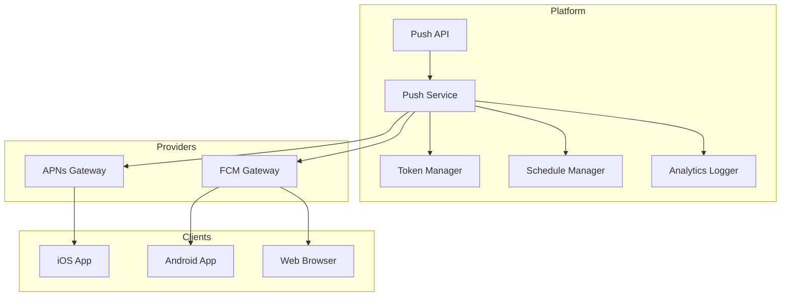
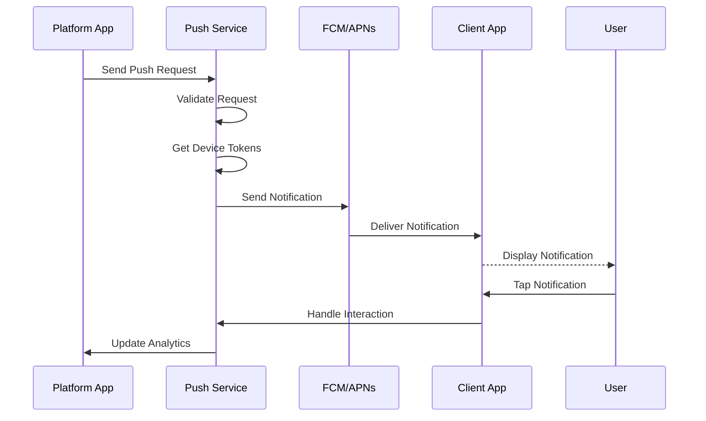

# Software Requirements Specification (SRS)

## Part 10B: Push Notifications

**Module:** Notifications & Communications Module (Part 11)
**Version:** 1.0.0
**Status:** Final / For Review
**Date:** 2026-06-30

---

## Chapter 1 – Overview

### Purpose

The Push Notifications module defines the comprehensive push notification capabilities for the **[Platform Name]** platform. This encompasses push notification delivery to iOS, Android, and Web clients, device management, notification payload design, user engagement tracking, and campaign management.

Push notifications are the most direct and immediate way to engage users on mobile devices. They drive user engagement, enable real-time communication, and provide critical updates about orders, deliveries, and promotions. This module ensures that push notifications are delivered reliably, securely, and with high engagement.

### Objectives

- Deliver push notifications to iOS, Android, and Web platforms
- Manage device tokens securely and reliably
- Support rich media notifications (images, actions, sounds)
- Enable user segmentation and targeting
- Track notification delivery and engagement
- Support scheduled and triggered notifications
- Implement secure push notification infrastructure
- Provide comprehensive analytics and reporting

---

## Chapter 2 – Push Infrastructure

### PUSH-001 Push Providers

| Platform | Provider | Priority |
| :--- | :--- | :--- |
| **iOS** | Apple Push Notification Service (APNs) | **Required** |
| **Android** | Firebase Cloud Messaging (FCM) | **Required** |
| **Web** | Web Push API (via FCM or VAPID) | **Required** |
| **Cross-Platform** | Firebase Cloud Messaging (unified) | **Required** |

### PUSH-002 Architecture



### PUSH-003 Delivery Flow



---

## Chapter 3 – Device Management

### PUSH-004 Device Registration

| Feature | Description | Priority |
| :--- | :--- | :--- |
| **Token Registration** | Register device push token | **Required** |
| **Token Refresh** | Refresh tokens on app update | **Required** |
| **Token Unregistration** | Remove invalid tokens | **Required** |
| **Device Metadata** | Track device type, app version, OS version | **Required** |
| **User Association** | Associate device with user | **Required** |
| **Token Expiry** | Handle token expiration | **Required** |
| **Bulk Management** | Manage tokens in bulk | **Required** |

### PUSH-005 Device Data Model

| Column | Type | Constraints | Description |
| :--- | :--- | :--- | :--- |
| `device_id` | UUID | PRIMARY KEY | Unique device identifier |
| `user_id` | UUID | FOREIGN KEY (users.user_id) | Associated user |
| `user_type` | VARCHAR(20) | NOT NULL | CUSTOMER/MERCHANT/DRIVER/ADMIN |
| `platform` | VARCHAR(20) | NOT NULL | IOS/ANDROID/WEB |
| `device_token` | VARCHAR(255) | NOT NULL | Push token from provider |
| `app_version` | VARCHAR(20) | | App version |
| `os_version` | VARCHAR(20) | | OS version |
| `model` | VARCHAR(50) | | Device model |
| `locale` | VARCHAR(10) | | Device locale |
| `timezone` | VARCHAR(50) | | Device timezone |
| `push_enabled` | BOOLEAN | DEFAULT TRUE | Push enabled status |
| `last_registered` | TIMESTAMP | | Last registration timestamp |
| `last_used` | TIMESTAMP | | Last push used timestamp |
| `is_active` | BOOLEAN | DEFAULT TRUE | Active status |
| `created_at` | TIMESTAMP | DEFAULT NOW() | Creation timestamp |
| `updated_at` | TIMESTAMP | DEFAULT NOW() | Last update timestamp |

### PUSH-006 Token Validation Rules

| Rule | Description | Priority |
| :--- | :--- | :--- |
| **Token Format** | Validate token format for platform | **Required** |
| **Token Expiry** | Remove expired tokens | **Required** |
| **Duplicate Tokens** | Prevent duplicate token registration | **Required** |
| **User Limit** | Max 5 devices per user | **Required** |
| **App Version** | Validate app version compatibility | **Required** |

---

## Chapter 4 – Notification Payload

### PUSH-007 Payload Structure

| Field | Type | Required | Description |
| :--- | :--- | :--- | :--- |
| `title` | String | Yes | Notification title |
| `body` | String | Yes | Notification body |
| `data` | JSONB | | Additional data payload |
| `icon` | String | | Notification icon URL |
| `image` | String | | Image URL (rich notification) |
| `sound` | String | | Sound file name |
| `badge` | Integer | | Badge count (iOS) |
| `category` | String | | Action category |
| `actions` | JSONB | | Interactive actions |
| `ttl` | Integer | | Time-to-live (seconds) |
| `priority` | String | | NORMAL/HIGH |
| `collapse_key` | String | | Collapse key for grouping |
| `channel_id` | String | | Android notification channel |
| `thread_id` | String | | iOS thread identifier |

### PUSH-008 iOS Payload (APNs)

```json
{
  "aps": {
    "alert": {
      "title": "Your order is being prepared!",
      "body": "Merchant Name is preparing your order #12345"
    },
    "badge": 1,
    "sound": "default",
    "category": "ORDER_STATUS",
    "thread-id": "order-12345"
  },
  "data": {
    "order_id": "12345",
    "type": "order_status_update",
    "status": "preparing",
    "merchant_name": "Merchant Name"
  }
}
```

### PUSH-009 Android Payload (FCM)

```json
{
  "notification": {
    "title": "Your order is being prepared!",
    "body": "Merchant Name is preparing your order #12345",
    "icon": "ic_notification",
    "color": "#FF5722",
    "image": "https://platform.com/images/order-12345.jpg",
    "sound": "default",
    "channel_id": "order_channel"
  },
  "data": {
    "order_id": "12345",
    "type": "order_status_update",
    "status": "preparing",
    "merchant_name": "Merchant Name",
    "click_action": "FLUTTER_NOTIFICATION_CLICK"
  },
  "android": {
    "priority": "high",
    "ttl": "86400s"
  },
  "apns": {
    "payload": {
      "aps": {
        "sound": "default"
      }
    }
  }
}
```

### PUSH-010 Web Push Payload

```json
{
  "title": "Your order is being prepared!",
  "body": "Merchant Name is preparing your order #12345",
  "icon": "https://platform.com/icon-192.png",
  "badge": "https://platform.com/badge.png",
  "image": "https://platform.com/images/order-12345.jpg",
  "data": {
    "order_id": "12345",
    "type": "order_status_update",
    "url": "https://platform.com/orders/12345"
  },
  "actions": [
    {
      "action": "view_order",
      "title": "View Order"
    },
    {
      "action": "contact_support",
      "title": "Contact Support"
    }
  ],
  "requireInteraction": true,
  "vibrate": [200, 100, 200]
}
```

### PUSH-011 Interactive Actions

| Action | Description | Priority |
| :--- | :--- | :--- |
| **View Order** | Navigate to order details | **Required** |
| **Track Delivery** | Navigate to tracking | **Required** |
| **Contact Merchant** | Open chat with merchant | **Required** |
| **Contact Driver** | Open chat with driver | **Required** |
| **Accept Order** | Driver accepts order | **Required** |
| **Decline Order** | Driver declines order | **Required** |
| **View Promo** | View promotion details | **Required** |
| **Contact Support** | Open support chat | **Required** |
| **Mark as Read** | Mark notification read | **Required** |

---

## Chapter 5 – Notification Categories

### PUSH-012 Order Notifications

| Event | Title | Body | Priority |
| :--- | :--- | :--- | :--- |
| **Order Confirmed** | "Order Confirmed!" | "Your order #{order_number} has been confirmed." | **Required** |
| **Order Preparing** | "Order Being Prepared" | "{merchant_name} is preparing your order." | **Required** |
| **Order Ready** | "Order Ready for Pickup!" | "Your order is ready for pickup at {merchant_name}." | **Required** |
| **Order Picked Up** | "Order On Its Way!" | "Your driver has picked up your order." | **Required** |
| **Order Delivered** | "Order Delivered!" | "Your order has been delivered. Enjoy!" | **Required** |
| **Order Cancelled** | "Order Cancelled" | "Your order #{order_number} has been cancelled." | **Required** |

### PUSH-013 Delivery Notifications

| Event | Title | Body | Priority |
| :--- | :--- | :--- | :--- |
| **Driver Assigned** | "Driver Assigned" | "{driver_name} has been assigned to your order." | **Required** |
| **Driver Arriving** | "Driver Arriving Soon!" | "Your driver is arriving in {eta} minutes." | **Required** |
| **Driver At Merchant** | "Driver at Restaurant" | "Your driver has arrived at {merchant_name}." | **Required** |
| **Driver On Way** | "Driver En Route" | "Your driver is on the way to you." | **Required** |
| **Driver Near** | "Driver Near You!" | "Your driver is near your location." | **Required** |

### PUSH-014 Driver Notifications

| Event | Title | Body | Priority |
| :--- | :--- | :--- | :--- |
| **New Order** | "New Order Available!" | "New order from {merchant_name} - {distance} away, ${payout}" | **Required** |
| **Order Assigned** | "Order Assigned" | "You have been assigned order #{order_number} from {merchant_name}." | **Required** |
| **Order Cancelled** | "Order Cancelled" | "Order #{order_number} has been cancelled." | **Required** |
| **Earning Update** | "Earning Added" | "You earned ${amount} from order #{order_number}." | **Required** |

### PUSH-015 Merchant Notifications

| Event | Title | Body | Priority |
| :--- | :--- | :--- | :--- |
| **New Order** | "New Order!" | "New order #{order_number} from {customer_name}." | **Required** |
| **Order Update** | "Order Updated" | "Order #{order_number} has been updated." | **Required** |
| **Order Cancelled** | "Order Cancelled" | "Order #{order_number} has been cancelled by customer." | **Required** |
| **Settlement Available** | "Settlement Available" | "Your settlement of ${amount} is available." | **Required** |

### PUSH-016 Promotional Notifications

| Event | Title | Body | Priority |
| :--- | :--- | :--- | :--- |
| **New Offer** | "New Offer Available!" | "Get {discount} off your next order!" | **Medium** |
| **Flash Sale** | "⚡ Flash Sale!" | "Limited time offer: {discount} off!" | **Medium** |
| **Personalized Offer** | "Exclusive Offer for You" | "Enjoy {discount} off at {merchant_name}." | **Medium** |
| **Referral Reward** | "Referral Reward!" | "You earned ${amount} from your referral!" | **Medium** |

---

## Chapter 6 – Delivery & Retry

### PUSH-017 Delivery Settings

| Setting | Specification | Priority |
| :--- | :--- | :--- |
| **TTL (Time-to-Live)** | 24 hours (86400 seconds) | **Required** |
| **Priority** | High for critical notifications, Normal for others | **Required** |
| **Collapse Key** | Group notifications by order/event | **Required** |
| **Retry Count** | 3 retries on failure | **Required** |
| **Retry Interval** | Exponential backoff (1min, 5min, 15min) | **Required** |
| **Fallback** | Fallback to in-app notification | **Required** |

### PUSH-018 Delivery Statuses

| Status | Description | Priority |
| :--- | :--- | :--- |
| `QUEUED` | Notification queued for delivery | **Required** |
| `SENT` | Sent to provider (FCM/APNs) | **Required** |
| `DELIVERED` | Delivered to device | **Required** |
| `OPENED` | User opened notification | **Required** |
| `DISMISSED` | User dismissed notification | **Required** |
| `FAILED` | Delivery failed | **Required** |
| `EXPIRED` | TTL expired | **Required** |

---

## Chapter 7 – Targeting & Segmentation

### PUSH-019 Targeting Criteria

| Criteria | Description | Priority |
| :--- | :--- | :--- |
| **User ID** | Specific user or users | **Required** |
| **User Type** | Customer, Merchant, Driver, Admin | **Required** |
| **Platform** | iOS, Android, Web | **Required** |
| **Location** | Geographic targeting | **Required** |
| **Language** | User language preference | **Required** |
| **User Segment** | Segment membership | **Required** |
| **Behavior** | User behavior criteria | **Required** |
| **App Version** | Minimum app version | **Required** |

### PUSH-020 Segment Data Model

| Column | Type | Constraints | Description |
| :--- | :--- | :--- | :--- |
| `segment_id` | UUID | PRIMARY KEY | Unique identifier |
| `segment_name` | VARCHAR(100) | NOT NULL | Segment name |
| `segment_criteria` | JSONB | NOT NULL | Targeting criteria |
| `user_count` | INTEGER | | Number of users in segment |
| `last_computed` | TIMESTAMP | | Last computation timestamp |
| `is_active` | BOOLEAN | DEFAULT TRUE | Active status |
| `created_by` | UUID | | Creator identifier |
| `created_at` | TIMESTAMP | DEFAULT NOW() | Creation timestamp |
| `updated_at` | TIMESTAMP | DEFAULT NOW() | Last update timestamp |

---

## Chapter 8 – Analytics & Reporting

### PUSH-021 Push Analytics

| Metric | Description | Priority |
| :--- | :--- | :--- |
| **Total Sent** | Number of notifications sent | **Required** |
| **Delivered** | Number of notifications delivered | **Required** |
| **Delivery Rate** | Delivered / Sent % | **Required** |
| **Opened** | Number of notifications opened | **Required** |
| **Open Rate** | Opened / Delivered % | **Required** |
| **Dismissed** | Number of notifications dismissed | **Required** |
| **Action Clicked** | Number of actions clicked | **Required** |
| **Click-Through Rate** | Actions / Opened % | **Required** |
| **Conversion Rate** | Conversions / Actions % | **Required** |
| **Engagement Rate** | (Opened + Actions) / Delivered % | **Required** |
| **Failure Rate** | Failed / Sent % | **Required** |
| **Average Response Time** | Time from send to open | **Required** |

### PUSH-022 Analytics Data Model

| Column | Type | Constraints | Description |
| :--- | :--- | :--- | :--- |
| `analytics_id` | UUID | PRIMARY KEY | Unique identifier |
| `notification_id` | UUID | FOREIGN KEY (notifications.notification_id) | Associated notification |
| `user_id` | UUID | | Recipient user |
| `platform` | VARCHAR(20) | | IOS/ANDROID/WEB |
| `event_type` | VARCHAR(30) | | SENT/DELIVERED/OPENED/DISMISSED/ACTION |
| `event_timestamp` | TIMESTAMP | | Event timestamp |
| `action_name` | VARCHAR(50) | | Action name (if applicable) |
| `data` | JSONB | | Additional event data |
| `created_at` | TIMESTAMP | DEFAULT NOW() | Creation timestamp |

---

## Chapter 9 – Database Tables

### push_devices

| Column | Type | Constraints | Description |
| :--- | :--- | :--- | :--- |
| `device_id` | UUID | PRIMARY KEY | Unique device identifier |
| `user_id` | UUID | FOREIGN KEY (users.user_id) | Associated user |
| `user_type` | VARCHAR(20) | NOT NULL | CUSTOMER/MERCHANT/DRIVER/ADMIN |
| `platform` | VARCHAR(20) | NOT NULL | IOS/ANDROID/WEB |
| `device_token` | VARCHAR(255) | NOT NULL | Push token |
| `app_version` | VARCHAR(20) | | App version |
| `os_version` | VARCHAR(20) | | OS version |
| `model` | VARCHAR(50) | | Device model |
| `locale` | VARCHAR(10) | | Device locale |
| `timezone` | VARCHAR(50) | | Device timezone |
| `push_enabled` | BOOLEAN | DEFAULT TRUE | Push enabled status |
| `last_registered` | TIMESTAMP | | Last registration timestamp |
| `last_used` | TIMESTAMP | | Last push used timestamp |
| `is_active` | BOOLEAN | DEFAULT TRUE | Active status |
| `created_at` | TIMESTAMP | DEFAULT NOW() | Creation timestamp |
| `updated_at` | TIMESTAMP | DEFAULT NOW() | Last update timestamp |

### push_notifications

| Column | Type | Constraints | Description |
| :--- | :--- | :--- | :--- |
| `notification_id` | UUID | PRIMARY KEY | Unique identifier |
| `user_id` | UUID | FOREIGN KEY (users.user_id) | Recipient user |
| `user_type` | VARCHAR(20) | NOT NULL | CUSTOMER/MERCHANT/DRIVER/ADMIN |
| `event_type` | VARCHAR(50) | NOT NULL | Event type |
| `title` | VARCHAR(255) | NOT NULL | Notification title |
| `body` | TEXT | NOT NULL | Notification body |
| `data` | JSONB | | Additional data |
| `platform` | VARCHAR(20) | | IOS/ANDROID/WEB/ALL |
| `provider_reference` | VARCHAR(255) | | Provider reference ID |
| `status` | VARCHAR(20) | DEFAULT 'QUEUED' | QUEUED/SENT/DELIVERED/OPENED/DISMISSED/FAILED/EXPIRED |
| `sent_at` | TIMESTAMP | | Sent timestamp |
| `delivered_at` | TIMESTAMP` | | Delivered timestamp |
| `opened_at` | TIMESTAMP` | | Opened timestamp |
| `error_message` | TEXT | | Error message |
| `created_at` | TIMESTAMP | DEFAULT NOW() | Creation timestamp |
| `updated_at` | TIMESTAMP | DEFAULT NOW() | Last update timestamp |

### push_segments

| Column | Type | Constraints | Description |
| :--- | :--- | :--- | :--- |
| `segment_id` | UUID | PRIMARY KEY | Unique identifier |
| `segment_name` | VARCHAR(100) | NOT NULL | Segment name |
| `segment_criteria` | JSONB | NOT NULL | Targeting criteria |
| `user_count` | INTEGER | | Number of users in segment |
| `last_computed` | TIMESTAMP | | Last computation timestamp |
| `is_active` | BOOLEAN | DEFAULT TRUE | Active status |
| `created_by` | UUID | | Creator identifier |
| `created_at` | TIMESTAMP | DEFAULT NOW() | Creation timestamp |
| `updated_at` | TIMESTAMP | DEFAULT NOW() | Last update timestamp |

### push_analytics

| Column | Type | Constraints | Description |
| :--- | :--- | :--- | :--- |
| `analytics_id` | UUID | PRIMARY KEY | Unique identifier |
| `notification_id` | UUID | FOREIGN KEY (push_notifications.notification_id) | Associated notification |
| `user_id` | UUID | | Recipient user |
| `platform` | VARCHAR(20) | | IOS/ANDROID/WEB |
| `event_type` | VARCHAR(30) | | SENT/DELIVERED/OPENED/DISMISSED/ACTION |
| `event_timestamp` | TIMESTAMP | | Event timestamp |
| `action_name` | VARCHAR(50) | | Action name (if applicable) |
| `data` | JSONB | | Additional event data |
| `created_at` | TIMESTAMP | DEFAULT NOW() | Creation timestamp |

### push_schedules

| Column | Type | Constraints | Description |
| :--- | :--- | :--- | :--- |
| `schedule_id` | UUID | PRIMARY KEY | Unique identifier |
| `notification_id` | UUID | FOREIGN KEY (push_notifications.notification_id) | Associated notification |
| `scheduled_at` | TIMESTAMP | NOT NULL | Scheduled delivery time |
| `is_recurring` | BOOLEAN | DEFAULT FALSE | Recurring schedule |
| `recurrence_pattern` | VARCHAR(50) | | DAILY/WEEKLY/MONTHLY |
| `recurrence_end_at` | TIMESTAMP | | Recurrence end time |
| `status` | VARCHAR(20) | DEFAULT 'SCHEDULED' | SCHEDULED/SENT/CANCELLED/FAILED |
| `created_at` | TIMESTAMP | DEFAULT NOW() | Creation timestamp |
| `updated_at` | TIMESTAMP | DEFAULT NOW() | Last update timestamp |

---

## Chapter 10 – REST APIs

### Device APIs

| Method | Endpoint | Description |
| :--- | :--- | :--- |
| `POST` | `/api/v1/push/device/register` | Register device token |
| `POST` | `/api/v1/push/device/unregister` | Unregister device token |
| `PUT` | `/api/v1/push/device/update` | Update device metadata |
| `GET` | `/api/v1/push/device` | Get user's devices |
| `DELETE` | `/api/v1/push/device/{id}` | Remove device |

### Push APIs

| Method | Endpoint | Description |
| :--- | :--- | :--- |
| `POST` | `/api/v1/push/send` | Send push notification |
| `POST` | `/api/v1/push/send/bulk` | Send bulk push notification |
| `POST` | `/api/v1/push/schedule` | Schedule push notification |
| `GET` | `/api/v1/push/notifications` | Get push notifications |
| `GET` | `/api/v1/push/notifications/{id}` | Get notification details |
| `POST` | `/api/v1/push/notifications/{id}/cancel` | Cancel scheduled notification |

### Segment APIs

| Method | Endpoint | Description |
| :--- | :--- | :--- |
| `GET` | `/api/v1/push/segments` | List segments |
| `GET` | `/api/v1/push/segments/{id}` | Get segment details |
| `POST` | `/api/v1/push/segments` | Create segment |
| `PUT` | `/api/v1/push/segments/{id}` | Update segment |
| `DELETE` | `/api/v1/push/segments/{id}` | Delete segment |
| `GET` | `/api/v1/push/segments/{id}/users` | Get users in segment |

### Analytics APIs

| Method | Endpoint | Description |
| :--- | :--- | :--- |
| `GET` | `/api/v1/push/analytics/dashboard` | Get push analytics dashboard |
| `GET` | `/api/v1/push/analytics/metrics` | Get push metrics |
| `GET` | `/api/v1/push/analytics/reports` | Get push reports |
| `GET` | `/api/v1/push/analytics/notification/{id}` | Get notification analytics |

---

## Chapter 11 – Business Rules

| Rule ID | Rule Description | Priority |
| :--- | :--- | :--- |
| **BR-PUSH-001** | Device tokens must be validated before registration. | **High** |
| **BR-PUSH-002** | Push notifications must be sent within 24 hours TTL. | **High** |
| **BR-PUSH-003** | Critical notifications have High priority, others Normal. | **High** |
| **BR-PUSH-004** | Push notifications must respect user quiet hours (except critical). | **High** |
| **BR-PUSH-005** | Promotional notifications require user opt-in. | **High** |
| **BR-PUSH-006** | Failed notifications retry up to 3 times with backoff. | **High** |
| **BR-PUSH-007** | Users can have up to 5 registered devices. | **High** |
| **BR-PUSH-008** | Push analytics must be updated in real-time. | **High** |
| **BR-PUSH-009** | Notification payload size must be under 4KB. | **High** |
| **BR-PUSH-010** | Expired tokens must be cleaned up weekly. | **High** |

---

## Chapter 12 – Acceptance Tests

| Test ID | Test Description | Priority |
| :--- | :--- | :--- |
| **TEST-PUSH-001** | iOS device registers push token successfully. | **High** |
| **TEST-PUSH-002** | Android device registers push token successfully. | **High** |
| **TEST-PUSH-003** | Web device registers push token successfully. | **High** |
| **TEST-PUSH-004** | Push notification sent to single iOS device. | **High** |
| **TEST-PUSH-005** | Push notification sent to single Android device. | **High** |
| **TEST-PUSH-006** | Push notification sent to all user devices. | **High** |
| **TEST-PUSH-007** | Rich push notification with image sent. | **High** |
| **TEST-PUSH-008** | Interactive push notification with actions sent. | **High** |
| **TEST-PUSH-009** | Push notification action handled correctly. | **High** |
| **TEST-PUSH-010** | Scheduled push notification sent at scheduled time. | **High** |
| **TEST-PUSH-011** | Push notification delivery status tracked correctly. | **High** |
| **TEST-PUSH-012** | Push notification open tracked correctly. | **High** |
| **TEST-PUSH-013** | Push notification dismissal tracked correctly. | **High** |
| **TEST-PUSH-014** | User segment targeting works correctly. | **High** |
| **TEST-PUSH-015** | Platform targeting (iOS only) works correctly. | **High** |
| **TEST-PUSH-016** | User quiet hours respected. | **High** |
| **TEST-PUSH-017** | Critical notification overrides quiet hours. | **High** |
| **TEST-PUSH-018** | Push notification retry works on failure. | **High** |
| **TEST-PUSH-019** | Expired token cleanup works correctly. | **High** |
| **TEST-PUSH-020** | Push analytics dashboard displays correctly. | **High** |
| **TEST-PUSH-021** | Push metrics report generated correctly. | **High** |
| **TEST-PUSH-022** | Bulk push notification sent to multiple users. | **High** |
| **TEST-PUSH-023** | Notification collapse key groups correctly. | **High** |
| **TEST-PUSH-024** | User unsubscribes from push notifications. | **High** |
| **TEST-PUSH-025** | Push delivery rate > 95%. | **High** |

---

## Chapter 13 – Traceability Matrix

| Requirement | Database Table | API Endpoint(s) | Acceptance Test |
| :--- | :--- | :--- | :--- |
| PUSH-004 | push_devices | POST /api/v1/push/device/register | TEST-PUSH-001, TEST-PUSH-002, TEST-PUSH-003 |
| PUSH-004 | push_devices | POST /api/v1/push/device/unregister | TEST-PUSH-004, TEST-PUSH-005, TEST-PUSH-006 |
| PUSH-007 | push_notifications | POST /api/v1/push/send | TEST-PUSH-007, TEST-PUSH-008 |
| PUSH-011 | push_notifications | POST /api/v1/push/send | TEST-PUSH-009 |
| PUSH-003 | push_schedules | POST /api/v1/push/schedule | TEST-PUSH-010 |
| PUSH-018 | push_notifications | GET /api/v1/push/notifications/{id} | TEST-PUSH-011, TEST-PUSH-012, TEST-PUSH-013 |
| PUSH-019 | push_segments | GET /api/v1/push/segments | TEST-PUSH-014, TEST-PUSH-015 |
| PUSH-017 | push_devices | GET /api/v1/push/devices | TEST-PUSH-016, TEST-PUSH-017 |
| PUSH-003 | push_notifications | POST /api/v1/push/send | TEST-PUSH-018 |
| PUSH-005 | push_devices | DELETE /api/v1/push/device/{id} | TEST-PUSH-019 |
| PUSH-021 | push_analytics | GET /api/v1/push/analytics/dashboard | TEST-PUSH-020, TEST-PUSH-021 |
| PUSH-003 | push_notifications | POST /api/v1/push/send/bulk | TEST-PUSH-022 |
| PUSH-007 | push_notifications | POST /api/v1/push/send | TEST-PUSH-023 |
| PUSH-005 | push_devices | PUT /api/v1/push/device/update | TEST-PUSH-024 |
| PUSH-021 | push_analytics | GET /api/v1/push/analytics/metrics | TEST-PUSH-025 |

---

## Chapter 14 – Summary

This document establishes the complete push notification capability for the **[Platform Name]** platform. Key takeaways:

- **Multi-Platform Support:** iOS (APNs), Android (FCM), and Web Push with unified delivery infrastructure.
- **Device Management:** Token registration, refresh, unregistration, and device metadata tracking.
- **Rich Notifications:** Support for images, sounds, badges, interactive actions, and deep linking.
- **Targeting & Segmentation:** User-based, platform-based, location-based, and behavior-based targeting.
- **Scheduled Notifications:** Future-dated and recurring notification scheduling.
- **Delivery Tracking:** Real-time tracking of delivery status (queued, sent, delivered, opened, dismissed, failed).
- **Engagement Analytics:** Delivery rate, open rate, click-through rate, and conversion rate tracking.
- **User Control:** Opt-in/out, quiet hours, and per-device preferences.
- **Reliability:** Retry with exponential backoff, TTL management, and fallback to in-app notifications.

The push notifications module enables immediate, engaging, and targeted communication with users across all mobile platforms.

---

**Next Document:**

`Part_10C_Email_Communications.md`

*(This builds on the notification engine to define email communication capabilities.)*