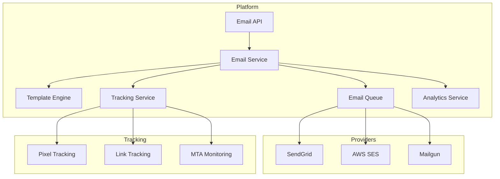

# Software Requirements Specification (SRS)

## Part 10C: Email Communications

**Module:** Notifications & Communications Module (Part 11)
**Version:** 1.0.0
**Status:** Final / For Review
**Date:** 2026-06-30

---

## Chapter 1 – Overview

### Purpose

The Email Communications module defines the comprehensive email capabilities for the **[Platform Name]** platform. This encompasses transactional emails, marketing emails, template management, delivery tracking, user engagement analytics, and compliance with email regulations (CAN-SPAM, GDPR, CASL).

Email remains a critical communication channel for the platform. Transactional emails provide essential order confirmations, delivery updates, and receipts. Marketing emails drive engagement, promote offers, and build customer loyalty. This module ensures that all emails are delivered reliably, rendered beautifully, and comply with regulatory requirements.

### Objectives

- Deliver transactional emails reliably and promptly
- Support marketing email campaigns
- Provide template management with personalization
- Track email delivery, open, and click engagement
- Ensure compliance with email regulations (CAN-SPAM, GDPR)
- Support unsubscribe and preference management
- Enable A/B testing for email campaigns
- Provide comprehensive email analytics and reporting

---

## Chapter 2 – Architecture

### EMAIL-001 Architecture



### EMAIL-002 Components

| Component | Description | Priority |
| :--- | :--- | :--- |
| **Email API** | API for sending emails | **Required** |
| **Email Service** | Core email processing logic | **Required** |
| **Template Engine** | Render email templates | **Required** |
| **Email Queue** | Queue for asynchronous sending | **Required** |
| **Tracking Service** | Track opens, clicks, bounces | **Required** |
| **Analytics Service** | Email analytics and reporting | **Required** |
| **Provider Adapters** | Adapters for email providers | **Required** |

---

## Chapter 3 – Email Types

### EMAIL-003 Transactional Emails

| Type | Description | Priority |
| :--- | :--- | :--- |
| **Order Confirmation** | Order placed confirmation | **Required** |
| **Order Update** | Order status change notification | **Required** |
| **Delivery Notification** | Delivery status updates | **Required** |
| **Order Receipt** | Order receipt with details | **Required** |
| **Payment Confirmation** | Payment success notification | **Required** |
| **Payment Failed** | Payment failure notification | **Required** |
| **Refund Notification** | Refund processed notification | **Required** |
| **Account Verification** | Email verification | **Required** |
| **Password Reset** | Password reset link | **Required** |
| **Welcome Email** | New user welcome | **Required** |
| **Password Changed** | Password change confirmation | **Required** |
| **Email Changed** | Email change confirmation | **Required** |
| **Merchant Welcome** | Merchant onboarding welcome | **Required** |
| **Driver Welcome** | Driver onboarding welcome | **Required** |
| **Settlement Available** | Merchant settlement notification | **Required** |
| **Driver Earnings** | Driver earnings report | **Required** |

### EMAIL-004 Marketing Emails

| Type | Description | Priority |
| :--- | :--- | :--- |
| **Newsletter** | Regular platform newsletter | **Required** |
| **Promotional Offers** | Discount and promotion emails | **Required** |
| **Abandoned Cart** | Cart abandonment reminder | **Required** |
| **Re-engagement** | Dormant user re-engagement | **Required** |
| **Referral** | Referral program emails | **Required** |
| **Birthday** | Birthday promotion | **Required** |
| **Anniversary** | Account anniversary | **Required** |
| **Seasonal Campaigns** | Seasonal promotions | **Required** |
| **Merchant Spotlight** | Featured merchant emails | **Required** |
| **Category Spotlight** | Featured category emails | **Required** |

---

## Chapter 4 – Email Templates

### EMAIL-005 Template Features

| Feature | Description | Priority |
| :--- | :--- | :--- |
| **Template Creation** | Create HTML email templates | **Required** |
| **Template Management** | Edit, delete, version templates | **Required** |
| **Variable Substitution** | Dynamic variables in templates | **Required** |
| **Conditional Content** | Condition-based content blocks | **Required** |
| **Responsive Design** | Mobile-responsive templates | **Required** |
| **Branding** | Platform branding and styling | **Required** |
| **Preview** | Preview templates with sample data | **Required** |
| **Testing** | Send test emails | **Required** |
| **Versioning** | Template version history | **Required** |

### EMAIL-006 Template Data Model

| Column | Type | Constraints | Description |
| :--- | :--- | :--- | :--- |
| `template_id` | UUID | PRIMARY KEY | Unique identifier |
| `template_name` | VARCHAR(100) | NOT NULL | Template name |
| `template_type` | VARCHAR(30) | NOT NULL | TRANSACTIONAL/MARKETING |
| `subject` | VARCHAR(255) | NOT NULL | Email subject line |
| `body_html` | TEXT | NOT NULL | HTML email body |
| `body_text` | TEXT | | Plain text email body |
| `variables` | JSONB | | Required variables |
| `branding` | JSONB | | Branding configuration |
| `version` | INTEGER | DEFAULT 1 | Template version |
| `status` | VARCHAR(20) | DEFAULT 'DRAFT' | DRAFT/ACTIVE/ARCHIVED |
| `created_by` | UUID | | Creator identifier |
| `created_at` | TIMESTAMP | DEFAULT NOW() | Creation timestamp |
| `updated_at` | TIMESTAMP | DEFAULT NOW() | Last update timestamp |

### EMAIL-007 Template Example

```html
<!DOCTYPE html>
<html>
<head>
    <meta charset="UTF-8">
    <meta name="viewport" content="width=device-width, initial-scale=1.0">
    <title>{subject}</title>
    <style>
        body { font-family: Arial, sans-serif; margin: 0; padding: 0; background: #f4f4f4; }
        .container { max-width: 600px; margin: 0 auto; padding: 20px; background: #ffffff; }
        .header { background: #ff5722; padding: 20px; text-align: center; }
        .header h1 { color: #ffffff; margin: 0; }
        .content { padding: 20px; }
        .order-details { background: #f9f9f9; padding: 15px; border-radius: 5px; }
        .footer { padding: 20px; text-align: center; font-size: 12px; color: #888888; }
        .button { background: #ff5722; color: #ffffff; padding: 12px 30px; text-decoration: none; border-radius: 5px; display: inline-block; }
    </style>
</head>
<body>
    <div class="container">
        <div class="header">
            <h1>{platform_name}</h1>
        </div>
        
        <div class="content">
            <h2>Hello {user_first_name},</h2>
            
            <p>Great news! Your order #{order_number} from <strong>{merchant_name}</strong> has been confirmed and is being prepared.</p>
            
            <div class="order-details">
                <h3>Order Details</h3>
                <p><strong>Order Number:</strong> #{order_number}</p>
                <p><strong>Merchant:</strong> {merchant_name}</p>
                <p><strong>Total:</strong> {total}</p>
                <p><strong>Delivery Address:</strong> {delivery_address}</p>
                <p><strong>Estimated Delivery:</strong> {estimated_delivery_time}</p>
            </div>
            
            <p style="text-align: center; margin: 30px 0;">
                <a href="{tracking_url}" class="button">Track Your Order</a>
            </p>
            
            <p>Thank you for choosing {platform_name}!</p>
            
            <p style="font-size: 14px; color: #666;">
                Questions? <a href="{support_url}">Contact Support</a>
            </p>
        </div>
        
        <div class="footer">
            <p>&copy; {year} {platform_name}. All rights reserved.</p>
            <p>
                <a href="{unsubscribe_url}">Unsubscribe</a> |
                <a href="{privacy_url}">Privacy Policy</a> |
                <a href="{terms_url}">Terms of Service</a>
            </p>
        </div>
    </div>
</body>
</html>
```

---

## Chapter 5 – Email Delivery

### EMAIL-008 Provider Selection

| Provider | Use Case | Priority |
| :--- | :--- | :--- |
| **SendGrid** | Primary provider (marketing + transactional) | **Required** |
| **AWS SES** | Transactional email (cost-effective) | **Required** |
| **Mailgun** | Backup/fallback provider | **Required** |

### EMAIL-009 Delivery Settings

| Setting | Specification | Priority |
| :--- | :--- | :--- |
| **Max Retry** | 3 retries on failure | **Required** |
| **Retry Interval** | Exponential backoff (5min, 15min, 1hr) | **Required** |
| **Rate Limit** | Respect provider rate limits | **Required** |
| **Batch Size** | Max 1000 emails per batch | **Required** |
| **Throttling** | Throttle based on provider capacity | **Required** |
| **IP Pool** | Dedicated IP pool for sending | **Required** |

### EMAIL-010 Delivery Statuses

| Status | Description | Priority |
| :--- | :--- | :--- |
| `QUEUED` | Email queued for sending | **Required** |
| `SENT` | Sent to provider | **Required** |
| `DELIVERED` | Delivered to recipient | **Required** |
| `OPENED` | Email opened by recipient | **Required** |
| `CLICKED` | Link clicked in email | **Required** |
| `BOUNCED` | Email bounced (hard/soft) | **Required** |
| `SPAM` | Email marked as spam | **Required** |
| `UNSUBSCRIBED` | Recipient unsubscribed | **Required** |
| `FAILED` | Delivery failed | **Required** |

---

## Chapter 6 – Tracking & Analytics

### EMAIL-011 Tracking Features

| Feature | Description | Priority |
| :--- | :--- | :--- |
| **Open Tracking** | Track email opens (pixel) | **Required** |
| **Click Tracking** | Track link clicks | **Required** |
| **Bounce Tracking** | Track hard/soft bounces | **Required** |
| **Spam Tracking** | Track spam complaints | **Required** |
| **Unsubscribe Tracking** | Track unsubscribes | **Required** |
| **UTM Parameters** | Marketing attribution | **Required** |
| **Real-time Updates** | Real-time tracking updates | **Required** |

### EMAIL-012 Email Metrics

| Metric | Description | Priority |
| :--- | :--- | :--- |
| **Sent** | Total emails sent | **Required** |
| **Delivered** | Emails delivered | **Required** |
| **Delivery Rate** | Delivered / Sent % | **Required** |
| **Opened** | Emails opened | **Required** |
| **Open Rate** | Opened / Delivered % | **Required** |
| **Clicked** | Clicks on links | **Required** |
| **Click-Through Rate** | Clicks / Delivered % | **Required** |
| **Bounce Rate** | Bounces / Sent % | **Required** |
| **Spam Rate** | Spam complaints / Sent % | **Required** |
| **Unsubscribe Rate** | Unsubscribes / Delivered % | **Required** |
| **Conversion Rate** | Conversions / Clicks % | **Required** |

### EMAIL-013 Analytics Data Model

| Column | Type | Constraints | Description |
| :--- | :--- | :--- | :--- |
| `analytics_id` | UUID | PRIMARY KEY | Unique identifier |
| `email_id` | UUID | FOREIGN KEY (emails.email_id) | Associated email |
| `user_id` | UUID | | Recipient user |
| `event_type` | VARCHAR(30) | | SENT/DELIVERED/OPENED/CLICKED/BOUNCED/SPAM/UNSUBSCRIBED |
| `event_timestamp` | TIMESTAMP | | Event timestamp |
| `link_url` | VARCHAR(500) | | Clicked link URL |
| `user_agent` | TEXT` | | Browser/user agent |
| `ip_address` | VARCHAR(45) | | IP address |
| `metadata` | JSONB | | Additional event data |
| `created_at` | TIMESTAMP | DEFAULT NOW() | Creation timestamp |

---

## Chapter 7 – Compliance

### EMAIL-014 Regulatory Compliance

| Regulation | Requirement | Priority |
| :--- | :--- | :--- |
| **CAN-SPAM** | Opt-out mechanism, physical address | **Required** |
| **GDPR** | Consent, data subject rights | **Required** |
| **CASL** | Implied/express consent | **Required** |
| **CCPA** | Privacy rights, opt-out | **Required** |

### EMAIL-015 Compliance Features

| Feature | Description | Priority |
| :--- | :--- | :--- |
| **Unsubscribe Link** | One-click unsubscribe | **Required** |
| **Physical Address** | Business address in footer | **Required** |
| **Consent Tracking** | Track consent for marketing emails | **Required** |
| **Double Opt-In** | Double opt-in for marketing emails | **Required** |
| **Preference Management** | Manage email preferences | **Required** |
| **Privacy Policy** | Privacy policy link in footer | **Required** |
| **Data Subject Rights** | Access, rectification, deletion | **Required** |

---

## Chapter 8 – Database Tables

### email_templates

| Column | Type | Constraints | Description |
| :--- | :--- | :--- | :--- |
| `template_id` | UUID | PRIMARY KEY | Unique identifier |
| `template_name` | VARCHAR(100) | NOT NULL | Template name |
| `template_type` | VARCHAR(30) | NOT NULL | TRANSACTIONAL/MARKETING |
| `subject` | VARCHAR(255) | NOT NULL | Email subject line |
| `body_html` | TEXT | NOT NULL | HTML email body |
| `body_text` | TEXT | | Plain text email body |
| `variables` | JSONB | | Required variables |
| `branding` | JSONB | | Branding configuration |
| `version` | INTEGER | DEFAULT 1 | Template version |
| `status` | VARCHAR(20) | DEFAULT 'DRAFT' | DRAFT/ACTIVE/ARCHIVED |
| `created_by` | UUID | | Creator identifier |
| `created_at` | TIMESTAMP | DEFAULT NOW() | Creation timestamp |
| `updated_at` | TIMESTAMP | DEFAULT NOW() | Last update timestamp |

### emails

| Column | Type | Constraints | Description |
| :--- | :--- | :--- | :--- |
| `email_id` | UUID | PRIMARY KEY | Unique identifier |
| `user_id` | UUID | FOREIGN KEY (users.user_id) | Recipient user |
| `user_type` | VARCHAR(20) | NOT NULL | CUSTOMER/MERCHANT/DRIVER/ADMIN |
| `email_type` | VARCHAR(30) | NOT NULL | TRANSACTIONAL/MARKETING |
| `template_id` | UUID | FOREIGN KEY (email_templates.template_id) | Template used |
| `subject` | VARCHAR(255) | NOT NULL | Email subject |
| `body_html` | TEXT | NOT NULL | HTML body |
| `body_text` | TEXT | | Plain text body |
| `status` | VARCHAR(20) | DEFAULT 'QUEUED' | QUEUED/SENT/DELIVERED/OPENED/CLICKED/BOUNCED/SPAM/UNSUBSCRIBED/FAILED |
| `provider` | VARCHAR(50) | | Provider used |
| `provider_reference` | VARCHAR(255) | | Provider reference ID |
| `sent_at` | TIMESTAMP | | Sent timestamp |
| `delivered_at` | TIMESTAMP` | | Delivered timestamp |
| `opened_at` | TIMESTAMP` | | Opened timestamp |
| `bounced_at` | TIMESTAMP` | | Bounced timestamp |
| `error_message` | TEXT | | Error message |
| `metadata` | JSONB | | Additional data |
| `created_at` | TIMESTAMP | DEFAULT NOW() | Creation timestamp |
| `updated_at` | TIMESTAMP | DEFAULT NOW() | Last update timestamp |

### email_campaigns

| Column | Type | Constraints | Description |
| :--- | :--- | :--- | :--- |
| `campaign_id` | UUID | PRIMARY KEY | Unique identifier |
| `campaign_name` | VARCHAR(100) | NOT NULL | Campaign name |
| `campaign_type` | VARCHAR(30) | NOT NULL | NEWSLETTER/PROMOTIONAL/ABANDONED_CART/RE_ENGAGEMENT/REFERRAL/SEASONAL |
| `template_id` | UUID | FOREIGN KEY (email_templates.template_id) | Template used |
| `subject` | VARCHAR(255) | NOT NULL | Email subject |
| `target_segment` | JSONB | | Targeting criteria |
| `scheduled_at` | TIMESTAMP | | Scheduled send time |
| `status` | VARCHAR(20) | DEFAULT 'DRAFT' | DRAFT/SCHEDULED/SENT/PAUSED/COMPLETED |
| `total_sent` | INTEGER | | Total emails sent |
| `total_delivered` | INTEGER` | | Total delivered |
| `total_opened` | INTEGER` | | Total opened |
| `total_clicked` | INTEGER` | | Total clicked |
| `total_bounced` | INTEGER` | | Total bounced |
| `created_by` | UUID | | Creator identifier |
| `created_at` | TIMESTAMP | DEFAULT NOW() | Creation timestamp |
| `updated_at` | TIMESTAMP | DEFAULT NOW() | Last update timestamp |

### email_analytics

| Column | Type | Constraints | Description |
| :--- | :--- | :--- | :--- |
| `analytics_id` | UUID | PRIMARY KEY | Unique identifier |
| `email_id` | UUID | FOREIGN KEY (emails.email_id) | Associated email |
| `user_id` | UUID | | Recipient user |
| `event_type` | VARCHAR(30) | | SENT/DELIVERED/OPENED/CLICKED/BOUNCED/SPAM/UNSUBSCRIBED |
| `event_timestamp` | TIMESTAMP | | Event timestamp |
| `link_url` | VARCHAR(500) | | Clicked link URL |
| `user_agent` | TEXT | | Browser/user agent |
| `ip_address` | VARCHAR(45) | | IP address |
| `metadata` | JSONB | | Additional event data |
| `created_at` | TIMESTAMP | DEFAULT NOW() | Creation timestamp |

### email_unsubscribes

| Column | Type | Constraints | Description |
| :--- | :--- | :--- | :--- |
| `unsubscribe_id` | UUID | PRIMARY KEY | Unique identifier |
| `user_id` | UUID | FOREIGN KEY (users.user_id) | Associated user |
| `email_id` | UUID | FOREIGN KEY (emails.email_id) | Associated email |
| `reason` | VARCHAR(100) | | Unsubscribe reason |
| `ip_address` | VARCHAR(45) | | IP address |
| `user_agent` | TEXT | | Browser/user agent |
| `created_at` | TIMESTAMP | DEFAULT NOW() | Creation timestamp |

---

## Chapter 9 – REST APIs

### Email APIs

| Method | Endpoint | Description |
| :--- | :--- | :--- |
| `POST` | `/api/v1/email/send` | Send email |
| `POST` | `/api/v1/email/send/bulk` | Send bulk email |
| `GET` | `/api/v1/email/emails` | List emails |
| `GET` | `/api/v1/email/emails/{id}` | Get email details |
| `GET` | `/api/v1/email/user/{id}` | Get emails for user |

### Template APIs

| Method | Endpoint | Description |
| :--- | :--- | :--- |
| `GET` | `/api/v1/email/templates` | List templates |
| `GET` | `/api/v1/email/templates/{id}` | Get template details |
| `POST` | `/api/v1/email/templates` | Create template |
| `PUT` | `/api/v1/email/templates/{id}` | Update template |
| `DELETE` | `/api/v1/email/templates/{id}` | Delete template |
| `POST` | `/api/v1/email/templates/{id}/preview` | Preview template |
| `POST` | `/api/v1/email/templates/{id}/test` | Send test email |

### Campaign APIs

| Method | Endpoint | Description |
| :--- | :--- | :--- |
| `GET` | `/api/v1/email/campaigns` | List campaigns |
| `GET` | `/api/v1/email/campaigns/{id}` | Get campaign details |
| `POST` | `/api/v1/email/campaigns` | Create campaign |
| `PUT` | `/api/v1/email/campaigns/{id}` | Update campaign |
| `DELETE` | `/api/v1/email/campaigns/{id}` | Delete campaign |
| `POST` | `/api/v1/email/campaigns/{id}/schedule` | Schedule campaign |
| `POST` | `/api/v1/email/campaigns/{id}/send` | Send campaign now |
| `POST` | `/api/v1/email/campaigns/{id}/pause` | Pause campaign |
| `POST` | `/api/v1/email/campaigns/{id}/resume` | Resume campaign |

### Preference APIs

| Method | Endpoint | Description |
| :--- | :--- | :--- |
| `GET` | `/api/v1/email/preferences` | Get email preferences |
| `PUT` | `/api/v1/email/preferences` | Update email preferences |
| `POST` | `/api/v1/email/unsubscribe` | Unsubscribe from emails |

### Analytics APIs

| Method | Endpoint | Description |
| :--- | :--- | :--- |
| `GET` | `/api/v1/email/analytics/dashboard` | Get email analytics |
| `GET` | `/api/v1/email/analytics/metrics` | Get email metrics |
| `GET` | `/api/v1/email/analytics/reports` | Get email reports |

---

## Chapter 10 – Business Rules

| Rule ID | Rule Description | Priority |
| :--- | :--- | :--- |
| **BR-EMAIL-001** | All marketing emails must include an unsubscribe link. | **High** |
| **BR-EMAIL-002** | Marketing emails require user opt-in consent. | **High** |
| **BR-EMAIL-003** | Transactional emails do not require opt-in. | **High** |
| **BR-EMAIL-004** | Emails must be sent within 5 minutes of request. | **High** |
| **BR-EMAIL-005** | Failed emails retry up to 3 times with backoff. | **High** |
| **BR-EMAIL-006** | Email templates must be responsive for mobile. | **High** |
| **BR-EMAIL-007** | Physical business address must be in email footer. | **High** |
| **BR-EMAIL-008** | Privacy policy link must be in email footer. | **High** |
| **BR-EMAIL-009** | Tracking pixels must be 1x1 transparent. | **High** |
| **BR-EMAIL-010** | Email analytics must be updated in real-time. | **High** |

---

## Chapter 11 – Acceptance Tests

| Test ID | Test Description | Priority |
| :--- | :--- | :--- |
| **TEST-EMAIL-001** | Transactional email sent and delivered successfully. | **High** |
| **TEST-EMAIL-002** | Marketing email sent and delivered successfully. | **High** |
| **TEST-EMAIL-003** | Email template created and rendered correctly. | **High** |
| **TEST-EMAIL-004** | Email template variables substituted correctly. | **High** |
| **TEST-EMAIL-005** | Email open tracking works correctly. | **High** |
| **TEST-EMAIL-006** | Email click tracking works correctly. | **High** |
| **TEST-EMAIL-007** | Email bounce tracking works correctly. | **High** |
| **TEST-EMAIL-008** | Email unsubscribe link works correctly. | **High** |
| **TEST-EMAIL-009** | Email campaign created and scheduled. | **High** |
| **TEST-EMAIL-010** | Email campaign sent on schedule. | **High** |
| **TEST-EMAIL-011** | Email campaign paused and resumed. | **High** |
| **TEST-EMAIL-012** | User email preferences updated correctly. | **High** |
| **TEST-EMAIL-013** | User unsubscribes from all emails. | **High** |
| **TEST-EMAIL-014** | HTML email renders correctly. | **High** |
| **TEST-EMAIL-015** | Plain text email renders correctly. | **High** |
| **TEST-EMAIL-016** | Email analytics dashboard displays correctly. | **High** |
| **TEST-EMAIL-017** | Email metrics report generated correctly. | **High** |
| **TEST-EMAIL-018** | Bulk email sent to multiple recipients. | **High** |
| **TEST-EMAIL-019** | Email retry works on failure. | **High** |
| **TEST-EMAIL-020** | A/B test email campaign works correctly. | **High** |
| **TEST-EMAIL-021** | Email GDPR compliance (access, deletion). | **High** |
| **TEST-EMAIL-022** | Email CAN-SPAM compliance verified. | **High** |
| **TEST-EMAIL-023** | Email personalization works correctly. | **High** |
| **TEST-EMAIL-024** | Email delivery rate > 98%. | **High** |
| **TEST-EMAIL-025** | Email open rate tracked correctly. | **High** |

---

## Chapter 12 – Traceability Matrix

| Requirement | Database Table | API Endpoint(s) | Acceptance Test |
| :--- | :--- | :--- | :--- |
| EMAIL-003 | emails | POST /api/v1/email/send | TEST-EMAIL-001, TEST-EMAIL-002 |
| EMAIL-005 | email_templates | POST /api/v1/email/templates | TEST-EMAIL-003, TEST-EMAIL-004 |
| EMAIL-011 | email_analytics | GET /api/v1/email/analytics/dashboard | TEST-EMAIL-005, TEST-EMAIL-006, TEST-EMAIL-007 |
| EMAIL-015 | email_unsubscribes | POST /api/v1/email/unsubscribe | TEST-EMAIL-008 |
| EMAIL-008 | email_campaigns | POST /api/v1/email/campaigns | TEST-EMAIL-009, TEST-EMAIL-010, TEST-EMAIL-011 |
| EMAIL-009 | email_preferences | PUT /api/v1/email/preferences | TEST-EMAIL-012, TEST-EMAIL-013 |
| EMAIL-005 | email_templates | GET /api/v1/email/templates/{id} | TEST-EMAIL-014, TEST-EMAIL-015 |
| EMAIL-012 | email_analytics | GET /api/v1/email/analytics/metrics | TEST-EMAIL-016, TEST-EMAIL-017 |
| EMAIL-008 | emails | POST /api/v1/email/send/bulk | TEST-EMAIL-018 |
| EMAIL-009 | emails | POST /api/v1/email/send | TEST-EMAIL-019 |
| EMAIL-004 | email_campaigns | POST /api/v1/email/campaigns | TEST-EMAIL-020 |
| EMAIL-014 | email_preferences | GET /api/v1/email/preferences | TEST-EMAIL-021, TEST-EMAIL-022 |
| EMAIL-005 | email_templates | POST /api/v1/email/templates/{id}/preview | TEST-EMAIL-023 |
| EMAIL-012 | email_analytics | GET /api/v1/email/analytics/reports | TEST-EMAIL-024, TEST-EMAIL-025 |

---

## Chapter 13 – Summary

This document establishes the complete email communications capability for the **[Platform Name]** platform. Key takeaways:

- **Transactional & Marketing Emails:** Order confirmations, delivery updates, receipts, welcome emails, newsletters, promotions, and abandoned cart reminders.
- **Template Management:** Centralized template creation, editing, versioning, and testing with variable substitution and conditional content.
- **Provider Integration:** Support for SendGrid, AWS SES, and Mailgun with automatic failover.
- **Delivery Tracking:** Real-time tracking of sent, delivered, opened, clicked, bounced, and unsubscribed.
- **Analytics:** Comprehensive metrics (delivery rate, open rate, click-through rate, bounce rate, unsubscribe rate).
- **Campaign Management:** Scheduled, triggered, and one-off email campaigns with targeting and segmentation.
- **Compliance:** CAN-SPAM, GDPR, CASL, and CCPA compliance with unsubscribe links, consent tracking, and double opt-in.
- **Personalization:** User-specific variables, dynamic content, and conditional blocks.

The email communications module ensures reliable, engaging, and compliant email delivery across all user types and use cases.

---

**Next Document:**

`Part_10D_SMS_Communications.md`

*(This builds on email communications to define SMS communication capabilities.)*
