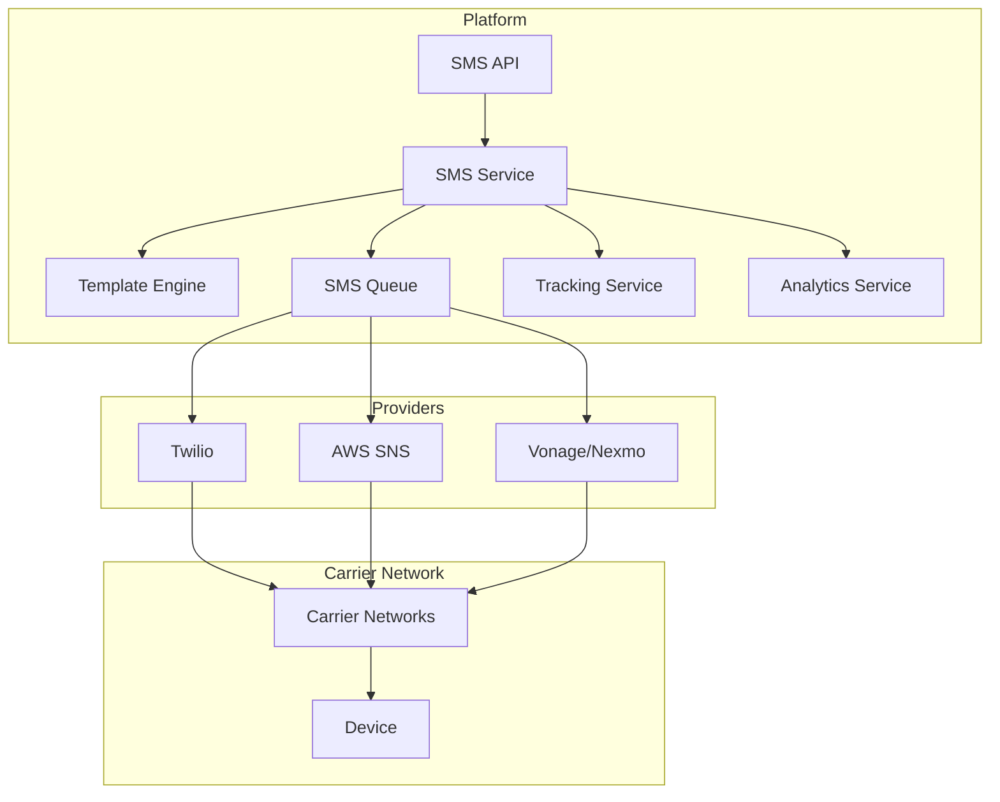

# Software Requirements Specification (SRS)

## Part 10D: SMS Communications

**Module:** Notifications & Communications Module (Part 11)
**Version:** 1.0.0
**Status:** Final / For Review
**Date:** 2026-06-30

---

## Chapter 1 – Overview

### Purpose

The SMS Communications module defines the comprehensive SMS messaging capabilities for the **[Platform Name]** platform. This encompasses transactional SMS, marketing SMS, template management, delivery tracking, user engagement analytics, and compliance with telecom regulations (TCPA, GDPR, local regulations).

SMS remains one of the most reliable and immediate communication channels, particularly for time-sensitive notifications like order confirmations, delivery updates, and OTP authentication. This module ensures that SMS messages are delivered reliably, comply with regulatory requirements, and provide a seamless communication experience.

### Objectives

- Deliver transactional SMS messages reliably
- Support marketing SMS campaigns (where permitted)
- Provide template management with personalization
- Track SMS delivery and engagement metrics
- Ensure compliance with TCPA, GDPR, and local regulations
- Support opt-in/out and preference management
- Enable global SMS delivery with local numbers
- Provide comprehensive SMS analytics and reporting

---

## Chapter 2 – Architecture

### SMS-001 Architecture



### SMS-002 Components

| Component | Description | Priority |
| :--- | :--- | :--- |
| **SMS API** | API for sending SMS messages | **Required** |
| **SMS Service** | Core SMS processing logic | **Required** |
| **Template Engine** | Render SMS templates | **Required** |
| **SMS Queue** | Queue for asynchronous sending | **Required** |
| **Provider Adapters** | Adapters for SMS providers | **Required** |
| **Tracking Service** | Track delivery status | **Required** |
| **Analytics Service** | SMS analytics and reporting | **Required** |
| **Opt-Out Manager** | Manage opt-out requests | **Required** |

---

## Chapter 3 – SMS Types

### SMS-003 Transactional SMS

| Type | Description | Priority |
| :--- | :--- | :--- |
| **Order Confirmation** | Order placed confirmation | **Required** |
| **Order Update** | Order status change notification | **Required** |
| **Delivery Notification** | Delivery status updates | **Required** |
| **Driver Assignment** | Driver assigned notification | **Required** |
| **Driver Arriving** | Driver ETA notification | **Required** |
| **OTP Authentication** | One-time password for login | **Required** |
| **Payment Confirmation** | Payment success notification | **Required** |
| **Payment Failed** | Payment failure notification | **Required** |
| **Refund Notification** | Refund processed notification | **Required** |
| **Settlement Available** | Merchant settlement notification | **Required** |
| **Driver Earnings** | Driver earnings update | **Required** |
| **Password Reset** | Password reset link | **Required** |

### SMS-004 Marketing SMS

| Type | Description | Priority |
| :--- | :--- | :--- |
| **Promotional Offers** | Discount and promotion SMS | **Required** |
| **Flash Sales** | Limited-time flash sale alerts | **Required** |
| **Re-engagement** | Dormant user re-engagement | **Required** |
| **Referral** | Referral program SMS | **Required** |
| **Birthday** | Birthday promotion | **Required** |
| **Anniversary** | Account anniversary | **Required** |
| **Seasonal Campaigns** | Seasonal promotions | **Required** |

---

## Chapter 4 – SMS Templates

### SMS-005 Template Features

| Feature | Description | Priority |
| :--- | :--- | :--- |
| **Template Creation** | Create SMS templates | **Required** |
| **Template Management** | Edit, delete, version templates | **Required** |
| **Variable Substitution** | Dynamic variables in templates | **Required** |
| **Character Counting** | Count characters for SMS segments | **Required** |
| **Unicode Support** | Support for non-Latin characters | **Required** |
| **Preview** | Preview templates with sample data | **Required** |
| **Testing** | Send test SMS | **Required** |

### SMS-006 Template Data Model

| Column | Type | Constraints | Description |
| :--- | :--- | :--- | :--- |
| `template_id` | UUID | PRIMARY KEY | Unique identifier |
| `template_name` | VARCHAR(100) | NOT NULL | Template name |
| `template_type` | VARCHAR(30) | NOT NULL | TRANSACTIONAL/MARKETING |
| `body` | TEXT | NOT NULL | SMS body |
| `variables` | JSONB` | | Required variables |
| `character_count` | INTEGER | | Character count |
| `segment_count` | INTEGER | | SMS segment count |
| `language` | VARCHAR(5) | DEFAULT 'en' | ISO 639-1 language |
| `version` | INTEGER | DEFAULT 1 | Template version |
| `status` | VARCHAR(20) | DEFAULT 'DRAFT' | DRAFT/ACTIVE/ARCHIVED |
| `created_by` | UUID | | Creator identifier |
| `created_at` | TIMESTAMP | DEFAULT NOW() | Creation timestamp |
| `updated_at` | TIMESTAMP | DEFAULT NOW() | Last update timestamp |

### SMS-007 Template Example

```text
Order Confirmation:
#{order_number} from {merchant_name} confirmed!
Estimated delivery: {estimated_delivery_time}
Track: {tracking_url}

Delivery Update:
Order #{order_number} is out for delivery!
Driver: {driver_name}
ETA: {eta} minutes
Track: {tracking_url}

OTP Authentication:
Your verification code is: {otp_code}
Valid for {expiry_minutes} minutes.
Do not share this code.

Promotional:
🎉 Exclusive Offer! Get {discount}% off your next order with code: {promo_code}
Valid until {expiry_date}
Order now: {order_url}
```

---

## Chapter 5 – SMS Delivery

### SMS-008 Provider Selection

| Provider | Use Case | Priority |
| :--- | :--- | :--- |
| **Twilio** | Primary provider (global) | **Required** |
| **AWS SNS** | Secondary/backup provider | **Required** |
| **Vonage/Nexmo** | Backup/fallback provider | **Required** |

### SMS-009 Delivery Settings

| Setting | Specification | Priority |
| :--- | :--- | :--- |
| **Max Retry** | 3 retries on failure | **Required** |
| **Retry Interval** | Exponential backoff (5min, 15min, 1hr) | **Required** |
| **Rate Limit** | Respect provider rate limits | **Required** |
| **Batch Size** | Max 100 SMS per batch | **Required** |
| **Throttling** | Throttle based on provider capacity | **Required** |
| **Sender ID** | Configurable sender ID (alphanumeric) | **Required** |
| **Local Numbers** | Local sender numbers per region | **Required** |

### SMS-010 Delivery Statuses

| Status | Description | Priority |
| :--- | :--- | :--- |
| `QUEUED` | SMS queued for sending | **Required** |
| `SENT` | Sent to provider | **Required** |
| `DELIVERED` | Delivered to device | **Required** |
| `READ` | Recipient read the message | **Required** |
| `FAILED` | Delivery failed | **Required** |
| `UNDELIVERED` | Message undelivered | **Required** |
| `EXPIRED` | Message expired | **Required** |
| `REJECTED` | Message rejected by carrier | **Required** |

---

## Chapter 6 – Compliance & Opt-Out

### SMS-011 Regulatory Compliance

| Regulation | Requirement | Priority |
| :--- | :--- | :--- |
| **TCPA** | Prior express consent, opt-out mechanism | **Required** |
| **GDPR** | Consent, data subject rights | **Required** |
| **PIPEDA** | Consent, privacy rights | **Required** |
| **CTIA Guidelines** | Opt-out, message frequency | **Required** |

### SMS-012 Opt-Out Management

| Feature | Description | Priority |
| :--- | :--- | :--- |
| **Opt-Out Keywords** | "STOP", "UNSUBSCRIBE", "CANCEL", "QUIT" | **Required** |
| **Opt-Out Confirmation** | Confirm opt-out with reply | **Required** |
| **Opt-Out Re-opt-in** | Re-opt-in with "START", "YES" | **Required** |
| **Opt-Out Tracking** | Track all opt-out requests | **Required** |
| **Opt-Out List** | Maintain do-not-contact list | **Required** |

### SMS-013 Opt-Out Data Model

| Column | Type | Constraints | Description |
| :--- | :--- | :--- | :--- |
| `optout_id` | UUID | PRIMARY KEY | Unique identifier |
| `user_id` | UUID | FOREIGN KEY (users.user_id) | Associated user |
| `user_type` | VARCHAR(20) | NOT NULL | CUSTOMER/MERCHANT/DRIVER/ADMIN |
| `phone_number` | VARCHAR(20) | NOT NULL | Phone number opted out |
| `optout_reason` | VARCHAR(100) | | Reason for opting out |
| `optout_keyword` | VARCHAR(20) | | Keyword used to opt out |
| `source` | VARCHAR(50) | | Source of opt-out |
| `is_opted_out` | BOOLEAN | DEFAULT TRUE | Opt-out status |
| `created_at` | TIMESTAMP | DEFAULT NOW() | Opt-out timestamp |
| `updated_at` | TIMESTAMP | DEFAULT NOW() | Last update timestamp |

---

## Chapter 7 – Analytics & Reporting

### SMS-014 SMS Metrics

| Metric | Description | Priority |
| :--- | :--- | :--- |
| **Sent** | Total SMS sent | **Required** |
| **Delivered** | SMS delivered | **Required** |
| **Delivery Rate** | Delivered / Sent % | **Required** |
| **Read** | SMS read by recipient | **Required** |
| **Read Rate** | Read / Delivered % | **Required** |
| **Failed** | SMS failed | **Required** |
| **Failure Rate** | Failed / Sent % | **Required** |
| **Opt-Out Rate** | Opt-Outs / Sent % | **Required** |
| **Conversion Rate** | Conversions / Delivered % | **Required** |
| **Cost Per SMS** | Average cost per message | **Required** |

### SMS-015 Analytics Data Model

| Column | Type | Constraints | Description |
| :--- | :--- | :--- | :--- |
| `analytics_id` | UUID | PRIMARY KEY | Unique identifier |
| `sms_id` | UUID | FOREIGN KEY (sms_messages.sms_id) | Associated SMS |
| `user_id` | UUID` | | Recipient user |
| `event_type` | VARCHAR(30) | | SENT/DELIVERED/READ/FAILED/UNDELIVERED/EXPIRED/REJECTED |
| `event_timestamp` | TIMESTAMP | | Event timestamp |
| `carrier` | VARCHAR(100) | | Carrier name |
| `country` | VARCHAR(5) | | Country code |
| `metadata` | JSONB` | | Additional event data |
| `created_at` | TIMESTAMP | DEFAULT NOW() | Creation timestamp |

---

## Chapter 8 – Database Tables

### sms_templates

| Column | Type | Constraints | Description |
| :--- | :--- | :--- | :--- |
| `template_id` | UUID | PRIMARY KEY | Unique identifier |
| `template_name` | VARCHAR(100) | NOT NULL | Template name |
| `template_type` | VARCHAR(30) | NOT NULL | TRANSACTIONAL/MARKETING |
| `body` | TEXT | NOT NULL | SMS body |
| `variables` | JSONB | | Required variables |
| `character_count` | INTEGER | | Character count |
| `segment_count` | INTEGER | | SMS segment count |
| `language` | VARCHAR(5) | DEFAULT 'en' | ISO 639-1 language |
| `version` | INTEGER | DEFAULT 1 | Template version |
| `status` | VARCHAR(20) | DEFAULT 'DRAFT' | DRAFT/ACTIVE/ARCHIVED |
| `created_by` | UUID | | Creator identifier |
| `created_at` | TIMESTAMP | DEFAULT NOW() | Creation timestamp |
| `updated_at` | TIMESTAMP | DEFAULT NOW() | Last update timestamp |

### sms_messages

| Column | Type | Constraints | Description |
| :--- | :--- | :--- | :--- |
| `sms_id` | UUID | PRIMARY KEY | Unique identifier |
| `user_id` | UUID | FOREIGN KEY (users.user_id) | Recipient user |
| `user_type` | VARCHAR(20) | NOT NULL | CUSTOMER/MERCHANT/DRIVER/ADMIN |
| `sms_type` | VARCHAR(30) | NOT NULL | TRANSACTIONAL/MARKETING |
| `template_id` | UUID | FOREIGN KEY (sms_templates.template_id) | Template used |
| `phone_number` | VARCHAR(20) | NOT NULL | Recipient phone number |
| `sender_id` | VARCHAR(20) | | Sender ID/Number |
| `body` | TEXT | NOT NULL | SMS body |
| `character_count` | INTEGER | | Character count |
| `segment_count` | INTEGER` | | Segment count |
| `status` | VARCHAR(20) | DEFAULT 'QUEUED' | QUEUED/SENT/DELIVERED/READ/FAILED/UNDELIVERED/EXPIRED/REJECTED |
| `provider` | VARCHAR(50) | | Provider used |
| `provider_reference` | VARCHAR(255) | | Provider reference ID |
| `carrier` | VARCHAR(100) | | Carrier name |
| `country` | VARCHAR(5) | | Country code |
| `cost` | DECIMAL(10, 4) | | Cost of SMS |
| `sent_at` | TIMESTAMP | | Sent timestamp |
| `delivered_at` | TIMESTAMP | | Delivered timestamp |
| `read_at` | TIMESTAMP | | Read timestamp |
| `failed_at` | TIMESTAMP | | Failed timestamp |
| `error_message` | TEXT | | Error message |
| `metadata` | JSONB | | Additional data |
| `created_at` | TIMESTAMP | DEFAULT NOW() | Creation timestamp |
| `updated_at` | TIMESTAMP | DEFAULT NOW() | Last update timestamp |

### sms_campaigns

| Column | Type | Constraints | Description |
| :--- | :--- | :--- | :--- |
| `campaign_id` | UUID | PRIMARY KEY | Unique identifier |
| `campaign_name` | VARCHAR(100) | NOT NULL | Campaign name |
| `campaign_type` | VARCHAR(30) | NOT NULL | PROMOTIONAL/FLASH_SALE/RE_ENGAGEMENT/REFERRAL/SEASONAL |
| `template_id` | UUID | FOREIGN KEY (sms_templates.template_id) | Template used |
| `body` | TEXT | NOT NULL | SMS body |
| `target_segment` | JSONB | | Targeting criteria |
| `scheduled_at` | TIMESTAMP | | Scheduled send time |
| `status` | VARCHAR(20) | DEFAULT 'DRAFT' | DRAFT/SCHEDULED/SENT/PAUSED/COMPLETED |
| `total_sent` | INTEGER` | | Total SMS sent |
| `total_delivered` | INTEGER` | | Total delivered |
| `total_read` | INTEGER` | | Total read |
| `created_by` | UUID | | Creator identifier |
| `created_at` | TIMESTAMP | DEFAULT NOW() | Creation timestamp |
| `updated_at` | TIMESTAMP | DEFAULT NOW() | Last update timestamp |

### sms_optouts

| Column | Type | Constraints | Description |
| :--- | :--- | :--- | :--- |
| `optout_id` | UUID | PRIMARY KEY | Unique identifier |
| `user_id` | UUID | FOREIGN KEY (users.user_id) | Associated user |
| `user_type` | VARCHAR(20) | NOT NULL | CUSTOMER/MERCHANT/DRIVER/ADMIN |
| `phone_number` | VARCHAR(20) | NOT NULL | Phone number opted out |
| `optout_reason` | VARCHAR(100) | | Reason for opting out |
| `optout_keyword` | VARCHAR(20) | | Keyword used to opt out |
| `source` | VARCHAR(50) | | Source of opt-out |
| `is_opted_out` | BOOLEAN | DEFAULT TRUE | Opt-out status |
| `created_at` | TIMESTAMP | DEFAULT NOW() | Opt-out timestamp |
| `updated_at` | TIMESTAMP | DEFAULT NOW() | Last update timestamp |

### sms_analytics

| Column | Type | Constraints | Description |
| :--- | :--- | :--- | :--- |
| `analytics_id` | UUID | PRIMARY KEY | Unique identifier |
| `sms_id` | UUID | FOREIGN KEY (sms_messages.sms_id) | Associated SMS |
| `user_id` | UUID | | Recipient user |
| `event_type` | VARCHAR(30) | | SENT/DELIVERED/READ/FAILED/UNDELIVERED/EXPIRED/REJECTED |
| `event_timestamp` | TIMESTAMP | | Event timestamp |
| `carrier` | VARCHAR(100) | | Carrier name |
| `country` | VARCHAR(5) | | Country code |
| `metadata` | JSONB` | | Additional event data |
| `created_at` | TIMESTAMP | DEFAULT NOW() | Creation timestamp |

---

## Chapter 9 – REST APIs

### SMS APIs

| Method | Endpoint | Description |
| :--- | :--- | :--- |
| `POST` | `/api/v1/sms/send` | Send SMS |
| `POST` | `/api/v1/sms/send/bulk` | Send bulk SMS |
| `GET` | `/api/v1/sms/messages` | List SMS messages |
| `GET` | `/api/v1/sms/messages/{id}` | Get SMS details |
| `GET` | `/api/v1/sms/user/{id}` | Get SMS for user |
| `POST` | `/api/v1/sms/messages/{id}/retry` | Retry failed SMS |

### Template APIs

| Method | Endpoint | Description |
| :--- | :--- | :--- |
| `GET` | `/api/v1/sms/templates` | List templates |
| `GET` | `/api/v1/sms/templates/{id}` | Get template details |
| `POST` | `/api/v1/sms/templates` | Create template |
| `PUT` | `/api/v1/sms/templates/{id}` | Update template |
| `DELETE` | `/api/v1/sms/templates/{id}` | Delete template |
| `POST` | `/api/v1/sms/templates/{id}/preview` | Preview template |
| `POST` | `/api/v1/sms/templates/{id}/test` | Send test SMS |

### Campaign APIs

| Method | Endpoint | Description |
| :--- | :--- | :--- |
| `GET` | `/api/v1/sms/campaigns` | List campaigns |
| `GET` | `/api/v1/sms/campaigns/{id}` | Get campaign details |
| `POST` | `/api/v1/sms/campaigns` | Create campaign |
| `PUT` | `/api/v1/sms/campaigns/{id}` | Update campaign |
| `DELETE` | `/api/v1/sms/campaigns/{id}` | Delete campaign |
| `POST` | `/api/v1/sms/campaigns/{id}/schedule` | Schedule campaign |
| `POST` | `/api/v1/sms/campaigns/{id}/send` | Send campaign now |
| `POST` | `/api/v1/sms/campaigns/{id}/pause` | Pause campaign |
| `POST` | `/api/v1/sms/campaigns/{id}/resume` | Resume campaign |

### Opt-Out APIs

| Method | Endpoint | Description |
| :--- | :--- | :--- |
| `POST` | `/api/v1/sms/optout` | Opt out of SMS |
| `POST` | `/api/v1/sms/optin` | Re-opt in to SMS |
| `GET` | `/api/v1/sms/optout` | Get opt-out status |
| `GET` | `/api/v1/sms/optout/list` | Get opt-out list (admin) |

### Analytics APIs

| Method | Endpoint | Description |
| :--- | :--- | :--- |
| `GET` | `/api/v1/sms/analytics/dashboard` | Get SMS analytics |
| `GET` | `/api/v1/sms/analytics/metrics` | Get SMS metrics |
| `GET` | `/api/v1/sms/analytics/reports` | Get SMS reports |

---

## Chapter 10 – Business Rules

| Rule ID | Rule Description | Priority |
| :--- | :--- | :--- |
| **BR-SMS-001** | Marketing SMS requires prior express consent. | **High** |
| **BR-SMS-002** | Transactional SMS does not require opt-in. | **High** |
| **BR-SMS-003** | SMS messages must include opt-out instructions. | **High** |
| **BR-SMS-004** | Opt-out requests must be processed within 1 hour. | **High** |
| **BR-SMS-005** | Failed SMS retry up to 3 times with backoff. | **High** |
| **BR-SMS-006** | SMS character limit: 160 characters per segment. | **High** |
| **BR-SMS-007** | Marketing SMS limited to 5 per month per user. | **High** |
| **BR-SMS-008** | OTP codes expire after 5 minutes. | **High** |
| **BR-SMS-009** | SMS analytics must be updated in real-time. | **High** |
| **BR-SMS-010** | Opt-out list must be maintained for 7 years. | **High** |

---

## Chapter 11 – Acceptance Tests

| Test ID | Test Description | Priority |
| :--- | :--- | :--- |
| **TEST-SMS-001** | Transactional SMS sent and delivered successfully. | **High** |
| **TEST-SMS-002** | Marketing SMS sent and delivered successfully. | **High** |
| **TEST-SMS-003** | SMS template created and rendered correctly. | **High** |
| **TEST-SMS-004** | SMS template variables substituted correctly. | **High** |
| **TEST-SMS-005** | SMS delivery tracking works correctly. | **High** |
| **TEST-SMS-006** | SMS read tracking works correctly. | **High** |
| **TEST-SMS-007** | SMS campaign created and scheduled. | **High** |
| **TEST-SMS-008** | SMS campaign sent on schedule. | **High** |
| **TEST-SMS-009** | SMS campaign paused and resumed. | **High** |
| **TEST-SMS-010** | OTP SMS sent and delivered. | **High** |
| **TEST-SMS-011** | OTP code valid for 5 minutes. | **High** |
| **TEST-SMS-012** | SMS opt-out "STOP" works correctly. | **High** |
| **TEST-SMS-013** | Opt-out confirmation sent. | **High** |
| **TEST-SMS-014** | SMS re-opt-in "START" works correctly. | **High** |
| **TEST-SMS-015** | SMS analytics dashboard displays correctly. | **High** |
| **TEST-SMS-016** | SMS metrics report generated correctly. | **High** |
| **TEST-SMS-017** | Bulk SMS sent to multiple recipients. | **High** |
| **TEST-SMS-018** | SMS retry works on failure. | **High** |
| **TEST-SMS-019** | Unicode SMS support works correctly. | **High** |
| **TEST-SMS-020** | Local number support works correctly. | **High** |
| **TEST-SMS-021** | SMS personalization works correctly. | **High** |
| **TEST-SMS-022** | SMS delivery rate > 95%. | **High** |
| **TEST-SMS-023** | Opt-out rate tracked correctly. | **High** |
| **TEST-SMS-024** | Alphanumeric sender ID works correctly. | **High** |
| **TEST-SMS-025** | SMS cost tracking works correctly. | **High** |

---

## Chapter 12 – Traceability Matrix

| Requirement | Database Table | API Endpoint(s) | Acceptance Test |
| :--- | :--- | :--- | :--- |
| SMS-003 | sms_messages | POST /api/v1/sms/send | TEST-SMS-001, TEST-SMS-002, TEST-SMS-010 |
| SMS-005 | sms_templates | POST /api/v1/sms/templates | TEST-SMS-003, TEST-SMS-004 |
| SMS-010 | sms_messages | GET /api/v1/sms/messages/{id} | TEST-SMS-005, TEST-SMS-006 |
| SMS-008 | sms_campaigns | POST /api/v1/sms/campaigns | TEST-SMS-007, TEST-SMS-008, TEST-SMS-009 |
| SMS-012 | sms_optouts | POST /api/v1/sms/optout | TEST-SMS-012, TEST-SMS-013, TEST-SMS-014 |
| SMS-014 | sms_analytics | GET /api/v1/sms/analytics/dashboard | TEST-SMS-015, TEST-SMS-016 |
| SMS-008 | sms_messages | POST /api/v1/sms/send/bulk | TEST-SMS-017 |
| SMS-009 | sms_messages | POST /api/v1/sms/messages/{id}/retry | TEST-SMS-018 |
| SMS-005 | sms_templates | POST /api/v1/sms/templates | TEST-SMS-019 |
| SMS-009 | sms_messages | POST /api/v1/sms/send | TEST-SMS-020 |
| SMS-005 | sms_templates | POST /api/v1/sms/templates/{id}/preview | TEST-SMS-021 |
| SMS-014 | sms_analytics | GET /api/v1/sms/analytics/metrics | TEST-SMS-022, TEST-SMS-023 |
| SMS-009 | sms_messages | POST /api/v1/sms/send | TEST-SMS-024 |
| SMS-014 | sms_analytics | GET /api/v1/sms/analytics/reports | TEST-SMS-025 |

---

## Chapter 13 – Summary

This document establishes the complete SMS communications capability for the **[Platform Name]** platform. Key takeaways:

- **Transactional & Marketing SMS:** Order confirmations, delivery updates, driver assignments, OTP authentication, payment notifications, and promotional campaigns.
- **Template Management:** Centralized template creation, editing, versioning, and testing with variable substitution.
- **Provider Integration:** Support for Twilio, AWS SNS, and Vonage/Nexmo with automatic failover.
- **Delivery Tracking:** Real-time tracking of sent, delivered, read, failed, and rejected statuses.
- **Compliance:** TCPA, GDPR, CTIA compliance with opt-out/opt-in management and do-not-contact list.
- **Campaign Management:** Scheduled, triggered, and one-off SMS campaigns with targeting and segmentation.
- **Analytics:** Comprehensive metrics (delivery rate, read rate, opt-out rate, cost per SMS).
- **Global Reach:** International SMS delivery with local numbers and alphanumeric sender IDs.

The SMS communications module ensures reliable, compliant, and engaging SMS delivery for transactional and marketing purposes.

---

**Next Document:**

`Part_10E_InApp_Messaging.md`

*(This builds on SMS communications to define in-app messaging capabilities.)*
