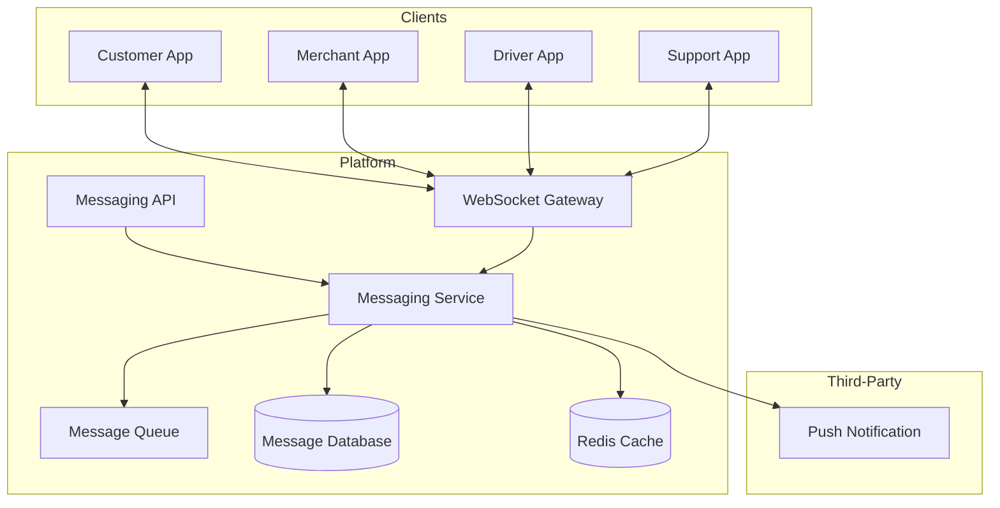

# Software Requirements Specification (SRS)

## Part 10E: In-App Messaging

**Module:** Notifications & Communications Module (Part 11)
**Version:** 1.0.0
**Status:** Final / For Review
**Date:** 2026-06-30

---

## Chapter 1 – Overview

### Purpose

The In-App Messaging module defines the comprehensive real-time messaging capabilities within the **[Platform Name]** platform. This encompasses one-to-one chat between customers and drivers, customers and merchants, customers and support, as well as group messaging, read receipts, typing indicators, and message history.

In-app messaging is the primary communication channel for real-time coordination between platform participants. It enables customers to communicate with drivers during delivery, merchants to coordinate order changes, and support teams to resolve issues quickly. This module ensures that messaging is reliable, secure, and provides a seamless user experience.

### Objectives

- Enable real-time messaging between platform participants
- Support one-to-one and group conversations
- Provide message delivery and read receipts
- Support typing indicators and presence
- Enable file and image sharing
- Maintain conversation history
- Support message moderation and reporting
- Ensure secure, encrypted communication

---

## Chapter 2 – Architecture

### INAP-001 Messaging Architecture



### INAP-002 Components

| Component | Description | Priority |
| :--- | :--- | :--- |
| **Messaging API** | API for messaging operations | **Required** |
| **Messaging Service** | Core messaging logic | **Required** |
| **WebSocket Gateway** | Real-time WebSocket connections | **Required** |
| **Message Queue** | Queue for message processing | **Required** |
| **Message Database** | Persistent message storage | **Required** |
| **Cache Layer** | Redis for real-time status | **Required** |
| **File Service** | File/image upload and delivery | **Required** |
| **Moderation Service** | Content moderation | **Required** |

---

## Chapter 3 – Message Types

### INAP-003 Conversation Types

| Type | Participants | Priority |
| :--- | :--- | :--- |
| **Customer-Driver** | Customer ↔ Driver | **Required** |
| **Customer-Merchant** | Customer ↔ Merchant | **Required** |
| **Customer-Support** | Customer ↔ Support Team | **Required** |
| **Merchant-Driver** | Merchant ↔ Driver | **Required** |
| **Driver-Support** | Driver ↔ Support Team | **Required** |
| **Merchant-Support** | Merchant ↔ Support Team | **Required** |
| **Group Chat** | Multiple participants | **Medium** |

### INAP-004 Message Types

| Type | Description | Priority |
| :--- | :--- | :--- |
| **Text** | Plain text message | **Required** |
| **Image** | Image sharing | **Required** |
| **File** | Document/File sharing | **Required** |
| **Location** | Location sharing | **Required** |
| **Quick Reply** | Pre-defined quick replies | **Required** |
| **System Message** | System-generated messages | **Required** |
| **Order Update** | Order status updates | **Required** |
| **Delivery Update** | Delivery status updates | **Required** |
| **Template Message** | Pre-defined message templates | **Required** |

---

## Chapter 4 – Messaging Features

### INAP-005 Core Messaging Features

| Feature | Description | Priority |
| :--- | :--- | :--- |
| **Real-Time Messaging** | Instant message delivery | **Required** |
| **Read Receipts** | Message read status | **Required** |
| **Delivery Receipts** | Message delivered status | **Required** |
| **Typing Indicators** | Show when user is typing | **Required** |
| **Presence** | Online/offline status | **Required** |
| **Message History** | Complete conversation history | **Required** |
| **Search** | Search messages | **Required** |
| **Push Notifications** | Notify of new messages | **Required** |
| **Image Sharing** | Share images | **Required** |
| **File Sharing** | Share documents | **Required** |
| **Location Sharing** | Share location | **Required** |
| **Quick Replies** | Pre-defined quick replies | **Required** |

### INAP-006 Advanced Messaging Features

| Feature | Description | Priority |
| :--- | :--- | :--- |
| **Message Reactions** | Emoji reactions to messages | **Medium** |
| **Message Editing** | Edit sent messages | **Medium** |
| **Message Deletion** | Delete sent messages | **Medium** |
| **Message Forwarding** | Forward messages | **Medium** |
| **Voice Messages** | Voice message recording | **Future** |
| **Video Messages** | Video message sharing | **Future** |
| **Message Translation** | Auto-translate messages | **Future** |

---

## Chapter 5 – Message Data Model

### INAP-007 Message Data Model

| Column | Type | Constraints | Description |
| :--- | :--- | :--- | :--- |
| `message_id` | UUID | PRIMARY KEY | Unique identifier |
| `conversation_id` | UUID | FOREIGN KEY (conversations.conversation_id) | Associated conversation |
| `sender_id` | UUID | NOT NULL | Sender identifier |
| `sender_type` | VARCHAR(20) | NOT NULL | CUSTOMER/MERCHANT/DRIVER/ADMIN/SYSTEM |
| `receiver_id` | UUID` | | Receiver identifier |
| `message_type` | VARCHAR(30) | NOT NULL | TEXT/IMAGE/FILE/LOCATION/QUICK_REPLY/SYSTEM/ORDER_UPDATE/DELIVERY_UPDATE/TEMPLATE |
| `content` | TEXT | | Message content |
| `media_url` | VARCHAR(500) | | Media file URL |
| `media_type` | VARCHAR(50) | | JPEG/PNG/PDF/DOC/XLS |
| `media_size` | INTEGER | | Media file size in bytes |
| `thumbnail_url` | VARCHAR(500) | | Thumbnail URL |
| `location_lat` | DECIMAL(10, 8) | | Location latitude |
| `location_lng` | DECIMAL(11, 8) | | Location longitude |
| `parent_message_id` | UUID | | Reply to message |
| `status` | VARCHAR(20) | DEFAULT 'SENT' | SENT/DELIVERED/READ/FAILED/DELETED |
| `is_edited` | BOOLEAN | DEFAULT FALSE | Edited status |
| `edited_at` | TIMESTAMP | | Edit timestamp |
| `deleted_at` | TIMESTAMP` | | Deletion timestamp |
| `metadata` | JSONB` | | Additional metadata |
| `created_at` | TIMESTAMP | DEFAULT NOW() | Creation timestamp |
| `updated_at` | TIMESTAMP | DEFAULT NOW() | Last update timestamp |

### INAP-008 Conversation Data Model

| Column | Type | Constraints | Description |
| :--- | :--- | :--- | :--- |
| `conversation_id` | UUID | PRIMARY KEY | Unique identifier |
| `conversation_type` | VARCHAR(20) | NOT NULL | ONE_ON_ONE/GROUP |
| `participants` | TEXT[] | NOT NULL | Participant IDs |
| `last_message_id` | UUID | | Last message in conversation |
| `last_message_at` | TIMESTAMP | | Last message timestamp |
| `is_active` | BOOLEAN | DEFAULT TRUE | Active status |
| `metadata` | JSONB | | Additional metadata |
| `created_at` | TIMESTAMP | DEFAULT NOW() | Creation timestamp |
| `updated_at` | TIMESTAMP | DEFAULT NOW() | Last update timestamp |

### INAP-009 Participant Data Model

| Column | Type | Constraints | Description |
| :--- | :--- | :--- | :--- |
| `participant_id` | UUID | PRIMARY KEY | Unique identifier |
| `conversation_id` | UUID | FOREIGN KEY (conversations.conversation_id) | Associated conversation |
| `user_id` | UUID` | NOT NULL | User identifier |
| `user_type` | VARCHAR(20) | NOT NULL | CUSTOMER/MERCHANT/DRIVER/ADMIN |
| `last_read_at` | TIMESTAMP | | Last read timestamp |
| `is_muted` | BOOLEAN | DEFAULT FALSE | Muted status |
| `is_blocked` | BOOLEAN | DEFAULT FALSE | Blocked status |
| `joined_at` | TIMESTAMP | | Join timestamp |
| `left_at` | TIMESTAMP | | Leave timestamp |
| `created_at` | TIMESTAMP | DEFAULT NOW() | Creation timestamp |
| `updated_at` | TIMESTAMP | DEFAULT NOW() | Last update timestamp |

---

## Chapter 6 – Real-Time Communication

### INAP-010 WebSocket Events

| Event | Direction | Description | Priority |
| :--- | :--- | :--- | :--- |
| `message.new` | Inbound/Outbound | New message sent/received | **Required** |
| `message.delivered` | Outbound | Message delivered | **Required** |
| `message.read` | Outbound | Message read | **Required** |
| `message.deleted` | Outbound | Message deleted | **Required** |
| `message.edited` | Outbound | Message edited | **Required** |
| `typing.start` | Inbound/Outbound | User started typing | **Required** |
| `typing.stop` | Inbound/Outbound | User stopped typing | **Required** |
| `presence.online` | Outbound | User online | **Required** |
| `presence.offline` | Outbound | User offline | **Required** |
| `conversation.created` | Outbound | New conversation created | **Required** |
| `conversation.updated` | Outbound | Conversation updated | **Required** |
| `participant.joined` | Outbound | Participant joined | **Required** |
| `participant.left` | Outbound | Participant left | **Required** |
| `system.notification` | Outbound | System notification | **Required** |

### INAP-011 WebSocket Connection

| Parameter | Specification | Priority |
| :--- | :--- | :--- |
| **Protocol** | WebSocket (WSS) | **Required** |
| **Authentication** | JWT token in connection URL | **Required** |
| **Heartbeat** | Ping/Pong every 30 seconds | **Required** |
| **Reconnect** | Exponential backoff reconnection | **Required** |
| **Max Connections** | 5 connections per user | **Required** |

---

## Chapter 7 – Message Moderation

### INAP-012 Moderation Features

| Feature | Description | Priority |
| :--- | :--- | :--- |
| **Content Filtering** | Filter profanity/hate speech | **Required** |
| **Image Moderation** | Detect inappropriate images | **Required** |
| **Spam Detection** | Detect spam messages | **Required** |
| **Link Scanning** | Scan links for safety | **Required** |
| **Report Message** | User can report messages | **Required** |
| **Block User** | Block users | **Required** |
| **Auto-flagging** | Auto-flag suspicious messages | **Required** |
| **Manual Review** | Admin review of flagged content | **Required** |

### INAP-013 Moderation Data Model

| Column | Type | Constraints | Description |
| :--- | :--- | :--- | :--- |
| `moderation_id` | UUID | PRIMARY KEY | Unique identifier |
| `message_id` | UUID | FOREIGN KEY (messages.message_id) | Associated message |
| `moderation_type` | VARCHAR(30) | NOT NULL | PROFANITY/HATE_SPEECH/SPAM/INAPPROPRIATE_IMAGE/LINK/OTHER |
| `action` | VARCHAR(20) | | FLAG/BLOCK/APPROVE |
| `confidence` | DECIMAL(5, 2) | | Confidence score (0-100) |
| `status` | VARCHAR(20) | DEFAULT 'PENDING' | PENDING/REVIEWED/ESCALATED/RESOLVED |
| `reviewed_by` | UUID | | Reviewer identifier |
| `reviewed_at` | TIMESTAMP | | Review timestamp |
| `notes` | TEXT | | Review notes |
| `created_at` | TIMESTAMP | DEFAULT NOW() | Creation timestamp |
| `updated_at` | TIMESTAMP | DEFAULT NOW() | Last update timestamp |

---

## Chapter 8 – Database Tables

### conversations

| Column | Type | Constraints | Description |
| :--- | :--- | :--- | :--- |
| `conversation_id` | UUID | PRIMARY KEY | Unique identifier |
| `conversation_type` | VARCHAR(20) | NOT NULL | ONE_ON_ONE/GROUP |
| `participants` | TEXT[] | NOT NULL | Participant IDs |
| `last_message_id` | UUID | | Last message ID |
| `last_message_at` | TIMESTAMP | | Last message timestamp |
| `is_active` | BOOLEAN | DEFAULT TRUE | Active status |
| `metadata` | JSONB | | Additional metadata |
| `created_at` | TIMESTAMP | DEFAULT NOW() | Creation timestamp |
| `updated_at` | TIMESTAMP | DEFAULT NOW() | Last update timestamp |

### messages

| Column | Type | Constraints | Description |
| :--- | :--- | :--- | :--- |
| `message_id` | UUID | PRIMARY KEY | Unique identifier |
| `conversation_id` | UUID | FOREIGN KEY (conversations.conversation_id) | Associated conversation |
| `sender_id` | UUID | NOT NULL | Sender identifier |
| `sender_type` | VARCHAR(20) | NOT NULL | CUSTOMER/MERCHANT/DRIVER/ADMIN/SYSTEM |
| `receiver_id` | UUID | | Receiver identifier |
| `message_type` | VARCHAR(30) | NOT NULL | TEXT/IMAGE/FILE/LOCATION/QUICK_REPLY/SYSTEM/ORDER_UPDATE/DELIVERY_UPDATE/TEMPLATE |
| `content` | TEXT | | Message content |
| `media_url` | VARCHAR(500) | | Media file URL |
| `media_type` | VARCHAR(50) | | Media type |
| `media_size` | INTEGER | | Media file size |
| `thumbnail_url` | VARCHAR(500) | | Thumbnail URL |
| `location_lat` | DECIMAL(10, 8) | | Location latitude |
| `location_lng` | DECIMAL(11, 8) | | Location longitude |
| `parent_message_id` | UUID | | Reply to message |
| `status` | VARCHAR(20) | DEFAULT 'SENT' | SENT/DELIVERED/READ/FAILED/DELETED |
| `is_edited` | BOOLEAN | DEFAULT FALSE | Edited status |
| `edited_at` | TIMESTAMP | | Edit timestamp |
| `deleted_at` | TIMESTAMP | | Deletion timestamp |
| `metadata` | JSONB | | Additional metadata |
| `created_at` | TIMESTAMP | DEFAULT NOW() | Creation timestamp |
| `updated_at` | TIMESTAMP | DEFAULT NOW() | Last update timestamp |

### participants

| Column | Type | Constraints | Description |
| :--- | :--- | :--- | :--- |
| `participant_id` | UUID | PRIMARY KEY | Unique identifier |
| `conversation_id` | UUID | FOREIGN KEY (conversations.conversation_id) | Associated conversation |
| `user_id` | UUID | NOT NULL | User identifier |
| `user_type` | VARCHAR(20) | NOT NULL | CUSTOMER/MERCHANT/DRIVER/ADMIN |
| `last_read_at` | TIMESTAMP | | Last read timestamp |
| `is_muted` | BOOLEAN | DEFAULT FALSE | Muted status |
| `is_blocked` | BOOLEAN | DEFAULT FALSE | Blocked status |
| `joined_at` | TIMESTAMP | | Join timestamp |
| `left_at` | TIMESTAMP | | Leave timestamp |
| `created_at` | TIMESTAMP | DEFAULT NOW() | Creation timestamp |
| `updated_at` | TIMESTAMP | DEFAULT NOW() | Last update timestamp |

### message_reports

| Column | Type | Constraints | Description |
| :--- | :--- | :--- | :--- |
| `report_id` | UUID | PRIMARY KEY | Unique identifier |
| `message_id` | UUID | FOREIGN KEY (messages.message_id) | Associated message |
| `reporter_id` | UUID` | NOT NULL | Reporter identifier |
| `reporter_type` | VARCHAR(20) | NOT NULL | CUSTOMER/MERCHANT/DRIVER/ADMIN |
| `report_reason` | VARCHAR(100) | NOT NULL | Reason for reporting |
| `status` | VARCHAR(20) | DEFAULT 'PENDING' | PENDING/INVESTIGATING/RESOLVED/DISMISSED |
| `reviewed_by` | UUID | | Reviewer identifier |
| `reviewed_at` | TIMESTAMP | | Review timestamp |
| `resolution` | TEXT | | Resolution details |
| `created_at` | TIMESTAMP | DEFAULT NOW() | Creation timestamp |
| `updated_at` | TIMESTAMP | DEFAULT NOW() | Last update timestamp |

### moderation_actions

| Column | Type | Constraints | Description |
| :--- | :--- | :--- | :--- |
| `action_id` | UUID | PRIMARY KEY | Unique identifier |
| `message_id` | UUID | FOREIGN KEY (messages.message_id) | Associated message |
| `moderation_type` | VARCHAR(30) | NOT NULL | PROFANITY/HATE_SPEECH/SPAM/INAPPROPRIATE_IMAGE/LINK/OTHER |
| `action` | VARCHAR(20) | | FLAG/BLOCK/APPROVE |
| `confidence` | DECIMAL(5, 2) | | Confidence score |
| `status` | VARCHAR(20) | DEFAULT 'PENDING' | PENDING/REVIEWED/ESCALATED/RESOLVED |
| `reviewed_by` | UUID | | Reviewer identifier |
| `reviewed_at` | TIMESTAMP | | Review timestamp |
| `notes` | TEXT | | Review notes |
| `created_at` | TIMESTAMP | DEFAULT NOW() | Creation timestamp |
| `updated_at` | TIMESTAMP | DEFAULT NOW() | Last update timestamp |

### user_blocks

| Column | Type | Constraints | Description |
| :--- | :--- | :--- | :--- |
| `block_id` | UUID | PRIMARY KEY | Unique identifier |
| `blocker_id` | UUID | NOT NULL | Blocker identifier |
| `blocker_type` | VARCHAR(20) | NOT NULL | CUSTOMER/MERCHANT/DRIVER/ADMIN |
| `blocked_id` | UUID | NOT NULL | Blocked user identifier |
| `blocked_type` | VARCHAR(20) | NOT NULL | CUSTOMER/MERCHANT/DRIVER/ADMIN |
| `reason` | VARCHAR(100) | | Block reason |
| `is_active` | BOOLEAN | DEFAULT TRUE | Active status |
| `created_at` | TIMESTAMP | DEFAULT NOW() | Creation timestamp |
| `updated_at` | TIMESTAMP | DEFAULT NOW() | Last update timestamp |

---

## Chapter 9 – REST APIs

### Conversation APIs

| Method | Endpoint | Description |
| :--- | :--- | :--- |
| `GET` | `/api/v1/messaging/conversations` | List conversations |
| `GET` | `/api/v1/messaging/conversations/{id}` | Get conversation details |
| `POST` | `/api/v1/messaging/conversations` | Create conversation |
| `PUT` | `/api/v1/messaging/conversations/{id}` | Update conversation |
| `DELETE` | `/api/v1/messaging/conversations/{id}` | Delete conversation |
| `GET` | `/api/v1/messaging/conversations/{id}/messages` | Get messages |
| `POST` | `/api/v1/messaging/conversations/{id}/messages` | Send message |
| `POST` | `/api/v1/messaging/conversations/{id}/leave` | Leave conversation |
| `POST` | `/api/v1/messaging/conversations/{id}/participants` | Add participant |
| `DELETE` | `/api/v1/messaging/conversations/{id}/participants/{id}` | Remove participant |

### Message APIs

| Method | Endpoint | Description |
| :--- | :--- | :--- |
| `GET` | `/api/v1/messaging/messages/{id}` | Get message details |
| `PUT` | `/api/v1/messaging/messages/{id}` | Edit message |
| `DELETE` | `/api/v1/messaging/messages/{id}` | Delete message |
| `POST` | `/api/v1/messaging/messages/{id}/read` | Mark message as read |
| `POST` | `/api/v1/messaging/messages/{id}/report` | Report message |
| `POST` | `/api/v1/messaging/messages/{id}/react` | Add reaction |
| `DELETE` | `/api/v1/messaging/messages/{id}/react` | Remove reaction |

### Participant APIs

| Method | Endpoint | Description |
| :--- | :--- | :--- |
| `GET` | `/api/v1/messaging/participants` | List participants |
| `GET` | `/api/v1/messaging/participants/{id}` | Get participant details |
| `PUT` | `/api/v1/messaging/participants/{id}` | Update participant |
| `PUT` | `/api/v1/messaging/participants/{id}/mute` | Mute conversation |
| `PUT` | `/api/v1/messaging/participants/{id}/unmute` | Unmute conversation |
| `PUT` | `/api/v1/messaging/participants/{id}/block` | Block participant |
| `PUT` | `/api/v1/messaging/participants/{id}/unblock` | Unblock participant |

### Moderation APIs

| Method | Endpoint | Description |
| :--- | :--- | :--- |
| `GET` | `/api/v1/admin/messaging/moderation` | List moderation actions |
| `GET` | `/api/v1/admin/messaging/moderation/{id}` | Get moderation details |
| `PUT` | `/api/v1/admin/messaging/moderation/{id}` | Update moderation |
| `GET` | `/api/v1/admin/messaging/reports` | List reports |
| `GET` | `/api/v1/admin/messaging/reports/{id}` | Get report details |
| `PUT` | `/api/v1/admin/messaging/reports/{id}` | Update report |

---

## Chapter 10 – WebSocket Events

### INAP-014 WebSocket Event Structure

```json
{
  "event": "message.new",
  "data": {
    "message_id": "550e8400-e29b-41d4-a716-446655440000",
    "conversation_id": "123e4567-e89b-12d3-a456-426614174000",
    "sender_id": "223e4567-e89b-12d3-a456-426614174000",
    "sender_type": "CUSTOMER",
    "message_type": "TEXT",
    "content": "Hello! I'm here to pick up the order.",
    "timestamp": "2026-06-30T14:30:45.123Z"
  }
}
```

### INAP-015 WebSocket Message Types

| Type | Description | Priority |
| :--- | :--- | :--- |
| `message.new` | New message received | **Required** |
| `message.delivered` | Message delivered to recipient | **Required** |
| `message.read` | Message read by recipient | **Required** |
| `message.deleted` | Message deleted | **Required** |
| `message.edited` | Message edited | **Required** |
| `typing.start` | User started typing | **Required** |
| `typing.stop` | User stopped typing | **Required** |
| `presence.online` | User online | **Required** |
| `presence.offline` | User offline | **Required** |
| `conversation.created` | New conversation created | **Required** |
| `conversation.updated` | Conversation updated | **Required** |
| `participant.joined` | Participant joined | **Required** |
| `participant.left` | Participant left | **Required** |
| `system.notification` | System notification | **Required** |

---

## Chapter 11 – Business Rules

| Rule ID | Rule Description | Priority |
| :--- | :--- | :--- |
| **BR-INAP-001** | Messages must be delivered within 1 second. | **High** |
| **BR-INAP-002** | Message history must be retained for 90 days. | **High** |
| **BR-INAP-003** | Users can have up to 5 active conversations. | **High** |
| **BR-INAP-004** | Messages over 1000 characters are truncated. | **High** |
| **BR-INAP-005** | Images must be under 5 MB in size. | **High** |
| **BR-INAP-006** | Files must be under 10 MB in size. | **High** |
| **BR-INAP-007** | Profanity/hate speech is automatically flagged. | **High** |
| **BR-INAP-008** | Users can block up to 100 users. | **High** |
| **BR-INAP-009** | Messages cannot be edited after 5 minutes. | **High** |
| **BR-INAP-010** | Deleted messages are soft-deleted (retained for 30 days). | **High** |

---

## Chapter 12 – Acceptance Tests

| Test ID | Test Description | Priority |
| :--- | :--- | :--- |
| **TEST-INAP-001** | User sends text message successfully. | **High** |
| **TEST-INAP-002** | User receives message in real-time. | **High** |
| **TEST-INAP-003** | Message delivered receipt received. | **High** |
| **TEST-INAP-004** | Message read receipt received. | **High** |
| **TEST-INAP-005** | Typing indicator works correctly. | **High** |
| **TEST-INAP-006** | Presence status works correctly. | **High** |
| **TEST-INAP-007** | User sends image message. | **High** |
| **TEST-INAP-008** | User sends file attachment. | **High** |
| **TEST-INAP-009** | User sends location message. | **High** |
| **TEST-INAP-010** | Quick reply works correctly. | **High** |
| **TEST-INAP-011** | User edits sent message. | **High** |
| **TEST-INAP-012** | User deletes sent message. | **High** |
| **TEST-INAP-013** | Conversation history loaded correctly. | **High** |
| **TEST-INAP-014** | User searches messages. | **High** |
| **TEST-INAP-015** | User starts new conversation. | **High** |
| **TEST-INAP-016** | User added to group conversation. | **High** |
| **TEST-INAP-017** | User leaves group conversation. | **High** |
| **TEST-INAP-018** | User mutes conversation. | **High** |
| **TEST-INAP-019** | User blocks another user. | **High** |
| **TEST-INAP-020** | Message reported for moderation. | **High** |
| **TEST-INAP-021** | Profanity automatically flagged. | **High** |
| **TEST-INAP-022** | Admin reviews flagged message. | **High** |
| **TEST-INAP-023** | Push notification received for new message. | **High** |
| **TEST-INAP-024** | Offline messages delivered on reconnect. | **High** |
| **TEST-INAP-025** | Message delivery rate > 99%. | **High** |

---

## Chapter 13 – Traceability Matrix

| Requirement | Database Table | API Endpoint(s) | Acceptance Test |
| :--- | :--- | :--- | :--- |
| INAP-005 | messages | POST /api/v1/messaging/conversations/{id}/messages | TEST-INAP-001, TEST-INAP-002 |
| INAP-005 | messages | WebSocket | TEST-INAP-003, TEST-INAP-004, TEST-INAP-005, TEST-INAP-006 |
| INAP-005 | messages | POST /api/v1/messaging/conversations/{id}/messages | TEST-INAP-007, TEST-INAP-008, TEST-INAP-009, TEST-INAP-010 |
| INAP-006 | messages | PUT /api/v1/messaging/messages/{id} | TEST-INAP-011 |
| INAP-006 | messages | DELETE /api/v1/messaging/messages/{id} | TEST-INAP-012 |
| INAP-005 | messages | GET /api/v1/messaging/conversations/{id}/messages | TEST-INAP-013, TEST-INAP-014 |
| INAP-007 | conversations | POST /api/v1/messaging/conversations | TEST-INAP-015 |
| INAP-007 | conversations | POST /api/v1/messaging/conversations/{id}/participants | TEST-INAP-016 |
| INAP-007 | conversations | POST /api/v1/messaging/conversations/{id}/leave | TEST-INAP-017 |
| INAP-008 | participants | PUT /api/v1/messaging/participants/{id}/mute | TEST-INAP-018 |
| INAP-008 | user_blocks | PUT /api/v1/messaging/participants/{id}/block | TEST-INAP-019 |
| INAP-012 | message_reports | POST /api/v1/messaging/messages/{id}/report | TEST-INAP-020 |
| INAP-012 | moderation_actions | GET /api/v1/admin/messaging/moderation | TEST-INAP-021, TEST-INAP-022 |
| INAP-005 | messages | Internal (Push) | TEST-INAP-023 |
| INAP-005 | messages | WebSocket | TEST-INAP-024 |
| INAP-005 | messages | GET /api/v1/messaging/messages/{id} | TEST-INAP-025 |

---

## Chapter 14 – Summary

This document establishes the complete in-app messaging capability for the **[Platform Name]** platform. Key takeaways:

- **Real-Time Messaging:** Instant message delivery with WebSocket support for real-time communication.
- **Conversation Types:** One-to-one and group conversations between customers, merchants, drivers, and support.
- **Rich Message Types:** Text, images, files, location, quick replies, system messages, order updates, and delivery updates.
- **Delivery & Read Receipts:** Real-time delivery and read status for all messages.
- **Typing Indicators & Presence:** Show when users are typing and their online/offline status.
- **Message Management:** Edit, delete, search, and react to messages.
- **Conversation Management:** Create, update, leave, add participants, mute, and block.
- **Moderation:** Profanity filtering, image moderation, spam detection, link scanning, and reporting.
- **Security:** Encrypted communication, user blocking, and moderation workflows.
- **Reliability:** Offline message delivery, push notifications, and reconnect with exponential backoff.

The in-app messaging module enables seamless, real-time communication between all platform participants, improving coordination and customer satisfaction.

---

**Next Document:**

`12_Analytics_Reporting_Module/Part_11A_Business_Intelligence.md`

*(This transitions from notifications to analytics, starting with business intelligence capabilities.)*