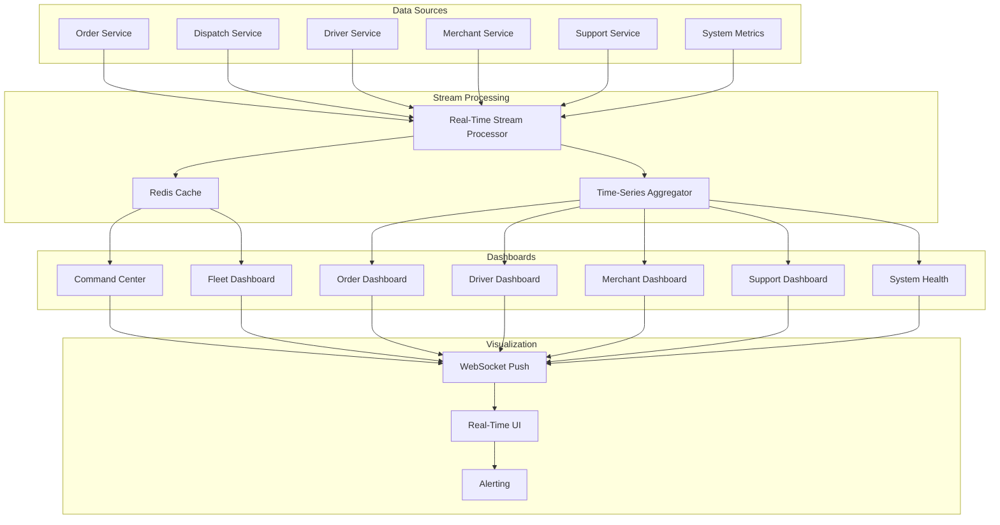

# Software Requirements Specification (SRS)

## Part 11B: Operational Dashboards

**Module:** Analytics & Reporting Module (Part 12)
**Version:** 1.0.0
**Status:** Final / For Review
**Date:** 2026-06-30

---

## Chapter 1 – Overview

### Purpose

The Operational Dashboards module defines the comprehensive real-time monitoring capabilities for platform operations teams. This encompasses live dashboards for order monitoring, dispatch management, fleet tracking, merchant operations, driver performance, support management, and system health.

Operational dashboards are the primary tools for operations teams to monitor, manage, and optimize platform performance in real-time. They provide immediate visibility into operational health, enable rapid response to issues, and support data-driven operational decisions. This module ensures that operations teams have the real-time information they need to keep the platform running smoothly.

### Objectives

- Provide real-time visibility into platform operations
- Enable rapid issue detection and response
- Support operational decision-making
- Track operational KPIs and performance
- Monitor fleet and dispatch efficiency
- Ensure system health and availability
- Support incident management and escalation
- Provide actionable operational insights

---

## Chapter 2 – Architecture

### OPSDASH-001 Architecture

### OPSDASH-002 Components

| Component | Description | Priority |
| :--- | :--- | :--- |
| **Stream Processor** | Real-time event processing | **Required** |
| **Redis Cache** | Low-latency data cache | **Required** |
| **Time-Series Aggregator** | Aggregates data for dashboards | **Required** |
| **Dashboard UI** | Real-time dashboard interface | **Required** |
| **WebSocket Gateway** | Real-time data push | **Required** |
| **Alerting Engine** | Real-time alert generation | **Required** |

---

## Chapter 3 – Command Center Dashboard

### OPSDASH-003 Command Center Overview

| Widget | Description | Priority |
| :--- | :--- | :--- |
| **Live Order Volume** | Real-time order count and trend | **Required** |
| **Active Orders** | Orders in progress by status | **Required** |
| **Driver Status** | Online/offline/busy drivers | **Required** |
| **Merchant Status** | Active merchants | **Required** |
| **System Health** | Platform health status | **Required** |
| **Order Map** | Live order heatmap | **Required** |
| **Driver Map** | Live driver locations | **Required** |
| **Alerts** | Active operational alerts | **Required** |
| **Key Metrics** | Real-time KPIs | **Required** |

### OPSDASH-004 Command Center Data

| Column | Type | Description |
| :--- | :--- | :--- |
| `live_orders` | Integer | Current live orders |
| `active_orders` | JSONB | Orders by status |
| `drivers_online` | Integer | Drivers online |
| `drivers_busy` | Integer | Drivers busy |
| `drivers_offline` | Integer | Drivers offline |
| `merchants_active` | Integer | Active merchants |
| `system_health` | String | HEALTHY/DEGRADED/CRITICAL |
| `pending_alerts` | Integer | Pending alerts |
| `orders_last_hour` | Integer | Orders in last hour |
| `avg_delivery_time` | Decimal | Average delivery time |
| `on_time_rate` | Decimal | On-time delivery rate |
| `updated_at` | Timestamp | Last update timestamp |

---

## Chapter 4 – Order Monitoring Dashboard

### OPSDASH-005 Order Monitoring Overview

| Widget | Description | Priority |
| :--- | :--- | :--- |
| **Order Volume** | Orders over time | **Required** |
| **Order Status Distribution** | Orders by status | **Required** |
| **Order Queue** | Pending orders queue | **Required** |
| **Order Details** | Drill-down order view | **Required** |
| **Order Timeline** | Order status timeline | **Required** |
| **Order Anomalies** | Anomalous orders | **Required** |
| **Order SLA** | SLA compliance | **Required** |

### OPSDASH-006 Order Monitoring Data

| Column | Type | Description |
| :--- | :--- | :--- |
| `total_orders_today` | Integer | Total orders today |
| `orders_by_status` | JSONB | Status distribution |
| `pending_orders` | Integer | Pending orders |
| `avg_confirmation_time` | Decimal | Average confirmation time |
| `avg_prep_time` | Decimal | Average preparation time |
| `avg_delivery_time` | Decimal | Average delivery time |
| `sla_compliance` | Decimal | SLA compliance rate |
| `anomaly_count` | Integer | Anomaly count |
| `updated_at` | Timestamp | Last update timestamp |

---

## Chapter 5 – Fleet Management Dashboard

### OPSDASH-007 Fleet Management Overview

| Widget | Description | Priority |
| :--- | :--- | :--- |
| **Fleet Map** | Live driver locations | **Required** |
| **Driver Status** | Drivers by status | **Required** |
| **Driver Utilization** | Online vs. busy ratio | **Required** |
| **Delivery Times** | Real-time delivery metrics | **Required** |
| **Driver Performance** | Top/bottom drivers | **Required** |
| **Fleet Alerts** | Driver-related alerts | **Required** |
| **Zone Coverage** | Coverage by zone | **Required** |

### OPSDASH-008 Fleet Management Data

| Column | Type | Description |
| :--- | :--- | :--- |
| `total_drivers` | Integer | Total drivers |
| `drivers_online` | Integer | Drivers online |
| `drivers_busy` | Integer | Drivers busy |
| `drivers_offline` | Integer | Drivers offline |
| `utilization_rate` | Decimal | Utilization percentage |
| `avg_delivery_time` | Decimal | Average delivery time |
| `avg_distance` | Decimal | Average distance |
| `avg_earnings_per_hour` | Decimal | Average earnings per hour |
| `zone_coverage` | JSONB | Coverage by zone |
| `updated_at` | Timestamp | Last update timestamp |

---

## Chapter 6 – Dispatch Dashboard

### OPSDASH-009 Dispatch Overview

| Widget | Description | Priority |
| :--- | :--- | :--- |
| **Order Queue** | Orders awaiting assignment | **Required** |
| **Driver Availability** | Available drivers | **Required** |
| **Assignment Performance** | Assignment metrics | **Required** |
| **Dispatch Map** | Orders and drivers map | **Required** |
| **ETA Monitoring** | Real-time ETA tracking | **Required** |
| **Dispatch Alerts** | Dispatch-related alerts | **Required** |
| **Capacity Planning** | Current capacity status | **Required** |

### OPSDASH-010 Dispatch Data

| Column | Type | Description |
| :--- | :--- | :--- |
| `queue_length` | Integer | Pending orders in queue |
| `available_drivers` | Integer | Available drivers |
| `assignment_success_rate` | Decimal | Assignment success rate |
| `avg_assignment_time` | Decimal | Average assignment time |
| `avg_eta` | Decimal | Average ETA |
| `capacity_utilization` | Decimal | Capacity utilization |
| `zone_balance` | JSONB | Order-driver balance per zone |
| `updated_at` | Timestamp | Last update timestamp |

---

## Chapter 7 – Merchant Operations Dashboard

### OPSDASH-011 Merchant Operations Overview

| Widget | Description | Priority |
| :--- | :--- | :--- |
| **Merchant Status** | Active vs. inactive | **Required** |
| **Merchant Orders** | Order volume by merchant | **Required** |
| **Merchant Performance** | Key merchant metrics | **Required** |
| **Merchant Alerts** | Merchant-related alerts | **Required** |
| **Merchant Ranking** | Top merchants | **Required** |
| **Category Performance** | Performance by category | **Required** |

### OPSDASH-012 Merchant Operations Data

| Column | Type | Description |
| :--- | :--- | :--- |
| `total_merchants` | Integer | Total merchants |
| `active_merchants` | Integer | Active merchants |
| `inactive_merchants` | Integer | Inactive merchants |
| `avg_orders_per_merchant` | Decimal | Average orders |
| `avg_rating_per_merchant` | Decimal | Average rating |
| `top_merchants` | JSONB | Top merchants by orders |
| `category_performance` | JSONB | Performance by category |
| `updated_at` | Timestamp | Last update timestamp |

---

## Chapter 8 – Support Dashboard

### OPSDASH-013 Support Overview

| Widget | Description | Priority |
| :--- | :--- | :--- |
| **Ticket Volume** | Open vs. closed tickets | **Required** |
| **Ticket Status** | Tickets by status | **Required** |
| **SLA Compliance** | SLA adherence | **Required** |
| **Response Times** | Average response times | **Required** |
| **Agent Performance** | Agent metrics | **Required** |
| **Ticket Categories** | Tickets by category | **Required** |
| **Escalations** | Escalated tickets | **Required** |

### OPSDASH-014 Support Data

| Column | Type | Description |
| :--- | :--- | :--- |
| `open_tickets` | Integer | Open tickets |
| `in_progress_tickets` | Integer | In-progress tickets |
| `resolved_tickets` | Integer | Resolved tickets |
| `sla_compliance` | Decimal | SLA compliance rate |
| `avg_response_time` | Decimal | Average response time |
| `avg_resolution_time` | Decimal | Average resolution time |
| `escalated_tickets` | Integer | Escalated tickets |
| `agent_performance` | JSONB | Agent metrics |
| `updated_at` | Timestamp | Last update timestamp |

---

## Chapter 9 – System Health Dashboard

### OPSDASH-015 System Health Overview

| Widget | Description | Priority |
| :--- | :--- | :--- |
| **Service Status** | Service health status | **Required** |
| **API Latency** | API response times | **Required** |
| **Error Rates** | Service error rates | **Required** |
| **Resource Usage** | CPU, memory, disk | **Required** |
| **Database Health** | Database status | **Required** |
| **Queue Status** | Message queue status | **Required** |
| **System Alerts** | System alerts | **Required** |

### OPSDASH-016 System Health Data

| Column | Type | Description |
| :--- | :--- | :--- |
| `service_status` | JSONB | Status by service |
| `api_latency_p95` | Decimal | API latency (P95) |
| `error_rate` | Decimal | Overall error rate |
| `cpu_utilization` | Decimal | CPU utilization |
| `memory_utilization` | Decimal | Memory utilization |
| `disk_utilization` | Decimal | Disk utilization |
| `db_connections` | Integer | Database connections |
| `queue_depth` | Integer | Message queue depth |
| `system_alerts` | Integer | Active system alerts |
| `updated_at` | Timestamp | Last update timestamp |

---

## Chapter 10 – Alerting & Notifications

### OPSDASH-017 Alert Types

| Alert | Trigger | Priority | Action |
| :--- | :--- | :--- | :--- |
| **High Order Volume** | Orders exceed threshold | **High** | Alert ops team |
| **Low Driver Availability** | Drivers below threshold | **High** | Alert ops team |
| **Delivery Time Spike** | Delivery time > threshold | **High** | Investigate |
| **Cancellation Spike** | Cancellation rate > threshold | **High** | Investigate |
| **System Degradation** | System health degraded | **Critical** | Alert tech team |
| **SLA Breach** | SLA compliance < threshold | **High** | Alert ops team |
| **Queue Backlog** | Queue length > threshold | **High** | Alert ops team |

### OPSDASH-018 Alert Data Model

| Column | Type | Constraints | Description |
| :--- | :--- | :--- | :--- |
| `alert_id` | UUID | PRIMARY KEY | Unique identifier |
| `alert_type` | VARCHAR(50) | NOT NULL | Alert type |
| `severity` | VARCHAR(20) | NOT NULL | INFO/WARNING/CRITICAL |
| `message` | TEXT | NOT NULL | Alert message |
| `metric_value` | DECIMAL(10, 2) | | Metric value |
| `threshold_value` | DECIMAL(10, 2) | | Threshold value |
| `status` | VARCHAR(20) | DEFAULT 'OPEN' | OPEN/ACKNOWLEDGED/RESOLVED |
| `assigned_to` | UUID | | Assigned user |
| `acknowledged_at` | TIMESTAMP | | Acknowledgement timestamp |
| `resolved_at` | TIMESTAMP | | Resolution timestamp |
| `created_at` | TIMESTAMP | DEFAULT NOW() | Creation timestamp |
| `updated_at` | TIMESTAMP | DEFAULT NOW() | Last update timestamp |

---

## Chapter 11 – Database Tables

### ops_dashboards

| Column | Type | Constraints | Description |
| :--- | :--- | :--- | :--- |
| `dashboard_id` | UUID | PRIMARY KEY | Unique identifier |
| `dashboard_type` | VARCHAR(30) | NOT NULL | COMMAND_CENTER/ORDER/FLEET/DISPATCH/MERCHANT/SUPPORT/SYSTEM |
| `configuration` | JSONB | NOT NULL | Dashboard configuration |
| `is_active` | BOOLEAN | DEFAULT TRUE | Active status |
| `updated_at` | TIMESTAMP | | Last update timestamp |
| `created_at` | TIMESTAMP | DEFAULT NOW() | Creation timestamp |

### ops_metrics

| Column | Type | Constraints | Description |
| :--- | :--- | :--- | :--- |
| `metric_id` | UUID | PRIMARY KEY | Unique identifier |
| `metric_type` | VARCHAR(30) | NOT NULL | ORDER/DRIVER/FLEET/DISPATCH/MERCHANT/SUPPORT/SYSTEM |
| `metric_data` | JSONB | NOT NULL | Metric data |
| `timestamp` | TIMESTAMP | NOT NULL | Metric timestamp |
| `created_at` | TIMESTAMP | DEFAULT NOW() | Creation timestamp |

### ops_alerts

| Column | Type | Constraints | Description |
| :--- | :--- | :--- | :--- |
| `alert_id` | UUID | PRIMARY KEY | Unique identifier |
| `alert_type` | VARCHAR(50) | NOT NULL | Alert type |
| `severity` | VARCHAR(20) | NOT NULL | INFO/WARNING/CRITICAL |
| `message` | TEXT | NOT NULL | Alert message |
| `metric_value` | DECIMAL(10, 2) | | Metric value |
| `threshold_value` | DECIMAL(10, 2) | | Threshold value |
| `status` | VARCHAR(20) | DEFAULT 'OPEN' | OPEN/ACKNOWLEDGED/RESOLVED |
| `assigned_to` | UUID | | Assigned user |
| `acknowledged_at` | TIMESTAMP | | Acknowledgement timestamp |
| `resolved_at` | TIMESTAMP | | Resolution timestamp |
| `created_at` | TIMESTAMP | DEFAULT NOW() | Creation timestamp |
| `updated_at` | TIMESTAMP | DEFAULT NOW() | Last update timestamp |

### ops_health

| Column | Type | Constraints | Description |
| :--- | :--- | :--- | :--- |
| `health_id` | UUID | PRIMARY KEY | Unique identifier |
| `service_name` | VARCHAR(100) | NOT NULL | Service name |
| `status` | VARCHAR(20) | NOT NULL | HEALTHY/DEGRADED/CRITICAL |
| `latency_p95` | DECIMAL(10, 2) | | P95 latency |
| `error_rate` | DECIMAL(5, 2) | | Error rate |
| `cpu_utilization` | DECIMAL(5, 2) | | CPU utilization |
| `memory_utilization` | DECIMAL(5, 2) | | Memory utilization |
| `timestamp` | TIMESTAMP | NOT NULL | Health timestamp |
| `created_at` | TIMESTAMP | DEFAULT NOW() | Creation timestamp |

### ops_user_preferences

| Column | Type | Constraints | Description |
| :--- | :--- | :--- | :--- |
| `preference_id` | UUID | PRIMARY KEY | Unique identifier |
| `user_id` | UUID | NOT NULL | User identifier |
| `dashboard_preferences` | JSONB | | Dashboard preferences |
| `alert_preferences` | JSONB` | | Alert preferences |
| `notification_preferences` | JSONB` | | Notification preferences |
| `created_at` | TIMESTAMP | DEFAULT NOW() | Creation timestamp |
| `updated_at` | TIMESTAMP | DEFAULT NOW() | Last update timestamp |

---

## Chapter 12 – REST APIs

### Dashboard APIs

| Method | Endpoint | Description |
| :--- | :--- | :--- |
| `GET` | `/api/v1/ops/dashboards/command-center` | Get command center dashboard |
| `GET` | `/api/v1/ops/dashboards/order` | Get order monitoring dashboard |
| `GET` | `/api/v1/ops/dashboards/fleet` | Get fleet management dashboard |
| `GET` | `/api/v1/ops/dashboards/dispatch` | Get dispatch dashboard |
| `GET` | `/api/v1/ops/dashboards/merchant` | Get merchant operations dashboard |
| `GET` | `/api/v1/ops/dashboards/support` | Get support dashboard |
| `GET` | `/api/v1/ops/dashboards/system` | Get system health dashboard |

### Metric APIs

| Method | Endpoint | Description |
| :--- | :--- | :--- |
| `GET` | `/api/v1/ops/metrics/current` | Get current metrics |
| `GET` | `/api/v1/ops/metrics/history` | Get historical metrics |
| `GET` | `/api/v1/ops/metrics/orders` | Get order metrics |
| `GET` | `/api/v1/ops/metrics/drivers` | Get driver metrics |
| `GET` | `/api/v1/ops/metrics/system` | Get system metrics |

### Alert APIs

| Method | Endpoint | Description |
| :--- | :--- | :--- |
| `GET` | `/api/v1/ops/alerts` | Get active alerts |
| `GET` | `/api/v1/ops/alerts/{id}` | Get alert details |
| `PUT` | `/api/v1/ops/alerts/{id}/acknowledge` | Acknowledge alert |
| `PUT` | `/api/v1/ops/alerts/{id}/resolve` | Resolve alert |
| `POST` | `/api/v1/ops/alerts` | Create alert (system) |

### Health APIs

| Method | Endpoint | Description |
| :--- | :--- | :--- |
| `GET` | `/api/v1/ops/health` | Get system health |
| `GET` | `/api/v1/ops/health/services` | Get service health |
| `GET` | `/api/v1/ops/health/service/{name}` | Get specific service health |

### Preferences APIs

| Method | Endpoint | Description |
| :--- | :--- | :--- |
| `GET` | `/api/v1/ops/preferences` | Get user preferences |
| `PUT` | `/api/v1/ops/preferences` | Update user preferences |

---

## Chapter 13 – WebSocket Events

### OPSDASH-019 Real-Time Events

| Event | Payload | Description |
| :--- | :--- | :--- |
| `ops.metrics.updated` | `{ dashboard, metrics, timestamp }` | Dashboard metrics updated |
| `ops.alert.created` | `{ alert_id, alert_type, severity, message, timestamp }` | New alert created |
| `ops.alert.acknowledged` | `{ alert_id, user_id, timestamp }` | Alert acknowledged |
| `ops.alert.resolved` | `{ alert_id, user_id, timestamp }` | Alert resolved |
| `ops.health.updated` | `{ service, status, metrics, timestamp }` | System health updated |

---

## Chapter 14 – Business Rules

| Rule ID | Rule Description | Priority |
| :--- | :--- | :--- |
| **BR-OPSDASH-001** | Dashboards must update in real-time (within 5 seconds). | **High** |
| **BR-OPSDASH-002** | Critical alerts must be delivered within 10 seconds. | **High** |
| **BR-OPSDASH-003** | Alert data must be retained for 30 days. | **High** |
| **BR-OPSDASH-004** | System health checks must run every 30 seconds. | **High** |
| **BR-OPSDASH-005** | Dashboard data must be cached for performance. | **High** |
| **BR-OPSDASH-006** | Alerts must be auto-escalated if not acknowledged within 5 minutes. | **High** |
| **BR-OPSDASH-007** | Dashboards must support drill-down functionality. | **High** |
| **BR-OPSDASH-008** | Historical data must be available for 90 days. | **High** |
| **BR-OPSDASH-009** | Alert preferences must be user-configurable. | **High** |
| **BR-OPSDASH-010** | Dashboard access must be role-based. | **High** |

---

## Chapter 15 – Acceptance Tests

| Test ID | Test Description | Priority |
| :--- | :--- | :--- |
| **TEST-OPSDASH-001** | Command center dashboard displays all widgets. | **High** |
| **TEST-OPSDASH-002** | Order monitoring dashboard displays correctly. | **High** |
| **TEST-OPSDASH-003** | Fleet management dashboard displays correctly. | **High** |
| **TEST-OPSDASH-004** | Dispatch dashboard displays correctly. | **High** |
| **TEST-OPSDASH-005** | Merchant operations dashboard displays correctly. | **High** |
| **TEST-OPSDASH-006** | Support dashboard displays correctly. | **High** |
| **TEST-OPSDASH-007** | System health dashboard displays correctly. | **High** |
| **TEST-OPSDASH-008** | Metrics update in real-time (within 5 seconds). | **High** |
| **TEST-OPSDASH-009** | Order volume chart updates correctly. | **High** |
| **TEST-OPSDASH-010** | Driver status updates correctly. | **High** |
| **TEST-OPSDASH-011** | Alert created on threshold breach. | **High** |
| **TEST-OPSDASH-012** | Alert acknowledged and resolved. | **High** |
| **TEST-OPSDASH-013** | Critical alert escalates after 5 minutes. | **High** |
| **TEST-OPSDASH-014** | System health check works correctly. | **High** |
| **TEST-OPSDASH-015** | Drill-down functionality works correctly. | **High** |
| **TEST-OPSDASH-016** | WebSocket push works correctly. | **High** |
| **TEST-OPSDASH-017** | Dashboard preferences saved correctly. | **High** |
| **TEST-OPSDASH-018** | Role-based access works correctly. | **High** |
| **TEST-OPSDASH-019** | Historical data query works correctly. | **High** |
| **TEST-OPSDASH-020** | Fleet map displays driver locations. | **High** |
| **TEST-OPSDASH-021** | Dispatch queue displays pending orders. | **High** |
| **TEST-OPSDASH-022** | SLA compliance tracked correctly. | **High** |
| **TEST-OPSDASH-023** | Top merchants list displays correctly. | **High** |
| **TEST-OPSDASH-024** | Agent performance metrics display correctly. | **High** |
| **TEST-OPSDASH-025** | System health status indicators work correctly. | **High** |

---

## Chapter 16 – Traceability Matrix

| Requirement | Database Table | API Endpoint(s) | Acceptance Test |
| :--- | :--- | :--- | :--- |
| OPSDASH-003 | ops_dashboards | GET /api/v1/ops/dashboards/command-center | TEST-OPSDASH-001 |
| OPSDASH-005 | ops_dashboards | GET /api/v1/ops/dashboards/order | TEST-OPSDASH-002 |
| OPSDASH-007 | ops_dashboards | GET /api/v1/ops/dashboards/fleet | TEST-OPSDASH-003 |
| OPSDASH-009 | ops_dashboards | GET /api/v1/ops/dashboards/dispatch | TEST-OPSDASH-004 |
| OPSDASH-011 | ops_dashboards | GET /api/v1/ops/dashboards/merchant | TEST-OPSDASH-005 |
| OPSDASH-013 | ops_dashboards | GET /api/v1/ops/dashboards/support | TEST-OPSDASH-006 |
| OPSDASH-015 | ops_dashboards | GET /api/v1/ops/dashboards/system | TEST-OPSDASH-007 |
| OPSDASH-001 | ops_metrics | GET /api/v1/ops/metrics/current | TEST-OPSDASH-008 |
| OPSDASH-003 | ops_metrics | GET /api/v1/ops/metrics/orders | TEST-OPSDASH-009 |
| OPSDASH-007 | ops_metrics | GET /api/v1/ops/metrics/drivers | TEST-OPSDASH-010 |
| OPSDASH-017 | ops_alerts | GET /api/v1/ops/alerts | TEST-OPSDASH-011 |
| OPSDASH-017 | ops_alerts | PUT /api/v1/ops/alerts/{id}/acknowledge | TEST-OPSDASH-012 |
| OPSDASH-017 | ops_alerts | PUT /api/v1/ops/alerts/{id}/resolve | TEST-OPSDASH-013 |
| OPSDASH-015 | ops_health | GET /api/v1/ops/health | TEST-OPSDASH-014 |
| OPSDASH-004 | ops_dashboards | GET /api/v1/ops/dashboards/order | TEST-OPSDASH-015 |
| OPSDASH-002 | ops_dashboards | WebSocket | TEST-OPSDASH-016 |
| OPSDASH-018 | ops_user_preferences | GET/PUT /api/v1/ops/preferences | TEST-OPSDASH-017 |
| OPSDASH-001 | ops_dashboards | GET /api/v1/ops/dashboards/command-center | TEST-OPSDASH-018 |
| OPSDASH-003 | ops_metrics | GET /api/v1/ops/metrics/history | TEST-OPSDASH-019 |
| OPSDASH-007 | ops_metrics | GET /api/v1/ops/dashboards/fleet | TEST-OPSDASH-020 |
| OPSDASH-009 | ops_metrics | GET /api/v1/ops/dashboards/dispatch | TEST-OPSDASH-021 |
| OPSDASH-005 | ops_metrics | GET /api/v1/ops/metrics/orders | TEST-OPSDASH-022 |
| OPSDASH-011 | ops_metrics | GET /api/v1/ops/dashboards/merchant | TEST-OPSDASH-023 |
| OPSDASH-013 | ops_metrics | GET /api/v1/ops/dashboards/support | TEST-OPSDASH-024 |
| OPSDASH-015 | ops_health | GET /api/v1/ops/health/services | TEST-OPSDASH-025 |

---

## Chapter 17 – Summary

This document establishes the complete operational dashboards capability for the **[Platform Name]** platform. Key takeaways:

- **Command Center:** Real-time visibility into live orders, driver status, merchant status, system health, and key metrics.
- **Order Monitoring:** Order volume, status distribution, queue management, SLA compliance, and anomaly detection.
- **Fleet Management:** Live driver locations, status tracking, utilization metrics, delivery performance, and zone coverage.
- **Dispatch Management:** Order queue, driver availability, assignment performance, ETA monitoring, and capacity planning.
- **Merchant Operations:** Merchant status, performance, ranking, category analysis, and alerts.
- **Support Dashboard:** Ticket volume, status, SLA compliance, response times, and agent performance.
- **System Health:** Service status, API latency, error rates, resource usage, and system alerts.
- **Real-Time Alerting:** Threshold-based alerts with severity levels, acknowledgment, resolution, and escalation.
- **WebSocket Push:** Real-time data streaming for live dashboard updates.

The operational dashboards module provides operations teams with the real-time visibility and tools they need to monitor, manage, and optimize platform performance.

---

**Next Document:**

`Part_11C_Customer_Analytics.md`

*(This builds on operational dashboards to define customer analytics capabilities.)*