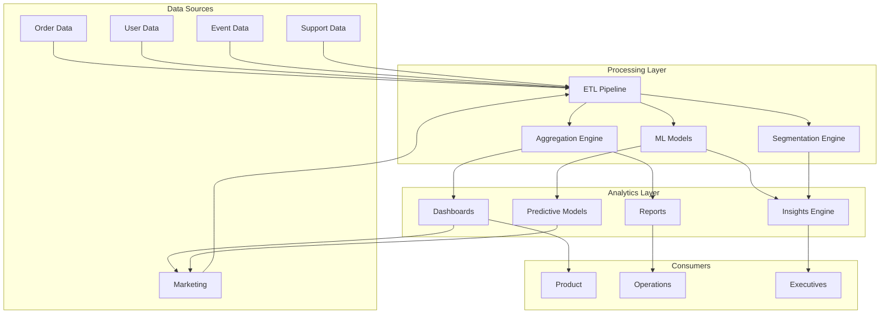

# Software Requirements Specification (SRS)

## Part 11C: Customer Analytics

**Module:** Analytics & Reporting Module (Part 12)
**Version:** 1.0.0
**Status:** Final / For Review
**Date:** 2026-06-30

---

## Chapter 1 – Overview

### Purpose

The Customer Analytics module defines the comprehensive analytics capabilities for understanding customer behavior, segmentation, retention, churn, lifetime value, and engagement across the **[Platform Name]** platform. This encompasses customer acquisition analysis, activation, engagement, retention, churn prediction, LTV modeling, cohort analysis, and behavioral insights.

Customer analytics is the foundation of customer-centric decision-making. By understanding customer behavior, preferences, and value, the platform can optimize acquisition strategies, improve retention, reduce churn, and increase customer lifetime value. This module ensures that customer insights are actionable, data-driven, and accessible to all relevant stakeholders.

### Objectives

- Understand customer acquisition, activation, and engagement
- Measure and improve customer retention and loyalty
- Predict and reduce customer churn
- Calculate and optimize customer lifetime value (LTV)
- Enable customer segmentation and targeting
- Analyze customer behavior and preferences
- Identify growth opportunities and risks
- Support data-driven marketing and product decisions

---

## Chapter 2 – Architecture

### CUSTAN-001 Architecture

### CUSTAN-002 Components

| Component | Description | Priority |
| :--- | :--- | :--- |
| **ETL Pipeline** | Extracts, transforms, loads customer data | **Required** |
| **Aggregation Engine** | Aggregates customer metrics | **Required** |
| **ML Models** | LTV prediction, churn prediction | **Required** |
| **Segmentation Engine** | Customer segmentation | **Required** |
| **Dashboards** | Customer analytics dashboards | **Required** |
| **Reports** | Customer reports | **Required** |
| **Insights Engine** | Actionable insights | **Required** |

---

## Chapter 3 – Customer Metrics

### CUSTAN-003 Key Customer Metrics

| Metric | Description | Priority |
| :--- | :--- | :--- |
| **Total Customers** | Total registered customers | **Required** |
| **Active Customers** | Customers with orders in last 30 days | **Required** |
| **New Customers** | New customers in period | **Required** |
| **Returning Customers** | Customers with previous orders | **Required** |
| **Customer Growth Rate** | % growth in active customers | **Required** |
| **Customer Acquisition Cost** | Cost to acquire new customer | **Required** |
| **Customer Lifetime Value** | Lifetime value per customer | **Required** |
| **Average Order Value** | Average spend per order | **Required** |
| **Order Frequency** | Orders per customer per month | **Required** |
| **Customer Churn Rate** | % of customers lost | **Required** |
| **Customer Retention Rate** | % of customers retained | **Required** |
| **Net Promoter Score** | Customer loyalty score | **Required** |

### CUSTAN-004 Customer Metrics Data Model

| Column | Type | Constraints | Description |
| :--- | :--- | :--- | :--- |
| `metric_id` | UUID | PRIMARY KEY | Unique identifier |
| `metric_date` | DATE | NOT NULL | Date of metrics |
| `total_customers` | INTEGER | | Total registered customers |
| `active_customers` | INTEGER | | Active customers (30 days) |
| `new_customers` | INTEGER | | New customers in period |
| `returning_customers` | INTEGER` | | Returning customers |
| `customer_growth_rate` | DECIMAL(5, 2) | | Growth rate % |
| `cac` | DECIMAL(10, 2) | | Customer acquisition cost |
| `ltv` | DECIMAL(10, 2) | | Lifetime value |
| `aov` | DECIMAL(10, 2) | | Average order value |
| `order_frequency` | DECIMAL(5, 2) | | Orders per month |
| `churn_rate` | DECIMAL(5, 2) | | Churn rate % |
| `retention_rate` | DECIMAL(5, 2) | | Retention rate % |
| `nps` | DECIMAL(3, 2) | | Net Promoter Score |
| `created_at` | TIMESTAMP | DEFAULT NOW() | Creation timestamp |
| `updated_at` | TIMESTAMP | DEFAULT NOW() | Last update timestamp |

---

## Chapter 4 – Customer Segmentation

### CUSTAN-005 Segmentation Criteria

| Criteria | Description | Priority |
| :--- | :--- | :--- |
| **Demographic** | Age, gender, location, income | **Required** |
| **Behavioral** | Order frequency, spending, categories | **Required** |
| **Engagement** | App usage, session duration, feature usage | **Required** |
| **Lifecycle** | New, active, loyal, at-risk, churned | **Required** |
| **Value** | High-value, medium-value, low-value | **Required** |
| **Preference** | Cuisine, category, delivery time | **Required** |

### CUSTAN-006 Customer Segments

| Segment | Description | Metrics | Priority |
| :--- | :--- | :--- | :--- |
| **New Customers** | First 30 days | Conversion rate, AOV, retention | **Required** |
| **Active Customers** | Ordering regularly | Order frequency, LTV, churn risk | **Required** |
| **Loyal Customers** | High frequency/High spend | LTV, retention, advocacy | **Required** |
| **At-Risk Customers** | Decreasing activity | Churn prediction, reactivation | **Required** |
| **Dormant Customers** | No orders in 60+ days | Reactivation potential | **Required** |
| **High-Value Customers** | Top spenders | LTV, retention, advocacy | **Required** |

### CUSTAN-007 Segment Data Model

| Column | Type | Constraints | Description |
| :--- | :--- | :--- | :--- |
| `segment_id` | UUID | PRIMARY KEY | Unique identifier |
| `segment_name` | VARCHAR(100) | NOT NULL | Segment name |
| `segment_criteria` | JSONB | NOT NULL | Criteria definition |
| `customer_count` | INTEGER | | Number of customers |
| `avg_orders` | DECIMAL(5, 2) | | Average orders per customer |
| `avg_aov` | DECIMAL(10, 2) | | Average order value |
| `avg_ltv` | DECIMAL(10, 2) | | Average lifetime value |
| `churn_risk` | DECIMAL(5, 2) | | Churn risk percentage |
| `retention_rate` | DECIMAL(5, 2) | | Retention rate |
| `created_at` | TIMESTAMP | DEFAULT NOW() | Creation timestamp |
| `updated_at` | TIMESTAMP | DEFAULT NOW() | Last update timestamp |

---

## Chapter 5 – Customer Acquisition Analytics

### CUSTAN-008 Acquisition Metrics

| Metric | Description | Priority |
| :--- | :--- | :--- |
| **New Customers** | Number of new customers | **Required** |
| **Acquisition Channels** | Channel performance | **Required** |
| **Customer Acquisition Cost** | Cost per new customer | **Required** |
| **Conversion Rate** | % of visitors converting | **Required** |
| **Time to First Order** | Time from signup to first order | **Required** |
| **First Order Value** | Average first order value | **Required** |
| **Retention by Channel** | Retention by acquisition channel | **Required** |
| **CAC by Channel** | CAC by acquisition channel | **Required** |

### CUSTAN-009 Acquisition Funnel

| Stage | Description | Metrics | Priority |
| :--- | :--- | :--- | :--- |
| **Visit** | User visits platform | Traffic, unique visitors | **Required** |
| **Signup** | User creates account | Signup rate | **Required** |
| **Activation** | User places first order | Activation rate | **Required** |
| **Engagement** | User orders again | Engagement rate | **Required** |
| **Retention** | User remains active | Retention rate | **Required** |

### CUSTAN-010 Acquisition Data Model

| Column | Type | Constraints | Description |
| :--- | :--- | :--- | :--- |
| `acquisition_id` | UUID | PRIMARY KEY | Unique identifier |
| `channel` | VARCHAR(50) | NOT NULL | Acquisition channel |
| `date` | DATE | NOT NULL | Date |
| `new_customers` | INTEGER | | New customers from channel |
| `total_spend` | DECIMAL(10, 2) | | Marketing spend |
| `cac` | DECIMAL(10, 2) | | Customer acquisition cost |
| `conversion_rate` | DECIMAL(5, 2) | | Conversion rate % |
| `avg_first_order` | DECIMAL(10, 2) | | Average first order value |
| `retention_30_day` | DECIMAL(5, 2) | | 30-day retention % |
| `created_at` | TIMESTAMP | DEFAULT NOW() | Creation timestamp |
| `updated_at` | TIMESTAMP | DEFAULT NOW() | Last update timestamp |

---

## Chapter 6 – Customer Activation Analytics

### CUSTAN-011 Activation Metrics

| Metric | Description | Priority |
| :--- | :--- | :--- | :--- |
| **Activation Rate** | % of signups with first order | **Required** |
| **Time to Activation** | Days from signup to first order | **Required** |
| **Activation by Channel** | Activation rate by channel | **Required** |
| **First Order Value** | Average first order value | **Required** |
| **First Order Retention** | % of first orders that repeat | **Required** |

### CUSTAN-012 Activation Data Model

| Column | Type | Constraints | Description |
| :--- | :--- | :--- | :--- |
| `activation_id` | UUID | PRIMARY KEY | Unique identifier |
| `date` | DATE | NOT NULL | Date |
| `total_signups` | INTEGER | | Total signups |
| `activated_users` | INTEGER` | | Users with first order |
| `activation_rate` | DECIMAL(5, 2) | | Activation rate % |
| `avg_time_to_activate` | DECIMAL(5, 2) | | Average days to activate |
| `avg_first_order_value` | DECIMAL(10, 2) | | Average first order |
| `created_at` | TIMESTAMP | DEFAULT NOW() | Creation timestamp |
| `updated_at` | TIMESTAMP | DEFAULT NOW() | Last update timestamp |

---

## Chapter 7 – Customer Engagement Analytics

### CUSTAN-013 Engagement Metrics

| Metric | Description | Priority |
| :--- | :--- | :--- | :--- |
| **Order Frequency** | Orders per customer per month | **Required** |
| **Order Recency** | Days since last order | **Required** |
| **Session Duration** | Average app session duration | **Required** |
| **Feature Usage** | Feature adoption rates | **Required** |
| **Search Activity** | Search queries and results | **Required** |
| **Review Engagement** | Reviews submitted | **Required** |
| **Referral Activity** | Referrals made | **Required** |
| **Push Engagement** | Push notification open rate | **Required** |

### CUSTAN-014 Engagement Data Model

| Column | Type | Constraints | Description |
| :--- | :--- | :--- | :--- |
| `engagement_id` | UUID | PRIMARY KEY | Unique identifier |
| `customer_id` | UUID | FOREIGN KEY (customers.customer_id) | Associated customer |
| `order_frequency` | DECIMAL(5, 2) | | Orders per month |
| `days_since_last_order` | INTEGER | | Recency |
| `avg_session_duration` | INTEGER | | Average session duration (seconds) |
| `features_used` | JSONB` | | Features used |
| `reviews_submitted` | INTEGER | | Total reviews |
| `referrals_made` | INTEGER | | Total referrals |
| `push_open_rate` | DECIMAL(5, 2) | | Push notification open rate |
| `updated_at` | TIMESTAMP | | Last update timestamp |
| `created_at` | TIMESTAMP | DEFAULT NOW() | Creation timestamp |

---

## Chapter 8 – Customer Retention Analytics

### CUSTAN-015 Retention Metrics

| Metric | Description | Priority |
| :--- | :--- | :--- | :--- |
| **Cohort Retention** | Retention by signup cohort | **Required** |
| **Retention Rate** | % of customers retained | **Required** |
| **Repeat Purchase Rate** | % of customers ordering again | **Required** |
| **Returning Customer Rate** | % of orders from returning customers | **Required** |
| **Customer Lifecycle** | Average customer lifespan | **Required** |
| **Retention by Segment** | Retention by customer segment | **Required** |

### CUSTAN-016 Retention Data Model

| Column | Type | Constraints | Description |
| :--- | :--- | :--- | :--- |
| `retention_id` | UUID | PRIMARY KEY | Unique identifier |
| `cohort_month` | DATE | NOT NULL | Cohort month |
| `month_1` | DECIMAL(5, 2) | | Month 1 retention % |
| `month_2` | DECIMAL(5, 2) | | Month 2 retention % |
| `month_3` | DECIMAL(5, 2) | | Month 3 retention % |
| `month_6` | DECIMAL(5, 2) | | Month 6 retention % |
| `month_12` | DECIMAL(5, 2) | | Month 12 retention % |
| `created_at` | TIMESTAMP | DEFAULT NOW() | Creation timestamp |
| `updated_at` | TIMESTAMP | DEFAULT NOW() | Last update timestamp |

---

## Chapter 9 – Customer Churn Analytics

### CUSTAN-017 Churn Metrics

| Metric | Description | Priority |
| :--- | :--- | :--- | :--- |
| **Churn Rate** | % of customers lost | **Required** |
| **Churn by Segment** | Churn rate by segment | **Required** |
| **Churn by Cohorts** | Churn by signup cohort | **Required** |
| **Churn Prediction** | Probability of churn | **Required** |
| **Churn Reasons** | Reasons for churn | **Required** |
| **Churn Prevention** | Reactivation success rate | **Required** |

### CUSTAN-018 Churn Prediction

| Feature | Description | Priority |
| :--- | :--- | :--- | :--- |
| **Behavioral Features** | Order frequency, recency, value | **Required** |
| **Engagement Features** | App usage, push engagement | **Required** |
| **Support Features** | Support interactions | **Required** |
| **Demographic Features** | Age, location | **Required** |
| **Prediction Model** | ML model for churn prediction | **Required** |
| **Risk Scoring** | Customer churn risk score | **Required** |

### CUSTAN-019 Churn Data Model

| Column | Type | Constraints | Description |
| :--- | :--- | :--- | :--- |
| `churn_id` | UUID | PRIMARY KEY | Unique identifier |
| `customer_id` | UUID | FOREIGN KEY (customers.customer_id) | Associated customer |
| `churn_date` | DATE | | Date of churn |
| `churn_reason` | VARCHAR(100) | | Reason for churn |
| `churn_risk_score` | DECIMAL(5, 2) | | Risk score (0-100) |
| `predicted_churn` | BOOLEAN | | Predicted churn |
| `actual_churn` | BOOLEAN` | | Actual churn |
| `days_since_last_order` | INTEGER | | Recency |
| `total_orders` | INTEGER | | Total orders |
| `total_spend` | DECIMAL(10, 2) | | Total spend |
| `created_at` | TIMESTAMP | DEFAULT NOW() | Creation timestamp |
| `updated_at` | TIMESTAMP | DEFAULT NOW() | Last update timestamp |

---

## Chapter 10 – Customer Lifetime Value (LTV)

### CUSTAN-020 LTV Calculation

| Component | Description | Formula | Priority |
| :--- | :--- | :--- | :--- |
| **Average Order Value** | Average spend per order | Total Revenue / Total Orders | **Required** |
| **Order Frequency** | Orders per customer per month | Total Orders / Total Customers / Months | **Required** |
| **Customer Lifetime** | Average customer lifespan | Average months of activity | **Required** |
| **Customer Acquisition Cost** | Cost to acquire customer | Marketing Spend / New Customers | **Required** |
| **LTV** | Lifetime value | AOV × Frequency × Lifetime | **Required** |
| **LTV:CAC Ratio** | ROI of customer acquisition | LTV / CAC | **Required** |

### CUSTAN-021 LTV Data Model

| Column | Type | Constraints | Description |
| :--- | :--- | :--- | :--- |
| `ltv_id` | UUID | PRIMARY KEY | Unique identifier |
| `customer_id` | UUID | FOREIGN KEY (customers.customer_id) | Associated customer |
| `aov` | DECIMAL(10, 2) | | Average order value |
| `order_frequency` | DECIMAL(5, 2) | | Orders per month |
| `lifespan_months` | INTEGER | | Customer lifespan (months) |
| `ltv` | DECIMAL(10, 2) | | Lifetime value |
| `cac` | DECIMAL(10, 2) | | Customer acquisition cost |
| `ltv_cac_ratio` | DECIMAL(5, 2) | | LTV:CAC ratio |
| `cohort` | DATE | | Cohort month |
| `updated_at` | TIMESTAMP | | Last update timestamp |
| `created_at` | TIMESTAMP | DEFAULT NOW() | Creation timestamp |

---

## Chapter 11 – RFM Analysis

### CUSTAN-022 RFM Dimensions

| Dimension | Description | Priority |
| :--- | :--- | :--- |
| **Recency** | Days since last order | **Required** |
| **Frequency** | Number of orders | **Required** |
| **Monetary** | Total spend | **Required** |

### CUSTAN-023 RFM Segments

| Segment | Recency | Frequency | Monetary | Priority |
| :--- | :--- | :--- | :--- | :--- |
| **Champions** | High | High | High | **Required** |
| **Loyal** | High | High | Medium | **Required** |
| **Potential** | High | Medium | Medium | **Required** |
| **New** | High | Low | Low | **Required** |
| **At-Risk** | Low | High | High | **Required** |
| **Dormant** | Low | Low | Low | **Required** |

### CUSTAN-024 RFM Data Model

| Column | Type | Constraints | Description |
| :--- | :--- | :--- | :--- |
| `rfm_id` | UUID | PRIMARY KEY | Unique identifier |
| `customer_id` | UUID | FOREIGN KEY (customers.customer_id) | Associated customer |
| `recency_days` | INTEGER | | Days since last order |
| `recency_score` | INTEGER | | Recency score (1-5) |
| `frequency` | INTEGER | | Number of orders |
| `frequency_score` | INTEGER` | | Frequency score (1-5) |
| `monetary` | DECIMAL(10, 2) | | Total spend |
| `monetary_score` | INTEGER` | | Monetary score (1-5) |
| `rfm_segment` | VARCHAR(20) | | Segment name |
| `rfm_score` | VARCHAR(3) | | Combined score (e.g., 555) |
| `updated_at` | TIMESTAMP` | | Last update timestamp |
| `created_at` | TIMESTAMP | DEFAULT NOW() | Creation timestamp |

---

## Chapter 12 – Cohort Analysis

### CUSTAN-025 Cohort Analysis Features

| Feature | Description | Priority |
| :--- | :--- | :--- | :--- |
| **Cohort Definition** | Define cohorts by signup date | **Required** |
| **Cohort Metrics** | Retention, revenue, orders | **Required** |
| **Cohort Comparison** | Compare cohorts over time | **Required** |
| **Cohort Visualization** | Cohort heatmap | **Required** |
| **Cohort Export** | Export cohort data | **Required** |

### CUSTAN-026 Cohort Data Model

| Column | Type | Constraints | Description |
| :--- | :--- | :--- | :--- |
| `cohort_id` | UUID | PRIMARY KEY | Unique identifier |
| `cohort_month` | DATE | NOT NULL | Cohort month |
| `cohort_size` | INTEGER | | Number of customers |
| `month_0` | DECIMAL(5, 2) | | Month 0 retention % |
| `month_1` | DECIMAL(5, 2) | | Month 1 retention % |
| `month_2` | DECIMAL(5, 2) | | Month 2 retention % |
| `month_3` | DECIMAL(5, 2) | | Month 3 retention % |
| `month_6` | DECIMAL(5, 2) | | Month 6 retention % |
| `month_12` | DECIMAL(5, 2) | | Month 12 retention % |
| `total_revenue` | DECIMAL(10, 2) | | Total cohort revenue |
| `avg_ltv` | DECIMAL(10, 2) | | Average LTV |
| `created_at` | TIMESTAMP | DEFAULT NOW() | Creation timestamp |
| `updated_at` | TIMESTAMP | DEFAULT NOW() | Last update timestamp |

---

## Chapter 13 – Customer Journey Mapping

### CUSTAN-027 Customer Journey Stages

| Stage | Description | Priority |
| :--- | :--- | :--- | :--- |
| **Awareness** | Customer discovers platform | **Required** |
| **Consideration** | Customer evaluates options | **Required** |
| **Conversion** | Customer places first order | **Required** |
| **Retention** | Customer orders again | **Required** |
| **Advocacy** | Customer refers others | **Required** |

### CUSTAN-028 Journey Metrics

| Metric | Description | Priority |
| :--- | :--- | :--- | :--- |
| **Time to Conversion** | Days from awareness to first order | **Required** |
| **Conversion Rate** | % moving to next stage | **Required** |
| **Drop-off Rate** | % leaving at each stage | **Required** |
| **Journey Completion** | % completing full journey | **Required** |

---

## Chapter 14 – Behavioral Analytics

### CUSTAN-029 Behavioral Events

| Event | Description | Priority |
| :--- | :--- | :--- | :--- |
| **App Open** | User opens app | **Required** |
| **Search** | User searches for items | **Required** |
| **View Item** | User views item details | **Required** |
| **Add to Cart** | User adds item to cart | **Required** |
| **Start Checkout** | User begins checkout | **Required** |
| **Complete Order** | User completes order | **Required** |
| **Cancel Order** | User cancels order | **Required** |
| **Review** | User submits review | **Required** |
| **Referral** | User refers friend | **Required** |
| **Push Open** | User opens push notification | **Required** |

### CUSTAN-030 Behavioral Data Model

| Column | Type | Constraints | Description |
| :--- | :--- | :--- | :--- |
| `event_id` | UUID | PRIMARY KEY | Unique identifier |
| `customer_id` | UUID | FOREIGN KEY (customers.customer_id) | Associated customer |
| `event_type` | VARCHAR(50) | NOT NULL | Event type |
| `event_data` | JSONB` | | Event data |
| `session_id` | UUID | | Session identifier |
| `timestamp` | TIMESTAMP | NOT NULL | Event timestamp |
| `created_at` | TIMESTAMP | DEFAULT NOW() | Creation timestamp |

---

## Chapter 15 – Customer Sentiment Analytics

### CUSTAN-031 Sentiment Metrics

| Metric | Description | Priority |
| :--- | :--- | :--- | :--- |
| **Net Promoter Score** | Customer loyalty score | **Required** |
| **Customer Satisfaction** | Satisfaction score | **Required** |
| **Review Sentiment** | Sentiment from reviews | **Required** |
| **Support Sentiment** | Sentiment from support interactions | **Required** |
| **Social Sentiment** | Social media sentiment | **Required** |

### CUSTAN-032 Sentiment Data Model

| Column | Type | Constraints | Description |
| :--- | :--- | :--- | :--- |
| `sentiment_id` | UUID | PRIMARY KEY | Unique identifier |
| `customer_id` | UUID | FOREIGN KEY (customers.customer_id) | Associated customer |
| `source` | VARCHAR(50) | NOT NULL | REVIEW/SUPPORT/SOCIAL/SURVEY |
| `sentiment_score` | DECIMAL(3, 2) | | Score (-1 to 1) |
| `sentiment_label` | VARCHAR(20) | | POSITIVE/NEUTRAL/NEGATIVE |
| `text` | TEXT | | Original text |
| `created_at` | TIMESTAMP | DEFAULT NOW() | Creation timestamp |

---

## Chapter 16 – Database Tables

### customer_metrics

| Column | Type | Constraints | Description |
| :--- | :--- | :--- | :--- |
| `metric_id` | UUID | PRIMARY KEY | Unique identifier |
| `metric_date` | DATE | NOT NULL | Date of metrics |
| `total_customers` | INTEGER | | Total customers |
| `active_customers` | INTEGER | | Active customers |
| `new_customers` | INTEGER | | New customers |
| `returning_customers` | INTEGER | | Returning customers |
| `customer_growth_rate` | DECIMAL(5, 2) | | Growth rate |
| `cac` | DECIMAL(10, 2) | | Customer acquisition cost |
| `ltv` | DECIMAL(10, 2) | | Lifetime value |
| `aov` | DECIMAL(10, 2) | | Average order value |
| `order_frequency` | DECIMAL(5, 2) | | Orders per month |
| `churn_rate` | DECIMAL(5, 2) | | Churn rate |
| `retention_rate` | DECIMAL(5, 2) | | Retention rate |
| `nps` | DECIMAL(3, 2) | | Net Promoter Score |
| `created_at` | TIMESTAMP | DEFAULT NOW() | Creation timestamp |
| `updated_at` | TIMESTAMP | DEFAULT NOW() | Last update timestamp |

### customer_segments

| Column | Type | Constraints | Description |
| :--- | :--- | :--- | :--- |
| `segment_id` | UUID | PRIMARY KEY | Unique identifier |
| `segment_name` | VARCHAR(100) | NOT NULL | Segment name |
| `segment_criteria` | JSONB | NOT NULL | Criteria definition |
| `customer_count` | INTEGER | | Customer count |
| `avg_orders` | DECIMAL(5, 2) | | Average orders |
| `avg_aov` | DECIMAL(10, 2) | | Average AOV |
| `avg_ltv` | DECIMAL(10, 2) | | Average LTV |
| `churn_risk` | DECIMAL(5, 2) | | Churn risk |
| `retention_rate` | DECIMAL(5, 2) | | Retention rate |
| `created_at` | TIMESTAMP | DEFAULT NOW() | Creation timestamp |
| `updated_at` | TIMESTAMP | DEFAULT NOW() | Last update timestamp |

### customer_acquisition

| Column | Type | Constraints | Description |
| :--- | :--- | :--- | :--- |
| `acquisition_id` | UUID | PRIMARY KEY | Unique identifier |
| `channel` | VARCHAR(50) | NOT NULL | Acquisition channel |
| `date` | DATE | NOT NULL | Date |
| `new_customers` | INTEGER | | New customers |
| `total_spend` | DECIMAL(10, 2) | | Marketing spend |
| `cac` | DECIMAL(10, 2) | | CAC |
| `conversion_rate` | DECIMAL(5, 2) | | Conversion rate |
| `avg_first_order` | DECIMAL(10, 2) | | Average first order |
| `retention_30_day` | DECIMAL(5, 2) | | 30-day retention |
| `created_at` | TIMESTAMP | DEFAULT NOW() | Creation timestamp |
| `updated_at` | TIMESTAMP | DEFAULT NOW() | Last update timestamp |

### customer_activation

| Column | Type | Constraints | Description |
| :--- | :--- | :--- | :--- |
| `activation_id` | UUID | PRIMARY KEY | Unique identifier |
| `date` | DATE | NOT NULL | Date |
| `total_signups` | INTEGER | | Total signups |
| `activated_users` | INTEGER | | Activated users |
| `activation_rate` | DECIMAL(5, 2) | | Activation rate |
| `avg_time_to_activate` | DECIMAL(5, 2) | | Avg days to activate |
| `avg_first_order_value` | DECIMAL(10, 2) | | Avg first order |
| `created_at` | TIMESTAMP | DEFAULT NOW() | Creation timestamp |
| `updated_at` | TIMESTAMP | DEFAULT NOW() | Last update timestamp |

### customer_engagement

| Column | Type | Constraints | Description |
| :--- | :--- | :--- | :--- |
| `engagement_id` | UUID | PRIMARY KEY | Unique identifier |
| `customer_id` | UUID | FOREIGN KEY (customers.customer_id) | Associated customer |
| `order_frequency` | DECIMAL(5, 2) | | Orders per month |
| `days_since_last_order` | INTEGER | | Recency |
| `avg_session_duration` | INTEGER | | Avg session duration |
| `features_used` | JSONB | | Features used |
| `reviews_submitted` | INTEGER | | Reviews submitted |
| `referrals_made` | INTEGER | | Referrals made |
| `push_open_rate` | DECIMAL(5, 2) | | Push open rate |
| `updated_at` | TIMESTAMP | | Last update timestamp |
| `created_at` | TIMESTAMP | DEFAULT NOW() | Creation timestamp |

### customer_retention

| Column | Type | Constraints | Description |
| :--- | :--- | :--- | :--- |
| `retention_id` | UUID | PRIMARY KEY | Unique identifier |
| `cohort_month` | DATE | NOT NULL | Cohort month |
| `month_1` | DECIMAL(5, 2) | | Month 1 retention |
| `month_2` | DECIMAL(5, 2) | | Month 2 retention |
| `month_3` | DECIMAL(5, 2) | | Month 3 retention |
| `month_6` | DECIMAL(5, 2) | | Month 6 retention |
| `month_12` | DECIMAL(5, 2) | | Month 12 retention |
| `created_at` | TIMESTAMP | DEFAULT NOW() | Creation timestamp |
| `updated_at` | TIMESTAMP | DEFAULT NOW() | Last update timestamp |

### customer_churn

| Column | Type | Constraints | Description |
| :--- | :--- | :--- | :--- |
| `churn_id` | UUID | PRIMARY KEY | Unique identifier |
| `customer_id` | UUID | FOREIGN KEY (customers.customer_id) | Associated customer |
| `churn_date` | DATE | | Churn date |
| `churn_reason` | VARCHAR(100) | | Churn reason |
| `churn_risk_score` | DECIMAL(5, 2) | | Risk score (0-100) |
| `predicted_churn` | BOOLEAN | | Predicted churn |
| `actual_churn` | BOOLEAN | | Actual churn |
| `days_since_last_order` | INTEGER | | Recency |
| `total_orders` | INTEGER | | Total orders |
| `total_spend` | DECIMAL(10, 2) | | Total spend |
| `created_at` | TIMESTAMP | DEFAULT NOW() | Creation timestamp |
| `updated_at` | TIMESTAMP | DEFAULT NOW() | Last update timestamp |

### customer_ltv

| Column | Type | Constraints | Description |
| :--- | :--- | :--- | :--- |
| `ltv_id` | UUID | PRIMARY KEY | Unique identifier |
| `customer_id` | UUID | FOREIGN KEY (customers.customer_id) | Associated customer |
| `aov` | DECIMAL(10, 2) | | Average order value |
| `order_frequency` | DECIMAL(5, 2) | | Orders per month |
| `lifespan_months` | INTEGER | | Lifespan (months) |
| `ltv` | DECIMAL(10, 2) | | Lifetime value |
| `cac` | DECIMAL(10, 2) | | Customer acquisition cost |
| `ltv_cac_ratio` | DECIMAL(5, 2) | | LTV:CAC ratio |
| `cohort` | DATE | | Cohort month |
| `updated_at` | TIMESTAMP | | Last update timestamp |
| `created_at` | TIMESTAMP | DEFAULT NOW() | Creation timestamp |

### customer_rfm

| Column | Type | Constraints | Description |
| :--- | :--- | :--- | :--- |
| `rfm_id` | UUID | PRIMARY KEY | Unique identifier |
| `customer_id` | UUID | FOREIGN KEY (customers.customer_id) | Associated customer |
| `recency_days` | INTEGER | | Recency days |
| `recency_score` | INTEGER | | Recency score (1-5) |
| `frequency` | INTEGER | | Order frequency |
| `frequency_score` | INTEGER | | Frequency score (1-5) |
| `monetary` | DECIMAL(10, 2) | | Total spend |
| `monetary_score` | INTEGER | | Monetary score (1-5) |
| `rfm_segment` | VARCHAR(20) | | Segment name |
| `rfm_score` | VARCHAR(3) | | Combined score |
| `updated_at` | TIMESTAMP | | Last update timestamp |
| `created_at` | TIMESTAMP | DEFAULT NOW() | Creation timestamp |

### customer_cohorts

| Column | Type | Constraints | Description |
| :--- | :--- | :--- | :--- |
| `cohort_id` | UUID | PRIMARY KEY | Unique identifier |
| `cohort_month` | DATE | NOT NULL | Cohort month |
| `cohort_size` | INTEGER | | Cohort size |
| `month_0` | DECIMAL(5, 2) | | Month 0 retention |
| `month_1` | DECIMAL(5, 2) | | Month 1 retention |
| `month_2` | DECIMAL(5, 2) | | Month 2 retention |
| `month_3` | DECIMAL(5, 2) | | Month 3 retention |
| `month_6` | DECIMAL(5, 2) | | Month 6 retention |
| `month_12` | DECIMAL(5, 2) | | Month 12 retention |
| `total_revenue` | DECIMAL(10, 2) | | Total revenue |
| `avg_ltv` | DECIMAL(10, 2) | | Average LTV |
| `created_at` | TIMESTAMP | DEFAULT NOW() | Creation timestamp |
| `updated_at` | TIMESTAMP | DEFAULT NOW() | Last update timestamp |

### customer_behavior_events

| Column | Type | Constraints | Description |
| :--- | :--- | :--- | :--- |
| `event_id` | UUID | PRIMARY KEY | Unique identifier |
| `customer_id` | UUID | FOREIGN KEY (customers.customer_id) | Associated customer |
| `event_type` | VARCHAR(50) | NOT NULL | Event type |
| `event_data` | JSONB | | Event data |
| `session_id` | UUID | | Session identifier |
| `timestamp` | TIMESTAMP | NOT NULL | Event timestamp |
| `created_at` | TIMESTAMP | DEFAULT NOW() | Creation timestamp |

### customer_sentiment

| Column | Type | Constraints | Description |
| :--- | :--- | :--- | :--- |
| `sentiment_id` | UUID | PRIMARY KEY | Unique identifier |
| `customer_id` | UUID | FOREIGN KEY (customers.customer_id) | Associated customer |
| `source` | VARCHAR(50) | NOT NULL | REVIEW/SUPPORT/SOCIAL/SURVEY |
| `sentiment_score` | DECIMAL(3, 2) | | Score (-1 to 1) |
| `sentiment_label` | VARCHAR(20) | | POSITIVE/NEUTRAL/NEGATIVE |
| `text` | TEXT | | Original text |
| `created_at` | TIMESTAMP | DEFAULT NOW() | Creation timestamp |

---

## Chapter 17 – REST APIs

### Customer Metrics APIs

| Method | Endpoint | Description |
| :--- | :--- | :--- |
| `GET` | `/api/v1/analytics/customers/metrics` | Get customer metrics |
| `GET` | `/api/v1/analytics/customers/metrics/daily` | Get daily metrics |
| `GET` | `/api/v1/analytics/customers/metrics/trends` | Get metric trends |

### Segmentation APIs

| Method | Endpoint | Description |
| :--- | :--- | :--- |
| `GET` | `/api/v1/analytics/customers/segments` | List segments |
| `GET` | `/api/v1/analytics/customers/segments/{id}` | Get segment details |
| `GET` | `/api/v1/analytics/customers/segments/{id}/customers` | Get customers in segment |
| `POST` | `/api/v1/analytics/customers/segments` | Create segment |
| `PUT` | `/api/v1/analytics/customers/segments/{id}` | Update segment |
| `DELETE` | `/api/v1/analytics/customers/segments/{id}` | Delete segment |

### Acquisition APIs

| Method | Endpoint | Description |
| :--- | :--- | :--- |
| `GET` | `/api/v1/analytics/customers/acquisition` | Get acquisition metrics |
| `GET` | `/api/v1/analytics/customers/acquisition/channels` | Get channel performance |
| `GET` | `/api/v1/analytics/customers/acquisition/funnel` | Get acquisition funnel |

### Retention APIs

| Method | Endpoint | Description |
| :--- | :--- | :--- |
| `GET` | `/api/v1/analytics/customers/retention` | Get retention metrics |
| `GET` | `/api/v1/analytics/customers/retention/cohort` | Get cohort retention |
| `GET` | `/api/v1/analytics/customers/retention/cohort/{month}` | Get cohort details |

### Churn APIs

| Method | Endpoint | Description |
| :--- | :--- | :--- |
| `GET` | `/api/v1/analytics/customers/churn` | Get churn metrics |
| `GET` | `/api/v1/analytics/customers/churn/prediction` | Get churn predictions |
| `GET` | `/api/v1/analytics/customers/churn/{customer_id}` | Get customer churn risk |

### LTV APIs

| Method | Endpoint | Description |
| :--- | :--- | :--- |
| `GET` | `/api/v1/analytics/customers/ltv` | Get LTV metrics |
| `GET` | `/api/v1/analytics/customers/ltv/{customer_id}` | Get customer LTV |
| `GET` | `/api/v1/analytics/customers/ltv/cohort` | Get LTV by cohort |

### RFM APIs

| Method | Endpoint | Description |
| :--- | :--- | :--- |
| `GET` | `/api/v1/analytics/customers/rfm` | Get RFM analysis |
| `GET` | `/api/v1/analytics/customers/rfm/{customer_id}` | Get customer RFM |
| `GET` | `/api/v1/analytics/customers/rfm/segments` | Get RFM segments |

### Cohort APIs

| Method | Endpoint | Description |
| :--- | :--- | :--- |
| `GET` | `/api/v1/analytics/customers/cohorts` | Get cohort analysis |
| `GET` | `/api/v1/analytics/customers/cohorts/{id}` | Get cohort details |
| `GET` | `/api/v1/analytics/customers/cohorts/heatmap` | Get cohort heatmap |

### Behavioral APIs

| Method | Endpoint | Description |
| :--- | :--- | :--- |
| `GET` | `/api/v1/analytics/customers/behavior` | Get behavioral analytics |
| `GET` | `/api/v1/analytics/customers/behavior/events` | Get behavioral events |
| `GET` | `/api/v1/analytics/customers/behavior/events/{customer_id}` | Get customer events |

### Sentiment APIs

| Method | Endpoint | Description |
| :--- | :--- | :--- |
| `GET` | `/api/v1/analytics/customers/sentiment` | Get sentiment metrics |
| `GET` | `/api/v1/analytics/customers/sentiment/trends` | Get sentiment trends |
| `GET` | `/api/v1/analytics/customers/sentiment/{customer_id}` | Get customer sentiment |

---

## Chapter 18 – Business Rules

| Rule ID | Rule Description | Priority |
| :--- | :--- | :--- |
| **BR-CUSTAN-001** | Customer metrics must be updated daily. | **High** |
| **BR-CUSTAN-002** | LTV must be recalculated weekly. | **High** |
| **BR-CUSTAN-003** | Churn prediction models must be retrained monthly. | **High** |
| **BR-CUSTAN-004** | Segments must be recalculated weekly. | **High** |
| **BR-CUSTAN-005** | Customer data must be anonymized for privacy compliance. | **High** |
| **BR-CUSTAN-006** | RFM scores must be recalculated weekly. | **High** |
| **BR-CUSTAN-007** | Cohort retention must be tracked for 12 months. | **High** |
| **BR-CUSTAN-008** | Customer data must be retained for 7 years. | **High** |
| **BR-CUSTAN-009** | Churn risk scores must be between 0-100. | **High** |
| **BR-CUSTAN-010** | LTV:CAC ratio must be tracked monthly. | **High** |

---

## Chapter 19 – Acceptance Tests

| Test ID | Test Description | Priority |
| :--- | :--- | :--- |
| **TEST-CUSTAN-001** | Customer metrics dashboard displays correctly. | **High** |
| **TEST-CUSTAN-002** | Customer growth rate calculated correctly. | **High** |
| **TEST-CUSTAN-003** | CAC calculation is correct. | **High** |
| **TEST-CUSTAN-004** | LTV calculation is correct. | **High** |
| **TEST-CUSTAN-005** | Churn rate calculation is correct. | **High** |
| **TEST-CUSTAN-006** | Retention rate calculation is correct. | **High** |
| **TEST-CUSTAN-007** | Customer segmentation works correctly. | **High** |
| **TEST-CUSTAN-008** | Acquisition funnel displays correctly. | **High** |
| **TEST-CUSTAN-009** | Cohort retention analysis displays correctly. | **High** |
| **TEST-CUSTAN-010** | RFM analysis works correctly. | **High** |
| **TEST-CUSTAN-011** | RFM segments are correct. | **High** |
| **TEST-CUSTAN-012** | Churn prediction model works correctly. | **High** |
| **TEST-CUSTAN-013** | Customer risk score calculated correctly. | **High** |
| **TEST-CUSTAN-014** | Behavioral event tracking works. | **High** |
| **TEST-CUSTAN-015** | Customer journey mapping works. | **High** |
| **TEST-CUSTAN-016** | Sentiment analysis works correctly. | **High** |
| **TEST-CUSTAN-017** | NPS calculation is correct. | **High** |
| **TEST-CUSTAN-018** | Customer report generated correctly. | **High** |
| **TEST-CUSTAN-019** | Customer report exported to PDF. | **High** |
| **TEST-CUSTAN-020** | Customer report exported to CSV. | **High** |
| **TEST-CUSTAN-021** | Segment size calculation is correct. | **High** |
| **TEST-CUSTAN-022** | LTV:CAC ratio is correct. | **High** |
| **TEST-CUSTAN-023** | Customer engagement metrics are correct. | **High** |
| **TEST-CUSTAN-024** | Customer metrics trend analysis is correct. | **High** |
| **TEST-CUSTAN-025** | Data quality validation passes. | **High** |

---

## Chapter 20 – Traceability Matrix

| Requirement | Database Table | API Endpoint(s) | Acceptance Test |
| :--- | :--- | :--- | :--- |
| CUSTAN-003 | customer_metrics | GET /api/v1/analytics/customers/metrics | TEST-CUSTAN-001, TEST-CUSTAN-002, TEST-CUSTAN-003, TEST-CUSTAN-004, TEST-CUSTAN-005, TEST-CUSTAN-006 |
| CUSTAN-006 | customer_segments | GET /api/v1/analytics/customers/segments | TEST-CUSTAN-007, TEST-CUSTAN-021 |
| CUSTAN-008 | customer_acquisition | GET /api/v1/analytics/customers/acquisition | TEST-CUSTAN-008 |
| CUSTAN-009 | customer_activation | GET /api/v1/analytics/customers/acquisition/funnel | TEST-CUSTAN-009 |
| CUSTAN-015 | customer_retention | GET /api/v1/analytics/customers/retention | TEST-CUSTAN-009 |
| CUSTAN-016 | customer_retention | GET /api/v1/analytics/customers/retention/cohort | TEST-CUSTAN-010 |
| CUSTAN-023 | customer_rfm | GET /api/v1/analytics/customers/rfm | TEST-CUSTAN-011, TEST-CUSTAN-012 |
| CUSTAN-018 | customer_churn | GET /api/v1/analytics/customers/churn | TEST-CUSTAN-013 |
| CUSTAN-019 | customer_churn | GET /api/v1/analytics/customers/churn/prediction | TEST-CUSTAN-014, TEST-CUSTAN-015 |
| CUSTAN-020 | customer_ltv | GET /api/v1/analytics/customers/ltv | TEST-CUSTAN-004, TEST-CUSTAN-022 |
| CUSTAN-029 | customer_behavior_events | GET /api/v1/analytics/customers/behavior | TEST-CUSTAN-016 |
| CUSTAN-027 | customer_journey | GET /api/v1/analytics/customers/journey | TEST-CUSTAN-017 |
| CUSTAN-031 | customer_sentiment | GET /api/v1/analytics/customers/sentiment | TEST-CUSTAN-018 |
| CUSTAN-003 | customer_metrics | GET /api/v1/analytics/customers/metrics | TEST-CUSTAN-019, TEST-CUSTAN-020 |
| CUSTAN-004 | customer_metrics | GET /api/v1/analytics/customers/metrics/trends | TEST-CUSTAN-023, TEST-CUSTAN-024 |

---

## Chapter 21 – Summary

This document establishes the complete customer analytics capability for the **[Platform Name]** platform. Key takeaways:

- **Comprehensive Customer Metrics:** Total, active, new, returning customers, growth rate, CAC, LTV, AOV, order frequency, churn, retention, and NPS.
- **Customer Segmentation:** Demographic, behavioral, engagement, lifecycle, value, and preference-based segments.
- **Acquisition Analytics:** Channel performance, CAC, conversion rate, time to first order, first order value, and retention by channel.
- **Activation Analytics:** Activation rate, time to activation, first order value, and retention.
- **Engagement Analytics:** Order frequency, recency, session duration, feature usage, reviews, referrals, and push engagement.
- **Retention Analytics:** Cohort retention, retention rate, repeat purchase rate, and customer lifecycle.
- **Churn Analytics:** Churn rate, churn prediction, risk scoring, churn reasons, and prevention.
- **LTV Analytics:** AOV, frequency, lifespan, LTV, CAC, and LTV:CAC ratio.
- **RFM Analysis:** Recency, frequency, monetary segmentation with champion, loyal, potential, new, at-risk, and dormant segments.
- **Cohort Analysis:** Retention and revenue by signup cohort with heatmap visualization.
- **Customer Journey:** Awareness, consideration, conversion, retention, and advocacy stages.
- **Behavioral Analytics:** App opens, searches, views, cart adds, checkout, orders, cancellations, reviews, referrals, and push opens.
- **Sentiment Analytics:** NPS, CSAT, review sentiment, support sentiment, and social sentiment.

The customer analytics module provides the insights needed to optimize acquisition, activation, retention, and lifetime value across the customer lifecycle.

---

**Next Document:**

`Part_11D_Merchant_Analytics.md`

*(This builds on customer analytics to define merchant analytics capabilities.)*
