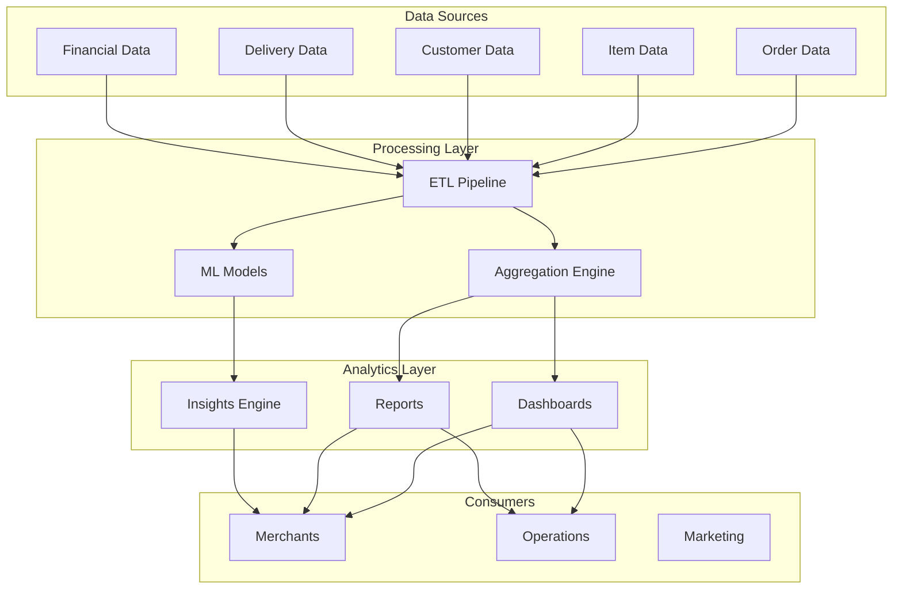

# Software Requirements Specification (SRS)

## Part 11D: Merchant Analytics

**Module:** Analytics & Reporting Module (Part 12)
**Version:** 1.0.0
**Status:** Final / For Review
**Date:** 2026-06-30

---

## Chapter 1 – Overview

### Purpose

The Merchant Analytics module defines the comprehensive analytics capabilities for merchants on the **[Platform Name]** platform. This encompasses merchant performance metrics, sales analytics, order analytics, customer insights, item performance, delivery performance, financial analytics, and benchmarking.

Merchant analytics is the foundation for data-driven decision-making on the merchant side. By providing clear, actionable insights into their business performance, merchants can optimize their operations, improve customer satisfaction, and increase profitability. This module ensures that merchants have the analytics they need to succeed on the platform.

### Objectives

- Provide real-time and historical sales visibility
- Enable item and menu performance analysis
- Understand customer behavior and preferences
- Track delivery and operational performance
- Monitor financial performance and profitability
- Enable benchmarking and competitive analysis
- Support data-driven decision-making
- Provide actionable insights and recommendations

---

## Chapter 2 – Architecture

### MERCHAN-001 Architecture

### MERCHAN-002 Components

| Component | Description | Priority |
| :--- | :--- | :--- |
| **ETL Pipeline** | Extracts, transforms, loads merchant data | **Required** |
| **Aggregation Engine** | Aggregates merchant metrics | **Required** |
| **ML Models** | Sales forecasting, item performance | **Required** |
| **Dashboards** | Merchant analytics dashboards | **Required** |
| **Reports** | Merchant reports | **Required** |
| **Insights Engine** | Actionable insights | **Required** |

---

## Chapter 3 – Key Performance Indicators

### MERCHAN-003 Merchant KPIs

| KPI | Description | Target | Priority |
| :--- | :--- | :--- | :--- |
| **Total Orders** | Number of orders | Increasing | **Required** |
| **Total Revenue** | Gross revenue | Increasing | **Required** |
| **Net Revenue** | Revenue after commissions | Increasing | **Required** |
| **Average Order Value** | Average value per order | Increasing | **Required** |
| **Customer Count** | Unique customers | Increasing | **Required** |
| **Order Frequency** | Orders per customer | Increasing | **Required** |
| **Customer Rating** | Average customer rating | > 4.5/5 | **Required** |
| **Preparation Time** | Time to prepare orders | Decreasing | **Required** |
| **Cancellation Rate** | % of orders cancelled | < 5% | **Required** |
| **Customer Retention** | % of customers retained | Increasing | **Required** |

### MERCHAN-004 KPI Data Model

| Column | Type | Constraints | Description |
| :--- | :--- | :--- | :--- |
| `kpi_id` | UUID | PRIMARY KEY | Unique identifier |
| `merchant_id` | UUID | FOREIGN KEY (merchant_accounts.merchant_id) | Associated merchant |
| `kpi_date` | DATE | NOT NULL | Date of KPIs |
| `total_orders` | INTEGER | | Total orders |
| `total_revenue` | DECIMAL(12, 2) | | Total revenue |
| `net_revenue` | DECIMAL(12, 2) | | Net revenue |
| `aov` | DECIMAL(10, 2) | | Average order value |
| `customer_count` | INTEGER | | Unique customers |
| `order_frequency` | DECIMAL(5, 2) | | Orders per customer |
| `customer_rating` | DECIMAL(3, 2) | | Average rating |
| `prep_time_avg` | INTEGER | | Average prep time |
| `cancellation_rate` | DECIMAL(5, 2) | | Cancellation rate |
| `retention_rate` | DECIMAL(5, 2) | | Customer retention |
| `created_at` | TIMESTAMP | DEFAULT NOW() | Creation timestamp |
| `updated_at` | TIMESTAMP | DEFAULT NOW() | Last update timestamp |

---

## Chapter 4 – Operational Metrics

### MERCHAN-005 Operational Metrics

| Metric | Description | Priority |
| :--- | :--- | :--- | :--- |
| **Orders** | Total orders by period | **Required** |
| **Revenue** | Revenue by period | **Required** |
| **AOV** | Average order value | **Required** |
| **Peak Hours** | Busiest hours | **Required** |
| **Busiest Days** | Busiest days of week | **Required** |
| **Order Status** | Orders by status | **Required** |
| **Preparation Time** | Average prep time | **Required** |
| **Fulfillment Time** | Time from order to delivery | **Required** |
| **Cancellations** | Cancellation reasons | **Required** |

### MERCHAN-006 Operational Data Model

| Column | Type | Constraints | Description |
| :--- | :--- | :--- | :--- |
| `operational_id` | UUID | PRIMARY KEY | Unique identifier |
| `merchant_id` | UUID | FOREIGN KEY (merchant_accounts.merchant_id) | Associated merchant |
| `date` | DATE | NOT NULL | Date |
| `total_orders` | INTEGER | | Total orders |
| `revenue` | DECIMAL(12, 2) | | Revenue |
| `aov` | DECIMAL(10, 2) | | Average order value |
| `peak_hour` | INTEGER | | Busiest hour |
| `busiest_day` | INTEGER | | Busiest day (0-6) |
| `orders_by_status` | JSONB | | Status distribution |
| `avg_prep_time` | INTEGER | | Average prep time |
| `avg_fulfillment_time` | INTEGER | | Average fulfillment time |
| `cancellation_reasons` | JSONB` | | Cancellation breakdown |
| `created_at` | TIMESTAMP | DEFAULT NOW() | Creation timestamp |
| `updated_at` | TIMESTAMP | DEFAULT NOW() | Last update timestamp |

---

## Chapter 5 – Sales Analytics

### MERCHAN-007 Sales Metrics

| Metric | Description | Priority |
| :--- | :--- | :--- | :--- |
| **Daily Sales** | Sales by day | **Required** |
| **Weekly Sales** | Sales by week | **Required** |
| **Monthly Sales** | Sales by month | **Required** |
| **Hourly Sales** | Sales by hour | **Required** |
| **Category Sales** | Sales by category | **Required** |
| **Item Sales** | Sales by item | **Required** |
| **Sales Growth** | Period-over-period growth | **Required** |
| **Sales Forecast** | Future sales prediction | **Required** |

### MERCHAN-008 Sales Data Model

| Column | Type | Constraints | Description |
| :--- | :--- | :--- | :--- |
| `sales_id` | UUID | PRIMARY KEY | Unique identifier |
| `merchant_id` | UUID | FOREIGN KEY (merchant_accounts.merchant_id) | Associated merchant |
| `date` | DATE | NOT NULL | Sales date |
| `daily_revenue` | DECIMAL(12, 2) | | Daily revenue |
| `daily_orders` | INTEGER | | Daily orders |
| `weekly_revenue` | DECIMAL(12, 2) | | Weekly revenue |
| `weekly_orders` | INTEGER | | Weekly orders |
| `monthly_revenue` | DECIMAL(12, 2) | | Monthly revenue |
| `monthly_orders` | INTEGER | | Monthly orders |
| `hourly_distribution` | JSONB | | Hourly sales breakdown |
| `category_sales` | JSONB` | | Sales by category |
| `growth_rate` | DECIMAL(5, 2) | | Period-over-period growth |
| `forecast` | DECIMAL(12, 2) | | Sales forecast |
| `created_at` | TIMESTAMP | DEFAULT NOW() | Creation timestamp |
| `updated_at` | TIMESTAMP | DEFAULT NOW() | Last update timestamp |

---

## Chapter 6 – Item Performance Analytics

### MERCHAN-009 Item Performance Metrics

| Metric | Description | Priority |
| :--- | :--- | :--- | :--- |
| **Top Selling Items** | Items by order frequency | **Required** |
| **Top Revenue Items** | Items by revenue | **Required** |
| **Item Conversion Rate** | Views to orders | **Required** |
| **Item Profitability** | Margin per item | **Required** |
| **Item Combo Analysis** | Frequently ordered together | **Required** |
| **Item Trends** | Rising/declining items | **Required** |
| **Item Ratings** | Customer ratings per item | **Required** |
| **Item Modifiers** | Popular modifier combinations | **Required** |

### MERCHAN-010 Item Data Model

| Column | Type | Constraints | Description |
| :--- | :--- | :--- | :--- |
| `item_analytics_id` | UUID | PRIMARY KEY | Unique identifier |
| `merchant_id` | UUID | FOREIGN KEY (merchant_accounts.merchant_id) | Associated merchant |
| `item_id` | UUID | FOREIGN KEY (menu_items.item_id) | Associated item |
| `date` | DATE | NOT NULL | Analytics date |
| `orders_count` | INTEGER | | Orders containing item |
| `units_sold` | INTEGER | | Total units sold |
| `revenue` | DECIMAL(12, 2) | | Revenue from item |
| `revenue_percentage` | DECIMAL(5, 2) | | % of total revenue |
| `conversion_rate` | DECIMAL(5, 2) | | View-to-order conversion |
| `avg_rating` | DECIMAL(3, 2) | | Average item rating |
| `profit_margin` | DECIMAL(5, 2) | | Item profit margin |
| `created_at` | TIMESTAMP | DEFAULT NOW() | Creation timestamp |
| `updated_at` | TIMESTAMP | DEFAULT NOW() | Last update timestamp |

---

## Chapter 7 – Customer Analytics (Merchant View)

### MERCHAN-011 Customer Insights

| Insight | Description | Priority |
| :--- | :--- | :--- | :--- |
| **Customer Count** | Unique customers | **Required** |
| **New vs Returning** | New vs. returning customers | **Required** |
| **Customer Retention** | Retention rate | **Required** |
| **Customer LTV** | Average customer lifetime value | **Required** |
| **Top Customers** | Highest value customers | **Required** |
| **Customer Geography** | Location heatmap | **Required** |
| **Customer Preferences** | Cuisine and category preferences | **Required** |
| **Customer Feedback** | Review sentiment analysis | **Required** |

### MERCHAN-012 Customer Data Model

| Column | Type | Constraints | Description |
| :--- | :--- | :--- | :--- |
| `customer_analytics_id` | UUID | PRIMARY KEY | Unique identifier |
| `merchant_id` | UUID | FOREIGN KEY (merchant_accounts.merchant_id) | Associated merchant |
| `date` | DATE | NOT NULL | Analytics date |
| `total_customers` | INTEGER | | Unique customers |
| `new_customers` | INTEGER | | New customers |
| `returning_customers` | INTEGER` | | Returning customers |
| `retention_rate` | DECIMAL(5, 2) | | Retention rate % |
| `avg_ltv` | DECIMAL(10, 2) | | Average LTV |
| `top_customers` | JSONB` | | Top 10 customers |
| `customer_geography` | JSONB` | | Location heatmap |
| `customer_preferences` | JSONB` | | Preference analysis |
| `sentiment_score` | DECIMAL(3, 2) | | Review sentiment |
| `created_at` | TIMESTAMP | DEFAULT NOW() | Creation timestamp |
| `updated_at` | TIMESTAMP | DEFAULT NOW() | Last update timestamp |

---

## Chapter 8 – Delivery Performance Analytics

### MERCHAN-013 Delivery Metrics

| Metric | Description | Priority |
| :--- | :--- | :--- | :--- |
| **Average Delivery Time** | Time from order to delivery | **Required** |
| **On-Time Delivery Rate** | % on time | **Required** |
| **Driver Arrival Time** | Time from assignment to arrival | **Required** |
| **Pickup Time** | Time from ready to pickup | **Required** |
| **Customer Wait Time** | Time driver waited for customer | **Required** |
| **Delivery Distance** | Average delivery distance | **Required** |
| **Delivery Zone Performance** | Performance by zone | **Required** |

### MERCHAN-014 Delivery Data Model

| Column | Type | Constraints | Description |
| :--- | :--- | :--- | :--- |
| `delivery_analytics_id` | UUID | PRIMARY KEY | Unique identifier |
| `merchant_id` | UUID | FOREIGN KEY (merchant_accounts.merchant_id) | Associated merchant |
| `date` | DATE | NOT NULL | Analytics date |
| `avg_delivery_time` | INTEGER | | Average delivery time |
| `on_time_rate` | DECIMAL(5, 2) | | On-time rate % |
| `avg_driver_arrival` | INTEGER | | Avg driver arrival time |
| `avg_pickup_time` | INTEGER | | Avg pickup time |
| `avg_customer_wait` | INTEGER | | Avg customer wait time |
| `avg_distance` | DECIMAL(10, 2) | | Average distance |
| `zone_performance` | JSONB` | | Performance by zone |
| `created_at` | TIMESTAMP | DEFAULT NOW() | Creation timestamp |
| `updated_at` | TIMESTAMP | DEFAULT NOW() | Last update timestamp |

---

## Chapter 9 – Financial Analytics

### MERCHAN-015 Financial Metrics

| Metric | Description | Priority |
| :--- | :--- | :--- | :--- |
| **Gross Revenue** | Total sales before deductions | **Required** |
| **Net Revenue** | Revenue after commissions | **Required** |
| **Commission** | Commission paid to platform | **Required** |
| **Fees** | Platform fees | **Required** |
| **Tax** | Tax collected | **Required** |
| **Profit Margin** | Net revenue / Gross revenue | **Required** |
| **Revenue by Day** | Daily revenue breakdown | **Required** |
| **Revenue by Channel** | Revenue by order source | **Required** |
| **Revenue by Category** | Revenue by category | **Required** |

### MERCHAN-016 Financial Data Model

| Column | Type | Constraints | Description |
| :--- | :--- | :--- | :--- |
| `financial_id` | UUID | PRIMARY KEY | Unique identifier |
| `merchant_id` | UUID | FOREIGN KEY (merchant_accounts.merchant_id) | Associated merchant |
| `date` | DATE | NOT NULL | Financial date |
| `gross_revenue` | DECIMAL(12, 2) | | Gross revenue |
| `net_revenue` | DECIMAL(12, 2) | | Net revenue |
| `commission` | DECIMAL(12, 2) | | Commission paid |
| `fees` | DECIMAL(12, 2) | | Platform fees |
| `tax` | DECIMAL(12, 2) | | Tax collected |
| `profit_margin` | DECIMAL(5, 2) | | Profit margin % |
| `revenue_by_day` | JSONB` | | Daily breakdown |
| `revenue_by_channel` | JSONB` | | Channel breakdown |
| `revenue_by_category` | JSONB` | | Category breakdown |
| `created_at` | TIMESTAMP | DEFAULT NOW() | Creation timestamp |
| `updated_at` | TIMESTAMP | DEFAULT NOW() | Last update timestamp |

---

## Chapter 10 – Benchmarking

### MERCHAN-017 Benchmarking Metrics

| Metric | Description | Priority |
| :--- | :--- | :--- | :--- |
| **Industry Benchmarks** | Compare to industry averages | **Required** |
| **Peer Comparison** | Compare to similar merchants | **Required** |
| **Category Comparison** | Compare to same category | **Required** |
| **Regional Comparison** | Compare to region | **Required** |
| **Size Comparison** | Compare to similar size | **Required** |
| **Performance Ranking** | Ranking among peers | **Required** |

### MERCHAN-018 Benchmark Data Model

| Column | Type | Constraints | Description |
| :--- | :--- | :--- | :--- |
| `benchmark_id` | UUID | PRIMARY KEY | Unique identifier |
| `merchant_id` | UUID | FOREIGN KEY (merchant_accounts.merchant_id) | Associated merchant |
| `metric_type` | VARCHAR(50) | NOT NULL | ORDERS/REVENUE/RATING/PREP_TIME/CHURN |
| `merchant_value` | DECIMAL(10, 2) | | Merchant's value |
| `industry_average` | DECIMAL(10, 2) | | Industry average |
| `category_average` | DECIMAL(10, 2) | | Category average |
| `peer_average` | DECIMAL(10, 2) | | Peer average |
| `rank` | INTEGER | | Performance rank |
| `percentile` | INTEGER | | Percentile |
| `created_at` | TIMESTAMP | DEFAULT NOW() | Creation timestamp |
| `updated_at` | TIMESTAMP | DEFAULT NOW() | Last update timestamp |

---

## Chapter 11 – Reporting

### MERCHAN-019 Merchant Reports

| Report | Description | Frequency | Priority |
| :--- | :--- | :--- | :--- |
| **Daily Sales Report** | Daily sales summary | Daily | **Required** |
| **Weekly Sales Report** | Weekly sales summary | Weekly | **Required** |
| **Monthly Sales Report** | Monthly sales summary | Monthly | **Required** |
| **Item Performance Report** | Item performance analysis | Weekly | **Required** |
| **Customer Report** | Customer insights | Monthly | **Required** |
| **Delivery Report** | Delivery performance | Weekly | **Required** |
| **Financial Report** | Financial summary | Monthly | **Required** |
| **Benchmark Report** | Competitive benchmarking | Monthly | **Required** |

### MERCHAN-020 Report Features

| Feature | Description | Priority |
| :--- | :--- | :--- | :--- |
| **Export Formats** | PDF, CSV, Excel | **Required** |
| **Scheduled Delivery** | Auto-deliver reports | **Required** |
| **Date Range Selection** | User-selectable date range | **Required** |
| **Filtering** | Filter by category, item, etc. | **Required** |
| **Comparison** | Compare periods | **Required** |
| **Charts** | Interactive charts | **Required** |
| **Comments** | Add comments to reports | **Required** |
| **Sharing** | Share reports with team | **Required** |

---

## Chapter 12 – Database Tables

### merchant_analytics_kpis

| Column | Type | Constraints | Description |
| :--- | :--- | :--- | :--- |
| `kpi_id` | UUID | PRIMARY KEY | Unique identifier |
| `merchant_id` | UUID | FOREIGN KEY (merchant_accounts.merchant_id) | Associated merchant |
| `kpi_date` | DATE | NOT NULL | Date of KPIs |
| `total_orders` | INTEGER | | Total orders |
| `total_revenue` | DECIMAL(12, 2) | | Total revenue |
| `net_revenue` | DECIMAL(12, 2) | | Net revenue |
| `aov` | DECIMAL(10, 2) | | Average order value |
| `customer_count` | INTEGER | | Unique customers |
| `order_frequency` | DECIMAL(5, 2) | | Orders per customer |
| `customer_rating` | DECIMAL(3, 2) | | Average rating |
| `prep_time_avg` | INTEGER | | Average prep time |
| `cancellation_rate` | DECIMAL(5, 2) | | Cancellation rate |
| `retention_rate` | DECIMAL(5, 2) | | Customer retention |
| `created_at` | TIMESTAMP | DEFAULT NOW() | Creation timestamp |
| `updated_at` | TIMESTAMP | DEFAULT NOW() | Last update timestamp |

### merchant_analytics_operational

| Column | Type | Constraints | Description |
| :--- | :--- | :--- | :--- |
| `operational_id` | UUID | PRIMARY KEY | Unique identifier |
| `merchant_id` | UUID | FOREIGN KEY (merchant_accounts.merchant_id) | Associated merchant |
| `date` | DATE | NOT NULL | Date |
| `total_orders` | INTEGER | | Total orders |
| `revenue` | DECIMAL(12, 2) | | Revenue |
| `aov` | DECIMAL(10, 2) | | Average order value |
| `peak_hour` | INTEGER | | Busiest hour |
| `busiest_day` | INTEGER | | Busiest day |
| `orders_by_status` | JSONB | | Status distribution |
| `avg_prep_time` | INTEGER | | Average prep time |
| `avg_fulfillment_time` | INTEGER | | Average fulfillment time |
| `cancellation_reasons` | JSONB | | Cancellation breakdown |
| `created_at` | TIMESTAMP | DEFAULT NOW() | Creation timestamp |
| `updated_at` | TIMESTAMP | DEFAULT NOW() | Last update timestamp |

### merchant_analytics_sales

| Column | Type | Constraints | Description |
| :--- | :--- | :--- | :--- |
| `sales_id` | UUID | PRIMARY KEY | Unique identifier |
| `merchant_id` | UUID | FOREIGN KEY (merchant_accounts.merchant_id) | Associated merchant |
| `date` | DATE | NOT NULL | Sales date |
| `daily_revenue` | DECIMAL(12, 2) | | Daily revenue |
| `daily_orders` | INTEGER | | Daily orders |
| `weekly_revenue` | DECIMAL(12, 2) | | Weekly revenue |
| `weekly_orders` | INTEGER | | Weekly orders |
| `monthly_revenue` | DECIMAL(12, 2) | | Monthly revenue |
| `monthly_orders` | INTEGER | | Monthly orders |
| `hourly_distribution` | JSONB | | Hourly breakdown |
| `category_sales` | JSONB | | Category breakdown |
| `growth_rate` | DECIMAL(5, 2) | | Growth rate |
| `forecast` | DECIMAL(12, 2) | | Sales forecast |
| `created_at` | TIMESTAMP | DEFAULT NOW() | Creation timestamp |
| `updated_at` | TIMESTAMP | DEFAULT NOW() | Last update timestamp |

### merchant_analytics_items

| Column | Type | Constraints | Description |
| :--- | :--- | :--- | :--- |
| `item_analytics_id` | UUID | PRIMARY KEY | Unique identifier |
| `merchant_id` | UUID | FOREIGN KEY (merchant_accounts.merchant_id) | Associated merchant |
| `item_id` | UUID | FOREIGN KEY (menu_items.item_id) | Associated item |
| `date` | DATE | NOT NULL | Analytics date |
| `orders_count` | INTEGER | | Orders containing item |
| `units_sold` | INTEGER | | Total units sold |
| `revenue` | DECIMAL(12, 2) | | Revenue from item |
| `revenue_percentage` | DECIMAL(5, 2) | | % of total revenue |
| `conversion_rate` | DECIMAL(5, 2) | | Conversion rate |
| `avg_rating` | DECIMAL(3, 2) | | Average item rating |
| `profit_margin` | DECIMAL(5, 2) | | Profit margin |
| `created_at` | TIMESTAMP | DEFAULT NOW() | Creation timestamp |
| `updated_at` | TIMESTAMP | DEFAULT NOW() | Last update timestamp |

### merchant_analytics_customers

| Column | Type | Constraints | Description |
| :--- | :--- | :--- | :--- |
| `customer_analytics_id` | UUID | PRIMARY KEY | Unique identifier |
| `merchant_id` | UUID | FOREIGN KEY (merchant_accounts.merchant_id) | Associated merchant |
| `date` | DATE | NOT NULL | Analytics date |
| `total_customers` | INTEGER | | Unique customers |
| `new_customers` | INTEGER | | New customers |
| `returning_customers` | INTEGER | | Returning customers |
| `retention_rate` | DECIMAL(5, 2) | | Retention rate |
| `avg_ltv` | DECIMAL(10, 2) | | Average LTV |
| `top_customers` | JSONB | | Top 10 customers |
| `customer_geography` | JSONB | | Location heatmap |
| `customer_preferences` | JSONB | | Preference analysis |
| `sentiment_score` | DECIMAL(3, 2) | | Review sentiment |
| `created_at` | TIMESTAMP | DEFAULT NOW() | Creation timestamp |
| `updated_at` | TIMESTAMP | DEFAULT NOW() | Last update timestamp |

### merchant_analytics_delivery

| Column | Type | Constraints | Description |
| :--- | :--- | :--- | :--- |
| `delivery_analytics_id` | UUID | PRIMARY KEY | Unique identifier |
| `merchant_id` | UUID | FOREIGN KEY (merchant_accounts.merchant_id) | Associated merchant |
| `date` | DATE | NOT NULL | Analytics date |
| `avg_delivery_time` | INTEGER | | Average delivery time |
| `on_time_rate` | DECIMAL(5, 2) | | On-time rate |
| `avg_driver_arrival` | INTEGER | | Avg driver arrival time |
| `avg_pickup_time` | INTEGER | | Avg pickup time |
| `avg_customer_wait` | INTEGER | | Avg customer wait time |
| `avg_distance` | DECIMAL(10, 2) | | Average distance |
| `zone_performance` | JSONB | | Performance by zone |
| `created_at` | TIMESTAMP | DEFAULT NOW() | Creation timestamp |
| `updated_at` | TIMESTAMP | DEFAULT NOW() | Last update timestamp |

### merchant_analytics_financial

| Column | Type | Constraints | Description |
| :--- | :--- | :--- | :--- |
| `financial_id` | UUID | PRIMARY KEY | Unique identifier |
| `merchant_id` | UUID | FOREIGN KEY (merchant_accounts.merchant_id) | Associated merchant |
| `date` | DATE | NOT NULL | Financial date |
| `gross_revenue` | DECIMAL(12, 2) | | Gross revenue |
| `net_revenue` | DECIMAL(12, 2) | | Net revenue |
| `commission` | DECIMAL(12, 2) | | Commission |
| `fees` | DECIMAL(12, 2) | | Platform fees |
| `tax` | DECIMAL(12, 2) | | Tax collected |
| `profit_margin` | DECIMAL(5, 2) | | Profit margin |
| `revenue_by_day` | JSONB | | Daily breakdown |
| `revenue_by_channel` | JSONB | | Channel breakdown |
| `revenue_by_category` | JSONB | | Category breakdown |
| `created_at` | TIMESTAMP | DEFAULT NOW() | Creation timestamp |
| `updated_at` | TIMESTAMP | DEFAULT NOW() | Last update timestamp |

### merchant_analytics_benchmarks

| Column | Type | Constraints | Description |
| :--- | :--- | :--- | :--- |
| `benchmark_id` | UUID | PRIMARY KEY | Unique identifier |
| `merchant_id` | UUID | FOREIGN KEY (merchant_accounts.merchant_id) | Associated merchant |
| `metric_type` | VARCHAR(50) | NOT NULL | ORDERS/REVENUE/RATING/PREP_TIME/CHURN |
| `merchant_value` | DECIMAL(10, 2) | | Merchant's value |
| `industry_average` | DECIMAL(10, 2) | | Industry average |
| `category_average` | DECIMAL(10, 2) | | Category average |
| `peer_average` | DECIMAL(10, 2) | | Peer average |
| `rank` | INTEGER | | Performance rank |
| `percentile` | INTEGER | | Percentile |
| `created_at` | TIMESTAMP | DEFAULT NOW() | Creation timestamp |
| `updated_at` | TIMESTAMP | DEFAULT NOW() | Last update timestamp |

### merchant_reports

| Column | Type | Constraints | Description |
| :--- | :--- | :--- | :--- |
| `report_id` | UUID | PRIMARY KEY | Unique identifier |
| `merchant_id` | UUID | FOREIGN KEY (merchant_accounts.merchant_id) | Associated merchant |
| `report_name` | VARCHAR(100) | NOT NULL | Report name |
| `report_type` | VARCHAR(30) | NOT NULL | DAILY/WEEKLY/MONTHLY |
| `configuration` | JSONB` | NOT NULL | Report configuration |
| `schedule` | VARCHAR(50) | | Scheduled delivery |
| `recipients` | TEXT[]` | | Email recipients |
| `format` | VARCHAR(10) | DEFAULT 'PDF' | PDF/CSV/EXCEL |
| `last_generated` | TIMESTAMP | | Last generation timestamp |
| `is_active` | BOOLEAN | DEFAULT TRUE | Active status |
| `created_at` | TIMESTAMP | DEFAULT NOW() | Creation timestamp |
| `updated_at` | TIMESTAMP | DEFAULT NOW() | Last update timestamp |

---

## Chapter 13 – REST APIs

### KPI APIs

| Method | Endpoint | Description |
| :--- | :--- | :--- |
| `GET` | `/api/v1/merchant/analytics/kpis` | Get merchant KPIs |
| `GET` | `/api/v1/merchant/analytics/kpis/trends` | Get KPI trends |
| `GET` | `/api/v1/merchant/analytics/kpis/{id}` | Get KPI details |

### Operational APIs

| Method | Endpoint | Description |
| :--- | :--- | :--- |
| `GET` | `/api/v1/merchant/analytics/operational` | Get operational metrics |
| `GET` | `/api/v1/merchant/analytics/operational/daily` | Get daily operational metrics |
| `GET` | `/api/v1/merchant/analytics/operational/hourly` | Get hourly distribution |

### Sales APIs

| Method | Endpoint | Description |
| :--- | :--- | :--- |
| `GET` | `/api/v1/merchant/analytics/sales` | Get sales analytics |
| `GET` | `/api/v1/merchant/analytics/sales/daily` | Get daily sales |
| `GET` | `/api/v1/merchant/analytics/sales/weekly` | Get weekly sales |
| `GET` | `/api/v1/merchant/analytics/sales/monthly` | Get monthly sales |
| `GET` | `/api/v1/merchant/analytics/sales/categories` | Get category sales |
| `GET` | `/api/v1/merchant/analytics/sales/forecast` | Get sales forecast |

### Item APIs

| Method | Endpoint | Description |
| :--- | :--- | :--- |
| `GET` | `/api/v1/merchant/analytics/items` | Get item performance |
| `GET` | `/api/v1/merchant/analytics/items/top` | Get top items |
| `GET` | `/api/v1/merchant/analytics/items/{id}` | Get item analytics |
| `GET` | `/api/v1/merchant/analytics/items/trends` | Get item trends |

### Customer APIs

| Method | Endpoint | Description |
| :--- | :--- | :--- |
| `GET` | `/api/v1/merchant/analytics/customers` | Get customer insights |
| `GET` | `/api/v1/merchant/analytics/customers/top` | Get top customers |
| `GET` | `/api/v1/merchant/analytics/customers/retention` | Get customer retention |
| `GET` | `/api/v1/merchant/analytics/customers/feedback` | Get customer feedback |

### Delivery APIs

| Method | Endpoint | Description |
| :--- | :--- | :--- |
| `GET` | `/api/v1/merchant/analytics/delivery` | Get delivery analytics |
| `GET` | `/api/v1/merchant/analytics/delivery/zones` | Get zone performance |
| `GET` | `/api/v1/merchant/analytics/delivery/trends` | Get delivery trends |

### Financial APIs

| Method | Endpoint | Description |
| :--- | :--- | :--- |
| `GET` | `/api/v1/merchant/analytics/financial` | Get financial analytics |
| `GET` | `/api/v1/merchant/analytics/financial/margin` | Get profit margin |
| `GET` | `/api/v1/merchant/analytics/financial/breakdown` | Get revenue breakdown |

### Benchmark APIs

| Method | Endpoint | Description |
| :--- | :--- | :--- |
| `GET` | `/api/v1/merchant/analytics/benchmarks` | Get benchmarking |
| `GET` | `/api/v1/merchant/analytics/benchmarks/industry` | Get industry benchmarks |
| `GET` | `/api/v1/merchant/analytics/benchmarks/rank` | Get performance rank |

### Report APIs

| Method | Endpoint | Description |
| :--- | :--- | :--- |
| `GET` | `/api/v1/merchant/analytics/reports` | Get merchant reports |
| `GET` | `/api/v1/merchant/analytics/reports/{id}` | Get report details |
| `POST` | `/api/v1/merchant/analytics/reports/generate` | Generate report |
| `GET` | `/api/v1/merchant/analytics/reports/{id}/download` | Download report |
| `POST` | `/api/v1/merchant/analytics/reports/schedule` | Schedule report |

---

## Chapter 14 – Business Rules

| Rule ID | Rule Description | Priority |
| :--- | :--- | :--- |
| **BR-MERCHAN-001** | Merchant analytics must be updated daily. | **High** |
| **BR-MERCHAN-002** | Sales data must be retained for 7 years. | **High** |
| **BR-MERCHAN-003** | Item performance must be tracked weekly. | **High** |
| **BR-MERCHAN-004** | Customer insights must be updated weekly. | **High** |
| **BR-MERCHAN-005** | Benchmark data must be refreshed monthly. | **High** |
| **BR-MERCHAN-006** | Forecast models must be retrained weekly. | **High** |
| **BR-MERCHAN-007** | Merchant data must be anonymized for privacy compliance. | **High** |
| **BR-MERCHAN-008** | Reports must be generated on schedule. | **High** |
| **BR-MERCHAN-009** | Unit economics must be calculated per order. | **High** |
| **BR-MERCHAN-010** | Profit margin must be tracked monthly. | **High** |

---

## Chapter 15 – Acceptance Tests

| Test ID | Test Description | Priority |
| :--- | :--- | :--- |
| **TEST-MERCHAN-001** | Merchant analytics dashboard displays correctly. | **High** |
| **TEST-MERCHAN-002** | KPIs displayed correctly. | **High** |
| **TEST-MERCHAN-003** | KPI trends displayed correctly. | **High** |
| **TEST-MERCHAN-004** | Sales analytics displayed correctly. | **High** |
| **TEST-MERCHAN-005** | Daily sales report displays correctly. | **High** |
| **TEST-MERCHAN-006** | Weekly sales report displays correctly. | **High** |
| **TEST-MERCHAN-007** | Monthly sales report displays correctly. | **High** |
| **TEST-MERCHAN-008** | Item performance list displays correctly. | **High** |
| **TEST-MERCHAN-009** | Top items list displays correctly. | **High** |
| **TEST-MERCHAN-010** | Customer insights display correctly. | **High** |
| **TEST-MERCHAN-011** | Customer retention displayed correctly. | **High** |
| **TEST-MERCHAN-012** | Top customers list displays correctly. | **High** |
| **TEST-MERCHAN-013** | Delivery analytics display correctly. | **High** |
| **TEST-MERCHAN-014** | On-time delivery rate tracked correctly. | **High** |
| **TEST-MERCHAN-015** | Financial analytics display correctly. | **High** |
| **TEST-MERCHAN-016** | Profit margin calculated correctly. | **High** |
| **TEST-MERCHAN-017** | Revenue breakdown displayed correctly. | **High** |
| **TEST-MERCHAN-018** | Benchmarking data displayed correctly. | **High** |
| **TEST-MERCHAN-019** | Performance rank calculated correctly. | **High** |
| **TEST-MERCHAN-020** | Sales forecast generated correctly. | **High** |
| **TEST-MERCHAN-021** | Report generated and exported to PDF. | **High** |
| **TEST-MERCHAN-022** | Report exported to CSV. | **High** |
| **TEST-MERCHAN-023** | Scheduled report delivered by email. | **High** |
| **TEST-MERCHAN-024** | Category sales breakdown displayed correctly. | **High** |
| **TEST-MERCHAN-025** | Customer sentiment analysis displayed correctly. | **High** |

---

## Chapter 16 – Traceability Matrix

| Requirement | Database Table | API Endpoint(s) | Acceptance Test |
| :--- | :--- | :--- | :--- |
| MERCHAN-003 | merchant_analytics_kpis | GET /api/v1/merchant/analytics/kpis | TEST-MERCHAN-001, TEST-MERCHAN-002, TEST-MERCHAN-003 |
| MERCHAN-007 | merchant_analytics_sales | GET /api/v1/merchant/analytics/sales | TEST-MERCHAN-004, TEST-MERCHAN-005, TEST-MERCHAN-006, TEST-MERCHAN-007 |
| MERCHAN-009 | merchant_analytics_items | GET /api/v1/merchant/analytics/items | TEST-MERCHAN-008, TEST-MERCHAN-009 |
| MERCHAN-011 | merchant_analytics_customers | GET /api/v1/merchant/analytics/customers | TEST-MERCHAN-010, TEST-MERCHAN-011, TEST-MERCHAN-012, TEST-MERCHAN-025 |
| MERCHAN-013 | merchant_analytics_delivery | GET /api/v1/merchant/analytics/delivery | TEST-MERCHAN-013, TEST-MERCHAN-014 |
| MERCHAN-015 | merchant_analytics_financial | GET /api/v1/merchant/analytics/financial | TEST-MERCHAN-015, TEST-MERCHAN-016, TEST-MERCHAN-017 |
| MERCHAN-017 | merchant_analytics_benchmarks | GET /api/v1/merchant/analytics/benchmarks | TEST-MERCHAN-018, TEST-MERCHAN-019 |
| MERCHAN-007 | merchant_analytics_sales | GET /api/v1/merchant/analytics/sales/forecast | TEST-MERCHAN-020 |
| MERCHAN-019 | merchant_reports | GET /api/v1/merchant/analytics/reports | TEST-MERCHAN-021, TEST-MERCHAN-022, TEST-MERCHAN-023 |
| MERCHAN-007 | merchant_analytics_sales | GET /api/v1/merchant/analytics/sales/categories | TEST-MERCHAN-024 |

---

## Chapter 17 – Summary

This document establishes the complete merchant analytics capability for the **[Platform Name]** platform. Key takeaways:

- **Comprehensive Merchant KPIs:** Total orders, total revenue, net revenue, AOV, customer count, order frequency, customer rating, prep time, cancellation rate, and customer retention.
- **Operational Metrics:** Orders by period, revenue, AOV, peak hours, busiest days, order status, prep time, fulfillment time, and cancellations.
- **Sales Analytics:** Daily, weekly, monthly, hourly, category, and item sales with growth rates and forecasts.
- **Item Performance:** Top selling items, top revenue items, conversion rate, profitability, combo analysis, trends, and ratings.
- **Customer Insights:** Customer count, new vs. returning, retention, LTV, top customers, geography, preferences, and sentiment.
- **Delivery Analytics:** Average delivery time, on-time rate, driver arrival time, pickup time, customer wait time, distance, and zone performance.
- **Financial Analytics:** Gross revenue, net revenue, commission, fees, tax, profit margin, and revenue breakdown by day, channel, and category.
- **Benchmarking:** Industry benchmarks, peer comparison, category comparison, regional comparison, size comparison, and performance ranking.
- **Reporting:** Daily, weekly, and monthly reports with export capabilities (PDF, CSV, Excel).

The merchant analytics module empowers merchants with the insights they need to optimize their operations, improve customer satisfaction, and grow their business on the platform.

---

**Next Document:**

`Part_11E_Financial_Reporting.md`

*(This builds on merchant analytics to define financial reporting capabilities.)*