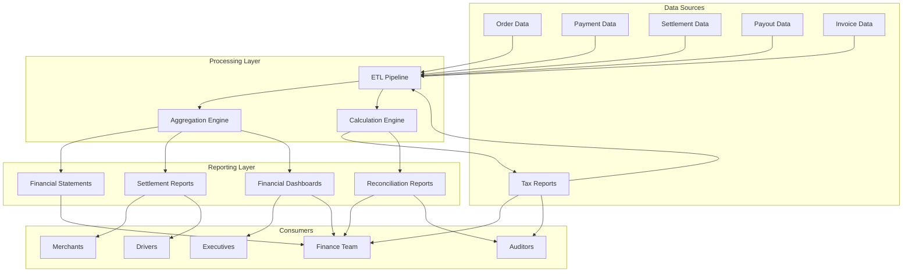

# Software Requirements Specification (SRS)

## Part 11E: Financial Reporting

**Module:** Analytics & Reporting Module (Part 12)
**Version:** 1.0.0
**Status:** Final / For Review
**Date:** 2026-06-30

---

## Chapter 1 – Overview

### Purpose

The Financial Reporting module defines the comprehensive financial reporting capabilities for the **[Platform Name]** platform. This encompasses financial statements, settlement reports, tax reports, reconciliation reports, and financial analytics dashboards.

Financial reporting is the foundation of financial transparency and accountability. Accurate, timely, and comprehensive financial reports enable stakeholders to understand platform performance, make informed decisions, and ensure regulatory compliance. This module ensures that financial reports are generated accurately, delivered reliably, and accessible to all relevant stakeholders.

### Objectives

- Generate accurate financial statements and reports
- Provide real-time and historical financial visibility
- Enable financial reconciliation and audit
- Support tax compliance and reporting
- Track financial performance and KPIs
- Provide financial analytics and insights
- Enable stakeholder-specific reporting
- Ensure regulatory compliance and transparency

---

## Chapter 2 – Architecture

### FINREP-001 Architecture

### FINREP-002 Components

| Component | Description | Priority |
| :--- | :--- | :--- |
| **ETL Pipeline** | Extracts, transforms, loads financial data | **Required** |
| **Aggregation Engine** | Aggregates financial metrics | **Required** |
| **Calculation Engine** | Performs financial calculations | **Required** |
| **Financial Statements** | Income statement, balance sheet, cash flow | **Required** |
| **Settlement Reports** | Merchant and driver settlement reports | **Required** |
| **Tax Reports** | Tax compliance and filing reports | **Required** |
| **Reconciliation Reports** | Financial reconciliation reports | **Required** |
| **Financial Dashboards** | Real-time financial dashboards | **Required** |

---

## Chapter 3 – Financial Statements

### FINREP-003 Income Statement

| Line Item | Description | Priority |
| :--- | :--- | :--- |
| **Revenue** | Total revenue from operations | **Required** |
| - Commission Revenue | Commission from merchants | **Required** |
| - Service Fee Revenue | Service fees from customers | **Required** |
| - Delivery Fee Revenue | Delivery fees | **Required** |
| - Other Revenue | Other revenue sources | **Required** |
| **Cost of Revenue** | Direct costs of operations | **Required** |
| - Driver Payouts | Driver earnings | **Required** |
| - Payment Processing Fees | Gateway fees | **Required** |
| - Support Costs | Customer support costs | **Required** |
| **Gross Profit** | Revenue - Cost of Revenue | **Required** |
| **Operating Expenses** | Operating expenses | **Required** |
| - Marketing | Marketing and advertising | **Required** |
| - Technology | Technology infrastructure | **Required** |
| - Administrative | Administrative costs | **Required** |
| - Sales | Sales team costs | **Required** |
| **Operating Income** | Gross Profit - Operating Expenses | **Required** |
| **Net Income** | Operating Income - Taxes - Interest | **Required** |

### FINREP-004 Balance Sheet

| Line Item | Description | Priority |
| :--- | :--- | :--- |
| **Assets** | | **Required** |
| - Cash and Cash Equivalents | Cash on hand | **Required** |
| - Accounts Receivable | Outstanding receivables | **Required** |
| - Prepaid Expenses | Prepaid costs | **Required** |
| - Property and Equipment | Fixed assets | **Required** |
| **Liabilities** | | **Required** |
| - Accounts Payable | Outstanding payables | **Required** |
| - Accrued Expenses | Accrued costs | **Required** |
| - Deferred Revenue | Unearned revenue | **Required** |
| **Equity** | | **Required** |
| - Retained Earnings | Accumulated earnings | **Required** |

### FINREP-005 Cash Flow Statement

| Line Item | Description | Priority |
| :--- | :--- | :--- |
| **Operating Cash Flow** | | **Required** |
| - Net Income | Net income for period | **Required** |
| - Adjustments | Non-cash adjustments | **Required** |
| - Changes in Working Capital | Working capital changes | **Required** |
| **Investing Cash Flow** | | **Required** |
| - Capital Expenditures | Capital spending | **Required** |
| **Financing Cash Flow** | | **Required** |
| - Debt Financing | Debt transactions | **Required** |
| **Net Change in Cash** | Total cash flow change | **Required** |

### FINREP-006 Financial Statement Data Model

| Column | Type | Constraints | Description |
| :--- | :--- | :--- | :--- |
| `statement_id` | UUID | PRIMARY KEY | Unique identifier |
| `statement_type` | VARCHAR(30) | NOT NULL | INCOME/BALANCE_SHEET/CASH_FLOW |
| `period_start` | DATE | NOT NULL | Period start date |
| `period_end` | DATE | NOT NULL | Period end date |
| `line_item` | VARCHAR(100) | NOT NULL | Line item name |
| `amount` | DECIMAL(15, 2) | NOT NULL | Amount |
| `currency` | VARCHAR(3) | NOT NULL | ISO 4217 currency |
| `created_at` | TIMESTAMP | DEFAULT NOW() | Creation timestamp |
| `updated_at` | TIMESTAMP | DEFAULT NOW() | Last update timestamp |

---

## Chapter 4 – Settlement Reports

### FINREP-007 Merchant Settlement Report

| Section | Content | Priority |
| :--- | :--- | :--- |
| **Header** | Merchant name, period, report date | **Required** |
| **Summary** | Orders, gross revenue, net settlement | **Required** |
| **Order Detail** | All orders with amounts and fees | **Required** |
| **Commission Detail** | Commission calculation | **Required** |
| **Fee Detail** | All fees deducted | **Required** |
| **Tax Detail** | Tax collected | **Required** |
| **Payment Detail** | Payout information | **Required** |

### FINREP-008 Driver Payout Report

| Section | Content | Priority |
| :--- | :--- | :--- |
| **Header** | Driver name, period, report date | **Required** |
| **Summary** | Deliveries, total earnings, net payout | **Required** |
| **Delivery Detail** | All deliveries with earnings | **Required** |
| **Earnings Detail** | Base, distance, time, tips, bonuses | **Required** |
| **Tax Detail** | Tax information | **Required** |
| **Payment Detail** | Payout information | **Required** |

### FINREP-009 Settlement Data Model

| Column | Type | Constraints | Description |
| :--- | :--- | :--- | :--- |
| `settlement_report_id` | UUID | PRIMARY KEY | Unique identifier |
| `recipient_type` | VARCHAR(20) | NOT NULL | MERCHANT/DRIVER |
| `recipient_id` | UUID | NOT NULL | Recipient identifier |
| `period_start` | DATE | NOT NULL | Period start |
| `period_end` | DATE | NOT NULL | Period end |
| `total_orders` | INTEGER | | Total orders/deliveries |
| `gross_amount` | DECIMAL(12, 2) | | Gross amount |
| `commission_deducted` | DECIMAL(12, 2) | | Commission deducted |
| `fees_deducted` | DECIMAL(12, 2) | | Fees deducted |
| `tax_deducted` | DECIMAL(12, 2) | | Tax deducted |
| `net_amount` | DECIMAL(12, 2) | | Net settlement |
| `currency` | VARCHAR(3) | NOT NULL | ISO 4217 currency |
| `payout_method` | VARCHAR(30) | | Payout method |
| `payout_date` | DATE | | Payout date |
| `report_url` | VARCHAR(500) | | Report file URL |
| `status` | VARCHAR(20) | DEFAULT 'GENERATED' | GENERATED/SENT/VIEWED |
| `created_at` | TIMESTAMP | DEFAULT NOW() | Creation timestamp |
| `updated_at` | TIMESTAMP | DEFAULT NOW() | Last update timestamp |

---

## Chapter 5 – Tax Reports

### FINREP-010 Tax Report Types

| Report | Description | Frequency | Priority |
| :--- | :--- | :--- | :--- |
| **VAT/GST Return** | Tax collected and remitted | Monthly/Quarterly | **Required** |
| **Taxable Sales Report** | Taxable vs. tax-exempt sales | Monthly | **Required** |
| **Tax Collected Report** | Tax collected by jurisdiction | Monthly | **Required** |
| **Tax Remitted Report** | Tax remitted by jurisdiction | Monthly | **Required** |
| **Customer Tax Report** | Tax per customer (B2B) | Annually | **Required** |
| **Tax Audit Report** | Detailed tax audit trail | On-demand | **Required** |

### FINREP-011 Tax Report Data Model

| Column | Type | Constraints | Description |
| :--- | :--- | :--- | :--- |
| `tax_report_id` | UUID | PRIMARY KEY | Unique identifier |
| `report_type` | VARCHAR(30) | NOT NULL | VAT_RETURN/TAXABLE_SALES/TAX_COLLECTED/TAX_REMITTED/CUSTOMER_TAX/TAX_AUDIT |
| `period_start` | DATE | NOT NULL | Period start |
| `period_end` | DATE | NOT NULL | Period end |
| `jurisdiction` | VARCHAR(50) | NOT NULL | Tax jurisdiction |
| `total_sales` | DECIMAL(15, 2) | | Total sales |
| `taxable_sales` | DECIMAL(15, 2) | | Taxable sales |
| `tax_exempt_sales` | DECIMAL(15, 2) | | Tax-exempt sales |
| `zero_rated_sales` | DECIMAL(15, 2) | | Zero-rated sales |
| `tax_collected` | DECIMAL(12, 2) | | Tax collected |
| `input_tax` | DECIMAL(12, 2) | | Input tax |
| `net_tax_due` | DECIMAL(12, 2) | | Net tax due |
| `currency` | VARCHAR(3) | NOT NULL | ISO 4217 currency |
| `report_url` | VARCHAR(500) | | Report file URL |
| `created_at` | TIMESTAMP | DEFAULT NOW() | Creation timestamp |
| `updated_at` | TIMESTAMP | DEFAULT NOW() | Last update timestamp |

---

## Chapter 6 – Reconciliation Reports

### FINREP-012 Reconciliation Types

| Type | Description | Priority |
| :--- | :--- | :--- |
| **Gateway Reconciliation** | Platform vs. gateway transactions | **Required** |
| **Merchant Reconciliation** | Merchant settlements | **Required** |
| **Driver Reconciliation** | Driver payouts | **Required** |
| **Platform Revenue Reconciliation** | Platform revenue | **Required** |
| **Tax Reconciliation** | Tax collection and remittance | **Required** |
| **Full Financial Reconciliation** | Complete reconciliation | **Required** |

### FINREP-013 Reconciliation Report Data Model

| Column | Type | Constraints | Description |
| :--- | :--- | :--- | :--- |
| `reconciliation_id` | UUID | PRIMARY KEY | Unique identifier |
| `reconciliation_type` | VARCHAR(30) | NOT NULL | GATEWAY/MERCHANT/DRIVER/PLATFORM/TAX/FULL |
| `period_start` | DATE | NOT NULL | Period start |
| `period_end` | DATE | NOT NULL | Period end |
| `total_transactions` | INTEGER | | Total transactions |
| `matched_count` | INTEGER | | Matched transactions |
| `unmatched_count` | INTEGER | | Unmatched transactions |
| `discrepancy_count` | INTEGER` | | Discrepancy count |
| `total_amount` | DECIMAL(15, 2) | | Total amount |
| `discrepancy_amount` | DECIMAL(15, 2) | | Discrepancy amount |
| `currency` | VARCHAR(3) | NOT NULL | ISO 4217 currency |
| `status` | VARCHAR(20) | DEFAULT 'PENDING' | PENDING/IN_PROGRESS/RECONCILED/DISCREPANT |
| `reconciled_by` | UUID | | Reconciler identifier |
| `reconciled_at` | TIMESTAMP | | Reconciliation timestamp |
| `report_url` | VARCHAR(500) | | Report file URL |
| `created_at` | TIMESTAMP | DEFAULT NOW() | Creation timestamp |
| `updated_at` | TIMESTAMP | DEFAULT NOW() | Last update timestamp |

---

## Chapter 7 – Financial Dashboards

### FINREP-014 Executive Financial Dashboard

| Widget | Description | Priority |
| :--- | :--- | :--- |
| **Revenue** | Total revenue and trend | **Required** |
| **Revenue Breakdown** | Revenue by source | **Required** |
| **Cost Breakdown** | Costs by category | **Required** |
| **Gross Profit** | Gross profit and margin | **Required** |
| **Operating Income** | Operating income and margin | **Required** |
| **Net Income** | Net income and margin | **Required** |
| **Cash Position** | Cash balance and trend | **Required** |
| **Unit Economics** | Per-order economics | **Required** |

### FINREP-015 Operations Financial Dashboard

| Widget | Description | Priority |
| :--- | :--- | :--- |
| **Revenue Per Order** | Revenue per order | **Required** |
| **Cost Per Order** | Cost per order | **Required** |
| **Contribution Margin** | Contribution margin per order | **Required** |
| **Commission Revenue** | Commission revenue trend | **Required** |
| **Driver Payouts** | Driver payout trend | **Required** |
| **Payment Fees** | Payment processing fees | **Required** |

### FINREP-016 Financial Data Model

| Column | Type | Constraints | Description |
| :--- | :--- | :--- | :--- |
| `financial_id` | UUID | PRIMARY KEY | Unique identifier |
| `financial_date` | DATE | NOT NULL | Date of financials |
| `revenue` | DECIMAL(15, 2) | | Total revenue |
| `revenue_breakdown` | JSONB` | | Revenue by source |
| `cost_breakdown` | JSONB` | | Costs by category |
| `gross_profit` | DECIMAL(15, 2) | | Gross profit |
| `gross_margin` | DECIMAL(5, 2) | | Gross margin % |
| `operating_income` | DECIMAL(15, 2) | | Operating income |
| `operating_margin` | DECIMAL(5, 2) | | Operating margin % |
| `net_income` | DECIMAL(15, 2) | | Net income |
| `net_margin` | DECIMAL(5, 2) | | Net margin % |
| `cash_balance` | DECIMAL(15, 2) | | Cash balance |
| `created_at` | TIMESTAMP | DEFAULT NOW() | Creation timestamp |
| `updated_at` | TIMESTAMP | DEFAULT NOW() | Last update timestamp |

---

## Chapter 8 – Unit Economics

### FINREP-017 Unit Economics Metrics

| Metric | Description | Priority |
| :--- | :--- | :--- |
| **Revenue Per Order** | Average revenue per order | **Required** |
| **Cost Per Order** | Average cost per order | **Required** |
| **Contribution Margin** | Revenue Per Order - Cost Per Order | **Required** |
| **Commission Per Order** | Average commission per order | **Required** |
| **Driver Cost Per Order** | Average driver payout per order | **Required** |
| **Payment Fee Per Order** | Average payment fee per order | **Required** |
| **Support Cost Per Order** | Average support cost per order | **Required** |
| **Marketing Cost Per Order** | Average marketing cost per order | **Required** |
| **Technology Cost Per Order** | Average technology cost per order | **Required** |

### FINREP-018 Unit Economics Data Model

| Column | Type | Constraints | Description |
| :--- | :--- | :--- | :--- |
| `unit_economics_id` | UUID | PRIMARY KEY | Unique identifier |
| `period_start` | DATE | NOT NULL | Period start |
| `period_end` | DATE | NOT NULL | Period end |
| `revenue_per_order` | DECIMAL(10, 2) | | Revenue per order |
| `cost_per_order` | DECIMAL(10, 2) | | Cost per order |
| `contribution_margin` | DECIMAL(10, 2) | | Contribution margin |
| `commission_per_order` | DECIMAL(10, 2) | | Commission per order |
| `driver_cost_per_order` | DECIMAL(10, 2) | | Driver cost per order |
| `payment_fee_per_order` | DECIMAL(10, 2) | | Payment fee per order |
| `support_cost_per_order` | DECIMAL(10, 2) | | Support cost per order |
| `marketing_cost_per_order` | DECIMAL(10, 2) | | Marketing cost per order |
| `technology_cost_per_order` | DECIMAL(10, 2) | | Technology cost per order |
| `created_at` | TIMESTAMP | DEFAULT NOW() | Creation timestamp |
| `updated_at` | TIMESTAMP | DEFAULT NOW() | Last update timestamp |

---

## Chapter 9 – Database Tables

### financial_statements

| Column | Type | Constraints | Description |
| :--- | :--- | :--- | :--- |
| `statement_id` | UUID | PRIMARY KEY | Unique identifier |
| `statement_type` | VARCHAR(30) | NOT NULL | INCOME/BALANCE_SHEET/CASH_FLOW |
| `period_start` | DATE | NOT NULL | Period start |
| `period_end` | DATE | NOT NULL | Period end |
| `line_item` | VARCHAR(100) | NOT NULL | Line item name |
| `amount` | DECIMAL(15, 2) | NOT NULL | Amount |
| `currency` | VARCHAR(3) | NOT NULL | ISO 4217 currency |
| `created_at` | TIMESTAMP | DEFAULT NOW() | Creation timestamp |
| `updated_at` | TIMESTAMP | DEFAULT NOW() | Last update timestamp |

### settlement_reports

| Column | Type | Constraints | Description |
| :--- | :--- | :--- | :--- |
| `settlement_report_id` | UUID | PRIMARY KEY | Unique identifier |
| `recipient_type` | VARCHAR(20) | NOT NULL | MERCHANT/DRIVER |
| `recipient_id` | UUID | NOT NULL | Recipient identifier |
| `period_start` | DATE | NOT NULL | Period start |
| `period_end` | DATE | NOT NULL | Period end |
| `total_orders` | INTEGER | | Total orders/deliveries |
| `gross_amount` | DECIMAL(12, 2) | | Gross amount |
| `commission_deducted` | DECIMAL(12, 2) | | Commission deducted |
| `fees_deducted` | DECIMAL(12, 2) | | Fees deducted |
| `tax_deducted` | DECIMAL(12, 2) | | Tax deducted |
| `net_amount` | DECIMAL(12, 2) | | Net settlement |
| `currency` | VARCHAR(3) | NOT NULL | ISO 4217 currency |
| `payout_method` | VARCHAR(30) | | Payout method |
| `payout_date` | DATE | | Payout date |
| `report_url` | VARCHAR(500) | | Report file URL |
| `status` | VARCHAR(20) | DEFAULT 'GENERATED' | GENERATED/SENT/VIEWED |
| `created_at` | TIMESTAMP | DEFAULT NOW() | Creation timestamp |
| `updated_at` | TIMESTAMP | DEFAULT NOW() | Last update timestamp |

### tax_reports

| Column | Type | Constraints | Description |
| :--- | :--- | :--- | :--- |
| `tax_report_id` | UUID | PRIMARY KEY | Unique identifier |
| `report_type` | VARCHAR(30) | NOT NULL | VAT_RETURN/TAXABLE_SALES/TAX_COLLECTED/TAX_REMITTED/CUSTOMER_TAX/TAX_AUDIT |
| `period_start` | DATE | NOT NULL | Period start |
| `period_end` | DATE | NOT NULL | Period end |
| `jurisdiction` | VARCHAR(50) | NOT NULL | Tax jurisdiction |
| `total_sales` | DECIMAL(15, 2) | | Total sales |
| `taxable_sales` | DECIMAL(15, 2) | | Taxable sales |
| `tax_exempt_sales` | DECIMAL(15, 2) | | Tax-exempt sales |
| `zero_rated_sales` | DECIMAL(15, 2) | | Zero-rated sales |
| `tax_collected` | DECIMAL(12, 2) | | Tax collected |
| `input_tax` | DECIMAL(12, 2) | | Input tax |
| `net_tax_due` | DECIMAL(12, 2) | | Net tax due |
| `currency` | VARCHAR(3) | NOT NULL | ISO 4217 currency |
| `report_url` | VARCHAR(500) | | Report file URL |
| `created_at` | TIMESTAMP | DEFAULT NOW() | Creation timestamp |
| `updated_at` | TIMESTAMP | DEFAULT NOW() | Last update timestamp |

### reconciliation_reports

| Column | Type | Constraints | Description |
| :--- | :--- | :--- | :--- |
| `reconciliation_id` | UUID | PRIMARY KEY | Unique identifier |
| `reconciliation_type` | VARCHAR(30) | NOT NULL | GATEWAY/MERCHANT/DRIVER/PLATFORM/TAX/FULL |
| `period_start` | DATE | NOT NULL | Period start |
| `period_end` | DATE | NOT NULL | Period end |
| `total_transactions` | INTEGER | | Total transactions |
| `matched_count` | INTEGER | | Matched transactions |
| `unmatched_count` | INTEGER | | Unmatched transactions |
| `discrepancy_count` | INTEGER | | Discrepancy count |
| `total_amount` | DECIMAL(15, 2) | | Total amount |
| `discrepancy_amount` | DECIMAL(15, 2) | | Discrepancy amount |
| `currency` | VARCHAR(3) | NOT NULL | ISO 4217 currency |
| `status` | VARCHAR(20) | DEFAULT 'PENDING' | PENDING/IN_PROGRESS/RECONCILED/DISCREPANT |
| `reconciled_by` | UUID` | | Reconciler identifier |
| `reconciled_at` | TIMESTAMP` | | Reconciliation timestamp |
| `report_url` | VARCHAR(500) | | Report file URL |
| `created_at` | TIMESTAMP | DEFAULT NOW() | Creation timestamp |
| `updated_at` | TIMESTAMP | DEFAULT NOW() | Last update timestamp |

### financial_dashboards

| Column | Type | Constraints | Description |
| :--- | :--- | :--- | :--- |
| `financial_id` | UUID | PRIMARY KEY | Unique identifier |
| `financial_date` | DATE | NOT NULL | Date of financials |
| `revenue` | DECIMAL(15, 2) | | Total revenue |
| `revenue_breakdown` | JSONB | | Revenue by source |
| `cost_breakdown` | JSONB | | Costs by category |
| `gross_profit` | DECIMAL(15, 2) | | Gross profit |
| `gross_margin` | DECIMAL(5, 2) | | Gross margin % |
| `operating_income` | DECIMAL(15, 2) | | Operating income |
| `operating_margin` | DECIMAL(5, 2) | | Operating margin % |
| `net_income` | DECIMAL(15, 2) | | Net income |
| `net_margin` | DECIMAL(5, 2) | | Net margin % |
| `cash_balance` | DECIMAL(15, 2) | | Cash balance |
| `created_at` | TIMESTAMP | DEFAULT NOW() | Creation timestamp |
| `updated_at` | TIMESTAMP | DEFAULT NOW() | Last update timestamp |

### unit_economics

| Column | Type | Constraints | Description |
| :--- | :--- | :--- | :--- |
| `unit_economics_id` | UUID | PRIMARY KEY | Unique identifier |
| `period_start` | DATE | NOT NULL | Period start |
| `period_end` | DATE | NOT NULL | Period end |
| `revenue_per_order` | DECIMAL(10, 2) | | Revenue per order |
| `cost_per_order` | DECIMAL(10, 2) | | Cost per order |
| `contribution_margin` | DECIMAL(10, 2) | | Contribution margin |
| `commission_per_order` | DECIMAL(10, 2) | | Commission per order |
| `driver_cost_per_order` | DECIMAL(10, 2) | | Driver cost per order |
| `payment_fee_per_order` | DECIMAL(10, 2) | | Payment fee per order |
| `support_cost_per_order` | DECIMAL(10, 2) | | Support cost per order |
| `marketing_cost_per_order` | DECIMAL(10, 2) | | Marketing cost per order |
| `technology_cost_per_order` | DECIMAL(10, 2) | | Technology cost per order |
| `created_at` | TIMESTAMP | DEFAULT NOW() | Creation timestamp |
| `updated_at` | TIMESTAMP | DEFAULT NOW() | Last update timestamp |

---

## Chapter 10 – REST APIs

### Financial Statement APIs

| Method | Endpoint | Description |
| :--- | :--- | :--- |
| `GET` | `/api/v1/finance/statements/income` | Get income statement |
| `GET` | `/api/v1/finance/statements/balance` | Get balance sheet |
| `GET` | `/api/v1/finance/statements/cash-flow` | Get cash flow statement |
| `GET` | `/api/v1/finance/statements/{id}` | Get statement details |

### Settlement Report APIs

| Method | Endpoint | Description |
| :--- | :--- | :--- |
| `GET` | `/api/v1/finance/settlements` | List settlement reports |
| `GET` | `/api/v1/finance/settlements/merchant/{id}` | Get merchant settlement reports |
| `GET` | `/api/v1/finance/settlements/driver/{id}` | Get driver settlement reports |
| `GET` | `/api/v1/finance/settlements/{id}` | Get settlement details |
| `GET` | `/api/v1/finance/settlements/{id}/download` | Download settlement report |
| `POST` | `/api/v1/finance/settlements/generate` | Generate settlement report |

### Tax Report APIs

| Method | Endpoint | Description |
| :--- | :--- | :--- |
| `GET` | `/api/v1/finance/tax/reports` | List tax reports |
| `GET` | `/api/v1/finance/tax/reports/{id}` | Get tax report details |
| `GET` | `/api/v1/finance/tax/reports/{id}/download` | Download tax report |
| `POST` | `/api/v1/finance/tax/reports/generate` | Generate tax report |
| `GET` | `/api/v1/finance/tax/summary` | Get tax summary |

### Reconciliation Report APIs

| Method | Endpoint | Description |
| :--- | :--- | :--- |
| `GET` | `/api/v1/finance/reconciliation` | List reconciliation reports |
| `GET` | `/api/v1/finance/reconciliation/{id}` | Get reconciliation details |
| `GET` | `/api/v1/finance/reconciliation/{id}/download` | Download reconciliation report |
| `POST` | `/api/v1/finance/reconciliation/run` | Run reconciliation |
| `GET` | `/api/v1/finance/reconciliation/status` | Get reconciliation status |

### Financial Dashboard APIs

| Method | Endpoint | Description |
| :--- | :--- | :--- |
| `GET` | `/api/v1/finance/dashboard/executive` | Get executive dashboard |
| `GET` | `/api/v1/finance/dashboard/operations` | Get operations dashboard |
| `GET` | `/api/v1/finance/dashboard/unit-economics` | Get unit economics |

### Unit Economics APIs

| Method | Endpoint | Description |
| :--- | :--- | :--- |
| `GET` | `/api/v1/finance/unit-economics` | Get unit economics |
| `GET` | `/api/v1/finance/unit-economics/trends` | Get unit economics trends |

### Analytics APIs

| Method | Endpoint | Description |
| :--- | :--- | :--- |
| `GET` | `/api/v1/finance/analytics/revenue` | Get revenue analytics |
| `GET` | `/api/v1/finance/analytics/costs` | Get cost analytics |
| `GET` | `/api/v1/finance/analytics/profit` | Get profit analytics |

---

## Chapter 11 – Business Rules

| Rule ID | Rule Description | Priority |
| :--- | :--- | :--- |
| **BR-FINREP-001** | Financial statements must be generated monthly. | **High** |
| **BR-FINREP-002** | Settlement reports must be generated after each settlement. | **High** |
| **BR-FINREP-003** | Tax reports must be generated quarterly. | **High** |
| **BR-FINREP-004** | Reconciliation reports must be generated daily. | **High** |
| **BR-FINREP-005** | Financial data must be retained for 7 years. | **High** |
| **BR-FINREP-006** | Unit economics must be calculated weekly. | **High** |
| **BR-FINREP-007** | Revenue must be reconciled with gateway transactions. | **High** |
| **BR-FINREP-008** | Financial reports must be auditable. | **High** |
| **BR-FINREP-009** | Discrepancies must be flagged for review. | **High** |
| **BR-FINREP-010** | Reports must be delivered on schedule. | **High** |

---

## Chapter 12 – Acceptance Tests

| Test ID | Test Description | Priority |
| :--- | :--- | :--- |
| **TEST-FINREP-001** | Income statement generated correctly. | **High** |
| **TEST-FINREP-002** | Balance sheet generated correctly. | **High** |
| **TEST-FINREP-003** | Cash flow statement generated correctly. | **High** |
| **TEST-FINREP-004** | Merchant settlement report generated correctly. | **High** |
| **TEST-FINREP-005** | Driver settlement report generated correctly. | **High** |
| **TEST-FINREP-006** | Settlement report order details correct. | **High** |
| **TEST-FINREP-007** | Settlement report commission details correct. | **High** |
| **TEST-FINREP-008** | Settlement report fee details correct. | **High** |
| **TEST-FINREP-009** | Tax report generated correctly. | **High** |
| **TEST-FINREP-010** | Tax report taxable sales correct. | **High** |
| **TEST-FINREP-011** | Tax report tax collected correct. | **High** |
| **TEST-FINREP-012** | Reconciliation report generated correctly. | **High** |
| **TEST-FINREP-013** | Discrepancies identified in reconciliation. | **High** |
| **TEST-FINREP-014** | Executive financial dashboard displays correctly. | **High** |
| **TEST-FINREP-015** | Revenue breakdown displayed correctly. | **High** |
| **TEST-FINREP-016** | Cost breakdown displayed correctly. | **High** |
| **TEST-FINREP-017** | Unit economics calculated correctly. | **High** |
| **TEST-FINREP-018** | Revenue per order calculated correctly. | **High** |
| **TEST-FINREP-019** | Cost per order calculated correctly. | **High** |
| **TEST-FINREP-020** | Contribution margin calculated correctly. | **High** |
| **TEST-FINREP-021** | Gross margin calculated correctly. | **High** |
| **TEST-FINREP-022** | Operating margin calculated correctly. | **High** |
| **TEST-FINREP-023** | Net margin calculated correctly. | **High** |
| **TEST-FINREP-024** | Report exported to PDF correctly. | **High** |
| **TEST-FINREP-025** | Report exported to CSV correctly. | **High** |

---

## Chapter 13 – Traceability Matrix

| Requirement | Database Table | API Endpoint(s) | Acceptance Test |
| :--- | :--- | :--- | :--- |
| FINREP-003 | financial_statements | GET /api/v1/finance/statements/income | TEST-FINREP-001 |
| FINREP-004 | financial_statements | GET /api/v1/finance/statements/balance | TEST-FINREP-002 |
| FINREP-005 | financial_statements | GET /api/v1/finance/statements/cash-flow | TEST-FINREP-003 |
| FINREP-007 | settlement_reports | GET /api/v1/finance/settlements/merchant/{id} | TEST-FINREP-004, TEST-FINREP-006, TEST-FINREP-007, TEST-FINREP-008 |
| FINREP-008 | settlement_reports | GET /api/v1/finance/settlements/driver/{id} | TEST-FINREP-005 |
| FINREP-010 | tax_reports | GET /api/v1/finance/tax/reports | TEST-FINREP-009, TEST-FINREP-010, TEST-FINREP-011 |
| FINREP-012 | reconciliation_reports | GET /api/v1/finance/reconciliation | TEST-FINREP-012, TEST-FINREP-013 |
| FINREP-014 | financial_dashboards | GET /api/v1/finance/dashboard/executive | TEST-FINREP-014, TEST-FINREP-015, TEST-FINREP-016 |
| FINREP-017 | unit_economics | GET /api/v1/finance/unit-economics | TEST-FINREP-017, TEST-FINREP-018, TEST-FINREP-019, TEST-FINREP-020 |
| FINREP-014 | financial_dashboards | GET /api/v1/finance/dashboard/operations | TEST-FINREP-021, TEST-FINREP-022, TEST-FINREP-023 |
| FINREP-007 | settlement_reports | GET /api/v1/finance/settlements/{id}/download | TEST-FINREP-024, TEST-FINREP-025 |

---

## Chapter 14 – Summary

This document establishes the complete financial reporting capability for the **[Platform Name]** platform. Key takeaways:

- **Financial Statements:** Income statement, balance sheet, and cash flow statement with period-over-period reporting.
- **Settlement Reports:** Merchant and driver settlement reports with detailed order/delivery breakdowns, commission details, fee details, and tax details.
- **Tax Reports:** VAT/GST returns, taxable sales reports, tax collected reports, tax remitted reports, customer tax reports, and tax audit reports.
- **Reconciliation Reports:** Gateway reconciliation, merchant reconciliation, driver reconciliation, platform revenue reconciliation, tax reconciliation, and full financial reconciliation.
- **Financial Dashboards:** Executive dashboard (revenue, costs, profit, cash position, unit economics) and operations dashboard (revenue per order, cost per order, contribution margin, commission revenue, driver payouts, payment fees).
- **Unit Economics:** Revenue per order, cost per order, contribution margin, commission per order, driver cost per order, payment fee per order, support cost per order, marketing cost per order, and technology cost per order.
- **Report Features:** Export to PDF, CSV, Excel, scheduled delivery, and date range selection.

The financial reporting module provides the financial transparency and accountability needed for informed decision-making and regulatory compliance.

---

**Next Document:**

`Part_11F_Data_Visualization.md`

*(This builds on financial reporting to define data visualization capabilities.)*
