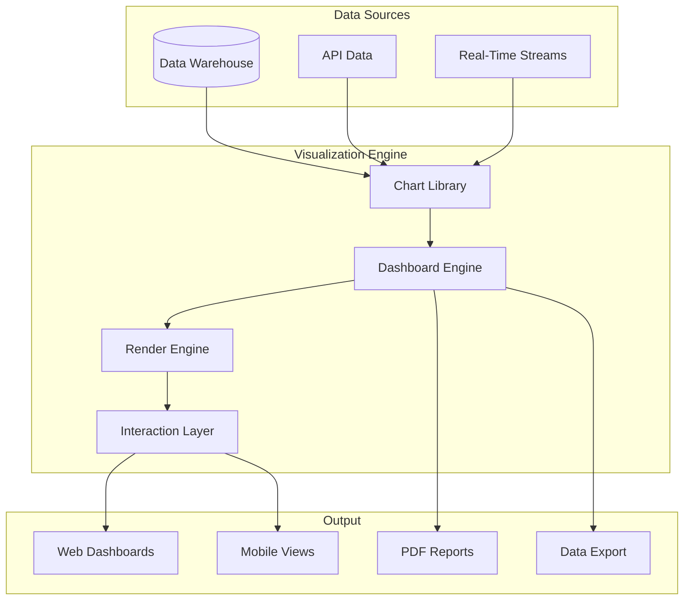

# Software Requirements Specification (SRS)

## Part 11F: Data Visualization

**Module:** Analytics & Reporting Module (Part 12)
**Version:** 1.0.0
**Status:** Final / For Review
**Date:** 2026-06-30

---

## Chapter 1 – Overview

### Purpose

The Data Visualization module defines the comprehensive visualization capabilities for presenting data across the **[Platform Name]** platform. This encompasses chart types, interactive dashboards, real-time visualizations, data storytelling, visualization components, and customization options.

Data visualization is the final mile of analytics. Raw data and complex metrics become actionable insights through effective visualization. Well-designed visualizations enable stakeholders to quickly understand trends, identify patterns, and make data-driven decisions. This module ensures that all data is presented in clear, intuitive, and visually appealing formats.

### Objectives

- Provide a comprehensive library of chart types
- Enable interactive data exploration
- Support real-time data visualization
- Facilitate data storytelling
- Ensure responsive and accessible visualizations
- Enable customization and branding
- Provide self-service visualization capabilities
- Ensure performance and scalability

---

## Chapter 2 – Architecture

### VIS-001 Visualization Architecture

### VIS-002 Visualization Components

| Component | Description | Priority |
| :--- | :--- | :--- |
| **Chart Library** | Collection of chart types | **Required** |
| **Dashboard Engine** | Dashboard creation and management | **Required** |
| **Render Engine** | Chart rendering and animation | **Required** |
| **Interaction Layer** | Interactivity and drill-down | **Required** |
| **Data Binding** | Data source integration | **Required** |
| **Real-Time Updates** | Live data streaming | **Required** |
| **Export Service** | Export to PDF, PNG, SVG | **Required** |

---

## Chapter 3 – Chart Types

### VIS-003 Supported Chart Types

| Chart Type | Use Case | Priority |
| :--- | :--- | :--- |
| **Line Chart** | Trends over time | **Required** |
| **Area Chart** | Cumulative trends | **Required** |
| **Bar Chart** | Category comparisons | **Required** |
| **Column Chart** | Vertical comparisons | **Required** |
| **Pie Chart** | Composition analysis | **Required** |
| **Donut Chart** | Composition with emphasis | **Required** |
| **Scatter Plot** | Correlation analysis | **Required** |
| **Bubble Chart** | Multi-dimensional data | **Required** |
| **Heatmap** | Matrix visualization | **Required** |
| **Funnel Chart** | Conversion analysis | **Required** |
| **Gauge Chart** | KPI tracking | **Required** |
| **Radar Chart** | Multi-factor comparison | **Required** |
| **Treemap** | Hierarchical data | **Required** |
| **Sankey Diagram** | Flow visualization | **Medium** |
| **Geospatial Map** | Location-based data | **Required** |
| **Cohort Heatmap** | Retention analysis | **Required** |
| **Box Plot** | Distribution analysis | **Medium** |
| **Histogram** | Frequency distribution | **Medium** |
| **Bump Chart** | Ranking changes | **Medium** |
| **Waterfall Chart** | Cumulative effects | **Medium** |

### VIS-004 Chart Configuration

| Configuration | Description | Priority |
| :--- | :--- | :--- |
| **Title** | Chart title | **Required** |
| **Subtitle** | Chart subtitle | **Required** |
| **Labels** | Axis and data labels | **Required** |
| **Legend** | Legend configuration | **Required** |
| **Colors** | Color scheme | **Required** |
| **Tooltips** | Hover information | **Required** |
| **Annotations** | Data annotations | **Required** |
| **Gridlines** | Grid configuration | **Required** |
| **Axes** | Axis configuration | **Required** |
| **Zoom/Pan** | Zoom and pan controls | **Required** |

### VIS-005 Chart Data Model

| Column | Type | Constraints | Description |
| :--- | :--- | :--- | :--- |
| `chart_id` | UUID | PRIMARY KEY | Unique identifier |
| `chart_type` | VARCHAR(30) | NOT NULL | Chart type |
| `title` | VARCHAR(255) | NOT NULL | Chart title |
| `configuration` | JSONB | NOT NULL | Chart configuration |
| `data_source` | VARCHAR(100) | | Data source reference |
| `data` | JSONB | | Chart data |
| `width` | INTEGER | | Chart width |
| `height` | INTEGER` | | Chart height |
| `created_at` | TIMESTAMP | DEFAULT NOW() | Creation timestamp |
| `updated_at` | TIMESTAMP | DEFAULT NOW() | Last update timestamp |

---

## Chapter 4 – Dashboard Components

### VIS-006 Dashboard Components

| Component | Description | Priority |
| :--- | :--- | :--- |
| **KPI Cards** | Key performance indicators | **Required** |
| **Charts** | Various chart types | **Required** |
| **Filters** | Data filters and controls | **Required** |
| **Selectors** | Time, category, metric selectors | **Required** |
| **Tables** | Data tables with sorting | **Required** |
| **Maps** | Geospatial visualizations | **Required** |
| **Alerts** | Real-time alerts | **Required** |
| **Text Widgets** | Text and annotations | **Required** |
| **Images** | Image widgets | **Required** |
| **Embeds** | Embedded content | **Required** |

### VIS-007 Dashboard Layout

| Layout Type | Description | Priority |
| :--- | :--- | :--- |
| **Grid Layout** | Fixed grid layout | **Required** |
| **Flex Layout** | Responsive flex layout | **Required** |
| **Custom Layout** | User-defined layout | **Required** |
| **Template Layout** | Pre-built templates | **Required** |
| **Full-Screen** | Full-screen mode | **Required** |

### VIS-008 Dashboard Data Model

| Column | Type | Constraints | Description |
| :--- | :--- | :--- | :--- |
| `dashboard_id` | UUID | PRIMARY KEY | Unique identifier |
| `dashboard_name` | VARCHAR(100) | NOT NULL | Dashboard name |
| `layout` | JSONB | NOT NULL | Layout configuration |
| `components` | JSONB | NOT NULL | Component configuration |
| `filters` | JSONB | | Global filters |
| `refresh_interval` | INTEGER | | Auto-refresh interval (seconds) |
| `is_active` | BOOLEAN | DEFAULT TRUE | Active status |
| `created_by` | UUID | | Creator identifier |
| `created_at` | TIMESTAMP | DEFAULT NOW() | Creation timestamp |
| `updated_at` | TIMESTAMP | DEFAULT NOW() | Last update timestamp |

---

## Chapter 5 – Real-Time Visualization

### VIS-009 Real-Time Features

| Feature | Description | Priority |
| :--- | :--- | :--- |
| **Live Updates** | Real-time data updates | **Required** |
| **Streaming Charts** | Streaming data visualization | **Required** |
| **WebSocket Integration** | Real-time data push | **Required** |
| **Animation** | Smooth chart animations | **Required** |
| **Auto-Refresh** | Configurable refresh intervals | **Required** |
| **Live Alerts** | Real-time alert visualization | **Required** |

### VIS-010 Real-Time Data Model

| Column | Type | Constraints | Description |
| :--- | :--- | :--- | :--- |
| `stream_id` | UUID | PRIMARY KEY | Unique identifier |
| `dashboard_id` | UUID | FOREIGN KEY (dashboards.dashboard_id) | Associated dashboard |
| `stream_type` | VARCHAR(30) | NOT NULL | ORDER/DRIVER/DELIVERY/SYSTEM |
| `data` | JSONB | NOT NULL | Stream data |
| `timestamp` | TIMESTAMP | NOT NULL | Data timestamp |
| `created_at` | TIMESTAMP | DEFAULT NOW() | Creation timestamp |

---

## Chapter 6 – Data Storytelling

### VIS-011 Storytelling Features

| Feature | Description | Priority |
| :--- | :--- | :--- |
| **Storyboards** | Multi-page narratives | **Required** |
| **Annotations** | Data annotations and notes | **Required** |
| **Highlighting** | Data highlighting | **Required** |
| **Transitions** | Smooth page transitions | **Required** |
| **Navigation** | Story navigation controls | **Required** |
| **Export** | Export as PDF/PPT | **Required** |
| **Sharing** | Share stories with others | **Required** |

### VIS-012 Story Data Model

| Column | Type | Constraints | Description |
| :--- | :--- | :--- | :--- |
| `story_id` | UUID | PRIMARY KEY | Unique identifier |
| `story_name` | VARCHAR(100) | NOT NULL | Story name |
| `slides` | JSONB | NOT NULL | Slide configuration |
| `theme` | JSONB | | Theme configuration |
| `is_active` | BOOLEAN | DEFAULT TRUE | Active status |
| `created_by` | UUID | | Creator identifier |
| `created_at` | TIMESTAMP | DEFAULT NOW() | Creation timestamp |
| `updated_at` | TIMESTAMP | DEFAULT NOW() | Last update timestamp |

---

## Chapter 7 – Visualization Themes

### VIS-013 Theme Configuration

| Theme Element | Description | Priority |
| :--- | :--- | :--- |
| **Color Palette** | Primary, secondary, accent colors | **Required** |
| **Typography** | Font families, sizes | **Required** |
| **Spacing** | Margins, padding | **Required** |
| **Background** | Background colors and images | **Required** |
| **Borders** | Border styles and radii | **Required** |
| **Shadows** | Shadow styles | **Required** |
| **Responsive** | Breakpoints and responsive settings | **Required** |
| **Branding** | Logo, brand colors | **Required** |

### VIS-014 Theme Data Model

| Column | Type | Constraints | Description |
| :--- | :--- | :--- | :--- |
| `theme_id` | UUID | PRIMARY KEY | Unique identifier |
| `theme_name` | VARCHAR(100) | NOT NULL | Theme name |
| `colors` | JSONB | NOT NULL | Color palette |
| `typography` | JSONB | NOT NULL | Typography configuration |
| `spacing` | JSONB | | Spacing configuration |
| `branding` | JSONB | | Branding configuration |
| `is_default` | BOOLEAN | DEFAULT FALSE | Default theme |
| `created_at` | TIMESTAMP | DEFAULT NOW() | Creation timestamp |
| `updated_at` | TIMESTAMP | DEFAULT NOW() | Last update timestamp |

---

## Chapter 8 – Accessibility

### VIS-015 Accessibility Features

| Feature | Description | Priority |
| :--- | :--- | :--- |
| **Color Contrast** | WCAG 2.1 AA compliance | **Required** |
| **Keyboard Navigation** | Full keyboard accessibility | **Required** |
| **Screen Reader Support** | ARIA labels and roles | **Required** |
| **Focus Management** | Visible focus indicators | **Required** |
| **Text Alternatives** | Alt text for charts | **Required** |
| **Colorblind Palettes** | Colorblind-friendly colors | **Required** |
| **Font Scaling** | Responsive font sizes | **Required** |
| **Reduced Motion** | Respect reduced motion preferences | **Required** |

---

## Chapter 9 – Performance

### VIS-016 Performance Requirements

| Metric | Target | Priority |
| :--- | :--- | :--- |
| **Initial Load** | < 2 seconds | **Required** |
| **Chart Render** | < 500ms | **Required** |
| **Dashboard Load** | < 3 seconds | **Required** |
| **Interaction Response** | < 200ms | **Required** |
| **Data Refresh** | < 500ms | **Required** |
| **Memory Usage** | < 200MB | **Required** |
| **Animation FPS** | 60 FPS | **Required** |

### VIS-017 Optimization Strategies

| Strategy | Description | Priority |
| :--- | :--- | :--- |
| **Lazy Loading** | Load charts on demand | **Required** |
| **Caching** | Cache rendered charts | **Required** |
| **Data Aggregation** | Aggregate data for visualization | **Required** |
| **Progressive Rendering** | Progressive chart rendering | **Required** |
| **Web Workers** | Offload rendering to workers | **Medium** |
| **Canvas Rendering** | Canvas for large datasets | **Required** |

---

## Chapter 10 – Database Tables

### visualization_charts

| Column | Type | Constraints | Description |
| :--- | :--- | :--- | :--- |
| `chart_id` | UUID | PRIMARY KEY | Unique identifier |
| `chart_type` | VARCHAR(30) | NOT NULL | Chart type |
| `title` | VARCHAR(255) | NOT NULL | Chart title |
| `configuration` | JSONB | NOT NULL | Chart configuration |
| `data_source` | VARCHAR(100) | | Data source reference |
| `data` | JSONB` | | Chart data |
| `width` | INTEGER | | Chart width |
| `height` | INTEGER | | Chart height |
| `created_at` | TIMESTAMP | DEFAULT NOW() | Creation timestamp |
| `updated_at` | TIMESTAMP | DEFAULT NOW() | Last update timestamp |

### visualization_dashboards

| Column | Type | Constraints | Description |
| :--- | :--- | :--- | :--- |
| `dashboard_id` | UUID | PRIMARY KEY | Unique identifier |
| `dashboard_name` | VARCHAR(100) | NOT NULL | Dashboard name |
| `layout` | JSONB | NOT NULL | Layout configuration |
| `components` | JSONB | NOT NULL | Component configuration |
| `filters` | JSONB` | | Global filters |
| `refresh_interval` | INTEGER | | Auto-refresh interval |
| `is_active` | BOOLEAN | DEFAULT TRUE | Active status |
| `created_by` | UUID | | Creator identifier |
| `created_at` | TIMESTAMP | DEFAULT NOW() | Creation timestamp |
| `updated_at` | TIMESTAMP | DEFAULT NOW() | Last update timestamp |

### visualization_stories

| Column | Type | Constraints | Description |
| :--- | :--- | :--- | :--- |
| `story_id` | UUID | PRIMARY KEY | Unique identifier |
| `story_name` | VARCHAR(100) | NOT NULL | Story name |
| `slides` | JSONB | NOT NULL | Slide configuration |
| `theme` | JSONB | | Theme configuration |
| `is_active` | BOOLEAN | DEFAULT TRUE | Active status |
| `created_by` | UUID | | Creator identifier |
| `created_at` | TIMESTAMP | DEFAULT NOW() | Creation timestamp |
| `updated_at` | TIMESTAMP | DEFAULT NOW() | Last update timestamp |

### visualization_themes

| Column | Type | Constraints | Description |
| :--- | :--- | :--- | :--- |
| `theme_id` | UUID | PRIMARY KEY | Unique identifier |
| `theme_name` | VARCHAR(100) | NOT NULL | Theme name |
| `colors` | JSONB | NOT NULL | Color palette |
| `typography` | JSONB | NOT NULL | Typography configuration |
| `spacing` | JSONB | | Spacing configuration |
| `branding` | JSONB | | Branding configuration |
| `is_default` | BOOLEAN | DEFAULT FALSE | Default theme |
| `created_at` | TIMESTAMP | DEFAULT NOW() | Creation timestamp |
| `updated_at` | TIMESTAMP | DEFAULT NOW() | Last update timestamp |

### visualization_streams

| Column | Type | Constraints | Description |
| :--- | :--- | :--- | :--- |
| `stream_id` | UUID | PRIMARY KEY | Unique identifier |
| `dashboard_id` | UUID | FOREIGN KEY (visualization_dashboards.dashboard_id) | Associated dashboard |
| `stream_type` | VARCHAR(30) | NOT NULL | ORDER/DRIVER/DELIVERY/SYSTEM |
| `data` | JSONB | NOT NULL | Stream data |
| `timestamp` | TIMESTAMP | NOT NULL | Data timestamp |
| `created_at` | TIMESTAMP | DEFAULT NOW() | Creation timestamp |

### visualization_preferences

| Column | Type | Constraints | Description |
| :--- | :--- | :--- | :--- |
| `preference_id` | UUID | PRIMARY KEY | Unique identifier |
| `user_id` | UUID | NOT NULL | User identifier |
| `theme_preference` | UUID | | Preferred theme |
| `default_dashboard` | UUID | | Default dashboard |
| `chart_preferences` | JSONB | | Chart preferences |
| `created_at` | TIMESTAMP | DEFAULT NOW() | Creation timestamp |
| `updated_at` | TIMESTAMP | DEFAULT NOW() | Last update timestamp |

---

## Chapter 11 – REST APIs

### Chart APIs

| Method | Endpoint | Description |
| :--- | :--- | :--- |
| `GET` | `/api/v1/visualization/charts` | List charts |
| `GET` | `/api/v1/visualization/charts/{id}` | Get chart details |
| `POST` | `/api/v1/visualization/charts` | Create chart |
| `PUT` | `/api/v1/visualization/charts/{id}` | Update chart |
| `DELETE` | `/api/v1/visualization/charts/{id}` | Delete chart |
| `GET` | `/api/v1/visualization/charts/{id}/render` | Render chart image |
| `GET` | `/api/v1/visualization/charts/{id}/data` | Get chart data |

### Dashboard APIs

| Method | Endpoint | Description |
| :--- | :--- | :--- |
| `GET` | `/api/v1/visualization/dashboards` | List dashboards |
| `GET` | `/api/v1/visualization/dashboards/{id}` | Get dashboard |
| `POST` | `/api/v1/visualization/dashboards` | Create dashboard |
| `PUT` | `/api/v1/visualization/dashboards/{id}` | Update dashboard |
| `DELETE` | `/api/v1/visualization/dashboards/{id}` | Delete dashboard |
| `GET` | `/api/v1/visualization/dashboards/{id}/render` | Render dashboard |
| `GET` | `/api/v1/visualization/dashboards/{id}/export` | Export dashboard |
| `POST` | `/api/v1/visualization/dashboards/{id}/duplicate` | Duplicate dashboard |

### Story APIs

| Method | Endpoint | Description |
| :--- | :--- | :--- |
| `GET` | `/api/v1/visualization/stories` | List stories |
| `GET` | `/api/v1/visualization/stories/{id}` | Get story |
| `POST` | `/api/v1/visualization/stories` | Create story |
| `PUT` | `/api/v1/visualization/stories/{id}` | Update story |
| `DELETE` | `/api/v1/visualization/stories/{id}` | Delete story |
| `GET` | `/api/v1/visualization/stories/{id}/render` | Render story |

### Theme APIs

| Method | Endpoint | Description |
| :--- | :--- | :--- |
| `GET` | `/api/v1/visualization/themes` | List themes |
| `GET` | `/api/v1/visualization/themes/{id}` | Get theme |
| `POST` | `/api/v1/visualization/themes` | Create theme |
| `PUT` | `/api/v1/visualization/themes/{id}` | Update theme |
| `DELETE` | `/api/v1/visualization/themes/{id}` | Delete theme |
| `PUT` | `/api/v1/visualization/themes/{id}/default` | Set default theme |

### Stream APIs

| Method | Endpoint | Description |
| :--- | :--- | :--- |
| `GET` | `/api/v1/visualization/streams` | Get active streams |
| `GET` | `/api/v1/visualization/streams/{id}` | Get stream details |
| `POST` | `/api/v1/visualization/streams` | Create stream |

### Preferences APIs

| Method | Endpoint | Description |
| :--- | :--- | :--- |
| `GET` | `/api/v1/visualization/preferences` | Get user preferences |
| `PUT` | `/api/v1/visualization/preferences` | Update user preferences |

---

## Chapter 12 – WebSocket Events

### VIS-018 Real-Time Visualization Events

| Event | Payload | Description |
| :--- | :--- | :--- |
| `vis.data.updated` | `{ dashboard_id, chart_id, data, timestamp }` | Chart data updated |
| `vis.dashboard.updated` | `{ dashboard_id, components, timestamp }` | Dashboard updated |
| `vis.stream.data` | `{ stream_id, data, timestamp }` | Stream data received |
| `vis.chart.rendered` | `{ chart_id, url, timestamp }` | Chart rendered |

---

## Chapter 13 – Business Rules

| Rule ID | Rule Description | Priority |
| :--- | :--- | :--- |
| **BR-VIS-001** | Charts must render within 500ms. | **High** |
| **BR-VIS-002** | Dashboards must load within 3 seconds. | **High** |
| **BR-VIS-003** | Visualizations must meet WCAG 2.1 AA accessibility standards. | **High** |
| **BR-VIS-004** | Real-time streams must update within 1 second. | **High** |
| **BR-VIS-005** | Charts must support export to PNG and SVG. | **High** |
| **BR-VIS-006** | Dashboards must support export to PDF. | **High** |
| **BR-VIS-007** | Color palettes must be colorblind-friendly. | **High** |
| **BR-VIS-008** | Data must be aggregated for performance with large datasets. | **High** |
| **BR-VIS-009** | Visualizations must be responsive across devices. | **High** |
| **BR-VIS-010** | User preferences must be persisted across sessions. | **High** |

---

## Chapter 14 – Acceptance Tests

| Test ID | Test Description | Priority |
| :--- | :--- | :--- |
| **TEST-VIS-001** | Line chart renders correctly. | **High** |
| **TEST-VIS-002** | Bar chart renders correctly. | **High** |
| **TEST-VIS-003** | Pie chart renders correctly. | **High** |
| **TEST-VIS-004** | Heatmap renders correctly. | **High** |
| **TEST-VIS-005** | Funnel chart renders correctly. | **High** |
| **TEST-VIS-006** | Gauge chart renders correctly. | **High** |
| **TEST-VIS-007** | Radar chart renders correctly. | **High** |
| **TEST-VIS-008** | Treemap renders correctly. | **High** |
| **TEST-VIS-009** | Geospatial map renders correctly. | **High** |
| **TEST-VIS-010** | Cohort heatmap renders correctly. | **High** |
| **TEST-VIS-011** | Dashboard renders all components correctly. | **High** |
| **TEST-VIS-012** | Dashboard filters work correctly. | **High** |
| **TEST-VIS-013** | Dashboard drill-down works correctly. | **High** |
| **TEST-VIS-014** | Real-time chart updates correctly. | **High** |
| **TEST-VIS-015** | Storyboard renders slides correctly. | **High** |
| **TEST-VIS-016** | Storyboard navigation works correctly. | **High** |
| **TEST-VIS-017** | Chart exports to PNG correctly. | **High** |
| **TEST-VIS-018** | Chart exports to SVG correctly. | **High** |
| **TEST-VIS-019** | Dashboard exports to PDF correctly. | **High** |
| **TEST-VIS-020** | Colorblind color palette is correct. | **High** |
| **TEST-VIS-021** | Responsive design works across devices. | **High** |
| **TEST-VIS-022** | Keyboard navigation works correctly. | **High** |
| **TEST-VIS-023** | Screen reader support works correctly. | **High** |
| **TEST-VIS-024** | Chart animations are smooth (60 FPS). | **High** |
| **TEST-VIS-025** | Theme customization applies correctly. | **High** |

---

## Chapter 15 – Traceability Matrix

| Requirement | Database Table | API Endpoint(s) | Acceptance Test |
| :--- | :--- | :--- | :--- |
| VIS-003 | visualization_charts | GET /api/v1/visualization/charts | TEST-VIS-001, TEST-VIS-002, TEST-VIS-003, TEST-VIS-004, TEST-VIS-005, TEST-VIS-006, TEST-VIS-007, TEST-VIS-008, TEST-VIS-009, TEST-VIS-010 |
| VIS-006 | visualization_dashboards | GET /api/v1/visualization/dashboards | TEST-VIS-011, TEST-VIS-012, TEST-VIS-013 |
| VIS-009 | visualization_streams | GET /api/v1/visualization/streams | TEST-VIS-014 |
| VIS-011 | visualization_stories | GET /api/v1/visualization/stories | TEST-VIS-015, TEST-VIS-016 |
| VIS-006 | visualization_dashboards | GET /api/v1/visualization/dashboards/{id}/export | TEST-VIS-017, TEST-VIS-018, TEST-VIS-019 |
| VIS-013 | visualization_themes | GET /api/v1/visualization/themes | TEST-VIS-020, TEST-VIS-025 |
| VIS-015 | visualization_preferences | GET /api/v1/visualization/preferences | TEST-VIS-021, TEST-VIS-022, TEST-VIS-023 |
| VIS-016 | visualization_charts | GET /api/v1/visualization/charts/{id}/render | TEST-VIS-024 |

---

## Chapter 16 – Summary

This document establishes the complete data visualization capability for the **[Platform Name]** platform. Key takeaways:

- **Comprehensive Chart Library:** Line, area, bar, column, pie, donut, scatter, bubble, heatmap, funnel, gauge, radar, treemap, Sankey, geospatial map, cohort heatmap, box plot, histogram, bump chart, and waterfall chart.
- **Interactive Dashboards:** Drag-and-drop layout, filters, selectors, drill-down, real-time updates, and auto-refresh.
- **Real-Time Visualization:** Streaming charts, WebSocket integration, smooth animations, and live alerts.
- **Data Storytelling:** Storyboards, annotations, highlighting, transitions, navigation, and export to PDF/PPT.
- **Themes & Branding:** Custom color palettes, typography, spacing, and branding configurations.
- **Accessibility:** WCAG 2.1 AA compliance, keyboard navigation, screen reader support, colorblind palettes, and reduced motion.
- **Performance:** Initial load < 2s, chart render < 500ms, dashboard load < 3s, interaction response < 200ms, 60 FPS animations.
- **Export:** Export charts to PNG/SVG, dashboards to PDF, and stories to PDF/PPT.

The data visualization module transforms raw data into clear, actionable insights through intuitive and engaging visualizations.

---

**Next Document:**

`13_Platform_APIs_Developer_Ecosystem/Part_13A_API_Platform_Overview.md`

*(This transitions from analytics to the platform APIs module, starting with the API platform overview.)*