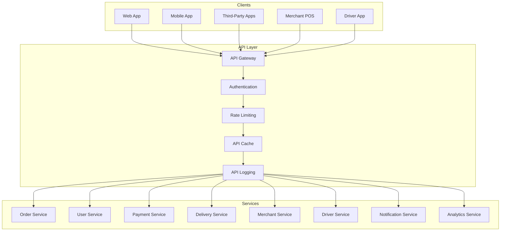

# Part 13A: API Platform Overview

**Module:** Platform APIs & Developer Ecosystem (Part 13)
**Version:** 1.0.0
**Status:** Final / For Review
**Date:** 2026-06-30

---

## Chapter 1 – Overview

### Purpose

The API Platform Overview module defines the strategic foundation for the **[Platform Name]** API ecosystem. This encompasses API-first philosophy, architectural principles, governance, versioning strategy, security framework, developer experience, and API lifecycle management.

The API platform is the digital facade of the business. Every customer interaction, merchant operation, driver action, and partner integration flows through the API layer. A well-designed API platform enables rapid innovation, seamless integrations, and scalable growth. This module ensures that the API platform is built on a solid foundation of best practices, security, and developer experience.

### Objectives

- Establish API-first architecture principles
- Provide a unified, secure API gateway
- Enable versioned, backward-compatible APIs
- Support multiple API styles (REST, GraphQL, gRPC)
- Deliver exceptional developer experience
- Ensure API security and governance
- Enable API monetization and ecosystem growth
- Provide comprehensive API analytics

---

## Chapter 2 – API-First Philosophy

### API-001 Core Principles

| Principle | Description | Priority |
| :--- | :--- | :--- |
| **API-First Design** | APIs designed before implementation | **Required** |
| **Contract-First** | API contracts defined upfront | **Required** |
| **Backward Compatibility** | Breaking changes require versioning | **Required** |
| **Security by Design** | Security built into API design | **Required** |
| **Developer Experience** | APIs designed for developer joy | **Required** |
| **Observability** | APIs are observable and traceable | **Required** |
| **Performance** | APIs meet strict performance SLAs | **Required** |
| **Documentation** | APIs are fully documented | **Required** |

### API-002 API Design Guidelines

| Guideline | Description | Priority |
| :--- | :--- | :--- |
| **RESTful Principles** | Follow RESTful design conventions | **Required** |
| **Consistent Naming** | Consistent resource naming (plural nouns) | **Required** |
| **HTTP Methods** | Use standard HTTP methods (GET, POST, PUT, PATCH, DELETE) | **Required** |
| **Status Codes** | Use appropriate HTTP status codes | **Required** |
| **Error Handling** | Consistent error response format | **Required** |
| **Pagination** | Standardized pagination | **Required** |
| **Filtering** | Standardized filtering syntax | **Required** |
| **Sorting** | Standardized sorting syntax | **Required** |
| **Field Selection** | Support for field selection | **Required** |
| **Idempotency** | Support idempotency keys for mutating operations | **Required** |

---

## Chapter 3 – API Architecture

### API-003 Architecture Overview

### API-004 API Gateway Features

| Feature | Description | Priority |
| :--- | :--- | :--- |
| **Request Routing** | Route requests to appropriate services | **Required** |
| **Authentication** | JWT, API Key, OAuth 2.1 validation | **Required** |
| **Rate Limiting** | Per-user and per-API rate limits | **Required** |
| **Request Validation** | Validate request schemas | **Required** |
| **Response Transformation** | Transform responses for backward compatibility | **Required** |
| **Caching** | Cache responses for performance | **Required** |
| **Logging** | Log all API requests and responses | **Required** |
| **Metrics** | API metrics and analytics | **Required** |
| **Circuit Breaker** | Prevent cascading failures | **Required** |
| **Retry** | Retry failed requests | **Required** |
| **Timeout** | Configurable request timeouts | **Required** |
| **CORS** | Cross-origin resource sharing | **Required** |

---

## Chapter 4 – API Styles

### API-005 Supported API Styles

| Style | Use Case | Priority |
| :--- | :--- | :--- |
| **REST** | Resource-based operations (CRUD) | **Required** |
| **GraphQL** | Complex queries, mobile optimization | **Required** |
| **gRPC** | High-performance service-to-service | **Required** |
| **WebSocket** | Real-time communication | **Required** |
| **Webhooks** | Event-driven notifications | **Required** |

### API-006 API Endpoint Naming Convention

| Resource | Collection | Individual | Priority |
| :--- | :--- | :--- | :--- |
| Customers | `/api/v1/customers` | `/api/v1/customers/{id}` | **Required** |
| Merchants | `/api/v1/merchants` | `/api/v1/merchants/{id}` | **Required** |
| Drivers | `/api/v1/drivers` | `/api/v1/drivers/{id}` | **Required** |
| Orders | `/api/v1/orders` | `/api/v1/orders/{id}` | **Required** |
| Payments | `/api/v1/payments` | `/api/v1/payments/{id}` | **Required** |
| Deliveries | `/api/v1/deliveries` | `/api/v1/deliveries/{id}` | **Required** |
| Notifications | `/api/v1/notifications` | `/api/v1/notifications/{id}` | **Required** |
| Webhooks | `/api/v1/webhooks` | `/api/v1/webhooks/{id}` | **Required** |

---

## Chapter 5 – API Versioning

### API-007 Versioning Strategy

| Strategy | Description | Priority |
| :--- | :--- | :--- |
| **URI Versioning** | Version in URI path (`/api/v1/`) | **Required** |
| **Version Deprecation** | Deprecate versions with notice | **Required** |
| **Sunset Policy** | Minimum 6-month sunset period | **Required** |
| **Migration Guides** | Provide migration guides | **Required** |
| **Coexistence** | Multiple versions coexist | **Required** |

### API-008 Versioning Rules

| Rule | Description | Priority |
| :--- | :--- | :--- |
| **Major Version** | Breaking changes require new major version | **Required** |
| **Minor Version** | Non-breaking changes within version | **Required** |
| **Deprecation Notice** | 6 months notice before sunset | **Required** |
| **Documentation** | All versions documented | **Required** |
| **Testing** | All versions tested | **Required** |

---

## Chapter 6 – API Security

### API-009 Security Framework

| Layer | Description | Priority |
| :--- | :--- | :--- |
| **Authentication** | JWT, OAuth 2.1, API Keys | **Required** |
| **Authorization** | RBAC, Scopes, Fine-grained permissions | **Required** |
| **Encryption** | TLS 1.3 for all API traffic | **Required** |
| **Rate Limiting** | Prevent abuse and DoS | **Required** |
| **Input Validation** | Validate all API inputs | **Required** |
| **Output Filtering** | Filter sensitive data from responses | **Required** |
| **Audit Logging** | Log all API access | **Required** |
| **CORS** | Controlled cross-origin access | **Required** |

### API-010 Scopes

| Scope | Description | Priority |
| :--- | :--- | :--- |
| `orders:read` | Read orders | **Required** |
| `orders:write` | Create/update orders | **Required** |
| `orders:delete` | Cancel orders | **Required** |
| `payments:read` | Read payments | **Required** |
| `payments:write` | Process payments | **Required** |
| `customers:read` | Read customer data | **Required** |
| `customers:write` | Update customer data | **Required** |
| `merchants:read` | Read merchant data | **Required** |
| `merchants:write` | Update merchant data | **Required** |
| `drivers:read` | Read driver data | **Required** |
| `drivers:write` | Update driver data | **Required** |
| `deliveries:read` | Read delivery data | **Required** |
| `deliveries:write` | Update delivery data | **Required** |
| `webhooks:read` | Read webhooks | **Required** |
| `webhooks:write` | Create/update webhooks | **Required** |
| `admin:all` | Full admin access | **Required** |

---

## Chapter 7 – Rate Limiting

### API-011 Rate Limiting Policies

| Tier | Rate Limit | Burst | Priority |
| :--- | :--- | :--- | :--- |
| **Free** | 100 requests/hour | 10 | **Required** |
| **Standard** | 1,000 requests/hour | 100 | **Required** |
| **Premium** | 10,000 requests/hour | 1,000 | **Required** |
| **Enterprise** | Custom | Custom | **Required** |

### API-012 Rate Limiting Headers

| Header | Description | Priority |
| :--- | :--- | :--- |
| `X-RateLimit-Limit` | Request limit for the period | **Required** |
| `X-RateLimit-Remaining` | Remaining requests for the period | **Required** |
| `X-RateLimit-Reset` | Reset time (Unix timestamp) | **Required** |
| `Retry-After` | Seconds to wait before retry (when exceeded) | **Required** |

---

## Chapter 8 – Developer Experience

### API-013 Developer Experience Features

| Feature | Description | Priority |
| :--- | :--- | :--- |
| **Interactive Documentation** | Swagger/OpenAPI interactive docs | **Required** |
| **API Explorer** | Try APIs in the browser | **Required** |
| **SDKs** | Official SDKs for popular languages | **Required** |
| **Code Samples** | Code examples in multiple languages | **Required** |
| **Postman Collections** | Pre-built Postman collections | **Required** |
| **Quick Start Guides** | Getting started guides | **Required** |
| **Tutorials** | Step-by-step tutorials | **Required** |
| **FAQ** | Frequently asked questions | **Required** |
| **Support** | Developer support channels | **Required** |
| **Changelog** | API changelog and updates | **Required** |

---

## Chapter 9 – API Analytics

### API-014 API Metrics

| Metric | Description | Priority |
| :--- | :--- | :--- |
| **Request Volume** | Total API requests | **Required** |
| **Error Rate** | % of failed requests | **Required** |
| **Latency** | API response times (p50, p95, p99) | **Required** |
| **Throughput** | Requests per second | **Required** |
| **Top Endpoints** | Most used endpoints | **Required** |
| **Top Consumers** | Most active API consumers | **Required** |
| **Rate Limit Violations** | Rate limit breaches | **Required** |
| **Response Size** | API response sizes | **Required** |

### API-015 Analytics Data Model

| Column | Type | Constraints | Description |
| :--- | :--- | :--- | :--- |
| `analytics_id` | UUID | PRIMARY KEY | Unique identifier |
| `api_key_id` | UUID | | API key used |
| `endpoint` | VARCHAR(255) | NOT NULL | API endpoint |
| `method` | VARCHAR(10) | NOT NULL | HTTP method |
| `status_code` | INTEGER | NOT NULL | HTTP status code |
| `latency_ms` | INTEGER | | Response latency |
| `request_size` | INTEGER | | Request size (bytes) |
| `response_size` | INTEGER | | Response size (bytes) |
| `timestamp` | TIMESTAMP | NOT NULL | Request timestamp |
| `created_at` | TIMESTAMP | DEFAULT NOW() | Creation timestamp |

---

## Chapter 10 – API Lifecycle

### API-016 API Lifecycle Stages

| Stage | Description | Priority |
| :--- | :--- | :--- |
| **Design** | API design and specification | **Required** |
| **Development** | API implementation | **Required** |
| **Testing** | Unit, integration, contract testing | **Required** |
| **Documentation** | API documentation | **Required** |
| **Deployment** | API deployment to gateway | **Required** |
| **Versioning** | Version management | **Required** |
| **Deprecation** | Deprecation and sunset | **Required** |
| **Retirement** | API retirement | **Required** |

---

## Chapter 11 – Database Tables

### api_keys

| Column | Type | Constraints | Description |
| :--- | :--- | :--- | :--- |
| `api_key_id` | UUID | PRIMARY KEY | Unique identifier |
| `name` | VARCHAR(100) | NOT NULL | API key name |
| `key_prefix` | VARCHAR(10) | | Key prefix |
| `key_hash` | VARCHAR(255) | NOT NULL | Hashed API key |
| `scopes` | TEXT[] | | Authorization scopes |
| `rate_limit_tier` | VARCHAR(20) | DEFAULT 'STANDARD' | FREE/STANDARD/PREMIUM/ENTERPRISE |
| `expires_at` | TIMESTAMP | | Expiration timestamp |
| `last_used_at` | TIMESTAMP | | Last usage timestamp |
| `is_active` | BOOLEAN | DEFAULT TRUE | Active status |
| `created_by` | UUID | | Creator identifier |
| `created_at` | TIMESTAMP | DEFAULT NOW() | Creation timestamp |
| `updated_at` | TIMESTAMP | DEFAULT NOW() | Last update timestamp |

### api_scopes

| Column | Type | Constraints | Description |
| :--- | :--- | :--- | :--- |
| `scope_id` | UUID | PRIMARY KEY | Unique identifier |
| `scope_name` | VARCHAR(50) | NOT NULL | Scope name |
| `scope_description` | TEXT | | Scope description |
| `is_active` | BOOLEAN | DEFAULT TRUE | Active status |
| `created_at` | TIMESTAMP | DEFAULT NOW() | Creation timestamp |
| `updated_at` | TIMESTAMP | DEFAULT NOW() | Last update timestamp |

### api_usage_logs

| Column | Type | Constraints | Description |
| :--- | :--- | :--- | :--- |
| `log_id` | UUID | PRIMARY KEY | Unique identifier |
| `api_key_id` | UUID | | API key used |
| `endpoint` | VARCHAR(255) | NOT NULL | API endpoint |
| `method` | VARCHAR(10) | NOT NULL | HTTP method |
| `status_code` | INTEGER | NOT NULL | HTTP status code |
| `latency_ms` | INTEGER | | Response latency |
| `request_size` | INTEGER | | Request size (bytes) |
| `response_size` | INTEGER | | Response size (bytes) |
| `ip_address` | VARCHAR(45) | | Client IP |
| `user_agent` | TEXT` | | User agent |
| `timestamp` | TIMESTAMP | NOT NULL | Request timestamp |
| `created_at` | TIMESTAMP | DEFAULT NOW() | Creation timestamp |

### api_versions

| Column | Type | Constraints | Description |
| :--- | :--- | :--- | :--- |
| `version_id` | UUID | PRIMARY KEY | Unique identifier |
| `version` | VARCHAR(10) | NOT NULL | API version (e.g., v1, v2) |
| `status` | VARCHAR(20) | DEFAULT 'ACTIVE' | ACTIVE/DEPRECATED/SUNSET/RETIRED |
| `deprecation_date` | DATE | | Deprecation date |
| `sunset_date` | DATE | | Sunset date |
| `changelog` | TEXT | | Version changelog |
| `created_at` | TIMESTAMP | DEFAULT NOW() | Creation timestamp |
| `updated_at` | TIMESTAMP | DEFAULT NOW() | Last update timestamp |

---

## Chapter 12 – REST APIs

### API Key APIs

| Method | Endpoint | Description |
| :--- | :--- | :--- |
| `GET` | `/api/v1/api-keys` | List API keys |
| `POST` | `/api/v1/api-keys` | Create API key |
| `GET` | `/api/v1/api-keys/{id}` | Get API key details |
| `PUT` | `/api/v1/api-keys/{id}` | Update API key |
| `DELETE` | `/api/v1/api-keys/{id}` | Delete API key |
| `POST` | `/api/v1/api-keys/{id}/rotate` | Rotate API key |

### Analytics APIs

| Method | Endpoint | Description |
| :--- | :--- | :--- |
| `GET` | `/api/v1/api-analytics` | Get API analytics |
| `GET` | `/api/v1/api-analytics/endpoints` | Get endpoint analytics |
| `GET` | `/api/v1/api-analytics/consumers` | Get consumer analytics |

### Documentation APIs

| Method | Endpoint | Description |
| :--- | :--- | :--- |
| `GET` | `/api/v1/api-docs` | Get OpenAPI specification |
| `GET` | `/api/v1/api-docs/{version}` | Get version-specific spec |
| `GET` | `/api/v1/api-docs/versions` | Get available versions |

---

## Chapter 13 – Business Rules

| Rule ID | Rule Description | Priority |
| :--- | :--- | :--- |
| **BR-API-001** | All public APIs must be versioned. | **High** |
| **BR-API-002** | Breaking changes require a new API version. | **High** |
| **BR-API-003** | Deprecated APIs must have 6-month sunset notice. | **High** |
| **BR-API-004** | API keys must be hashed before storage. | **High** |
| **BR-API-005** | Rate limits must be enforced at the API gateway. | **High** |
| **BR-API-006** | APIs must return consistent error formats. | **High** |
| **BR-API-007** | All API requests must be logged for audit. | **High** |
| **BR-API-008** | Documentation must be updated with each version. | **High** |
| **BR-API-009** | SDKs must support the latest stable API version. | **High** |
| **BR-API-010** | APIs must respond within 500ms (p95). | **High** |

---

## Chapter 14 – Acceptance Tests

| Test ID | Test Description | Priority |
| :--- | :--- | :--- |
| **TEST-API-001** | API key generated successfully. | **High** |
| **TEST-API-002** | API key authentication works correctly. | **High** |
| **TEST-API-003** | OAuth 2.1 authentication works correctly. | **High** |
| **TEST-API-004** | Rate limiting enforced correctly. | **High** |
| **TEST-API-005** | API versioning works correctly (`/api/v1/`). | **High** |
| **TEST-API-006** | API version deprecation notice works. | **High** |
| **TEST-API-007** | API response format matches specification. | **High** |
| **TEST-API-008** | Error responses are consistent. | **High** |
| **TEST-API-009** | API documentation is accessible. | **High** |
| **TEST-API-010** | API explorer works correctly. | **High** |
| **TEST-API-011** | CORS headers are correct. | **High** |
| **TEST-API-012** | Idempotency keys prevent duplicate requests. | **High** |
| **TEST-API-013** | API latency meets SLA (< 500ms). | **High** |
| **TEST-API-014** | API error rate < 1%. | **High** |
| **TEST-API-015** | API availability > 99.95%. | **High** |
| **TEST-API-016** | Scope-based authorization works correctly. | **High** |
| **TEST-API-017** | API key rotation works correctly. | **High** |
| **TEST-API-018** | Webhook registration works correctly. | **High** |
| **TEST-API-019** | GraphQL API works correctly. | **High** |
| **TEST-API-020** | API analytics dashboard displays correctly. | **High** |

---

## Chapter 15 – Traceability Matrix

| Requirement | Database Table | API Endpoint(s) | Acceptance Test |
| :--- | :--- | :--- | :--- |
| API-009 | api_keys | POST /api/v1/api-keys | TEST-API-001, TEST-API-002 |
| API-010 | api_scopes | GET /api/v1/api-keys | TEST-API-016 |
| API-011 | api_keys | GET /api/v1/api-keys | TEST-API-004 |
| API-007 | api_versions | GET /api/v1/api-docs/versions | TEST-API-005, TEST-API-006 |
| API-002 | api_usage_logs | GET /api/v1/api-docs | TEST-API-007, TEST-API-008 |
| API-013 | api_versions | GET /api/v1/api-docs | TEST-API-009, TEST-API-010 |
| API-004 | api_usage_logs | Internal | TEST-API-011 |
| API-002 | api_usage_logs | POST /api/v1/api-keys | TEST-API-012 |
| API-014 | api_usage_logs | GET /api/v1/api-analytics | TEST-API-013, TEST-API-014, TEST-API-015 |
| API-009 | api_keys | POST /api/v1/api-keys/{id}/rotate | TEST-API-017 |

---

## Chapter 16 – Summary

This document establishes the complete API platform overview for the **[Platform Name]** platform. Key takeaways:

- **API-First Philosophy:** APIs designed before implementation with contract-first design.
- **Multiple API Styles:** REST, GraphQL, gRPC, WebSocket, and Webhooks.
- **API Gateway:** Centralized routing, authentication, rate limiting, caching, logging, and metrics.
- **Versioning:** URI-based versioning with 6-month sunset policy.
- **Security:** JWT, OAuth 2.1, API Keys, RBAC, scopes, and TLS 1.3.
- **Rate Limiting:** Tiered rate limits (Free, Standard, Premium, Enterprise).
- **Developer Experience:** Interactive docs, API explorer, SDKs, code samples, tutorials, and support.
- **API Analytics:** Request volume, error rate, latency, throughput, top endpoints, and top consumers.
- **API Lifecycle:** Design, development, testing, documentation, deployment, versioning, deprecation, and retirement.

The API platform overview sets the strategic foundation for the entire API ecosystem.

---

**Next Document:**

`Part_13B_Public_REST_API.md`

*(This builds on the API platform overview to define the public REST API specifications.)*
