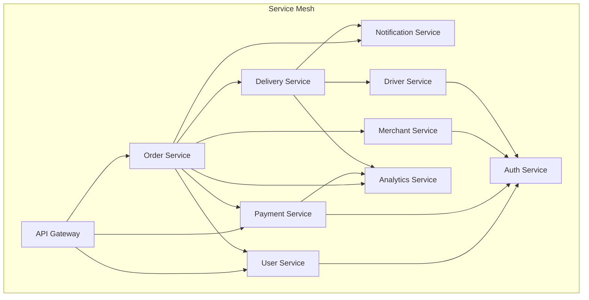

# Software Requirements Specification (SRS)

## Part 13C: Internal Services API

**Module:** Platform APIs & Developer Ecosystem (Part 13)
**Version:** 1.0.0
**Status:** Final / For Review
**Date:** 2026-06-30

---

## Chapter 1 – Overview

### Purpose

The Internal Services API module defines the comprehensive service-to-service communication contracts for the **[Platform Name]** platform. This encompasses gRPC service definitions, RESTful internal endpoints, asynchronous event contracts, service discovery, and inter-service communication patterns.

Internal service APIs are the backbone of the microservices architecture. They enable loose coupling, independent deployability, and scalable communication between services. Well-defined internal APIs ensure that services can evolve independently while maintaining reliable communication. This module ensures that internal service contracts are consistent, versioned, and observable.

### Objectives

- Define service-to-service communication contracts
- Support multiple communication patterns (synchronous, asynchronous)
- Enable service discovery and load balancing
- Provide observability and tracing
- Support versioning and backward compatibility
- Define error handling and retry policies
- Enable circuit breaking and resilience
- Ensure security (mTLS, authentication)

---

## Chapter 2 – Architecture

### INTERNALAPI-001 Internal Service Architecture



### INTERNALAPI-002 Communication Patterns

| Pattern | Description | Protocol | Priority |
| :--- | :--- | :--- | :--- |
| **Synchronous Request-Response** | Direct service calls | gRPC / REST | **Required** |
| **Asynchronous Events** | Event-driven communication | Kafka / RabbitMQ | **Required** |
| **Command** | Request with acknowledgment | gRPC | **Required** |
| **Query** | Read-only data requests | gRPC / GraphQL | **Required** |
| **Notification** | One-way updates | Kafka / gRPC | **Required** |
| **Streaming** | Continuous data flow | gRPC Stream | **Required** |

### INTERNALAPI-003 Service Discovery

| Component | Description | Priority |
| :--- | :--- | :--- |
| **Service Registry** | Consul / etcd | **Required** |
| **Service Mesh** | Istio / Linkerd | **Required** |
| **Load Balancing** | Client-side / Server-side | **Required** |
| **Circuit Breaker** | Resilience patterns | **Required** |
| **Retry Policy** | Exponential backoff | **Required** |
| **Timeout** | Configurable timeouts | **Required** |

---

## Chapter 3 – gRPC Service Definitions

### INTERNALAPI-004 Order Service (gRPC)

```protobuf
syntax = "proto3";

package order.v1;

service OrderService {
    // Create a new order
    rpc CreateOrder(CreateOrderRequest) returns (CreateOrderResponse);
    
    // Get order details
    rpc GetOrder(GetOrderRequest) returns (GetOrderResponse);
    
    // Update order status
    rpc UpdateOrderStatus(UpdateOrderStatusRequest) returns (UpdateOrderStatusResponse);
    
    // Cancel order
    rpc CancelOrder(CancelOrderRequest) returns (CancelOrderResponse);
    
    // Get orders by customer
    rpc GetOrdersByCustomer(GetOrdersByCustomerRequest) returns (GetOrdersByCustomerResponse);
    
    // Get orders by merchant
    rpc GetOrdersByMerchant(GetOrdersByMerchantRequest) returns (GetOrdersByMerchantResponse);
    
    // Get orders by driver
    rpc GetOrdersByDriver(GetOrdersByDriverRequest) returns (GetOrdersByDriverResponse);
    
    // Stream order updates
    rpc StreamOrderUpdates(StreamOrderUpdatesRequest) returns (stream OrderUpdate);
}

message CreateOrderRequest {
    string customer_id = 1;
    string merchant_id = 2;
    repeated OrderItem items = 3;
    Address delivery_address = 4;
    PaymentMethod payment_method = 5;
    string customer_notes = 6;
    bool is_scheduled = 7;
    string scheduled_time = 8;
}

message CreateOrderResponse {
    string order_id = 1;
    string order_reference = 2;
    string status = 3;
    double total = 4;
    string currency = 5;
}

message GetOrderRequest {
    string order_id = 1;
}

message GetOrderResponse {
    Order order = 1;
}

message UpdateOrderStatusRequest {
    string order_id = 1;
    string status = 2;
    string reason = 3;
}

message UpdateOrderStatusResponse {
    bool success = 1;
    string message = 2;
}

message CancelOrderRequest {
    string order_id = 1;
    string reason = 2;
    string initiated_by = 3;
}

message CancelOrderResponse {
    bool success = 1;
    string order_id = 2;
    string status = 3;
}

message Order {
    string order_id = 1;
    string order_reference = 2;
    string customer_id = 3;
    string merchant_id = 4;
    string driver_id = 5;
    repeated OrderItem items = 6;
    double subtotal = 7;
    double delivery_fee = 8;
    double service_fee = 9;
    double tax = 10;
    double discount = 11;
    double total = 12;
    string currency = 13;
    string status = 14;
    string payment_status = 15;
    Address delivery_address = 16;
    string customer_notes = 17;
    string created_at = 18;
    string updated_at = 19;
}

message OrderItem {
    string item_id = 1;
    string name = 2;
    int32 quantity = 3;
    double price = 4;
    repeated Modifier modifiers = 5;
}

message Modifier {
    string name = 1;
    double price = 2;
    string type = 3;
}

message Address {
    string line1 = 1;
    string line2 = 2;
    string city = 3;
    string state = 4;
    string postal_code = 5;
    string country = 6;
    double latitude = 7;
    double longitude = 8;
}

message PaymentMethod {
    string type = 1;
    string token = 2;
    string last_four = 3;
    string card_brand = 4;
}

message GetOrdersByCustomerRequest {
    string customer_id = 1;
    int32 page = 2;
    int32 per_page = 3;
    string status = 4;
}

message GetOrdersByCustomerResponse {
    repeated Order orders = 1;
    int32 total = 2;
    int32 page = 3;
    int32 per_page = 4;
}

message GetOrdersByMerchantRequest {
    string merchant_id = 1;
    int32 page = 2;
    int32 per_page = 3;
    string status = 4;
}

message GetOrdersByMerchantResponse {
    repeated Order orders = 1;
    int32 total = 2;
    int32 page = 3;
    int32 per_page = 4;
}

message GetOrdersByDriverRequest {
    string driver_id = 1;
    int32 page = 2;
    int32 per_page = 3;
    string status = 4;
}

message GetOrdersByDriverResponse {
    repeated Order orders = 1;
    int32 total = 2;
    int32 page = 3;
    int32 per_page = 4;
}

message StreamOrderUpdatesRequest {
    string order_id = 1;
}

message OrderUpdate {
    string order_id = 1;
    string status = 2;
    string previous_status = 3;
    string timestamp = 4;
    string reason = 5;
    Location location = 6;
}

message Location {
    double latitude = 1;
    double longitude = 2;
}
```

---

## Chapter 4 – REST Internal Endpoints

### INTERNALAPI-005 Internal REST Endpoints

| Endpoint | Method | Description | Priority |
| :--- | :--- | :--- | :--- |
| `/internal/v1/orders/validate` | POST | Validate order before creation | **Required** |
| `/internal/v1/orders/{id}/status` | PATCH | Update order status (internal) | **Required** |
| `/internal/v1/payments/authorize` | POST | Authorize payment (internal) | **Required** |
| `/internal/v1/payments/capture` | POST | Capture payment (internal) | **Required** |
| `/internal/v1/deliveries/assign` | POST | Assign driver (internal) | **Required** |
| `/internal/v1/deliveries/{id}/pickup` | POST | Confirm pickup (internal) | **Required** |
| `/internal/v1/deliveries/{id}/deliver` | POST | Confirm delivery (internal) | **Required** |
| `/internal/v1/merchants/{id}/validate` | GET | Validate merchant (internal) | **Required** |
| `/internal/v1/drivers/{id}/validate` | GET | Validate driver (internal) | **Required** |
| `/internal/v1/customers/{id}/validate` | GET | Validate customer (internal) | **Required** |
| `/internal/v1/notifications/send` | POST | Send notification (internal) | **Required** |
| `/internal/v1/health` | GET | Health check | **Required** |

### INTERNALAPI-006 Internal Order Validate Request

```json
{
  "customer_id": "550e8400-e29b-41d4-a716-446655440000",
  "merchant_id": "550e8400-e29b-41d4-a716-446655440001",
  "items": [
    {
      "item_id": "550e8400-e29b-41d4-a716-446655440002",
      "quantity": 1,
      "modifiers": []
    }
  ],
  "delivery_address": {
    "line1": "456 Oak Avenue",
    "city": "Dubai",
    "state": "Dubai",
    "postal_code": "12345",
    "country": "AE"
  },
  "payment_method": {
    "type": "CARD",
    "token": "tok_abc123def456"
  }
}
```

**Response:**
```json
{
  "valid": true,
  "errors": [],
  "validation": {
    "customer_active": true,
    "merchant_open": true,
    "items_available": true,
    "delivery_zone_valid": true,
    "payment_method_valid": true
  },
  "estimated_prep_time": 15,
  "estimated_delivery_time": 30
}
```

### INTERNALAPI-007 Internal Payment Authorize Request

```json
{
  "order_id": "550e8400-e29b-41d4-a716-446655440000",
  "amount": 53.50,
  "currency": "USD",
  "payment_method_token": "tok_abc123def456",
  "idempotency_key": "idemp-123456"
}
```

**Response:**
```json
{
  "authorization_id": "auth_123456",
  "status": "AUTHORIZED",
  "auth_code": "AUTH123",
  "amount": 53.50,
  "currency": "USD",
  "expires_at": "2026-07-07T14:30:45.123Z"
}
```

---

## Chapter 5 – Event Contracts

### INTERNALAPI-008 Event Types

| Event | Publisher | Subscribers | Priority |
| :--- | :--- | :--- | :--- |
| `order.created` | Order Service | Payment, Delivery, Notification, Analytics | **Required** |
| `order.confirmed` | Order Service | Notification, Analytics | **Required** |
| `order.preparing` | Order Service | Notification | **Required** |
| `order.ready` | Order Service | Delivery, Notification | **Required** |
| `order.picked_up` | Order Service | Notification, Analytics | **Required** |
| `order.delivered` | Order Service | Payment, Merchant, Notification, Analytics | **Required** |
| `order.cancelled` | Order Service | Payment, Delivery, Notification, Analytics | **Required** |
| `payment.authorized` | Payment Service | Order, Notification | **Required** |
| `payment.captured` | Payment Service | Order, Merchant, Notification | **Required** |
| `payment.refunded` | Payment Service | Order, Notification | **Required** |
| `payment.failed` | Payment Service | Order, Notification | **Required** |
| `driver.assigned` | Delivery Service | Order, Notification | **Required** |
| `driver.arrived` | Delivery Service | Order, Notification | **Required** |
| `driver.en_route` | Delivery Service | Order, Notification | **Required** |
| `driver.arriving` | Delivery Service | Order, Notification | **Required** |
| `delivery.completed` | Delivery Service | Order, Notification | **Required** |
| `delivery.failed` | Delivery Service | Order, Notification | **Required** |
| `merchant.available` | Merchant Service | Order | **Required** |
| `merchant.unavailable` | Merchant Service | Order | **Required** |
| `driver.available` | Driver Service | Delivery | **Required** |
| `driver.unavailable` | Driver Service | Delivery | **Required** |

### INTERNALAPI-009 Order Created Event Schema

```json
{
  "event": "order.created",
  "version": "1.0",
  "timestamp": "2026-06-30T14:30:45.123Z",
  "trace_id": "550e8400-e29b-41d4-a716-446655440000",
  "data": {
    "order_id": "550e8400-e29b-41d4-a716-446655440001",
    "order_reference": "ORD-2026-001",
    "customer_id": "550e8400-e29b-41d4-a716-446655440002",
    "merchant_id": "550e8400-e29b-41d4-a716-446655440003",
    "total": 53.50,
    "currency": "USD",
    "items": [
      {
        "item_id": "550e8400-e29b-41d4-a716-446655440004",
        "name": "Margherita Pizza",
        "quantity": 1,
        "price": 45.00
      }
    ],
    "delivery_address": {
      "line1": "456 Oak Avenue",
      "city": "Dubai",
      "state": "Dubai",
      "postal_code": "12345",
      "country": "AE"
    }
  }
}
```

---

## Chapter 6 – Authentication & Authorization

### INTERNALAPI-010 Authentication Methods

| Method | Description | Priority |
| :--- | :--- | :--- |
| **mTLS** | Mutual TLS for service-to-service | **Required** |
| **JWT** | Service-issued JWT tokens | **Required** |
| **Service Account** | Service account credentials | **Required** |

### INTERNALAPI-011 Authorization Model

| Service | Permissions | Priority |
| :--- | :--- | :--- |
| **Order Service** | orders:read, orders:write, orders:delete | **Required** |
| **Payment Service** | payments:read, payments:write, payments:refund | **Required** |
| **Delivery Service** | deliveries:read, deliveries:write, deliveries:assign | **Required** |
| **Merchant Service** | merchants:read, merchants:write, merchants:validate | **Required** |
| **Driver Service** | drivers:read, drivers:write, drivers:validate | **Required** |
| **User Service** | users:read, users:write, users:validate | **Required** |
| **Notification Service** | notifications:read, notifications:write | **Required** |

---

## Chapter 7 – Observability

### INTERNALAPI-012 Observability Requirements

| Aspect | Requirement | Priority |
| :--- | :--- | :--- |
| **Distributed Tracing** | OpenTelemetry / Jaeger | **Required** |
| **Metrics** | Prometheus / StatsD | **Required** |
| **Logging** | Structured logging (JSON) | **Required** |
| **Health Checks** | `/health`, `/ready`, `/live` | **Required** |
| **Service Maps** | Service dependency visualization | **Required** |

### INTERNALAPI-013 Trace Headers

| Header | Description | Priority |
| :--- | :--- | :--- |
| `X-Trace-ID` | Global trace ID | **Required** |
| `X-Span-ID` | Current span ID | **Required** |
| `X-Parent-Span-ID` | Parent span ID | **Required** |
| `X-Request-ID` | Request correlation ID | **Required** |

---

## Chapter 8 – Resilience

### INTERNALAPI-014 Resilience Patterns

| Pattern | Description | Priority |
| :--- | :--- | :--- |
| **Circuit Breaker** | Prevent cascading failures | **Required** |
| **Retry** | Exponential backoff retries | **Required** |
| **Timeout** | Configurable timeouts | **Required** |
| **Bulkhead** | Resource isolation | **Required** |
| **Fallback** | Graceful degradation | **Required** |
| **Rate Limiting** | Protect downstream services | **Required** |

### INTERNALAPI-015 Retry Policy

| Parameter | Value | Priority |
| :--- | :--- | :--- |
| **Max Retries** | 3 | **Required** |
| **Initial Delay** | 100ms | **Required** |
| **Backoff Multiplier** | 2x (exponential) | **Required** |
| **Max Delay** | 10s | **Required** |
| **Retryable Errors** | 5xx, Timeout, Network errors | **Required** |

### INTERNALAPI-016 Circuit Breaker Configuration

| Parameter | Value | Priority |
| :--- | :--- | :--- |
| **Failure Threshold** | 50% | **Required** |
| **Window Size** | 100 requests | **Required** |
| **Half-Open Attempts** | 10 | **Required** |
| **Open Duration** | 30s | **Required** |

---

## Chapter 9 – Database Tables

### internal_api_keys

| Column | Type | Constraints | Description |
| :--- | :--- | :--- | :--- |
| `key_id` | UUID | PRIMARY KEY | Unique identifier |
| `service_name` | VARCHAR(100) | NOT NULL | Service name |
| `key_hash` | VARCHAR(255) | NOT NULL | Hashed API key |
| `permissions` | TEXT[] | | Service permissions |
| `is_active` | BOOLEAN | DEFAULT TRUE | Active status |
| `created_at` | TIMESTAMP | DEFAULT NOW() | Creation timestamp |
| `updated_at` | TIMESTAMP | DEFAULT NOW() | Last update timestamp |

### service_health

| Column | Type | Constraints | Description |
| :--- | :--- | :--- | :--- |
| `health_id` | UUID | PRIMARY KEY | Unique identifier |
| `service_name` | VARCHAR(100) | NOT NULL | Service name |
| `status` | VARCHAR(20) | NOT NULL | HEALTHY/DEGRADED/UNHEALTHY |
| `latency_p95` | INTEGER | | P95 latency (ms) |
| `error_rate` | DECIMAL(5, 2) | | Error rate % |
| `cpu_utilization` | DECIMAL(5, 2) | | CPU utilization % |
| `memory_utilization` | DECIMAL(5, 2) | | Memory utilization % |
| `instance_count` | INTEGER | | Number of instances |
| `updated_at` | TIMESTAMP | | Last update timestamp |
| `created_at` | TIMESTAMP | DEFAULT NOW() | Creation timestamp |

### service_events

| Column | Type | Constraints | Description |
| :--- | :--- | :--- | :--- |
| `event_id` | UUID | PRIMARY KEY | Unique identifier |
| `event_type` | VARCHAR(50) | NOT NULL | Event type |
| `version` | VARCHAR(10) | NOT NULL | Event version |
| `publisher` | VARCHAR(100) | NOT NULL | Publisher service |
| `payload` | JSONB | NOT NULL | Event payload |
| `trace_id` | UUID | | Trace ID |
| `timestamp` | TIMESTAMP | NOT NULL | Event timestamp |
| `created_at` | TIMESTAMP | DEFAULT NOW() | Creation timestamp |

---

## Chapter 10 – REST APIs (Internal)

### Health APIs

| Method | Endpoint | Description |
| :--- | :--- | :--- |
| `GET` | `/internal/health` | Overall service health |
| `GET` | `/internal/health/live` | Liveness probe |
| `GET` | `/internal/health/ready` | Readiness probe |
| `GET` | `/internal/health/dependencies` | Dependency health |

### Validate APIs

| Method | Endpoint | Description |
| :--- | :--- | :--- |
| `POST` | `/internal/v1/orders/validate` | Validate order |
| `POST` | `/internal/v1/merchants/validate` | Validate merchant |
| `POST` | `/internal/v1/drivers/validate` | Validate driver |
| `POST` | `/internal/v1/customers/validate` | Validate customer |

### Service APIs

| Method | Endpoint | Description |
| :--- | :--- | :--- |
| `GET` | `/internal/v1/services` | List services |
| `GET` | `/internal/v1/services/{name}` | Get service health |
| `GET` | `/internal/v1/services/{name}/instances` | Get service instances |
| `GET` | `/internal/v1/services/{name}/metrics` | Get service metrics |

### Event APIs

| Method | Endpoint | Description |
| :--- | :--- | :--- |
| `POST` | `/internal/v1/events/publish` | Publish event |
| `POST` | `/internal/v1/events/subscribe` | Subscribe to events |
| `GET` | `/internal/v1/events/{id}` | Get event details |
| `GET` | `/internal/v1/events/trace/{id}` | Get events by trace |

---

## Chapter 11 – Business Rules

| Rule ID | Rule Description | Priority |
| :--- | :--- | :--- |
| **BR-INTAPI-001** | All internal services must support mTLS. | **High** |
| **BR-INTAPI-002** | Services must implement health checks (`/health`, `/ready`, `/live`). | **High** |
| **BR-INTAPI-003** | Events must be versioned and backward compatible. | **High** |
| **BR-INTAPI-004** | Circuit breakers must be configured for all HTTP/gRPC calls. | **High** |
| **BR-INTAPI-005** | Distributed tracing must be enabled for all requests. | **High** |
| **BR-INTAPI-006** | Internal APIs must have timeouts (default: 5 seconds). | **High** |
| **BR-INTAPI-007** | Event publishers must guarantee at-least-once delivery. | **High** |
| **BR-INTAPI-008** | Service discovery must be used for dynamic routing. | **High** |
| **BR-INTAPI-009** | All internal communication must be logged for audit. | **High** |
| **BR-INTAPI-010** | Internal APIs must support graceful degradation. | **High** |

---

## Chapter 12 – Acceptance Tests

| Test ID | Test Description | Priority |
| :--- | :--- | :--- |
| **TEST-INTAPI-001** | Order service calls payment service successfully. | **High** |
| **TEST-INTAPI-002** | Order service calls delivery service successfully. | **High** |
| **TEST-INTAPI-003** | Payment service calls order service successfully. | **High** |
| **TEST-INTAPI-004** | Delivery service calls driver service successfully. | **High** |
| **TEST-INTAPI-005** | Order created event published successfully. | **High** |
| **TEST-INTAPI-006** | Order updated event published successfully. | **High** |
| **TEST-INTAPI-007** | Payment authorized event published successfully. | **High** |
| **TEST-INTAPI-008** | Delivery assigned event published successfully. | **High** |
| **TEST-INTAPI-009** | Service health check returns healthy. | **High** |
| **TEST-INTAPI-010** | Service readiness check returns ready. | **High** |
| **TEST-INTAPI-011** | mTLS authentication works correctly. | **High** |
| **TEST-INTAPI-012** | Circuit breaker trips on repeated failures. | **High** |
| **TEST-INTAPI-013** | Retry with exponential backoff works correctly. | **High** |
| **TEST-INTAPI-014** | Distributed tracing captures all spans. | **High** |
| **TEST-INTAPI-015** | Service discovery resolves service instances. | **High** |
| **TEST-INTAPI-016** | Load balancing distributes requests correctly. | **High** |
| **TEST-INTAPI-017** | Timeout triggers on slow responses. | **High** |
| **TEST-INTAPI-018** | Internal API validation works correctly. | **High** |
| **TEST-INTAPI-019** | Event subscription receives events correctly. | **High** |
| **TEST-INTAPI-020** | Service metrics are collected correctly. | **High** |

---

## Chapter 13 – Traceability Matrix

| Requirement | Database Table | API Endpoint(s) | Acceptance Test |
| :--- | :--- | :--- | :--- |
| INTERNALAPI-010 | internal_api_keys | mTLS | TEST-INTAPI-001, TEST-INTAPI-002, TEST-INTAPI-003, TEST-INTAPI-004 |
| INTERNALAPI-008 | service_events | POST /internal/v1/events/publish | TEST-INTAPI-005, TEST-INTAPI-006, TEST-INTAPI-007, TEST-INTAPI-008 |
| INTERNALAPI-012 | service_health | GET /internal/health | TEST-INTAPI-009, TEST-INTAPI-010 |
| INTERNALAPI-010 | internal_api_keys | Internal | TEST-INTAPI-011 |
| INTERNALAPI-014 | service_health | Internal | TEST-INTAPI-012, TEST-INTAPI-013, TEST-INTAPI-017 |
| INTERNALAPI-012 | service_events | Internal | TEST-INTAPI-014 |
| INTERNALAPI-003 | service_health | GET /internal/v1/services | TEST-INTAPI-015, TEST-INTAPI-016 |
| INTERNALAPI-006 | internal_api_keys | POST /internal/v1/orders/validate | TEST-INTAPI-018 |
| INTERNALAPI-008 | service_events | POST /internal/v1/events/subscribe | TEST-INTAPI-019 |
| INTERNALAPI-012 | service_health | GET /internal/v1/services/{name}/metrics | TEST-INTAPI-020 |

---

## Chapter 14 – Summary

This document establishes the complete internal services API for the **[Platform Name]** platform. Key takeaways:

- **gRPC Service Definitions:** Comprehensive gRPC definitions for Order, Payment, Delivery, Merchant, Driver, and User services.
- **Internal REST Endpoints:** REST endpoints for internal service communication including validation, health checks, and event management.
- **Event Contracts:** Asynchronous event-driven communication with well-defined event schemas and versioning.
- **Service Discovery:** Service registry, load balancing, and dynamic routing.
- **Authentication:** mTLS for service-to-service authentication with service accounts.
- **Observability:** Distributed tracing, metrics, structured logging, and health checks.
- **Resilience:** Circuit breakers, retries with exponential backoff, timeouts, bulkheads, and fallbacks.
- **Security:** mTLS, JWT-based authentication, and service-level permissions.

The internal services API module provides the foundation for reliable, observable, and secure service-to-service communication.

---

**Next Document:**

`Part_13D_Webhooks_Events.md`

*(This builds on the internal services API to define webhook and event capabilities.)*