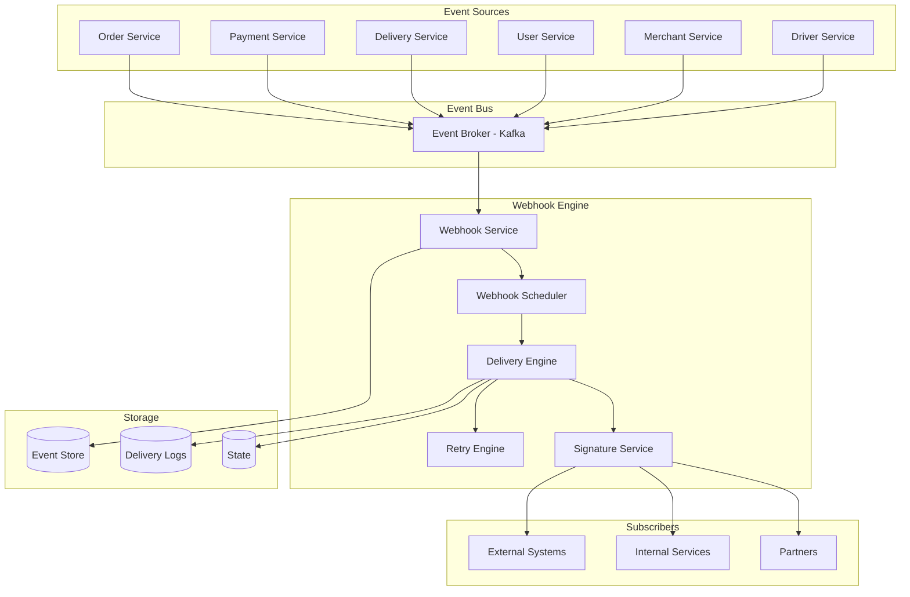
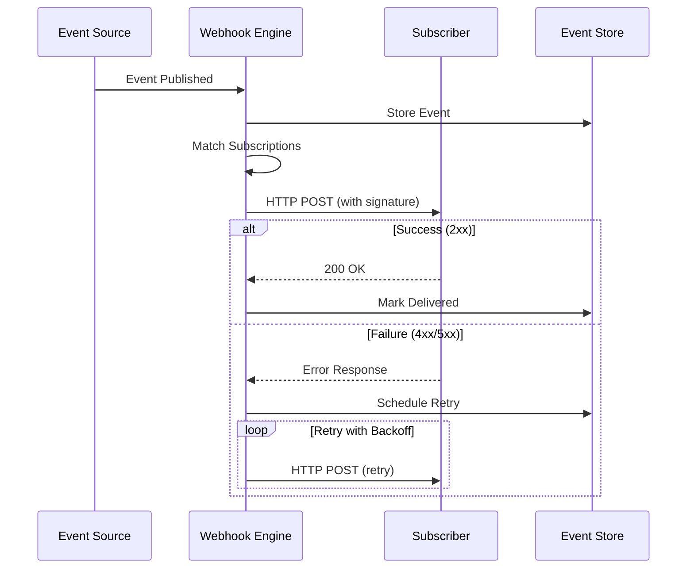

# Part 13D: Webhooks & Events

**Module:** Platform APIs & Developer Ecosystem (Part 13)
**Version:** 1.0.0
**Status:** Final / For Review
**Date:** 2026-06-30

---

## Chapter 1 – Overview

### Purpose

The Webhooks & Events module defines the comprehensive event-driven notification capabilities for the **[Platform Name]** platform. This encompasses webhook subscription management, event delivery, retry policies, security, monitoring, and event storage. Webhooks enable real-time, event-driven integration with external systems, partners, and internal services. This module ensures that events are delivered reliably, securely, and with appropriate guarantees.

### Objectives

- Enable real-time event notifications to external systems
- Support event subscription management
- Provide reliable delivery with retry and backoff
- Ensure secure webhook delivery (signatures, validation)
- Support event filtering and payload customization
- Enable event replay and audit
- Provide webhook monitoring and analytics
- Support idempotent event processing

---

## Chapter 2 – Architecture

### WEB-001 Webhook Architecture



### WEB-002 Components

| Component | Description | Priority |
| :--- | :--- | :--- |
| **Event Broker** | Kafka event streaming | **Required** |
| **Webhook Service** | Core webhook processing | **Required** |
| **Webhook Scheduler** | Schedules webhook deliveries | **Required** |
| **Delivery Engine** | Executes webhook deliveries | **Required** |
| **Retry Engine** | Handles failed deliveries with backoff | **Required** |
| **Signature Service** | Signs webhook payloads | **Required** |
| **Event Store** | Stores events for replay | **Required** |
| **Delivery Logs** | Stores delivery history | **Required** |

---

## Chapter 3 – Supported Events

### WEB-003 Event Categories

| Category | Description | Priority |
| :--- | :--- | :--- |
| **Order Events** | Order lifecycle events | **Required** |
| **Payment Events** | Payment lifecycle events | **Required** |
| **Delivery Events** | Delivery lifecycle events | **Required** |
| **Merchant Events** | Merchant lifecycle events | **Required** |
| **Driver Events** | Driver lifecycle events | **Required** |
| **Customer Events** | Customer lifecycle events | **Required** |
| **System Events** | System notifications | **Required** |

### WEB-004 Order Events

| Event | Description | Payload | Priority |
| :--- | :--- | :--- | :--- |
| `order.created` | Order created | Full order object | **Required** |
| `order.confirmed` | Order confirmed by merchant | Order with status | **Required** |
| `order.preparing` | Order being prepared | Order with status | **Required** |
| `order.ready` | Order ready for pickup | Order with status | **Required** |
| `order.assigned` | Driver assigned | Order with driver | **Required** |
| `order.picked_up` | Order picked up by driver | Order with driver | **Required** |
| `order.in_transit` | Order in transit | Order with location | **Required** |
| `order.arriving_soon` | Driver arriving soon | Order with ETA | **Required** |
| `order.delivered` | Order delivered | Completed order | **Required** |
| `order.cancelled` | Order cancelled | Order with reason | **Required** |
| `order.failed` | Order failed | Order with reason | **Required** |
| `order.refunded` | Order refunded | Order with refund | **Required** |

### WEB-005 Payment Events

| Event | Description | Payload | Priority |
| :--- | :--- | :--- | :--- |
| `payment.authorized` | Payment authorized | Payment details | **Required** |
| `payment.captured` | Payment captured | Payment details | **Required** |
| `payment.failed` | Payment failed | Payment with reason | **Required** |
| `payment.refunded` | Payment refunded | Refund details | **Required** |
| `payment.disputed` | Payment disputed | Dispute details | **Required** |
| `payment.dispute.resolved` | Dispute resolved | Resolution details | **Required** |

### WEB-006 Delivery Events

| Event | Description | Payload | Priority |
| :--- | :--- | :--- | :--- |
| `delivery.assigned` | Driver assigned | Delivery with driver | **Required** |
| `delivery.arrived` | Driver arrived at merchant | Delivery with location | **Required** |
| `delivery.picked_up` | Order picked up | Delivery with status | **Required** |
| `delivery.en_route` | Driver en route | Delivery with ETA | **Required** |
| `delivery.arriving` | Driver arriving soon | Delivery with ETA | **Required** |
| `delivery.completed` | Delivery completed | Completed delivery | **Required** |
| `delivery.failed` | Delivery failed | Delivery with reason | **Required** |

### WEB-007 Merchant Events

| Event | Description | Payload | Priority |
| :--- | :--- | :--- | :--- |
| `merchant.registered` | Merchant registered | Merchant details | **Required** |
| `merchant.activated` | Merchant activated | Merchant details | **Required** |
| `merchant.suspended` | Merchant suspended | Merchant with reason | **Required** |
| `merchant.updated` | Merchant updated | Merchant changes | **Required** |
| `merchant.menu.updated` | Menu updated | Menu changes | **Required** |

### WEB-008 Driver Events

| Event | Description | Payload | Priority |
| :--- | :--- | :--- | :--- |
| `driver.registered` | Driver registered | Driver details | **Required** |
| `driver.activated` | Driver activated | Driver details | **Required** |
| `driver.suspended` | Driver suspended | Driver with reason | **Required** |
| `driver.updated` | Driver updated | Driver changes | **Required** |
| `driver.location.updated` | Location updated | Driver location | **Required** |
| `driver.status.updated` | Status updated | Driver status | **Required** |

### WEB-009 Customer Events

| Event | Description | Payload | Priority |
| :--- | :--- | :--- | :--- |
| `customer.registered` | Customer registered | Customer details | **Required** |
| `customer.updated` | Customer updated | Customer changes | **Required** |
| `customer.deleted` | Customer deleted | Customer ID | **Required** |

### WEB-010 System Events

| Event | Description | Payload | Priority |
| :--- | :--- | :--- | :--- |
| `system.maintenance` | Maintenance notification | Maintenance details | **Required** |
| `system.alert` | System alert | Alert details | **Required** |
| `system.incident` | Incident notification | Incident details | **Required** |

---

## Chapter 4 – Webhook Subscription

### WEB-011 Subscription Features

| Feature | Description | Priority |
| :--- | :--- | :--- |
| **Create Subscription** | Create a webhook subscription | **Required** |
| **Update Subscription** | Update webhook settings | **Required** |
| **Delete Subscription** | Delete a subscription | **Required** |
| **List Subscriptions** | List all subscriptions | **Required** |
| **Get Subscription** | Get subscription details | **Required** |
| **Event Filtering** | Filter events by type | **Required** |
| **Payload Customization** | Customize payload fields | **Required** |
| **Retry Configuration** | Configure retry settings | **Required** |
| **Rate Limiting** | Per-subscription rate limits | **Required** |

### WEB-012 Subscription Data Model

| Column | Type | Constraints | Description |
| :--- | :--- | :--- | :--- |
| `subscription_id` | UUID | PRIMARY KEY | Unique identifier |
| `name` | VARCHAR(100) | NOT NULL | Subscription name |
| `description` | TEXT | | Subscription description |
| `url` | VARCHAR(500) | NOT NULL | Webhook endpoint URL |
| `events` | TEXT[] | NOT NULL | Event types subscribed |
| `secret` | VARCHAR(255) | NOT NULL | HMAC secret for signing |
| `headers` | JSONB | | Custom headers to include |
| `payload_template` | JSONB | | Payload customization |
| `retry_config` | JSONB | | Retry configuration |
| `rate_limit` | INTEGER | DEFAULT 100 | Requests per minute |
| `is_active` | BOOLEAN | DEFAULT TRUE | Active status |
| `last_triggered_at` | TIMESTAMP | | Last trigger timestamp |
| `created_by` | UUID` | | Creator identifier |
| `created_at` | TIMESTAMP | DEFAULT NOW() | Creation timestamp |
| `updated_at` | TIMESTAMP | DEFAULT NOW() | Last update timestamp |

---

## Chapter 5 – Webhook Delivery

### WEB-013 Delivery Process



### WEB-014 Retry Policy

| Attempt | Delay | Priority |
| :--- | :--- | :--- |
| **1** | 0 seconds (immediate) | **Required** |
| **2** | 5 seconds | **Required** |
| **3** | 30 seconds | **Required** |
| **4** | 5 minutes | **Required** |
| **5** | 30 minutes | **Required** |
| **6** | 2 hours | **Required** |
| **7** | 6 hours | **Required** |
| **8** | 24 hours | **Required** |

### WEB-015 Delivery Statuses

| Status | Description | Priority |
| :--- | :--- | :--- |
| `PENDING` | Delivery queued | **Required** |
| `DELIVERING` | Delivery in progress | **Required** |
| `SUCCESS` | Delivery successful | **Required** |
| `FAILED` | Delivery failed | **Required** |
| `RETRYING` | Delivery retrying | **Required** |
| `EXPIRED` | Max retries exceeded | **Required** |

### WEB-016 Delivery Data Model

| Column | Type | Constraints | Description |
| :--- | :--- | :--- | :--- |
| `delivery_id` | UUID | PRIMARY KEY | Unique identifier |
| `subscription_id` | UUID | FOREIGN KEY | Associated subscription |
| `event_type` | VARCHAR(50) | NOT NULL | Event type |
| `event_id` | UUID | NOT NULL | Event identifier |
| `payload` | JSONB | NOT NULL | Webhook payload |
| `status` | VARCHAR(20) | DEFAULT 'PENDING' | Delivery status |
| `attempt_count` | INTEGER | DEFAULT 0 | Attempt count |
| `response_code` | INTEGER | | HTTP response code |
| `response_body` | TEXT | | Response body |
| `response_headers` | JSONB | | Response headers |
| `latency_ms` | INTEGER | | Delivery latency (ms) |
| `next_retry_at` | TIMESTAMP | | Next retry timestamp |
| `completed_at` | TIMESTAMP | | Completion timestamp |
| `created_at` | TIMESTAMP | DEFAULT NOW() | Creation timestamp |
| `updated_at` | TIMESTAMP | DEFAULT NOW() | Last update timestamp |

---

## Chapter 6 – Security

### WEB-017 Webhook Security Features

| Feature | Description | Priority |
| :--- | :--- | :--- |
| **HMAC Signature** | Sign payloads with HMAC-SHA256 | **Required** |
| **Signature Verification** | Verify signatures on delivery | **Required** |
| **IP Whitelisting** | Allow only whitelisted IPs | **Required** |
| **URL Validation** | Validate webhook URLs | **Required** |
| **Secret Rotation** | Rotate webhook secrets | **Required** |
| **Idempotency** | Idempotency keys for webhooks | **Required** |
| **Payload Encryption** | Optional payload encryption | **Medium** |

### WEB-018 Signature Calculation

```
signature = HMAC-SHA256(secret, payload + timestamp)

Headers:
X-Webhook-Signature: {signature}
X-Webhook-Timestamp: {timestamp}
X-Webhook-Idempotency-Key: {event_id}
```

### WEB-019 Verification Process

1.  Extract `X-Webhook-Signature` header.
2.  Extract `X-Webhook-Timestamp` header.
3.  Verify timestamp is within 5 minutes of current time.
4.  Calculate expected signature using HMAC-SHA256.
5.  Compare signatures using constant-time comparison.
6.  If valid, process webhook; otherwise, reject.

---

## Chapter 7 – Event Store

### WEB-020 Event Store Features

| Feature | Description | Priority |
| :--- | :--- | :--- |
| **Event Storage** | Store all events | **Required** |
| **Event Query** | Query events by type, time, source | **Required** |
| **Event Replay** | Replay events to subscribers | **Required** |
| **Event Export** | Export events for analysis | **Required** |
| **Event Retention** | Configurable retention periods | **Required** |
| **Event Search** | Search events by payload | **Required** |

### WEB-021 Event Data Model

| Column | Type | Constraints | Description |
| :--- | :--- | :--- | :--- |
| `event_id` | UUID | PRIMARY KEY | Unique identifier |
| `event_type` | VARCHAR(50) | NOT NULL | Event type |
| `event_version` | VARCHAR(10) | NOT NULL | Event version |
| `source` | VARCHAR(100) | NOT NULL | Event source service |
| `payload` | JSONB | NOT NULL | Event payload |
| `metadata` | JSONB | | Event metadata |
| `timestamp` | TIMESTAMP | NOT NULL | Event timestamp |
| `created_at` | TIMESTAMP | DEFAULT NOW() | Creation timestamp |

---

## Chapter 8 – Webhook Analytics

### WEB-022 Webhook Metrics

| Metric | Description | Priority |
| :--- | :--- | :--- |
| **Delivery Rate** | % of successful deliveries | **Required** |
| **Average Latency** | Average delivery latency | **Required** |
| **Error Rate** | % of failed deliveries | **Required** |
| **Retry Rate** | % of deliveries requiring retry | **Required** |
| **Event Volume** | Events per second | **Required** |
| **Top Subscribers** | Most active subscribers | **Required** |
| **Top Events** | Most frequent events | **Required** |
| **Slowest Endpoints** | Slowest webhook endpoints | **Required** |

### WEB-023 Analytics Data Model

| Column | Type | Constraints | Description |
| :--- | :--- | :--- | :--- |
| `analytics_id` | UUID | PRIMARY KEY | Unique identifier |
| `subscription_id` | UUID | FOREIGN KEY | Associated subscription |
| `date` | DATE | NOT NULL | Date |
| `total_deliveries` | INTEGER | | Total deliveries |
| `success_count` | INTEGER | | Successful deliveries |
| `failed_count` | INTEGER | | Failed deliveries |
| `retry_count` | INTEGER | | Retry count |
| `avg_latency_ms` | INTEGER | | Average latency |
| `p95_latency_ms` | INTEGER | | P95 latency |
| `error_distribution` | JSONB | | Error distribution |
| `created_at` | TIMESTAMP | DEFAULT NOW() | Creation timestamp |
| `updated_at` | TIMESTAMP | DEFAULT NOW() | Last update timestamp |

---

## Chapter 9 – Database Tables

### webhook_subscriptions

| Column | Type | Constraints | Description |
| :--- | :--- | :--- | :--- |
| `subscription_id` | UUID | PRIMARY KEY | Unique identifier |
| `name` | VARCHAR(100) | NOT NULL | Subscription name |
| `description` | TEXT | | Subscription description |
| `url` | VARCHAR(500) | NOT NULL | Webhook endpoint URL |
| `events` | TEXT[] | NOT NULL | Event types subscribed |
| `secret` | VARCHAR(255) | NOT NULL | HMAC secret |
| `headers` | JSONB | | Custom headers |
| `payload_template` | JSONB | | Payload customization |
| `retry_config` | JSONB | | Retry configuration |
| `rate_limit` | INTEGER | DEFAULT 100 | Requests per minute |
| `is_active` | BOOLEAN | DEFAULT TRUE | Active status |
| `last_triggered_at` | TIMESTAMP | | Last trigger timestamp |
| `created_by` | UUID | | Creator identifier |
| `created_at` | TIMESTAMP | DEFAULT NOW() | Creation timestamp |
| `updated_at` | TIMESTAMP | DEFAULT NOW() | Last update timestamp |

### webhook_deliveries

| Column | Type | Constraints | Description |
| :--- | :--- | :--- | :--- |
| `delivery_id` | UUID | PRIMARY KEY | Unique identifier |
| `subscription_id` | UUID | FOREIGN KEY (webhook_subscriptions.subscription_id) | Associated subscription |
| `event_type` | VARCHAR(50) | NOT NULL | Event type |
| `event_id` | UUID | NOT NULL | Event identifier |
| `payload` | JSONB | NOT NULL | Webhook payload |
| `status` | VARCHAR(20) | DEFAULT 'PENDING' | PENDING/DELIVERING/SUCCESS/FAILED/RETRYING/EXPIRED |
| `attempt_count` | INTEGER | DEFAULT 0 | Attempt count |
| `response_code` | INTEGER | | HTTP response code |
| `response_body` | TEXT | | Response body |
| `response_headers` | JSONB | | Response headers |
| `latency_ms` | INTEGER` | | Delivery latency (ms) |
| `next_retry_at` | TIMESTAMP | | Next retry timestamp |
| `completed_at` | TIMESTAMP | | Completion timestamp |
| `created_at` | TIMESTAMP | DEFAULT NOW() | Creation timestamp |
| `updated_at` | TIMESTAMP | DEFAULT NOW() | Last update timestamp |

### webhook_events

| Column | Type | Constraints | Description |
| :--- | :--- | :--- | :--- |
| `event_id` | UUID | PRIMARY KEY | Unique identifier |
| `event_type` | VARCHAR(50) | NOT NULL | Event type |
| `event_version` | VARCHAR(10) | NOT NULL | Event version |
| `source` | VARCHAR(100) | NOT NULL | Event source service |
| `payload` | JSONB | NOT NULL | Event payload |
| `metadata` | JSONB | | Event metadata |
| `timestamp` | TIMESTAMP | NOT NULL | Event timestamp |
| `created_at` | TIMESTAMP | DEFAULT NOW() | Creation timestamp |

### webhook_analytics

| Column | Type | Constraints | Description |
| :--- | :--- | :--- | :--- |
| `analytics_id` | UUID | PRIMARY KEY | Unique identifier |
| `subscription_id` | UUID | FOREIGN KEY (webhook_subscriptions.subscription_id) | Associated subscription |
| `date` | DATE | NOT NULL | Date |
| `total_deliveries` | INTEGER | | Total deliveries |
| `success_count` | INTEGER | | Successful deliveries |
| `failed_count` | INTEGER | | Failed deliveries |
| `retry_count` | INTEGER | | Retry count |
| `avg_latency_ms` | INTEGER | | Average latency |
| `p95_latency_ms` | INTEGER | | P95 latency |
| `error_distribution` | JSONB | | Error distribution |
| `created_at` | TIMESTAMP | DEFAULT NOW() | Creation timestamp |
| `updated_at` | TIMESTAMP | DEFAULT NOW() | Last update timestamp |

### webhook_rate_limits

| Column | Type | Constraints | Description |
| :--- | :--- | :--- | :--- |
| `rate_limit_id` | UUID | PRIMARY KEY | Unique identifier |
| `subscription_id` | UUID | FOREIGN KEY (webhook_subscriptions.subscription_id) | Associated subscription |
| `window_start` | TIMESTAMP | NOT NULL | Window start timestamp |
| `window_end` | TIMESTAMP | NOT NULL | Window end timestamp |
| `request_count` | INTEGER | DEFAULT 0 | Request count in window |
| `created_at` | TIMESTAMP | DEFAULT NOW() | Creation timestamp |
| `updated_at` | TIMESTAMP | DEFAULT NOW() | Last update timestamp |

---

## Chapter 10 – REST APIs

### Subscription APIs

| Method | Endpoint | Description |
| :--- | :--- | :--- |
| `GET` | `/api/v1/webhooks` | List webhook subscriptions |
| `GET` | `/api/v1/webhooks/{id}` | Get subscription details |
| `POST` | `/api/v1/webhooks` | Create subscription |
| `PUT` | `/api/v1/webhooks/{id}` | Update subscription |
| `DELETE` | `/api/v1/webhooks/{id}` | Delete subscription |
| `PATCH` | `/api/v1/webhooks/{id}/status` | Update subscription status |
| `POST` | `/api/v1/webhooks/{id}/rotate-secret` | Rotate webhook secret |
| `POST` | `/api/v1/webhooks/{id}/test` | Test webhook delivery |

### Delivery APIs

| Method | Endpoint | Description |
| :--- | :--- | :--- |
| `GET` | `/api/v1/webhooks/{id}/deliveries` | Get delivery history |
| `GET` | `/api/v1/webhooks/deliveries/{id}` | Get delivery details |
| `POST` | `/api/v1/webhooks/deliveries/{id}/retry` | Retry failed delivery |

### Event APIs

| Method | Endpoint | Description |
| :--- | :--- | :--- |
| `GET` | `/api/v1/webhooks/events` | Query events |
| `GET` | `/api/v1/webhooks/events/{id}` | Get event details |
| `POST` | `/api/v1/webhooks/events/replay` | Replay events (admin) |

### Analytics APIs

| Method | Endpoint | Description |
| :--- | :--- | :--- |
| `GET` | `/api/v1/webhooks/analytics` | Get webhook analytics |
| `GET` | `/api/v1/webhooks/analytics/subscription/{id}` | Get subscription analytics |
| `GET` | `/api/v1/webhooks/analytics/events` | Get event analytics |
| `GET` | `/api/v1/webhooks/analytics/metrics` | Get webhook metrics |

---

## Chapter 11 – Webhook Payloads

### WEB-024 Order Created Payload

```json
{
  "event": "order.created",
  "version": "1.0",
  "timestamp": "2026-06-30T14:30:45.123Z",
  "idempotency_key": "550e8400-e29b-41d4-a716-446655440000",
  "data": {
    "order_id": "550e8400-e29b-41d4-a716-446655440001",
    "order_reference": "ORD-2026-001",
    "customer": {
      "id": "550e8400-e29b-41d4-a716-446655440002",
      "name": "John Doe",
      "email": "john.doe@example.com",
      "phone": "+971501234567"
    },
    "merchant": {
      "id": "550e8400-e29b-41d4-a716-446655440003",
      "name": "Joe's Pizza Palace"
    },
    "items": [
      {
        "id": "550e8400-e29b-41d4-a716-446655440004",
        "name": "Margherita Pizza",
        "quantity": 1,
        "price": 45.00,
        "modifiers": [
          {
            "name": "Extra Cheese",
            "price": 5.00
          }
        ]
      }
    ],
    "total": 53.50,
    "currency": "USD",
    "delivery_address": {
      "line1": "456 Oak Avenue",
      "city": "Dubai",
      "state": "Dubai",
      "postal_code": "12345",
      "country": "AE"
    },
    "status": "PENDING",
    "created_at": "2026-06-30T14:30:45.123Z"
  }
}
```

### WEB-025 Order Delivered Payload

```json
{
  "event": "order.delivered",
  "version": "1.0",
  "timestamp": "2026-06-30T14:45:30.456Z",
  "idempotency_key": "550e8400-e29b-41d4-a716-446655440001",
  "data": {
    "order_id": "550e8400-e29b-41d4-a716-446655440001",
    "order_reference": "ORD-2026-001",
    "status": "DELIVERED",
    "delivered_at": "2026-06-30T14:45:30.456Z",
    "delivery": {
      "id": "550e8400-e29b-41d4-a716-446655440005",
      "driver": {
        "id": "550e8400-e29b-41d4-a716-446655440006",
        "name": "Ahmed Mohammed"
      },
      "total_distance": 8.5,
      "total_time": 900
    },
    "payment": {
      "status": "CAPTURED",
      "amount": 53.50,
      "currency": "USD"
    }
  }
}
```

---

## Chapter 12 – Business Rules

| Rule ID | Rule Description | Priority |
| :--- | :--- | :--- |
| **BR-WEB-001** | Webhook deliveries must be signed with HMAC-SHA256. | **High** |
| **BR-WEB-002** | Failed webhooks must be retried up to 8 times with backoff. | **High** |
| **BR-WEB-003** | Webhook endpoints must respond within 30 seconds. | **High** |
| **BR-WEB-004** | Rate limit per subscription: 100 requests/minute (configurable). | **High** |
| **BR-WEB-005** | Events must be stored for 90 days. | **High** |
| **BR-WEB-006** | Webhook URL must use HTTPS. | **High** |
| **BR-WEB-007** | Timestamp must be within 5 minutes for signature verification. | **High** |
| **BR-WEB-008** | Webhook subscriptions require event filtering. | **High** |
| **BR-WEB-009** | Failed deliveries must be logged with error details. | **High** |
| **BR-WEB-010** | Secrets must be stored encrypted at rest. | **High** |

---

## Chapter 13 – Acceptance Tests

| Test ID | Test Description | Priority |
| :--- | :--- | :--- |
| **TEST-WEB-001** | Webhook subscription created successfully. | **High** |
| **TEST-WEB-002** | Webhook event delivered successfully. | **High** |
| **TEST-WEB-003** | Webhook signature verified successfully. | **High** |
| **TEST-WEB-004** | Invalid signature rejects webhook. | **High** |
| **TEST-WEB-005** | Failed webhook retried with backoff. | **High** |
| **TEST-WEB-006** | Webhook max retries exceeded (event expired). | **High** |
| **TEST-WEB-007** | Webhook rate limit enforced correctly. | **High** |
| **TEST-WEB-008** | Webhook filtering works correctly. | **High** |
| **TEST-WEB-009** | Payload customization works correctly. | **High** |
| **TEST-WEB-010** | Webhook status updated correctly. | **High** |
| **TEST-WEB-011** | Event storage works correctly. | **High** |
| **TEST-WEB-012** | Event query works correctly. | **High** |
| **TEST-WEB-013** | Event replay works correctly. | **High** |
| **TEST-WEB-014** | Webhook analytics displayed correctly. | **High** |
| **TEST-WEB-015** | Idempotency key prevents duplicate processing. | **High** |
| **TEST-WEB-016** | Webhook secret rotated successfully. | **High** |
| **TEST-WEB-017** | Test webhook delivery works correctly. | **High** |
| **TEST-WEB-018** | Custom headers included in webhook. | **High** |
| **TEST-WEB-019** | Webhook delivery latency tracked correctly. | **High** |
| **TEST-WEB-020** | Webhook error distribution tracked correctly. | **High** |

---

## Chapter 14 – Traceability Matrix

| Requirement | Database Table | API Endpoint(s) | Acceptance Test |
| :--- | :--- | :--- | :--- |
| WEB-011 | webhook_subscriptions | POST /api/v1/webhooks | TEST-WEB-001 |
| WEB-013 | webhook_deliveries | POST /api/v1/webhooks | TEST-WEB-002 |
| WEB-017 | webhook_subscriptions | Internal | TEST-WEB-003, TEST-WEB-004 |
| WEB-014 | webhook_deliveries | POST /api/v1/webhooks/deliveries/{id}/retry | TEST-WEB-005, TEST-WEB-006 |
| WEB-016 | webhook_rate_limits | GET /api/v1/webhooks | TEST-WEB-007 |
| WEB-013 | webhook_deliveries | GET /api/v1/webhooks/{id}/deliveries | TEST-WEB-008, TEST-WEB-009 |
| WEB-016 | webhook_subscriptions | PUT /api/v1/webhooks/{id}/status | TEST-WEB-010 |
| WEB-020 | webhook_events | GET /api/v1/webhooks/events | TEST-WEB-011, TEST-WEB-012 |
| WEB-020 | webhook_events | POST /api/v1/webhooks/events/replay | TEST-WEB-013 |
| WEB-022 | webhook_analytics | GET /api/v1/webhooks/analytics | TEST-WEB-014 |
| WEB-017 | webhook_deliveries | POST /api/v1/webhooks | TEST-WEB-015 |
| WEB-011 | webhook_subscriptions | POST /api/v1/webhooks/{id}/rotate-secret | TEST-WEB-016 |
| WEB-011 | webhook_deliveries | POST /api/v1/webhooks/{id}/test | TEST-WEB-017 |
| WEB-011 | webhook_subscriptions | GET /api/v1/webhooks/{id} | TEST-WEB-018 |
| WEB-022 | webhook_analytics | GET /api/v1/webhooks/analytics/metrics | TEST-WEB-019, TEST-WEB-020 |

---

## Chapter 15 – Summary

This document establishes the complete webhooks and events capability for the **[Platform Name]** platform. Key takeaways:

- **Comprehensive Event Coverage:** Order, payment, delivery, merchant, driver, customer, and system events.
- **Webhook Subscriptions:** Create, update, delete, and manage webhook subscriptions with event filtering and payload customization.
- **Reliable Delivery:** Retry with exponential backoff (8 attempts), rate limiting, and idempotency keys.
- **Security:** HMAC-SHA256 signatures, timestamp validation, URL validation, and secret rotation.
- **Event Store:** Full event storage with query, replay, and export capabilities.
- **Webhook Analytics:** Delivery rate, latency, error rate, retry rate, and event volume tracking.
- **Webhook Testing:** Test delivery endpoints and subscription validation.
- **Audit Trail:** Complete delivery history and event logs.

The webhooks and events module enables real-time, event-driven integration with external systems and partners.

---

**Next Document:**

`Part_13E_SDKs_Client_Libraries.md`

*(This builds on webhooks and events to define SDKs and client libraries.)*