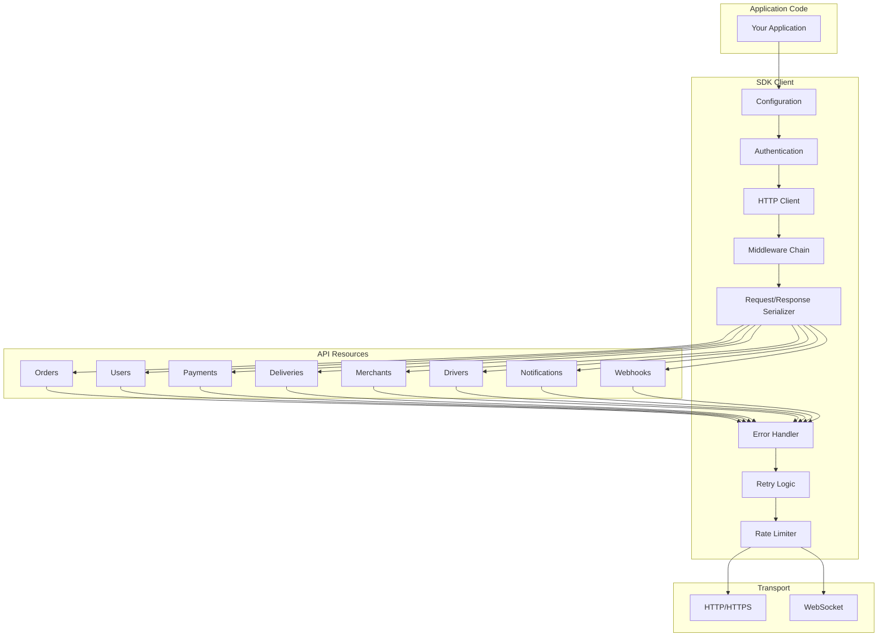
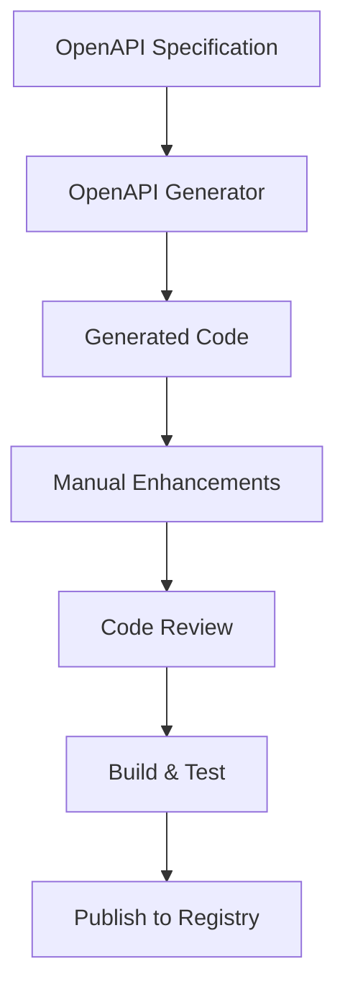
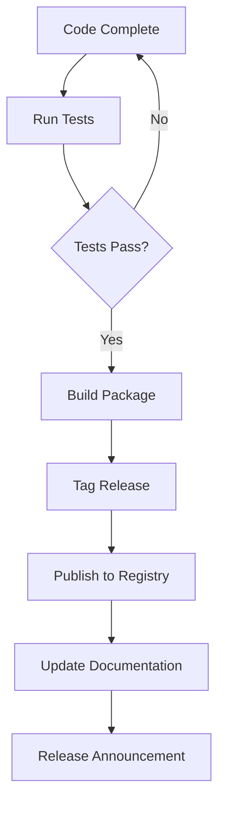

# Software Requirements Specification (SRS)

## Part 13E: SDKs & Client Libraries

**Module:** Platform APIs & Developer Ecosystem (Part 13)
**Version:** 1.0.0
**Status:** Final / For Review
**Date:** 2026-06-30

---

## Chapter 1 – Overview

### Purpose

The SDKs & Client Libraries module defines the comprehensive software development kits (SDKs) and client libraries for the **[Platform Name]** platform. This encompasses official SDKs for multiple programming languages, client library features, code generation, documentation, versioning, and distribution.

SDKs are the primary interface for most developers building on the platform. Well-designed SDKs abstract away the complexity of API communication, provide type safety, handle authentication, and implement best practices. This module ensures that developers can integrate with the platform quickly, efficiently, and with minimal friction.

### Objectives

- Provide official SDKs for popular programming languages
- Enable seamless API integration with type safety
- Handle authentication, retries, and error handling automatically
- Support both synchronous and asynchronous programming models
- Provide comprehensive documentation and examples
- Enable SDK versioning and backward compatibility
- Support open-source contribution and community engagement
- Ensure SDK quality through testing and code reviews

---

## Chapter 2 – Supported Languages

### SDK-001 Official SDKs

| Language | Target Platforms | Priority | Status |
| :--- | :--- | :--- | :--- |
| **JavaScript** | Node.js, Browser, React Native | **Required** | Active |
| **TypeScript** | Node.js, Browser, React Native | **Required** | Active |
| **Python** | Python 3.8+, Web, Backend | **Required** | Active |
| **Java** | Android, Backend, Spring | **Required** | Active |
| **Kotlin** | Android, Backend, Ktor | **Required** | Active |
| **Swift** | iOS, macOS | **Required** | Active |
| **Dart** | Flutter Mobile, Web | **Required** | Active |
| **Go** | Backend, Microservices | **Required** | Active |
| **PHP** | Laravel, Symfony | **Required** | Active |
| **Ruby** | Rails, Sinatra | **Required** | Active |
| **C#** | .NET Core, Unity | **Required** | Active |
| **Rust** | High-performance backends | **Medium** | Planned |
| **Elixir** | Phoenix, Backend | **Medium** | Planned |
| **Scala** | Play, Akka | **Low** | Planned |

### SDK-002 Language Version Support

| Language | Minimum Version | Target Version | Priority |
| :--- | :--- | :--- | :--- |
| **JavaScript** | ES6 (ES2015) | ES2020+ | **Required** |
| **TypeScript** | 4.0 | 5.0+ | **Required** |
| **Python** | 3.8 | 3.11+ | **Required** |
| **Java** | 11 | 17+ | **Required** |
| **Kotlin** | 1.6 | 1.9+ | **Required** |
| **Swift** | 5.0 | 5.9+ | **Required** |
| **Dart** | 2.17 | 3.0+ | **Required** |
| **Go** | 1.18 | 1.22+ | **Required** |
| **PHP** | 7.4 | 8.2+ | **Required** |
| **Ruby** | 2.7 | 3.2+ | **Required** |
| **C#** | .NET 6.0 | .NET 8.0+ | **Required** |

---

## Chapter 3 – SDK Features

### SDK-003 Core Features

| Feature | Description | Priority |
| :--- | :--- | :--- |
| **API Client** | HTTP client with all endpoints | **Required** |
| **Authentication** | API key, OAuth 2.1, JWT support | **Required** |
| **Type Safety** | Strong typing for request/response | **Required** |
| **Error Handling** | Structured error responses | **Required** |
| **Retry Logic** | Automatic retry with backoff | **Required** |
| **Rate Limiting** | Handle rate limit responses | **Required** |
| **Pagination** | Automatic pagination handling | **Required** |
| **Request/Response Logging** | Configurable logging | **Required** |
| **Timeout Handling** | Configurable timeouts | **Required** |
| **Middleware** | Extensible middleware support | **Required** |
| **Async Support** | Async/await, Promise, Future | **Required** |
| **WebSocket Support** | Real-time communication | **Required** |
| **Webhook Verification** | Verify webhook signatures | **Required** |
| **File Upload/Download** | Multipart file handling | **Required** |
| **Mock Mode** | Development/testing mock mode | **Required** |

### SDK-004 Advanced Features

| Feature | Description | Priority |
| :--- | :--- | :--- |
| **Idempotency** | Automatic idempotency key management | **Required** |
| **Retry Configuration** | Configurable retry policies | **Required** |
| **Circuit Breaker** | Optional circuit breaker support | **Required** |
| **Connection Pooling** | Efficient connection management | **Required** |
| **Compression** | Request/response compression | **Required** |
| **Caching** | Response caching | **Medium** |
| **Metrics** | SDK telemetry | **Medium** |
| **Distributed Tracing** | OpenTelemetry integration | **Medium** |
| **Feature Flags** | Configurable features | **Medium** |
| **Plugin System** | Extensible plugin architecture | **Low** |

### SDK-005 Feature Comparison Matrix

| Feature | JS/TS | Python | Java | Kotlin | Swift | Dart | Go | PHP | Ruby | C# |
| :--- | :--- | :--- | :--- | :--- | :--- | :--- | :--- | :--- | :--- | :--- |
| **Type Safety** | ✅ | ✅ | ✅ | ✅ | ✅ | ✅ | ✅ | ✅ | ✅ | ✅ |
| **Async/Await** | ✅ | ✅ | ✅ | ✅ | ✅ | ✅ | ✅ | ✅ | ✅ | ✅ |
| **WebSocket** | ✅ | ✅ | ✅ | ✅ | ✅ | ✅ | ✅ | ✅ | ✅ | ✅ |
| **Webhook Verify** | ✅ | ✅ | ✅ | ✅ | ✅ | ✅ | ✅ | ✅ | ✅ | ✅ |
| **Retry/Backoff** | ✅ | ✅ | ✅ | ✅ | ✅ | ✅ | ✅ | ✅ | ✅ | ✅ |
| **Pagination** | ✅ | ✅ | ✅ | ✅ | ✅ | ✅ | ✅ | ✅ | ✅ | ✅ |
| **Middleware** | ✅ | ✅ | ✅ | ✅ | ✅ | ✅ | ✅ | ✅ | ✅ | ✅ |
| **Mock Mode** | ✅ | ✅ | ✅ | ✅ | ✅ | ✅ | ✅ | ✅ | ✅ | ✅ |

---

## Chapter 4 – SDK Architecture

### SDK-006 SDK Architecture



### SDK-007 SDK Components

| Component | Description | Priority |
| :--- | :--- | :--- |
| **Configuration** | Base URL, timeout, retry configuration | **Required** |
| **Authentication** | API key, OAuth 2.1, JWT handling | **Required** |
| **HTTP Client** | Configurable HTTP client | **Required** |
| **Middleware Chain** | Logging, metrics, tracing | **Required** |
| **Serializer** | Request/response serialization | **Required** |
| **Error Handler** | Structured error handling | **Required** |
| **Retry Logic** | Exponential backoff retry | **Required** |
| **Rate Limiter** | Client-side rate limiting | **Required** |
| **Resources** | API resource classes | **Required** |
| **Models** | Type-safe data models | **Required** |

---

## Chapter 5 – SDK Examples

### SDK-008 JavaScript/TypeScript Example

```typescript
import { PlatformClient, Order } from '@platform/sdk';

// Initialize client
const client = new PlatformClient({
  apiKey: 'pk_live_abc123def456',
  environment: 'production',
  timeout: 30000,
  retry: {
    maxRetries: 3,
    backoffFactor: 2,
    initialDelay: 100
  }
});

// Create an order
const order = await client.orders.create({
  customer_id: '550e8400-e29b-41d4-a716-446655440000',
  merchant_id: '550e8400-e29b-41d4-a716-446655440001',
  items: [
    {
      item_id: '550e8400-e29b-41d4-a716-446655440002',
      quantity: 1,
      modifiers: []
    }
  ],
  delivery_address: {
    line1: '456 Oak Avenue',
    city: 'Dubai',
    state: 'Dubai',
    postal_code: '12345',
    country: 'AE'
  },
  payment_method: {
    type: 'CARD',
    token: 'tok_abc123def456'
  }
});

console.log(`Order ${order.order_reference} created successfully!`);

// Webhook verification
const webhook = client.webhooks;
const isValid = webhook.verifySignature({
  payload: request.body,
  signature: request.headers['x-webhook-signature'],
  timestamp: request.headers['x-webhook-timestamp'],
  secret: 'whsec_abc123def456'
});

if (isValid) {
  const event = webhook.parsePayload(request.body);
  console.log(`Received event: ${event.event}`);
}
```

### SDK-009 Python Example

```python
from platform_sdk import PlatformClient
from platform_sdk.models import Order

# Initialize client
client = PlatformClient(
    api_key='pk_live_abc123def456',
    environment='production',
    timeout=30,
    retry_config={
        'max_retries': 3,
        'backoff_factor': 2,
        'initial_delay': 0.1
    }
)

# Create an order
order = client.orders.create(
    customer_id='550e8400-e29b-41d4-a716-446655440000',
    merchant_id='550e8400-e29b-41d4-a716-446655440001',
    items=[
        {
            'item_id': '550e8400-e29b-41d4-a716-446655440002',
            'quantity': 1,
            'modifiers': []
        }
    ],
    delivery_address={
        'line1': '456 Oak Avenue',
        'city': 'Dubai',
        'state': 'Dubai',
        'postal_code': '12345',
        'country': 'AE'
    },
    payment_method={
        'type': 'CARD',
        'token': 'tok_abc123def456'
    }
)

print(f"Order {order.order_reference} created successfully!")

# Webhook verification
from platform_sdk import webhook

is_valid = webhook.verify_signature(
    payload=request_body,
    signature=headers['x-webhook-signature'],
    timestamp=headers['x-webhook-timestamp'],
    secret='whsec_abc123def456'
)

if is_valid:
    event = webhook.parse_payload(request_body)
    print(f"Received event: {event['event']}")
```

### SDK-010 Java Example

```java
import com.platform.sdk.PlatformClient;
import com.platform.sdk.models.Order;
import com.platform.sdk.models.OrderRequest;

// Initialize client
PlatformClient client = PlatformClient.builder()
    .apiKey("pk_live_abc123def456")
    .environment(Environment.PRODUCTION)
    .timeout(Duration.ofSeconds(30))
    .retryConfig(RetryConfig.builder()
        .maxRetries(3)
        .backoffFactor(2)
        .initialDelay(Duration.ofMillis(100))
        .build())
    .build();

// Create an order
Order order = client.orders().create(OrderRequest.builder()
    .customerId("550e8400-e29b-41d4-a716-446655440000")
    .merchantId("550e8400-e29b-41d4-a716-446655440001")
    .items(Arrays.asList(
        ItemRequest.builder()
            .itemId("550e8400-e29b-41d4-a716-446655440002")
            .quantity(1)
            .build()
    ))
    .deliveryAddress(AddressRequest.builder()
        .line1("456 Oak Avenue")
        .city("Dubai")
        .state("Dubai")
        .postalCode("12345")
        .country("AE")
        .build())
    .paymentMethod(PaymentMethodRequest.builder()
        .type("CARD")
        .token("tok_abc123def456")
        .build())
    .build());

System.out.println("Order " + order.getOrderReference() + " created successfully!");

// Webhook verification
WebhookVerifier verifier = client.webhooks();
boolean isValid = verifier.verifySignature(
    payload,
    signature,
    timestamp,
    "whsec_abc123def456"
);

if (isValid) {
    Event event = verifier.parsePayload(payload);
    System.out.println("Received event: " + event.getEvent());
}
```

### SDK-011 Swift Example

```swift
import PlatformSDK

// Initialize client
let client = PlatformClient(
    apiKey: "pk_live_abc123def456",
    environment: .production,
    timeout: 30,
    retryConfig: RetryConfig(
        maxRetries: 3,
        backoffFactor: 2,
        initialDelay: 0.1
    )
)

// Create an order
Task {
    do {
        let order = try await client.orders.create(
            customerId: "550e8400-e29b-41d4-a716-446655440000",
            merchantId: "550e8400-e29b-41d4-a716-446655440001",
            items: [
                OrderItem(
                    itemId: "550e8400-e29b-41d4-a716-446655440002",
                    quantity: 1,
                    modifiers: []
                )
            ],
            deliveryAddress: Address(
                line1: "456 Oak Avenue",
                city: "Dubai",
                state: "Dubai",
                postalCode: "12345",
                country: "AE"
            ),
            paymentMethod: PaymentMethod(
                type: .card,
                token: "tok_abc123def456"
            )
        )
        
        print("Order \(order.orderReference) created successfully!")
    } catch {
        print("Error: \(error)")
    }
}

// Webhook verification
let webhook = client.webhooks
let isValid = webhook.verifySignature(
    payload: requestBody,
    signature: headers["x-webhook-signature"] ?? "",
    timestamp: headers["x-webhook-timestamp"] ?? "",
    secret: "whsec_abc123def456"
)

if isValid {
    let event = webhook.parsePayload(requestBody)
    print("Received event: \(event.event)")
}
```

### SDK-012 Go Example

```go
package main

import (
    "context"
    "fmt"
    "log"

    "github.com/platform/sdk"
)

func main() {
    // Initialize client
    client := sdk.NewClient(sdk.Config{
        APIKey:      "pk_live_abc123def456",
        Environment: sdk.EnvironmentProduction,
        Timeout:     30 * time.Second,
        Retry: sdk.RetryConfig{
            MaxRetries:    3,
            BackoffFactor: 2,
            InitialDelay:  100 * time.Millisecond,
        },
    })

    // Create an order
    order, err := client.Orders.Create(context.Background(), &sdk.CreateOrderRequest{
        CustomerID: "550e8400-e29b-41d4-a716-446655440000",
        MerchantID: "550e8400-e29b-41d4-a716-446655440001",
        Items: []sdk.OrderItem{
            {
                ItemID:   "550e8400-e29b-41d4-a716-446655440002",
                Quantity: 1,
            },
        },
        DeliveryAddress: sdk.Address{
            Line1:      "456 Oak Avenue",
            City:       "Dubai",
            State:      "Dubai",
            PostalCode: "12345",
            Country:    "AE",
        },
        PaymentMethod: sdk.PaymentMethod{
            Type:  "CARD",
            Token: "tok_abc123def456",
        },
    })

    if err != nil {
        log.Fatalf("Failed to create order: %v", err)
    }

    fmt.Printf("Order %s created successfully!\n", order.OrderReference)

    // Webhook verification
    verifier := client.Webhooks
    isValid := verifier.VerifySignature(
        payload,
        headers["x-webhook-signature"],
        headers["x-webhook-timestamp"],
        "whsec_abc123def456",
    )

    if isValid {
        event, _ := verifier.ParsePayload(payload)
        fmt.Printf("Received event: %s\n", event.Event)
    }
}
```

---

## Chapter 6 – API Client Generation

### SDK-013 Code Generation

| Generation Method | Description | Priority |
| :--- | :--- | :--- |
| **OpenAPI Generator** | Generate clients from OpenAPI spec | **Required** |
| **Manual Implementation** | Hand-crafted client code | **Required** |
| **Hybrid Approach** | Generated base + manual improvements | **Required** |

### SDK-014 Generation Pipeline



### SDK-015 Generator Configurations

| Language | Generator | Output | Priority |
| :--- | :--- | :--- | :--- |
| **TypeScript** | openapi-generator-typescript-fetch | `@platform/sdk` | **Required** |
| **Python** | openapi-generator-python | `platform-sdk` | **Required** |
| **Java** | openapi-generator-java | `com.platform.sdk` | **Required** |
| **Kotlin** | openapi-generator-kotlin | `com.platform.sdk` | **Required** |
| **Swift** | openapi-generator-swift5 | `PlatformSDK` | **Required** |
| **Dart** | openapi-generator-dart | `platform_sdk` | **Required** |
| **Go** | openapi-generator-go | `github.com/platform/sdk` | **Required** |

---

## Chapter 7 – Testing

### SDK-016 Test Types

| Test Type | Description | Priority |
| :--- | :--- | :--- |
| **Unit Tests** | Test individual components | **Required** |
| **Integration Tests** | Test with sandbox environment | **Required** |
| **Contract Tests** | Verify API contract compliance | **Required** |
| **Performance Tests** | Load and stress testing | **Required** |
| **Security Tests** | Security vulnerability testing | **Required** |

### SDK-017 Test Coverage Targets

| Language | Unit Test Coverage | Integration Test Coverage | Priority |
| :--- | :--- | :--- | :--- |
| **JavaScript/TypeScript** | > 90% | > 80% | **Required** |
| **Python** | > 90% | > 80% | **Required** |
| **Java** | > 90% | > 80% | **Required** |
| **Kotlin** | > 90% | > 80% | **Required** |
| **Swift** | > 90% | > 80% | **Required** |
| **Dart** | > 90% | > 80% | **Required** |
| **Go** | > 90% | > 80% | **Required** |

### SDK-018 Mock Server

| Feature | Description | Priority |
| :--- | :--- | :--- |
| **Sandbox Environment** | Isolated testing environment | **Required** |
| **Mock Responses** | Pre-defined mock responses | **Required** |
| **Scenario Testing** | Test specific scenarios | **Required** |
| **Error Simulation** | Simulate error conditions | **Required** |
| **Rate Limit Simulation** | Test rate limiting | **Required** |
| **Webhook Simulation** | Test webhook handlers | **Required** |

---

## Chapter 8 – Documentation

### SDK-019 Documentation Types

| Type | Description | Priority |
| :--- | :--- | :--- |
| **API Reference** | Complete API reference | **Required** |
| **Getting Started Guide** | Quick start guide | **Required** |
| **Examples** | Code examples for common tasks | **Required** |
| **Migration Guide** | Version migration guides | **Required** |
| **FAQ** | Frequently asked questions | **Required** |
| **Tutorials** | Step-by-step tutorials | **Required** |
| **API Changelog** | Version changes | **Required** |

### SDK-020 Documentation Format

| Format | Description | Priority |
| :--- | :--- | :--- |
| **Markdown** | GitHub README and docs | **Required** |
| **Docstrings** | In-code documentation | **Required** |
| **Typedoc** | TypeScript API docs | **Required** |
| **Sphinx** | Python docs | **Required** |
| **Javadoc** | Java API docs | **Required** |
| **Jazzy** | Swift API docs | **Required** |
| **Dartdoc** | Dart API docs | **Required** |
| **Godoc** | Go API docs | **Required** |

---

## Chapter 9 – Publishing

### SDK-021 Package Registries

| Language | Registry | Priority |
| :--- | :--- | :--- |
| **JavaScript/TypeScript** | npm (npmjs.com) | **Required** |
| **Python** | PyPI (pypi.org) | **Required** |
| **Java** | Maven Central | **Required** |
| **Kotlin** | Maven Central | **Required** |
| **Swift** | CocoaPods / Swift Package Manager | **Required** |
| **Dart** | pub.dev | **Required** |
| **Go** | GitHub Releases | **Required** |
| **PHP** | Packagist | **Required** |
| **Ruby** | RubyGems | **Required** |
| **C#** | NuGet | **Required** |

### SDK-022 Release Process



### SDK-023 Versioning Policy

| Version Type | Criteria | Priority |
| :--- | :--- | :--- |
| **Major** | Breaking API changes | **Required** |
| **Minor** | New features, no breaking changes | **Required** |
| **Patch** | Bug fixes, no breaking changes | **Required** |

---

## Chapter 10 – Database Tables

### sdk_versions

| Column | Type | Constraints | Description |
| :--- | :--- | :--- | :--- |
| `version_id` | UUID | PRIMARY KEY | Unique identifier |
| `sdk_name` | VARCHAR(50) | NOT NULL | SDK name |
| `language` | VARCHAR(20) | NOT NULL | Programming language |
| `version` | VARCHAR(20) | NOT NULL | Version number |
| `changelog` | TEXT | | Version changelog |
| `published_at` | TIMESTAMP | | Publication timestamp |
| `deprecated_at` | TIMESTAMP | | Deprecation timestamp |
| `status` | VARCHAR(20) | DEFAULT 'ACTIVE' | ACTIVE/DEPRECATED/SUNSET |
| `download_url` | VARCHAR(500) | | Package download URL |
| `created_at` | TIMESTAMP | DEFAULT NOW() | Creation timestamp |
| `updated_at` | TIMESTAMP | DEFAULT NOW() | Last update timestamp |

### sdk_downloads

| Column | Type | Constraints | Description |
| :--- | :--- | :--- | :--- |
| `download_id` | UUID | PRIMARY KEY | Unique identifier |
| `version_id` | UUID | FOREIGN KEY (sdk_versions.version_id) | Associated version |
| `download_count` | INTEGER | DEFAULT 0 | Download count |
| `date` | DATE | NOT NULL | Date |
| `source` | VARCHAR(50) | | Download source |
| `created_at` | TIMESTAMP | DEFAULT NOW() | Creation timestamp |
| `updated_at` | TIMESTAMP | DEFAULT NOW() | Last update timestamp |

### sdk_usage

| Column | Type | Constraints | Description |
| :--- | :--- | :--- | :--- |
| `usage_id` | UUID | PRIMARY KEY | Unique identifier |
| `api_key_id` | UUID | | API key used |
| `sdk_language` | VARCHAR(20) | NOT NULL | SDK language |
| `sdk_version` | VARCHAR(20) | NOT NULL | SDK version |
| `endpoint` | VARCHAR(255) | NOT NULL | API endpoint |
| `method` | VARCHAR(10) | NOT NULL | HTTP method |
| `timestamp` | TIMESTAMP | NOT NULL | Request timestamp |
| `created_at` | TIMESTAMP | DEFAULT NOW() | Creation timestamp |

---

## Chapter 11 – REST APIs

### SDK APIs

| Method | Endpoint | Description |
| :--- | :--- | :--- |
| `GET` | `/api/v1/sdk` | List SDKs |
| `GET` | `/api/v1/sdk/{language}` | Get SDK details |
| `GET` | `/api/v1/sdk/{language}/versions` | Get SDK versions |
| `GET` | `/api/v1/sdk/{language}/latest` | Get latest version |
| `GET` | `/api/v1/sdk/{language}/{version}/download` | Download SDK |
| `GET` | `/api/v1/sdk/{language}/{version}/docs` | Get SDK documentation |
| `GET` | `/api/v1/sdk/{language}/{version}/examples` | Get code examples |
| `GET` | `/api/v1/sdk/analytics` | Get SDK analytics |

---

## Chapter 12 – Business Rules

| Rule ID | Rule Description | Priority |
| :--- | :--- | :--- |
| **BR-SDK-001** | SDKs must support the latest stable API version. | **High** |
| **BR-SDK-002** | SDKs must be backward compatible (semantic versioning). | **High** |
| **BR-SDK-003** | SDKs must have > 90% unit test coverage. | **High** |
| **BR-SDK-004** | SDKs must be published to official package registries. | **High** |
| **BR-SDK-005** | SDKs must include comprehensive documentation. | **High** |
| **BR-SDK-006** | SDKs must handle API errors gracefully. | **High** |
| **BR-SDK-007** | SDKs must support idempotency keys for mutating operations. | **High** |
| **BR-SDK-008** | SDKs must have rate limiting built-in. | **High** |
| **BR-SDK-009** | SDKs must support both sync and async operations. | **High** |
| **BR-SDK-010** | SDKs must be open-source and community-contributable. | **High** |

---

## Chapter 13 – Acceptance Tests

| Test ID | Test Description | Priority |
| :--- | :--- | :--- |
| **TEST-SDK-001** | JavaScript SDK creates order successfully. | **High** |
| **TEST-SDK-002** | TypeScript SDK creates order successfully. | **High** |
| **TEST-SDK-003** | Python SDK creates order successfully. | **High** |
| **TEST-SDK-004** | Java SDK creates order successfully. | **High** |
| **TEST-SDK-005** | Kotlin SDK creates order successfully. | **High** |
| **TEST-SDK-006** | Swift SDK creates order successfully. | **High** |
| **TEST-SDK-007** | Dart SDK creates order successfully. | **High** |
| **TEST-SDK-008** | Go SDK creates order successfully. | **High** |
| **TEST-SDK-009** | Webhook verification works correctly. | **High** |
| **TEST-SDK-010** | Authentication works correctly. | **High** |
| **TEST-SDK-011** | Pagination handles large results. | **High** |
| **TEST-SDK-012** | Retry logic works on transient failures. | **High** |
| **TEST-SDK-013** | Error handling returns structured errors. | **High** |
| **TEST-SDK-014** | Rate limiting handled correctly. | **High** |
| **TEST-SDK-015** | Middleware chain executes correctly. | **High** |
| **TEST-SDK-016** | WebSocket connection works correctly. | **High** |
| **TEST-SDK-017** | File upload works correctly. | **High** |
| **TEST-SDK-018** | File download works correctly. | **High** |
| **TEST-SDK-019** | Mock mode works for testing. | **High** |
| **TEST-SDK-020** | SDK versioning works correctly. | **High** |
| **TEST-SDK-021** | SDK documentation is complete. | **High** |
| **TEST-SDK-022** | SDK package publishes to registry. | **High** |
| **TEST-SDK-023** | SDK examples work correctly. | **High** |
| **TEST-SDK-024** | SDK performance meets benchmarks. | **High** |
| **TEST-SDK-025** | SDK security scan passes. | **High** |

---

## Chapter 14 – Traceability Matrix

| Requirement | Database Table | API Endpoint(s) | Acceptance Test |
| :--- | :--- | :--- | :--- |
| SDK-001 | sdk_versions | GET /api/v1/sdk | TEST-SDK-001, TEST-SDK-002, TEST-SDK-003, TEST-SDK-004, TEST-SDK-005, TEST-SDK-006, TEST-SDK-007, TEST-SDK-008 |
| SDK-003 | sdk_usage | POST /api/v1/sdk | TEST-SDK-009, TEST-SDK-010, TEST-SDK-011, TEST-SDK-012, TEST-SDK-013, TEST-SDK-014, TEST-SDK-015, TEST-SDK-016, TEST-SDK-017, TEST-SDK-018, TEST-SDK-019 |
| SDK-002 | sdk_versions | GET /api/v1/sdk/{language}/versions | TEST-SDK-020 |
| SDK-019 | sdk_versions | GET /api/v1/sdk/{language}/{version}/docs | TEST-SDK-021 |
| SDK-021 | sdk_versions | GET /api/v1/sdk/{language}/{version}/download | TEST-SDK-022 |
| SDK-019 | sdk_versions | GET /api/v1/sdk/{language}/{version}/examples | TEST-SDK-023 |
| SDK-016 | sdk_versions | GET /api/v1/sdk/analytics | TEST-SDK-024, TEST-SDK-025 |

---

## Chapter 15 – Summary

This document establishes the complete SDKs and client libraries capability for the **[Platform Name]** platform. Key takeaways:

- **Comprehensive Language Support:** JavaScript, TypeScript, Python, Java, Kotlin, Swift, Dart, Go, PHP, Ruby, C#, with future support for Rust, Elixir, and Scala.
- **Core SDK Features:** API client, authentication, type safety, error handling, retry logic, rate limiting, pagination, middleware, async/await support.
- **Advanced Features:** Idempotency, webhook verification, circuit breaker, connection pooling, compression, caching, metrics, distributed tracing.
- **Client Generation:** OpenAPI-based code generation with manual enhancements for improved developer experience.
- **Testing:** Unit tests (>90% coverage), integration tests, contract tests, performance tests, and security tests.
- **Documentation:** API reference, getting started guide, examples, migration guide, FAQ, tutorials, and changelog.
- **Publishing:** Official package registries (npm, PyPI, Maven Central, CocoaPods, pub.dev, GitHub Releases, Packagist, RubyGems, NuGet).
- **Versioning:** Semantic versioning with major, minor, and patch releases.

The SDKs module ensures developers can integrate with the platform quickly, efficiently, and with minimal friction.

---

**Next Document:**

`Part_13F_Developer_Portal.md`

*(This builds on SDKs to define the developer portal capabilities.)*