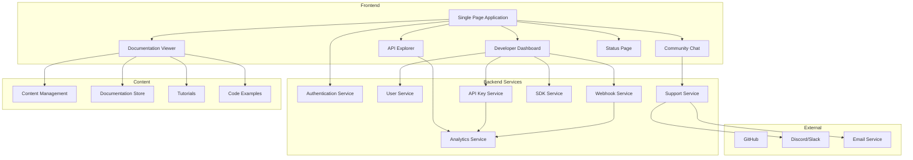

# Software Requirements Specification (SRS)

## Part 13F: Developer Portal

**Module:** Platform APIs & Developer Ecosystem (Part 13)
**Version:** 1.0.0
**Status:** Final / For Review
**Date:** 2026-06-30

---

## Chapter 1 – Overview

### Purpose

The Developer Portal module defines the comprehensive developer portal for the **[Platform Name]** platform. This encompasses API documentation, interactive API explorer, SDK management, developer onboarding, API key management, webhook management, code samples, tutorials, and developer community features.

The developer portal is the primary interface for developers building on the platform. A well-designed developer portal reduces friction, accelerates integration, and builds a thriving developer ecosystem. This module ensures that developers have everything they need to discover, learn, integrate, and succeed with the platform APIs.

### Objectives

- Provide comprehensive, interactive API documentation
- Enable API exploration and testing
- Manage developer accounts and API keys
- Support SDK discovery and downloads
- Provide code samples and tutorials
- Enable webhook management and testing
- Offer developer support and community features
- Track developer engagement and feedback

---

## Chapter 2 – Architecture

### DEVPORTAL-001 Architecture

### DEVPORTAL-002 Components

| Component | Description | Priority |
| :--- | :--- | :--- |
| **Documentation Viewer** | Interactive API documentation | **Required** |
| **API Explorer** | Test API endpoints in-browser | **Required** |
| **Developer Dashboard** | Manage API keys, webhooks, usage | **Required** |
| **Authentication Service** | Developer authentication | **Required** |
| **API Key Service** | Generate and manage API keys | **Required** |
| **Webhook Service** | Manage webhook subscriptions | **Required** |
| **SDK Service** | Discover and download SDKs | **Required** |
| **Analytics Service** | Track developer usage | **Required** |
| **Support Service** | Developer support | **Required** |
| **Status Page** | Platform status and incidents | **Required** |

---

## Chapter 3 – User Experience

### DEVPORTAL-003 Portal Sections

| Section | Description | Priority |
| :--- | :--- | :--- |
| **Home** | Welcome, quick start, featured content | **Required** |
| **Documentation** | API reference, guides, tutorials | **Required** |
| **API Explorer** | Interactive API testing | **Required** |
| **Dashboard** | Developer dashboard | **Required** |
| **SDKs** | SDK downloads and docs | **Required** |
| **Webhooks** | Webhook management | **Required** |
| **Community** | Forums, chat, events | **Required** |
| **Status** | Platform status | **Required** |
| **Support** | Help and support | **Required** |

### DEVPORTAL-004 Home Page

| Section | Content | Priority |
| :--- | :--- | :--- |
| **Hero** | Platform tagline, CTA to get started | **Required** |
| **Quick Start** | Step-by-step integration guide | **Required** |
| **Featured APIs** | Highlighted APIs with docs | **Required** |
| **SDK Cards** | SDK language cards with download links | **Required** |
| **Recent Updates** | Latest API changes and announcements | **Required** |
| **Status Banner** | Platform status indicator | **Required** |

### DEVPORTAL-005 Developer Dashboard

| Widget | Description | Priority |
| :--- | :--- | :--- |
| **API Usage** | Usage graphs and metrics | **Required** |
| **API Keys** | List and manage API keys | **Required** |
| **Webhooks** | Manage webhook subscriptions | **Required** |
| **SDKs** | SDK downloads | **Required** |
| **Recent Activity** | Recent API calls | **Required** |
| **Support Tickets** | Open support tickets | **Required** |
| **Announcements** | Platform announcements | **Required** |
| **Rate Limits** | Current rate limit status | **Required** |

---

## Chapter 4 – Documentation

### DEVPORTAL-006 Documentation Features

| Feature | Description | Priority |
| :--- | :--- | :--- |
| **Interactive Documentation** | Swagger/OpenAPI interactive docs | **Required** |
| **Search** | Full-text search across docs | **Required** |
| **Version Selector** | Switch API versions | **Required** |
| **Code Samples** | Multi-language code examples | **Required** |
| **Try It** | Test endpoints directly in docs | **Required** |
| **Authentication** | Auth info and setup guides | **Required** |
| **Error Reference** | Complete error reference | **Required** |
| **Changelog** | API changelog | **Required** |
| **Migration Guides** | Version migration guides | **Required** |

### DEVPORTAL-007 API Documentation Structure

| Section | Content | Priority |
| :--- | :--- | :--- |
| **Getting Started** | Setup, authentication, first request | **Required** |
| **API Reference** | All endpoints with details | **Required** |
| **Guides** | Common tasks and scenarios | **Required** |
| **Tutorials** | Step-by-step tutorials | **Required** |
| **SDK Reference** | SDK API documentation | **Required** |
| **Webhooks** | Webhook documentation | **Required** |
| **Best Practices** | API best practices | **Required** |
| **FAQ** | Frequently asked questions | **Required** |
| **Changelog** | API version history | **Required** |

### DEVPORTAL-008 Documentation Data Model

| Column | Type | Constraints | Description |
| :--- | :--- | :--- | :--- |
| `doc_id` | UUID | PRIMARY KEY | Unique identifier |
| `doc_type` | VARCHAR(30) | NOT NULL | REFERENCE/GUIDE/TUTORIAL/FAQ/CHANGELOG |
| `title` | VARCHAR(255) | NOT NULL | Document title |
| `content` | TEXT | NOT NULL | Document content (Markdown) |
| `slug` | VARCHAR(255) | UNIQUE | URL-friendly identifier |
| `version` | VARCHAR(10) | NOT NULL | API version |
| `language` | VARCHAR(5) | DEFAULT 'en' | ISO 639-1 language |
| `order` | INTEGER | | Display order |
| `is_published` | BOOLEAN | DEFAULT TRUE | Published status |
| `created_by` | UUID | | Creator identifier |
| `updated_by` | UUID | | Last updater |
| `created_at` | TIMESTAMP | DEFAULT NOW() | Creation timestamp |
| `updated_at` | TIMESTAMP | DEFAULT NOW() | Last update timestamp |

---

## Chapter 5 – API Explorer

### DEVPORTAL-009 API Explorer Features

| Feature | Description | Priority |
| :--- | :--- | :--- |
| **Endpoint Selection** | Browse and select endpoints | **Required** |
| **Parameter Input** | Input path, query, body parameters | **Required** |
| **Authentication** | API key or OAuth token input | **Required** |
| **Send Request** | Execute API calls | **Required** |
| **Response Viewer** | View formatted responses | **Required** |
| **History** | View request history | **Required** |
| **Code Generation** | Generate code snippets | **Required** |
| **Export** | Export as curl, Postman, etc. | **Required** |

### DEVPORTAL-010 API Explorer Data Model

| Column | Type | Constraints | Description |
| :--- | :--- | :--- | :--- |
| `explorer_id` | UUID | PRIMARY KEY | Unique identifier |
| `developer_id` | UUID | | Associated developer |
| `endpoint` | VARCHAR(255) | NOT NULL | API endpoint |
| `method` | VARCHAR(10) | NOT NULL | HTTP method |
| `parameters` | JSONB | | Request parameters |
| `headers` | JSONB` | | Request headers |
| `body` | JSONB` | | Request body |
| `response` | JSONB` | | Response body |
| `response_code` | INTEGER | | HTTP status code |
| `response_time` | INTEGER | | Response time (ms) |
| `timestamp` | TIMESTAMP | NOT NULL | Request timestamp |
| `created_at` | TIMESTAMP | DEFAULT NOW() | Creation timestamp |

---

## Chapter 6 – API Key Management

### DEVPORTAL-011 API Key Features

| Feature | Description | Priority |
| :--- | :--- | :--- |
| **Create Key** | Generate new API key | **Required** |
| **List Keys** | View all API keys | **Required** |
| **Revoke Key** | Revoke API key | **Required** |
| **Rename Key** | Update key name | **Required** |
| **Set Scopes** | Configure API scopes | **Required** |
| **Set Rate Limits** | Configure rate limits | **Required** |
| **Key Usage** | View key usage metrics | **Required** |
| **Key Rotation** | Rotate API key | **Required** |
| **Key Expiry** | Set key expiration | **Required** |

### DEVPORTAL-012 API Key Data Model

| Column | Type | Constraints | Description |
| :--- | :--- | :--- | :--- |
| `api_key_id` | UUID | PRIMARY KEY | Unique identifier |
| `developer_id` | UUID | FOREIGN KEY | Associated developer |
| `name` | VARCHAR(100) | NOT NULL | API key name |
| `key_prefix` | VARCHAR(10) | | Key prefix |
| `key_hash` | VARCHAR(255) | NOT NULL | Hashed API key |
| `scopes` | TEXT[] | | Authorization scopes |
| `rate_limit_tier` | VARCHAR(20) | DEFAULT 'STANDARD' | FREE/STANDARD/PREMIUM/ENTERPRISE |
| `expires_at` | TIMESTAMP | | Expiration timestamp |
| `last_used_at` | TIMESTAMP | | Last usage timestamp |
| `is_active` | BOOLEAN | DEFAULT TRUE | Active status |
| `created_at` | TIMESTAMP | DEFAULT NOW() | Creation timestamp |
| `updated_at` | TIMESTAMP | DEFAULT NOW() | Last update timestamp |

---

## Chapter 7 – Webhook Management

### DEVPORTAL-013 Webhook Features

| Feature | Description | Priority |
| :--- | :--- | :--- |
| **Create Webhook** | Register webhook endpoint | **Required** |
| **List Webhooks** | View all webhooks | **Required** |
| **Update Webhook** | Update webhook settings | **Required** |
| **Delete Webhook** | Delete webhook | **Required** |
| **Event Selection** | Select events to subscribe | **Required** |
| **Test Webhook** | Send test payload | **Required** |
| **View Deliveries** | View delivery history | **Required** |
| **Retry Delivery** | Retry failed delivery | **Required** |
| **Logs** | View webhook logs | **Required** |
| **Secret Rotation** | Rotate webhook secret | **Required** |

### DEVPORTAL-014 Webhook Data Model

| Column | Type | Constraints | Description |
| :--- | :--- | :--- | :--- |
| `webhook_id` | UUID | PRIMARY KEY | Unique identifier |
| `developer_id` | UUID | FOREIGN KEY | Associated developer |
| `name` | VARCHAR(100) | NOT NULL | Webhook name |
| `url` | VARCHAR(500) | NOT NULL | Endpoint URL |
| `events` | TEXT[] | NOT NULL | Event types |
| `secret` | VARCHAR(255) | NOT NULL | HMAC secret |
| `headers` | JSONB | | Custom headers |
| `is_active` | BOOLEAN | DEFAULT TRUE | Active status |
| `last_triggered_at` | TIMESTAMP | | Last trigger timestamp |
| `created_at` | TIMESTAMP | DEFAULT NOW() | Creation timestamp |
| `updated_at` | TIMESTAMP | DEFAULT NOW() | Last update timestamp |

---

## Chapter 8 – SDK Management

### DEVPORTAL-015 SDK Features

| Feature | Description | Priority |
| :--- | :--- | :--- |
| **SDK List** | List available SDKs | **Required** |
| **SDK Details** | SDK documentation and features | **Required** |
| **SDK Download** | Download SDK packages | **Required** |
| **Version Selector** | Select SDK version | **Required** |
| **Installation Guide** | Installation instructions | **Required** |
| **Examples** | SDK code examples | **Required** |
| **API Reference** | SDK API reference | **Required** |
| **Changelog** | SDK version history | **Required** |

### DEVPORTAL-016 SDK Data Model

| Column | Type | Constraints | Description |
| :--- | :--- | :--- | :--- |
| `sdk_id` | UUID | PRIMARY KEY | Unique identifier |
| `language` | VARCHAR(20) | NOT NULL | Programming language |
| `name` | VARCHAR(50) | NOT NULL | SDK name |
| `version` | VARCHAR(20) | NOT NULL | Version number |
| `description` | TEXT | | SDK description |
| `installation_command` | VARCHAR(255) | | Install command (npm install, pip install, etc.) |
| `documentation_url` | VARCHAR(500) | | Documentation URL |
| `source_url` | VARCHAR(500) | | Source repository URL |
| `package_url` | VARCHAR(500) | | Package URL |
| `is_active` | BOOLEAN | DEFAULT TRUE | Active status |
| `created_at` | TIMESTAMP | DEFAULT NOW() | Creation timestamp |
| `updated_at` | TIMESTAMP | DEFAULT NOW() | Last update timestamp |

---

## Chapter 9 – Developer Community

### DEVPORTAL-017 Community Features

| Feature | Description | Priority |
| :--- | :--- | :--- |
| **Forums** | Discussion forums | **Required** |
| **Chat** | Real-time developer chat | **Required** |
| **Events** | Developer events and webinars | **Required** |
| **Blog** | Platform blog and news | **Required** |
| **Contributors** | Open-source contributors | **Required** |
| **Showcase** | Apps built on the platform | **Required** |
| **Feedback** | Submit feedback | **Required** |
| **Beta Program** | Early access program | **Required** |

### DEVPORTAL-018 Community Data Model

| Column | Type | Constraints | Description |
| :--- | :--- | :--- | :--- |
| `forum_id` | UUID | PRIMARY KEY | Unique identifier |
| `developer_id` | UUID | FOREIGN KEY | Associated developer |
| `title` | VARCHAR(255) | NOT NULL | Post title |
| `content` | TEXT | NOT NULL | Post content |
| `category` | VARCHAR(50) | NOT NULL | Category |
| `status` | VARCHAR(20) | DEFAULT 'OPEN' | OPEN/RESOLVED/CLOSED |
| `upvotes` | INTEGER | DEFAULT 0 | Upvote count |
| `views` | INTEGER | DEFAULT 0 | View count |
| `created_at` | TIMESTAMP | DEFAULT NOW() | Creation timestamp |
| `updated_at` | TIMESTAMP | DEFAULT NOW() | Last update timestamp |

---

## Chapter 10 – Status Page

### DEVPORTAL-019 Status Page Features

| Feature | Description | Priority |
| :--- | :--- | :--- |
| **Service Status** | All services status | **Required** |
| **Incident History** | Past incidents | **Required** |
| **Maintenance Schedule** | Upcoming maintenance | **Required** |
| **Metrics** | API performance metrics | **Required** |
| **Uptime** | Uptime percentages | **Required** |
| **Subscribe** | Subscribe to status updates | **Required** |
| **RSS Feed** | RSS feed for status | **Required** |

### DEVPORTAL-020 Status Data Model

| Column | Type | Constraints | Description |
| :--- | :--- | :--- | :--- |
| `status_id` | UUID | PRIMARY KEY | Unique identifier |
| `service_name` | VARCHAR(100) | NOT NULL | Service name |
| `status` | VARCHAR(20) | NOT NULL | OPERATIONAL/DEGRADED/OUTAGE |
| `message` | TEXT | | Status message |
| `updated_at` | TIMESTAMP | | Last update timestamp |
| `created_at` | TIMESTAMP | DEFAULT NOW() | Creation timestamp |

---

## Chapter 11 – Database Tables

### developer_accounts

| Column | Type | Constraints | Description |
| :--- | :--- | :--- | :--- |
| `developer_id` | UUID | PRIMARY KEY | Unique identifier |
| `email` | VARCHAR(255) | UNIQUE | Email address |
| `password_hash` | VARCHAR(255) | NOT NULL | Password hash |
| `first_name` | VARCHAR(100) | NOT NULL | First name |
| `last_name` | VARCHAR(100) | NOT NULL | Last name |
| `company_name` | VARCHAR(255) | | Company name |
| `title` | VARCHAR(100) | | Job title |
| `phone` | VARCHAR(20) | | Phone number |
| `email_verified` | BOOLEAN | DEFAULT FALSE | Email verification |
| `is_active` | BOOLEAN | DEFAULT TRUE | Active status |
| `created_at` | TIMESTAMP | DEFAULT NOW() | Creation timestamp |
| `updated_at` | TIMESTAMP | DEFAULT NOW() | Last update timestamp |

### developer_api_keys

| Column | Type | Constraints | Description |
| :--- | :--- | :--- | :--- |
| `api_key_id` | UUID | PRIMARY KEY | Unique identifier |
| `developer_id` | UUID | FOREIGN KEY (developer_accounts.developer_id) | Associated developer |
| `name` | VARCHAR(100) | NOT NULL | API key name |
| `key_prefix` | VARCHAR(10) | | Key prefix |
| `key_hash` | VARCHAR(255) | NOT NULL | Hashed API key |
| `scopes` | TEXT[] | | Authorization scopes |
| `rate_limit_tier` | VARCHAR(20) | DEFAULT 'STANDARD' | FREE/STANDARD/PREMIUM/ENTERPRISE |
| `expires_at` | TIMESTAMP | | Expiration timestamp |
| `last_used_at` | TIMESTAMP | | Last usage timestamp |
| `is_active` | BOOLEAN | DEFAULT TRUE | Active status |
| `created_at` | TIMESTAMP | DEFAULT NOW() | Creation timestamp |
| `updated_at` | TIMESTAMP | DEFAULT NOW() | Last update timestamp |

### developer_webhooks

| Column | Type | Constraints | Description |
| :--- | :--- | :--- | :--- |
| `webhook_id` | UUID | PRIMARY KEY | Unique identifier |
| `developer_id` | UUID | FOREIGN KEY (developer_accounts.developer_id) | Associated developer |
| `name` | VARCHAR(100) | NOT NULL | Webhook name |
| `url` | VARCHAR(500) | NOT NULL | Endpoint URL |
| `events` | TEXT[] | NOT NULL | Event types |
| `secret` | VARCHAR(255) | NOT NULL | HMAC secret |
| `headers` | JSONB` | | Custom headers |
| `is_active` | BOOLEAN | DEFAULT TRUE | Active status |
| `last_triggered_at` | TIMESTAMP | | Last trigger timestamp |
| `created_at` | TIMESTAMP | DEFAULT NOW() | Creation timestamp |
| `updated_at` | TIMESTAMP | DEFAULT NOW() | Last update timestamp |

### developer_usage

| Column | Type | Constraints | Description |
| :--- | :--- | :--- | :--- |
| `usage_id` | UUID | PRIMARY KEY | Unique identifier |
| `developer_id` | UUID | FOREIGN KEY (developer_accounts.developer_id) | Associated developer |
| `api_key_id` | UUID | FOREIGN KEY (developer_api_keys.api_key_id) | Associated API key |
| `endpoint` | VARCHAR(255) | NOT NULL | API endpoint |
| `method` | VARCHAR(10) | NOT NULL | HTTP method |
| `status_code` | INTEGER | NOT NULL | HTTP status code |
| `latency_ms` | INTEGER | | Response latency |
| `request_size` | INTEGER | | Request size |
| `response_size` | INTEGER | | Response size |
| `timestamp` | TIMESTAMP | NOT NULL | Request timestamp |
| `created_at` | TIMESTAMP | DEFAULT NOW() | Creation timestamp |

### developer_documents

| Column | Type | Constraints | Description |
| :--- | :--- | :--- | :--- |
| `doc_id` | UUID | PRIMARY KEY | Unique identifier |
| `doc_type` | VARCHAR(30) | NOT NULL | REFERENCE/GUIDE/TUTORIAL/FAQ/CHANGELOG |
| `title` | VARCHAR(255) | NOT NULL | Document title |
| `content` | TEXT | NOT NULL | Document content |
| `slug` | VARCHAR(255) | UNIQUE | URL-friendly identifier |
| `version` | VARCHAR(10) | NOT NULL | API version |
| `language` | VARCHAR(5) | DEFAULT 'en' | ISO 639-1 language |
| `order` | INTEGER | | Display order |
| `is_published` | BOOLEAN | DEFAULT TRUE | Published status |
| `created_by` | UUID | | Creator identifier |
| `updated_by` | UUID | | Last updater |
| `created_at` | TIMESTAMP | DEFAULT NOW() | Creation timestamp |
| `updated_at` | TIMESTAMP | DEFAULT NOW() | Last update timestamp |

### developer_sdks

| Column | Type | Constraints | Description |
| :--- | :--- | :--- | :--- |
| `sdk_id` | UUID | PRIMARY KEY | Unique identifier |
| `language` | VARCHAR(20) | NOT NULL | Programming language |
| `name` | VARCHAR(50) | NOT NULL | SDK name |
| `version` | VARCHAR(20) | NOT NULL | Version number |
| `description` | TEXT | | SDK description |
| `installation_command` | VARCHAR(255) | | Install command |
| `documentation_url` | VARCHAR(500) | | Documentation URL |
| `source_url` | VARCHAR(500) | | Source repository URL |
| `package_url` | VARCHAR(500) | | Package URL |
| `is_active` | BOOLEAN | DEFAULT TRUE | Active status |
| `created_at` | TIMESTAMP | DEFAULT NOW() | Creation timestamp |
| `updated_at` | TIMESTAMP | DEFAULT NOW() | Last update timestamp |

### developer_forums

| Column | Type | Constraints | Description |
| :--- | :--- | :--- | :--- |
| `forum_id` | UUID | PRIMARY KEY | Unique identifier |
| `developer_id` | UUID | FOREIGN KEY (developer_accounts.developer_id) | Associated developer |
| `title` | VARCHAR(255) | NOT NULL | Post title |
| `content` | TEXT | NOT NULL | Post content |
| `category` | VARCHAR(50) | NOT NULL | Category |
| `status` | VARCHAR(20) | DEFAULT 'OPEN' | OPEN/RESOLVED/CLOSED |
| `upvotes` | INTEGER | DEFAULT 0 | Upvote count |
| `views` | INTEGER | DEFAULT 0 | View count |
| `created_at` | TIMESTAMP | DEFAULT NOW() | Creation timestamp |
| `updated_at` | TIMESTAMP | DEFAULT NOW() | Last update timestamp |

### developer_status

| Column | Type | Constraints | Description |
| :--- | :--- | :--- | :--- |
| `status_id` | UUID | PRIMARY KEY | Unique identifier |
| `service_name` | VARCHAR(100) | NOT NULL | Service name |
| `status` | VARCHAR(20) | NOT NULL | OPERATIONAL/DEGRADED/OUTAGE |
| `message` | TEXT | | Status message |
| `updated_at` | TIMESTAMP | | Last update timestamp |
| `created_at` | TIMESTAMP | DEFAULT NOW() | Creation timestamp |

---

## Chapter 12 – REST APIs

### Developer Auth APIs

| Method | Endpoint | Description |
| :--- | :--- | :--- |
| `POST` | `/api/v1/developer/register` | Register developer account |
| `POST` | `/api/v1/developer/login` | Developer login |
| `POST` | `/api/v1/developer/logout` | Developer logout |
| `POST` | `/api/v1/developer/verify-email` | Verify email |
| `POST` | `/api/v1/developer/forgot-password` | Forgot password |
| `POST` | `/api/v1/developer/reset-password` | Reset password |

### Developer API Key APIs

| Method | Endpoint | Description |
| :--- | :--- | :--- |
| `GET` | `/api/v1/developer/api-keys` | List API keys |
| `POST` | `/api/v1/developer/api-keys` | Create API key |
| `GET` | `/api/v1/developer/api-keys/{id}` | Get API key details |
| `PUT` | `/api/v1/developer/api-keys/{id}` | Update API key |
| `DELETE` | `/api/v1/developer/api-keys/{id}` | Delete API key |
| `POST` | `/api/v1/developer/api-keys/{id}/rotate` | Rotate API key |

### Developer Webhook APIs

| Method | Endpoint | Description |
| :--- | :--- | :--- |
| `GET` | `/api/v1/developer/webhooks` | List webhooks |
| `POST` | `/api/v1/developer/webhooks` | Create webhook |
| `GET` | `/api/v1/developer/webhooks/{id}` | Get webhook details |
| `PUT` | `/api/v1/developer/webhooks/{id}` | Update webhook |
| `DELETE` | `/api/v1/developer/webhooks/{id}` | Delete webhook |
| `POST` | `/api/v1/developer/webhooks/{id}/test` | Test webhook |
| `GET` | `/api/v1/developer/webhooks/{id}/deliveries` | Get webhook deliveries |
| `POST` | `/api/v1/developer/webhooks/{id}/retry` | Retry delivery |

### Documentation APIs

| Method | Endpoint | Description |
| :--- | :--- | :--- |
| `GET` | `/api/v1/developer/docs` | Get documentation |
| `GET` | `/api/v1/developer/docs/{slug}` | Get document |
| `GET` | `/api/v1/developer/docs/search` | Search documentation |
| `GET` | `/api/v1/developer/docs/versions` | Get API versions |
| `GET` | `/api/v1/developer/docs/spec` | Get OpenAPI spec |

### SDK APIs

| Method | Endpoint | Description |
| :--- | :--- | :--- |
| `GET` | `/api/v1/developer/sdk` | List SDKs |
| `GET` | `/api/v1/developer/sdk/{language}` | Get SDK details |
| `GET` | `/api/v1/developer/sdk/{language}/download` | Download SDK |
| `GET` | `/api/v1/developer/sdk/{language}/docs` | Get SDK docs |

### Usage APIs

| Method | Endpoint | Description |
| :--- | :--- | :--- |
| `GET` | `/api/v1/developer/usage` | Get usage metrics |
| `GET` | `/api/v1/developer/usage/daily` | Get daily usage |
| `GET` | `/api/v1/developer/usage/monthly` | Get monthly usage |
| `GET` | `/api/v1/developer/usage/endpoints` | Get endpoint usage |

### Community APIs

| Method | Endpoint | Description |
| :--- | :--- | :--- |
| `GET` | `/api/v1/developer/forum` | List forum posts |
| `POST` | `/api/v1/developer/forum` | Create forum post |
| `GET` | `/api/v1/developer/forum/{id}` | Get forum post |
| `PUT` | `/api/v1/developer/forum/{id}` | Update forum post |
| `POST` | `/api/v1/developer/forum/{id}/reply` | Reply to post |
| `POST` | `/api/v1/developer/forum/{id}/upvote` | Upvote post |

### Status APIs

| Method | Endpoint | Description |
| :--- | :--- | :--- |
| `GET` | `/api/v1/developer/status` | Get platform status |
| `GET` | `/api/v1/developer/status/history` | Get status history |
| `GET` | `/api/v1/developer/status/metrics` | Get status metrics |

---

## Chapter 13 – Business Rules

| Rule ID | Rule Description | Priority |
| :--- | :--- | :--- |
| **BR-DEVPORTAL-001** | Developer accounts require email verification. | **High** |
| **BR-DEVPORTAL-002** | API keys must be hashed before storage. | **High** |
| **BR-DEVPORTAL-003** | Documentation must be available for all API versions. | **High** |
| **BR-DEVPORTAL-004** | API Explorer requests must be rate-limited. | **High** |
| **BR-DEVPORTAL-005** | Webhook secrets must be encrypted at rest. | **High** |
| **BR-DEVPORTAL-006** | Developer usage data must be retained for 90 days. | **High** |
| **BR-DEVPORTAL-007** | Community posts must be moderated. | **High** |
| **BR-DEVPORTAL-008** | Status page must be updated in real-time. | **High** |
| **BR-DEVPORTAL-009** | Documentation must be version-controlled. | **High** |
| **BR-DEVPORTAL-010** | Developer support tickets must be responded within 24 hours. | **High** |

---

## Chapter 14 – Acceptance Tests

| Test ID | Test Description | Priority |
| :--- | :--- | :--- |
| **TEST-DEVPORTAL-001** | Developer account registration works. | **High** |
| **TEST-DEVPORTAL-002** | Developer login works. | **High** |
| **TEST-DEVPORTAL-003** | API key generated successfully. | **High** |
| **TEST-DEVPORTAL-004** | API key authentication works. | **High** |
| **TEST-DEVPORTAL-005** | API key scopes restrict access correctly. | **High** |
| **TEST-DEVPORTAL-006** | API Explorer executes requests successfully. | **High** |
| **TEST-DEVPORTAL-007** | API Explorer handles errors correctly. | **High** |
| **TEST-DEVPORTAL-008** | Documentation displays correctly. | **High** |
| **TEST-DEVPORTAL-009** | Documentation search works. | **High** |
| **TEST-DEVPORTAL-010** | SDK list displays correctly. | **High** |
| **TEST-DEVPORTAL-011** | SDK download works. | **High** |
| **TEST-DEVPORTAL-012** | Webhook created successfully. | **High** |
| **TEST-DEVPORTAL-013** | Webhook test delivery works. | **High** |
| **TEST-DEVPORTAL-014** | Webhook delivery history displays. | **High** |
| **TEST-DEVPORTAL-015** | Developer usage dashboard displays. | **High** |
| **TEST-DEVPORTAL-016** | Forum post created successfully. | **High** |
| **TEST-DEVPORTAL-017** | Forum post reply works. | **High** |
| **TEST-DEVPORTAL-018** | Status page displays correctly. | **High** |
| **TEST-DEVPORTAL-019** | API version selector works. | **High** |
| **TEST-DEVPORTAL-020** | Code generation from API Explorer works. | **High** |
| **TEST-DEVPORTAL-021** | API key revocation works. | **High** |
| **TEST-DEVPORTAL-022** | Webhook secret rotation works. | **High** |
| **TEST-DEVPORTAL-023** | Migration guides display correctly. | **High** |
| **TEST-DEVPORTAL-024** | Rate limit tier changes work. | **High** |
| **TEST-DEVPORTAL-025** | Support ticket creation works. | **High** |

---

## Chapter 15 – Traceability Matrix

| Requirement | Database Table | API Endpoint(s) | Acceptance Test |
| :--- | :--- | :--- | :--- |
| DEVPORTAL-011 | developer_api_keys | POST /api/v1/developer/api-keys | TEST-DEVPORTAL-001, TEST-DEVPORTAL-002, TEST-DEVPORTAL-003, TEST-DEVPORTAL-004, TEST-DEVPORTAL-005 |
| DEVPORTAL-009 | developer_usage | GET /api/v1/developer/explorer | TEST-DEVPORTAL-006, TEST-DEVPORTAL-007 |
| DEVPORTAL-006 | developer_documents | GET /api/v1/developer/docs | TEST-DEVPORTAL-008, TEST-DEVPORTAL-009, TEST-DEVPORTAL-019, TEST-DEVPORTAL-023 |
| DEVPORTAL-015 | developer_sdks | GET /api/v1/developer/sdk | TEST-DEVPORTAL-010, TEST-DEVPORTAL-011 |
| DEVPORTAL-013 | developer_webhooks | POST /api/v1/developer/webhooks | TEST-DEVPORTAL-012, TEST-DEVPORTAL-013, TEST-DEVPORTAL-014, TEST-DEVPORTAL-022 |
| DEVPORTAL-005 | developer_usage | GET /api/v1/developer/usage | TEST-DEVPORTAL-015, TEST-DEVPORTAL-024 |
| DEVPORTAL-017 | developer_forums | POST /api/v1/developer/forum | TEST-DEVPORTAL-016, TEST-DEVPORTAL-017 |
| DEVPORTAL-019 | developer_status | GET /api/v1/developer/status | TEST-DEVPORTAL-018 |
| DEVPORTAL-009 | developer_usage | GET /api/v1/developer/explorer | TEST-DEVPORTAL-020 |
| DEVPORTAL-011 | developer_api_keys | DELETE /api/v1/developer/api-keys/{id} | TEST-DEVPORTAL-021 |
| DEVPORTAL-004 | developer_accounts | POST /api/v1/developer/support | TEST-DEVPORTAL-025 |

---

## Chapter 16 – Summary

This document establishes the complete developer portal capability for the **[Platform Name]** platform. Key takeaways:

- **Comprehensive Documentation:** Interactive API documentation, guides, tutorials, FAQ, changelog, and migration guides with full-text search.
- **API Explorer:** Test API endpoints in-browser with parameter input, authentication, response viewer, history, and code generation.
- **Developer Dashboard:** API key management, webhook management, SDK downloads, usage analytics, and support tickets.
- **API Key Management:** Create, list, revoke, rename, set scopes, set rate limits, view usage, rotate keys, and set expiry.
- **Webhook Management:** Create, list, update, delete, event selection, test, view deliveries, retry, logs, and secret rotation.
- **SDK Management:** Discover, download, version selection, installation guides, examples, and API reference.
- **Developer Community:** Forums, chat, events, blog, contributors, showcase, feedback, and beta program.
- **Status Page:** Service status, incident history, maintenance schedule, metrics, uptime, subscribe, and RSS feed.
- **Analytics:** Developer usage tracking, endpoint usage, rate limit monitoring, and performance metrics.

The developer portal module provides developers with everything they need to discover, learn, integrate, and succeed with the platform APIs.

---

**Next Document:**

`Part_13G_API_Marketplace.md`

*(This builds on the developer portal to define the API marketplace capabilities.)*