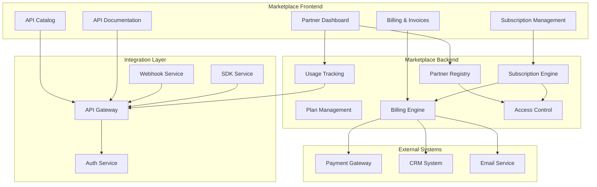

# Software Requirements Specification (SRS)

## Part 13G: API Marketplace

**Module:** Platform APIs & Developer Ecosystem (Part 13)
**Version:** 1.0.0
**Status:** Final / For Review
**Date:** 2026-06-30

---

## Chapter 1 – Overview

### Purpose

The API Marketplace module defines the comprehensive marketplace capabilities for third-party developers, partners, and enterprises to discover, subscribe, and monetize APIs on the **[Platform Name]** platform. This encompasses API catalog, subscription plans, billing, partner management, marketplace analytics, and partner onboarding.

The API marketplace transforms the platform from a closed system into an open ecosystem. By enabling third-party developers to build on and monetize their integrations, the marketplace accelerates innovation, expands platform capabilities, and creates new revenue streams. This module ensures that the marketplace is discoverable, manageable, and profitable for all participants.

### Objectives

- Enable API discovery and subscription
- Support tiered pricing and billing
- Manage partner onboarding and lifecycle
- Provide marketplace analytics and insights
- Enable API monetization
- Support partner self-service
- Ensure API quality and compliance
- Build a thriving developer ecosystem

---

## Chapter 2 – Architecture

### MARKETPLACE-001 Architecture

### MARKETPLACE-002 Components

| Component | Description | Priority |
| :--- | :--- | :--- |
| **API Catalog** | Browse and discover APIs | **Required** |
| **Partner Registry** | Manage partner accounts | **Required** |
| **Plan Management** | Define and manage pricing plans | **Required** |
| **Subscription Engine** | Handle API subscriptions | **Required** |
| **Billing Engine** | Process billing and invoices | **Required** |
| **Usage Tracking** | Track API usage and metering | **Required** |
| **Access Control** | API access control based on subscriptions | **Required** |
| **Partner Dashboard** | Partner self-service portal | **Required** |
| **Analytics** | Marketplace analytics | **Required** |

---

## Chapter 3 – API Catalog

### MARKETPLACE-003 Catalog Features

| Feature | Description | Priority |
| :--- | :--- | :--- |
| **API Discovery** | Browse and search APIs | **Required** |
| **API Details** | Detailed API information | **Required** |
| **Categories** | Categorized API listing | **Required** |
| **Search** | Full-text search across APIs | **Required** |
| **Filtering** | Filter by category, pricing, popularity | **Required** |
| **Reviews** | API ratings and reviews | **Required** |
| **Documentation** | API documentation | **Required** |
| **Pricing** | Transparent pricing display | **Required** |
| **Try It** | Test API before subscribing | **Required** |

### MARKETPLACE-004 API Data Model

| Column | Type | Constraints | Description |
| :--- | :--- | :--- | :--- |
| `api_id` | UUID | PRIMARY KEY | Unique identifier |
| `api_name` | VARCHAR(100) | NOT NULL | API name |
| `api_description` | TEXT | | API description |
| `api_category` | VARCHAR(50) | NOT NULL | API category |
| `api_version` | VARCHAR(20) | NOT NULL | Current version |
| `pricing_model` | VARCHAR(20) | NOT NULL | FREE/TIERED/USAGE_BASED/REVENUE_SHARE |
| `documentation_url` | VARCHAR(500) | | Documentation URL |
| `spec_url` | VARCHAR(500) | | OpenAPI spec URL |
| `support_email` | VARCHAR(255) | | Support email |
| `support_url` | VARCHAR(500) | | Support URL |
| `logo_url` | VARCHAR(500) | | API logo |
| `is_public` | BOOLEAN | DEFAULT TRUE | Public visibility |
| `is_active` | BOOLEAN | DEFAULT TRUE | Active status |
| `created_by` | UUID | | Creator identifier |
| `created_at` | TIMESTAMP | DEFAULT NOW() | Creation timestamp |
| `updated_at` | TIMESTAMP | DEFAULT NOW() | Last update timestamp |

### MARKETPLACE-005 API Categories

| Category | Description | Priority |
| :--- | :--- | :--- |
| **Order Management** | Order creation, updates, tracking | **Required** |
| **Payment Processing** | Payments, refunds, invoices | **Required** |
| **Delivery Logistics** | Delivery tracking, dispatch | **Required** |
| **Merchant Services** | Merchant management, analytics | **Required** |
| **Driver Services** | Driver management, tracking | **Required** |
| **Customer Services** | Customer management | **Required** |
| **Analytics** | Data and analytics APIs | **Required** |
| **Notifications** | Push, email, SMS APIs | **Required** |
| **Identity** | Authentication, authorization | **Required** |
| **Webhooks** | Event notifications | **Required** |

---

## Chapter 4 – Pricing Plans

### MARKETPLACE-006 Plan Types

| Type | Description | Priority |
| :--- | :--- | :--- |
| **Free** | No cost, limited usage | **Required** |
| **Tiered** | Usage-based tiers with fixed pricing | **Required** |
| **Usage-Based** | Pay-as-you-go pricing | **Required** |
| **Revenue Share** | Share revenue from API usage | **Required** |
| **Enterprise** | Custom pricing for enterprise | **Required** |
| **Per-Transaction** | Per API call pricing | **Required** |
| **Subscription** | Monthly/Annual subscription | **Required** |

### MARKETPLACE-007 Plan Pricing Models

| Model | Description | Example | Priority |
| :--- | :--- | :--- | :--- |
| **Free Tier** | Free limited usage | 1,000 requests/month | **Required** |
| **Tiered** | Volume-based pricing | $0.10/req up to 10k, $0.08/req 10k-100k | **Required** |
| **Pay-as-you-go** | Metered usage | $0.05 per request | **Required** |
| **Monthly Subscription** | Fixed monthly fee | $99/month for 10k requests | **Required** |
| **Annual Subscription** | Discounted annual | $999/year for 10k requests | **Required** |
| **Enterprise** | Custom pricing | Contact sales | **Required** |

### MARKETPLACE-008 Plan Data Model

| Column | Type | Constraints | Description |
| :--- | :--- | :--- | :--- |
| `plan_id` | UUID | PRIMARY KEY | Unique identifier |
| `api_id` | UUID | FOREIGN KEY (api_catalog.api_id) | Associated API |
| `plan_name` | VARCHAR(100) | NOT NULL | Plan name |
| `plan_type` | VARCHAR(20) | NOT NULL | FREE/TIERED/USAGE_BASED/REVENUE_SHARE/ENTERPRISE/PER_TRANSACTION/SUBSCRIPTION |
| `price` | DECIMAL(10, 2) | | Price amount |
| `billing_cycle` | VARCHAR(20) | | MONTHLY/ANNUAL |
| `limits` | JSONB | | Usage limits |
| `features` | JSONB | | Included features |
| `is_active` | BOOLEAN | DEFAULT TRUE | Active status |
| `created_at` | TIMESTAMP | DEFAULT NOW() | Creation timestamp |
| `updated_at` | TIMESTAMP | DEFAULT NOW() | Last update timestamp |

---

## Chapter 5 – Subscriptions

### MARKETPLACE-009 Subscription Features

| Feature | Description | Priority |
| :--- | :--- | :--- |
| **Subscribe** | Subscribe to API plan | **Required** |
| **Upgrade** | Upgrade to higher tier | **Required** |
| **Downgrade** | Downgrade to lower tier | **Required** |
| **Cancel** | Cancel subscription | **Required** |
| **Pause** | Temporarily pause subscription | **Required** |
| **Resume** | Resume paused subscription | **Required** |
| **View Subscription** | View subscription details | **Required** |
| **Auto-Renew** | Automatic renewal | **Required** |

### MARKETPLACE-010 Subscription Statuses

| Status | Description | Priority |
| :--- | :--- | :--- |
| `TRIAL` | Free trial period | **Required** |
| `ACTIVE` | Active subscription | **Required** |
| `PAST_DUE` | Payment failed, past due | **Required** |
| `PAUSED` | Temporarily paused | **Required** |
| `CANCELLED` | Cancelled (end of period) | **Required** |
| `EXPIRED` | Subscription expired | **Required** |
| `SUSPENDED` | Suspended for non-payment | **Required** |

### MARKETPLACE-011 Subscription Data Model

| Column | Type | Constraints | Description |
| :--- | :--- | :--- | :--- |
| `subscription_id` | UUID | PRIMARY KEY | Unique identifier |
| `partner_id` | UUID | FOREIGN KEY | Associated partner |
| `api_id` | UUID | FOREIGN KEY (api_catalog.api_id) | Associated API |
| `plan_id` | UUID | FOREIGN KEY (pricing_plans.plan_id) | Associated plan |
| `status` | VARCHAR(20) | DEFAULT 'TRIAL' | TRIAL/ACTIVE/PAST_DUE/PAUSED/CANCELLED/EXPIRED/SUSPENDED |
| `trial_end_date` | DATE | | Trial end date |
| `current_period_start` | DATE | | Current period start |
| `current_period_end` | DATE | | Current period end |
| `cancel_at_period_end` | BOOLEAN | DEFAULT FALSE | Cancel at period end |
| `auto_renew` | BOOLEAN | DEFAULT TRUE | Auto-renew |
| `created_at` | TIMESTAMP | DEFAULT NOW() | Creation timestamp |
| `updated_at` | TIMESTAMP | DEFAULT NOW() | Last update timestamp |

---

## Chapter 6 – Usage Metering

### MARKETPLACE-012 Usage Tracking

| Feature | Description | Priority |
| :--- | :--- | :--- |
| **Request Counting** | Count API requests | **Required** |
| **Data Volume** | Track data volume (MB/GB) | **Required** |
| **Rate Limiting** | Enforce rate limits | **Required** |
| **Usage Dashboard** | View usage metrics | **Required** |
| **Usage Reports** | Generate usage reports | **Required** |
| **Alerts** | Usage threshold alerts | **Required** |

### MARKETPLACE-013 Usage Data Model

| Column | Type | Constraints | Description |
| :--- | :--- | :--- | :--- |
| `usage_id` | UUID | PRIMARY KEY | Unique identifier |
| `subscription_id` | UUID | FOREIGN KEY (subscriptions.subscription_id) | Associated subscription |
| `api_key_id` | UUID | FOREIGN KEY (developer_api_keys.api_key_id) | Associated API key |
| `request_count` | INTEGER | DEFAULT 0 | Request count |
| `data_volume` | INTEGER | | Data volume (bytes) |
| `timestamp` | TIMESTAMP | NOT NULL | Usage timestamp |
| `created_at` | TIMESTAMP | DEFAULT NOW() | Creation timestamp |
| `updated_at` | TIMESTAMP | DEFAULT NOW() | Last update timestamp |

---

## Chapter 7 – Partner Management

### MARKETPLACE-014 Partner Features

| Feature | Description | Priority |
| :--- | :--- | :--- |
| **Onboarding** | Partner registration | **Required** |
| **Verification** | Identity and business verification | **Required** |
| **Dashboard** | Partner self-service dashboard | **Required** |
| **Profile Management** | Manage partner profile | **Required** |
| **API Management** | Publish and manage APIs | **Required** |
| **Analytics** | Partner performance analytics | **Required** |
| **Support** | Partner support | **Required** |
| **Community** | Partner community | **Required** |

### MARKETPLACE-015 Partner Data Model

| Column | Type | Constraints | Description |
| :--- | :--- | :--- | :--- |
| `partner_id` | UUID | PRIMARY KEY | Unique identifier |
| `email` | VARCHAR(255) | UNIQUE | Email address |
| `company_name` | VARCHAR(255) | NOT NULL | Company name |
| `company_description` | TEXT | | Company description |
| `website` | VARCHAR(255) | | Company website |
| `tax_id` | VARCHAR(50) | | Tax/VAT ID |
| `billing_address` | JSONB` | | Billing address |
| `business_type` | VARCHAR(50) | | Business type |
| `status` | VARCHAR(20) | DEFAULT 'PENDING' | PENDING/VERIFIED/ACTIVE/SUSPENDED/TERMINATED |
| `verified_at` | TIMESTAMP | | Verification timestamp |
| `created_at` | TIMESTAMP | DEFAULT NOW() | Creation timestamp |
| `updated_at` | TIMESTAMP | DEFAULT NOW() | Last update timestamp |

---

## Chapter 8 – Billing & Payments

### MARKETPLACE-016 Billing Features

| Feature | Description | Priority |
| :--- | :--- | :--- |
| **Invoice Generation** | Auto-generate invoices | **Required** |
| **Payment Processing** | Process subscription payments | **Required** |
| **Payment History** | View payment history | **Required** |
| **Invoice Download** | Download PDF invoices | **Required** |
| **Payment Methods** | Manage payment methods | **Required** |
| **Usage Billing** | Usage-based billing | **Required** |
| **Proration** | Prorated billing for upgrades/downgrades | **Required** |
| **Tax Handling** | Tax calculation and reporting | **Required** |

### MARKETPLACE-017 Invoice Data Model

| Column | Type | Constraints | Description |
| :--- | :--- | :--- | :--- |
| `invoice_id` | UUID | PRIMARY KEY | Unique identifier |
| `subscription_id` | UUID | FOREIGN KEY (subscriptions.subscription_id) | Associated subscription |
| `partner_id` | UUID | FOREIGN KEY (partners.partner_id) | Associated partner |
| `invoice_number` | VARCHAR(50) | UNIQUE | Invoice number |
| `period_start` | DATE | | Billing period start |
| `period_end` | DATE | | Billing period end |
| `amount` | DECIMAL(10, 2) | | Invoice amount |
| `tax` | DECIMAL(10, 2) | | Tax amount |
| `total` | DECIMAL(10, 2) | | Total amount |
| `currency` | VARCHAR(3) | NOT NULL | ISO 4217 currency |
| `status` | VARCHAR(20) | DEFAULT 'PENDING' | PENDING/PAID/OVERDUE/CANCELLED |
| `payment_date` | DATE | | Payment date |
| `payment_method` | VARCHAR(30) | | Payment method |
| `payment_transaction_id` | VARCHAR(255) | | Payment transaction ID |
| `invoice_url` | VARCHAR(500) | | PDF invoice URL |
| `created_at` | TIMESTAMP | DEFAULT NOW() | Creation timestamp |
| `updated_at` | TIMESTAMP | DEFAULT NOW() | Last update timestamp |

---

## Chapter 9 – Marketplace Analytics

### MARKETPLACE-018 Analytics Metrics

| Metric | Description | Priority |
| :--- | :--- | :--- |
| **API Subscriptions** | Total subscriptions | **Required** |
| **API Usage** | Total API calls | **Required** |
| **Revenue** | Marketplace revenue | **Required** |
| **Active Partners** | Active partners | **Required** |
| **Top APIs** | Most popular APIs | **Required** |
| **Conversion Rate** | Visitors to subscribers | **Required** |
| **Churn Rate** | Subscription churn | **Required** |
| **Average Revenue Per Partner** | ARPP | **Required** |
| **Lifetime Value** | Partner LTV | **Required** |

### MARKETPLACE-019 Analytics Data Model

| Column | Type | Constraints | Description |
| :--- | :--- | :--- | :--- |
| `analytics_id` | UUID | PRIMARY KEY | Unique identifier |
| `date` | DATE | NOT NULL | Date |
| `total_subscriptions` | INTEGER | | Total subscriptions |
| `active_subscriptions` | INTEGER | | Active subscriptions |
| `total_requests` | INTEGER | | Total API requests |
| `total_revenue` | DECIMAL(12, 2) | | Total revenue |
| `active_partners` | INTEGER | | Active partners |
| `conversion_rate` | DECIMAL(5, 2) | | Conversion rate % |
| `churn_rate` | DECIMAL(5, 2) | | Churn rate % |
| `arpp` | DECIMAL(10, 2) | | Avg revenue per partner |
| `created_at` | TIMESTAMP | DEFAULT NOW() | Creation timestamp |
| `updated_at` | TIMESTAMP | DEFAULT NOW() | Last update timestamp |

---

## Chapter 10 – Database Tables

### api_catalog

| Column | Type | Constraints | Description |
| :--- | :--- | :--- | :--- |
| `api_id` | UUID | PRIMARY KEY | Unique identifier |
| `api_name` | VARCHAR(100) | NOT NULL | API name |
| `api_description` | TEXT | | API description |
| `api_category` | VARCHAR(50) | NOT NULL | API category |
| `api_version` | VARCHAR(20) | NOT NULL | Current version |
| `pricing_model` | VARCHAR(20) | NOT NULL | FREE/TIERED/USAGE_BASED/REVENUE_SHARE |
| `documentation_url` | VARCHAR(500) | | Documentation URL |
| `spec_url` | VARCHAR(500) | | OpenAPI spec URL |
| `support_email` | VARCHAR(255) | | Support email |
| `support_url` | VARCHAR(500) | | Support URL |
| `logo_url` | VARCHAR(500) | | API logo |
| `is_public` | BOOLEAN | DEFAULT TRUE | Public visibility |
| `is_active` | BOOLEAN | DEFAULT TRUE | Active status |
| `created_by` | UUID | | Creator identifier |
| `created_at` | TIMESTAMP | DEFAULT NOW() | Creation timestamp |
| `updated_at` | TIMESTAMP | DEFAULT NOW() | Last update timestamp |

### pricing_plans

| Column | Type | Constraints | Description |
| :--- | :--- | :--- | :--- |
| `plan_id` | UUID | PRIMARY KEY | Unique identifier |
| `api_id` | UUID | FOREIGN KEY (api_catalog.api_id) | Associated API |
| `plan_name` | VARCHAR(100) | NOT NULL | Plan name |
| `plan_type` | VARCHAR(20) | NOT NULL | FREE/TIERED/USAGE_BASED/REVENUE_SHARE/ENTERPRISE/PER_TRANSACTION/SUBSCRIPTION |
| `price` | DECIMAL(10, 2) | | Price amount |
| `billing_cycle` | VARCHAR(20) | | MONTHLY/ANNUAL |
| `limits` | JSONB | | Usage limits |
| `features` | JSONB | | Included features |
| `is_active` | BOOLEAN | DEFAULT TRUE | Active status |
| `created_at` | TIMESTAMP | DEFAULT NOW() | Creation timestamp |
| `updated_at` | TIMESTAMP | DEFAULT NOW() | Last update timestamp |

### subscriptions

| Column | Type | Constraints | Description |
| :--- | :--- | :--- | :--- |
| `subscription_id` | UUID | PRIMARY KEY | Unique identifier |
| `partner_id` | UUID | FOREIGN KEY (partners.partner_id) | Associated partner |
| `api_id` | UUID | FOREIGN KEY (api_catalog.api_id) | Associated API |
| `plan_id` | UUID | FOREIGN KEY (pricing_plans.plan_id) | Associated plan |
| `status` | VARCHAR(20) | DEFAULT 'TRIAL' | TRIAL/ACTIVE/PAST_DUE/PAUSED/CANCELLED/EXPIRED/SUSPENDED |
| `trial_end_date` | DATE | | Trial end date |
| `current_period_start` | DATE | | Current period start |
| `current_period_end` | DATE | | Current period end |
| `cancel_at_period_end` | BOOLEAN | DEFAULT FALSE | Cancel at period end |
| `auto_renew` | BOOLEAN | DEFAULT TRUE | Auto-renew |
| `created_at` | TIMESTAMP | DEFAULT NOW() | Creation timestamp |
| `updated_at` | TIMESTAMP | DEFAULT NOW() | Last update timestamp |

### partners

| Column | Type | Constraints | Description |
| :--- | :--- | :--- | :--- |
| `partner_id` | UUID | PRIMARY KEY | Unique identifier |
| `email` | VARCHAR(255) | UNIQUE | Email address |
| `company_name` | VARCHAR(255) | NOT NULL | Company name |
| `company_description` | TEXT | | Company description |
| `website` | VARCHAR(255) | | Company website |
| `tax_id` | VARCHAR(50) | | Tax/VAT ID |
| `billing_address` | JSONB | | Billing address |
| `business_type` | VARCHAR(50) | | Business type |
| `status` | VARCHAR(20) | DEFAULT 'PENDING' | PENDING/VERIFIED/ACTIVE/SUSPENDED/TERMINATED |
| `verified_at` | TIMESTAMP | | Verification timestamp |
| `created_at` | TIMESTAMP | DEFAULT NOW() | Creation timestamp |
| `updated_at` | TIMESTAMP | DEFAULT NOW() | Last update timestamp |

### invoices

| Column | Type | Constraints | Description |
| :--- | :--- | :--- | :--- |
| `invoice_id` | UUID | PRIMARY KEY | Unique identifier |
| `subscription_id` | UUID | FOREIGN KEY (subscriptions.subscription_id) | Associated subscription |
| `partner_id` | UUID | FOREIGN KEY (partners.partner_id) | Associated partner |
| `invoice_number` | VARCHAR(50) | UNIQUE | Invoice number |
| `period_start` | DATE | | Billing period start |
| `period_end` | DATE | | Billing period end |
| `amount` | DECIMAL(10, 2) | | Invoice amount |
| `tax` | DECIMAL(10, 2) | | Tax amount |
| `total` | DECIMAL(10, 2) | | Total amount |
| `currency` | VARCHAR(3) | NOT NULL | ISO 4217 currency |
| `status` | VARCHAR(20) | DEFAULT 'PENDING' | PENDING/PAID/OVERDUE/CANCELLED |
| `payment_date` | DATE | | Payment date |
| `payment_method` | VARCHAR(30) | | Payment method |
| `payment_transaction_id` | VARCHAR(255) | | Payment transaction ID |
| `invoice_url` | VARCHAR(500) | | PDF invoice URL |
| `created_at` | TIMESTAMP | DEFAULT NOW() | Creation timestamp |
| `updated_at` | TIMESTAMP | DEFAULT NOW() | Last update timestamp |

### usage_data

| Column | Type | Constraints | Description |
| :--- | :--- | :--- | :--- |
| `usage_id` | UUID | PRIMARY KEY | Unique identifier |
| `subscription_id` | UUID | FOREIGN KEY (subscriptions.subscription_id) | Associated subscription |
| `api_key_id` | UUID | FOREIGN KEY (developer_api_keys.api_key_id) | Associated API key |
| `request_count` | INTEGER | DEFAULT 0 | Request count |
| `data_volume` | INTEGER | | Data volume (bytes) |
| `timestamp` | TIMESTAMP | NOT NULL | Usage timestamp |
| `created_at` | TIMESTAMP | DEFAULT NOW() | Creation timestamp |
| `updated_at` | TIMESTAMP | DEFAULT NOW() | Last update timestamp |

### marketplace_analytics

| Column | Type | Constraints | Description |
| :--- | :--- | :--- | :--- |
| `analytics_id` | UUID | PRIMARY KEY | Unique identifier |
| `date` | DATE | NOT NULL | Date |
| `total_subscriptions` | INTEGER | | Total subscriptions |
| `active_subscriptions` | INTEGER | | Active subscriptions |
| `total_requests` | INTEGER | | Total API requests |
| `total_revenue` | DECIMAL(12, 2) | | Total revenue |
| `active_partners` | INTEGER | | Active partners |
| `conversion_rate` | DECIMAL(5, 2) | | Conversion rate |
| `churn_rate` | DECIMAL(5, 2) | | Churn rate |
| `arpp` | DECIMAL(10, 2) | | Avg revenue per partner |
| `created_at` | TIMESTAMP | DEFAULT NOW() | Creation timestamp |
| `updated_at` | TIMESTAMP | DEFAULT NOW() | Last update timestamp |

---

## Chapter 11 – REST APIs

### API Catalog APIs

| Method | Endpoint | Description |
| :--- | :--- | :--- |
| `GET` | `/api/v1/marketplace/apis` | List APIs |
| `GET` | `/api/v1/marketplace/apis/{id}` | Get API details |
| `GET` | `/api/v1/marketplace/apis/categories` | Get API categories |
| `GET` | `/api/v1/marketplace/apis/search` | Search APIs |
| `POST` | `/api/v1/marketplace/apis` | Create API (partner) |
| `PUT` | `/api/v1/marketplace/apis/{id}` | Update API (partner) |
| `DELETE` | `/api/v1/marketplace/apis/{id}` | Delete API (partner) |

### Plan APIs

| Method | Endpoint | Description |
| :--- | :--- | :--- |
| `GET` | `/api/v1/marketplace/plans` | List plans |
| `GET` | `/api/v1/marketplace/plans/{id}` | Get plan details |
| `POST` | `/api/v1/marketplace/plans` | Create plan (partner) |
| `PUT` | `/api/v1/marketplace/plans/{id}` | Update plan (partner) |
| `DELETE` | `/api/v1/marketplace/plans/{id}` | Delete plan (partner) |
| `GET` | `/api/v1/marketplace/apis/{id}/plans` | Get API plans |

### Subscription APIs

| Method | Endpoint | Description |
| :--- | :--- | :--- |
| `GET` | `/api/v1/marketplace/subscriptions` | List subscriptions |
| `GET` | `/api/v1/marketplace/subscriptions/{id}` | Get subscription details |
| `POST` | `/api/v1/marketplace/subscriptions` | Create subscription |
| `PUT` | `/api/v1/marketplace/subscriptions/{id}` | Update subscription |
| `DELETE` | `/api/v1/marketplace/subscriptions/{id}` | Cancel subscription |
| `POST` | `/api/v1/marketplace/subscriptions/{id}/pause` | Pause subscription |
| `POST` | `/api/v1/marketplace/subscriptions/{id}/resume` | Resume subscription |
| `POST` | `/api/v1/marketplace/subscriptions/{id}/upgrade` | Upgrade subscription |

### Partner APIs

| Method | Endpoint | Description |
| :--- | :--- | :--- |
| `POST` | `/api/v1/marketplace/partners/register` | Register as partner |
| `GET` | `/api/v1/marketplace/partners/profile` | Get partner profile |
| `PUT` | `/api/v1/marketplace/partners/profile` | Update partner profile |
| `GET` | `/api/v1/marketplace/partners/dashboard` | Get partner dashboard |
| `GET` | `/api/v1/marketplace/partners/analytics` | Get partner analytics |

### Billing APIs

| Method | Endpoint | Description |
| :--- | :--- | :--- |
| `GET` | `/api/v1/marketplace/billing/invoices` | List invoices |
| `GET` | `/api/v1/marketplace/billing/invoices/{id}` | Get invoice details |
| `GET` | `/api/v1/marketplace/billing/invoices/{id}/download` | Download invoice |
| `GET` | `/api/v1/marketplace/billing/payment-methods` | Get payment methods |
| `POST` | `/api/v1/marketplace/billing/payment-methods` | Add payment method |
| `DELETE` | `/api/v1/marketplace/billing/payment-methods/{id}` | Delete payment method |

### Usage APIs

| Method | Endpoint | Description |
| :--- | :--- | :--- |
| `GET` | `/api/v1/marketplace/usage` | Get usage metrics |
| `GET` | `/api/v1/marketplace/usage/subscription/{id}` | Get subscription usage |
| `GET` | `/api/v1/marketplace/usage/daily` | Get daily usage |
| `GET` | `/api/v1/marketplace/usage/monthly` | Get monthly usage |

### Analytics APIs

| Method | Endpoint | Description |
| :--- | :--- | :--- |
| `GET` | `/api/v1/marketplace/analytics` | Get marketplace analytics |
| `GET` | `/api/v1/marketplace/analytics/apis` | Get API analytics |
| `GET` | `/api/v1/marketplace/analytics/partners` | Get partner analytics |
| `GET` | `/api/v1/marketplace/analytics/revenue` | Get revenue analytics |

---

## Chapter 12 – Business Rules

| Rule ID | Rule Description | Priority |
| :--- | :--- | :--- |
| **BR-MARKETPLACE-001** | APIs must be approved before publication. | **High** |
| **BR-MARKETPLACE-002** | Partners must be verified before publishing APIs. | **High** |
| **BR-MARKETPLACE-003** | Subscriptions are auto-renewed unless cancelled. | **High** |
| **BR-MARKETPLACE-004** | Usage limits are enforced at the API gateway. | **High** |
| **BR-MARKETPLACE-005** | Invoices are generated at the end of each billing period. | **High** |
| **BR-MARKETPLACE-006** | Payment failures trigger retry and notification. | **High** |
| **BR-MARKETPLACE-007** | Subscriptions can be cancelled at any time (end of period). | **High** |
| **BR-MARKETPLACE-008** | Prorated billing for mid-cycle upgrades/downgrades. | **High** |
| **BR-MARKETPLACE-009** | Usage data is aggregated daily. | **High** |
| **BR-MARKETPLACE-010** | Marketplace fees are applied to partner revenue. | **High** |

---

## Chapter 13 – Acceptance Tests

| Test ID | Test Description | Priority |
| :--- | :--- | :--- |
| **TEST-MARKETPLACE-001** | Partner registers successfully. | **High** |
| **TEST-MARKETPLACE-002** | Partner verification works. | **High** |
| **TEST-MARKETPLACE-003** | API published by partner. | **High** |
| **TEST-MARKETPLACE-004** | API catalog displays APIs. | **High** |
| **TEST-MARKETPLACE-005** | API search and filtering works. | **High** |
| **TEST-MARKETPLACE-006** | Plan created for API. | **High** |
| **TEST-MARKETPLACE-007** | Developer subscribes to API. | **High** |
| **TEST-MARKETPLACE-008** | API key generated for subscription. | **High** |
| **TEST-MARKETPLACE-009** | API request authorized by subscription. | **High** |
| **TEST-MARKETPLACE-010** | Rate limits enforced. | **High** |
| **TEST-MARKETPLACE-011** | Usage tracked correctly. | **High** |
| **TEST-MARKETPLACE-012** | Invoice generated at period end. | **High** |
| **TEST-MARKETPLACE-013** | Invoice downloaded as PDF. | **High** |
| **TEST-MARKETPLACE-014** | Subscription upgraded successfully. | **High** |
| **TEST-MARKETPLACE-015** | Subscription downgraded successfully. | **High** |
| **TEST-MARKETPLACE-016** | Subscription cancelled successfully. | **High** |
| **TEST-MARKETPLACE-017** | Prorated billing works correctly. | **High** |
| **TEST-MARKETPLACE-018** | Partner dashboard displays correctly. | **High** |
| **TEST-MARKETPLACE-019** | Marketplace analytics displayed correctly. | **High** |
| **TEST-MARKETPLACE-020** | Partner analytics displayed correctly. | **High** |
| **TEST-MARKETPLACE-021** | API reviews and ratings work. | **High** |
| **TEST-MARKETPLACE-022** | Payment method added successfully. | **High** |
| **TEST-MARKETPLACE-023** | Payment failure triggers retry. | **High** |
| **TEST-MARKETPLACE-024** | Subscription auto-renew works. | **High** |
| **TEST-MARKETPLACE-025** | Marketplace revenue tracked correctly. | **High** |

---

## Chapter 14 – Traceability Matrix

| Requirement | Database Table | API Endpoint(s) | Acceptance Test |
| :--- | :--- | :--- | :--- |
| MARKETPLACE-014 | partners | POST /api/v1/marketplace/partners/register | TEST-MARKETPLACE-001, TEST-MARKETPLACE-002 |
| MARKETPLACE-003 | api_catalog | POST /api/v1/marketplace/apis | TEST-MARKETPLACE-003 |
| MARKETPLACE-003 | api_catalog | GET /api/v1/marketplace/apis | TEST-MARKETPLACE-004, TEST-MARKETPLACE-005 |
| MARKETPLACE-006 | pricing_plans | POST /api/v1/marketplace/plans | TEST-MARKETPLACE-006 |
| MARKETPLACE-009 | subscriptions | POST /api/v1/marketplace/subscriptions | TEST-MARKETPLACE-007 |
| MARKETPLACE-009 | subscriptions | GET /api/v1/marketplace/subscriptions | TEST-MARKETPLACE-008 |
| MARKETPLACE-012 | usage_data | POST /api/v1/marketplace/usage | TEST-MARKETPLACE-009, TEST-MARKETPLACE-010, TEST-MARKETPLACE-011 |
| MARKETPLACE-016 | invoices | GET /api/v1/marketplace/billing/invoices | TEST-MARKETPLACE-012, TEST-MARKETPLACE-013 |
| MARKETPLACE-009 | subscriptions | PUT /api/v1/marketplace/subscriptions/{id}/upgrade | TEST-MARKETPLACE-014 |
| MARKETPLACE-009 | subscriptions | PUT /api/v1/marketplace/subscriptions/{id} | TEST-MARKETPLACE-015 |
| MARKETPLACE-009 | subscriptions | DELETE /api/v1/marketplace/subscriptions/{id} | TEST-MARKETPLACE-016 |
| MARKETPLACE-010 | subscriptions | Internal | TEST-MARKETPLACE-017 |
| MARKETPLACE-014 | partners | GET /api/v1/marketplace/partners/dashboard | TEST-MARKETPLACE-018 |
| MARKETPLACE-018 | marketplace_analytics | GET /api/v1/marketplace/analytics | TEST-MARKETPLACE-019, TEST-MARKETPLACE-020 |
| MARKETPLACE-003 | api_catalog | POST /api/v1/marketplace/apis/{id}/review | TEST-MARKETPLACE-021 |
| MARKETPLACE-016 | partners | POST /api/v1/marketplace/billing/payment-methods | TEST-MARKETPLACE-022 |
| MARKETPLACE-016 | invoices | Internal | TEST-MARKETPLACE-023 |
| MARKETPLACE-009 | subscriptions | Internal | TEST-MARKETPLACE-024 |
| MARKETPLACE-018 | marketplace_analytics | GET /api/v1/marketplace/analytics/revenue | TEST-MARKETPLACE-025 |

---

## Chapter 15 – Summary

This document establishes the complete API marketplace capability for the **[Platform Name]** platform. Key takeaways:

- **API Catalog:** Browse, search, and discover APIs with detailed information, documentation, and pricing.
- **Pricing Plans:** Multiple plan types (Free, Tiered, Usage-Based, Revenue Share, Enterprise, Per-Transaction, Subscription) with flexible billing cycles.
- **Subscriptions:** Full subscription lifecycle management (subscribe, upgrade, downgrade, cancel, pause, resume) with auto-renewal.
- **Usage Metering:** Track API requests, data volume, rate limiting, and usage alerts with comprehensive reporting.
- **Partner Management:** Onboarding, verification, self-service dashboard, API publishing, analytics, and support.
- **Billing & Payments:** Invoice generation, payment processing, payment history, and prorated billing.
- **Marketplace Analytics:** Subscription metrics, usage analytics, revenue tracking, partner performance, and churn analysis.
- **Partner Revenue:** Revenue sharing, marketplace fees, and partner payout tracking.

The API marketplace module transforms the platform into an open ecosystem where third-party developers can discover, subscribe to, and monetize APIs, driving innovation and creating new revenue streams.

---

**Next Document:**

`14_Testing_Deployment_Ops/Part_14A_Quality_Assurance.md`

*(This transitions from the API ecosystem to the testing, deployment, and operations module.)*