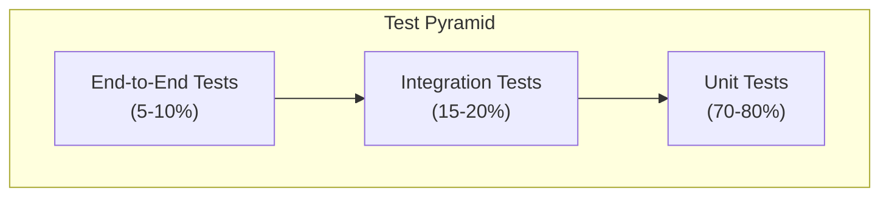

# Part 14A: Quality Assurance

**Module:** Testing, Deployment & Operations (Part 14)
**Version:** 1.0.0
**Status:** Final / For Review
**Date:** 2026-06-30

---

## Chapter 1 – Overview

### Purpose

The Quality Assurance module defines the comprehensive quality assurance framework for the **[Platform Name]** platform. This encompasses test strategy, test automation, quality gates, continuous testing, performance testing, security testing, and quality metrics.

Quality assurance is the foundation of platform reliability and user trust. A comprehensive QA framework ensures that software is tested thoroughly, defects are caught early, and releases are delivered with confidence. This module ensures that quality is built into the development process, not just inspected at the end.

### Objectives

- Define a comprehensive test strategy
- Establish quality gates and release criteria
- Implement automated testing across all levels
- Ensure performance and scalability
- Validate security and compliance
- Enable continuous testing in CI/CD
- Track quality metrics and trends
- Drive continuous improvement

---

## Chapter 2 – Test Strategy

### QA-001 Test Pyramid

### QA-002 Test Types

| Test Type | Description | Proportion | Priority |
| :--- | :--- | :--- | :--- |
| **Unit Tests** | Test individual components | 70-80% | **Required** |
| **Integration Tests** | Test component interactions | 15-20% | **Required** |
| **Contract Tests** | Test API contracts | 5-10% | **Required** |
| **Component Tests** | Test service components | 5-10% | **Required** |
| **End-to-End Tests** | Test complete workflows | 5-10% | **Required** |
| **Performance Tests** | Load, stress, soak tests | 5% | **Required** |
| **Security Tests** | SAST, DAST, penetration tests | 5% | **Required** |

### QA-003 Quality Gates

| Gate | Criteria | Priority |
| :--- | :--- | :--- |
| **Unit Test** | > 90% coverage, all passing | **Required** |
| **Integration Test** | > 80% coverage, all passing | **Required** |
| **Contract Test** | All contracts verified | **Required** |
| **Security Scan** | No critical/high vulnerabilities | **Required** |
| **Performance Test** | Meets SLA targets | **Required** |
| **Code Review** | Approved by at least 2 reviewers | **Required** |
| **Static Analysis** | No critical/high issues | **Required** |

### QA-004 Test Data Model

| Column | Type | Constraints | Description |
| :--- | :--- | :--- | :--- |
| `test_suite_id` | UUID | PRIMARY KEY | Unique identifier |
| `test_suite_name` | VARCHAR(100) | NOT NULL | Test suite name |
| `test_type` | VARCHAR(20) | NOT NULL | UNIT/INTEGRATION/CONTRACT/E2E/PERFORMANCE/SECURITY |
| `total_tests` | INTEGER | | Total tests in suite |
| `passed_tests` | INTEGER | | Passed tests |
| `failed_tests` | INTEGER | | Failed tests |
| `skipped_tests` | INTEGER | | Skipped tests |
| `coverage_percentage` | DECIMAL(5, 2) | | Test coverage % |
| `status` | VARCHAR(20) | DEFAULT 'PENDING' | PENDING/RUNNING/PASSED/FAILED |
| `duration_ms` | INTEGER | | Execution duration |
| `run_at` | TIMESTAMP` | | Run timestamp |
| `created_at` | TIMESTAMP | DEFAULT NOW() | Creation timestamp |
| `updated_at` | TIMESTAMP | DEFAULT NOW() | Last update timestamp |

---

## Chapter 3 – Unit Testing

### QA-005 Unit Test Framework

| Language | Framework | Priority |
| :--- | :--- | :--- |
| **TypeScript/JavaScript** | Jest / Vitest | **Required** |
| **Python** | pytest | **Required** |
| **Java** | JUnit 5 | **Required** |
| **Kotlin** | JUnit 5 | **Required** |
| **Swift** | XCTest | **Required** |
| **Dart** | flutter_test | **Required** |
| **Go** | testing | **Required** |

### QA-006 Unit Test Requirements

| Requirement | Description | Target | Priority |
| :--- | :--- | :--- | :--- |
| **Coverage** | Line coverage target | > 90% | **Required** |
| **Branch Coverage** | Branch coverage target | > 80% | **Required** |
| **Function Coverage** | Function coverage target | 100% | **Required** |
| **Mocking** | Mock external dependencies | Required | **Required** |
| **Isolation** | Tests must be isolated | Required | **Required** |
| **Speed** | Unit test execution | < 5 minutes | **Required** |

### QA-007 Unit Test Data Model

| Column | Type | Constraints | Description |
| :--- | :--- | :--- | :--- |
| `test_id` | UUID | PRIMARY KEY | Unique identifier |
| `test_name` | VARCHAR(255) | NOT NULL | Test name |
| `test_class` | VARCHAR(255) | NOT NULL | Test class |
| `test_method` | VARCHAR(255) | NOT NULL | Test method |
| `status` | VARCHAR(20) | NOT NULL | PASSED/FAILED/SKIPPED |
| `duration_ms` | INTEGER | | Execution duration |
| `assertions` | INTEGER | | Number of assertions |
| `error_message` | TEXT | | Error message (if failed) |
| `stack_trace` | TEXT | | Stack trace (if failed) |
| `run_at` | TIMESTAMP | NOT NULL | Run timestamp |
| `created_at` | TIMESTAMP | DEFAULT NOW() | Creation timestamp |

---

## Chapter 4 – Integration Testing

### QA-008 Integration Test Types

| Type | Description | Priority |
| :--- | :--- | :--- |
| **Database Integration** | Test database operations | **Required** |
| **Cache Integration** | Test Redis/Cache operations | **Required** |
| **Message Queue Integration** | Test Kafka/RabbitMQ operations | **Required** |
| **External Service Integration** | Test third-party APIs | **Required** |
| **Service-to-Service Integration** | Test service communication | **Required** |

### QA-009 Integration Test Requirements

| Requirement | Description | Target | Priority |
| :--- | :--- | :--- | :--- |
| **Coverage** | Integration test coverage | > 80% | **Required** |
| **Test Environment** | Dedicated test environment | Required | **Required** |
| **Test Data** | Isolated test data | Required | **Required** |
| **Cleanup** | Cleanup after tests | Required | **Required** |
| **Speed** | Integration test execution | < 15 minutes | **Required** |

### QA-010 Integration Test Data Model

| Column | Type | Constraints | Description |
| :--- | :--- | :--- | :--- |
| `integration_test_id` | UUID | PRIMARY KEY | Unique identifier |
| `test_name` | VARCHAR(255) | NOT NULL | Test name |
| `service_name` | VARCHAR(100) | NOT NULL | Service under test |
| `integration_type` | VARCHAR(30) | NOT NULL | DATABASE/CACHE/MESSAGE_QUEUE/EXTERNAL/SERVICE |
| `status` | VARCHAR(20) | NOT NULL | PASSED/FAILED/SKIPPED |
| `duration_ms` | INTEGER | | Execution duration |
| `error_message` | TEXT | | Error message (if failed) |
| `run_at` | TIMESTAMP | NOT NULL | Run timestamp |
| `created_at` | TIMESTAMP | DEFAULT NOW() | Creation timestamp |

---

## Chapter 5 – Contract Testing

### QA-011 Contract Test Framework

| Language | Framework | Priority |
| :--- | :--- | :--- |
| **Any** | Pact (Pact.io) | **Required** |
| **Any** | OpenAPI/Swagger | **Required** |
| **TypeScript** | Pact-JS | **Required** |
| **Python** | Pact-Python | **Required** |
| **Java** | Pact-JVM | **Required** |
| **Go** | Pact-Go | **Required** |

### QA-012 Contract Test Requirements

| Requirement | Description | Priority |
| :--- | :--- | :--- |
| **Provider Contracts** | All APIs have contracts | **Required** |
| **Consumer Contracts** | All consumers have contracts | **Required** |
| **Versioning** | Contracts are versioned | **Required** |
| **Verification** | Contracts verified in CI | **Required** |
| **Breaking Change Detection** | Detect breaking changes | **Required** |

### QA-013 Contract Test Data Model

| Column | Type | Constraints | Description |
| :--- | :--- | :--- | :--- |
| `contract_id` | UUID | PRIMARY KEY | Unique identifier |
| `contract_name` | VARCHAR(255) | NOT NULL | Contract name |
| `contract_version` | VARCHAR(20) | NOT NULL | Contract version |
| `api_path` | VARCHAR(255) | NOT NULL | API path |
| `method` | VARCHAR(10) | NOT NULL | HTTP method |
| `status` | VARCHAR(20) | NOT NULL | PASSED/FAILED |
| `verification_time` | TIMESTAMP | NOT NULL | Verification timestamp |
| `created_at` | TIMESTAMP | DEFAULT NOW() | Creation timestamp |
| `updated_at` | TIMESTAMP | DEFAULT NOW() | Last update timestamp |

---

## Chapter 6 – End-to-End Testing

### QA-014 E2E Test Scenarios

| Scenario | Description | Priority |
| :--- | :--- | :--- |
| **Customer Registration** | Complete customer signup flow | **Required** |
| **Login Flow** | Authentication and authorization | **Required** |
| **Order Placement** | Search → Select → Checkout → Pay | **Required** |
| **Merchant Acceptance** | Merchant confirms order | **Required** |
| **Driver Assignment** | Driver assigned to order | **Required** |
| **Delivery Process** | Pickup → Transit → Delivery | **Required** |
| **Payment Processing** | Authorize → Capture → Settle | **Required** |
| **Refund Process** | Request → Approve → Process | **Required** |
| **Support Ticket** | Create → Assign → Resolve | **Required** |
| **Settlement** | Merchant settlement process | **Required** |

### QA-015 E2E Test Requirements

| Requirement | Description | Priority |
| :--- | :--- | :--- |
| **Test Environment** | Dedicated E2E environment | **Required** |
| **Test Data** | Complete test data sets | **Required** |
| **Cleanup** | Cleanup after tests | **Required** |
| **Speed** | E2E test execution | < 30 minutes | **Required** |
| **Flaky Tests** | Zero flaky tests | **Required** |
| **Retry** | Auto-retry on failure | **Required** |

### QA-016 E2E Test Data Model

| Column | Type | Constraints | Description |
| :--- | :--- | :--- | :--- |
| `e2e_test_id` | UUID | PRIMARY KEY | Unique identifier |
| `test_scenario` | VARCHAR(100) | NOT NULL | Test scenario |
| `test_case` | VARCHAR(255) | NOT NULL | Test case name |
| `status` | VARCHAR(20) | NOT NULL | PASSED/FAILED/SKIPPED |
| `duration_ms` | INTEGER | | Execution duration |
| `steps` | JSONB | | Test steps |
| `error_message` | TEXT | | Error message (if failed) |
| `run_at` | TIMESTAMP | NOT NULL | Run timestamp |
| `created_at` | TIMESTAMP | DEFAULT NOW() | Creation timestamp |
| `updated_at` | TIMESTAMP | DEFAULT NOW() | Last update timestamp |

---

## Chapter 7 – Performance Testing

### QA-017 Performance Test Types

| Type | Description | Priority |
| :--- | :--- | :--- |
| **Load Testing** | Simulate expected load | **Required** |
| **Stress Testing** | Test beyond expected limits | **Required** |
| **Spike Testing** | Test sudden load spikes | **Required** |
| **Soak Testing** | Test extended duration | **Required** |
| **Scalability Testing** | Test horizontal scaling | **Required** |

### QA-018 Performance Test Requirements

| Metric | Target | Priority |
| :--- | :--- | :--- |
| **Response Time (P95)** | < 500ms | **Required** |
| **Response Time (P99)** | < 1s | **Required** |
| **Throughput** | 10,000+ req/sec | **Required** |
| **Error Rate** | < 0.1% | **Required** |
| **CPU Utilization** | < 70% | **Required** |
| **Memory Utilization** | < 80% | **Required** |
| **Database Connections** | < 80% of pool | **Required** |

### QA-019 Performance Test Data Model

| Column | Type | Constraints | Description |
| :--- | :--- | :--- | :--- |
| `performance_test_id` | UUID | PRIMARY KEY | Unique identifier |
| `test_type` | VARCHAR(20) | NOT NULL | LOAD/STRESS/SPIKE/SOAK/SCALABILITY |
| `test_name` | VARCHAR(100) | NOT NULL | Test name |
| `status` | VARCHAR(20) | NOT NULL | PASSED/FAILED |
| `max_users` | INTEGER | | Maximum users |
| `duration_seconds` | INTEGER | | Test duration |
| `avg_response_time_ms` | INTEGER | | Average response time |
| `p95_response_time_ms` | INTEGER` | | P95 response time |
| `p99_response_time_ms` | INTEGER` | | P99 response time |
| `throughput_rps` | DECIMAL(10, 2) | | Throughput (requests/sec) |
| `error_rate` | DECIMAL(5, 2) | | Error rate % |
| `cpu_utilization` | DECIMAL(5, 2) | | CPU utilization % |
| `memory_utilization` | DECIMAL(5, 2) | | Memory utilization % |
| `report_url` | VARCHAR(500) | | Test report URL |
| `run_at` | TIMESTAMP | NOT NULL | Run timestamp |
| `created_at` | TIMESTAMP | DEFAULT NOW() | Creation timestamp |
| `updated_at` | TIMESTAMP | DEFAULT NOW() | Last update timestamp |

---

## Chapter 8 – Security Testing

### QA-020 Security Test Types

| Type | Description | Priority |
| :--- | :--- | :--- |
| **SAST** | Static Application Security Testing | **Required** |
| **DAST** | Dynamic Application Security Testing | **Required** |
| **Dependency Scanning** | Check for vulnerable dependencies | **Required** |
| **Container Scanning** | Scan container images | **Required** |
| **Secret Scanning** | Detect exposed secrets | **Required** |
| **Penetration Testing** | Manual security testing | **Required** |

### QA-021 Security Test Requirements

| Requirement | Description | Priority |
| :--- | :--- | :--- |
| **SAST Frequency** | Every build | **Required** |
| **DAST Frequency** | Daily | **Required** |
| **Dependency Scan** | Every build | **Required** |
| **Container Scan** | Every build | **Required** |
| **Penetration Testing** | Quarterly | **Required** |
| **Critical Vulnerabilities** | Zero tolerance | **Required** |
| **High Vulnerabilities** | Fix within 24 hours | **Required** |

### QA-022 Security Test Data Model

| Column | Type | Constraints | Description |
| :--- | :--- | :--- | :--- |
| `security_test_id` | UUID | PRIMARY KEY | Unique identifier |
| `test_type` | VARCHAR(20) | NOT NULL | SAST/DAST/DEPENDENCY/CONTAINER/SECRET/PENETRATION |
| `test_name` | VARCHAR(100) | NOT NULL | Test name |
| `status` | VARCHAR(20) | NOT NULL | PASSED/FAILED |
| `critical_findings` | INTEGER` | | Critical findings |
| `high_findings` | INTEGER` | | High findings |
| `medium_findings` | INTEGER` | | Medium findings |
| `low_findings` | INTEGER` | | Low findings |
| `report_url` | VARCHAR(500) | | Test report URL |
| `run_at` | TIMESTAMP | NOT NULL | Run timestamp |
| `created_at` | TIMESTAMP | DEFAULT NOW() | Creation timestamp |
| `updated_at` | TIMESTAMP | DEFAULT NOW() | Last update timestamp |

---

## Chapter 9 – Quality Metrics

### QA-023 Quality Metrics

| Metric | Description | Target | Priority |
| :--- | :--- | :--- | :--- |
| **Unit Test Coverage** | Line coverage | > 90% | **Required** |
| **Integration Test Coverage** | Service coverage | > 80% | **Required** |
| **Test Pass Rate** | % of tests passing | 100% | **Required** |
| **Defect Density** | Defects per 1000 lines | < 1 | **Required** |
| **Mean Time to Detect** | Time to detect issues | < 1 hour | **Required** |
| **Mean Time to Fix** | Time to fix issues | < 4 hours | **Required** |
| **Code Churn** | % of code changed | < 30% | **Required** |
| **Technical Debt** | Technical debt ratio | < 10% | **Required** |

### QA-024 Quality Metrics Data Model

| Column | Type | Constraints | Description |
| :--- | :--- | :--- | :--- |
| `metric_id` | UUID | PRIMARY KEY | Unique identifier |
| `service_name` | VARCHAR(100) | NOT NULL | Service name |
| `date` | DATE | NOT NULL | Date |
| `unit_test_coverage` | DECIMAL(5, 2) | | Unit test coverage % |
| `integration_test_coverage` | DECIMAL(5, 2) | | Integration test coverage % |
| `test_pass_rate` | DECIMAL(5, 2) | | Test pass rate % |
| `defect_density` | DECIMAL(5, 2) | | Defect density |
| `mean_time_to_detect_hours` | DECIMAL(5, 2) | | Mean time to detect (hours) |
| `mean_time_to_fix_hours` | DECIMAL(5, 2) | | Mean time to fix (hours) |
| `code_churn_percentage` | DECIMAL(5, 2) | | Code churn % |
| `technical_debt_ratio` | DECIMAL(5, 2) | | Technical debt ratio % |
| `created_at` | TIMESTAMP | DEFAULT NOW() | Creation timestamp |
| `updated_at` | TIMESTAMP | DEFAULT NOW() | Last update timestamp |

---

## Chapter 10 – Database Tables

### test_suites

| Column | Type | Constraints | Description |
| :--- | :--- | :--- | :--- |
| `test_suite_id` | UUID | PRIMARY KEY | Unique identifier |
| `test_suite_name` | VARCHAR(100) | NOT NULL | Test suite name |
| `test_type` | VARCHAR(20) | NOT NULL | UNIT/INTEGRATION/CONTRACT/E2E/PERFORMANCE/SECURITY |
| `total_tests` | INTEGER | | Total tests |
| `passed_tests` | INTEGER | | Passed tests |
| `failed_tests` | INTEGER | | Failed tests |
| `skipped_tests` | INTEGER | | Skipped tests |
| `coverage_percentage` | DECIMAL(5, 2) | | Test coverage % |
| `status` | VARCHAR(20) | DEFAULT 'PENDING' | PENDING/RUNNING/PASSED/FAILED |
| `duration_ms` | INTEGER | | Execution duration |
| `run_at` | TIMESTAMP | | Run timestamp |
| `created_at` | TIMESTAMP | DEFAULT NOW() | Creation timestamp |
| `updated_at` | TIMESTAMP | DEFAULT NOW() | Last update timestamp |

### unit_tests

| Column | Type | Constraints | Description |
| :--- | :--- | :--- | :--- |
| `test_id` | UUID | PRIMARY KEY | Unique identifier |
| `test_name` | VARCHAR(255) | NOT NULL | Test name |
| `test_class` | VARCHAR(255) | NOT NULL | Test class |
| `test_method` | VARCHAR(255) | NOT NULL | Test method |
| `status` | VARCHAR(20) | NOT NULL | PASSED/FAILED/SKIPPED |
| `duration_ms` | INTEGER` | | Execution duration |
| `assertions` | INTEGER` | | Number of assertions |
| `error_message` | TEXT` | | Error message |
| `stack_trace` | TEXT` | | Stack trace |
| `run_at` | TIMESTAMP | NOT NULL | Run timestamp |
| `created_at` | TIMESTAMP | DEFAULT NOW() | Creation timestamp |

### integration_tests

| Column | Type | Constraints | Description |
| :--- | :--- | :--- | :--- |
| `integration_test_id` | UUID | PRIMARY KEY | Unique identifier |
| `test_name` | VARCHAR(255) | NOT NULL | Test name |
| `service_name` | VARCHAR(100) | NOT NULL | Service under test |
| `integration_type` | VARCHAR(30) | NOT NULL | DATABASE/CACHE/MESSAGE_QUEUE/EXTERNAL/SERVICE |
| `status` | VARCHAR(20) | NOT NULL | PASSED/FAILED/SKIPPED |
| `duration_ms` | INTEGER | | Execution duration |
| `error_message` | TEXT` | | Error message |
| `run_at` | TIMESTAMP | NOT NULL | Run timestamp |
| `created_at` | TIMESTAMP | DEFAULT NOW() | Creation timestamp |

### contract_tests

| Column | Type | Constraints | Description |
| :--- | :--- | :--- | :--- |
| `contract_id` | UUID | PRIMARY KEY | Unique identifier |
| `contract_name` | VARCHAR(255) | NOT NULL | Contract name |
| `contract_version` | VARCHAR(20) | NOT NULL | Contract version |
| `api_path` | VARCHAR(255) | NOT NULL | API path |
| `method` | VARCHAR(10) | NOT NULL | HTTP method |
| `status` | VARCHAR(20) | NOT NULL | PASSED/FAILED |
| `verification_time` | TIMESTAMP | NOT NULL | Verification timestamp |
| `created_at` | TIMESTAMP | DEFAULT NOW() | Creation timestamp |
| `updated_at` | TIMESTAMP | DEFAULT NOW() | Last update timestamp |

### e2e_tests

| Column | Type | Constraints | Description |
| :--- | :--- | :--- | :--- |
| `e2e_test_id` | UUID | PRIMARY KEY | Unique identifier |
| `test_scenario` | VARCHAR(100) | NOT NULL | Test scenario |
| `test_case` | VARCHAR(255) | NOT NULL | Test case name |
| `status` | VARCHAR(20) | NOT NULL | PASSED/FAILED/SKIPPED |
| `duration_ms` | INTEGER` | | Execution duration |
| `steps` | JSONB` | | Test steps |
| `error_message` | TEXT` | | Error message |
| `run_at` | TIMESTAMP | NOT NULL | Run timestamp |
| `created_at` | TIMESTAMP | DEFAULT NOW() | Creation timestamp |
| `updated_at` | TIMESTAMP | DEFAULT NOW() | Last update timestamp |

### performance_tests

| Column | Type | Constraints | Description |
| :--- | :--- | :--- | :--- |
| `performance_test_id` | UUID | PRIMARY KEY | Unique identifier |
| `test_type` | VARCHAR(20) | NOT NULL | LOAD/STRESS/SPIKE/SOAK/SCALABILITY |
| `test_name` | VARCHAR(100) | NOT NULL | Test name |
| `status` | VARCHAR(20) | NOT NULL | PASSED/FAILED |
| `max_users` | INTEGER | | Maximum users |
| `duration_seconds` | INTEGER | | Test duration |
| `avg_response_time_ms` | INTEGER | | Average response time |
| `p95_response_time_ms` | INTEGER` | | P95 response time |
| `p99_response_time_ms` | INTEGER` | | P99 response time |
| `throughput_rps` | DECIMAL(10, 2) | | Throughput |
| `error_rate` | DECIMAL(5, 2) | | Error rate % |
| `cpu_utilization` | DECIMAL(5, 2) | | CPU utilization % |
| `memory_utilization` | DECIMAL(5, 2) | | Memory utilization % |
| `report_url` | VARCHAR(500) | | Test report URL |
| `run_at` | TIMESTAMP | NOT NULL | Run timestamp |
| `created_at` | TIMESTAMP | DEFAULT NOW() | Creation timestamp |
| `updated_at` | TIMESTAMP | DEFAULT NOW() | Last update timestamp |

### security_tests

| Column | Type | Constraints | Description |
| :--- | :--- | :--- | :--- |
| `security_test_id` | UUID | PRIMARY KEY | Unique identifier |
| `test_type` | VARCHAR(20) | NOT NULL | SAST/DAST/DEPENDENCY/CONTAINER/SECRET/PENETRATION |
| `test_name` | VARCHAR(100) | NOT NULL | Test name |
| `status` | VARCHAR(20) | NOT NULL | PASSED/FAILED |
| `critical_findings` | INTEGER | | Critical findings |
| `high_findings` | INTEGER | | High findings |
| `medium_findings` | INTEGER | | Medium findings |
| `low_findings` | INTEGER | | Low findings |
| `report_url` | VARCHAR(500) | | Test report URL |
| `run_at` | TIMESTAMP | NOT NULL | Run timestamp |
| `created_at` | TIMESTAMP | DEFAULT NOW() | Creation timestamp |
| `updated_at` | TIMESTAMP | DEFAULT NOW() | Last update timestamp |

### quality_metrics

| Column | Type | Constraints | Description |
| :--- | :--- | :--- | :--- |
| `metric_id` | UUID | PRIMARY KEY | Unique identifier |
| `service_name` | VARCHAR(100) | NOT NULL | Service name |
| `date` | DATE | NOT NULL | Date |
| `unit_test_coverage` | DECIMAL(5, 2) | | Unit test coverage % |
| `integration_test_coverage` | DECIMAL(5, 2) | | Integration test coverage % |
| `test_pass_rate` | DECIMAL(5, 2) | | Test pass rate % |
| `defect_density` | DECIMAL(5, 2) | | Defect density |
| `mean_time_to_detect_hours` | DECIMAL(5, 2) | | Mean time to detect |
| `mean_time_to_fix_hours` | DECIMAL(5, 2) | | Mean time to fix |
| `code_churn_percentage` | DECIMAL(5, 2) | | Code churn % |
| `technical_debt_ratio` | DECIMAL(5, 2) | | Technical debt ratio % |
| `created_at` | TIMESTAMP | DEFAULT NOW() | Creation timestamp |
| `updated_at` | TIMESTAMP | DEFAULT NOW() | Last update timestamp |

---

## Chapter 11 – REST APIs

### Test Suite APIs

| Method | Endpoint | Description |
| :--- | :--- | :--- |
| `GET` | `/api/v1/quality/tests` | List test suites |
| `GET` | `/api/v1/quality/tests/{id}` | Get test suite details |
| `POST` | `/api/v1/quality/tests/run` | Run test suite |
| `GET` | `/api/v1/quality/tests/status` | Get test status |

### Unit Test APIs

| Method | Endpoint | Description |
| :--- | :--- | :--- |
| `GET` | `/api/v1/quality/unit-tests` | List unit tests |
| `GET` | `/api/v1/quality/unit-tests/{id}` | Get unit test details |
| `GET` | `/api/v1/quality/unit-tests/coverage` | Get unit test coverage |

### Integration Test APIs

| Method | Endpoint | Description |
| :--- | :--- | :--- |
| `GET` | `/api/v1/quality/integration-tests` | List integration tests |
| `GET` | `/api/v1/quality/integration-tests/{id}` | Get integration test details |

### Contract Test APIs

| Method | Endpoint | Description |
| :--- | :--- | :--- |
| `GET` | `/api/v1/quality/contract-tests` | List contract tests |
| `GET` | `/api/v1/quality/contract-tests/{id}` | Get contract test details |

### E2E Test APIs

| Method | Endpoint | Description |
| :--- | :--- | :--- |
| `GET` | `/api/v1/quality/e2e-tests` | List E2E tests |
| `GET` | `/api/v1/quality/e2e-tests/{id}` | Get E2E test details |
| `POST` | `/api/v1/quality/e2e-tests/run` | Run E2E tests |

### Performance Test APIs

| Method | Endpoint | Description |
| :--- | :--- | :--- |
| `GET` | `/api/v1/quality/performance-tests` | List performance tests |
| `GET` | `/api/v1/quality/performance-tests/{id}` | Get performance test details |
| `POST` | `/api/v1/quality/performance-tests/run` | Run performance test |

### Security Test APIs

| Method | Endpoint | Description |
| :--- | :--- | :--- |
| `GET` | `/api/v1/quality/security-tests` | List security tests |
| `GET` | `/api/v1/quality/security-tests/{id}` | Get security test details |
| `POST` | `/api/v1/quality/security-tests/run` | Run security test |

### Quality Metrics APIs

| Method | Endpoint | Description |
| :--- | :--- | :--- |
| `GET` | `/api/v1/quality/metrics` | Get quality metrics |
| `GET` | `/api/v1/quality/metrics/dashboard` | Get quality dashboard |
| `GET` | `/api/v1/quality/metrics/trends` | Get quality trends |
| `GET` | `/api/v1/quality/metrics/reports` | Get quality reports |

---

## Chapter 12 – Business Rules

| Rule ID | Rule Description | Priority |
| :--- | :--- | :--- |
| **BR-QA-001** | Unit test coverage must be > 90% before merge. | **High** |
| **BR-QA-002** | Integration test coverage must be > 80% before release. | **High** |
| **BR-QA-003** | All tests must pass before deployment. | **High** |
| **BR-QA-004** | Performance tests must meet SLA targets. | **High** |
| **BR-QA-005** | Security scans must have zero critical/high findings. | **High** |
| **BR-QA-006** | Contract tests must pass for all APIs. | **High** |
| **BR-QA-007** | Code review must be approved by 2 reviewers. | **High** |
| **BR-QA-008** | Defect density must be < 1 per 1000 lines. | **High** |
| **BR-QA-009** | Technical debt ratio must be < 10%. | **High** |
| **BR-QA-010** | Quality metrics must be reported weekly. | **High** |

---

## Chapter 13 – Acceptance Tests

| Test ID | Test Description | Priority |
| :--- | :--- | :--- |
| **TEST-QA-001** | Unit tests execute and pass. | **High** |
| **TEST-QA-002** | Integration tests execute and pass. | **High** |
| **TEST-QA-003** | Contract tests execute and pass. | **High** |
| **TEST-QA-004** | E2E tests execute and pass. | **High** |
| **TEST-QA-005** | Performance tests execute and pass. | **High** |
| **TEST-QA-006** | Security tests execute and pass. | **High** |
| **TEST-QA-007** | Unit test coverage > 90%. | **High** |
| **TEST-QA-008** | Integration test coverage > 80%. | **High** |
| **TEST-QA-009** | Test pass rate = 100%. | **High** |
| **TEST-QA-010** | No critical/high security findings. | **High** |
| **TEST-QA-011** | Performance meets SLA targets. | **High** |
| **TEST-QA-012** | Quality dashboard displays correctly. | **High** |
| **TEST-QA-013** | Quality metrics report generated. | **High** |
| **TEST-QA-014** | Test execution time meets targets. | **High** |
| **TEST-QA-015** | Test flakiness rate < 1%. | **High** |
| **TEST-QA-016** | Code review process works. | **High** |
| **TEST-QA-017** | Defect tracking works. | **High** |
| **TEST-QA-018** | Technical debt tracking works. | **High** |
| **TEST-QA-019** | Test data management works. | **High** |
| **TEST-QA-020** | Test environment management works. | **High** |

---

## Chapter 14 – Summary

This document establishes the complete quality assurance capability for the **[Platform Name]** platform. Key takeaways:

- **Comprehensive Test Strategy:** Test pyramid with unit (70-80%), integration (15-20%), and E2E (5-10%) tests.
- **Unit Testing:** > 90% coverage with Jest, pytest, JUnit 5, XCTest, and Go testing frameworks.
- **Integration Testing:** > 80% coverage for database, cache, message queue, external services, and service-to-service integration.
- **Contract Testing:** Pact-based contract testing with OpenAPI/Swagger verification.
- **E2E Testing:** Complete workflow testing covering registration, login, orders, delivery, payments, refunds, support, and settlements.
- **Performance Testing:** Load, stress, spike, soak, and scalability testing with defined SLA targets.
- **Security Testing:** SAST, DAST, dependency scanning, container scanning, secret scanning, and penetration testing.
- **Quality Gates:** Enforced quality gates for unit tests, integration tests, contract tests, security scans, performance tests, and code review.
- **Quality Metrics:** Unit test coverage, integration test coverage, test pass rate, defect density, MTTD, MTTF, code churn, and technical debt ratio.

The quality assurance module ensures that software is tested thoroughly, defects are caught early, and releases are delivered with confidence.

---

**Next Document:**

`Part_14B_Test_Strategy_Cases.md`

*(This builds on quality assurance to define detailed test cases and strategies.)*