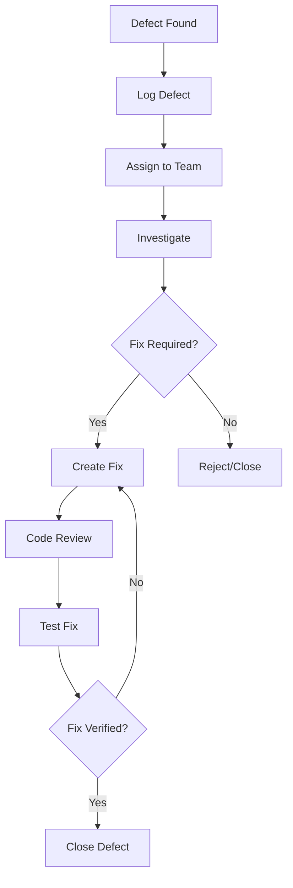

# Software Requirements Specification (SRS)

## Part 14B: Test Strategy & Test Cases

**Module:** Testing, Deployment & Operations (Part 14)
**Version:** 1.0.0
**Status:** Final / For Review
**Date:** 2026-06-30

---

## Chapter 1 – Overview

### Purpose

The Test Strategy & Test Cases module defines the comprehensive testing strategy and detailed test cases for the **[Platform Name]** platform. This encompasses test planning, test case design, test data management, test execution, defect management, and test reporting.

A well-defined test strategy ensures that all platform components are thoroughly tested, defects are identified early, and release quality is consistently high. This module provides the detailed test cases that validate every functional and non-functional requirement across the platform.

### Objectives

- Define a comprehensive test strategy
- Provide detailed test cases for all modules
- Establish test data management practices
- Define defect management processes
- Enable test execution and reporting
- Ensure traceability to requirements
- Support continuous testing in CI/CD

---

## Chapter 2 – Test Strategy Overview

### TESTSTRAT-001 Test Levels

| Level | Description | Environment | Priority |
| :--- | :--- | :--- | :--- |
| **Unit Testing** | Test individual components | Development | **Required** |
| **Integration Testing** | Test component interactions | Development/Staging | **Required** |
| **Contract Testing** | Test API contracts | Staging | **Required** |
| **Component Testing** | Test service components | Staging | **Required** |
| **System Testing** | Test complete system | Staging | **Required** |
| **End-to-End Testing** | Test complete workflows | Staging | **Required** |
| **Performance Testing** | Load, stress, soak tests | Staging | **Required** |
| **Security Testing** | SAST, DAST, penetration | Staging | **Required** |
| **User Acceptance Testing** | Business validation | Staging/UAT | **Required** |

### TESTSTRAT-002 Test Environments

| Environment | Purpose | Access | Priority |
| :--- | :--- | :--- | :--- |
| **Development** | Developer testing | Developers | **Required** |
| **Integration** | Integration testing | Development team | **Required** |
| **Staging** | Full system testing | QA, Development | **Required** |
| **Performance** | Load and performance testing | QA, DevOps | **Required** |
| **Security** | Security testing | Security team | **Required** |
| **UAT** | User acceptance testing | Business, QA | **Required** |
| **Production** | Live environment | Restricted | **Required** |

### TESTSTRAT-003 Test Data Management

| Requirement | Description | Priority |
| :--- | :--- | :--- |
| **Test Data Generation** | Generate realistic test data | **Required** |
| **Data Isolation** | Isolate test data from production | **Required** |
| **Data Masking** | Mask sensitive data | **Required** |
| **Data Refresh** | Refresh test data on demand | **Required** |
| **Data Versioning** | Version test data sets | **Required** |

---

## Chapter 3 – Test Case Design

### TESTSTRAT-004 Test Case Structure

| Field | Description | Priority |
| :--- | :--- | :--- |
| **Test Case ID** | Unique identifier | **Required** |
| **Test Case Name** | Descriptive name | **Required** |
| **Module** | Associated module | **Required** |
| **Requirement ID** | Linked requirement | **Required** |
| **Test Type** | Unit/Integration/E2E/etc. | **Required** |
| **Priority** | Critical/High/Medium/Low | **Required** |
| **Preconditions** | Required setup | **Required** |
| **Test Steps** | Step-by-step instructions | **Required** |
| **Test Data** | Required test data | **Required** |
| **Expected Results** | Expected outcome | **Required** |
| **Actual Results** | Actual outcome (execution) | **Required** |
| **Status** | Pass/Fail/Skip | **Required** |
| **Execution Date** | Date of execution | **Required** |
| **Executed By** | Tester name | **Required** |

### TESTSTRAT-005 Test Case Template

| Field | Value |
| :--- | :--- |
| **Test Case ID** | TC-CUS-001 |
| **Test Case Name** | Customer Registration - Email/Password |
| **Module** | Customer Management |
| **Requirement ID** | CUS-001 |
| **Test Type** | End-to-End |
| **Priority** | Critical |
| **Preconditions** | None |
| **Test Steps** | 1. Navigate to registration page 2. Enter first name, last name 3. Enter valid email address 4. Enter valid password (min 8 chars, mix) 5. Click Register 6. Check email for verification link 7. Click verification link |
| **Test Data** | firstName: "John" lastName: "Doe" email: "john.doe@example.com" password: "SecurePass123!" |
| **Expected Results** | Account created successfully, verification email received, account status becomes ACTIVE |
| **Actual Results** | |
| **Status** | |
| **Execution Date** | |
| **Executed By** | |

---

## Chapter 4 – Customer Module Test Cases

### TESTSTRAT-006 Customer Registration Test Cases

| ID | Test Name | Priority |
| :--- | :--- | :--- |
| **TC-CUS-001** | Register with valid email and password | **Critical** |
| **TC-CUS-002** | Register with phone OTP | **Critical** |
| **TC-CUS-003** | Register with Google OAuth | **High** |
| **TC-CUS-004** | Register with Facebook OAuth | **High** |
| **TC-CUS-005** | Register with Apple OAuth | **High** |
| **TC-CUS-006** | Register with duplicate email (error) | **High** |
| **TC-CUS-007** | Register with duplicate phone (error) | **High** |
| **TC-CUS-008** | Register with weak password (error) | **Medium** |
| **TC-CUS-009** | Guest checkout flow | **High** |

### TESTSTRAT-007 Customer Login Test Cases

| ID | Test Name | Priority |
| :--- | :--- | :--- |
| **TC-CUS-010** | Login with valid email/password | **Critical** |
| **TC-CUS-011** | Login with phone OTP | **Critical** |
| **TC-CUS-012** | Login with invalid password (error) | **High** |
| **TC-CUS-013** | Account locked after 5 failed attempts | **High** |
| **TC-CUS-014** | Login with social provider | **High** |
| **TC-CUS-015** | MFA verification during login | **High** |
| **TC-CUS-016** | Refresh token rotation | **High** |

### TESTSTRAT-008 Customer Profile Test Cases

| ID | Test Name | Priority |
| :--- | :--- | :--- |
| **TC-CUS-017** | View customer profile | **High** |
| **TC-CUS-018** | Update customer profile | **High** |
| **TC-CUS-019** | Upload profile avatar | **Medium** |
| **TC-CUS-020** | Change password | **High** |
| **TC-CUS-021** | Change email address | **High** |
| **TC-CUS-022** | Change phone number | **High** |
| **TC-CUS-023** | Add delivery address | **High** |
| **TC-CUS-024** | Update delivery address | **High** |
| **TC-CUS-025** | Delete delivery address | **High** |
| **TC-CUS-026** | Set default address | **High** |
| **TC-CUS-027** | View active sessions | **Medium** |
| **TC-CUS-028** | Revoke session | **Medium** |
| **TC-CUS-029** | Request data export (GDPR) | **High** |
| **TC-CUS-030** | Delete account (GDPR) | **High** |

---

## Chapter 5 – Merchant Module Test Cases

### TESTSTRAT-009 Merchant Registration Test Cases

| ID | Test Name | Priority |
| :--- | :--- | :--- |
| **TC-MER-001** | Start merchant application | **Critical** |
| **TC-MER-002** | Complete merchant application | **Critical** |
| **TC-MER-003** | Upload merchant documents | **Critical** |
| **TC-MER-004** | Validate document formats | **High** |
| **TC-MER-005** | Submit application for review | **Critical** |
| **TC-MER-006** | Admin approves merchant | **Critical** |
| **TC-MER-007** | Admin rejects merchant with reason | **High** |
| **TC-MER-008** | Admin requests additional information | **High** |
| **TC-MER-009** | Merchant receives welcome email | **High** |
| **TC-MER-010** | Merchant sets up store profile | **High** |
| **TC-MER-011** | Merchant adds bank account | **High** |
| **TC-MER-012** | Bank account verification | **High** |
| **TC-MER-013** | Admin suspends merchant | **High** |
| **TC-MER-014** | Admin reactivates merchant | **High** |

### TESTSTRAT-010 Merchant Dashboard Test Cases

| ID | Test Name | Priority |
| :--- | :--- | :--- |
| **TC-MER-015** | Merchant logs into dashboard | **Critical** |
| **TC-MER-016** | Dashboard displays KPIs | **Critical** |
| **TC-MER-017** | New order alert triggers | **Critical** |
| **TC-MER-018** | View order list | **Critical** |
| **TC-MER-019** | View order details | **Critical** |
| **TC-MER-020** | Confirm order | **Critical** |
| **TC-MER-021** | Mark order as preparing | **Critical** |
| **TC-MER-022** | Mark order as ready | **Critical** |
| **TC-MER-023** | Cancel order with reason | **High** |
| **TC-MER-024** | Update store status (open/closed) | **High** |

### TESTSTRAT-011 Menu Management Test Cases

| ID | Test Name | Priority |
| :--- | :--- | :--- |
| **TC-MER-025** | Add menu category | **Critical** |
| **TC-MER-026** | Update menu category | **High** |
| **TC-MER-027** | Delete menu category | **High** |
| **TC-MER-028** | Add menu item | **Critical** |
| **TC-MER-029** | Update menu item | **Critical** |
| **TC-MER-030** | Delete menu item | **High** |
| **TC-MER-031** | Add modifiers to item | **Critical** |
| **TC-MER-032** | Update modifiers | **High** |
| **TC-MER-033** | Delete modifiers | **High** |
| **TC-MER-034** | Toggle item availability | **High** |
| **TC-MER-035** | Import menu via CSV | **High** |
| **TC-MER-036** | Export menu to CSV | **Medium** |

---

## Chapter 6 – Driver Module Test Cases

### TESTSTRAT-012 Driver Registration Test Cases

| ID | Test Name | Priority |
| :--- | :--- | :--- |
| **TC-DRV-001** | Start driver application | **Critical** |
| **TC-DRV-002** | Complete driver application | **Critical** |
| **TC-DRV-003** | Upload driver documents | **Critical** |
| **TC-DRV-004** | Admin approves driver | **Critical** |
| **TC-DRV-005** | Admin rejects driver | **High** |
| **TC-DRV-006** | Driver completes training modules | **Critical** |
| **TC-DRV-007** | Driver completes onboarding checklist | **Critical** |
| **TC-DRV-008** | Driver account activated | **Critical** |

### TESTSTRAT-013 Driver App Test Cases

| ID | Test Name | Priority |
| :--- | :--- | :--- |
| **TC-DRV-009** | Driver logs into app | **Critical** |
| **TC-DRV-010** | Driver goes online | **Critical** |
| **TC-DRV-011** | Driver receives order notification | **Critical** |
| **TC-DRV-012** | Driver accepts order | **Critical** |
| **TC-DRV-013** | Driver declines order | **High** |
| **TC-DRV-014** | Order auto-declines after timer | **High** |
| **TC-DRV-015** | Driver navigates to merchant | **Critical** |
| **TC-DRV-016** | Driver confirms pickup | **Critical** |
| **TC-DRV-017** | Driver navigates to customer | **Critical** |
| **TC-DRV-018** | Driver confirms delivery with QR | **Critical** |
| **TC-DRV-019** | Driver confirms delivery with OTP | **Critical** |
| **TC-DRV-020** | Driver confirms delivery with photo | **Critical** |
| **TC-DRV-021** | GPS verification prevents invalid delivery | **High** |
| **TC-DRV-022** | Driver views earnings | **High** |
| **TC-DRV-023** | Driver views payout history | **High** |
| **TC-DRV-024** | Driver takes break | **Medium** |
| **TC-DRV-025** | Driver uses in-app chat | **High** |
| **TC-DRV-026** | Driver initiates masked call | **High** |

---

## Chapter 7 – Order Module Test Cases

### TESTSTRAT-014 Order Lifecycle Test Cases

| ID | Test Name | Priority |
| :--- | :--- | :--- |
| **TC-ORD-001** | Customer places order | **Critical** |
| **TC-ORD-002** | Order status is PENDING | **Critical** |
| **TC-ORD-003** | Merchant confirms order | **Critical** |
| **TC-ORD-004** | Order status transitions to CONFIRMED | **Critical** |
| **TC-ORD-005** | Merchant starts preparation | **Critical** |
| **TC-ORD-006** | Order status transitions to PREPARING | **Critical** |
| **TC-ORD-007** | Merchant marks order ready | **Critical** |
| **TC-ORD-008** | Order status transitions to READY | **Critical** |
| **TC-ORD-009** | Driver assigned to order | **Critical** |
| **TC-ORD-010** | Order status transitions to ASSIGNED | **Critical** |
| **TC-ORD-011** | Driver picks up order | **Critical** |
| **TC-ORD-012** | Order status transitions to PICKED_UP | **Critical** |
| **TC-ORD-013** | Driver en route | **Critical** |
| **TC-ORD-014** | Order status transitions to IN_TRANSIT | **Critical** |
| **TC-ORD-015** | Driver arrives | **Critical** |
| **TC-ORD-016** | Order status transitions to ARRIVING_SOON | **Critical** |
| **TC-ORD-017** | Delivery completed | **Critical** |
| **TC-ORD-018** | Order status transitions to DELIVERED | **Critical** |

### TESTSTRAT-015 Order Exception Test Cases

| ID | Test Name | Priority |
| :--- | :--- | :--- |
| **TC-ORD-019** | Customer cancels before confirmation | **High** |
| **TC-ORD-020** | Customer cancels after confirmation (approval required) | **High** |
| **TC-ORD-021** | Merchant cancels order | **High** |
| **TC-ORD-022** | Delivery failure - customer unavailable | **High** |
| **TC-ORD-023** | Delivery failure - wrong address | **High** |
| **TC-ORD-024** | Delivery failure - order damaged | **High** |
| **TC-ORD-025** | Refund processed for cancelled order | **High** |
| **TC-ORD-026** | Refund processed for failed delivery | **High** |

---

## Chapter 8 – Payment Module Test Cases

### TESTSTRAT-016 Payment Test Cases

| ID | Test Name | Priority |
| :--- | :--- | :--- |
| **TC-PAY-001** | Add credit card payment method | **Critical** |
| **TC-PAY-002** | Add invalid card (validation error) | **High** |
| **TC-PAY-003** | Set default payment method | **High** |
| **TC-PAY-004** | Remove payment method | **High** |
| **TC-PAY-005** | Pay with saved card | **Critical** |
| **TC-PAY-006** | Pay with new card | **Critical** |
| **TC-PAY-007** | Pay with digital wallet | **Critical** |
| **TC-PAY-008** | Pay with COD | **Critical** |
| **TC-PAY-009** | Payment authorization fails | **High** |
| **TC-PAY-010** | Request full refund | **High** |
| **TC-PAY-011** | Request partial refund | **High** |
| **TC-PAY-012** | Wallet top-up | **High** |
| **TC-PAY-013** | Wallet payment | **High** |
| **TC-PAY-014** | View wallet transaction history | **Medium** |
| **TC-PAY-015** | Idempotency prevents duplicate payment | **High** |

---

## Chapter 9 – Dispatch Module Test Cases

### TESTSTRAT-017 Dispatch Test Cases

| ID | Test Name | Priority |
| :--- | :--- | :--- |
| **TC-DSP-001** | Order enters assignment queue | **Critical** |
| **TC-DSP-002** | Driver availability updated in real-time | **Critical** |
| **TC-DSP-003** | Assignment algorithm selects nearest driver | **Critical** |
| **TC-DSP-004** | Assignment composite score calculation | **Critical** |
| **TC-DSP-005** | Driver accepts offer | **Critical** |
| **TC-DSP-006** | Driver declines offer | **High** |
| **TC-DSP-007** | Order auto-declines after timer | **High** |
| **TC-DSP-008** | Batch order creation | **High** |
| **TC-DSP-009** | Batch route optimization | **High** |
| **TC-DSP-010** | Dynamic reassignment on driver drop-out | **High** |
| **TC-DSP-011** | ETA calculation with traffic | **High** |
| **TC-DSP-012** | Surge pricing applied during peak demand | **High** |

---

## Chapter 10 – Finance Module Test Cases

### TESTSTRAT-018 Finance Test Cases

| ID | Test Name | Priority |
| :--- | :--- | :--- |
| **TC-FIN-001** | Merchant settlement calculation | **Critical** |
| **TC-FIN-002** | Merchant settlement with multiple orders | **Critical** |
| **TC-FIN-003** | Driver payout calculation | **Critical** |
| **TC-FIN-004** | Driver payout with tips and bonuses | **Critical** |
| **TC-FIN-005** | Commission calculation (percentage) | **Critical** |
| **TC-FIN-006** | Commission calculation (tiered) | **High** |
| **TC-FIN-007** | Service fee calculation | **High** |
| **TC-FIN-008** | Tax calculation | **High** |
| **TC-FIN-009** | Invoice generation | **High** |
| **TC-FIN-010** | Invoice download as PDF | **High** |
| **TC-FIN-011** | Reconciliation with gateway | **High** |
| **TC-FIN-012** | Payment gateway reconciliation | **High** |
| **TC-FIN-013** | Discrepancy identification | **High** |

---

## Chapter 11 – Test Data Management

### TESTSTRAT-019 Test Data Sets

| Data Set | Description | Priority |
| :--- | :--- | :--- |
| **Customer Data** | Realistic customer profiles | **Required** |
| **Merchant Data** | Realistic merchant profiles | **Required** |
| **Driver Data** | Realistic driver profiles | **Required** |
| **Order Data** | Complete order history | **Required** |
| **Product Data** | Realistic product catalog | **Required** |
| **Location Data** | Geospatial test data | **Required** |
| **Payment Data** | Simulated payment data | **Required** |
| **Settlement Data** | Financial test data | **Required** |

---

## Chapter 12 – Defect Management

### TESTSTRAT-020 Defect Severity Levels

| Severity | Description | Priority |
| :--- | :--- | :--- |
| **Critical** | System crash, data loss, security breach | **Required** |
| **High** | Major feature broken, severe impact | **Required** |
| **Medium** | Feature broken with workaround | **Required** |
| **Low** | Minor issue, cosmetic problem | **Required** |

### TESTSTRAT-021 Defect Workflow

---

## Chapter 13 – Database Tables

### test_cases

| Column | Type | Constraints | Description |
| :--- | :--- | :--- | :--- |
| `test_case_id` | UUID | PRIMARY KEY | Unique identifier |
| `test_case_name` | VARCHAR(255) | NOT NULL | Test case name |
| `module` | VARCHAR(50) | NOT NULL | Module name |
| `requirement_id` | VARCHAR(50) | | Requirement ID |
| `test_type` | VARCHAR(20) | NOT NULL | UNIT/INTEGRATION/E2E |
| `priority` | VARCHAR(20) | NOT NULL | CRITICAL/HIGH/MEDIUM/LOW |
| `preconditions` | TEXT | | Preconditions |
| `test_steps` | TEXT | NOT NULL | Test steps |
| `test_data` | JSONB | | Required test data |
| `expected_results` | TEXT | NOT NULL | Expected results |
| `actual_results` | TEXT | | Actual results |
| `status` | VARCHAR(20) | DEFAULT 'PENDING' | PENDING/PASSED/FAILED/SKIPPED |
| `execution_date` | DATE | | Execution date |
| `executed_by` | UUID | | Tester identifier |
| `created_at` | TIMESTAMP | DEFAULT NOW() | Creation timestamp |
| `updated_at` | TIMESTAMP | DEFAULT NOW() | Last update timestamp |

### test_executions

| Column | Type | Constraints | Description |
| :--- | :--- | :--- | :--- |
| `execution_id` | UUID | PRIMARY KEY | Unique identifier |
| `test_case_id` | UUID | FOREIGN KEY (test_cases.test_case_id) | Associated test case |
| `status` | VARCHAR(20) | NOT NULL | PASSED/FAILED/SKIPPED |
| `actual_results` | TEXT | | Actual results |
| `duration_ms` | INTEGER | | Execution duration |
| `executed_by` | UUID | | Tester identifier |
| `execution_date` | TIMESTAMP | NOT NULL | Execution timestamp |
| `created_at` | TIMESTAMP | DEFAULT NOW() | Creation timestamp |

### defects

| Column | Type | Constraints | Description |
| :--- | :--- | :--- | :--- |
| `defect_id` | UUID | PRIMARY KEY | Unique identifier |
| `title` | VARCHAR(255) | NOT NULL | Defect title |
| `description` | TEXT | NOT NULL | Defect description |
| `severity` | VARCHAR(20) | NOT NULL | CRITICAL/HIGH/MEDIUM/LOW |
| `status` | VARCHAR(20) | DEFAULT 'OPEN' | OPEN/IN_PROGRESS/FIXED/VERIFIED/CLOSED/REJECTED |
| `reported_by` | UUID | | Reporter identifier |
| `assigned_to` | UUID | | Assignee identifier |
| `test_case_id` | UUID | | Associated test case |
| `steps_to_reproduce` | TEXT | | Steps to reproduce |
| `environment` | VARCHAR(50) | | Environment where found |
| `fixed_at` | TIMESTAMP` | | Fix timestamp |
| `verified_at` | TIMESTAMP` | | Verification timestamp |
| `created_at` | TIMESTAMP | DEFAULT NOW() | Creation timestamp |
| `updated_at` | TIMESTAMP | DEFAULT NOW() | Last update timestamp |

---

## Chapter 14 – Acceptance Tests

| Test ID | Test Description | Priority |
| :--- | :--- | :--- |
| **TEST-TS-001** | All customer registration test cases pass. | **High** |
| **TEST-TS-002** | All customer login test cases pass. | **High** |
| **TEST-TS-003** | All customer profile test cases pass. | **High** |
| **TEST-TS-004** | All merchant registration test cases pass. | **High** |
| **TEST-TS-005** | All merchant dashboard test cases pass. | **High** |
| **TEST-TS-006** | All menu management test cases pass. | **High** |
| **TEST-TS-007** | All driver registration test cases pass. | **High** |
| **TEST-TS-008** | All driver app test cases pass. | **High** |
| **TEST-TS-009** | All order lifecycle test cases pass. | **High** |
| **TEST-TS-010** | All order exception test cases pass. | **High** |
| **TEST-TS-011** | All payment test cases pass. | **High** |
| **TEST-TS-012** | All dispatch test cases pass. | **High** |
| **TEST-TS-013** | All finance test cases pass. | **High** |
| **TEST-TS-014** | Test data generation works correctly. | **High** |
| **TEST-TS-015** | Test data isolation works correctly. | **High** |
| **TEST-TS-016** | Defect logging works correctly. | **High** |
| **TEST-TS-017** | Defect assignment works correctly. | **High** |
| **TEST-TS-018** | Defect verification works correctly. | **High** |
| **TEST-TS-019** | Test execution reporting works correctly. | **High** |
| **TEST-TS-020** | Test traceability to requirements works. | **High** |

---

## Chapter 15 – Summary

This document establishes the complete test strategy and test cases for the **[Platform Name]** platform. Key takeaways:

- **Comprehensive Test Strategy:** Defined test levels, environments, and data management practices.
- **Detailed Test Cases:** Customer, merchant, driver, order, payment, dispatch, and finance module test cases.
- **Test Case Design:** Structured test case template with ID, name, steps, data, and expected results.
- **Test Data Management:** Realistic test data sets with isolation, masking, and refresh capabilities.
- **Defect Management:** Severity levels and defect workflow from discovery to closure.
- **Traceability:** Test cases traceable to requirements.

The test strategy and test cases module ensures comprehensive testing coverage across all platform components.

---

**Next Document:**

`Part_14C_CI_CD_Pipelines.md`

*(This builds on the test strategy to define CI/CD pipeline capabilities.)*