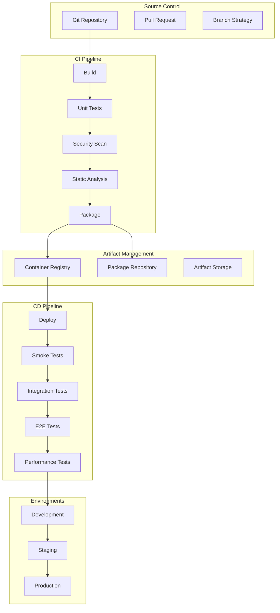
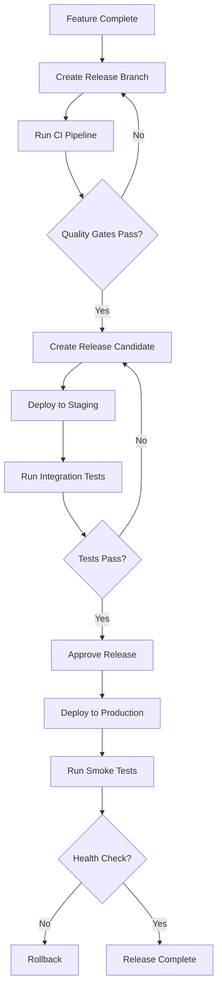

# Software Requirements Specification (SRS)

## Part 14C: CI/CD Pipelines

**Module:** Testing, Deployment & Operations (Part 14)
**Version:** 1.0.0
**Status:** Final / For Review
**Date:** 2026-06-30

---

## Chapter 1 – Overview

### Purpose

The CI/CD Pipelines module defines the comprehensive continuous integration and continuous deployment capabilities for the **[Platform Name]** platform. This encompasses source code management, build automation, test execution, artifact management, deployment automation, release management, and pipeline governance.

CI/CD pipelines are the engine of modern software delivery. They automate the build, test, and deployment process, enabling fast, reliable, and frequent releases. This module ensures that code changes flow smoothly from development to production with quality gates, automated testing, and rollback capabilities.

### Objectives

- Automate build, test, and deployment processes
- Enforce quality gates and security checks
- Enable fast, reliable releases
- Support multiple deployment strategies
- Provide pipeline visibility and governance
- Enable rollback and recovery
- Support continuous improvement

---

## Chapter 2 – Architecture

### PIPELINE-001 CI/CD Architecture

### PIPELINE-002 Pipeline Components

| Component | Description | Priority |
| :--- | :--- | :--- |
| **Source Control** | Git-based source code management | **Required** |
| **CI Pipeline** | Build, test, and analyze code | **Required** |
| **Artifact Registry** | Store build artifacts | **Required** |
| **CD Pipeline** | Deploy to environments | **Required** |
| **Quality Gates** | Automated quality checks | **Required** |
| **Secrets Management** | Secure credential management | **Required** |
| **Monitoring** | Pipeline execution monitoring | **Required** |
| **Notifications** | Pipeline status notifications | **Required** |

---

## Chapter 3 – CI Pipeline

### PIPELINE-003 CI Pipeline Stages

| Stage | Description | Priority |
| :--- | :--- | :--- |
| **Code Checkout** | Fetch source code from repository | **Required** |
| **Dependency Installation** | Install project dependencies | **Required** |
| **Linting** | Static code analysis | **Required** |
| **Unit Tests** | Execute unit tests | **Required** |
| **Test Coverage** | Report test coverage | **Required** |
| **Security Scan** | SAST, dependency scanning | **Required** |
| **Secrets Scan** | Scan for exposed secrets | **Required** |
| **Build** | Compile and build artifacts | **Required** |
| **Container Build** | Build Docker images | **Required** |
| **Container Scan** | Scan container images | **Required** |
| **Package** | Package artifacts | **Required** |
| **Artifact Upload** | Upload to artifact registry | **Required** |

### PIPELINE-004 Build Triggers

| Trigger | Description | Priority |
| :--- | :--- | :--- |
| **Pull Request** | Run on pull request creation | **Required** |
| **Push to Main** | Run on merge to main branch | **Required** |
| **Push to Release Branch** | Run on release branch updates | **Required** |
| **Scheduled** | Scheduled builds (daily) | **Required** |
| **Manual** | Manual trigger | **Required** |

### PIPELINE-005 Build Matrix

| Component | Build Time | Artifact Type | Priority |
| :--- | :--- | :--- | :--- |
| **Backend Services** | < 5 min | Docker Image | **Required** |
| **Frontend Application** | < 3 min | Static Assets | **Required** |
| **Mobile Apps** | < 10 min | APK/IPA | **Required** |
| **Infrastructure** | < 5 min | Terraform Plan | **Required** |
| **Documentation** | < 2 min | Static Site | **Required** |

### PIPELINE-006 Pipeline Data Model

| Column | Type | Constraints | Description |
| :--- | :--- | :--- | :--- |
| `pipeline_id` | UUID | PRIMARY KEY | Unique identifier |
| `pipeline_name` | VARCHAR(100) | NOT NULL | Pipeline name |
| `pipeline_type` | VARCHAR(20) | NOT NULL | CI/CD |
| `commit_id` | VARCHAR(40) | | Git commit SHA |
| `branch_name` | VARCHAR(100) | | Branch name |
| `status` | VARCHAR(20) | DEFAULT 'PENDING' | PENDING/RUNNING/PASSED/FAILED/CANCELLED |
| `triggered_by` | UUID | | Trigger user |
| `duration_seconds` | INTEGER | | Pipeline duration |
| `started_at` | TIMESTAMP | | Start timestamp |
| `completed_at` | TIMESTAMP` | | Completion timestamp |
| `created_at` | TIMESTAMP | DEFAULT NOW() | Creation timestamp |
| `updated_at` | TIMESTAMP | DEFAULT NOW() | Last update timestamp |

---

## Chapter 4 – Quality Gates

### PIPELINE-007 Quality Gates

| Gate | Criteria | Action on Fail | Priority |
| :--- | :--- | :--- | :--- |
| **Lint** | No linting errors | Fail pipeline | **Required** |
| **Unit Tests** | > 90% coverage, all passing | Fail pipeline | **Required** |
| **Security Scan** | No critical/high vulnerabilities | Fail pipeline | **Required** |
| **Secret Scan** | No secrets exposed | Fail pipeline | **Required** |
| **Container Scan** | No critical/high vulnerabilities | Fail pipeline | **Required** |
| **Integration Tests** | All passing | Fail pipeline | **Required** |
| **E2E Tests** | All passing | Fail pipeline | **Required** |
| **Performance Tests** | Meet SLA targets | Fail pipeline | **Required** |

### PIPELINE-008 Quality Gate Data Model

| Column | Type | Constraints | Description |
| :--- | :--- | :--- | :--- |
| `gate_id` | UUID | PRIMARY KEY | Unique identifier |
| `pipeline_id` | UUID | FOREIGN KEY (pipeline_runs.pipeline_id) | Associated pipeline |
| `gate_name` | VARCHAR(100) | NOT NULL | Gate name |
| `status` | VARCHAR(20) | NOT NULL | PASSED/FAILED |
| `details` | JSONB | | Gate details |
| `duration_ms` | INTEGER | | Gate execution duration |
| `executed_at` | TIMESTAMP | NOT NULL | Execution timestamp |
| `created_at` | TIMESTAMP | DEFAULT NOW() | Creation timestamp |
| `updated_at` | TIMESTAMP | DEFAULT NOW() | Last update timestamp |

---

## Chapter 5 – CD Pipeline

### PIPELINE-009 CD Pipeline Stages

| Stage | Description | Priority |
| :--- | :--- | :--- | :--- |
| **Artifact Download** | Download artifacts from registry | **Required** |
| **Deploy to Dev** | Deploy to development environment | **Required** |
| **Smoke Tests** | Basic sanity tests | **Required** |
| **Integration Tests** | Service integration tests | **Required** |
| **E2E Tests** | End-to-end tests | **Required** |
| **Deploy to Staging** | Deploy to staging environment | **Required** |
| **Performance Tests** | Load and performance tests | **Required** |
| **Security Tests** | DAST security tests | **Required** |
| **Deploy to Production** | Deploy to production environment | **Required** |
| **Canary Deployment** | Gradual production rollout | **Required** |

### PIPELINE-010 Deployment Strategies

| Strategy | Description | Priority |
| :--- | :--- | :--- |
| **Rolling Update** | Gradual instance replacement | **Required** |
| **Blue/Green** | Zero-downtime switch | **Required** |
| **Canary** | Gradual traffic shift | **Required** |
| **A/B Testing** | Traffic split for testing | **Required** |
| **Feature Flags** | Controlled feature rollout | **Required** |
| **Rollback** | Immediate rollback on failure | **Required** |

### PIPELINE-011 Deployment Data Model

| Column | Type | Constraints | Description |
| :--- | :--- | :--- | :--- |
| `deployment_id` | UUID | PRIMARY KEY | Unique identifier |
| `pipeline_id` | UUID | FOREIGN KEY (pipeline_runs.pipeline_id) | Associated pipeline |
| `environment` | VARCHAR(20) | NOT NULL | DEV/STAGING/PRODUCTION |
| `strategy` | VARCHAR(20) | NOT NULL | ROLLING/BLUE_GREEN/CANARY/A_B_TESTING |
| `version` | VARCHAR(50) | NOT NULL | Deployment version |
| `status` | VARCHAR(20) | DEFAULT 'PENDING' | PENDING/RUNNING/SUCCESS/FAILED/ROLLBACK |
| `duration_seconds` | INTEGER` | | Deployment duration |
| `started_at` | TIMESTAMP | | Start timestamp |
| `completed_at` | TIMESTAMP` | | Completion timestamp |
| `rollback_at` | TIMESTAMP` | | Rollback timestamp |
| `created_at` | TIMESTAMP | DEFAULT NOW() | Creation timestamp |
| `updated_at` | TIMESTAMP | DEFAULT NOW() | Last update timestamp |

---

## Chapter 6 – Release Management

### PIPELINE-012 Release Types

| Type | Description | Priority |
| :--- | :--- | :--- |
| **Major** | Breaking changes, new major version | **Required** |
| **Minor** | New features, no breaking changes | **Required** |
| **Patch** | Bug fixes, no breaking changes | **Required** |
| **Hotfix** | Emergency production fix | **Required** |
| **Rollback** | Revert to previous version | **Required** |

### PIPELINE-013 Release Process

### PIPELINE-014 Release Data Model

| Column | Type | Constraints | Description |
| :--- | :--- | :--- | :--- |
| `release_id` | UUID | PRIMARY KEY | Unique identifier |
| `release_version` | VARCHAR(20) | NOT NULL | Version number |
| `release_type` | VARCHAR(20) | NOT NULL | MAJOR/MINOR/PATCH/HOTFIX/ROLLBACK |
| `changelog` | TEXT | | Release changelog |
| `status` | VARCHAR(20) | DEFAULT 'DRAFT' | DRAFT/READY/APPROVED/RELEASED/ROLLBACK |
| `approved_by` | UUID | | Approver identifier |
| `approved_at` | TIMESTAMP | | Approval timestamp |
| `released_at` | TIMESTAMP | | Release timestamp |
| `created_by` | UUID | | Creator identifier |
| `created_at` | TIMESTAMP | DEFAULT NOW() | Creation timestamp |
| `updated_at` | TIMESTAMP | DEFAULT NOW() | Last update timestamp |

---

## Chapter 7 – Pipeline Governance

### PIPELINE-015 Governance Controls

| Control | Description | Priority |
| :--- | :--- | :--- |
| **Approval Gates** | Manual approval for production deployment | **Required** |
| **Change Requests** | Formal change request process | **Required** |
| **Audit Logs** | Full pipeline audit trail | **Required** |
| **Access Control** | Role-based pipeline access | **Required** |
| **Compliance Checks** | Regulatory compliance validation | **Required** |
| **Release Calendar** | Scheduled release windows | **Required** |
| **Incident Management** | Integration with incident management | **Required** |

### PIPELINE-016 Approval Data Model

| Column | Type | Constraints | Description |
| :--- | :--- | :--- | :--- |
| `approval_id` | UUID | PRIMARY KEY | Unique identifier |
| `pipeline_id` | UUID | FOREIGN KEY (pipeline_runs.pipeline_id) | Associated pipeline |
| `stage` | VARCHAR(20) | NOT NULL | DEPLOYMENT/RELEASE/HOTFIX |
| `approver_id` | UUID | NOT NULL | Approver identifier |
| `status` | VARCHAR(20) | DEFAULT 'PENDING' | PENDING/APPROVED/REJECTED |
| `comment` | TEXT | | Approval comment |
| `approved_at` | TIMESTAMP | | Approval timestamp |
| `created_at` | TIMESTAMP | DEFAULT NOW() | Creation timestamp |
| `updated_at` | TIMESTAMP | DEFAULT NOW() | Last update timestamp |

---

## Chapter 8 – Database Tables

### pipeline_runs

| Column | Type | Constraints | Description |
| :--- | :--- | :--- | :--- |
| `pipeline_id` | UUID | PRIMARY KEY | Unique identifier |
| `pipeline_name` | VARCHAR(100) | NOT NULL | Pipeline name |
| `pipeline_type` | VARCHAR(20) | NOT NULL | CI/CD |
| `commit_id` | VARCHAR(40) | | Git commit SHA |
| `branch_name` | VARCHAR(100) | | Branch name |
| `status` | VARCHAR(20) | DEFAULT 'PENDING' | PENDING/RUNNING/PASSED/FAILED/CANCELLED |
| `triggered_by` | UUID | | Trigger user |
| `duration_seconds` | INTEGER | | Pipeline duration |
| `started_at` | TIMESTAMP | | Start timestamp |
| `completed_at` | TIMESTAMP | | Completion timestamp |
| `created_at` | TIMESTAMP | DEFAULT NOW() | Creation timestamp |
| `updated_at` | TIMESTAMP | DEFAULT NOW() | Last update timestamp |

### pipeline_stages

| Column | Type | Constraints | Description |
| :--- | :--- | :--- | :--- |
| `stage_id` | UUID | PRIMARY KEY | Unique identifier |
| `pipeline_id` | UUID | FOREIGN KEY (pipeline_runs.pipeline_id) | Associated pipeline |
| `stage_name` | VARCHAR(100) | NOT NULL | Stage name |
| `stage_order` | INTEGER | NOT NULL | Stage order |
| `status` | VARCHAR(20) | DEFAULT 'PENDING' | PENDING/RUNNING/PASSED/FAILED/SKIPPED |
| `duration_seconds` | INTEGER` | | Stage duration |
| `started_at` | TIMESTAMP | | Start timestamp |
| `completed_at` | TIMESTAMP | | Completion timestamp |
| `created_at` | TIMESTAMP | DEFAULT NOW() | Creation timestamp |
| `updated_at` | TIMESTAMP | DEFAULT NOW() | Last update timestamp |

### quality_gates

| Column | Type | Constraints | Description |
| :--- | :--- | :--- | :--- |
| `gate_id` | UUID | PRIMARY KEY | Unique identifier |
| `pipeline_id` | UUID | FOREIGN KEY (pipeline_runs.pipeline_id) | Associated pipeline |
| `gate_name` | VARCHAR(100) | NOT NULL | Gate name |
| `status` | VARCHAR(20) | NOT NULL | PASSED/FAILED |
| `details` | JSONB | | Gate details |
| `duration_ms` | INTEGER | | Gate execution duration |
| `executed_at` | TIMESTAMP | NOT NULL | Execution timestamp |
| `created_at` | TIMESTAMP | DEFAULT NOW() | Creation timestamp |
| `updated_at` | TIMESTAMP | DEFAULT NOW() | Last update timestamp |

### deployments

| Column | Type | Constraints | Description |
| :--- | :--- | :--- | :--- |
| `deployment_id` | UUID | PRIMARY KEY | Unique identifier |
| `pipeline_id` | UUID | FOREIGN KEY (pipeline_runs.pipeline_id) | Associated pipeline |
| `environment` | VARCHAR(20) | NOT NULL | DEV/STAGING/PRODUCTION |
| `strategy` | VARCHAR(20) | NOT NULL | ROLLING/BLUE_GREEN/CANARY/A_B_TESTING |
| `version` | VARCHAR(50) | NOT NULL | Deployment version |
| `status` | VARCHAR(20) | DEFAULT 'PENDING' | PENDING/RUNNING/SUCCESS/FAILED/ROLLBACK |
| `duration_seconds` | INTEGER` | | Deployment duration |
| `started_at` | TIMESTAMP | | Start timestamp |
| `completed_at` | TIMESTAMP | | Completion timestamp |
| `rollback_at` | TIMESTAMP` | | Rollback timestamp |
| `created_at` | TIMESTAMP | DEFAULT NOW() | Creation timestamp |
| `updated_at` | TIMESTAMP | DEFAULT NOW() | Last update timestamp |

### releases

| Column | Type | Constraints | Description |
| :--- | :--- | :--- | :--- |
| `release_id` | UUID | PRIMARY KEY | Unique identifier |
| `release_version` | VARCHAR(20) | NOT NULL | Version number |
| `release_type` | VARCHAR(20) | NOT NULL | MAJOR/MINOR/PATCH/HOTFIX/ROLLBACK |
| `changelog` | TEXT | | Release changelog |
| `status` | VARCHAR(20) | DEFAULT 'DRAFT' | DRAFT/READY/APPROVED/RELEASED/ROLLBACK |
| `approved_by` | UUID | | Approver identifier |
| `approved_at` | TIMESTAMP | | Approval timestamp |
| `released_at` | TIMESTAMP | | Release timestamp |
| `created_by` | UUID | | Creator identifier |
| `created_at` | TIMESTAMP | DEFAULT NOW() | Creation timestamp |
| `updated_at` | TIMESTAMP | DEFAULT NOW() | Last update timestamp |

### pipeline_approvals

| Column | Type | Constraints | Description |
| :--- | :--- | :--- | :--- |
| `approval_id` | UUID | PRIMARY KEY | Unique identifier |
| `pipeline_id` | UUID | FOREIGN KEY (pipeline_runs.pipeline_id) | Associated pipeline |
| `stage` | VARCHAR(20) | NOT NULL | DEPLOYMENT/RELEASE/HOTFIX |
| `approver_id` | UUID | NOT NULL | Approver identifier |
| `status` | VARCHAR(20) | DEFAULT 'PENDING' | PENDING/APPROVED/REJECTED |
| `comment` | TEXT | | Approval comment |
| `approved_at` | TIMESTAMP | | Approval timestamp |
| `created_at` | TIMESTAMP | DEFAULT NOW() | Creation timestamp |
| `updated_at` | TIMESTAMP | DEFAULT NOW() | Last update timestamp |

---

## Chapter 9 – REST APIs

### Pipeline APIs

| Method | Endpoint | Description |
| :--- | :--- | :--- |
| `GET` | `/api/v1/pipelines` | List pipeline runs |
| `GET` | `/api/v1/pipelines/{id}` | Get pipeline details |
| `GET` | `/api/v1/pipelines/{id}/stages` | Get pipeline stages |
| `POST` | `/api/v1/pipelines/trigger` | Trigger pipeline |
| `POST` | `/api/v1/pipelines/{id}/cancel` | Cancel pipeline |
| `GET` | `/api/v1/pipelines/status` | Get pipeline status |

### Deployment APIs

| Method | Endpoint | Description |
| :--- | :--- | :--- |
| `GET` | `/api/v1/deployments` | List deployments |
| `GET` | `/api/v1/deployments/{id}` | Get deployment details |
| `POST` | `/api/v1/deployments` | Create deployment |
| `POST` | `/api/v1/deployments/{id}/rollback` | Rollback deployment |
| `GET` | `/api/v1/deployments/{id}/status` | Get deployment status |

### Release APIs

| Method | Endpoint | Description |
| :--- | :--- | :--- |
| `GET` | `/api/v1/releases` | List releases |
| `GET` | `/api/v1/releases/{id}` | Get release details |
| `POST` | `/api/v1/releases` | Create release |
| `PUT` | `/api/v1/releases/{id}` | Update release |
| `POST` | `/api/v1/releases/{id}/approve` | Approve release |
| `POST` | `/api/v1/releases/{id}/release` | Execute release |

### Quality Gate APIs

| Method | Endpoint | Description |
| :--- | :--- | :--- |
| `GET` | `/api/v1/quality-gates` | List quality gates |
| `GET` | `/api/v1/quality-gates/{id}` | Get quality gate details |
| `GET` | `/api/v1/quality-gates/pipeline/{id}` | Get pipeline quality gates |

### Approval APIs

| Method | Endpoint | Description |
| :--- | :--- | :--- |
| `GET` | `/api/v1/approvals` | List approvals |
| `GET` | `/api/v1/approvals/{id}` | Get approval details |
| `PUT` | `/api/v1/approvals/{id}/approve` | Approve |
| `PUT` | `/api/v1/approvals/{id}/reject` | Reject |

---

## Chapter 10 – Business Rules

| Rule ID | Rule Description | Priority |
| :--- | :--- | :--- |
| **BR-CICD-001** | All quality gates must pass before deployment. | **High** |
| **BR-CICD-002** | Production deployment requires manual approval. | **High** |
| **BR-CICD-003** | Build must pass within 10 minutes. | **High** |
| **BR-CICD-004** | Unit test coverage must be > 90%. | **High** |
| **BR-CICD-005** | Security scans must have zero critical/high findings. | **High** |
| **BR-CICD-006** | Rollback must complete within 5 minutes. | **High** |
| **BR-CICD-007** | Blue/Green deployment must have zero downtime. | **High** |
| **BR-CICD-008** | Canary deployment must have successful health checks. | **High** |
| **BR-CICD-009** | Pipeline logs must be retained for 90 days. | **High** |
| **BR-CICD-010** | Production deployment must be scheduled during maintenance window. | **High** |

---

## Chapter 11 – Acceptance Tests

| Test ID | Test Description | Priority |
| :--- | :--- | :--- |
| **TEST-CICD-001** | CI pipeline triggers on pull request. | **High** |
| **TEST-CICD-002** | CI pipeline triggers on merge to main. | **High** |
| **TEST-CICD-003** | All CI stages complete successfully. | **High** |
| **TEST-CICD-004** | Build artifacts are uploaded to registry. | **High** |
| **TEST-CICD-005** | Quality gates pass on successful build. | **High** |
| **TEST-CICD-006** | Quality gates fail on test failure. | **High** |
| **TEST-CICD-007** | CD pipeline deploys to development. | **High** |
| **TEST-CICD-008** | CD pipeline deploys to staging. | **High** |
| **TEST-CICD-009** | CD pipeline deploys to production (with approval). | **High** |
| **TEST-CICD-010** | Blue/Green deployment works correctly. | **High** |
| **TEST-CICD-011** | Canary deployment works correctly. | **High** |
| **TEST-CICD-012** | Rollback works correctly. | **High** |
| **TEST-CICD-013** | Approval gate blocks production deployment. | **High** |
| **TEST-CICD-014** | Release creation and approval work. | **High** |
| **TEST-CICD-015** | Pipeline status is reported correctly. | **High** |
| **TEST-CICD-016** | Pipeline logs are available. | **High** |
| **TEST-CICD-017** | Hotfix pipeline works correctly. | **High** |
| **TEST-CICD-018** | Feature flag rollout works correctly. | **High** |
| **TEST-CICD-019** | A/B testing traffic split works correctly. | **High** |
| **TEST-CICD-020** | Pipeline execution time meets SLA. | **High** |

---

## Chapter 12 – Traceability Matrix

| Requirement | Database Table | API Endpoint(s) | Acceptance Test |
| :--- | :--- | :--- | :--- |
| PIPELINE-003 | pipeline_runs | GET /api/v1/pipelines | TEST-CICD-001, TEST-CICD-002, TEST-CICD-003, TEST-CICD-004 |
| PIPELINE-007 | quality_gates | GET /api/v1/quality-gates | TEST-CICD-005, TEST-CICD-006 |
| PIPELINE-009 | deployments | GET /api/v1/deployments | TEST-CICD-007, TEST-CICD-008, TEST-CICD-009 |
| PIPELINE-010 | deployments | GET /api/v1/deployments/{id} | TEST-CICD-010, TEST-CICD-011, TEST-CICD-012 |
| PIPELINE-015 | pipeline_approvals | GET /api/v1/approvals | TEST-CICD-013 |
| PIPELINE-012 | releases | GET /api/v1/releases | TEST-CICD-014 |
| PIPELINE-002 | pipeline_runs | GET /api/v1/pipelines/status | TEST-CICD-015 |
| PIPELINE-002 | pipeline_runs | GET /api/v1/pipelines/{id} | TEST-CICD-016 |
| PIPELINE-012 | releases | POST /api/v1/releases | TEST-CICD-017 |
| PIPELINE-010 | deployments | POST /api/v1/deployments | TEST-CICD-018, TEST-CICD-019 |
| PIPELINE-003 | pipeline_runs | GET /api/v1/pipelines/{id}/stages | TEST-CICD-020 |

---

## Chapter 13 – Summary

This document establishes the complete CI/CD pipeline capability for the **[Platform Name]** platform. Key takeaways:

- **Comprehensive CI Pipeline:** Code checkout, dependency installation, linting, unit tests, security scans, build, container build, and artifact upload.
- **Quality Gates:** Lint, unit tests, security scans, secret scans, container scans, integration tests, E2E tests, and performance tests.
- **CD Pipeline:** Artifact download, deployment to Dev/Staging/Production, smoke tests, integration tests, E2E tests, performance tests, and security tests.
- **Deployment Strategies:** Rolling update, blue/green, canary, A/B testing, feature flags, and rollback.
- **Release Management:** Major, minor, patch, hotfix, and rollback releases with approval workflow.
- **Pipeline Governance:** Approval gates, change requests, audit logs, access control, compliance checks, and release calendar.
- **Automated Testing:** Integration with all test types to ensure quality before deployment.
- **Observability:** Pipeline status, logs, and notifications.

The CI/CD pipelines module enables fast, reliable, and automated software delivery with quality assurance at every stage.

---

**Next Document:**

`Part_14D_Infrastructure_Code.md`

*(This builds on CI/CD pipelines to define infrastructure as code capabilities.)*