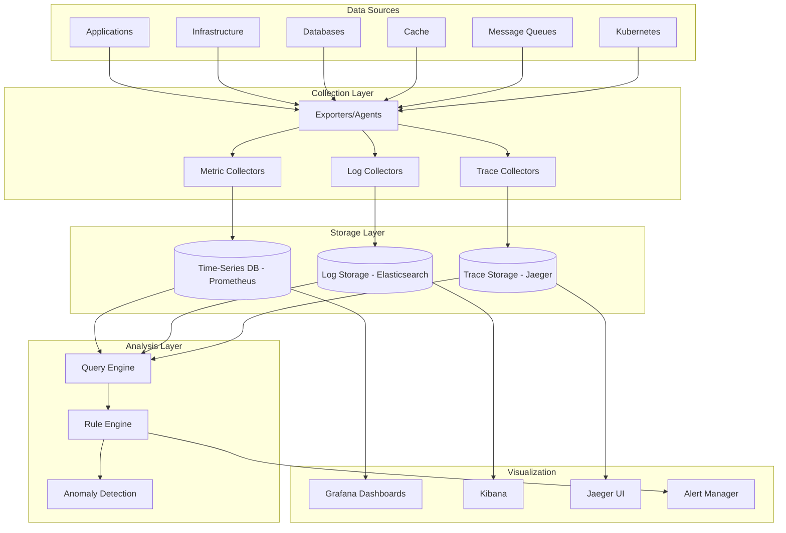

# Software Requirements Specification (SRS)

## Part 14E: Monitoring & Observability

**Module:** Testing, Deployment & Operations (Part 14)
**Version:** 1.0.0
**Status:** Final / For Review
**Date:** 2026-06-30

---

## Chapter 1 – Overview

### Purpose

The Monitoring & Observability module defines the comprehensive monitoring, logging, and tracing capabilities for the **[Platform Name]** platform. This encompasses metrics collection, log aggregation, distributed tracing, alerting, dashboards, and service level observability.

Monitoring and observability are essential for understanding system health, diagnosing issues, and ensuring reliability. This module ensures that the platform is observable at all levels—infrastructure, application, and business—enabling rapid detection and resolution of issues.

### Objectives

- Collect and visualize system metrics
- Aggregate and search logs
- Enable distributed tracing
- Provide real-time alerting
- Deliver comprehensive dashboards
- Track service level objectives (SLOs)
- Enable root cause analysis
- Support capacity planning

---

## Chapter 2 – Architecture

### OBS-001 Monitoring Architecture



### OBS-002 Components

| Component | Description | Tool | Priority |
| :--- | :--- | :--- | :--- |
| **Metrics Collection** | Collect system and application metrics | Prometheus | **Required** |
| **Log Aggregation** | Centralize and search logs | ELK Stack | **Required** |
| **Distributed Tracing** | Trace requests across services | Jaeger | **Required** |
| **Dashboards** | Visualize metrics and logs | Grafana, Kibana | **Required** |
| **Alerting** | Real-time alerting | AlertManager | **Required** |
| **Anomaly Detection** | ML-based anomaly detection | Prometheus, ML | **Required** |
| **Service Maps** | Service dependency visualization | Jaeger | **Required** |

---

## Chapter 3 – Metrics

### OBS-003 Metrics Types

| Type | Description | Priority |
| :--- | :--- | :--- |
| **Counter** | Cumulative metric (e.g., request count) | **Required** |
| **Gauge** | Current value (e.g., CPU usage) | **Required** |
| **Histogram** | Distribution of values (e.g., latency) | **Required** |
| **Summary** | Quantiles (e.g., request latency) | **Required** |

### OBS-004 Key Metrics

| Category | Metric | Description | Priority |
| :--- | :--- | :--- | :--- |
| **Infrastructure** | CPU Utilization | CPU usage percentage | **Required** |
| | Memory Utilization | Memory usage percentage | **Required** |
| | Disk Utilization | Disk usage percentage | **Required** |
| | Network I/O | Network traffic | **Required** |
| | Node Count | Number of nodes | **Required** |
| **Application** | Request Rate | Requests per second | **Required** |
| | Error Rate | Percentage of errors | **Required** |
| | Latency (p50, p95, p99) | Request latency | **Required** |
| | Service Availability | Uptime percentage | **Required** |
| | Request Size | Size of requests | **Required** |
| | Response Size | Size of responses | **Required** |
| **Business** | Order Rate | Orders per minute | **Required** |
| | Payment Success Rate | Payment success percentage | **Required** |
| | Delivery Completion Rate | Delivery completion percentage | **Required** |
| | Active Users | Concurrent users | **Required** |
| **Database** | Query Rate | Queries per second | **Required** |
| | Connection Count | Active connections | **Required** |
| | Replication Lag | Replication delay | **Required** |
| | Cache Hit Rate | Cache hit percentage | **Required** |
| **Messaging** | Queue Depth | Message queue depth | **Required** |
| | Consumer Lag | Consumer processing lag | **Required** |
| | Publish Rate | Messages published per second | **Required** |

### OBS-005 Prometheus Configuration

```yaml
# prometheus.yml
global:
  scrape_interval: 15s
  evaluation_interval: 15s
  external_labels:
    cluster: 'platform-prod'

scrape_configs:
  - job_name: 'kubernetes-pods'
    kubernetes_sd_configs:
      - role: pod
    relabel_configs:
      - source_labels: [__meta_kubernetes_pod_annotation_prometheus_io_scrape]
        action: keep
        regex: true
      - source_labels: [__meta_kubernetes_pod_annotation_prometheus_io_path]
        action: replace
        target_label: __metrics_path__
        regex: (.+)
      - source_labels: [__address__, __meta_kubernetes_pod_annotation_prometheus_io_port]
        action: replace
        regex: (.+):(?:\d+);(\d+)
        replacement: $1:$2
        target_label: __address__

  - job_name: 'kubernetes-nodes'
    scheme: https
    tls_config:
      ca_file: /var/run/secrets/kubernetes.io/serviceaccount/ca.crt
    bearer_token_file: /var/run/secrets/kubernetes.io/serviceaccount/token
    kubernetes_sd_configs:
      - role: node
    relabel_configs:
      - action: labelmap
        regex: __meta_kubernetes_node_label_(.+)
      - target_label: __address__
        replacement: kubernetes.default.svc:443
      - source_labels: [__meta_kubernetes_node_name]
        regex: (.+)
        target_label: __metrics_path__
        replacement: /api/v1/nodes/$1/proxy/metrics

  - job_name: 'kubernetes-cadvisor'
    scheme: https
    tls_config:
      ca_file: /var/run/secrets/kubernetes.io/serviceaccount/ca.crt
    bearer_token_file: /var/run/secrets/kubernetes.io/serviceaccount/token
    kubernetes_sd_configs:
      - role: node
    relabel_configs:
      - action: labelmap
        regex: __meta_kubernetes_node_label_(.+)
      - target_label: __address__
        replacement: kubernetes.default.svc:443
      - source_labels: [__meta_kubernetes_node_name]
        regex: (.+)
        target_label: __metrics_path__
        replacement: /api/v1/nodes/$1/proxy/metrics/cadvisor

  - job_name: 'postgresql'
    static_configs:
      - targets: ['postgres-exporter:9187']
        labels:
          service: 'postgresql'

  - job_name: 'redis'
    static_configs:
      - targets: ['redis-exporter:9121']
        labels:
          service: 'redis'

  - job_name: 'kafka'
    static_configs:
      - targets: ['kafka-exporter:9308']
        labels:
          service: 'kafka'
```

### OBS-006 Metrics Data Model

| Column | Type | Constraints | Description |
| :--- | :--- | :--- | :--- |
| `metric_id` | UUID | PRIMARY KEY | Unique identifier |
| `metric_name` | VARCHAR(100) | NOT NULL | Metric name |
| `metric_type` | VARCHAR(20) | NOT NULL | COUNTER/GAUGE/HISTOGRAM/SUMMARY |
| `value` | DECIMAL(15, 4) | NOT NULL | Metric value |
| `labels` | JSONB` | | Metric labels |
| `timestamp` | TIMESTAMP | NOT NULL | Metric timestamp |
| `service_name` | VARCHAR(100) | | Service name |
| `created_at` | TIMESTAMP | DEFAULT NOW() | Creation timestamp |

---

## Chapter 4 – Logging

### OBS-007 Log Types

| Type | Description | Priority |
| :--- | :--- | :--- |
| **Application Logs** | Service application logs | **Required** |
| **Access Logs** | API gateway and load balancer logs | **Required** |
| **System Logs** | Operating system logs | **Required** |
| **Security Logs** | Security and audit logs | **Required** |
| **Database Logs** | Database query logs | **Required** |
| **Kubernetes Logs** | Container and pod logs | **Required** |

### OBS-008 Log Structure

```json
{
  "timestamp": "2026-06-30T14:30:45.123Z",
  "level": "INFO",
  "trace_id": "550e8400-e29b-41d4-a716-446655440000",
  "span_id": "123e4567-e89b-12d3-a456-426614174000",
  "service": "order-service",
  "environment": "production",
  "message": "Order created successfully",
  "fields": {
    "order_id": "550e8400-e29b-41d4-a716-446655440001",
    "customer_id": "550e8400-e29b-41d4-a716-446655440002",
    "merchant_id": "550e8400-e29b-41d4-a716-446655440003",
    "total": 53.50,
    "currency": "USD"
  },
  "host": "order-service-pod-12345",
  "namespace": "platform"
}
```

### OBS-009 ELK Configuration

```yaml
# filebeat.yml
filebeat.inputs:
  - type: container
    paths:
      - /var/log/containers/*.log
    processors:
      - add_kubernetes_metadata:
          host: ${NODE_NAME}
          matchers:
          - logs_path:
              logs_path: "/var/log/containers/"

  - type: log
    paths:
      - /var/log/platform/*.log
    fields:
      log_type: application
    fields_under_root: true

output.elasticsearch:
  hosts: ['${ELASTICSEARCH_HOST:elasticsearch}:${ELASTICSEARCH_PORT:9200}']
  username: ${ELASTICSEARCH_USERNAME}
  password: ${ELASTICSEARCH_PASSWORD}
  index: "platform-logs-%{+yyyy.MM.dd}"

setup.kibana:
  host: '${KIBANA_HOST:kibana}:${KIBANA_PORT:5601}'
```

### OBS-010 Log Data Model

| Column | Type | Constraints | Description |
| :--- | :--- | :--- | :--- |
| `log_id` | UUID | PRIMARY KEY | Unique identifier |
| `timestamp` | TIMESTAMP | NOT NULL | Log timestamp |
| `level` | VARCHAR(20) | NOT NULL | INFO/WARN/ERROR/DEBUG |
| `service` | VARCHAR(100) | NOT NULL | Service name |
| `trace_id` | UUID | | Trace ID |
| `span_id` | UUID | | Span ID |
| `message` | TEXT | NOT NULL | Log message |
| `fields` | JSONB` | | Additional fields |
| `host` | VARCHAR(100) | | Hostname |
| `environment` | VARCHAR(20) | | Environment |
| `created_at` | TIMESTAMP | DEFAULT NOW() | Creation timestamp |

---

## Chapter 5 – Distributed Tracing

### OBS-011 Tracing Features

| Feature | Description | Priority |
| :--- | :--- | :--- |
| **Trace Collection** | Collect distributed traces | **Required** |
| **Trace Visualization** | Visualize traces in Jaeger UI | **Required** |
| **Service Maps** | Service dependency visualization | **Required** |
| **Trace Search** | Search traces by service, operation, tags | **Required** |
| **Trace Analysis** | Analyze trace performance | **Required** |
| **Trace Sampling** | Configurable sampling rates | **Required** |

### OBS-012 Jaeger Configuration

```yaml
# jaeger-agent.yaml
apiVersion: apps/v1
kind: DaemonSet
metadata:
  name: jaeger-agent
  namespace: observability
spec:
  selector:
    matchLabels:
      app: jaeger-agent
  template:
    metadata:
      labels:
        app: jaeger-agent
    spec:
      containers:
      - name: jaeger-agent
        image: jaegertracing/jaeger-agent:1.35
        ports:
        - containerPort: 5775
          protocol: UDP
        - containerPort: 6831
          protocol: UDP
        - containerPort: 6832
          protocol: UDP
        - containerPort: 5778
          protocol: TCP
        args:
        - --reporter.grpc.host-port=dns:///jaeger-collector:14250
        - --reporter.type=grpc
        - --agent.tags=cluster=platform-prod
        env:
        - name: NODE_NAME
          valueFrom:
            fieldRef:
              fieldPath: spec.nodeName
        resources:
          limits:
            memory: 128Mi
            cpu: 100m
          requests:
            memory: 64Mi
            cpu: 50m
```

### OBS-013 Trace Data Model

| Column | Type | Constraints | Description |
| :--- | :--- | :--- | :--- |
| `trace_id` | UUID | PRIMARY KEY | Unique trace identifier |
| `span_id` | UUID | | Span identifier |
| `parent_span_id` | UUID | | Parent span identifier |
| `service_name` | VARCHAR(100) | NOT NULL | Service name |
| `operation_name` | VARCHAR(255) | NOT NULL | Operation name |
| `start_time` | TIMESTAMP | NOT NULL | Start time |
| `duration_ms` | INTEGER | NOT NULL | Duration in milliseconds |
| `status` | VARCHAR(20) | | OK/ERROR |
| `tags` | JSONB` | | Span tags |
| `logs` | JSONB` | | Span logs |
| `created_at` | TIMESTAMP | DEFAULT NOW() | Creation timestamp |

---

## Chapter 6 – Dashboards

### OBS-014 Dashboard Types

| Dashboard | Description | Priority |
| :--- | :--- | :--- |
| **Infrastructure** | CPU, memory, disk, network | **Required** |
| **Application** | Request rate, error rate, latency | **Required** |
| **Business** | Orders, revenue, users | **Required** |
| **Database** | Query rate, connections, replication | **Required** |
| **Messaging** | Queue depth, consumer lag | **Required** |
| **Kubernetes** | Pod status, resource usage | **Required** |
| **SLO Dashboard** | Service level objective status | **Required** |
| **Incident** | Incident response dashboard | **Required** |

### OBS-015 Grafana Dashboard Configuration

```yaml
# grafana-dashboard.yaml
apiVersion: v1
kind: ConfigMap
metadata:
  name: grafana-dashboards
  namespace: observability
data:
  platform-infrastructure.json: |
    {
      "title": "Platform Infrastructure",
      "panels": [
        {
          "title": "CPU Utilization",
          "type": "graph",
          "targets": [
            {
              "expr": "avg(rate(container_cpu_usage_seconds_total[5m])) by (pod)"
            }
          ]
        },
        {
          "title": "Memory Utilization",
          "type": "graph",
          "targets": [
            {
              "expr": "avg(container_memory_usage_bytes) by (pod)"
            }
          ]
        },
        {
          "title": "Request Rate",
          "type": "graph",
          "targets": [
            {
              "expr": "sum(rate(http_requests_total[5m])) by (service)"
            }
          ]
        },
        {
          "title": "Error Rate",
          "type": "graph",
          "targets": [
            {
              "expr": "sum(rate(http_requests_total{status=~\"5..\"}[5m])) / sum(rate(http_requests_total[5m]))"
            }
          ]
        },
        {
          "title": "Latency (P95)",
          "type": "graph",
          "targets": [
            {
              "expr": "histogram_quantile(0.95, sum(rate(http_request_duration_seconds_bucket[5m])) by (le, service))"
            }
          ]
        },
        {
          "title": "Order Rate",
          "type": "graph",
          "targets": [
            {
              "expr": "sum(rate(orders_created_total[5m]))"
            }
          ]
        }
      ]
    }
```

---

## Chapter 7 – Alerting

### OBS-016 Alert Rules

| Rule | Description | Severity | Priority |
| :--- | :--- | :--- | :--- |
| **Service Down** | Service unavailable > 1 min | Critical | **Required** |
| **High Error Rate** | Error rate > 5% > 2 min | Critical | **Required** |
| **High Latency** | P95 latency > 1s > 5 min | High | **Required** |
| **CPU High** | CPU > 90% > 5 min | High | **Required** |
| **Memory High** | Memory > 90% > 5 min | High | **Required** |
| **Disk Full** | Disk > 85% > 5 min | High | **Required** |
| **Queue Depth** | Queue > 1000 > 5 min | High | **Required** |
| **Consumer Lag** | Consumer lag > 10000 | High | **Required** |
| **Replication Lag** | Replication lag > 60s | High | **Required** |
| **Certificate Expiry** | Certificate expires in < 30 days | High | **Required** |

### OBS-017 AlertManager Configuration

```yaml
# alertmanager.yml
route:
  group_by: ['alertname', 'cluster', 'service']
  group_wait: 30s
  group_interval: 5m
  repeat_interval: 4h
  receiver: 'pagerduty'
  routes:
  - match:
      severity: 'critical'
    receiver: 'pagerduty'
    continue: true
  - match:
      severity: 'high'
    receiver: 'slack'
    continue: true
  - match:
      severity: 'medium'
    receiver: 'email'
    continue: true
  - match:
      severity: 'low'
    receiver: 'email'

receivers:
- name: 'pagerduty'
  pagerduty_configs:
  - service_key: 'your-pagerduty-service-key'
    send_resolved: true
- name: 'slack'
  slack_configs:
  - api_url: 'https://hooks.slack.com/services/...'
    channel: '#alerts'
    send_resolved: true
- name: 'email'
  email_configs:
  - to: 'alerts@platform.com'
    send_resolved: true
```

### OBS-018 Alert Data Model

| Column | Type | Constraints | Description |
| :--- | :--- | :--- | :--- |
| `alert_id` | UUID | PRIMARY KEY | Unique identifier |
| `alert_name` | VARCHAR(100) | NOT NULL | Alert name |
| `severity` | VARCHAR(20) | NOT NULL | CRITICAL/HIGH/MEDIUM/LOW |
| `status` | VARCHAR(20) | DEFAULT 'OPEN' | OPEN/ACKNOWLEDGED/RESOLVED |
| `service_name` | VARCHAR(100) | | Affected service |
| `message` | TEXT | NOT NULL | Alert message |
| `labels` | JSONB` | | Alert labels |
| `annotations` | JSONB` | | Alert annotations |
| `triggered_at` | TIMESTAMP | NOT NULL | Trigger timestamp |
| `acknowledged_at` | TIMESTAMP | | Acknowledgement timestamp |
| `resolved_at` | TIMESTAMP` | | Resolution timestamp |
| `created_at` | TIMESTAMP | DEFAULT NOW() | Creation timestamp |
| `updated_at` | TIMESTAMP | DEFAULT NOW() | Last update timestamp |

---

## Chapter 8 – Service Level Objectives (SLOs)

### OBS-019 SLO Definitions

| SLO | Target | Window | Priority |
| :--- | :--- | :--- | :--- |
| **API Availability** | 99.95% | 30 days | **Required** |
| **API Latency (P95)** | < 500ms | 30 days | **Required** |
| **API Error Rate** | < 1% | 30 days | **Required** |
| **Order Completion Rate** | > 95% | 30 days | **Required** |
| **Delivery On-Time Rate** | > 95% | 30 days | **Required** |
| **Payment Success Rate** | > 99% | 30 days | **Required** |

### OBS-020 SLO Data Model

| Column | Type | Constraints | Description |
| :--- | :--- | :--- | :--- |
| `slo_id` | UUID | PRIMARY KEY | Unique identifier |
| `slo_name` | VARCHAR(100) | NOT NULL | SLO name |
| `slo_target` | DECIMAL(5, 2) | NOT NULL | Target percentage |
| `sli_type` | VARCHAR(20) | NOT NULL | AVAILABILITY/LATENCY/ERROR_RATE/SUCCESS_RATE |
| `window_days` | INTEGER | NOT NULL | Window in days |
| `current_value` | DECIMAL(5, 2) | | Current value |
| `error_budget` | DECIMAL(5, 2) | | Remaining error budget |
| `status` | VARCHAR(20) | DEFAULT 'OK' | OK/WARNING/VIOLATED |
| `last_updated` | TIMESTAMP` | | Last update timestamp |
| `created_at` | TIMESTAMP | DEFAULT NOW() | Creation timestamp |
| `updated_at` | TIMESTAMP | DEFAULT NOW() | Last update timestamp |

---

## Chapter 9 – Database Tables

### metrics

| Column | Type | Constraints | Description |
| :--- | :--- | :--- | :--- |
| `metric_id` | UUID | PRIMARY KEY | Unique identifier |
| `metric_name` | VARCHAR(100) | NOT NULL | Metric name |
| `metric_type` | VARCHAR(20) | NOT NULL | COUNTER/GAUGE/HISTOGRAM/SUMMARY |
| `value` | DECIMAL(15, 4) | NOT NULL | Metric value |
| `labels` | JSONB | | Metric labels |
| `timestamp` | TIMESTAMP | NOT NULL | Metric timestamp |
| `service_name` | VARCHAR(100) | | Service name |
| `created_at` | TIMESTAMP | DEFAULT NOW() | Creation timestamp |

### logs

| Column | Type | Constraints | Description |
| :--- | :--- | :--- | :--- |
| `log_id` | UUID | PRIMARY KEY | Unique identifier |
| `timestamp` | TIMESTAMP | NOT NULL | Log timestamp |
| `level` | VARCHAR(20) | NOT NULL | INFO/WARN/ERROR/DEBUG |
| `service` | VARCHAR(100) | NOT NULL | Service name |
| `trace_id` | UUID | | Trace ID |
| `span_id` | UUID | | Span ID |
| `message` | TEXT | NOT NULL | Log message |
| `fields` | JSONB | | Additional fields |
| `host` | VARCHAR(100) | | Hostname |
| `environment` | VARCHAR(20) | | Environment |
| `created_at` | TIMESTAMP | DEFAULT NOW() | Creation timestamp |

### traces

| Column | Type | Constraints | Description |
| :--- | :--- | :--- | :--- |
| `trace_id` | UUID | PRIMARY KEY | Unique trace identifier |
| `span_id` | UUID | | Span identifier |
| `parent_span_id` | UUID | | Parent span identifier |
| `service_name` | VARCHAR(100) | NOT NULL | Service name |
| `operation_name` | VARCHAR(255) | NOT NULL | Operation name |
| `start_time` | TIMESTAMP | NOT NULL | Start time |
| `duration_ms` | INTEGER | NOT NULL | Duration in milliseconds |
| `status` | VARCHAR(20) | | OK/ERROR |
| `tags` | JSONB | | Span tags |
| `logs` | JSONB | | Span logs |
| `created_at` | TIMESTAMP | DEFAULT NOW() | Creation timestamp |

### alerts

| Column | Type | Constraints | Description |
| :--- | :--- | :--- | :--- |
| `alert_id` | UUID | PRIMARY KEY | Unique identifier |
| `alert_name` | VARCHAR(100) | NOT NULL | Alert name |
| `severity` | VARCHAR(20) | NOT NULL | CRITICAL/HIGH/MEDIUM/LOW |
| `status` | VARCHAR(20) | DEFAULT 'OPEN' | OPEN/ACKNOWLEDGED/RESOLVED |
| `service_name` | VARCHAR(100) | | Affected service |
| `message` | TEXT | NOT NULL | Alert message |
| `labels` | JSONB | | Alert labels |
| `annotations` | JSONB | | Alert annotations |
| `triggered_at` | TIMESTAMP | NOT NULL | Trigger timestamp |
| `acknowledged_at` | TIMESTAMP | | Acknowledgement timestamp |
| `resolved_at` | TIMESTAMP` | | Resolution timestamp |
| `created_at` | TIMESTAMP | DEFAULT NOW() | Creation timestamp |
| `updated_at` | TIMESTAMP | DEFAULT NOW() | Last update timestamp |

### slos

| Column | Type | Constraints | Description |
| :--- | :--- | :--- | :--- |
| `slo_id` | UUID | PRIMARY KEY | Unique identifier |
| `slo_name` | VARCHAR(100) | NOT NULL | SLO name |
| `slo_target` | DECIMAL(5, 2) | NOT NULL | Target percentage |
| `sli_type` | VARCHAR(20) | NOT NULL | AVAILABILITY/LATENCY/ERROR_RATE/SUCCESS_RATE |
| `window_days` | INTEGER | NOT NULL | Window in days |
| `current_value` | DECIMAL(5, 2) | | Current value |
| `error_budget` | DECIMAL(5, 2) | | Remaining error budget |
| `status` | VARCHAR(20) | DEFAULT 'OK' | OK/WARNING/VIOLATED |
| `last_updated` | TIMESTAMP` | | Last update timestamp |
| `created_at` | TIMESTAMP | DEFAULT NOW() | Creation timestamp |
| `updated_at` | TIMESTAMP | DEFAULT NOW() | Last update timestamp |

### dashboards

| Column | Type | Constraints | Description |
| :--- | :--- | :--- | :--- |
| `dashboard_id` | UUID | PRIMARY KEY | Unique identifier |
| `dashboard_name` | VARCHAR(100) | NOT NULL | Dashboard name |
| `dashboard_type` | VARCHAR(30) | NOT NULL | INFRASTRUCTURE/APPLICATION/BUSINESS/DATABASE/MESSAGING/KUBERNETES/SLO/INCIDENT |
| `configuration` | JSONB | NOT NULL | Dashboard configuration |
| `is_active` | BOOLEAN | DEFAULT TRUE | Active status |
| `created_by` | UUID | | Creator identifier |
| `created_at` | TIMESTAMP | DEFAULT NOW() | Creation timestamp |
| `updated_at` | TIMESTAMP | DEFAULT NOW() | Last update timestamp |

---

## Chapter 10 – REST APIs

### Metrics APIs

| Method | Endpoint | Description |
| :--- | :--- | :--- |
| `GET` | `/api/v1/observability/metrics` | List metrics |
| `GET` | `/api/v1/observability/metrics/{id}` | Get metric details |
| `GET` | `/api/v1/observability/metrics/query` | Query metrics |
| `GET` | `/api/v1/observability/metrics/trends` | Get metric trends |

### Log APIs

| Method | Endpoint | Description |
| :--- | :--- | :--- |
| `GET` | `/api/v1/observability/logs` | List logs |
| `GET` | `/api/v1/observability/logs/{id}` | Get log details |
| `GET` | `/api/v1/observability/logs/search` | Search logs |
| `GET` | `/api/v1/observability/logs/export` | Export logs |

### Trace APIs

| Method | Endpoint | Description |
| :--- | :--- | :--- |
| `GET` | `/api/v1/observability/traces` | List traces |
| `GET` | `/api/v1/observability/traces/{id}` | Get trace details |
| `GET` | `/api/v1/observability/traces/service/{name}` | Get traces by service |
| `GET` | `/api/v1/observability/traces/search` | Search traces |

### Alert APIs

| Method | Endpoint | Description |
| :--- | :--- | :--- |
| `GET` | `/api/v1/observability/alerts` | List alerts |
| `GET` | `/api/v1/observability/alerts/{id}` | Get alert details |
| `PUT` | `/api/v1/observability/alerts/{id}/acknowledge` | Acknowledge alert |
| `PUT` | `/api/v1/observability/alerts/{id}/resolve` | Resolve alert |
| `GET` | `/api/v1/observability/alerts/rules` | List alert rules |
| `POST` | `/api/v1/observability/alerts/rules` | Create alert rule |

### SLO APIs

| Method | Endpoint | Description |
| :--- | :--- | :--- |
| `GET` | `/api/v1/observability/slos` | List SLOs |
| `GET` | `/api/v1/observability/slos/{id}` | Get SLO details |
| `GET` | `/api/v1/observability/slos/dashboard` | Get SLO dashboard |

### Dashboard APIs

| Method | Endpoint | Description |
| :--- | :--- | :--- |
| `GET` | `/api/v1/observability/dashboards` | List dashboards |
| `GET` | `/api/v1/observability/dashboards/{id}` | Get dashboard details |
| `POST` | `/api/v1/observability/dashboards` | Create dashboard |
| `PUT` | `/api/v1/observability/dashboards/{id}` | Update dashboard |
| `DELETE` | `/api/v1/observability/dashboards/{id}` | Delete dashboard |

---

## Chapter 11 – Business Rules

| Rule ID | Rule Description | Priority |
| :--- | :--- | :--- |
| **BR-OBS-001** | Metrics must be collected every 15 seconds. | **High** |
| **BR-OBS-002** | Logs must be centralized within 1 minute. | **High** |
| **BR-OBS-003** | Traces must be sampled at 10% (configurable). | **High** |
| **BR-OBS-004** | Critical alerts must trigger within 30 seconds. | **High** |
| **BR-OBS-005** | Metrics must be retained for 30 days. | **High** |
| **BR-OBS-006** | Logs must be retained for 30 days. | **High** |
| **BR-OBS-007** | Traces must be retained for 7 days. | **High** |
| **BR-OBS-008** | SLOs must be calculated daily. | **High** |
| **BR-OBS-009** | Error budget must be tracked in real-time. | **High** |
| **BR-OBS-010** | Dashboards must be accessible to operations team. | **High** |

---

## Chapter 12 – Acceptance Tests

| Test ID | Test Description | Priority |
| :--- | :--- | :--- |
| **TEST-OBS-001** | Metrics collected and stored successfully. | **High** |
| **TEST-OBS-002** | Logs aggregated and searchable. | **High** |
| **TEST-OBS-003** | Distributed traces collected and viewable. | **High** |
| **TEST-OBS-004** | Service maps visualize dependencies. | **High** |
| **TEST-OBS-005** | Infrastructure dashboard displays correctly. | **High** |
| **TEST-OBS-006** | Application dashboard displays correctly. | **High** |
| **TEST-OBS-007** | Business dashboard displays correctly. | **High** |
| **TEST-OBS-008** | Alert triggers on metric threshold breach. | **High** |
| **TEST-OBS-009** | Alert acknowledged and resolved. | **High** |
| **TEST-OBS-010** | SLO dashboard displays correct values. | **High** |
| **TEST-OBS-011** | Error budget tracked correctly. | **High** |
| **TEST-OBS-012** | Trace search works correctly. | **High** |
| **TEST-OBS-013** | Log search works correctly. | **High** |
| **TEST-OBS-014** | Grafana dashboards load correctly. | **High** |
| **TEST-OBS-015** | Kibana dashboards load correctly. | **High** |
| **TEST-OBS-016** | Jaeger UI loads correctly. | **High** |
| **TEST-OBS-017** | AlertManager sends notifications. | **High** |
| **TEST-OBS-018** | Anomaly detection identifies outliers. | **High** |
| **TEST-OBS-019** | Metrics retention policy enforced. | **High** |
| **TEST-OBS-020** | Logs retention policy enforced. | **High** |

---

## Chapter 13 – Traceability Matrix

| Requirement | Database Table | API Endpoint(s) | Acceptance Test |
| :--- | :--- | :--- | :--- |
| OBS-003 | metrics | GET /api/v1/observability/metrics | TEST-OBS-001 |
| OBS-007 | logs | GET /api/v1/observability/logs | TEST-OBS-002 |
| OBS-011 | traces | GET /api/v1/observability/traces | TEST-OBS-003, TEST-OBS-004 |
| OBS-014 | dashboards | GET /api/v1/observability/dashboards | TEST-OBS-005, TEST-OBS-006, TEST-OBS-007, TEST-OBS-014, TEST-OBS-015, TEST-OBS-016 |
| OBS-016 | alerts | GET /api/v1/observability/alerts | TEST-OBS-008, TEST-OBS-009, TEST-OBS-017 |
| OBS-019 | slos | GET /api/v1/observability/slos | TEST-OBS-010, TEST-OBS-011 |
| OBS-011 | traces | GET /api/v1/observability/traces/search | TEST-OBS-012 |
| OBS-007 | logs | GET /api/v1/observability/logs/search | TEST-OBS-013 |
| OBS-005 | metrics | GET /api/v1/observability/metrics/trends | TEST-OBS-018 |
| OBS-003 | metrics | GET /api/v1/observability/metrics/query | TEST-OBS-019, TEST-OBS-020 |

---

## Chapter 14 – Summary

This document establishes the complete monitoring and observability capability for the **[Platform Name]** platform. Key takeaways:

- **Metrics Collection:** Prometheus-based metrics collection with counters, gauges, histograms, and summaries.
- **Log Aggregation:** ELK Stack (Elasticsearch, Logstash, Kibana) for centralized log management.
- **Distributed Tracing:** Jaeger for distributed tracing with service maps and trace analysis.
- **Dashboards:** Grafana and Kibana dashboards for infrastructure, application, business, database, messaging, Kubernetes, SLO, and incident monitoring.
- **Alerting:** AlertManager-based alerting with severity-based routing (PagerDuty, Slack, Email).
- **SLOs:** Service Level Objectives tracking with error budgets and status monitoring.
- **Data Retention:** 30 days for metrics and logs, 7 days for traces.
- **Anomaly Detection:** ML-based anomaly detection for proactive issue identification.

The monitoring and observability module ensures the platform is observable at all levels, enabling rapid detection and resolution of issues.

---

**Next Document:**

`Part_14F_Disaster_Recovery.md`

*(This builds on monitoring and observability to define disaster recovery capabilities.)*