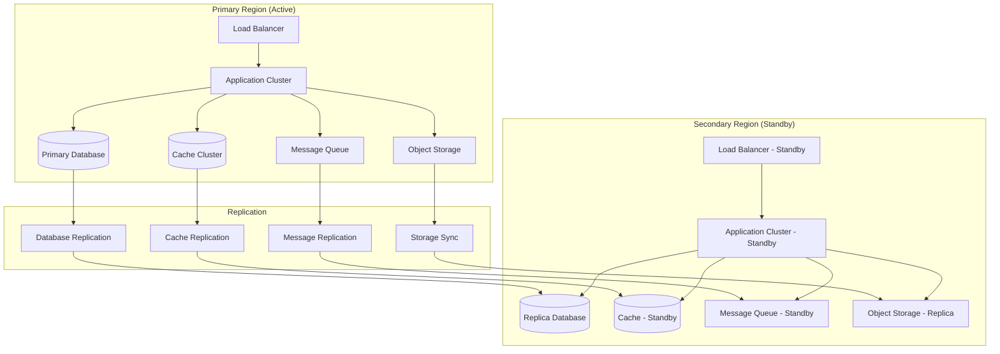
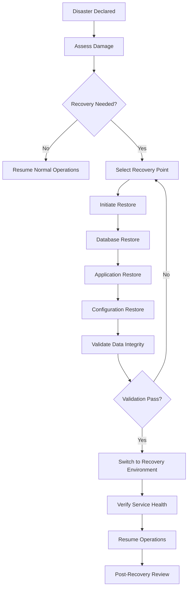
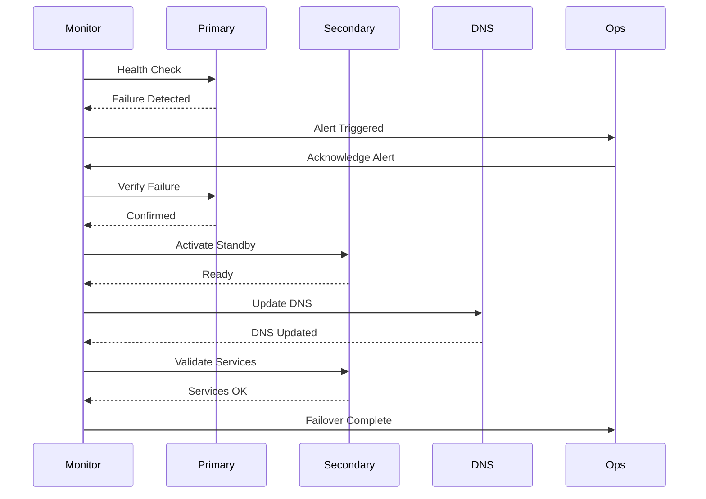

# Software Requirements Specification (SRS)

## Part 14F: Disaster Recovery

**Module:** Testing, Deployment & Operations (Part 14)
**Version:** 1.0.0
**Status:** Final / For Review
**Date:** 2026-06-30

---

## Chapter 1 – Overview

### Purpose

The Disaster Recovery module defines the comprehensive disaster recovery and business continuity capabilities for the **[Platform Name]** platform. This encompasses disaster recovery strategy, backup and restore procedures, failover mechanisms, recovery point objectives (RPO), recovery time objectives (RTO), disaster recovery testing, and business continuity planning.

Disaster recovery is essential for ensuring platform resilience and availability. A well-defined disaster recovery plan ensures that the platform can recover from catastrophic failures—whether natural disasters, cyberattacks, or human error—with minimal data loss and downtime. This module ensures that the platform meets its availability commitments and protects customer data.

### Objectives

- Define disaster recovery strategy and objectives
- Establish backup and restore procedures
- Enable automated failover and recovery
- Define RPO and RTO targets
- Implement disaster recovery testing
- Ensure business continuity
- Protect customer data
- Meet regulatory compliance requirements

---

## Chapter 2 – Disaster Recovery Strategy

### DR-001 Recovery Objectives

| Objective | Target | Priority |
| :--- | :--- | :--- |
| **Recovery Time Objective (RTO)** | < 15 minutes | **Required** |
| **Recovery Point Objective (RPO)** | < 5 minutes | **Required** |
| **Availability Target** | 99.95% uptime | **Required** |
| **Data Durability** | 99.999999999% (11 nines) | **Required** |

### DR-002 Disaster Recovery Tiers

| Tier | Description | RTO | RPO | Priority |
| :--- | :--- | :--- | :--- | :--- |
| **Tier 0 (Critical)** | Customer-facing services | < 5 min | < 1 min | **Required** |
| **Tier 1 (High)** | Core business services | < 15 min | < 5 min | **Required** |
| **Tier 2 (Medium)** | Operational services | < 1 hour | < 15 min | **Required** |
| **Tier 3 (Low)** | Administrative services | < 4 hours | < 1 hour | **Required** |

### DR-003 Recovery Strategies

| Strategy | Description | Priority |
| :--- | :--- | :--- |
| **Active-Active** | Multiple active regions | **Required** |
| **Active-Passive** | Primary with standby region | **Required** |
| **Pilot Light** | Minimal resources in standby | **Required** |
| **Warm Standby** | Partially running standby | **Required** |
| **Backup and Restore** | Restore from backups | **Required** |

### DR-004 Architecture Overview

---

## Chapter 3 – Backup & Restore

### DR-005 Backup Types

| Type | Description | Frequency | Priority |
| :--- | :--- | :--- | :--- |
| **Full Backup** | Complete system backup | Weekly | **Required** |
| **Incremental Backup** | Changed data only | Daily | **Required** |
| **Continuous Backup** | Real-time data replication | Continuous | **Required** |
| **Snapshot** | Point-in-time snapshot | Hourly | **Required** |
| **Application Backup** | Application configuration | Daily | **Required** |
| **Configuration Backup** | Infrastructure configuration | On change | **Required** |

### DR-006 Backup Schedule

| Data Type | Backup Type | Frequency | Retention | Priority |
| :--- | :--- | :--- | :--- | :--- |
| **Database** | Continuous | Real-time | 7 days | **Required** |
| **Database** | Full Snapshot | Daily | 30 days | **Required** |
| **Database** | Weekly Backup | Weekly | 90 days | **Required** |
| **Database** | Monthly Backup | Monthly | 1 year | **Required** |
| **Object Storage** | Continuous | Real-time | 30 days | **Required** |
| **Application Logs** | Full Backup | Daily | 30 days | **Required** |
| **Configuration** | Full Backup | On change | 90 days | **Required** |
| **Transaction Logs** | Continuous | Real-time | 7 days | **Required** |

### DR-007 Backup Storage

| Storage Type | Location | Encryption | Priority |
| :--- | :--- | :--- | :--- |
| **Primary Storage** | Same region | AES-256 | **Required** |
| **Secondary Storage** | Different region | AES-256 | **Required** |
| **Tertiary Storage** | Different cloud provider | AES-256 | **Required** |
| **Offline Storage** | Physical media | AES-256 | **Required** |

### DR-008 Restore Process

### DR-009 Restore Data Model

| Column | Type | Constraints | Description |
| :--- | :--- | :--- | :--- |
| `restore_id` | UUID | PRIMARY KEY | Unique identifier |
| `backup_id` | UUID | FOREIGN KEY (backups.backup_id) | Associated backup |
| `restore_type` | VARCHAR(20) | NOT NULL | FULL/INCREMENTAL/POINT_IN_TIME |
| `restore_point` | TIMESTAMP | NOT NULL | Restore point timestamp |
| `status` | VARCHAR(20) | DEFAULT 'PENDING' | PENDING/RUNNING/SUCCESS/FAILED |
| `duration_seconds` | INTEGER` | | Restore duration |
| `data_verified` | BOOLEAN` | DEFAULT FALSE | Data integrity verified |
| `verified_at` | TIMESTAMP | | Verification timestamp |
| `error_message` | TEXT | | Error message (if failed) |
| `initiated_by` | UUID | | Initiator identifier |
| `completed_at` | TIMESTAMP | | Completion timestamp |
| `created_at` | TIMESTAMP | DEFAULT NOW() | Creation timestamp |
| `updated_at` | TIMESTAMP | DEFAULT NOW() | Last update timestamp |

---

## Chapter 4 – Failover

### DR-010 Failover Triggers

| Trigger | Description | Response | Priority |
| :--- | :--- | :--- | :--- |
| **Region Outage** | Entire region unavailable | Failover to secondary | **Required** |
| **Service Outage** | Critical service failure | Failover service | **Required** |
| **Database Failure** | Primary database down | Failover to replica | **Required** |
| **Network Failure** | Network connectivity loss | Failover to alternate | **Required** |
| **Security Incident** | Security breach detected | Isolate and failover | **Required** |
| **Maintenance** | Scheduled maintenance | Graceful failover | **Required** |

### DR-011 Failover Types

| Type | Description | Priority |
| :--- | :--- | :--- | :--- |
| **Automatic Failover** | Automated on failure detection | **Required** |
| **Manual Failover** | Operator-initiated failover | **Required** |
| **Planned Failover** | Scheduled maintenance failover | **Required** |
| **Emergency Failover** | Emergency incident failover | **Required** |

### DR-012 Failover Process

### DR-013 Failover Data Model

| Column | Type | Constraints | Description |
| :--- | :--- | :--- | :--- |
| `failover_id` | UUID | PRIMARY KEY | Unique identifier |
| `failover_type` | VARCHAR(20) | NOT NULL | AUTOMATIC/MANUAL/PLANNED/EMERGENCY |
| `trigger_type` | VARCHAR(30) | NOT NULL | REGION_OUTAGE/SERVICE_OUTAGE/DATABASE_FAILURE/NETWORK_FAILURE/SECURITY_INCIDENT/MAINTENANCE |
| `source_region` | VARCHAR(50) | NOT NULL | Source region |
| `target_region` | VARCHAR(50) | NOT NULL | Target region |
| `status` | VARCHAR(20) | DEFAULT 'PENDING' | PENDING/RUNNING/SUCCESS/FAILED/ROLLBACK |
| `duration_seconds` | INTEGER` | | Failover duration |
| `data_loss_seconds` | INTEGER` | | Data loss in seconds |
| `started_at` | TIMESTAMP` | | Start timestamp |
| `completed_at` | TIMESTAMP` | | Completion timestamp |
| `rolled_back_at` | TIMESTAMP` | | Rollback timestamp |
| `error_message` | TEXT | | Error message (if failed) |
| `initiated_by` | UUID | | Initiator identifier |
| `created_at` | TIMESTAMP | DEFAULT NOW() | Creation timestamp |
| `updated_at` | TIMESTAMP | DEFAULT NOW() | Last update timestamp |

---

## Chapter 5 – Disaster Recovery Scenarios

### DR-014 Scenario 1: Database Failure

| Aspect | Description |
| :--- | :--- |
| **Trigger** | Primary database unreachable or corrupted |
| **Impact** | All write operations fail, read operations affected |
| **RTO** | < 5 minutes |
| **RPO** | < 1 minute |
| **Response** | Promote replica to primary, update connection strings |
| **Recovery** | Restore from standby, verify data integrity |
| **Prevention** | Automated failover, replication monitoring |

### DR-015 Scenario 2: Regional Outage

| Aspect | Description |
| :--- | :--- |
| **Trigger** | Complete region unavailable (AWS/Azure/GCP outage) |
| **Impact** | Full service outage in region |
| **RTO** | < 15 minutes |
| **RPO** | < 5 minutes |
| **Response** | Failover to secondary region, update DNS |
| **Recovery** | Restore services in secondary region |
| **Prevention** | Multi-region deployment, active-active or warm standby |

### DR-016 Scenario 3: Service Outage

| Aspect | Description |
| :--- | :--- |
| **Trigger** | Critical microservice failure |
| **Impact** | Affected service unavailable |
| **RTO** | < 5 minutes |
| **RPO** | < 1 minute |
| **Response** | Restart service, failover to healthy instances |
| **Recovery** | Restore service, verify functionality |
| **Prevention** | Circuit breakers, retries, health checks |

### DR-017 Scenario 4: Security Incident

| Aspect | Description |
| :--- | :--- |
| **Trigger** | Security breach detected |
| **Impact** | Potential data exposure, service compromise |
| **RTO** | < 15 minutes |
| **RPO** | < 5 minutes |
| **Response** | Isolate affected systems, failover to clean environment |
| **Recovery** | Investigate incident, restore from clean backups |
| **Prevention** | Security monitoring, vulnerability scanning, penetration testing |

### DR-018 Scenario 5: Data Corruption

| Aspect | Description |
| :--- | :--- |
| **Trigger** | Data corruption detected |
| **Impact** | Data integrity compromised |
| **RTO** | < 15 minutes |
| **RPO** | < 5 minutes |
| **Response** | Stop writes, restore from last known good state |
| **Recovery** | Validate data integrity, resume operations |
| **Prevention** | Data validation, checksums, immutability |

---

## Chapter 6 – Disaster Recovery Testing

### DR-019 Test Types

| Type | Description | Frequency | Priority |
| :--- | :--- | :--- | :--- |
| **Tabletop Exercise** | Walkthrough of DR plan | Monthly | **Required** |
| **Simulation** | Simulated disaster scenario | Quarterly | **Required** |
| **Partial Failover** | Failover of non-critical services | Quarterly | **Required** |
| **Full Failover** | Complete failover to secondary | Annually | **Required** |
| **Backup Restore** | Restore from backups | Monthly | **Required** |
| **Chaos Engineering** | Random failure injection | Weekly | **Required** |

### DR-020 Test Process

1.  **Planning:** Define test scope, objectives, and success criteria.
2.  **Preparation:** Prepare environment, notify stakeholders.
3.  **Execution:** Execute disaster recovery test.
4.  **Monitoring:** Monitor test execution and metrics.
5.  **Validation:** Validate recovery success.
6.  **Fallback:** Return to normal operations.
7.  **Review:** Document results and lessons learned.
8.  **Improvement:** Update DR plan based on findings.

### DR-021 Test Data Model

| Column | Type | Constraints | Description |
| :--- | :--- | :--- | :--- |
| `test_id` | UUID | PRIMARY KEY | Unique identifier |
| `test_name` | VARCHAR(100) | NOT NULL | Test name |
| `test_type` | VARCHAR(20) | NOT NULL | TABLETOP/SIMULATION/PARTIAL/FULL/RESTORE/CHAOS |
| `status` | VARCHAR(20) | DEFAULT 'PLANNED' | PLANNED/RUNNING/SUCCESS/FAILED |
| `duration_seconds` | INTEGER` | | Test duration |
| `rto_achieved` | INTEGER` | | Achieved RTO (seconds) |
| `rpo_achieved` | INTEGER` | | Achieved RPO (seconds) |
| `success_criteria_met` | BOOLEAN` | DEFAULT FALSE | Success criteria met |
| `issues_found` | TEXT` | | Issues found during test |
| `lessons_learned` | TEXT` | | Lessons learned |
| `improvements` | TEXT` | | Recommended improvements |
| `conducted_by` | UUID | | Test conductor identifier |
| `started_at` | TIMESTAMP | | Start timestamp |
| `completed_at` | TIMESTAMP` | | Completion timestamp |
| `created_at` | TIMESTAMP | DEFAULT NOW() | Creation timestamp |
| `updated_at` | TIMESTAMP | DEFAULT NOW() | Last update timestamp |

---

## Chapter 7 – Business Continuity

### DR-022 Business Continuity Plan

| Component | Description | Priority |
| :--- | :--- | :--- | 
| **Incident Response** | Immediate response to incidents | **Required** |
| **Crisis Management** | Executive crisis management | **Required** |
| **Communication** | Stakeholder communication | **Required** |
| **IT Recovery** | Technical system recovery | **Required** |
| **Business Recovery** | Business function recovery | **Required** |
| **Post-Incident Review** | Lessons learned and improvements | **Required** |

### DR-023 Communication Plan

| Stakeholder | Communication | Channel | Priority |
| :--- | :--- | :--- | :--- |
| **Customers** | Service disruption notification | Email, Status Page | **Required** |
| **Merchants** | Service disruption notification | Email, Dashboard | **Required** |
| **Drivers** | Service disruption notification | Push, SMS | **Required** |
| **Employees** | Internal communication | Slack, Email | **Required** |
| **Executives** | Executive briefing | Phone, Email | **Required** |
| **Investors** | Investor communication | Email | **Required** |
| **Regulators** | Regulatory notification | Formal letter | **Required** |

### DR-024 Business Continuity Data Model

| Column | Type | Constraints | Description |
| :--- | :--- | :--- | :--- |
| `plan_id` | UUID | PRIMARY KEY | Unique identifier |
| `plan_name` | VARCHAR(100) | NOT NULL | Plan name |
| `plan_version` | VARCHAR(20) | NOT NULL | Plan version |
| `status` | VARCHAR(20) | DEFAULT 'ACTIVE' | ACTIVE/IN_REVIEW/ARCHIVED |
| `review_date` | DATE | | Last review date |
| `next_review_date` | DATE` | | Next review date |
| `approved_by` | UUID | | Approver identifier |
| `approved_at` | TIMESTAMP | | Approval timestamp |
| `created_at` | TIMESTAMP | DEFAULT NOW() | Creation timestamp |
| `updated_at` | TIMESTAMP | DEFAULT NOW() | Last update timestamp |

---

## Chapter 8 – Database Tables

### backups

| Column | Type | Constraints | Description |
| :--- | :--- | :--- | :--- |
| `backup_id` | UUID | PRIMARY KEY | Unique identifier |
| `backup_type` | VARCHAR(20) | NOT NULL | FULL/INCREMENTAL/CONTINUOUS/SNAPSHOT/APPLICATION/CONFIGURATION |
| `backup_name` | VARCHAR(100) | NOT NULL | Backup name |
| `backup_location` | VARCHAR(500) | NOT NULL | Backup location |
| `backup_size_bytes` | BIGINT | | Backup size in bytes |
| `data_type` | VARCHAR(50) | NOT NULL | DATABASE/STORAGE/LOGS/CONFIGURATION |
| `start_time` | TIMESTAMP | NOT NULL | Backup start time |
| `end_time` | TIMESTAMP | | Backup end time |
| `status` | VARCHAR(20) | DEFAULT 'RUNNING' | RUNNING/SUCCESS/FAILED |
| `checksum` | VARCHAR(255) | | Backup checksum |
| `encrypted` | BOOLEAN | DEFAULT TRUE | Encryption status |
| `retention_days` | INTEGER | NOT NULL | Retention period (days) |
| `expires_at` | TIMESTAMP | | Expiration timestamp |
| `created_at` | TIMESTAMP | DEFAULT NOW() | Creation timestamp |
| `updated_at` | TIMESTAMP | DEFAULT NOW() | Last update timestamp |

### restores

| Column | Type | Constraints | Description |
| :--- | :--- | :--- | :--- |
| `restore_id` | UUID | PRIMARY KEY | Unique identifier |
| `backup_id` | UUID | FOREIGN KEY (backups.backup_id) | Associated backup |
| `restore_type` | VARCHAR(20) | NOT NULL | FULL/INCREMENTAL/POINT_IN_TIME |
| `restore_point` | TIMESTAMP | NOT NULL | Restore point |
| `status` | VARCHAR(20) | DEFAULT 'PENDING' | PENDING/RUNNING/SUCCESS/FAILED |
| `duration_seconds` | INTEGER` | | Restore duration |
| `data_verified` | BOOLEAN` | DEFAULT FALSE | Data verified |
| `verified_at` | TIMESTAMP | | Verification timestamp |
| `error_message` | TEXT` | | Error message |
| `initiated_by` | UUID | | Initiator identifier |
| `completed_at` | TIMESTAMP | | Completion timestamp |
| `created_at` | TIMESTAMP | DEFAULT NOW() | Creation timestamp |
| `updated_at` | TIMESTAMP | DEFAULT NOW() | Last update timestamp |

### failovers

| Column | Type | Constraints | Description |
| :--- | :--- | :--- | :--- |
| `failover_id` | UUID | PRIMARY KEY | Unique identifier |
| `failover_type` | VARCHAR(20) | NOT NULL | AUTOMATIC/MANUAL/PLANNED/EMERGENCY |
| `trigger_type` | VARCHAR(30) | NOT NULL | REGION_OUTAGE/SERVICE_OUTAGE/DATABASE_FAILURE/NETWORK_FAILURE/SECURITY_INCIDENT/MAINTENANCE |
| `source_region` | VARCHAR(50) | NOT NULL | Source region |
| `target_region` | VARCHAR(50) | NOT NULL | Target region |
| `status` | VARCHAR(20) | DEFAULT 'PENDING' | PENDING/RUNNING/SUCCESS/FAILED/ROLLBACK |
| `duration_seconds` | INTEGER` | | Failover duration |
| `data_loss_seconds` | INTEGER` | | Data loss (seconds) |
| `started_at` | TIMESTAMP | | Start timestamp |
| `completed_at` | TIMESTAMP | | Completion timestamp |
| `rolled_back_at` | TIMESTAMP` | | Rollback timestamp |
| `error_message` | TEXT` | | Error message |
| `initiated_by` | UUID | | Initiator identifier |
| `created_at` | TIMESTAMP | DEFAULT NOW() | Creation timestamp |
| `updated_at` | TIMESTAMP | DEFAULT NOW() | Last update timestamp |

### dr_tests

| Column | Type | Constraints | Description |
| :--- | :--- | :--- | :--- |
| `test_id` | UUID | PRIMARY KEY | Unique identifier |
| `test_name` | VARCHAR(100) | NOT NULL | Test name |
| `test_type` | VARCHAR(20) | NOT NULL | TABLETOP/SIMULATION/PARTIAL/FULL/RESTORE/CHAOS |
| `status` | VARCHAR(20) | DEFAULT 'PLANNED' | PLANNED/RUNNING/SUCCESS/FAILED |
| `duration_seconds` | INTEGER` | | Test duration |
| `rto_achieved` | INTEGER` | | Achieved RTO |
| `rpo_achieved` | INTEGER` | | Achieved RPO |
| `success_criteria_met` | BOOLEAN` | DEFAULT FALSE | Success criteria met |
| `issues_found` | TEXT` | | Issues found |
| `lessons_learned` | TEXT` | | Lessons learned |
| `improvements` | TEXT` | | Improvements |
| `conducted_by` | UUID | | Test conductor |
| `started_at` | TIMESTAMP | | Start timestamp |
| `completed_at` | TIMESTAMP` | | Completion timestamp |
| `created_at` | TIMESTAMP | DEFAULT NOW() | Creation timestamp |
| `updated_at` | TIMESTAMP | DEFAULT NOW() | Last update timestamp |

### business_continuity_plans

| Column | Type | Constraints | Description |
| :--- | :--- | :--- | :--- |
| `plan_id` | UUID | PRIMARY KEY | Unique identifier |
| `plan_name` | VARCHAR(100) | NOT NULL | Plan name |
| `plan_version` | VARCHAR(20) | NOT NULL | Plan version |
| `status` | VARCHAR(20) | DEFAULT 'ACTIVE' | ACTIVE/IN_REVIEW/ARCHIVED |
| `review_date` | DATE | | Last review date |
| `next_review_date` | DATE | | Next review date |
| `approved_by` | UUID | | Approver identifier |
| `approved_at` | TIMESTAMP | | Approval timestamp |
| `created_at` | TIMESTAMP | DEFAULT NOW() | Creation timestamp |
| `updated_at` | TIMESTAMP | DEFAULT NOW() | Last update timestamp |

### dr_incidents

| Column | Type | Constraints | Description |
| :--- | :--- | :--- | :--- |
| `incident_id` | UUID | PRIMARY KEY | Unique identifier |
| `incident_type` | VARCHAR(30) | NOT NULL | REGION_OUTAGE/SERVICE_OUTAGE/DATABASE_FAILURE/NETWORK_FAILURE/SECURITY_INCIDENT/DATA_CORRUPTION |
| `severity` | VARCHAR(20) | NOT NULL | CRITICAL/HIGH/MEDIUM/LOW |
| `description` | TEXT | NOT NULL | Incident description |
| `root_cause` | TEXT | | Root cause analysis |
| `impact` | TEXT | | Business impact |
| `resolution` | TEXT | | Resolution description |
| `status` | VARCHAR(20) | DEFAULT 'OPEN' | OPEN/INVESTIGATING/RESOLVED/CLOSED |
| `resolved_at` | TIMESTAMP | | Resolution timestamp |
| `lessons_learned` | TEXT | | Lessons learned |
| `preventive_actions` | TEXT` | | Preventive actions |
| `created_at` | TIMESTAMP | DEFAULT NOW() | Creation timestamp |
| `updated_at` | TIMESTAMP | DEFAULT NOW() | Last update timestamp |

---

## Chapter 9 – REST APIs

### Backup APIs

| Method | Endpoint | Description |
| :--- | :--- | :--- |
| `GET` | `/api/v1/dr/backups` | List backups |
| `GET` | `/api/v1/dr/backups/{id}` | Get backup details |
| `POST` | `/api/v1/dr/backups` | Create backup |
| `POST` | `/api/v1/dr/backups/{id}/restore` | Restore from backup |
| `DELETE` | `/api/v1/dr/backups/{id}` | Delete backup |

### Restore APIs

| Method | Endpoint | Description |
| :--- | :--- | :--- |
| `GET` | `/api/v1/dr/restores` | List restores |
| `GET` | `/api/v1/dr/restores/{id}` | Get restore details |
| `GET` | `/api/v1/dr/restores/status` | Get restore status |

### Failover APIs

| Method | Endpoint | Description |
| :--- | :--- | :--- |
| `GET` | `/api/v1/dr/failovers` | List failovers |
| `GET` | `/api/v1/dr/failovers/{id}` | Get failover details |
| `POST` | `/api/v1/dr/failovers` | Initiate failover |
| `POST` | `/api/v1/dr/failovers/{id}/rollback` | Rollback failover |
| `GET` | `/api/v1/dr/failovers/status` | Get failover status |

### Test APIs

| Method | Endpoint | Description |
| :--- | :--- | :--- |
| `GET` | `/api/v1/dr/tests` | List DR tests |
| `GET` | `/api/v1/dr/tests/{id}` | Get test details |
| `POST` | `/api/v1/dr/tests` | Create DR test |
| `POST` | `/api/v1/dr/tests/{id}/execute` | Execute DR test |

### Business Continuity APIs

| Method | Endpoint | Description |
| :--- | :--- | :--- |
| `GET` | `/api/v1/dr/plans` | List business continuity plans |
| `GET` | `/api/v1/dr/plans/{id}` | Get plan details |
| `POST` | `/api/v1/dr/plans` | Create plan |
| `PUT` | `/api/v1/dr/plans/{id}` | Update plan |
| `GET` | `/api/v1/dr/incidents` | List DR incidents |
| `GET` | `/api/v1/dr/incidents/{id}` | Get incident details |
| `POST` | `/api/v1/dr/incidents` | Create incident |
| `PUT` | `/api/v1/dr/incidents/{id}` | Update incident |

### Status APIs

| Method | Endpoint | Description |
| :--- | :--- | :--- |
| `GET` | `/api/v1/dr/status` | Get DR readiness status |
| `GET` | `/api/v1/dr/status/regions` | Get region status |
| `GET` | `/api/v1/dr/status/services` | Get service status |
| `GET` | `/api/v1/dr/status/backups` | Get backup status |

---

## Chapter 10 – Business Rules

| Rule ID | Rule Description | Priority |
| :--- | :--- | :--- |
| **BR-DR-001** | RTO must be < 15 minutes for critical services. | **High** |
| **BR-DR-002** | RPO must be < 5 minutes for critical data. | **High** |
| **BR-DR-003** | Backups must be stored in multiple regions. | **High** |
| **BR-DR-004** | Backups must be encrypted at rest. | **High** |
| **BR-DR-005** | DR tests must be conducted quarterly. | **High** |
| **BR-DR-006** | Full DR failover test must be conducted annually. | **High** |
| **BR-DR-007** | DR plan must be reviewed and updated annually. | **High** |
| **BR-DR-008** | Database backups must be retained for 30 days minimum. | **High** |
| **BR-DR-009** | Transaction logs must be retained for 7 days. | **High** |
| **BR-DR-010** | Failover must be automated for critical services. | **High** |

---

## Chapter 11 – Acceptance Tests

| Test ID | Test Description | Priority |
| :--- | :--- | :--- |
| **TEST-DR-001** | Database backup created successfully. | **High** |
| **TEST-DR-002** | Database restore completes successfully. | **High** |
| **TEST-DR-003** | Application backup created successfully. | **High** |
| **TEST-DR-004** | Application restore completes successfully. | **High** |
| **TEST-DR-005** | Automated failover triggers on database failure. | **High** |
| **TEST-DR-006** | Manual failover initiated and completes successfully. | **High** |
| **TEST-DR-007** | Failover RTO achieved (< 15 minutes). | **High** |
| **TEST-DR-008** | Failover RPO achieved (< 5 minutes). | **High** |
| **TEST-DR-009** | Rollback to primary region works correctly. | **High** |
| **TEST-DR-010** | Tabletop DR exercise completed. | **High** |
| **TEST-DR-011** | Partial failover test passes. | **High** |
| **TEST-DR-012** | Full failover test passes. | **High** |
| **TEST-DR-013** | Backup restore test passes. | **High** |
| **TEST-DR-014** | Chaos engineering test passes. | **High** |
| **TEST-DR-015** | Business continuity plan reviewed and updated. | **High** |
| **TEST-DR-016** | Communication plan tested. | **High** |
| **TEST-DR-017** | Data integrity validated after restore. | **High** |
| **TEST-DR-018** | Cross-region backup replication verified. | **High** |
| **TEST-DR-019** | Backup encryption verified. | **High** |
| **TEST-DR-020** | DR readiness status dashboard displays correctly. | **High** |

---

## Chapter 12 – Traceability Matrix

| Requirement | Database Table | API Endpoint(s) | Acceptance Test |
| :--- | :--- | :--- | :--- |
| DR-005 | backups | POST /api/v1/dr/backups | TEST-DR-001, TEST-DR-003 |
| DR-008 | restores | POST /api/v1/dr/backups/{id}/restore | TEST-DR-002, TEST-DR-004 |
| DR-010 | failovers | POST /api/v1/dr/failovers | TEST-DR-005, TEST-DR-006, TEST-DR-007, TEST-DR-008, TEST-DR-009 |
| DR-019 | dr_tests | POST /api/v1/dr/tests | TEST-DR-010, TEST-DR-011, TEST-DR-012, TEST-DR-013, TEST-DR-014 |
| DR-022 | business_continuity_plans | PUT /api/v1/dr/plans/{id} | TEST-DR-015 |
| DR-023 | business_continuity_plans | GET /api/v1/dr/plans | TEST-DR-016 |
| DR-008 | restores | GET /api/v1/dr/restores/{id} | TEST-DR-017 |
| DR-005 | backups | GET /api/v1/dr/backups | TEST-DR-018, TEST-DR-019 |
| DR-002 | failovers | GET /api/v1/dr/status | TEST-DR-020 |

---

## Chapter 13 – Summary

This document establishes the complete disaster recovery capability for the **[Platform Name]** platform. Key takeaways:

- **Recovery Objectives:** RTO < 15 minutes, RPO < 5 minutes, 99.95% availability, 11 nines data durability.
- **Backup & Restore:** Full, incremental, continuous, snapshot, application, and configuration backups with multi-region storage.
- **Failover:** Automatic and manual failover with regional, service, database, network, security, and maintenance triggers.
- **DR Scenarios:** Database failure, regional outage, service outage, security incident, and data corruption with defined responses.
- **DR Testing:** Tabletop exercises (monthly), simulations (quarterly), partial failover (quarterly), full failover (annually), backup restore (monthly), and chaos engineering (weekly).
- **Business Continuity:** Incident response, crisis management, communication, IT recovery, business recovery, and post-incident review.
- **Communication:** Customer, merchant, driver, employee, executive, investor, and regulator communication plans.

The disaster recovery module ensures the platform can recover from catastrophic failures with minimal data loss and downtime.

---

**Next Document:**

`Part_14G_SRE_Service_Level_Objectives.md`

*(This builds on disaster recovery to define SRE and Service Level Objectives capabilities.)*