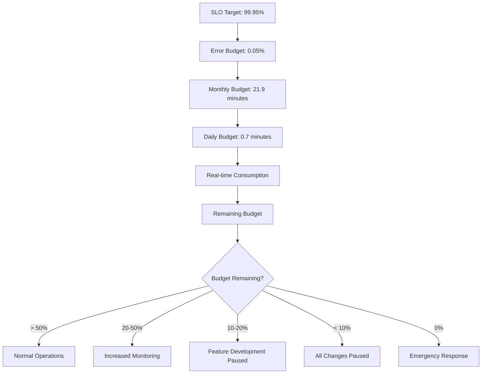
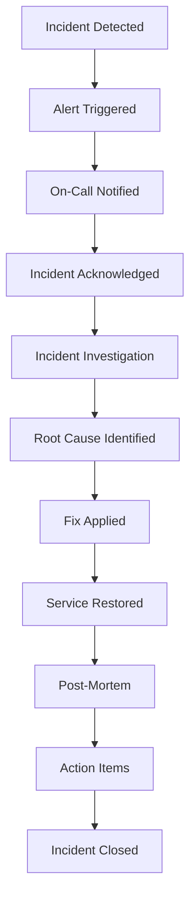

# Software Requirements Specification (SRS)

## Part 14G: SRE & Service Level Objectives

**Module:** Testing, Deployment & Operations (Part 14)
**Version:** 1.0.0
**Status:** Final / For Review
**Date:** 2026-06-30

---

## Chapter 1 – Overview

### Purpose

The SRE & Service Level Objectives module defines the comprehensive Site Reliability Engineering (SRE) framework for the **[Platform Name]** platform. This encompasses Service Level Indicators (SLIs), Service Level Objectives (SLOs), Error Budgets, SLO monitoring, SLO reporting, SLO alerting, and operational excellence practices.

SRE is the discipline of applying software engineering practices to operations. It ensures that the platform meets its reliability commitments through data-driven decision-making, error budget policies, and continuous improvement. This module ensures that the platform is reliable, available, and meets customer expectations.

### Objectives

- Define Service Level Indicators (SLIs) for all services
- Establish Service Level Objectives (SLOs) with clear targets
- Implement Error Budget policies and tracking
- Enable SLO monitoring and alerting
- Provide SLO reporting and dashboards
- Support operational excellence practices
- Drive continuous reliability improvement
- Align engineering with business goals

---

## Chapter 2 – SRE Framework

### SRE-001 Core Principles

| Principle | Description | Priority |
| :--- | :--- | :--- |
| **Service Level Objectives** | Define measurable reliability targets | **Required** |
| **Error Budgets** | Allocate acceptable error rates | **Required** |
| **Blameless Post-Mortems** | Learn from failures without blame | **Required** |
| **Automation** | Automate operational tasks | **Required** |
| **Monitoring** | Measure everything | **Required** |
| **Capacity Planning** | Plan for growth | **Required** |
| **Change Management** | Manage risk in changes | **Required** |

### SRE-002 SRE Roles

| Role | Description | Priority |
| :--- | :--- | :--- |
| **SRE Engineer** | Responsible for service reliability | **Required** |
| **SRE Manager** | Leads SRE team | **Required** |
| **Service Owner** | Owns service reliability | **Required** |
| **Operations** | Day-to-day operations | **Required** |

### SRE-003 SRE Activities

| Activity | Description | Frequency | Priority |
| :--- | :--- | :--- | :--- |
| **SLO Review** | Review SLO attainment | Weekly | **Required** |
| **Error Budget Review** | Review error budget consumption | Weekly | **Required** |
| **Incident Review** | Post-incident analysis | Weekly | **Required** |
| **Capacity Review** | Review capacity and scaling | Monthly | **Required** |
| **Performance Review** | Review performance metrics | Monthly | **Required** |
| **Chaos Engineering** | Test system resilience | Monthly | **Required** |
| **SLO Reporting** | Report on SLO attainment | Monthly | **Required** |

---

## Chapter 3 – Service Level Indicators (SLIs)

### SRE-004 SLI Types

| Type | Description | Priority |
| :--- | :--- | :--- |
| **Availability** | Service uptime percentage | **Required** |
| **Latency** | Request response time | **Required** |
| **Error Rate** | Percentage of errors | **Required** |
| **Throughput** | Requests per second | **Required** |
| **Success Rate** | Percentage of successful operations | **Required** |
| **Durability** | Data persistence guarantee | **Required** |
| **Freshness** | Data freshness guarantee | **Required** |
| **Correctness** | Data correctness guarantee | **Required** |

### SRE-005 SLI Definitions

| Service | SLI | Description | Priority |
| :--- | :--- | :--- | :--- |
| **API Gateway** | Availability | Uptime of API gateway | **Required** |
| | Latency | P95 response time | **Required** |
| | Error Rate | HTTP 5xx errors | **Required** |
| **Order Service** | Availability | Uptime of order service | **Required** |
| | Latency | P95 order creation time | **Required** |
| | Success Rate | Order creation success | **Required** |
| **Payment Service** | Availability | Uptime of payment service | **Required** |
| | Latency | P95 payment processing time | **Required** |
| | Success Rate | Payment success rate | **Required** |
| **Delivery Service** | Availability | Uptime of delivery service | **Required** |
| | Latency | P95 delivery assignment time | **Required** |
| | Success Rate | Delivery completion rate | **Required** |
| **Database** | Availability | Uptime of database | **Required** |
| | Latency | P95 query response time | **Required** |
| | Durability | Data persistence guarantee | **Required** |

### SRE-006 SLI Data Model

| Column | Type | Constraints | Description |
| :--- | :--- | :--- | :--- |
| `sli_id` | UUID | PRIMARY KEY | Unique identifier |
| `service_name` | VARCHAR(100) | NOT NULL | Service name |
| `sli_type` | VARCHAR(20) | NOT NULL | AVAILABILITY/LATENCY/ERROR_RATE/THROUGHPUT/SUCCESS_RATE/DURABILITY/FRESHNESS/CORRECTNESS |
| `sli_name` | VARCHAR(100) | NOT NULL | SLI name |
| `sli_description` | TEXT | | SLI description |
| `measurement` | VARCHAR(50) | | Measurement method |
| `unit` | VARCHAR(20) | | Measurement unit |
| `is_active` | BOOLEAN | DEFAULT TRUE | Active status |
| `created_at` | TIMESTAMP | DEFAULT NOW() | Creation timestamp |
| `updated_at` | TIMESTAMP | DEFAULT NOW() | Last update timestamp |

---

## Chapter 4 – Service Level Objectives (SLOs)

### SRE-007 SLO Definitions

| SLO | Target | Window | SLI | Priority |
| :--- | :--- | :--- | :--- | :--- |
| **API Availability** | 99.95% | 30 days | Availability | **Required** |
| **API Latency (P95)** | < 500ms | 30 days | Latency | **Required** |
| **API Error Rate** | < 1% | 30 days | Error Rate | **Required** |
| **Order Creation Success** | > 99.9% | 30 days | Success Rate | **Required** |
| **Payment Success** | > 99.9% | 30 days | Success Rate | **Required** |
| **Delivery Completion** | > 95% | 30 days | Success Rate | **Required** |
| **Order Assignment Time** | < 5s | 30 days | Latency | **Required** |
| **Database Query Latency** | < 100ms | 30 days | Latency | **Required** |
| **Database Availability** | 99.99% | 30 days | Availability | **Required** |
| **Cache Hit Rate** | > 80% | 30 days | Success Rate | **Required** |

### SRE-008 SLO Tiers

| Tier | Description | SLO Target | Error Budget | Priority |
| :--- | :--- | :--- | :--- | :--- |
| **Tier 0** | Critical customer-facing | 99.95% | 0.05% (21.9 min/month) | **Required** |
| **Tier 1** | Core business services | 99.9% | 0.1% (43.8 min/month) | **Required** |
| **Tier 2** | Operational services | 99.5% | 0.5% (3.6 hours/month) | **Required** |
| **Tier 3** | Internal services | 99.0% | 1.0% (7.2 hours/month) | **Required** |

### SRE-009 SLO Data Model

| Column | Type | Constraints | Description |
| :--- | :--- | :--- | :--- |
| `slo_id` | UUID | PRIMARY KEY | Unique identifier |
| `slo_name` | VARCHAR(100) | NOT NULL | SLO name |
| `sli_id` | UUID | FOREIGN KEY (slis.sli_id) | Associated SLI |
| `slo_target` | DECIMAL(5, 2) | NOT NULL | Target percentage |
| `error_budget` | DECIMAL(5, 2) | NOT NULL | Error budget percentage |
| `window_days` | INTEGER | NOT NULL | Window in days |
| `tier` | VARCHAR(10) | NOT NULL | TIER_0/TIER_1/TIER_2/TIER_3 |
| `status` | VARCHAR(20) | DEFAULT 'OK' | OK/WARNING/VIOLATED |
| `current_value` | DECIMAL(5, 2) | | Current SLI value |
| `current_error_budget` | DECIMAL(5, 2) | | Remaining error budget |
| `last_updated` | TIMESTAMP` | | Last update timestamp |
| `created_at` | TIMESTAMP | DEFAULT NOW() | Creation timestamp |
| `updated_at` | TIMESTAMP | DEFAULT NOW() | Last update timestamp |

---

## Chapter 5 – Error Budgets

### SRE-010 Error Budget Policy

| Policy | Description | Priority |
| :--- | :--- | :--- | :--- |
| **Error Budget Allocation** | 100% - SLO target | **Required** |
| **Error Budget Consumption** | Tracked in real-time | **Required** |
| **Error Budget Burn Rate** | Rate of error budget consumption | **Required** |
| **Error Budget Alerting** | Alert when budget is low | **Required** |
| **Error Budget Policy** | Actions when budget is exhausted | **Required** |

### SRE-011 Error Budget Actions

| Error Budget Remaining | Action | Priority |
| :--- | :--- | :--- |
| **> 50%** | Normal operations | **Required** |
| **20-50%** | Increased monitoring, proactive fixes | **Required** |
| **10-20%** | Feature development paused, focus on reliability | **Required** |
| **< 10%** | All non-critical changes paused | **Required** |
| **0%** | Emergency response, immediate fixes | **Required** |

### SRE-012 Error Budget Calculation

### SRE-013 Error Budget Data Model

| Column | Type | Constraints | Description |
| :--- | :--- | :--- | :--- |
| `budget_id` | UUID | PRIMARY KEY | Unique identifier |
| `slo_id` | UUID | FOREIGN KEY (slos.slo_id) | Associated SLO |
| `period_start` | TIMESTAMP | NOT NULL | Period start |
| `period_end` | TIMESTAMP | NOT NULL | Period end |
| `total_budget_minutes` | INTEGER | NOT NULL | Total budget in minutes |
| `consumed_minutes` | INTEGER | NOT NULL | Consumed budget |
| `remaining_minutes` | INTEGER | NOT NULL | Remaining budget |
| `consumption_percentage` | DECIMAL(5, 2) | | Consumption percentage |
| `burn_rate` | DECIMAL(5, 2) | | Burn rate (per hour) |
| `status` | VARCHAR(20) | DEFAULT 'OK' | OK/WARNING/CRITICAL |
| `last_updated` | TIMESTAMP | | Last update timestamp |
| `created_at` | TIMESTAMP | DEFAULT NOW() | Creation timestamp |
| `updated_at` | TIMESTAMP | DEFAULT NOW() | Last update timestamp |

---

## Chapter 6 – SLO Monitoring

### SRE-014 SLO Monitoring Features

| Feature | Description | Priority |
| :--- | :--- | :--- | 
| **Real-time SLO Tracking** | Track SLO attainment in real-time | **Required** |
| **SLO Dashboard** | Visual SLO status dashboard | **Required** |
| **SLO Alerting** | Alert when SLO is at risk | **Required** |
| **SLO Reporting** | SLO attainment reports | **Required** |
| **SLO Trends** | SLO attainment trends | **Required** |
| **Error Budget Tracking** | Real-time error budget tracking | **Required** |

### SRE-015 SLO Dashboard

| Widget | Description | Priority |
| :--- | :--- | :--- | 
| **SLO Status** | Overall SLO status (OK/Warning/Violated) | **Required** |
| **SLO Heatmap** | SLO status by service | **Required** |
| **Error Budget Gauge** | Current error budget remaining | **Required** |
| **SLO Trend Chart** | SLO attainment trend over time | **Required** |
| **Error Budget Burn Rate** | Burn rate chart | **Required** |
| **SLO Violations** | Recent SLO violations | **Required** |
| **SLO Risk** | Services at risk of SLO violation | **Required** |

### SRE-016 SLO Alert Rules

| Rule | Description | Severity | Priority |
| :--- | :--- | :--- | :--- |
| **SLO Violation** | SLO target not met | Critical | **Required** |
| **SLO at Risk** | Error budget < 20% | High | **Required** |
| **Error Budget Depleted** | Error budget = 0% | Critical | **Required** |
| **High Burn Rate** | Burn rate > 2x normal | High | **Required** |
| **SLO Degradation** | SLO value decreasing | Medium | **Required** |

---

## Chapter 7 – Incident Management

### SRE-017 Incident Severity Levels

| Level | Description | Response Time | Priority |
| :--- | :--- | :--- | :--- |
| **P0** | Complete service outage | < 5 min | **Required** |
| **P1** | Critical feature outage | < 15 min | **Required** |
| **P2** | Major feature degradation | < 1 hour | **Required** |
| **P3** | Minor issue | < 4 hours | **Required** |
| **P4** | Cosmetic issue | < 24 hours | **Required** |

### SRE-018 Incident Response Process

### SRE-019 Blameless Post-Mortem

| Section | Content | Priority |
| :--- | :--- | :--- |
| **Incident Summary** | Overview of incident | **Required** |
| **Timeline** | Chronological event log | **Required** |
| **Root Cause** | Analysis of root cause | **Required** |
| **Impact** | Business and technical impact | **Required** |
| **Resolution** | How incident was resolved | **Required** |
| **Learnings** | Lessons learned | **Required** |
| **Action Items** | Follow-up actions | **Required** |
| **Prevention** | How to prevent recurrence | **Required** |

### SRE-020 Post-Mortem Data Model

| Column | Type | Constraints | Description |
| :--- | :--- | :--- | :--- |
| `post_mortem_id` | UUID | PRIMARY KEY | Unique identifier |
| `incident_id` | UUID | FOREIGN KEY (incident_reports.incident_id) | Associated incident |
| `title` | VARCHAR(255) | NOT NULL | Post-mortem title |
| `summary` | TEXT | NOT NULL | Incident summary |
| `timeline` | JSONB` | | Incident timeline |
| `root_cause` | TEXT | | Root cause analysis |
| `impact` | TEXT | | Business impact |
| `resolution` | TEXT | | Resolution description |
| `learnings` | TEXT | | Lessons learned |
| `action_items` | JSONB | | Action items |
| `preventive_actions` | TEXT | | Preventive actions |
| `status` | VARCHAR(20) | DEFAULT 'DRAFT' | DRAFT/REVIEW/COMPLETED |
| `reviewed_by` | UUID | | Reviewer identifier |
| `reviewed_at` | TIMESTAMP | | Review timestamp |
| `created_at` | TIMESTAMP | DEFAULT NOW() | Creation timestamp |
| `updated_at` | TIMESTAMP | DEFAULT NOW() | Last update timestamp |

---

## Chapter 8 – Chaos Engineering

### SRE-021 Chaos Engineering Features

| Feature | Description | Priority |
| :--- | :--- | :--- | 
| **Failure Injection** | Inject failures into system | **Required** |
| **Scenario Library** | Pre-defined failure scenarios | **Required** |
| **Experiment Execution** | Run chaos experiments | **Required** |
| **Experiment Monitoring** | Monitor experiment impact | **Required** |
| **Experiment Analysis** | Analyze experiment results | **Required** |
| **Continuous Testing** | Regular chaos testing | **Required** |

### SRE-022 Chaos Experiments

| Experiment | Description | Frequency | Priority |
| :--- | :--- | :--- | :--- |
| **Pod Failure** | Kill random pods | Weekly | **Required** |
| **Node Failure** | Simulate node failure | Weekly | **Required** |
| **Network Latency** | Inject network latency | Weekly | **Required** |
| **Network Partition** | Simulate network partition | Monthly | **Required** |
| **Database Failure** | Simulate database failure | Monthly | **Required** |
| **Cache Failure** | Simulate cache failure | Weekly | **Required** |
| **Message Queue Failure** | Simulate queue failure | Monthly | **Required** |
| **Region Failure** | Simulate region outage | Quarterly | **Required** |

### SRE-023 Chaos Experiment Data Model

| Column | Type | Constraints | Description |
| :--- | :--- | :--- | :--- |
| `experiment_id` | UUID | PRIMARY KEY | Unique identifier |
| `experiment_name` | VARCHAR(100) | NOT NULL | Experiment name |
| `experiment_type` | VARCHAR(30) | NOT NULL | POD_FAILURE/NODE_FAILURE/NETWORK_LATENCY/NETWORK_PARTITION/DATABASE_FAILURE/CACHE_FAILURE/MQ_FAILURE/REGION_FAILURE |
| `status` | VARCHAR(20) | DEFAULT 'PLANNED' | PLANNED/RUNNING/SUCCESS/FAILED |
| `duration_seconds` | INTEGER | | Experiment duration |
| `success_criteria` | JSONB | | Success criteria |
| `results` | JSONB` | | Experiment results |
| `learnings` | TEXT | | Learnings from experiment |
| `conducted_by` | UUID | | Conductor identifier |
| `started_at` | TIMESTAMP | | Start timestamp |
| `completed_at` | TIMESTAMP | | Completion timestamp |
| `created_at` | TIMESTAMP | DEFAULT NOW() | Creation timestamp |
| `updated_at` | TIMESTAMP | DEFAULT NOW() | Last update timestamp |

---

## Chapter 9 – Capacity Planning

### SRE-024 Capacity Planning Features

| Feature | Description | Priority |
| :--- | :--- | :--- | 
| **Resource Monitoring** | Monitor resource utilization | **Required** |
| **Capacity Forecasting** | Forecast future capacity needs | **Required** |
| **Scaling Recommendations** | Recommend scaling actions | **Required** |
| **Capacity Reporting** | Capacity planning reports | **Required** |
| **Budget Planning** | Infrastructure cost planning | **Required** |

### SRE-025 Capacity Metrics

| Metric | Description | Target | Priority |
| :--- | :--- | :--- | :--- |
| **CPU Utilization** | Average CPU usage | < 70% | **Required** |
| **Memory Utilization** | Average memory usage | < 80% | **Required** |
| **Disk Utilization** | Average disk usage | < 80% | **Required** |
| **Network Utilization** | Average network usage | < 70% | **Required** |
| **Database Connections** | Active connections | < 80% pool | **Required** |
| **Request Rate** | Requests per second | Monitor | **Required** |
| **Storage Growth** | Storage growth rate | Monitor | **Required** |

### SRE-026 Capacity Data Model

| Column | Type | Constraints | Description |
| :--- | :--- | :--- | :--- |
| `capacity_id` | UUID | PRIMARY KEY | Unique identifier |
| `service_name` | VARCHAR(100) | NOT NULL | Service name |
| `date` | DATE | NOT NULL | Date |
| `cpu_utilization` | DECIMAL(5, 2) | | CPU utilization % |
| `memory_utilization` | DECIMAL(5, 2) | | Memory utilization % |
| `disk_utilization` | DECIMAL(5, 2) | | Disk utilization % |
| `network_utilization` | DECIMAL(5, 2) | | Network utilization % |
| `request_rate` | INTEGER | | Requests per second |
| `projected_growth` | DECIMAL(5, 2) | | Projected growth % |
| `recommended_scale` | INTEGER | | Recommended scale factor |
| `created_at` | TIMESTAMP | DEFAULT NOW() | Creation timestamp |
| `updated_at` | TIMESTAMP | DEFAULT NOW() | Last update timestamp |

---

## Chapter 10 – Database Tables

### slis

| Column | Type | Constraints | Description |
| :--- | :--- | :--- | :--- |
| `sli_id` | UUID | PRIMARY KEY | Unique identifier |
| `service_name` | VARCHAR(100) | NOT NULL | Service name |
| `sli_type` | VARCHAR(20) | NOT NULL | AVAILABILITY/LATENCY/ERROR_RATE/THROUGHPUT/SUCCESS_RATE/DURABILITY/FRESHNESS/CORRECTNESS |
| `sli_name` | VARCHAR(100) | NOT NULL | SLI name |
| `sli_description` | TEXT | | SLI description |
| `measurement` | VARCHAR(50) | | Measurement method |
| `unit` | VARCHAR(20) | | Measurement unit |
| `is_active` | BOOLEAN | DEFAULT TRUE | Active status |
| `created_at` | TIMESTAMP | DEFAULT NOW() | Creation timestamp |
| `updated_at` | TIMESTAMP | DEFAULT NOW() | Last update timestamp |

### slos

| Column | Type | Constraints | Description |
| :--- | :--- | :--- | :--- |
| `slo_id` | UUID | PRIMARY KEY | Unique identifier |
| `slo_name` | VARCHAR(100) | NOT NULL | SLO name |
| `sli_id` | UUID | FOREIGN KEY (slis.sli_id) | Associated SLI |
| `slo_target` | DECIMAL(5, 2) | NOT NULL | Target percentage |
| `error_budget` | DECIMAL(5, 2) | NOT NULL | Error budget percentage |
| `window_days` | INTEGER | NOT NULL | Window in days |
| `tier` | VARCHAR(10) | NOT NULL | TIER_0/TIER_1/TIER_2/TIER_3 |
| `status` | VARCHAR(20) | DEFAULT 'OK' | OK/WARNING/VIOLATED |
| `current_value` | DECIMAL(5, 2) | | Current SLI value |
| `current_error_budget` | DECIMAL(5, 2) | | Remaining error budget |
| `last_updated` | TIMESTAMP | | Last update timestamp |
| `created_at` | TIMESTAMP | DEFAULT NOW() | Creation timestamp |
| `updated_at` | TIMESTAMP | DEFAULT NOW() | Last update timestamp |

### error_budgets

| Column | Type | Constraints | Description |
| :--- | :--- | :--- | :--- |
| `budget_id` | UUID | PRIMARY KEY | Unique identifier |
| `slo_id` | UUID | FOREIGN KEY (slos.slo_id) | Associated SLO |
| `period_start` | TIMESTAMP | NOT NULL | Period start |
| `period_end` | TIMESTAMP | NOT NULL | Period end |
| `total_budget_minutes` | INTEGER | NOT NULL | Total budget in minutes |
| `consumed_minutes` | INTEGER | NOT NULL | Consumed budget |
| `remaining_minutes` | INTEGER | NOT NULL | Remaining budget |
| `consumption_percentage` | DECIMAL(5, 2) | | Consumption percentage |
| `burn_rate` | DECIMAL(5, 2) | | Burn rate (per hour) |
| `status` | VARCHAR(20) | DEFAULT 'OK' | OK/WARNING/CRITICAL |
| `last_updated` | TIMESTAMP | | Last update timestamp |
| `created_at` | TIMESTAMP | DEFAULT NOW() | Creation timestamp |
| `updated_at` | TIMESTAMP | DEFAULT NOW() | Last update timestamp |

### post_mortems

| Column | Type | Constraints | Description |
| :--- | :--- | :--- | :--- |
| `post_mortem_id` | UUID | PRIMARY KEY | Unique identifier |
| `incident_id` | UUID | FOREIGN KEY (incident_reports.incident_id) | Associated incident |
| `title` | VARCHAR(255) | NOT NULL | Post-mortem title |
| `summary` | TEXT | NOT NULL | Incident summary |
| `timeline` | JSONB | | Incident timeline |
| `root_cause` | TEXT | | Root cause analysis |
| `impact` | TEXT | | Business impact |
| `resolution` | TEXT | | Resolution description |
| `learnings` | TEXT | | Lessons learned |
| `action_items` | JSONB | | Action items |
| `preventive_actions` | TEXT | | Preventive actions |
| `status` | VARCHAR(20) | DEFAULT 'DRAFT' | DRAFT/REVIEW/COMPLETED |
| `reviewed_by` | UUID | | Reviewer identifier |
| `reviewed_at` | TIMESTAMP | | Review timestamp |
| `created_at` | TIMESTAMP | DEFAULT NOW() | Creation timestamp |
| `updated_at` | TIMESTAMP | DEFAULT NOW() | Last update timestamp |

### chaos_experiments

| Column | Type | Constraints | Description |
| :--- | :--- | :--- | :--- |
| `experiment_id` | UUID | PRIMARY KEY | Unique identifier |
| `experiment_name` | VARCHAR(100) | NOT NULL | Experiment name |
| `experiment_type` | VARCHAR(30) | NOT NULL | POD_FAILURE/NODE_FAILURE/NETWORK_LATENCY/NETWORK_PARTITION/DATABASE_FAILURE/CACHE_FAILURE/MQ_FAILURE/REGION_FAILURE |
| `status` | VARCHAR(20) | DEFAULT 'PLANNED' | PLANNED/RUNNING/SUCCESS/FAILED |
| `duration_seconds` | INTEGER | | Experiment duration |
| `success_criteria` | JSONB | | Success criteria |
| `results` | JSONB | | Experiment results |
| `learnings` | TEXT | | Learnings |
| `conducted_by` | UUID | | Conductor identifier |
| `started_at` | TIMESTAMP | | Start timestamp |
| `completed_at` | TIMESTAMP | | Completion timestamp |
| `created_at` | TIMESTAMP | DEFAULT NOW() | Creation timestamp |
| `updated_at` | TIMESTAMP | DEFAULT NOW() | Last update timestamp |

### capacity_planning

| Column | Type | Constraints | Description |
| :--- | :--- | :--- | :--- |
| `capacity_id` | UUID | PRIMARY KEY | Unique identifier |
| `service_name` | VARCHAR(100) | NOT NULL | Service name |
| `date` | DATE | NOT NULL | Date |
| `cpu_utilization` | DECIMAL(5, 2) | | CPU utilization % |
| `memory_utilization` | DECIMAL(5, 2) | | Memory utilization % |
| `disk_utilization` | DECIMAL(5, 2) | | Disk utilization % |
| `network_utilization` | DECIMAL(5, 2) | | Network utilization % |
| `request_rate` | INTEGER | | Requests per second |
| `projected_growth` | DECIMAL(5, 2) | | Projected growth % |
| `recommended_scale` | INTEGER | | Recommended scale factor |
| `created_at` | TIMESTAMP | DEFAULT NOW() | Creation timestamp |
| `updated_at` | TIMESTAMP | DEFAULT NOW() | Last update timestamp |

### incident_reports

| Column | Type | Constraints | Description |
| :--- | :--- | :--- | :--- |
| `incident_id` | UUID | PRIMARY KEY | Unique identifier |
| `title` | VARCHAR(255) | NOT NULL | Incident title |
| `description` | TEXT | NOT NULL | Incident description |
| `severity` | VARCHAR(10) | NOT NULL | P0/P1/P2/P3/P4 |
| `status` | VARCHAR(20) | DEFAULT 'OPEN' | OPEN/INVESTIGATING/MITIGATING/RESOLVED/CLOSED |
| `assigned_to` | UUID | | Assigned team member |
| `detected_at` | TIMESTAMP | | Detection timestamp |
| `acknowledged_at` | TIMESTAMP | | Acknowledgement |
| `resolved_at` | TIMESTAMP | | Resolution timestamp |
| `root_cause` | TEXT | | Root cause analysis |
| `impact` | TEXT | | Business impact |
| `resolution` | TEXT | | Resolution description |
| `created_at` | TIMESTAMP | DEFAULT NOW() | Creation timestamp |
| `updated_at` | TIMESTAMP | DEFAULT NOW() | Last update timestamp |

---

## Chapter 11 – REST APIs

### SLI APIs

| Method | Endpoint | Description |
| :--- | :--- | :--- |
| `GET` | `/api/v1/sre/slis` | List SLIs |
| `GET` | `/api/v1/sre/slis/{id}` | Get SLI details |
| `POST` | `/api/v1/sre/slis` | Create SLI |
| `PUT` | `/api/v1/sre/slis/{id}` | Update SLI |
| `DELETE` | `/api/v1/sre/slis/{id}` | Delete SLI |
| `GET` | `/api/v1/sre/slis/service/{name}` | Get SLIs by service |

### SLO APIs

| Method | Endpoint | Description |
| :--- | :--- | :--- |
| `GET` | `/api/v1/sre/slos` | List SLOs |
| `GET` | `/api/v1/sre/slos/{id}` | Get SLO details |
| `POST` | `/api/v1/sre/slos` | Create SLO |
| `PUT` | `/api/v1/sre/slos/{id}` | Update SLO |
| `DELETE` | `/api/v1/sre/slos/{id}` | Delete SLO |
| `GET` | `/api/v1/sre/slos/service/{name}` | Get SLOs by service |
| `GET` | `/api/v1/sre/slos/status` | Get SLO status |

### Error Budget APIs

| Method | Endpoint | Description |
| :--- | :--- | :--- |
| `GET` | `/api/v1/sre/error-budgets` | List error budgets |
| `GET` | `/api/v1/sre/error-budgets/{id}` | Get error budget details |
| `GET` | `/api/v1/sre/error-budgets/slo/{id}` | Get error budget by SLO |
| `GET` | `/api/v1/sre/error-budgets/status` | Get error budget status |

### Incident APIs

| Method | Endpoint | Description |
| :--- | :--- | :--- |
| `GET` | `/api/v1/sre/incidents` | List incidents |
| `GET` | `/api/v1/sre/incidents/{id}` | Get incident details |
| `POST` | `/api/v1/sre/incidents` | Create incident |
| `PUT` | `/api/v1/sre/incidents/{id}` | Update incident |
| `POST` | `/api/v1/sre/incidents/{id}/resolve` | Resolve incident |
| `POST` | `/api/v1/sre/incidents/{id}/post-mortem` | Add post-mortem |

### Chaos Engineering APIs

| Method | Endpoint | Description |
| :--- | :--- | :--- |
| `GET` | `/api/v1/sre/chaos/experiments` | List chaos experiments |
| `GET` | `/api/v1/sre/chaos/experiments/{id}` | Get experiment details |
| `POST` | `/api/v1/sre/chaos/experiments` | Create experiment |
| `POST` | `/api/v1/sre/chaos/experiments/{id}/execute` | Execute experiment |
| `GET` | `/api/v1/sre/chaos/scenarios` | List chaos scenarios |

### Capacity APIs

| Method | Endpoint | Description |
| :--- | :--- | :--- |
| `GET` | `/api/v1/sre/capacity` | Get capacity metrics |
| `GET` | `/api/v1/sre/capacity/service/{name}` | Get service capacity |
| `GET` | `/api/v1/sre/capacity/forecast` | Get capacity forecast |

### Dashboard APIs

| Method | Endpoint | Description |
| :--- | :--- | :--- |
| `GET` | `/api/v1/sre/dashboard` | Get SRE dashboard |
| `GET` | `/api/v1/sre/dashboard/slo` | Get SLO dashboard |
| `GET` | `/api/v1/sre/dashboard/incidents` | Get incident dashboard |

---

## Chapter 12 – Business Rules

| Rule ID | Rule Description | Priority |
| :--- | :--- | :--- |
| **BR-SRE-001** | SLO targets must be defined for all critical services. | **High** |
| **BR-SRE-002** | Error budgets must be tracked in real-time. | **High** |
| **BR-SRE-003** | SLO violations must trigger alerts. | **High** |
| **BR-SRE-004** | Error budget depletion must stop non-critical changes. | **High** |
| **BR-SRE-005** | Post-mortems must be completed within 7 days of incident. | **High** |
| **BR-SRE-006** | Chaos experiments must be conducted weekly. | **High** |
| **BR-SRE-007** | Capacity reviews must be conducted monthly. | **High** |
| **BR-SRE-008** | SLO reports must be generated monthly. | **High** |
| **BR-SRE-009** | Error budget burn rate must be < 2x normal. | **High** |
| **BR-SRE-010** | Blameless culture must be maintained in post-mortems. | **High** |

---

## Chapter 13 – Acceptance Tests

| Test ID | Test Description | Priority |
| :--- | :--- | :--- |
| **TEST-SRE-001** | SLI definitions are complete and accurate. | **High** |
| **TEST-SRE-002** | SLO definitions are complete and accurate. | **High** |
| **TEST-SRE-003** | SLO status displayed correctly. | **High** |
| **TEST-SRE-004** | Error budget tracking is accurate. | **High** |
| **TEST-SRE-005** | Error budget alert triggers at thresholds. | **High** |
| **TEST-SRE-006** | SLO alert triggers on violation. | **High** |
| **TEST-SRE-007** | Incident severity levels work correctly. | **High** |
| **TEST-SRE-008** | Post-mortem created for incident. | **High** |
| **TEST-SRE-009** | Chaos experiment executes successfully. | **High** |
| **TEST-SRE-010** | Chaos experiment results analyzed. | **High** |
| **TEST-SRE-011** | Capacity metrics are accurate. | **High** |
| **TEST-SRE-012** | Capacity forecast is accurate. | **High** |
| **TEST-SRE-013** | SRE dashboard displays correctly. | **High** |
| **TEST-SRE-014** | SLO dashboard displays correctly. | **High** |
| **TEST-SRE-015** | Incident dashboard displays correctly. | **High** |
| **TEST-SRE-016** | Error budget policy enforced correctly. | **High** |
| **TEST-SRE-017** | SLO report generated correctly. | **High** |
| **TEST-SRE-018** | Blameless post-mortem culture works. | **High** |
| **TEST-SRE-019** | Chaos experiment success criteria met. | **High** |
| **TEST-SRE-020** | Capacity planning recommendations implemented. | **High** |

---

## Chapter 14 – Traceability Matrix

| Requirement | Database Table | API Endpoint(s) | Acceptance Test |
| :--- | :--- | :--- | :--- |
| SRE-004 | slis | GET /api/v1/sre/slis | TEST-SRE-001 |
| SRE-007 | slos | GET /api/v1/sre/slos | TEST-SRE-002, TEST-SRE-003 |
| SRE-010 | error_budgets | GET /api/v1/sre/error-budgets | TEST-SRE-004, TEST-SRE-005, TEST-SRE-016 |
| SRE-014 | slos | GET /api/v1/sre/slos/status | TEST-SRE-006 |
| SRE-017 | incident_reports | GET /api/v1/sre/incidents | TEST-SRE-007 |
| SRE-019 | post_mortems | POST /api/v1/sre/incidents/{id}/post-mortem | TEST-SRE-008, TEST-SRE-018 |
| SRE-021 | chaos_experiments | POST /api/v1/sre/chaos/experiments | TEST-SRE-009, TEST-SRE-010, TEST-SRE-019 |
| SRE-024 | capacity_planning | GET /api/v1/sre/capacity | TEST-SRE-011, TEST-SRE-012, TEST-SRE-020 |
| SRE-015 | slos | GET /api/v1/sre/dashboard | TEST-SRE-013, TEST-SRE-014 |
| SRE-017 | incident_reports | GET /api/v1/sre/dashboard/incidents | TEST-SRE-015 |
| SRE-014 | slos | GET /api/v1/sre/reports | TEST-SRE-017 |

---

## Chapter 15 – Summary

This document establishes the complete SRE and Service Level Objectives capability for the **[Platform Name]** platform. Key takeaways:

- **Service Level Indicators:** Availability, latency, error rate, throughput, success rate, durability, freshness, and correctness for all services.
- **Service Level Objectives:** Defined targets for API availability (99.95%), latency (< 500ms), error rate (< 1%), order creation success (> 99.9%), payment success (> 99.9%), delivery completion (> 95%), and database availability (99.99%).
- **Error Budgets:** Real-time tracking with alerting, burn rate monitoring, and policy-driven actions based on remaining budget.
- **SLO Monitoring:** Real-time tracking, dashboards, alerting, reporting, and trends.
- **Incident Management:** Severity levels (P0-P4), response times, and blameless post-mortems.
- **Chaos Engineering:** Failure injection, scenario library, experiment execution, monitoring, and analysis.
- **Capacity Planning:** Resource monitoring, forecasting, scaling recommendations, and cost planning.
- **SRE Dashboard:** SLO status, error budget gauge, trend charts, violations, and risk indicators.

The SRE and Service Level Objectives module ensures the platform meets its reliability commitments through data-driven decision-making, error budget policies, and continuous improvement.

---

**Next Document:**

`15_Future_Roadmap_Evolution/Part_15A_Future_Roadmap.md`

*(This completes the Testing, Deployment & Operations module and transitions to the Future Roadmap module.)*