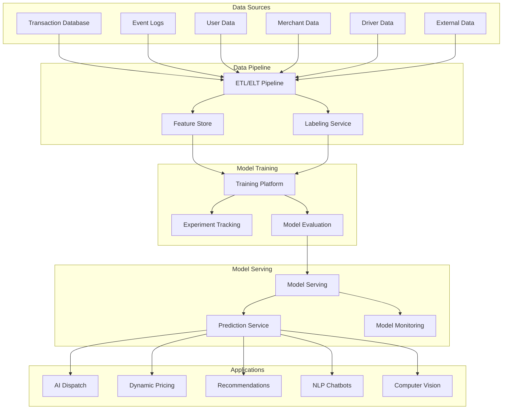
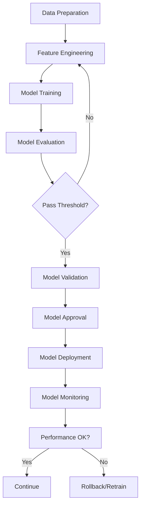

# Software Requirements Specification (SRS)

## Part 15B: AI & Machine Learning

**Module:** Future Roadmap & Platform Evolution (Part 15)
**Version:** 1.0.0
**Status:** Final / For Review
**Date:** 2026-06-30

---

## Chapter 1 – Overview

### Purpose

The AI & Machine Learning module defines the comprehensive artificial intelligence and machine learning capabilities for the **[Platform Name]** platform. This encompasses predictive models, personalization, natural language processing (NLP), computer vision, recommendation systems, MLOps, and AI governance.

AI is the intelligent core of the platform's future evolution. It enables predictive dispatch, dynamic pricing, personalized experiences, automated customer support, and intelligent logistics optimization. This module ensures that AI capabilities are developed, deployed, and managed with reliability, explainability, and ethical considerations.

### Objectives

- Enable predictive analytics and forecasting
- Deliver personalized customer experiences
- Automate customer support with NLP
- Optimize logistics with AI-driven routing
- Provide intelligent recommendations
- Ensure MLOps and model governance
- Maintain explainability and fairness
- Drive continuous learning and improvement

---

## Chapter 2 – AI Architecture

### AI-001 AI Architecture Overview

### AI-002 AI Components

| Component | Description | Priority |
| :--- | :--- | :--- |
| **Data Pipeline** | ETL/ELT for AI data | **Required** |
| **Feature Store** | Centralized feature management | **Required** |
| **Training Platform** | Model training and experimentation | **Required** |
| **Model Registry** | Versioned model storage | **Required** |
| **Model Serving** | Real-time and batch inference | **Required** |
| **Prediction Service** | Unified prediction API | **Required** |
| **Model Monitoring** | Performance and drift monitoring | **Required** |
| **Experiment Tracking** | Experiment logging and comparison | **Required** |

---

## Chapter 3 – Predictive Models

### AI-003 Predictive Model Types

| Model | Description | Priority |
| :--- | :--- | :--- |
| **Demand Forecasting** | Predict order volume by time/location | **Required** |
| **Delivery Time Prediction** | Predict ETA for deliveries | **Required** |
| **Customer Churn Prediction** | Identify customers at risk | **Required** |
| **Customer Lifetime Value (LTV)** | Predict customer lifetime value | **Required** |
| **Driver Availability Prediction** | Predict driver supply | **Required** |
| **Surge Pricing Prediction** | Predict surge pricing needs | **Required** |
| **Fraud Detection** | Identify fraudulent transactions | **Required** |
| **Merchant Performance Prediction** | Predict merchant performance | **Required** |
| **Order Cancellation Prediction** | Predict likelihood of cancellation | **Required** |

### AI-004 Demand Forecasting Model

| Parameter | Description | Priority |
| :--- | :--- | :--- |
| **Input Features** | Historical orders, time, day, weather, events | **Required** |
| **Model Type** | Time-series (Prophet, LSTM, Transformer) | **Required** |
| **Output** | Predicted order volume by hour/day | **Required** |
| **Horizon** | 7 days | **Required** |
| **Update Frequency** | Daily | **Required** |

### AI-005 Delivery Time Prediction Model

| Parameter | Description | Priority |
| :--- | :--- | :--- |
| **Input Features** | Distance, traffic, weather, time, driver history | **Required** |
| **Model Type** | Gradient Boosting (XGBoost, LightGBM) | **Required** |
| **Output** | Predicted delivery time (minutes) | **Required** |
| **Update Frequency** | Real-time (with traffic updates) | **Required** |

### AI-006 Customer Churn Prediction Model

| Parameter | Description | Priority |
| :--- | :--- | :--- |
| **Input Features** | Order frequency, recency, value, engagement | **Required** |
| **Model Type** | Classification (Logistic Regression, Random Forest) | **Required** |
| **Output** | Churn probability (0-1) | **Required** |
| **Update Frequency** | Weekly | **Required** |

### AI-007 Model Data Model

| Column | Type | Constraints | Description |
| :--- | :--- | :--- | :--- |
| `model_id` | UUID | PRIMARY KEY | Unique identifier |
| `model_name` | VARCHAR(100) | NOT NULL | Model name |
| `model_type` | VARCHAR(30) | NOT NULL | DEMAND/DELIVERY/CHURN/LTV/AVAILABILITY/SURGE/FRAUD/MERCHANT/CANCELLATION |
| `model_algorithm` | VARCHAR(50) | NOT NULL | LSTM/XGBOOST/PROPHET/RANDOM_FOREST/LIGHTGBM/TRANSFORMER |
| `model_version` | VARCHAR(20) | NOT NULL | Semantic version |
| `model_url` | VARCHAR(500) | | Model artifact URL |
| `features` | JSONB` | | Input feature list |
| `target` | VARCHAR(50) | | Target variable |
| `accuracy` | DECIMAL(5, 2) | | Accuracy metric |
| `precision` | DECIMAL(5, 2) | | Precision |
| `recall` | DECIMAL(5, 2) | | Recall |
| `f1_score` | DECIMAL(5, 2) | | F1 score |
| `status` | VARCHAR(20) | DEFAULT 'TRAINING' | TRAINING/EVALUATING/STAGING/PRODUCTION/DEPRECATED |
| `deployed_at` | TIMESTAMP | | Deployment timestamp |
| `deprecated_at` | TIMESTAMP | | Deprecation timestamp |
| `created_at` | TIMESTAMP | DEFAULT NOW() | Creation timestamp |
| `updated_at` | TIMESTAMP | DEFAULT NOW() | Last update timestamp |

---

## Chapter 4 – Personalization & Recommendations

### AI-008 Personalization Features

| Feature | Description | Priority |
| :--- | :--- | :--- |
| **Personalized Homepage** | Dynamic content based on user preferences | **Required** |
| **Personalized Recommendations** | Product and merchant recommendations | **Required** |
| **Personalized Search** | Search results tailored to user | **Required** |
| **Personalized Offers** | Targeted promotions and discounts | **Required** |
| **Personalized Notifications** | Timing and content optimization | **Required** |
| **Personalized Pricing** | Dynamic pricing based on user segment | **Required** |

### AI-009 Recommendation Engine

| Parameter | Description | Priority |
| :--- | :--- | :--- |
| **Algorithm** | Collaborative filtering, content-based, hybrid | **Required** |
| **Data Sources** | Order history, browsing, ratings, preferences | **Required** |
| **Output** | Ranked list of merchants/items | **Required** |
| **Update Frequency** | Real-time | **Required** |
| **Cold Start** | Handle new users and items | **Required** |

### AI-010 Recommendation Data Model

| Column | Type | Constraints | Description |
| :--- | :--- | :--- | :--- |
| `recommendation_id` | UUID | PRIMARY KEY | Unique identifier |
| `user_id` | UUID | | User identifier |
| `item_id` | UUID | | Item/merchant identifier |
| `score` | DECIMAL(5, 2) | | Recommendation score |
| `recommendation_type` | VARCHAR(30) | NOT NULL | MERCHANT/ITEM/CATEGORY/PROMOTION |
| `model_id` | UUID | | Model used |
| `reason` | VARCHAR(255) | | Explanation |
| `impression_timestamp` | TIMESTAMP | | When recommendation was shown |
| `clicked` | BOOLEAN | DEFAULT FALSE | Whether clicked |
| `converted` | BOOLEAN` | DEFAULT FALSE | Whether converted |
| `created_at` | TIMESTAMP | DEFAULT NOW() | Creation timestamp |

---

## Chapter 5 – Natural Language Processing (NLP)

### AI-011 NLP Capabilities

| Capability | Description | Priority |
| :--- | :--- | :--- |
| **Customer Support Chatbot** | AI-powered support assistant | **Required** |
| **Sentiment Analysis** | Analyze customer feedback | **Required** |
| **Text Classification** | Categorize support tickets | **Required** |
| **Intent Recognition** | Understand customer intent | **Required** |
| **Named Entity Recognition** | Extract entities (orders, merchants) | **Required** |
| **Language Translation** | Real-time message translation | **Required** |
| **Voice Assistants** | Voice-based order placement | **Required** |
| **Review Summarization** | Summarize customer reviews | **Required** |

### AI-012 Chatbot Features

| Feature | Description | Priority |
| :--- | :--- | :--- |
| **Multi-language** | Support for multiple languages | **Required** |
| **Contextual Understanding** | Maintain conversation context | **Required** |
| **Intent Classification** | Understand user intent | **Required** |
| **Entity Extraction** | Extract order IDs, dates, items | **Required** |
| **Fallback to Human** | Escalate when confidence is low | **Required** |
| **Sentiment Detection** | Detect customer sentiment | **Required** |
| **Proactive Suggestions** | Suggest solutions | **Required** |
| **Conversation History** | Persistent conversation history | **Required** |

### AI-013 Chatbot Data Model

| Column | Type | Constraints | Description |
| :--- | :--- | :--- | :--- |
| `conversation_id` | UUID | PRIMARY KEY | Unique identifier |
| `user_id` | UUID | | User identifier |
| `message_id` | UUID | | Message identifier |
| `message` | TEXT | NOT NULL | User message |
| `response` | TEXT | | Bot response |
| `intent` | VARCHAR(50) | | Identified intent |
| `entities` | JSONB` | | Extracted entities |
| `confidence` | DECIMAL(5, 2) | | Confidence score |
| `sentiment` | VARCHAR(20) | | POSITIVE/NEUTRAL/NEGATIVE |
| `escalated` | BOOLEAN` | DEFAULT FALSE | Escalated to human |
| `escalated_at` | TIMESTAMP | | Escalation timestamp |
| `resolved_by_human` | BOOLEAN` | DEFAULT FALSE | Resolved by human |
| `created_at` | TIMESTAMP | DEFAULT NOW() | Creation timestamp |

---

## Chapter 6 – Computer Vision

### AI-014 Computer Vision Capabilities

| Capability | Description | Priority |
| :--- | :--- | :--- |
| **Menu Image Recognition** | Extract menu items from photos | **Required** |
| **Product Recognition** | Identify products from images | **Required** |
| **Quality Inspection** | Inspect food quality from photos | **Required** |
| **Document Verification** | Verify IDs, licenses, and documents | **Required** |
| **Driver Identity Verification** | Facial recognition for drivers | **Required** |
| **Delivery Photo Verification** | Validate delivery proof photos | **Required** |
| **Logo Recognition** | Recognize merchant logos | **Required** |

### AI-015 Image Recognition Data Model

| Column | Type | Constraints | Description |
| :--- | :--- | :--- | :--- |
| `image_id` | UUID | PRIMARY KEY | Unique identifier |
| `image_url` | VARCHAR(500) | NOT NULL | Image URL |
| `image_type` | VARCHAR(30) | NOT NULL | MENU/PRODUCT/QUALITY/DOCUMENT/DRIVER/DELIVERY/LOGO |
| `labels` | JSONB` | | Recognized labels |
| `confidence` | DECIMAL(5, 2) | | Confidence score |
| `model_id` | UUID | | Model used |
| `verification_status` | VARCHAR(20) | | PENDING/VERIFIED/REJECTED |
| `verified_by` | UUID | | Verifier identifier |
| `verified_at` | TIMESTAMP | | Verification timestamp |
| `created_at` | TIMESTAMP | DEFAULT NOW() | Creation timestamp |

---

## Chapter 7 – MLOps

### AI-016 MLOps Features

| Feature | Description | Priority |
| :--- | :--- | :--- |
| **Data Versioning** | Version control for datasets | **Required** |
| **Model Versioning** | Version control for models | **Required** |
| **Experiment Tracking** | Track hyperparameters, metrics | **Required** |
| **Model Registry** | Centralized model repository | **Required** |
| **CI/CD for ML** | Automated model deployment | **Required** |
| **Model Monitoring** | Performance and drift monitoring | **Required** |
| **Model Retraining** | Scheduled model retraining | **Required** |
| **Model Explainability** | SHAP, LIME explanations | **Required** |
| **Model Governance** | Approval and compliance | **Required** |

### AI-017 Model Deployment Pipeline

### AI-018 Model Monitoring Metrics

| Metric | Description | Priority |
| :--- | :--- | :--- |
| **Prediction Accuracy** | Accuracy over time | **Required** |
| **Prediction Latency** | Inference time | **Required** |
| **Model Drift** | Data drift and concept drift | **Required** |
| **Prediction Distribution** | Distribution of predictions | **Required** |
| **Error Rate** | Error rate over time | **Required** |
| **Confidence Calibration** | Confidence calibration | **Required** |

### AI-019 Model Monitoring Data Model

| Column | Type | Constraints | Description |
| :--- | :--- | :--- | :--- |
| `monitor_id` | UUID | PRIMARY KEY | Unique identifier |
| `model_id` | UUID | FOREIGN KEY (ai_models.model_id) | Associated model |
| `date` | DATE | NOT NULL | Date |
| `accuracy` | DECIMAL(5, 2) | | Accuracy |
| `precision` | DECIMAL(5, 2) | | Precision |
| `recall` | DECIMAL(5, 2) | | Recall |
| `f1_score` | DECIMAL(5, 2) | | F1 score |
| `latency_ms` | INTEGER | | Prediction latency |
| `drift_score` | DECIMAL(5, 2) | | Drift score |
| `prediction_count` | INTEGER | | Number of predictions |
| `error_count` | INTEGER | | Error count |
| `alert_triggered` | BOOLEAN` | DEFAULT FALSE | Alert triggered |
| `created_at` | TIMESTAMP | DEFAULT NOW() | Creation timestamp |
| `updated_at` | TIMESTAMP | DEFAULT NOW() | Last update timestamp |

---

## Chapter 8 – AI Governance

### AI-020 Governance Principles

| Principle | Description | Priority |
| :--- | :--- | :--- |
| **Explainability** | Models must be explainable | **Required** |
| **Fairness** | Models must be fair and unbiased | **Required** |
| **Privacy** | Models must protect user privacy | **Required** |
| **Transparency** | Model decisions must be transparent | **Required** |
| **Accountability** | Model outcomes must be accountable | **Required** |
| **Human Oversight** | Humans must supervise AI decisions | **Required** |

### AI-021 Governance Controls

| Control | Description | Priority |
| :--- | :--- | :--- |
| **Model Approval** | Human approval before deployment | **Required** |
| **Bias Testing** | Test for algorithmic bias | **Required** |
| **Explainability Reports** | Generate explainability reports | **Required** |
| **Privacy Impact Assessment** | Assess privacy impact | **Required** |
| **Model Audit** | Regular model audits | **Required** |
| **Incident Response** | AI incident response plan | **Required** |

### AI-022 Bias Testing Data Model

| Column | Type | Constraints | Description |
| :--- | :--- | :--- | :--- |
| `bias_test_id` | UUID | PRIMARY KEY | Unique identifier |
| `model_id` | UUID | FOREIGN KEY (ai_models.model_id) | Associated model |
| `test_date` | DATE | NOT NULL | Test date |
| `feature_name` | VARCHAR(100) | NOT NULL | Feature tested |
| `bias_score` | DECIMAL(5, 2) | | Bias score |
| `bias_threshold` | DECIMAL(5, 2) | | Threshold |
| `status` | VARCHAR(20) | DEFAULT 'PASS' | PASS/FAIL/REVIEW |
| `explanation` | TEXT | | Explanation of bias |
| `mitigation_actions` | TEXT` | | Mitigation actions |
| `created_at` | TIMESTAMP | DEFAULT NOW() | Creation timestamp |
| `updated_at` | TIMESTAMP | DEFAULT NOW() | Last update timestamp |

---

## Chapter 9 – Database Tables

### ai_models

| Column | Type | Constraints | Description |
| :--- | :--- | :--- | :--- |
| `model_id` | UUID | PRIMARY KEY | Unique identifier |
| `model_name` | VARCHAR(100) | NOT NULL | Model name |
| `model_type` | VARCHAR(30) | NOT NULL | DEMAND/DELIVERY/CHURN/LTV/AVAILABILITY/SURGE/FRAUD/MERCHANT/CANCELLATION |
| `model_algorithm` | VARCHAR(50) | NOT NULL | LSTM/XGBOOST/PROPHET/RANDOM_FOREST/LIGHTGBM/TRANSFORMER |
| `model_version` | VARCHAR(20) | NOT NULL | Semantic version |
| `model_url` | VARCHAR(500) | | Model artifact URL |
| `features` | JSONB | | Input feature list |
| `target` | VARCHAR(50) | | Target variable |
| `accuracy` | DECIMAL(5, 2) | | Accuracy metric |
| `precision` | DECIMAL(5, 2) | | Precision |
| `recall` | DECIMAL(5, 2) | | Recall |
| `f1_score` | DECIMAL(5, 2) | | F1 score |
| `status` | VARCHAR(20) | DEFAULT 'TRAINING' | TRAINING/EVALUATING/STAGING/PRODUCTION/DEPRECATED |
| `deployed_at` | TIMESTAMP | | Deployment timestamp |
| `deprecated_at` | TIMESTAMP | | Deprecation timestamp |
| `created_at` | TIMESTAMP | DEFAULT NOW() | Creation timestamp |
| `updated_at` | TIMESTAMP | DEFAULT NOW() | Last update timestamp |

### ai_recommendations

| Column | Type | Constraints | Description |
| :--- | :--- | :--- | :--- |
| `recommendation_id` | UUID | PRIMARY KEY | Unique identifier |
| `user_id` | UUID | | User identifier |
| `item_id` | UUID | | Item/merchant identifier |
| `score` | DECIMAL(5, 2) | | Recommendation score |
| `recommendation_type` | VARCHAR(30) | NOT NULL | MERCHANT/ITEM/CATEGORY/PROMOTION |
| `model_id` | UUID | | Model used |
| `reason` | VARCHAR(255) | | Explanation |
| `impression_timestamp` | TIMESTAMP | | When recommendation was shown |
| `clicked` | BOOLEAN | DEFAULT FALSE | Whether clicked |
| `converted` | BOOLEAN | DEFAULT FALSE | Whether converted |
| `created_at` | TIMESTAMP | DEFAULT NOW() | Creation timestamp |

### ai_chatbot_conversations

| Column | Type | Constraints | Description |
| :--- | :--- | :--- | :--- |
| `conversation_id` | UUID | PRIMARY KEY | Unique identifier |
| `user_id` | UUID | | User identifier |
| `message_id` | UUID | | Message identifier |
| `message` | TEXT | NOT NULL | User message |
| `response` | TEXT | | Bot response |
| `intent` | VARCHAR(50) | | Identified intent |
| `entities` | JSONB` | | Extracted entities |
| `confidence` | DECIMAL(5, 2) | | Confidence score |
| `sentiment` | VARCHAR(20) | | POSITIVE/NEUTRAL/NEGATIVE |
| `escalated` | BOOLEAN | DEFAULT FALSE | Escalated to human |
| `escalated_at` | TIMESTAMP | | Escalation timestamp |
| `resolved_by_human` | BOOLEAN | DEFAULT FALSE | Resolved by human |
| `created_at` | TIMESTAMP | DEFAULT NOW() | Creation timestamp |

### ai_images

| Column | Type | Constraints | Description |
| :--- | :--- | :--- | :--- |
| `image_id` | UUID | PRIMARY KEY | Unique identifier |
| `image_url` | VARCHAR(500) | NOT NULL | Image URL |
| `image_type` | VARCHAR(30) | NOT NULL | MENU/PRODUCT/QUALITY/DOCUMENT/DRIVER/DELIVERY/LOGO |
| `labels` | JSONB | | Recognized labels |
| `confidence` | DECIMAL(5, 2) | | Confidence score |
| `model_id` | UUID | | Model used |
| `verification_status` | VARCHAR(20) | | PENDING/VERIFIED/REJECTED |
| `verified_by` | UUID | | Verifier identifier |
| `verified_at` | TIMESTAMP | | Verification timestamp |
| `created_at` | TIMESTAMP | DEFAULT NOW() | Creation timestamp |

### ai_model_monitoring

| Column | Type | Constraints | Description |
| :--- | :--- | :--- | :--- |
| `monitor_id` | UUID | PRIMARY KEY | Unique identifier |
| `model_id` | UUID | FOREIGN KEY (ai_models.model_id) | Associated model |
| `date` | DATE | NOT NULL | Date |
| `accuracy` | DECIMAL(5, 2) | | Accuracy |
| `precision` | DECIMAL(5, 2) | | Precision |
| `recall` | DECIMAL(5, 2) | | Recall |
| `f1_score` | DECIMAL(5, 2) | | F1 score |
| `latency_ms` | INTEGER | | Prediction latency |
| `drift_score` | DECIMAL(5, 2) | | Drift score |
| `prediction_count` | INTEGER | | Number of predictions |
| `error_count` | INTEGER | | Error count |
| `alert_triggered` | BOOLEAN | DEFAULT FALSE | Alert triggered |
| `created_at` | TIMESTAMP | DEFAULT NOW() | Creation timestamp |
| `updated_at` | TIMESTAMP | DEFAULT NOW() | Last update timestamp |

### ai_bias_tests

| Column | Type | Constraints | Description |
| :--- | :--- | :--- | :--- |
| `bias_test_id` | UUID | PRIMARY KEY | Unique identifier |
| `model_id` | UUID | FOREIGN KEY (ai_models.model_id) | Associated model |
| `test_date` | DATE | NOT NULL | Test date |
| `feature_name` | VARCHAR(100) | NOT NULL | Feature tested |
| `bias_score` | DECIMAL(5, 2) | | Bias score |
| `bias_threshold` | DECIMAL(5, 2) | | Threshold |
| `status` | VARCHAR(20) | DEFAULT 'PASS' | PASS/FAIL/REVIEW |
| `explanation` | TEXT | | Explanation of bias |
| `mitigation_actions` | TEXT | | Mitigation actions |
| `created_at` | TIMESTAMP | DEFAULT NOW() | Creation timestamp |
| `updated_at` | TIMESTAMP | DEFAULT NOW() | Last update timestamp |

---

## Chapter 10 – REST APIs

### Model APIs

| Method | Endpoint | Description |
| :--- | :--- | :--- |
| `GET` | `/api/v1/ai/models` | List AI models |
| `GET` | `/api/v1/ai/models/{id}` | Get model details |
| `POST` | `/api/v1/ai/models` | Create model |
| `PUT` | `/api/v1/ai/models/{id}` | Update model |
| `DELETE` | `/api/v1/ai/models/{id}` | Delete model |
| `POST` | `/api/v1/ai/models/{id}/deploy` | Deploy model |
| `POST` | `/api/v1/ai/models/{id}/deprecate` | Deprecate model |
| `POST` | `/api/v1/ai/models/{id}/predict` | Run prediction |

### Prediction APIs

| Method | Endpoint | Description |
| :--- | :--- | :--- |
| `POST` | `/api/v1/ai/predict/demand` | Predict demand |
| `POST` | `/api/v1/ai/predict/delivery` | Predict delivery time |
| `POST` | `/api/v1/ai/predict/churn` | Predict customer churn |
| `POST` | `/api/v1/ai/predict/ltv` | Predict customer LTV |
| `POST` | `/api/v1/ai/predict/surge` | Predict surge pricing |
| `POST` | `/api/v1/ai/predict/fraud` | Predict fraud |
| `POST` | `/api/v1/ai/predict/cancellation` | Predict order cancellation |

### Recommendation APIs

| Method | Endpoint | Description |
| :--- | :--- | :--- |
| `GET` | `/api/v1/ai/recommendations/user/{id}` | Get user recommendations |
| `GET` | `/api/v1/ai/recommendations/merchants` | Get merchant recommendations |
| `GET` | `/api/v1/ai/recommendations/items` | Get item recommendations |
| `POST` | `/api/v1/ai/recommendations/feedback` | Submit feedback on recommendation |

### NLP APIs

| Method | Endpoint | Description |
| :--- | :--- | :--- |
| `POST` | `/api/v1/ai/nlp/chat` | Chat with AI assistant |
| `POST` | `/api/v1/ai/nlp/sentiment` | Analyze sentiment |
| `POST` | `/api/v1/ai/nlp/classify` | Classify text |
| `POST` | `/api/v1/ai/nlp/entities` | Extract entities |
| `POST` | `/api/v1/ai/nlp/translate` | Translate text |

### Vision APIs

| Method | Endpoint | Description |
| :--- | :--- | :--- |
| `POST` | `/api/v1/ai/vision/recognize` | Recognize image content |
| `POST` | `/api/v1/ai/vision/verify` | Verify document/image |
| `POST` | `/api/v1/ai/vision/quality` | Assess quality from image |

### Monitoring APIs

| Method | Endpoint | Description |
| :--- | :--- | :--- |
| `GET` | `/api/v1/ai/monitoring/models` | Get model monitoring |
| `GET` | `/api/v1/ai/monitoring/models/{id}` | Get model monitoring details |
| `GET` | `/api/v1/ai/monitoring/drift` | Get drift detection |

### Governance APIs

| Method | Endpoint | Description |
| :--- | :--- | :--- |
| `GET` | `/api/v1/ai/governance/bias` | Get bias testing results |
| `POST` | `/api/v1/ai/governance/bias` | Run bias test |
| `GET` | `/api/v1/ai/governance/explain` | Get model explanation |
| `GET` | `/api/v1/ai/governance/audit` | Get model audit report |

---

## Chapter 11 – Business Rules

| Rule ID | Rule Description | Priority |
| :--- | :--- | :--- |
| **BR-AI-001** | All models must be explainable (SHAP/LIME). | **High** |
| **BR-AI-002** | Models must be validated before production deployment. | **High** |
| **BR-AI-003** | Bias testing must be performed for all models. | **High** |
| **BR-AI-004** | Model drift must be monitored continuously. | **High** |
| **BR-AI-005** | High-risk decisions (fraud, churn) require human oversight. | **High** |
| **BR-AI-006** | Model retraining must occur at least weekly. | **High** |
| **BR-AI-007** | Model performance must be reported weekly. | **High** |
| **BR-AI-008** | AI incidents must be logged and investigated. | **High** |
| **BR-AI-009** | User data used for AI must be anonymized. | **High** |
| **BR-AI-010** | Models must meet privacy regulations (GDPR, CCPA). | **High** |

---

## Chapter 12 – Acceptance Tests

| Test ID | Test Description | Priority |
| :--- | :--- | :--- |
| **TEST-AI-001** | Demand forecast predicts order volume accurately. | **High** |
| **TEST-AI-002** | Delivery time prediction is accurate. | **High** |
| **TEST-AI-003** | Churn prediction identifies at-risk customers. | **High** |
| **TEST-AI-004** | LTV prediction is accurate. | **High** |
| **TEST-AI-005** | Surge pricing prediction works correctly. | **High** |
| **TEST-AI-006** | Fraud detection identifies fraudulent transactions. | **High** |
| **TEST-AI-007** | Recommendations are personalized and relevant. | **High** |
| **TEST-AI-008** | Chatbot handles customer queries effectively. | **High** |
| **TEST-AI-009** | Chatbot escalates correctly to human. | **High** |
| **TEST-AI-010** | Sentiment analysis is accurate. | **High** |
| **TEST-AI-011** | Image recognition works correctly. | **High** |
| **TEST-AI-012** | Model deployment pipeline works correctly. | **High** |
| **TEST-AI-013** | Model monitoring detects drift. | **High** |
| **TEST-AI-014** | Bias testing identifies bias. | **High** |
| **TEST-AI-015** | Model explainability generates meaningful explanations. | **High** |
| **TEST-AI-016** | Model retraining improves performance. | **High** |
| **TEST-AI-017** | Model performance is reported correctly. | **High** |
| **TEST-AI-018** | Personalization improves user engagement. | **High** |
| **TEST-AI-019** | Translation works correctly. | **High** |
| **TEST-AI-020** | Model governance controls are enforced. | **High** |

---

## Chapter 13 – Traceability Matrix

| Requirement | Database Table | API Endpoint(s) | Acceptance Test |
| :--- | :--- | :--- | :--- |
| AI-003 | ai_models | GET /api/v1/ai/models | TEST-AI-001, TEST-AI-002, TEST-AI-003, TEST-AI-004, TEST-AI-005, TEST-AI-006 |
| AI-008 | ai_recommendations | GET /api/v1/ai/recommendations/user/{id} | TEST-AI-007 |
| AI-011 | ai_chatbot_conversations | POST /api/v1/ai/nlp/chat | TEST-AI-008, TEST-AI-009, TEST-AI-019 |
| AI-011 | ai_chatbot_conversations | POST /api/v1/ai/nlp/sentiment | TEST-AI-010 |
| AI-014 | ai_images | POST /api/v1/ai/vision/recognize | TEST-AI-011 |
| AI-016 | ai_models | POST /api/v1/ai/models/{id}/deploy | TEST-AI-012 |
| AI-018 | ai_model_monitoring | GET /api/v1/ai/monitoring/models | TEST-AI-013, TEST-AI-016 |
| AI-021 | ai_bias_tests | POST /api/v1/ai/governance/bias | TEST-AI-014 |
| AI-020 | ai_models | GET /api/v1/ai/governance/explain | TEST-AI-015 |
| AI-016 | ai_model_monitoring | GET /api/v1/ai/monitoring/models/{id} | TEST-AI-017 |
| AI-008 | ai_recommendations | POST /api/v1/ai/recommendations/feedback | TEST-AI-018 |
| AI-020 | ai_models | GET /api/v1/ai/governance/audit | TEST-AI-020 |

---

## Chapter 14 – Summary

This document establishes the complete AI and machine learning capability for the **[Platform Name]** platform. Key takeaways:

- **Predictive Models:** Demand forecasting, delivery time prediction, customer churn prediction, LTV prediction, surge pricing prediction, fraud detection, and order cancellation prediction.
- **Personalization:** Personalized recommendations, search, offers, notifications, pricing, and dynamic content.
- **Natural Language Processing:** Chatbots, sentiment analysis, text classification, intent recognition, named entity recognition, language translation, and voice assistants.
- **Computer Vision:** Menu image recognition, product recognition, quality inspection, document verification, driver identity verification, and delivery photo verification.
- **MLOps:** Data versioning, model versioning, experiment tracking, model registry, CI/CD for ML, model monitoring, retraining, explainability, and governance.
- **AI Governance:** Explainability, fairness, privacy, transparency, accountability, and human oversight.
- **Bias Testing:** Regular bias testing and mitigation.
- **Model Monitoring:** Performance, drift, latency, and error monitoring.

The AI and machine learning module enables intelligent automation, personalization, and optimization across the platform.

---

**Next Document:**

`Part_15C_Autonomous_Delivery.md`

*(This builds on AI to define autonomous delivery capabilities.)*