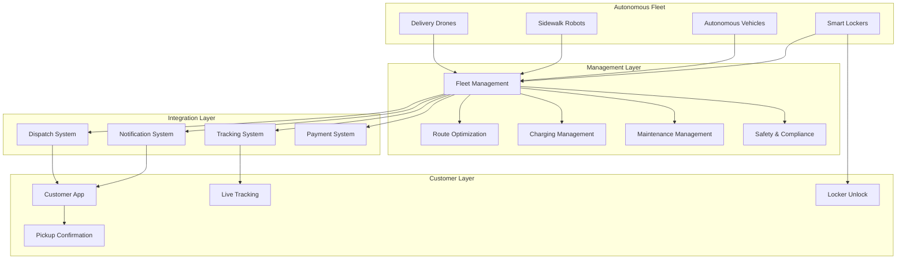

# Software Requirements Specification (SRS)

## Part 15C: Autonomous Delivery

**Module:** Future Roadmap & Platform Evolution (Part 15)
**Version:** 1.0.0
**Status:** Final / For Review
**Date:** 2026-06-30

---

## Chapter 1 – Overview

### Purpose

The Autonomous Delivery module defines the comprehensive autonomous delivery capabilities for the **[Platform Name]** platform. This encompasses drone delivery, robot delivery, autonomous vehicles, smart lockers, autonomous fulfillment, fleet management, and regulatory compliance.

Autonomous delivery is the future of logistics. It promises faster deliveries, lower costs, reduced carbon emissions, and 24/7 availability. This module ensures that the platform is prepared to integrate, manage, and scale autonomous delivery technologies as they mature and become commercially viable.

### Objectives

- Enable drone delivery integration
- Support sidewalk robot delivery
- Integrate autonomous vehicles
- Deploy smart locker networks
- Enable autonomous fulfillment centers
- Manage autonomous fleets
- Ensure regulatory compliance
- Deliver cost-effective, sustainable logistics

---

## Chapter 2 – Autonomous Delivery Architecture

### AUTO-001 Architecture Overview

### AUTO-002 Components

| Component | Description | Priority |
| :--- | :--- | :--- |
| **Fleet Management** | Manage autonomous delivery fleet | **Required** |
| **Route Optimization** | AI-driven route planning | **Required** |
| **Charging Management** | Battery and charging management | **Required** |
| **Maintenance Management** | Preventive and corrective maintenance | **Required** |
| **Safety & Compliance** | Safety monitoring and regulatory compliance | **Required** |
| **Smart Locker Network** | Secure delivery locker management | **Required** |
| **Customer App Integration** | Customer-facing delivery experience | **Required** |

---

## Chapter 3 – Drone Delivery

### AUTO-003 Drone Delivery Features

| Feature | Description | Priority |
| :--- | :--- | :--- |
| **Drone Fleet Management** | Manage drone fleet operations | **Required** |
| **Flight Planning** | AI-optimized flight paths | **Required** |
| **Weather Monitoring** | Real-time weather integration | **Required** |
| **No-Fly Zone Management** | Respect no-fly zones | **Required** |
| **Payload Management** | Weight and size limitations | **Required** |
| **Battery Management** | Battery health and charging | **Required** |
| **Remote Monitoring** | Real-time drone tracking | **Required** |
| **Emergency Landing** | Safe landing protocols | **Required** |
| **Package Release** | Automated package delivery | **Required** |

### AUTO-004 Drone Specifications

| Specification | Description | Priority |
| :--- | :--- | :--- |
| **Max Payload** | 2-5 kg | **Required** |
| **Range** | 10-20 km (round trip) | **Required** |
| **Speed** | 30-50 km/h | **Required** |
| **Flight Time** | 20-40 minutes | **Required** |
| **Weather Tolerance** | Light rain, wind < 25 km/h | **Required** |
| **GPS Accuracy** | < 1 meter | **Required** |
| **Communication** | 4G/5G, satellite backup | **Required** |

### AUTO-005 Drone Data Model

| Column | Type | Constraints | Description |
| :--- | :--- | :--- | :--- |
| `drone_id` | UUID | PRIMARY KEY | Unique identifier |
| `drone_model` | VARCHAR(100) | NOT NULL | Drone model |
| `drone_serial` | VARCHAR(100) | UNIQUE | Serial number |
| `max_payload_kg` | DECIMAL(5, 2) | | Max payload (kg) |
| `max_range_km` | DECIMAL(5, 2) | | Max range (km) |
| `battery_capacity` | INTEGER | | Battery capacity (mAh) |
| `status` | VARCHAR(20) | DEFAULT 'AVAILABLE' | AVAILABLE/CHARGING/MAINTENANCE/IN_FLIGHT/RETURNING |
| `current_location` | JSONB` | | Current GPS location |
| `current_mission` | UUID | | Active mission ID |
| `created_at` | TIMESTAMP | DEFAULT NOW() | Creation timestamp |
| `updated_at` | TIMESTAMP | DEFAULT NOW() | Last update timestamp |

### AUTO-006 Drone Mission Data Model

| Column | Type | Constraints | Description |
| :--- | :--- | :--- | :--- |
| `mission_id` | UUID | PRIMARY KEY | Unique identifier |
| `drone_id` | UUID | FOREIGN KEY (drones.drone_id) | Assigned drone |
| `order_id` | UUID | | Associated order |
| `pickup_location` | JSONB` | NOT NULL | Pickup coordinates |
| `dropoff_location` | JSONB` | NOT NULL | Dropoff coordinates |
| `flight_path` | JSONB` | | Flight path waypoints |
| `estimated_duration` | INTEGER | | Estimated duration (minutes) |
| `actual_duration` | INTEGER | | Actual duration (minutes) |
| `status` | VARCHAR(20) | DEFAULT 'SCHEDULED' | SCHEDULED/IN_FLIGHT/COMPLETED/FAILED/CANCELLED |
| `scheduled_at` | TIMESTAMP | | Scheduled time |
| `started_at` | TIMESTAMP | | Start timestamp |
| `completed_at` | TIMESTAMP` | | Completion timestamp |
| `failure_reason` | TEXT | | Reason for failure |
| `created_at` | TIMESTAMP | DEFAULT NOW() | Creation timestamp |
| `updated_at` | TIMESTAMP | DEFAULT NOW() | Last update timestamp |

---

## Chapter 4 – Robot Delivery

### AUTO-007 Robot Delivery Features

| Feature | Description | Priority |
| :--- | :--- | :--- |
| **Robot Fleet Management** | Manage robot fleet operations | **Required** |
| **Sidewalk Navigation** | Pedestrian path navigation | **Required** |
| **Obstacle Avoidance** | Real-time obstacle detection | **Required** |
| **Crosswalk Management** | Safe street crossing | **Required** |
| **Payload Management** | Container management | **Required** |
| **Battery Management** | Battery health and charging | **Required** |
| **Remote Monitoring** | Real-time robot tracking | **Required** |
| **Package Unlock** | Secure container unlocking | **Required** |

### AUTO-008 Robot Specifications

| Specification | Description | Priority |
| :--- | :--- | :--- |
| **Max Payload** | 10-20 kg | **Required** |
| **Range** | 5-10 km | **Required** |
| **Speed** | 5-8 km/h | **Required** |
| **Battery Life** | 8-12 hours | **Required** |
| **Terrain** | Sidewalks, crosswalks, bike lanes | **Required** |
| **Sensors** | LIDAR, cameras, ultrasonic | **Required** |
| **Communication** | 4G/5G | **Required** |

### AUTO-009 Robot Data Model

| Column | Type | Constraints | Description |
| :--- | :--- | :--- | :--- |
| `robot_id` | UUID | PRIMARY KEY | Unique identifier |
| `robot_model` | VARCHAR(100) | NOT NULL | Robot model |
| `robot_serial` | VARCHAR(100) | UNIQUE | Serial number |
| `max_payload_kg` | DECIMAL(5, 2) | | Max payload (kg) |
| `max_range_km` | DECIMAL(5, 2) | | Max range (km) |
| `battery_capacity` | INTEGER | | Battery capacity (mAh) |
| `status` | VARCHAR(20) | DEFAULT 'AVAILABLE' | AVAILABLE/CHARGING/MAINTENANCE/IN_TRANSIT/RETURNING |
| `current_location` | JSONB` | | Current GPS location |
| `current_mission` | UUID` | | Active mission ID |
| `created_at` | TIMESTAMP | DEFAULT NOW() | Creation timestamp |
| `updated_at` | TIMESTAMP | DEFAULT NOW() | Last update timestamp |

---

## Chapter 5 – Autonomous Vehicles

### AUTO-010 Autonomous Vehicle Features

| Feature | Description | Priority |
| :--- | :--- | :--- |
| **Vehicle Fleet Management** | Manage AV fleet operations | **Required** |
| **Autonomous Navigation** | Self-driving capabilities | **Required** |
| **Traffic Integration** | Real-time traffic adaptation | **Required** |
| **Safety Systems** | Collision avoidance, emergency braking | **Required** |
| **Remote Monitoring** | Real-time vehicle tracking | **Required** |
| **Payload Management** | Cargo capacity management | **Required** |
| **Charging Management** | EV charging management | **Required** |
| **Regulatory Compliance** | AV regulatory compliance | **Required** |

### AUTO-011 Autonomous Vehicle Specifications

| Specification | Description | Priority |
| :--- | :--- | :--- |
| **Max Payload** | 100-500 kg | **Required** |
| **Range** | 200-400 km | **Required** |
| **Speed** | 30-50 km/h (urban) | **Required** |
| **Battery** | Electric, 50-100 kWh | **Required** |
| **Sensors** | LIDAR, cameras, radar, ultrasonic | **Required** |
| **Communication** | 5G, V2X | **Required** |

### AUTO-012 Autonomous Vehicle Data Model

| Column | Type | Constraints | Description |
| :--- | :--- | :--- | :--- |
| `av_id` | UUID | PRIMARY KEY | Unique identifier |
| `av_model` | VARCHAR(100) | NOT NULL | Vehicle model |
| `license_plate` | VARCHAR(20) | UNIQUE | License plate |
| `max_payload_kg` | DECIMAL(5, 2) | | Max payload (kg) |
| `max_range_km` | DECIMAL(5, 2) | | Max range (km) |
| `battery_capacity` | INTEGER | | Battery capacity (kWh) |
| `status` | VARCHAR(20) | DEFAULT 'AVAILABLE' | AVAILABLE/CHARGING/MAINTENANCE/IN_TRANSIT/RETURNING |
| `current_location` | JSONB` | | Current GPS location |
| `current_mission` | UUID` | | Active mission ID |
| `created_at` | TIMESTAMP | DEFAULT NOW() | Creation timestamp |
| `updated_at` | TIMESTAMP | DEFAULT NOW() | Last update timestamp |

---

## Chapter 6 – Smart Lockers

### AUTO-013 Smart Locker Features

| Feature | Description | Priority |
| :--- | :--- | :--- |
| **Locker Network** | Distributed smart locker network | **Required** |
| **Secure Access** | QR code, OTP, biometric access | **Required** |
| **Temperature Control** | Hot/cold compartments | **Required** |
| **Real-time Monitoring** | Locker occupancy tracking | **Required** |
| **Remote Management** | Locker management dashboard | **Required** |
| **Customer Notifications** | Delivery and pickup notifications | **Required** |
| **Maintenance Alerts** | Proactive maintenance alerts | **Required** |

### AUTO-014 Locker Specifications

| Specification | Description | Priority |
| :--- | :--- | :--- |
| **Locker Size** | Small, medium, large | **Required** |
| **Temperature Control** | Ambient, chilled, frozen | **Required** |
| **Security** | QR code, OTP, biometric | **Required** |
| **Power** | Grid + battery backup | **Required** |
| **Connectivity** | 4G/5G, Wi-Fi | **Required** |
| **Accessibility** | ADA compliant | **Required** |

### AUTO-015 Smart Locker Data Model

| Column | Type | Constraints | Description |
| :--- | :--- | :--- | :--- |
| `locker_id` | UUID | PRIMARY KEY | Unique identifier |
| `location` | JSONB` | NOT NULL | GPS coordinates |
| `address` | TEXT | | Physical address |
| `locker_type` | VARCHAR(20) | NOT NULL | STANDARD/CHILLED/FROZEN |
| `capacity` | INTEGER | | Number of compartments |
| `available` | INTEGER | | Available compartments |
| `status` | VARCHAR(20) | DEFAULT 'OPERATIONAL' | OPERATIONAL/MAINTENANCE/OFFLINE |
| `created_at` | TIMESTAMP | DEFAULT NOW() | Creation timestamp |
| `updated_at` | TIMESTAMP | DEFAULT NOW() | Last update timestamp |

### AUTO-016 Locker Compartment Data Model

| Column | Type | Constraints | Description |
| :--- | :--- | :--- | :--- |
| `compartment_id` | UUID | PRIMARY KEY | Unique identifier |
| `locker_id` | UUID | FOREIGN KEY (smart_lockers.locker_id) | Associated locker |
| `compartment_size` | VARCHAR(20) | NOT NULL | SMALL/MEDIUM/LARGE |
| `is_occupied` | BOOLEAN | DEFAULT FALSE | Occupancy status |
| `order_id` | UUID | | Associated order |
| `access_code` | VARCHAR(50) | | Access code |
| `temperature` | DECIMAL(5, 2) | | Temperature reading |
| `occupied_at` | TIMESTAMP` | | Occupancy timestamp |
| `released_at` | TIMESTAMP` | | Release timestamp |
| `created_at` | TIMESTAMP | DEFAULT NOW() | Creation timestamp |
| `updated_at` | TIMESTAMP | DEFAULT NOW() | Last update timestamp |

---

## Chapter 7 – Autonomous Fulfillment

### AUTO-017 Autonomous Fulfillment Features

| Feature | Description | Priority |
| :--- | :--- | :--- |
| **Automated Picking** | Robotic item picking | **Required** |
| **Automated Packing** | Robotic packing and sealing | **Required** |
| **Inventory Management** | Real-time inventory tracking | **Required** |
| **Order Routing** | AI-optimized order routing | **Required** |
| **Quality Control** | Automated quality inspection | **Required** |
| **Dark Store Integration** | Autonomous dark store operations | **Required** |
| **Fleet Integration** | Integration with autonomous delivery | **Required** |

### AUTO-018 Dark Store Data Model

| Column | Type | Constraints | Description |
| :--- | :--- | :--- | :--- |
| `dark_store_id` | UUID | PRIMARY KEY | Unique identifier |
| `location` | JSONB` | NOT NULL | GPS coordinates |
| `address` | TEXT | | Physical address |
| `inventory_count` | INTEGER | | Total inventory items |
| `capacity` | INTEGER | | Storage capacity |
| `status` | VARCHAR(20) | DEFAULT 'OPERATIONAL' | OPERATIONAL/MAINTENANCE/OFFLINE |
| `created_at` | TIMESTAMP | DEFAULT NOW() | Creation timestamp |
| `updated_at` | TIMESTAMP | DEFAULT NOW() | Last update timestamp |

---

## Chapter 8 – Autonomous Delivery Use Cases

### AUTO-019 Use Case 1: Drone Delivery (Dark Store to Customer)

| Step | Description | Priority |
| :--- | :--- | :--- |
| **1** | Customer places order | **Required** |
| **2** | Order routed to nearest dark store | **Required** |
| **3** | Items picked and packed | **Required** |
| **4** | Package loaded onto drone | **Required** |
| **5** | Drone takes off and navigates to customer | **Required** |
| **6** | Package released at delivery location | **Required** |
| **7** | Customer notified of delivery | **Required** |
| **8** | Drone returns to base | **Required** |

### AUTO-020 Use Case 2: Robot Delivery (Merchant to Customer)

| Step | Description | Priority |
| :--- | :--- | :--- |
| **1** | Customer places order | **Required** |
| **2** | Merchant prepares order | **Required** |
| **3** | Robot dispatched to merchant | **Required** |
| **4** | Package loaded onto robot | **Required** |
| **5** | Robot navigates to customer | **Required** |
| **6** | Customer unlocks robot container | **Required** |
| **7** | Customer retrieves package | **Required** |
| **8** | Robot returns to base | **Required** |

### AUTO-021 Use Case 3: Smart Locker Delivery

| Step | Description | Priority |
| :--- | :--- | :--- |
| **1** | Customer places order | **Required** |
| **2** | Delivery vehicle dispatched | **Required** |
| **3** | Package delivered to smart locker | **Required** |
| **4** | Package placed in designated compartment | **Required** |
| **5** | Customer receives access code | **Required** |
| **6** | Customer visits locker | **Required** |
| **7** | Customer enters access code | **Required** |
| **8** | Compartment opens | **Required** |
| **9** | Customer retrieves package | **Required** |

---

## Chapter 9 – Customer Experience

### AUTO-022 Customer Autonomous Delivery Features

| Feature | Description | Priority |
| :--- | :--- | :--- |
| **Live Tracking** | Real-time autonomous vehicle tracking | **Required** |
| **ETA Updates** | Dynamic ETA updates | **Required** |
| **Delivery Notifications** | Push notifications at each stage | **Required** |
| **Access Code** | QR code or OTP for locker/robot | **Required** |
| **Delivery Photos** | Photo proof of delivery | **Required** |
| **Feedback** | Rate autonomous delivery experience | **Required** |

---

## Chapter 10 – Regulatory Compliance

### AUTO-023 Regulatory Requirements

| Requirement | Description | Priority |
| :--- | :--- | :--- |
| **Aviation Authority** | Drone flight authorization | **Required** |
| **No-Fly Zones** | Respect restricted airspace | **Required** |
| **Safety Standards** | ISO safety certification | **Required** |
| **Data Privacy** | GDPR/CCPA compliance | **Required** |
| **Insurance** | Liability insurance | **Required** |
| **Local Regulations** | Regional autonomous delivery laws | **Required** |
| **Environmental** | Emissions and noise regulations | **Required** |

### AUTO-024 Compliance Data Model

| Column | Type | Constraints | Description |
| :--- | :--- | :--- | :--- |
| `compliance_id` | UUID | PRIMARY KEY | Unique identifier |
| `vehicle_type` | VARCHAR(20) | NOT NULL | DRONE/ROBOT/AV/LOCKER |
| `vehicle_id` | UUID | | Associated vehicle |
| `regulation` | VARCHAR(100) | NOT NULL | Regulation name |
| `status` | VARCHAR(20) | DEFAULT 'PENDING' | PENDING/APPROVED/REJECTED/EXPIRED |
| `approval_date` | DATE` | | Approval date |
| `expiry_date` | DATE` | | Expiry date |
| `created_at` | TIMESTAMP | DEFAULT NOW() | Creation timestamp |
| `updated_at` | TIMESTAMP | DEFAULT NOW() | Last update timestamp |

---

## Chapter 11 – Safety & Emergency

### AUTO-025 Safety Features

| Feature | Description | Priority |
| :--- | :--- | :--- |
| **Emergency Landing** | Drone emergency landing protocol | **Required** |
| **Collision Avoidance** | Obstacle detection and avoidance | **Required** |
| **Geofencing** | Virtual boundaries | **Required** |
| **Remote Kill Switch** | Emergency remote deactivation | **Required** |
| **Health Monitoring** | Real-time system health monitoring | **Required** |
| **Failover Systems** | Redundant systems | **Required** |
| **Incident Reporting** | Incident logging and reporting | **Required** |

### AUTO-026 Emergency Data Model

| Column | Type | Constraints | Description |
| :--- | :--- | :--- | :--- |
| `emergency_id` | UUID | PRIMARY KEY | Unique identifier |
| `vehicle_type` | VARCHAR(20) | NOT NULL | DRONE/ROBOT/AV |
| `vehicle_id` | UUID` | | Associated vehicle |
| `emergency_type` | VARCHAR(30) | NOT NULL | BATTERY_FAILURE/COLLISION/WEATHER/LOSS_OF_COMMUNICATION/OTHER |
| `location` | JSONB` | | Emergency location |
| `status` | VARCHAR(20) | DEFAULT 'ACTIVE' | ACTIVE/RESOLVED/INVESTIGATING |
| `resolution` | TEXT` | | Resolution description |
| `resolved_at` | TIMESTAMP` | | Resolution timestamp |
| `created_at` | TIMESTAMP | DEFAULT NOW() | Creation timestamp |
| `updated_at` | TIMESTAMP | DEFAULT NOW() | Last update timestamp |

---

## Chapter 12 – Database Tables

### autonomous_vehicles

| Column | Type | Constraints | Description |
| :--- | :--- | :--- | :--- |
| `vehicle_id` | UUID | PRIMARY KEY | Unique identifier |
| `vehicle_type` | VARCHAR(20) | NOT NULL | DRONE/ROBOT/AV |
| `vehicle_model` | VARCHAR(100) | NOT NULL | Vehicle model |
| `vehicle_serial` | VARCHAR(100) | UNIQUE | Serial number |
| `max_payload_kg` | DECIMAL(5, 2) | | Max payload (kg) |
| `max_range_km` | DECIMAL(5, 2) | | Max range (km) |
| `battery_capacity` | INTEGER | | Battery capacity |
| `status` | VARCHAR(20) | DEFAULT 'AVAILABLE' | AVAILABLE/CHARGING/MAINTENANCE/IN_TRANSIT/RETURNING |
| `current_location` | JSONB | | Current GPS location |
| `current_mission` | UUID | | Active mission ID |
| `created_at` | TIMESTAMP | DEFAULT NOW() | Creation timestamp |
| `updated_at` | TIMESTAMP | DEFAULT NOW() | Last update timestamp |

### autonomous_missions

| Column | Type | Constraints | Description |
| :--- | :--- | :--- | :--- |
| `mission_id` | UUID | PRIMARY KEY | Unique identifier |
| `vehicle_id` | UUID | FOREIGN KEY (autonomous_vehicles.vehicle_id) | Assigned vehicle |
| `order_id` | UUID | | Associated order |
| `pickup_location` | JSONB | NOT NULL | Pickup coordinates |
| `dropoff_location` | JSONB | NOT NULL | Dropoff coordinates |
| `route_path` | JSONB | | Route waypoints |
| `estimated_duration` | INTEGER | | Estimated duration (minutes) |
| `actual_duration` | INTEGER | | Actual duration (minutes) |
| `status` | VARCHAR(20) | DEFAULT 'SCHEDULED' | SCHEDULED/IN_TRANSIT/COMPLETED/FAILED/CANCELLED |
| `scheduled_at` | TIMESTAMP | | Scheduled time |
| `started_at` | TIMESTAMP | | Start timestamp |
| `completed_at` | TIMESTAMP | | Completion timestamp |
| `failure_reason` | TEXT | | Reason for failure |
| `created_at` | TIMESTAMP | DEFAULT NOW() | Creation timestamp |
| `updated_at` | TIMESTAMP | DEFAULT NOW() | Last update timestamp |

### smart_lockers

| Column | Type | Constraints | Description |
| :--- | :--- | :--- | :--- |
| `locker_id` | UUID | PRIMARY KEY | Unique identifier |
| `location` | JSONB | NOT NULL | GPS coordinates |
| `address` | TEXT | | Physical address |
| `locker_type` | VARCHAR(20) | NOT NULL | STANDARD/CHILLED/FROZEN |
| `capacity` | INTEGER | | Number of compartments |
| `available` | INTEGER | | Available compartments |
| `status` | VARCHAR(20) | DEFAULT 'OPERATIONAL' | OPERATIONAL/MAINTENANCE/OFFLINE |
| `created_at` | TIMESTAMP | DEFAULT NOW() | Creation timestamp |
| `updated_at` | TIMESTAMP | DEFAULT NOW() | Last update timestamp |

### locker_compartments

| Column | Type | Constraints | Description |
| :--- | :--- | :--- | :--- |
| `compartment_id` | UUID | PRIMARY KEY | Unique identifier |
| `locker_id` | UUID | FOREIGN KEY (smart_lockers.locker_id) | Associated locker |
| `compartment_size` | VARCHAR(20) | NOT NULL | SMALL/MEDIUM/LARGE |
| `is_occupied` | BOOLEAN | DEFAULT FALSE | Occupancy status |
| `order_id` | UUID | | Associated order |
| `access_code` | VARCHAR(50) | | Access code |
| `temperature` | DECIMAL(5, 2) | | Temperature reading |
| `occupied_at` | TIMESTAMP | | Occupancy timestamp |
| `released_at` | TIMESTAMP | | Release timestamp |
| `created_at` | TIMESTAMP | DEFAULT NOW() | Creation timestamp |
| `updated_at` | TIMESTAMP | DEFAULT NOW() | Last update timestamp |

### dark_stores

| Column | Type | Constraints | Description |
| :--- | :--- | :--- | :--- |
| `dark_store_id` | UUID | PRIMARY KEY | Unique identifier |
| `location` | JSONB | NOT NULL | GPS coordinates |
| `address` | TEXT | | Physical address |
| `inventory_count` | INTEGER | | Total inventory items |
| `capacity` | INTEGER | | Storage capacity |
| `status` | VARCHAR(20) | DEFAULT 'OPERATIONAL' | OPERATIONAL/MAINTENANCE/OFFLINE |
| `created_at` | TIMESTAMP | DEFAULT NOW() | Creation timestamp |
| `updated_at` | TIMESTAMP | DEFAULT NOW() | Last update timestamp |

### autonomous_compliance

| Column | Type | Constraints | Description |
| :--- | :--- | :--- | :--- |
| `compliance_id` | UUID | PRIMARY KEY | Unique identifier |
| `vehicle_type` | VARCHAR(20) | NOT NULL | DRONE/ROBOT/AV/LOCKER |
| `vehicle_id` | UUID | | Associated vehicle |
| `regulation` | VARCHAR(100) | NOT NULL | Regulation name |
| `status` | VARCHAR(20) | DEFAULT 'PENDING' | PENDING/APPROVED/REJECTED/EXPIRED |
| `approval_date` | DATE | | Approval date |
| `expiry_date` | DATE | | Expiry date |
| `created_at` | TIMESTAMP | DEFAULT NOW() | Creation timestamp |
| `updated_at` | TIMESTAMP | DEFAULT NOW() | Last update timestamp |

### autonomous_emergencies

| Column | Type | Constraints | Description |
| :--- | :--- | :--- | :--- |
| `emergency_id` | UUID | PRIMARY KEY | Unique identifier |
| `vehicle_type` | VARCHAR(20) | NOT NULL | DRONE/ROBOT/AV |
| `vehicle_id` | UUID | | Associated vehicle |
| `emergency_type` | VARCHAR(30) | NOT NULL | BATTERY_FAILURE/COLLISION/WEATHER/LOSS_OF_COMMUNICATION/OTHER |
| `location` | JSONB | | Emergency location |
| `status` | VARCHAR(20) | DEFAULT 'ACTIVE' | ACTIVE/RESOLVED/INVESTIGATING |
| `resolution` | TEXT | | Resolution description |
| `resolved_at` | TIMESTAMP | | Resolution timestamp |
| `created_at` | TIMESTAMP | DEFAULT NOW() | Creation timestamp |
| `updated_at` | TIMESTAMP | DEFAULT NOW() | Last update timestamp |

---

## Chapter 13 – REST APIs

### Fleet APIs

| Method | Endpoint | Description |
| :--- | :--- | :--- |
| `GET` | `/api/v1/autonomous/fleet` | List autonomous vehicles |
| `GET` | `/api/v1/autonomous/fleet/{id}` | Get vehicle details |
| `POST` | `/api/v1/autonomous/fleet` | Register vehicle |
| `PUT` | `/api/v1/autonomous/fleet/{id}` | Update vehicle |
| `DELETE` | `/api/v1/autonomous/fleet/{id}` | Remove vehicle |
| `GET` | `/api/v1/autonomous/fleet/status` | Get fleet status |
| `POST` | `/api/v1/autonomous/fleet/{id}/charge` | Start charging |
| `POST` | `/api/v1/autonomous/fleet/{id}/maintenance` | Send for maintenance |

### Mission APIs

| Method | Endpoint | Description |
| :--- | :--- | :--- |
| `GET` | `/api/v1/autonomous/missions` | List missions |
| `GET` | `/api/v1/autonomous/missions/{id}` | Get mission details |
| `POST` | `/api/v1/autonomous/missions` | Create mission |
| `POST` | `/api/v1/autonomous/missions/{id}/start` | Start mission |
| `POST` | `/api/v1/autonomous/missions/{id}/complete` | Complete mission |
| `POST` | `/api/v1/autonomous/missions/{id}/cancel` | Cancel mission |
| `GET` | `/api/v1/autonomous/missions/{id}/tracking` | Get real-time tracking |

### Locker APIs

| Method | Endpoint | Description |
| :--- | :--- | :--- |
| `GET` | `/api/v1/autonomous/lockers` | List smart lockers |
| `GET` | `/api/v1/autonomous/lockers/{id}` | Get locker details |
| `POST` | `/api/v1/autonomous/lockers` | Create locker |
| `PUT` | `/api/v1/autonomous/lockers/{id}` | Update locker |
| `DELETE` | `/api/v1/autonomous/lockers/{id}` | Delete locker |
| `GET` | `/api/v1/autonomous/lockers/{id}/availability` | Get availability |
| `POST` | `/api/v1/autonomous/lockers/{id}/access` | Access locker compartment |

### Dark Store APIs

| Method | Endpoint | Description |
| :--- | :--- | :--- |
| `GET` | `/api/v1/autonomous/dark-stores` | List dark stores |
| `GET` | `/api/v1/autonomous/dark-stores/{id}` | Get dark store details |
| `POST` | `/api/v1/autonomous/dark-stores` | Create dark store |
| `PUT` | `/api/v1/autonomous/dark-stores/{id}` | Update dark store |
| `DELETE` | `/api/v1/autonomous/dark-stores/{id}` | Delete dark store |
| `GET` | `/api/v1/autonomous/dark-stores/{id}/inventory` | Get inventory |

### Compliance APIs

| Method | Endpoint | Description |
| :--- | :--- | :--- |
| `GET` | `/api/v1/autonomous/compliance` | List compliance records |
| `GET` | `/api/v1/autonomous/compliance/{id}` | Get compliance details |
| `POST` | `/api/v1/autonomous/compliance` | Create compliance record |
| `PUT` | `/api/v1/autonomous/compliance/{id}` | Update compliance record |

### Emergency APIs

| Method | Endpoint | Description |
| :--- | :--- | :--- |
| `GET` | `/api/v1/autonomous/emergencies` | List emergencies |
| `GET` | `/api/v1/autonomous/emergencies/{id}` | Get emergency details |
| `POST` | `/api/v1/autonomous/emergencies` | Report emergency |
| `PUT` | `/api/v1/autonomous/emergencies/{id}` | Update emergency |

---

## Chapter 14 – Business Rules

| Rule ID | Rule Description | Priority |
| :--- | :--- | :--- |
| **BR-AUTO-001** | Autonomous vehicles must have valid compliance certifications. | **High** |
| **BR-AUTO-002** | Drone deliveries must avoid no-fly zones. | **High** |
| **BR-AUTO-003** | Robots must yield to pedestrians. | **High** |
| **BR-AUTO-004** | Autonomous vehicles must maintain safe distance from obstacles. | **High** |
| **BR-AUTO-005** | Smart lockers must be accessible 24/7. | **High** |
| **BR-AUTO-006** | Autonomous delivery requires customer consent. | **High** |
| **BR-AUTO-007** | Emergency protocols must be tested weekly. | **High** |
| **BR-AUTO-008** | Battery levels must be maintained above 20%. | **High** |
| **BR-AUTO-009** | Weather conditions must be within safe operating limits. | **High** |
| **BR-AUTO-010** | Autonomous missions must be monitored in real-time. | **High** |

---

## Chapter 15 – Acceptance Tests

| Test ID | Test Description | Priority |
| :--- | :--- | :--- |
| **TEST-AUTO-001** | Drone completes delivery mission successfully. | **High** |
| **TEST-AUTO-002** | Drone handles weather interruption safely. | **High** |
| **TEST-AUTO-003** | Robot completes delivery mission successfully. | **High** |
| **TEST-AUTO-004** | Robot navigates obstacles correctly. | **High** |
| **TEST-AUTO-005** | Autonomous vehicle completes delivery successfully. | **High** |
| **TEST-AUTO-006** | Smart locker stores package successfully. | **High** |
| **TEST-AUTO-007** | Customer accesses locker compartment successfully. | **High** |
| **TEST-AUTO-008** | Dark store picks and packs order successfully. | **High** |
| **TEST-AUTO-009** | Live tracking shows real-time position. | **High** |
| **TEST-AUTO-010** | Customer receives delivery notifications. | **High** |
| **TEST-AUTO-011** | Emergency landing works correctly. | **High** |
| **TEST-AUTO-012** | Collision avoidance works correctly. | **High** |
| **TEST-AUTO-013** | Geofencing prevents flight into restricted zones. | **High** |
| **TEST-AUTO-014** | Fleet management dashboard displays correctly. | **High** |
| **TEST-AUTO-015** | Battery management works correctly. | **High** |
| **TEST-AUTO-016** | Maintenance management works correctly. | **High** |
| **TEST-AUTO-017** | Compliance tracking works correctly. | **High** |
| **TEST-AUTO-018** | Customer feedback captured correctly. | **High** |
| **TEST-AUTO-019** | ETA updates are accurate. | **High** |
| **TEST-AUTO-020** | Delivery photo proof captured correctly. | **High** |

---

## Chapter 16 – Traceability Matrix

| Requirement | Database Table | API Endpoint(s) | Acceptance Test |
| :--- | :--- | :--- | :--- |
| AUTO-003 | autonomous_vehicles | POST /api/v1/autonomous/missions | TEST-AUTO-001, TEST-AUTO-002 |
| AUTO-007 | autonomous_vehicles | POST /api/v1/autonomous/missions | TEST-AUTO-003, TEST-AUTO-004 |
| AUTO-010 | autonomous_vehicles | POST /api/v1/autonomous/missions | TEST-AUTO-005 |
| AUTO-013 | smart_lockers | POST /api/v1/autonomous/lockers/{id}/access | TEST-AUTO-006, TEST-AUTO-007 |
| AUTO-017 | dark_stores | GET /api/v1/autonomous/dark-stores/{id}/inventory | TEST-AUTO-008 |
| AUTO-022 | autonomous_missions | GET /api/v1/autonomous/missions/{id}/tracking | TEST-AUTO-009, TEST-AUTO-010, TEST-AUTO-019 |
| AUTO-025 | autonomous_emergencies | POST /api/v1/autonomous/emergencies | TEST-AUTO-011, TEST-AUTO-012 |
| AUTO-023 | autonomous_compliance | GET /api/v1/autonomous/compliance | TEST-AUTO-013, TEST-AUTO-017 |
| AUTO-002 | autonomous_vehicles | GET /api/v1/autonomous/fleet | TEST-AUTO-014, TEST-AUTO-015, TEST-AUTO-016 |
| AUTO-022 | autonomous_missions | GET /api/v1/autonomous/missions/{id} | TEST-AUTO-018, TEST-AUTO-020 |

---

## Chapter 17 – Summary

This document establishes the complete autonomous delivery capability for the **[Platform Name]** platform. Key takeaways:

- **Drone Delivery:** Fleet management, flight planning, weather monitoring, no-fly zone management, payload management, battery management, and emergency landing protocols.
- **Robot Delivery:** Sidewalk navigation, obstacle avoidance, crosswalk management, payload management, and secure container unlocking.
- **Autonomous Vehicles:** Autonomous navigation, traffic integration, safety systems, remote monitoring, and EV charging management.
- **Smart Lockers:** Secure access (QR code, OTP, biometric), temperature control, real-time monitoring, and maintenance alerts.
- **Autonomous Fulfillment:** Automated picking, packing, inventory management, order routing, and quality control.
- **Customer Experience:** Live tracking, ETA updates, delivery notifications, access codes, and delivery photos.
- **Regulatory Compliance:** Aviation authority, no-fly zones, safety standards, data privacy, insurance, and local regulations.
- **Safety & Emergency:** Emergency landing, collision avoidance, geofencing, remote kill switch, health monitoring, and incident reporting.

The autonomous delivery module ensures the platform is prepared for the future of logistics with safe, efficient, and sustainable autonomous delivery options.

---

**Next Document:**

`Part_15D_Multi_Country_Expansion.md`

*(This builds on autonomous delivery to define multi-country expansion capabilities.)*