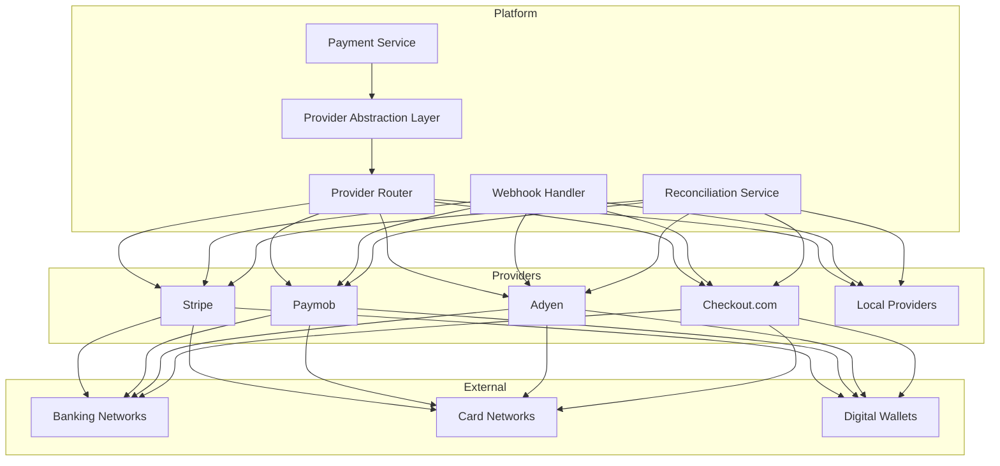
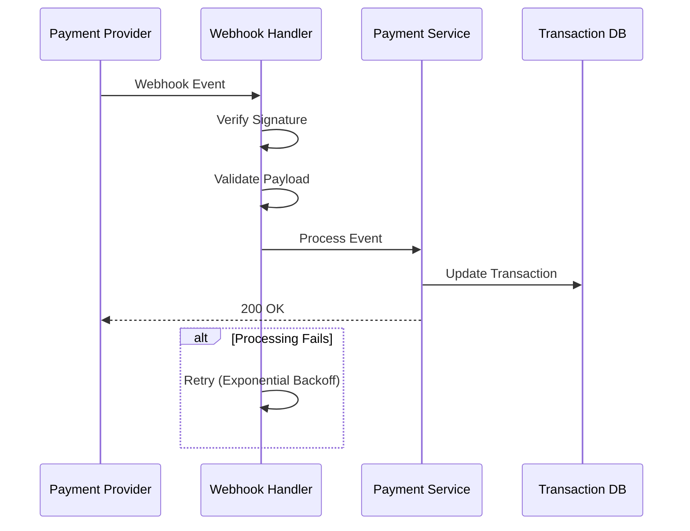

# Software Requirements Specification (SRS)

## Part 16A: Payment Provider Integrations

**Module:** Integrations & Third-Party (Part 16)
**Version:** 1.0.0
**Status:** Final / For Review
**Date:** 2026-06-30

---

## Chapter 1 – Overview

### Purpose

The Payment Provider Integrations module defines the comprehensive integration capabilities with third-party payment providers for the **[Platform Name]** platform. This encompasses payment gateway integration, payment method support, webhook handling, reconciliation, fallback mechanisms, and provider management.

Payment provider integrations are critical for processing customer payments reliably and securely. The platform must support multiple payment providers to ensure redundancy, regional coverage, and competitive pricing. This module ensures that payment integrations are secure, reliable, and maintainable.

### Objectives

- Integrate with multiple payment providers
- Support global and regional payment methods
- Enable automatic provider failover
- Process webhook events reliably
- Ensure PCI DSS compliance
- Support reconciliation and reporting
- Provide provider management capabilities
- Enable seamless payment processing

---

## Chapter 2 – Payment Provider Architecture

### PAYPROV-001 Architecture Overview

### PAYPROV-002 Components

| Component | Description | Priority |
| :--- | :--- | :--- |
| **Provider Abstraction Layer** | Unified interface for all providers | **Required** |
| **Provider Router** | Routes transactions to optimal provider | **Required** |
| **Webhook Handler** | Processes incoming webhooks | **Required** |
| **Reconciliation Service** | Reconciles provider transactions | **Required** |
| **Provider Management** | Manage provider configurations | **Required** |
| **Fallback Manager** | Handles provider failover | **Required** |
| **Health Check** | Monitors provider health | **Required** |

---

## Chapter 3 – Supported Payment Providers

### PAYPROV-003 Primary Providers

| Provider | Regions | Features | Priority |
| :--- | :--- | :--- | :--- |
| **Stripe** | Global | Cards, wallets, BNPL, subscriptions | **Required** |
| **Paymob** | MENA | Cards, wallets, local methods | **Required** |
| **Adyen** | Global (Enterprise) | Cards, wallets, BNPL, local methods | **Required** |
| **Checkout.com** | Global | Cards, wallets, local methods | **Required** |
| **PayPal** | Global | PayPal wallet | **Required** |
| **Tabby** | MENA | BNPL | **Required** |
| **Tamara** | MENA | BNPL | **Required** |
| **Klarna** | Europe, US | BNPL | **Required** |
| **Afterpay** | Australia, UK, US | BNPL | **Required** |
| **Affirm** | US, Canada | BNPL | **Required** |
| **Apple Pay** | Global | Mobile wallet | **Required** |
| **Google Pay** | Global | Mobile wallet | **Required** |

### PAYPROV-004 Regional Providers

| Region | Providers | Priority |
| :--- | :--- | :--- |
| **MENA** | Paymob, Tabby, Tamara, STC Pay, Mada | **Required** |
| **Europe** | Adyen, Klarna, iDEAL, Sofort, Bancontact | **Required** |
| **SE Asia** | Checkout.com, GrabPay, OVO, DANA, GCash | **Required** |
| **Americas** | Stripe, PayPal, Affirm, Pix, Mercado Pago | **Required** |
| **APAC** | Checkout.com, PayPay, Alipay, WeChat Pay | **Required** |
| **India** | Stripe, Razorpay, UPI, Paytm | **Required** |

### PAYPROV-005 Provider Data Model

| Column | Type | Constraints | Description |
| :--- | :--- | :--- | :--- |
| `provider_id` | UUID | PRIMARY KEY | Unique identifier |
| `provider_name` | VARCHAR(50) | NOT NULL | Provider name |
| `provider_type` | VARCHAR(30) | NOT NULL | GATEWAY/BNPL/WALLET/LOCAL |
| `regions` | TEXT[] | | Supported regions |
| `payment_methods` | TEXT[] | | Supported payment methods |
| `currencies` | TEXT[] | | Supported currencies |
| `api_key` | VARCHAR(255) | | API key (encrypted) |
| `api_secret` | VARCHAR(255) | | API secret (encrypted) |
| `webhook_secret` | VARCHAR(255) | | Webhook secret (encrypted) |
| `config` | JSONB` | | Provider-specific configuration |
| `status` | VARCHAR(20) | DEFAULT 'ACTIVE' | ACTIVE/INACTIVE/DEGRADED |
| `priority` | INTEGER | DEFAULT 1 | Routing priority |
| `created_at` | TIMESTAMP | DEFAULT NOW() | Creation timestamp |
| `updated_at` | TIMESTAMP | DEFAULT NOW() | Last update timestamp |

---

## Chapter 4 – Provider Abstraction Layer

### PAYPROV-006 Unified Payment Operations

| Operation | Description | Priority |
| :--- | :--- | :--- | 
| `authorize()` | Authorize payment | **Required** |
| `capture()` | Capture authorized payment | **Required** |
| `refund()` | Process refund | **Required** |
| `void()` | Void authorization | **Required** |
| `getStatus()` | Get transaction status | **Required** |
| `createSubscription()` | Create subscription | **Required** |
| `cancelSubscription()` | Cancel subscription | **Required** |
| `getPaymentMethod()` | Get payment method details | **Required** |
| `createToken()` | Create payment token | **Required** |

### PAYPROV-007 Provider Router Logic

| Factor | Description | Priority |
| :--- | :--- | :--- |
| **Region** | Provider availability in the region | **Required** |
| **Currency** | Provider supports the currency | **Required** |
| **Payment Method** | Provider supports the payment method | **Required** |
| **Cost** | Provider transaction fees | **Required** |
| **Availability** | Provider uptime and health | **Required** |
| **Speed** | Transaction processing speed | **Required** |
| **Reliability** | Provider success rate | **Required** |

### PAYPROV-008 Provider Failover

| Level | Description | Priority |
| :--- | :--- | :--- |
| **Level 1** | Primary provider | **Required** |
| **Level 2** | Secondary provider (same region) | **Required** |
| **Level 3** | Tertiary provider (different region) | **Required** |
| **Level 4** | Fallback provider | **Required** |

---

## Chapter 5 – Webhook Processing

### PAYPROV-009 Webhook Events

| Event | Provider | Priority |
| :--- | :--- | :--- |
| `payment_intent.succeeded` | Stripe | **Required** |
| `payment_intent.payment_failed` | Stripe | **Required** |
| `charge.succeeded` | Stripe, Adyen, Checkout | **Required** |
| `charge.failed` | Stripe, Adyen, Checkout | **Required** |
| `charge.refunded` | Stripe, Adyen, Checkout | **Required** |
| `charge.disputed` | Stripe, Adyen, Checkout | **Required** |
| `charge.dispute.closed` | Stripe, Adyen, Checkout | **Required** |
| `transaction.processed` | Paymob | **Required** |
| `transaction.failed` | Paymob | **Required** |
| `transaction.refunded` | Paymob | **Required** |
| `subscription.created` | Stripe, Adyen | **Required** |
| `subscription.updated` | Stripe, Adyen | **Required** |
| `subscription.cancelled` | Stripe, Adyen | **Required** |

### PAYPROV-010 Webhook Processing Flow

### PAYPROV-011 Webhook Data Model

| Column | Type | Constraints | Description |
| :--- | :--- | :--- | :--- |
| `webhook_id` | UUID | PRIMARY KEY | Unique identifier |
| `provider` | VARCHAR(50) | NOT NULL | Provider name |
| `event_type` | VARCHAR(50) | NOT NULL | Event type |
| `event_payload` | JSONB | NOT NULL | Full webhook payload |
| `signature` | VARCHAR(255) | | Webhook signature |
| `verified` | BOOLEAN | DEFAULT FALSE | Signature verified |
| `processed` | BOOLEAN | DEFAULT FALSE | Processing status |
| `transaction_id` | UUID | | Associated transaction |
| `processed_at` | TIMESTAMP` | | Processing timestamp |
| `retry_count` | INTEGER | DEFAULT 0 | Retry count |
| `error_message` | TEXT` | | Error message |
| `created_at` | TIMESTAMP | DEFAULT NOW() | Creation timestamp |
| `updated_at` | TIMESTAMP | DEFAULT NOW() | Last update timestamp |

---

## Chapter 6 – Reconciliation

### PAYPROV-012 Reconciliation Types

| Type | Description | Priority |
| :--- | :--- | :--- |
| **Daily Reconciliation** | Match daily provider reports | **Required** |
| **Transaction Reconciliation** | Match individual transactions | **Required** |
| **Settlement Reconciliation** | Match settlement amounts | **Required** |
| **Fee Reconciliation** | Match provider fees | **Required** |
| **Chargeback Reconciliation** | Match chargebacks | **Required** |
| **Refund Reconciliation** | Match refunds | **Required** |

### PAYPROV-013 Reconciliation Data Model

| Column | Type | Constraints | Description |
| :--- | :--- | :--- | :--- |
| `reconciliation_id` | UUID | PRIMARY KEY | Unique identifier |
| `provider` | VARCHAR(50) | NOT NULL | Provider name |
| `date` | DATE | NOT NULL | Reconciliation date |
| `total_platform_transactions` | INTEGER | | Platform transactions |
| `total_provider_transactions` | INTEGER` | | Provider transactions |
| `matched_count` | INTEGER | | Matched transactions |
| `unmatched_count` | INTEGER` | | Unmatched transactions |
| `total_platform_amount` | DECIMAL(12, 2) | | Platform amount |
| `total_provider_amount` | DECIMAL(12, 2) | | Provider amount |
| `discrepancy_amount` | DECIMAL(12, 2) | | Discrepancy amount |
| `status` | VARCHAR(20) | DEFAULT 'PENDING' | PENDING/IN_PROGRESS/RECONCILED/DISCREPANT |
| `report_url` | VARCHAR(500) | | Reconciliation report URL |
| `created_at` | TIMESTAMP | DEFAULT NOW() | Creation timestamp |
| `updated_at` | TIMESTAMP | DEFAULT NOW() | Last update timestamp |

---

## Chapter 7 – Provider Health Monitoring

### PAYPROV-014 Health Metrics

| Metric | Description | Priority |
| :--- | :--- | :--- | 
| **Availability** | Provider uptime | **Required** |
| **Latency** | Transaction processing time | **Required** |
| **Success Rate** | Transaction success percentage | **Required** |
| **Error Rate** | Transaction error percentage | **Required** |
| **Response Time** | API response time | **Required** |
| **Throughput** | Transactions per second | **Required** |

### PAYPROV-015 Health Data Model

| Column | Type | Constraints | Description |
| :--- | :--- | :--- | :--- |
| `health_id` | UUID | PRIMARY KEY | Unique identifier |
| `provider` | VARCHAR(50) | NOT NULL | Provider name |
| `timestamp` | TIMESTAMP | NOT NULL | Health check timestamp |
| `availability` | DECIMAL(5, 2) | | Availability % |
| `latency_ms` | INTEGER | | Average latency (ms) |
| `success_rate` | DECIMAL(5, 2) | | Success rate % |
| `error_rate` | DECIMAL(5, 2) | | Error rate % |
| `status` | VARCHAR(20) | DEFAULT 'HEALTHY' | HEALTHY/DEGRADED/UNHEALTHY |
| `created_at` | TIMESTAMP | DEFAULT NOW() | Creation timestamp |
| `updated_at` | TIMESTAMP | DEFAULT NOW() | Last update timestamp |

---

## Chapter 8 – Database Tables

### payment_providers

| Column | Type | Constraints | Description |
| :--- | :--- | :--- | :--- |
| `provider_id` | UUID | PRIMARY KEY | Unique identifier |
| `provider_name` | VARCHAR(50) | NOT NULL | Provider name |
| `provider_type` | VARCHAR(30) | NOT NULL | GATEWAY/BNPL/WALLET/LOCAL |
| `regions` | TEXT[] | | Supported regions |
| `payment_methods` | TEXT[] | | Supported payment methods |
| `currencies` | TEXT[] | | Supported currencies |
| `api_key` | VARCHAR(255) | | API key (encrypted) |
| `api_secret` | VARCHAR(255) | | API secret (encrypted) |
| `webhook_secret` | VARCHAR(255) | | Webhook secret (encrypted) |
| `config` | JSONB` | | Provider-specific configuration |
| `status` | VARCHAR(20) | DEFAULT 'ACTIVE' | ACTIVE/INACTIVE/DEGRADED |
| `priority` | INTEGER | DEFAULT 1 | Routing priority |
| `created_at` | TIMESTAMP | DEFAULT NOW() | Creation timestamp |
| `updated_at` | TIMESTAMP | DEFAULT NOW() | Last update timestamp |

### provider_transactions

| Column | Type | Constraints | Description |
| :--- | :--- | :--- | :--- |
| `transaction_id` | UUID | PRIMARY KEY | Unique identifier |
| `provider` | VARCHAR(50) | NOT NULL | Provider name |
| `provider_transaction_id` | VARCHAR(255) | | Provider transaction ID |
| `order_id` | UUID | | Associated order |
| `customer_id` | UUID | | Associated customer |
| `transaction_type` | VARCHAR(20) | NOT NULL | AUTHORIZATION/CAPTURE/REFUND/VOID |
| `amount` | DECIMAL(12, 2) | NOT NULL | Transaction amount |
| `currency` | VARCHAR(3) | NOT NULL | ISO 4217 currency |
| `status` | VARCHAR(20) | NOT NULL | PENDING/SUCCESS/FAILED |
| `metadata` | JSONB` | | Additional transaction data |
| `created_at` | TIMESTAMP | DEFAULT NOW() | Creation timestamp |
| `updated_at` | TIMESTAMP | DEFAULT NOW() | Last update timestamp |

### provider_webhooks

| Column | Type | Constraints | Description |
| :--- | :--- | :--- | :--- |
| `webhook_id` | UUID | PRIMARY KEY | Unique identifier |
| `provider` | VARCHAR(50) | NOT NULL | Provider name |
| `event_type` | VARCHAR(50) | NOT NULL | Event type |
| `event_payload` | JSONB | NOT NULL | Full webhook payload |
| `signature` | VARCHAR(255) | | Webhook signature |
| `verified` | BOOLEAN | DEFAULT FALSE | Signature verified |
| `processed` | BOOLEAN | DEFAULT FALSE | Processing status |
| `transaction_id` | UUID | | Associated transaction |
| `processed_at` | TIMESTAMP | | Processing timestamp |
| `retry_count` | INTEGER | DEFAULT 0 | Retry count |
| `error_message` | TEXT | | Error message |
| `created_at` | TIMESTAMP | DEFAULT NOW() | Creation timestamp |
| `updated_at` | TIMESTAMP | DEFAULT NOW() | Last update timestamp |

### provider_reconciliations

| Column | Type | Constraints | Description |
| :--- | :--- | :--- | :--- |
| `reconciliation_id` | UUID | PRIMARY KEY | Unique identifier |
| `provider` | VARCHAR(50) | NOT NULL | Provider name |
| `date` | DATE | NOT NULL | Reconciliation date |
| `total_platform_transactions` | INTEGER | | Platform transactions |
| `total_provider_transactions` | INTEGER | | Provider transactions |
| `matched_count` | INTEGER | | Matched transactions |
| `unmatched_count` | INTEGER | | Unmatched transactions |
| `total_platform_amount` | DECIMAL(12, 2) | | Platform amount |
| `total_provider_amount` | DECIMAL(12, 2) | | Provider amount |
| `discrepancy_amount` | DECIMAL(12, 2) | | Discrepancy amount |
| `status` | VARCHAR(20) | DEFAULT 'PENDING' | PENDING/IN_PROGRESS/RECONCILED/DISCREPANT |
| `report_url` | VARCHAR(500) | | Reconciliation report URL |
| `created_at` | TIMESTAMP | DEFAULT NOW() | Creation timestamp |
| `updated_at` | TIMESTAMP | DEFAULT NOW() | Last update timestamp |

### provider_health

| Column | Type | Constraints | Description |
| :--- | :--- | :--- | :--- |
| `health_id` | UUID | PRIMARY KEY | Unique identifier |
| `provider` | VARCHAR(50) | NOT NULL | Provider name |
| `timestamp` | TIMESTAMP | NOT NULL | Health check timestamp |
| `availability` | DECIMAL(5, 2) | | Availability % |
| `latency_ms` | INTEGER | | Average latency (ms) |
| `success_rate` | DECIMAL(5, 2) | | Success rate % |
| `error_rate` | DECIMAL(5, 2) | | Error rate % |
| `status` | VARCHAR(20) | DEFAULT 'HEALTHY' | HEALTHY/DEGRADED/UNHEALTHY |
| `created_at` | TIMESTAMP | DEFAULT NOW() | Creation timestamp |
| `updated_at` | TIMESTAMP | DEFAULT NOW() | Last update timestamp |

---

## Chapter 9 – REST APIs

### Provider APIs

| Method | Endpoint | Description |
| :--- | :--- | :--- |
| `GET` | `/api/v1/integrations/payment/providers` | List payment providers |
| `GET` | `/api/v1/integrations/payment/providers/{id}` | Get provider details |
| `POST` | `/api/v1/integrations/payment/providers` | Add payment provider |
| `PUT` | `/api/v1/integrations/payment/providers/{id}` | Update payment provider |
| `DELETE` | `/api/v1/integrations/payment/providers/{id}` | Remove payment provider |
| `GET` | `/api/v1/integrations/payment/providers/health` | Get provider health status |

### Webhook APIs

| Method | Endpoint | Description |
| :--- | :--- | :--- |
| `POST` | `/api/v1/integrations/payment/webhooks/stripe` | Stripe webhook endpoint |
| `POST` | `/api/v1/integrations/payment/webhooks/paymob` | Paymob webhook endpoint |
| `POST` | `/api/v1/integrations/payment/webhooks/adyen` | Adyen webhook endpoint |
| `POST` | `/api/v1/integrations/payment/webhooks/checkout` | Checkout.com webhook endpoint |
| `GET` | `/api/v1/integrations/payment/webhooks` | List webhook events |
| `GET` | `/api/v1/integrations/payment/webhooks/{id}` | Get webhook event details |
| `POST` | `/api/v1/integrations/payment/webhooks/{id}/retry` | Retry webhook processing |

### Reconciliation APIs

| Method | Endpoint | Description |
| :--- | :--- | :--- |
| `GET` | `/api/v1/integrations/payment/reconciliations` | List reconciliations |
| `GET` | `/api/v1/integrations/payment/reconciliations/{id}` | Get reconciliation details |
| `POST` | `/api/v1/integrations/payment/reconciliations` | Run reconciliation |
| `GET` | `/api/v1/integrations/payment/reconciliations/{id}/download` | Download reconciliation report |

### Transaction APIs

| Method | Endpoint | Description |
| :--- | :--- | :--- |
| `GET` | `/api/v1/integrations/payment/transactions` | List provider transactions |
| `GET` | `/api/v1/integrations/payment/transactions/{id}` | Get transaction details |
| `GET` | `/api/v1/integrations/payment/transactions/provider/{provider}` | Get transactions by provider |

---

## Chapter 10 – Business Rules

| Rule ID | Rule Description | Priority |
| :--- | :--- | :--- |
| **BR-PAYPROV-001** | Payment providers must be PCI DSS compliant. | **High** |
| **BR-PAYPROV-002** | API keys must be encrypted at rest. | **High** |
| **BR-PAYPROV-003** | Webhook signatures must be verified. | **High** |
| **BR-PAYPROV-004** | Provider failover must occur within 5 seconds. | **High** |
| **BR-PAYPROV-005** | Reconciliation must be performed daily. | **High** |
| **BR-PAYPROV-006** | Provider health must be monitored continuously. | **High** |
| **BR-PAYPROV-007** | Transactions must be idempotent across providers. | **High** |
| **BR-PAYPROV-008** | Webhook retries use exponential backoff. | **High** |
| **BR-PAYPROV-009** | Provider configuration must be version-controlled. | **High** |
| **BR-PAYPROV-010** | Provider secrets must be rotated quarterly. | **High** |

---

## Chapter 11 – Acceptance Tests

| Test ID | Test Description | Priority |
| :--- | :--- | :--- |
| **TEST-PAYPROV-001** | Stripe integration processes payment successfully. | **High** |
| **TEST-PAYPROV-002** | Paymob integration processes payment successfully. | **High** |
| **TEST-PAYPROV-003** | Adyen integration processes payment successfully. | **High** |
| **TEST-PAYPROV-004** | Checkout.com integration processes payment successfully. | **High** |
| **TEST-PAYPROV-005** | Provider failover works correctly. | **High** |
| **TEST-PAYPROV-006** | Webhook signature verification succeeds. | **High** |
| **TEST-PAYPROV-007** | Webhook signature verification fails (rejected). | **High** |
| **TEST-PAYPROV-008** | Webhook processing updates transaction status. | **High** |
| **TEST-PAYPROV-009** | Webhook retry works on failure. | **High** |
| **TEST-PAYPROV-010** | Reconciliation matches provider transactions. | **High** |
| **TEST-PAYPROV-011** | Reconciliation identifies discrepancies. | **High** |
| **TEST-PAYPROV-012** | Provider health status is accurate. | **High** |
| **TEST-PAYPROV-013** | Provider configuration updated successfully. | **High** |
| **TEST-PAYPROV-014** | Provider priority routing works correctly. | **High** |
| **TEST-PAYPROV-015** | Multi-currency payment works correctly. | **High** |
| **TEST-PAYPROV-016** | BNPL payment works correctly. | **High** |
| **TEST-PAYPROV-017** | Refund processed successfully. | **High** |
| **TEST-PAYPROV-018** | Authorization and capture work correctly. | **High** |
| **TEST-PAYPROV-019** | Void authorization works correctly. | **High** |
| **TEST-PAYPROV-020** | Provider metrics tracked correctly. | **High** |

---

## Chapter 12 – Traceability Matrix

| Requirement | Database Table | API Endpoint(s) | Acceptance Test |
| :--- | :--- | :--- | :--- |
| PAYPROV-003 | payment_providers | GET /api/v1/integrations/payment/providers | TEST-PAYPROV-001, TEST-PAYPROV-002, TEST-PAYPROV-003, TEST-PAYPROV-004 |
| PAYPROV-008 | payment_providers | GET /api/v1/integrations/payment/providers/health | TEST-PAYPROV-005 |
| PAYPROV-009 | provider_webhooks | POST /api/v1/integrations/payment/webhooks/stripe | TEST-PAYPROV-006, TEST-PAYPROV-007, TEST-PAYPROV-008, TEST-PAYPROV-009 |
| PAYPROV-012 | provider_reconciliations | GET /api/v1/integrations/payment/reconciliations | TEST-PAYPROV-010, TEST-PAYPROV-011 |
| PAYPROV-014 | provider_health | GET /api/v1/integrations/payment/providers/health | TEST-PAYPROV-012 |
| PAYPROV-005 | payment_providers | PUT /api/v1/integrations/payment/providers/{id} | TEST-PAYPROV-013 |
| PAYPROV-007 | payment_providers | GET /api/v1/integrations/payment/providers | TEST-PAYPROV-014 |
| PAYPROV-006 | provider_transactions | POST /api/v1/integrations/payment/providers | TEST-PAYPROV-015, TEST-PAYPROV-016, TEST-PAYPROV-017, TEST-PAYPROV-018, TEST-PAYPROV-019 |
| PAYPROV-014 | provider_health | GET /api/v1/integrations/payment/providers/health | TEST-PAYPROV-020 |

---

## Chapter 13 – Summary

This document establishes the complete payment provider integration capability for the **[Platform Name]** platform. Key takeaways:

- **Comprehensive Provider Support:** Stripe, Paymob, Adyen, Checkout.com, PayPal, Tabby, Tamara, Klarna, Afterpay, Affirm, Apple Pay, and Google Pay.
- **Regional Coverage:** MENA, Europe, SE Asia, Americas, APAC, and India with region-specific providers and payment methods.
- **Provider Abstraction:** Unified interface for all payment operations (authorize, capture, refund, void, getStatus, createSubscription, cancelSubscription, getPaymentMethod, createToken).
- **Provider Router:** Intelligent routing based on region, currency, payment method, cost, availability, speed, and reliability.
- **Automatic Failover:** Multi-level failover (primary → secondary → tertiary → fallback) with 5-second failover time.
- **Webhook Processing:** Signature verification, payload validation, transaction updates, and retry with exponential backoff.
- **Reconciliation:** Daily transaction reconciliation with discrepancy identification and reporting.
- **Health Monitoring:** Real-time monitoring of provider availability, latency, success rate, and error rate.

The payment provider integrations module ensures reliable, secure, and flexible payment processing across global markets.

---

**Next Document:**

`Part_16B_Mapping_Location_Services.md`

*(This builds on payment integrations to define mapping and location services integrations.)*
