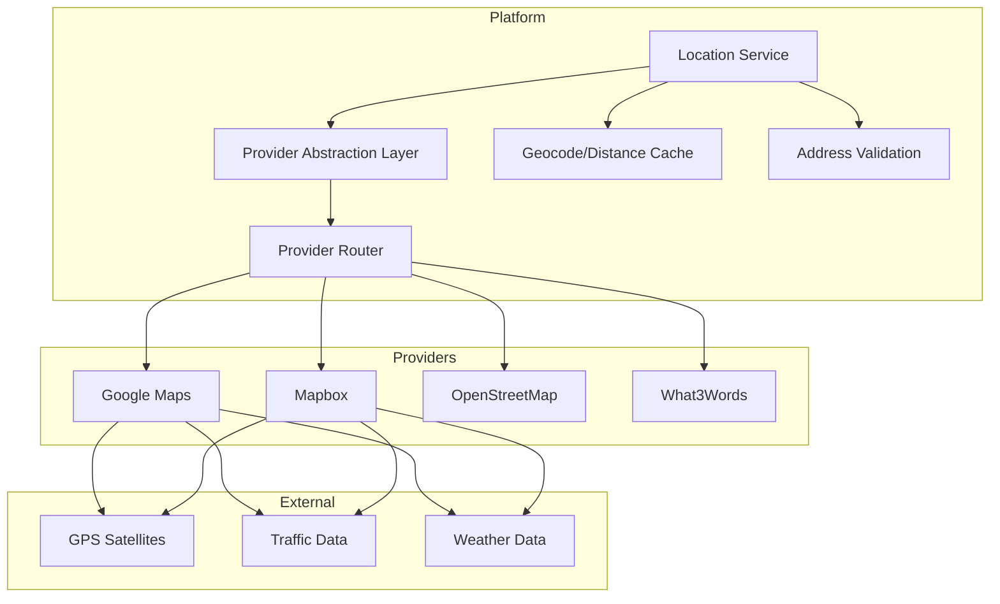

# Software Requirements Specification (SRS)

## Part 16B: Mapping & Location Services

**Module:** Integrations & Third-Party (Part 16)
**Version:** 1.0.0
**Status:** Final / For Review
**Date:** 2026-06-30

---

## Chapter 1 – Overview

### Purpose

The Mapping & Location Services module defines the comprehensive integration capabilities with third-party mapping and location service providers for the **[Platform Name]** platform. This encompasses geocoding, reverse geocoding, distance matrix calculations, routing, navigation, map visualization, and address validation.

Location services are the foundation of logistics and delivery operations. Accurate geocoding, efficient routing, and reliable navigation are essential for timely deliveries, driver efficiency, and customer satisfaction. This module ensures that the platform leverages best-in-class mapping providers while maintaining resilience, cost efficiency, and data privacy.

### Objectives

- Integrate with multiple mapping providers
- Enable accurate geocoding and reverse geocoding
- Provide efficient distance matrix calculations
- Enable optimal route planning
- Support real-time navigation
- Provide interactive map visualization
- Ensure provider failover and redundancy
- Optimize cost through caching and batching

---

## Chapter 2 – Mapping Provider Architecture

### MAPS-001 Architecture Overview

### MAPS-002 Supported Providers

| Provider | Primary Use | Priority |
| :--- | :--- | :--- |
| **Google Maps** | Geocoding, routing, maps, traffic | **Required** |
| **Mapbox** | Geocoding, routing, maps, traffic | **Required** |
| **OpenStreetMap** | Free/open provider (fallback, offline) | **Required** |
| **What3Words** | Precise location addressing | **Optional** |

### MAPS-003 Provider Selection Strategy

| Priority | Provider | Use Case |
| :--- | :--- | :--- |
| **1** | Google Maps | Primary for all services |
| **2** | Mapbox | Fallback when Google is unavailable |
| **3** | OpenStreetMap | Free/open fallback |
| **4** | Local Providers | Regional provider (e.g., Yandex, Baidu) |

---

## Chapter 3 – Geocoding

### MAPS-004 Geocoding Types

| Type | Description | Priority |
| :--- | :--- | :--- |
| **Forward Geocoding** | Address → Coordinates | **Required** |
| **Reverse Geocoding** | Coordinates → Address | **Required** |
| **Batch Geocoding** | Multiple addresses in one request | **Required** |
| **Autocomplete** | Real-time address suggestions | **Required** |
| **Address Validation** | Validate and standardize addresses | **Required** |

### MAPS-005 Geocoding Data Model

| Column | Type | Constraints | Description |
| :--- | :--- | :--- | :--- |
| `geocode_id` | UUID | PRIMARY KEY | Unique identifier |
| `input_address` | TEXT | NOT NULL | Input address |
| `formatted_address` | TEXT | | Formatted address |
| `latitude` | DECIMAL(10, 8) | | Geocode latitude |
| `longitude` | DECIMAL(11, 8) | | Geocode longitude |
| `place_id` | VARCHAR(255) | | Provider place ID |
| `precision` | VARCHAR(20) | | ROOFTOP/RANGE/INTERPOLATED/APPROXIMATE |
| `address_components` | JSONB` | | Structured address components |
| `provider` | VARCHAR(50) | | Provider used |
| `cached` | BOOLEAN | DEFAULT FALSE | Cache hit |
| `created_at` | TIMESTAMP | DEFAULT NOW() | Creation timestamp |

### MAPS-006 Autocomplete Data Model

| Column | Type | Constraints | Description |
| :--- | :--- | :--- | :--- |
| `autocomplete_id` | UUID | PRIMARY KEY | Unique identifier |
| `query` | VARCHAR(255) | NOT NULL | Search query |
| `suggestions` | JSONB | NOT NULL | List of suggestions |
| `provider` | VARCHAR(50) | | Provider used |
| `cached` | BOOLEAN | DEFAULT FALSE | Cache hit |
| `created_at` | TIMESTAMP | DEFAULT NOW() | Creation timestamp |

---

## Chapter 4 – Distance Matrix

### MAPS-007 Distance Matrix Features

| Feature | Description | Priority |
| :--- | :--- | :--- |
| **Distance Calculation** | Distance between points (km/miles) | **Required** |
| **Duration Calculation** | Time between points (minutes) | **Required** |
| **Matrix Calculation** | Multiple origins × multiple destinations | **Required** |
| **Traffic-Aware** | Real-time traffic integration | **Required** |
| **Mode-Specific** | Driving/walking/bicycling/transit | **Required** |
| **Avoid Options** | Avoid tolls, highways, ferries | **Required** |

### MAPS-008 Distance Matrix Data Model

| Column | Type | Constraints | Description |
| :--- | :--- | :--- | :--- |
| `distance_id` | UUID | PRIMARY KEY | Unique identifier |
| `origin_latitude` | DECIMAL(10, 8) | NOT NULL | Origin latitude |
| `origin_longitude` | DECIMAL(11, 8) | NOT NULL | Origin longitude |
| `destination_latitude` | DECIMAL(10, 8) | NOT NULL | Destination latitude |
| `destination_longitude` | DECIMAL(11, 8) | NOT NULL | Destination longitude |
| `distance_meters` | INTEGER | | Distance in meters |
| `distance_km` | DECIMAL(10, 2) | | Distance in kilometers |
| `duration_seconds` | INTEGER` | | Duration in seconds |
| `duration_minutes` | INTEGER` | | Duration in minutes |
| `traffic_condition` | VARCHAR(20) | | NORMAL/MODERATE/HEAVY |
| `duration_in_traffic` | INTEGER` | | Duration with traffic (seconds) |
| `mode` | VARCHAR(20) | | DRIVING/WALKING/BICYCLING/TRANSIT |
| `provider` | VARCHAR(50) | | Provider used |
| `cached` | BOOLEAN | DEFAULT FALSE | Cache hit |
| `created_at` | TIMESTAMP | DEFAULT NOW() | Creation timestamp |

---

## Chapter 5 – Routing & Navigation

### MAPS-009 Routing Features

| Feature | Description | Priority |
| :--- | :--- | :--- |
| **Point-to-Point Routing** | Route between two points | **Required** |
| **Multi-Waypoint Routing** | Route with multiple stops | **Required** |
| **Route Optimization** | Optimize stop order (TSP) | **Required** |
| **Turn-by-Turn Directions** | Step-by-step navigation | **Required** |
| **Voice Guidance** | Voice instructions | **Required** |
| **Traffic Integration** | Real-time traffic | **Required** |
| **Alternative Routes** | Multiple route options | **Required** |

### MAPS-010 Route Data Model

| Column | Type | Constraints | Description |
| :--- | :--- | :--- | :--- |
| `route_id` | UUID | PRIMARY KEY | Unique identifier |
| `origin_latitude` | DECIMAL(10, 8) | NOT NULL | Origin latitude |
| `origin_longitude` | DECIMAL(11, 8) | NOT NULL | Origin longitude |
| `destination_latitude` | DECIMAL(10, 8) | NOT NULL | Destination latitude |
| `destination_longitude` | DECIMAL(11, 8) | NOT NULL | Destination longitude |
| `waypoints` | JSONB` | | Waypoint coordinates |
| `polyline` | TEXT | | Encoded route polyline |
| `distance_meters` | INTEGER | | Total distance |
| `duration_seconds` | INTEGER` | | Total duration |
| `steps` | JSONB` | | Turn-by-turn steps |
| `traffic_data` | JSONB` | | Traffic conditions |
| `bounds` | JSONB` | | Route bounding box |
| `provider` | VARCHAR(50) | | Provider used |
| `cached` | BOOLEAN | DEFAULT FALSE | Cache hit |
| `created_at` | TIMESTAMP | DEFAULT NOW() | Creation timestamp |

---

## Chapter 6 – Map Visualization

### MAPS-011 Map Features

| Feature | Description | Priority |
| :--- | :--- | :--- |
| **Interactive Map** | Pan, zoom, rotate | **Required** |
| **Custom Styling** | Branded map styles | **Required** |
| **Markers** | Custom markers with labels | **Required** |
| **Clustering** | Marker clustering for density | **Required** |
| **Heatmaps** | Heatmap visualization | **Required** |
| **Route Overlay** | Route polyline with progress | **Required** |
| **Geofence Overlay** | Geofence boundaries | **Required** |
| **Traffic Layer** | Real-time traffic overlay | **Required** |
| **Satellite View** | Satellite imagery | **Required** |

### MAPS-012 Map Data Model

| Column | Type | Constraints | Description |
| :--- | :--- | :--- | :--- |
| `map_id` | UUID | PRIMARY KEY | Unique identifier |
| `latitude` | DECIMAL(10, 8) | | Map center latitude |
| `longitude` | DECIMAL(11, 8) | | Map center longitude |
| `zoom_level` | INTEGER | | Zoom level (1-20) |
| `bearing` | INTEGER` | | Bearing in degrees |
| `pitch` | INTEGER` | | Pitch in degrees |
| `style` | VARCHAR(50) | | Map style identifier |
| `markers` | JSONB` | | Marker data |
| `polylines` | JSONB` | | Polyline data |
| `polygons` | JSONB` | | Polygon data |
| `heatmap` | JSONB` | | Heatmap data |
| `created_at` | TIMESTAMP | DEFAULT NOW() | Creation timestamp |

---

## Chapter 7 – Address Validation

### MAPS-013 Address Validation Features

| Feature | Description | Priority |
| :--- | :--- | :--- |
| **Address Validation** | Validate and standardize addresses | **Required** |
| **Address Completion** | Autocomplete address input | **Required** |
| **Address Parsing** | Parse address components | **Required** |
| **Address Formatting** | Format address for display | **Required** |
| **Address Verification** | Verify deliverability | **Required** |

### MAPS-014 Address Validation Data Model

| Column | Type | Constraints | Description |
| :--- | :--- | :--- | :--- |
| `validation_id` | UUID | PRIMARY KEY | Unique identifier |
| `input_address` | TEXT | NOT NULL | Original input address |
| `formatted_address` | TEXT | | Validated formatted address |
| `latitude` | DECIMAL(10, 8) | | Geocode latitude |
| `longitude` | DECIMAL(11, 8) | | Geocode longitude |
| `is_valid` | BOOLEAN` | | Validation result |
| `validation_errors` | JSONB` | | Validation errors |
| `address_components` | JSONB` | | Structured address components |
| `deliverable` | BOOLEAN` | | Address is deliverable |
| `provider` | VARCHAR(50) | | Provider used |
| `created_at` | TIMESTAMP | DEFAULT NOW() | Creation timestamp |

---

## Chapter 8 – Caching Strategy

### MAPS-015 Caching Policies

| Data Type | Cache Duration | Invalidation Strategy |
| :--- | :--- | :--- |
| **Geocode Results** | 30 days (static addresses) | Invalidate on address update |
| **Distance Matrix** | 24 hours (static) | Invalidate on traffic update |
| **Routes** | 6 hours (dynamic) | Invalidate on traffic/weather |
| **Map Tiles** | 30 days (static tiles) | Version-based invalidation |
| **Reverse Geocode** | 30 days (static coordinates) | Invalidate on address update |
| **Autocomplete** | 1 hour (dynamic) | Frequent invalidation |

### MAPS-016 Cache Data Model

| Column | Type | Constraints | Description |
| :--- | :--- | :--- | :--- |
| `cache_id` | UUID | PRIMARY KEY | Unique identifier |
| `cache_key` | VARCHAR(255) | UNIQUE | Cache key (hash) |
| `cache_type` | VARCHAR(30) | NOT NULL | GEOCODE/DISTANCE/ROUTE/REVERSE/AUTOCOMPLETE |
| `cache_data` | JSONB | NOT NULL | Cached data |
| `provider` | VARCHAR(50) | | Provider used |
| `hits` | INTEGER | DEFAULT 0 | Cache hit count |
| `expires_at` | TIMESTAMP | NOT NULL | Expiration timestamp |
| `created_at` | TIMESTAMP | DEFAULT NOW() | Creation timestamp |
| `updated_at` | TIMESTAMP | DEFAULT NOW() | Last update timestamp |

---

## Chapter 9 – Cost Optimization

### MAPS-017 Cost Management Strategies

| Strategy | Description | Priority |
| :--- | :--- | :--- |
| **Intelligent Caching** | Cache frequent/static results | **Required** |
| **Request Batching** | Batch geocode and distance requests | **Required** |
| **Rate Limiting** | Enforce provider rate limits | **Required** |
| **Provider Selection** | Use cheapest available provider | **Required** |
| **Aggressive Caching** | Cache as much as possible | **Required** |
| **Result Throttling** | Reduce precision when possible | **Required** |

### MAPS-018 Cost Data Model

| Column | Type | Constraints | Description |
| :--- | :--- | :--- | :--- |
| `cost_id` | UUID | PRIMARY KEY | Unique identifier |
| `provider` | VARCHAR(50) | NOT NULL | Provider name |
| `service_type` | VARCHAR(30) | NOT NULL | GEOCODE/DISTANCE/ROUTE/MAP/REVERSE |
| `date` | DATE | NOT NULL | Date |
| `request_count` | INTEGER | | Number of requests |
| `total_cost` | DECIMAL(10, 4) | | Total cost |
| `cost_per_request` | DECIMAL(10, 6) | | Cost per request |
| `created_at` | TIMESTAMP | DEFAULT NOW() | Creation timestamp |
| `updated_at` | TIMESTAMP | DEFAULT NOW() | Last update timestamp |

---

## Chapter 10 – Database Tables

### geocode_cache

| Column | Type | Constraints | Description |
| :--- | :--- | :--- | :--- |
| `cache_id` | UUID | PRIMARY KEY | Unique identifier |
| `cache_key` | VARCHAR(255) | UNIQUE | Cache key (hash) |
| `cache_type` | VARCHAR(30) | NOT NULL | GEOCODE/DISTANCE/ROUTE/REVERSE/AUTOCOMPLETE |
| `cache_data` | JSONB | NOT NULL | Cached data |
| `provider` | VARCHAR(50) | | Provider used |
| `hits` | INTEGER | DEFAULT 0 | Cache hit count |
| `expires_at` | TIMESTAMP | NOT NULL | Expiration timestamp |
| `created_at` | TIMESTAMP | DEFAULT NOW() | Creation timestamp |
| `updated_at` | TIMESTAMP | DEFAULT NOW() | Last update timestamp |

### geocode_requests

| Column | Type | Constraints | Description |
| :--- | :--- | :--- | :--- |
| `request_id` | UUID | PRIMARY KEY | Unique identifier |
| `input_address` | TEXT | NOT NULL | Input address |
| `formatted_address` | TEXT | | Formatted address |
| `latitude` | DECIMAL(10, 8) | | Geocode latitude |
| `longitude` | DECIMAL(11, 8) | | Geocode longitude |
| `place_id` | VARCHAR(255) | | Provider place ID |
| `precision` | VARCHAR(20) | | ROOFTOP/RANGE/INTERPOLATED/APPROXIMATE |
| `address_components` | JSONB | | Structured address components |
| `provider` | VARCHAR(50) | | Provider used |
| `cached` | BOOLEAN | DEFAULT FALSE | Cache hit |
| `created_at` | TIMESTAMP | DEFAULT NOW() | Creation timestamp |

### distance_requests

| Column | Type | Constraints | Description |
| :--- | :--- | :--- | :--- |
| `distance_id` | UUID | PRIMARY KEY | Unique identifier |
| `origin_latitude` | DECIMAL(10, 8) | NOT NULL | Origin latitude |
| `origin_longitude` | DECIMAL(11, 8) | NOT NULL | Origin longitude |
| `destination_latitude` | DECIMAL(10, 8) | NOT NULL | Destination latitude |
| `destination_longitude` | DECIMAL(11, 8) | NOT NULL | Destination longitude |
| `distance_meters` | INTEGER | | Distance in meters |
| `distance_km` | DECIMAL(10, 2) | | Distance in kilometers |
| `duration_seconds` | INTEGER | | Duration in seconds |
| `duration_minutes` | INTEGER | | Duration in minutes |
| `traffic_condition` | VARCHAR(20) | | NORMAL/MODERATE/HEAVY |
| `duration_in_traffic` | INTEGER | | Duration with traffic (seconds) |
| `mode` | VARCHAR(20) | | DRIVING/WALKING/BICYCLING/TRANSIT |
| `provider` | VARCHAR(50) | | Provider used |
| `cached` | BOOLEAN | DEFAULT FALSE | Cache hit |
| `created_at` | TIMESTAMP | DEFAULT NOW() | Creation timestamp |

### route_requests

| Column | Type | Constraints | Description |
| :--- | :--- | :--- | :--- |
| `route_id` | UUID | PRIMARY KEY | Unique identifier |
| `origin_latitude` | DECIMAL(10, 8) | NOT NULL | Origin latitude |
| `origin_longitude` | DECIMAL(11, 8) | NOT NULL | Origin longitude |
| `destination_latitude` | DECIMAL(10, 8) | NOT NULL | Destination latitude |
| `destination_longitude` | DECIMAL(11, 8) | NOT NULL | Destination longitude |
| `waypoints` | JSONB | | Waypoint coordinates |
| `polyline` | TEXT | | Encoded route polyline |
| `distance_meters` | INTEGER | | Total distance |
| `duration_seconds` | INTEGER | | Total duration |
| `steps` | JSONB | | Turn-by-turn steps |
| `traffic_data` | JSONB | | Traffic conditions |
| `bounds` | JSONB | | Route bounding box |
| `provider` | VARCHAR(50) | | Provider used |
| `cached` | BOOLEAN | DEFAULT FALSE | Cache hit |
| `created_at` | TIMESTAMP | DEFAULT NOW() | Creation timestamp |

### address_validations

| Column | Type | Constraints | Description |
| :--- | :--- | :--- | :--- |
| `validation_id` | UUID | PRIMARY KEY | Unique identifier |
| `input_address` | TEXT | NOT NULL | Original input address |
| `formatted_address` | TEXT | | Validated formatted address |
| `latitude` | DECIMAL(10, 8) | | Geocode latitude |
| `longitude` | DECIMAL(11, 8) | | Geocode longitude |
| `is_valid` | BOOLEAN | | Validation result |
| `validation_errors` | JSONB | | Validation errors |
| `address_components` | JSONB | | Structured address components |
| `deliverable` | BOOLEAN | | Address is deliverable |
| `provider` | VARCHAR(50) | | Provider used |
| `created_at` | TIMESTAMP | DEFAULT NOW() | Creation timestamp |

### provider_usage

| Column | Type | Constraints | Description |
| :--- | :--- | :--- | :--- |
| `usage_id` | UUID | PRIMARY KEY | Unique identifier |
| `provider` | VARCHAR(50) | NOT NULL | Provider name |
| `service_type` | VARCHAR(30) | NOT NULL | GEOCODE/DISTANCE/ROUTE/MAP/REVERSE |
| `date` | DATE | NOT NULL | Date |
| `request_count` | INTEGER | | Number of requests |
| `total_cost` | DECIMAL(10, 4) | | Total cost |
| `cost_per_request` | DECIMAL(10, 6) | | Cost per request |
| `avg_latency_ms` | INTEGER | | Average latency (ms) |
| `error_count` | INTEGER | | Error count |
| `created_at` | TIMESTAMP | DEFAULT NOW() | Creation timestamp |
| `updated_at` | TIMESTAMP | DEFAULT NOW() | Last update timestamp |

---

## Chapter 11 – REST APIs

### Geocoding APIs

| Method | Endpoint | Description |
| :--- | :--- | :--- |
| `POST` | `/api/v1/maps/geocode` | Forward geocoding |
| `POST` | `/api/v1/maps/reverse-geocode` | Reverse geocoding |
| `POST` | `/api/v1/maps/batch-geocode` | Batch geocoding |
| `POST` | `/api/v1/maps/autocomplete` | Address autocomplete |
| `POST` | `/api/v1/maps/validate` | Address validation |

### Distance APIs

| Method | Endpoint | Description |
| :--- | :--- | :--- |
| `POST` | `/api/v1/maps/distance` | Calculate distance |
| `POST` | `/api/v1/maps/distance/matrix` | Calculate distance matrix |
| `POST` | `/api/v1/maps/distance/batch` | Batch distance calculations |

### Routing APIs

| Method | Endpoint | Description |
| :--- | :--- | :--- |
| `POST` | `/api/v1/maps/route` | Calculate route |
| `POST` | `/api/v1/maps/route/optimize` | Optimize multi-stop route |
| `GET` | `/api/v1/maps/route/{id}` | Get cached route |

### Map APIs

| Method | Endpoint | Description |
| :--- | :--- | :--- |
| `GET` | `/api/v1/maps/tiles/{z}/{x}/{y}` | Get map tile |
| `GET` | `/api/v1/maps/style` | Get map style configuration |
| `POST` | `/api/v1/maps/markers` | Get marker data |

### Provider APIs

| Method | Endpoint | Description |
| :--- | :--- | :--- |
| `GET` | `/api/v1/maps/providers` | List providers |
| `GET` | `/api/v1/maps/providers/{id}` | Get provider details |
| `GET` | `/api/v1/maps/providers/health` | Get provider health status |
| `GET` | `/api/v1/maps/providers/usage` | Get provider usage metrics |

---

## Chapter 12 – Business Rules

| Rule ID | Rule Description | Priority |
| :--- | :--- | :--- |
| **BR-MAPS-001** | Geocode cache duration: 30 days for static addresses. | **High** |
| **BR-MAPS-002** | Distance cache duration: 24 hours for static pairs. | **High** |
| **BR-MAPS-003** | Route cache duration: 6 hours for dynamic routes. | **High** |
| **BR-MAPS-004** | Geocode accuracy must be within 10m for delivery. | **High** |
| **BR-MAPS-005** | Address validation must be performed before order placement. | **High** |
| **BR-MAPS-006** | Distance matrix max size: 25x25 (625 pairs) per request. | **High** |
| **BR-MAPS-007** | Provider failover must occur within 5 seconds. | **High** |
| **BR-MAPS-008** | Offline maps must be available for navigation. | **High** |
| **BR-MAPS-009** | Location data must be encrypted in transit and at rest. | **High** |
| **BR-MAPS-010** | Map tile caching must use CDN for global delivery. | **High** |

---

## Chapter 13 – Acceptance Tests

| Test ID | Test Description | Priority |
| :--- | :--- | :--- |
| **TEST-MAPS-001** | Address geocoded to correct coordinates. | **High** |
| **TEST-MAPS-002** | Coordinates reverse-geocoded to correct address. | **High** |
| **TEST-MAPS-003** | Batch geocoding processes multiple addresses correctly. | **High** |
| **TEST-MAPS-004** | Address validation identifies invalid addresses. | **High** |
| **TEST-MAPS-005** | Distance matrix calculates distances correctly. | **High** |
| **TEST-MAPS-006** | Distance matrix calculates durations correctly. | **High** |
| **TEST-MAPS-007** | Route between two points calculated correctly. | **High** |
| **TEST-MAPS-008** | Multi-waypoint route optimized correctly. | **High** |
| **TEST-MAPS-009** | Turn-by-turn directions generated correctly. | **High** |
| **TEST-MAPS-010** | Geocode cache returns cached results within 5ms. | **High** |
| **TEST-MAPS-011** | Distance cache returns cached results within 5ms. | **High** |
| **TEST-MAPS-012** | Provider failover works when primary is down. | **High** |
| **TEST-MAPS-013** | Map tile cache serves tiles from CDN. | **High** |
| **TEST-MAPS-014** | Map custom styling displays correctly. | **High** |
| **TEST-MAPS-015** | Address autocomplete suggestions are accurate. | **High** |
| **TEST-MAPS-016** | Geocode accuracy within 10m. | **High** |
| **TEST-MAPS-017** | Provider latency within SLA (< 500ms). | **High** |
| **TEST-MAPS-018** | Address validation detects missing required fields. | **High** |
| **TEST-MAPS-019** | Geocode cost tracking is accurate. | **High** |
| **TEST-MAPS-020** | Map heatmap displays correctly. | **High** |

---

## Chapter 14 – Traceability Matrix

| Requirement | Database Table | API Endpoint(s) | Acceptance Test |
| :--- | :--- | :--- | :--- |
| MAPS-004 | geocode_requests | POST /api/v1/maps/geocode | TEST-MAPS-001, TEST-MAPS-002 |
| MAPS-004 | geocode_requests | POST /api/v1/maps/batch-geocode | TEST-MAPS-003 |
| MAPS-013 | address_validations | POST /api/v1/maps/validate | TEST-MAPS-004, TEST-MAPS-018 |
| MAPS-007 | distance_requests | POST /api/v1/maps/distance/matrix | TEST-MAPS-005, TEST-MAPS-006 |
| MAPS-009 | route_requests | POST /api/v1/maps/route | TEST-MAPS-007, TEST-MAPS-008, TEST-MAPS-009 |
| MAPS-015 | geocode_cache | POST /api/v1/maps/geocode | TEST-MAPS-010, TEST-MAPS-011 |
| MAPS-003 | provider_usage | GET /api/v1/maps/providers/health | TEST-MAPS-012 |
| MAPS-011 | map_data | GET /api/v1/maps/tiles/{z}/{x}/{y} | TEST-MAPS-013 |
| MAPS-011 | map_data | GET /api/v1/maps/style | TEST-MAPS-014 |
| MAPS-004 | geocode_requests | POST /api/v1/maps/autocomplete | TEST-MAPS-015 |
| MAPS-004 | geocode_requests | GET /api/v1/maps/geocode | TEST-MAPS-016 |
| MAPS-017 | provider_usage | GET /api/v1/maps/providers/usage | TEST-MAPS-017, TEST-MAPS-019 |
| MAPS-011 | map_data | GET /api/v1/maps/markers | TEST-MAPS-020 |

---

## Chapter 15 – Summary

This document establishes the complete mapping and location services integration capability for the **[Platform Name]** platform. Key takeaways:

- **Multi-Provider Architecture:** Google Maps (primary), Mapbox (secondary), OpenStreetMap (fallback), and What3Words (optional) with automatic failover.
- **Geocoding:** Forward geocoding, reverse geocoding, batch geocoding, autocomplete, and address validation.
- **Distance Matrix:** Efficient calculation of distances and durations with traffic awareness and caching.
- **Routing & Navigation:** Point-to-point routing, multi-waypoint routing, route optimization, turn-by-turn directions, and voice guidance.
- **Map Visualization:** Interactive maps with custom styling, markers, clustering, heatmaps, route overlays, geofence overlays, traffic layers, and satellite view.
- **Intelligent Caching:** Multi-layer caching (Redis, CDN) with configurable expiration policies for performance and cost optimization.
- **Cost Optimization:** Request batching, intelligent provider selection, and aggressive caching to minimize costs.
- **Provider Management:** Health monitoring, usage tracking, and cost tracking for all providers.

The mapping and location services module ensures accurate, reliable, and cost-effective location services for the platform's logistics operations.

---

**Next Document:**

`Part_16C_ERP_POS_Integration.md`

*(This builds on mapping services to define ERP and POS system integrations.)*