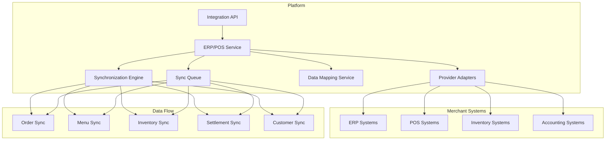

# Software Requirements Specification (SRS)

## Part 16C: ERP & POS Integration

**Module:** Integrations & Third-Party (Part 16)
**Version:** 1.0.0
**Status:** Final / For Review
**Date:** 2026-06-30

---

## Chapter 1 – Overview

### Purpose

The ERP & POS Integration module defines the comprehensive integration capabilities with Enterprise Resource Planning (ERP) and Point of Sale (POS) systems for the **[Platform Name]** platform. This encompasses menu synchronization, inventory management, order synchronization, settlement synchronization, and real-time data exchange.

ERP and POS integrations are essential for merchant operational efficiency. By enabling seamless integration with existing merchant systems, the platform reduces manual data entry, minimizes errors, and provides real-time visibility into inventory and operations. This module ensures that merchants can connect their existing systems to the platform with minimal friction.

### Objectives

- Enable seamless ERP system integration
- Support POS system connectivity
- Synchronize menu and catalog data
- Manage real-time inventory updates
- Synchronize orders between systems
- Enable settlement and financial synchronization
- Support multiple ERP and POS providers
- Ensure data consistency and reliability

---

## Chapter 2 – Architecture

### ERPPOS-001 Architecture Overview

### ERPPOS-002 Components

| Component | Description | Priority |
| :--- | :--- | :--- |
| **ERP/POS Service** | Core integration logic | **Required** |
| **Provider Adapters** | Provider-specific adapters | **Required** |
| **Synchronization Engine** | Data synchronization logic | **Required** |
| **Data Mapping Service** | Map data between systems | **Required** |
| **Sync Queue** | Asynchronous sync queue | **Required** |
| **Conflict Resolution** | Handle data conflicts | **Required** |
| **Error Handling** | Handle integration errors | **Required** |

---

## Chapter 3 – Supported ERP Systems

### ERPPOS-003 ERP Systems

| System | Integration Type | Priority |
| :--- | :--- | :--- |
| **SAP** | REST API, SOAP, IDocs | **Required** |
| **Oracle ERP** | REST API, SOAP, File-based | **Required** |
| **Microsoft Dynamics** | REST API, OData | **Required** |
| **NetSuite** | REST API, SOAP | **Required** |
| **Sage** | REST API | **Required** |
| **Infor** | REST API | **Required** |
| **Epicor** | REST API | **Required** |
| **Odoo** | REST API, XML-RPC | **Required** |
| **Zoho Books** | REST API | **Required** |
| **QuickBooks** | REST API | **Required** |

### ERPPOS-004 ERP Features

| Feature | Description | Priority |
| :--- | :--- | :--- |
| **Inventory Sync** | Synchronize inventory levels | **Required** |
| **Order Sync** | Synchronize orders | **Required** |
| **Customer Sync** | Synchronize customer data | **Required** |
| **Product Sync** | Synchronize product catalog | **Required** |
| **Settlement Sync** | Synchronize financial settlements | **Required** |
| **Tax Sync** | Synchronize tax rates | **Required** |

---

## Chapter 4 – Supported POS Systems

### ERPPOS-005 POS Systems

| System | Integration Type | Priority |
| :--- | :--- | :--- |
| **Square** | REST API, Webhooks | **Required** |
| **Toast** | REST API | **Required** |
| **Clover** | REST API | **Required** |
| **Lightspeed** | REST API | **Required** |
| **Shopify POS** | REST API | **Required** |
| **Revel** | REST API | **Required** |
| **TouchBistro** | REST API | **Required** |
| **Upserve** | REST API | **Required** |
| **Epos Now** | REST API | **Required** |
| **Kounta** | REST API | **Required** |

### ERPPOS-006 POS Features

| Feature | Description | Priority |
| :--- | :--- | :--- |
| **Menu Sync** | Synchronize menu and catalog | **Required** |
| **Order Sync** | Synchronize orders | **Required** |
| **Inventory Sync** | Synchronize inventory levels | **Required** |
| **Payment Sync** | Synchronize payment data | **Required** |
| **Customer Sync** | Synchronize customer data | **Required** |
| **Employee Sync** | Synchronize employee data | **Required** |

---

## Chapter 5 – Integration Modes

### ERPPOS-007 Integration Modes

| Mode | Description | Priority |
| :--- | :--- | :--- |
| **API-Based** | Real-time API integration | **Required** |
| **Webhook-Based** | Event-driven integration | **Required** |
| **Batch-Based** | Scheduled batch synchronization | **Required** |
| **File-Based** | CSV/Excel file import/export | **Required** |
| **Middleware** | Integration via middleware platform | **Required** |

### ERPPOS-008 Sync Frequency

| Data Type | Frequency | Priority |
| :--- | :--- | :--- |
| **Inventory** | Real-time (when possible) | **Required** |
| **Orders** | Real-time | **Required** |
| **Menu** | On-change + Daily | **Required** |
| **Customers** | On-change + Daily | **Required** |
| **Settlements** | Daily | **Required** |
| **Prices** | On-change + Daily | **Required** |
| **Tax Rates** | Weekly | **Required** |

---

## Chapter 6 – Data Synchronization

### ERPPOS-009 Menu Synchronization

| Direction | Description | Priority |
| :--- | :--- | :--- |
| **Platform → POS** | Push menu updates to POS | **Required** |
| **POS → Platform** | Pull menu updates from POS | **Required** |
| **Bidirectional** | Two-way synchronization | **Required** |

### ERPPOS-010 Menu Sync Data Model

| Column | Type | Constraints | Description |
| :--- | :--- | :--- | :--- |
| `menu_sync_id` | UUID | PRIMARY KEY | Unique identifier |
| `merchant_id` | UUID | FOREIGN KEY (merchant_accounts.merchant_id) | Associated merchant |
| `sync_type` | VARCHAR(20) | NOT NULL | FULL/INCREMENTAL/ON_CHANGE |
| `status` | VARCHAR(20) | DEFAULT 'PENDING' | PENDING/IN_PROGRESS/SUCCESS/FAILED |
| `items_synced` | INTEGER | | Number of items synced |
| `items_failed` | INTEGER` | | Number of items failed |
| `started_at` | TIMESTAMP | | Start timestamp |
| `completed_at` | TIMESTAMP` | | Completion timestamp |
| `error_message` | TEXT` | | Error message |
| `created_at` | TIMESTAMP | DEFAULT NOW() | Creation timestamp |
| `updated_at` | TIMESTAMP | DEFAULT NOW() | Last update timestamp |

### ERPPOS-011 Inventory Synchronization

| Direction | Description | Priority |
| :--- | :--- | :--- |
| **POS → Platform** | Push inventory updates to platform | **Required** |
| **Platform → POS** | Push inventory updates to POS | **Required** |
| **Bidirectional** | Two-way synchronization | **Required** |

### ERPPOS-012 Inventory Sync Data Model

| Column | Type | Constraints | Description |
| :--- | :--- | :--- | :--- |
| `inventory_sync_id` | UUID | PRIMARY KEY | Unique identifier |
| `merchant_id` | UUID | FOREIGN KEY (merchant_accounts.merchant_id) | Associated merchant |
| `sync_type` | VARCHAR(20) | NOT NULL | FULL/INCREMENTAL/REAL_TIME |
| `status` | VARCHAR(20) | DEFAULT 'PENDING' | PENDING/IN_PROGRESS/SUCCESS/FAILED |
| `items_synced` | INTEGER | | Number of items synced |
| `items_failed` | INTEGER` | | Number of items failed |
| `started_at` | TIMESTAMP | | Start timestamp |
| `completed_at` | TIMESTAMP` | | Completion timestamp |
| `error_message` | TEXT` | | Error message |
| `created_at` | TIMESTAMP | DEFAULT NOW() | Creation timestamp |
| `updated_at` | TIMESTAMP | DEFAULT NOW() | Last update timestamp |

### ERPPOS-013 Order Synchronization

| Direction | Description | Priority |
| :--- | :--- | :--- |
| **Platform → POS** | Push orders to POS | **Required** |
| **POS → Platform** | Pull order status from POS | **Required** |
| **Bidirectional** | Two-way synchronization | **Required** |

### ERPPOS-014 Order Sync Data Model

| Column | Type | Constraints | Description |
| :--- | :--- | :--- | :--- |
| `order_sync_id` | UUID | PRIMARY KEY | Unique identifier |
| `order_id` | UUID | FOREIGN KEY (orders.order_id) | Associated order |
| `merchant_id` | UUID | FOREIGN KEY (merchant_accounts.merchant_id) | Associated merchant |
| `sync_type` | VARCHAR(20) | NOT NULL | CREATED/UPDATED/STATUS |
| `sync_direction` | VARCHAR(20) | NOT NULL | PLATFORM_TO_POS/POS_TO_PLATFORM |
| `status` | VARCHAR(20) | DEFAULT 'PENDING' | PENDING/IN_PROGRESS/SUCCESS/FAILED |
| `started_at` | TIMESTAMP | | Start timestamp |
| `completed_at` | TIMESTAMP` | | Completion timestamp |
| `error_message` | TEXT` | | Error message |
| `created_at` | TIMESTAMP | DEFAULT NOW() | Creation timestamp |
| `updated_at` | TIMESTAMP | DEFAULT NOW() | Last update timestamp |

### ERPPOS-015 Settlement Synchronization

| Direction | Description | Priority |
| :--- | :--- | :--- |
| **Platform → ERP** | Push settlements to ERP | **Required** |
| **ERP → Platform** | Pull settlement status from ERP | **Required** |

### ERPPOS-016 Settlement Sync Data Model

| Column | Type | Constraints | Description |
| :--- | :--- | :--- | :--- |
| `settlement_sync_id` | UUID | PRIMARY KEY | Unique identifier |
| `settlement_id` | UUID | FOREIGN KEY (merchant_settlements.settlement_id) | Associated settlement |
| `merchant_id` | UUID | FOREIGN KEY (merchant_accounts.merchant_id) | Associated merchant |
| `sync_type` | VARCHAR(20) | NOT NULL | FULL/INCREMENTAL |
| `sync_direction` | VARCHAR(20) | NOT NULL | PLATFORM_TO_ERP/ERP_TO_PLATFORM |
| `status` | VARCHAR(20) | DEFAULT 'PENDING' | PENDING/IN_PROGRESS/SUCCESS/FAILED |
| `started_at` | TIMESTAMP | | Start timestamp |
| `completed_at` | TIMESTAMP` | | Completion timestamp |
| `error_message` | TEXT` | | Error message |
| `created_at` | TIMESTAMP | DEFAULT NOW() | Creation timestamp |
| `updated_at` | TIMESTAMP | DEFAULT NOW() | Last update timestamp |

---

## Chapter 7 – Data Mapping

### ERPPOS-017 Data Mapping Features

| Feature | Description | Priority |
| :--- | :--- | :--- |
| **Field Mapping** | Map fields between systems | **Required** |
| **Data Transformation** | Transform data formats | **Required** |
| **Validation Rules** | Validate mapped data | **Required** |
| **Default Values** | Set default values for missing fields | **Required** |
| **Conditional Mapping** | Conditional field mapping | **Required** |
| **Custom Mapping** | Custom mapping configurations | **Required** |

### ERPPOS-018 Mapping Data Model

| Column | Type | Constraints | Description |
| :--- | :--- | :--- | :--- |
| `mapping_id` | UUID | PRIMARY KEY | Unique identifier |
| `merchant_id` | UUID | FOREIGN KEY (merchant_accounts.merchant_id) | Associated merchant |
| `system_type` | VARCHAR(20) | NOT NULL | ERP/POS |
| `system_name` | VARCHAR(50) | NOT NULL | System name |
| `source_field` | VARCHAR(100) | NOT NULL | Source field name |
| `target_field` | VARCHAR(100) | NOT NULL | Target field name |
| `transformation` | VARCHAR(50) | | Transformation type |
| `default_value` | TEXT` | | Default value |
| `is_required` | BOOLEAN | DEFAULT FALSE | Required field |
| `created_at` | TIMESTAMP | DEFAULT NOW() | Creation timestamp |
| `updated_at` | TIMESTAMP | DEFAULT NOW() | Last update timestamp |

---

## Chapter 8 – Error Handling

### ERPPOS-019 Error Types

| Type | Description | Priority |
| :--- | :--- | :--- |
| **Connection Error** | Network or authentication failure | **Required** |
| **Timeout Error** | Request timeout | **Required** |
| **Validation Error** | Invalid data format | **Required** |
| **Conflict Error** | Data conflict | **Required** |
| **Rate Limit Error** | Rate limit exceeded | **Required** |
| **System Error** | Target system error | **Required** |

### ERPPOS-020 Retry Policy

| Attempt | Delay | Priority |
| :--- | :--- | :--- |
| **1** | 0 seconds | **Required** |
| **2** | 5 seconds | **Required** |
| **3** | 30 seconds | **Required** |
| **4** | 5 minutes | **Required** |
| **5** | 30 minutes | **Required** |
| **6** | 2 hours | **Required** |

### ERPPOS-021 Error Data Model

| Column | Type | Constraints | Description |
| :--- | :--- | :--- | :--- |
| `error_id` | UUID | PRIMARY KEY | Unique identifier |
| `sync_id` | UUID | | Associated sync ID |
| `merchant_id` | UUID | FOREIGN KEY (merchant_accounts.merchant_id) | Associated merchant |
| `error_type` | VARCHAR(30) | NOT NULL | CONNECTION/TIMEOUT/VALIDATION/CONFLICT/RATE_LIMIT/SYSTEM |
| `error_code` | VARCHAR(50) | | Error code |
| `error_message` | TEXT | NOT NULL | Error message |
| `retry_count` | INTEGER | DEFAULT 0 | Retry count |
| `status` | VARCHAR(20) | DEFAULT 'OPEN' | OPEN/RETRYING/RESOLVED/FAILED |
| `resolved_at` | TIMESTAMP` | | Resolution timestamp |
| `created_at` | TIMESTAMP | DEFAULT NOW() | Creation timestamp |
| `updated_at` | TIMESTAMP | DEFAULT NOW() | Last update timestamp |

---

## Chapter 9 – Database Tables

### erp_pos_syncs

| Column | Type | Constraints | Description |
| :--- | :--- | :--- | :--- |
| `sync_id` | UUID | PRIMARY KEY | Unique identifier |
| `merchant_id` | UUID | FOREIGN KEY (merchant_accounts.merchant_id) | Associated merchant |
| `sync_type` | VARCHAR(20) | NOT NULL | MENU/INVENTORY/ORDER/SETTLEMENT/CUSTOMER |
| `sync_direction` | VARCHAR(20) | NOT NULL | PLATFORM_TO_SYSTEM/SYSTEM_TO_PLATFORM/BIDIRECTIONAL |
| `status` | VARCHAR(20) | DEFAULT 'PENDING' | PENDING/IN_PROGRESS/SUCCESS/FAILED |
| `items_synced` | INTEGER | | Number of items synced |
| `items_failed` | INTEGER | | Number of items failed |
| `started_at` | TIMESTAMP | | Start timestamp |
| `completed_at` | TIMESTAMP | | Completion timestamp |
| `error_message` | TEXT | | Error message |
| `created_at` | TIMESTAMP | DEFAULT NOW() | Creation timestamp |
| `updated_at` | TIMESTAMP | DEFAULT NOW() | Last update timestamp |

### erp_pos_mappings

| Column | Type | Constraints | Description |
| :--- | :--- | :--- | :--- |
| `mapping_id` | UUID | PRIMARY KEY | Unique identifier |
| `merchant_id` | UUID | FOREIGN KEY (merchant_accounts.merchant_id) | Associated merchant |
| `system_type` | VARCHAR(20) | NOT NULL | ERP/POS |
| `system_name` | VARCHAR(50) | NOT NULL | System name |
| `source_field` | VARCHAR(100) | NOT NULL | Source field name |
| `target_field` | VARCHAR(100) | NOT NULL | Target field name |
| `transformation` | VARCHAR(50) | | Transformation type |
| `default_value` | TEXT | | Default value |
| `is_required` | BOOLEAN | DEFAULT FALSE | Required field |
| `created_at` | TIMESTAMP | DEFAULT NOW() | Creation timestamp |
| `updated_at` | TIMESTAMP | DEFAULT NOW() | Last update timestamp |

### erp_pos_errors

| Column | Type | Constraints | Description |
| :--- | :--- | :--- | :--- |
| `error_id` | UUID | PRIMARY KEY | Unique identifier |
| `sync_id` | UUID` | | Associated sync ID |
| `merchant_id` | UUID | FOREIGN KEY (merchant_accounts.merchant_id) | Associated merchant |
| `error_type` | VARCHAR(30) | NOT NULL | CONNECTION/TIMEOUT/VALIDATION/CONFLICT/RATE_LIMIT/SYSTEM |
| `error_code` | VARCHAR(50) | | Error code |
| `error_message` | TEXT | NOT NULL | Error message |
| `retry_count` | INTEGER | DEFAULT 0 | Retry count |
| `status` | VARCHAR(20) | DEFAULT 'OPEN' | OPEN/RETRYING/RESOLVED/FAILED |
| `resolved_at` | TIMESTAMP | | Resolution timestamp |
| `created_at` | TIMESTAMP | DEFAULT NOW() | Creation timestamp |
| `updated_at` | TIMESTAMP | DEFAULT NOW() | Last update timestamp |

### erp_pos_connections

| Column | Type | Constraints | Description |
| :--- | :--- | :--- | :--- |
| `connection_id` | UUID | PRIMARY KEY | Unique identifier |
| `merchant_id` | UUID | FOREIGN KEY (merchant_accounts.merchant_id) | Associated merchant |
| `system_type` | VARCHAR(20) | NOT NULL | ERP/POS |
| `system_name` | VARCHAR(50) | NOT NULL | System name |
| `connection_type` | VARCHAR(20) | NOT NULL | API/WEBHOOK/BATCH/FILE |
| `configuration` | JSONB | NOT NULL | Connection configuration |
| `status` | VARCHAR(20) | DEFAULT 'ACTIVE' | ACTIVE/INACTIVE/ERROR |
| `last_sync_at` | TIMESTAMP | | Last sync timestamp |
| `created_at` | TIMESTAMP | DEFAULT NOW() | Creation timestamp |
| `updated_at` | TIMESTAMP | DEFAULT NOW() | Last update timestamp |

### erp_pos_logs

| Column | Type | Constraints | Description |
| :--- | :--- | :--- | :--- |
| `log_id` | UUID | PRIMARY KEY | Unique identifier |
| `sync_id` | UUID` | | Associated sync ID |
| `merchant_id` | UUID | FOREIGN KEY (merchant_accounts.merchant_id) | Associated merchant |
| `log_type` | VARCHAR(20) | NOT NULL | INFO/WARNING/ERROR/DEBUG |
| `log_message` | TEXT | NOT NULL | Log message |
| `log_data` | JSONB` | | Additional log data |
| `created_at` | TIMESTAMP | DEFAULT NOW() | Creation timestamp |

---

## Chapter 10 – REST APIs

### Sync APIs

| Method | Endpoint | Description |
| :--- | :--- | :--- |
| `GET` | `/api/v1/integrations/erp-pos/syncs` | List syncs |
| `GET` | `/api/v1/integrations/erp-pos/syncs/{id}` | Get sync details |
| `POST` | `/api/v1/integrations/erp-pos/syncs` | Create sync |
| `POST` | `/api/v1/integrations/erp-pos/syncs/{id}/start` | Start sync |
| `POST` | `/api/v1/integrations/erp-pos/syncs/{id}/retry` | Retry sync |
| `GET` | `/api/v1/integrations/erp-pos/syncs/status` | Get sync status |

### Mapping APIs

| Method | Endpoint | Description |
| :--- | :--- | :--- |
| `GET` | `/api/v1/integrations/erp-pos/mappings` | List mappings |
| `GET` | `/api/v1/integrations/erp-pos/mappings/{id}` | Get mapping details |
| `POST` | `/api/v1/integrations/erp-pos/mappings` | Create mapping |
| `PUT` | `/api/v1/integrations/erp-pos/mappings/{id}` | Update mapping |
| `DELETE` | `/api/v1/integrations/erp-pos/mappings/{id}` | Delete mapping |

### Connection APIs

| Method | Endpoint | Description |
| :--- | :--- | :--- |
| `GET` | `/api/v1/integrations/erp-pos/connections` | List connections |
| `GET` | `/api/v1/integrations/erp-pos/connections/{id}` | Get connection details |
| `POST` | `/api/v1/integrations/erp-pos/connections` | Create connection |
| `PUT` | `/api/v1/integrations/erp-pos/connections/{id}` | Update connection |
| `DELETE` | `/api/v1/integrations/erp-pos/connections/{id}` | Delete connection |
| `POST` | `/api/v1/integrations/erp-pos/connections/{id}/test` | Test connection |

### Error APIs

| Method | Endpoint | Description |
| :--- | :--- | :--- |
| `GET` | `/api/v1/integrations/erp-pos/errors` | List errors |
| `GET` | `/api/v1/integrations/erp-pos/errors/{id}` | Get error details |
| `POST` | `/api/v1/integrations/erp-pos/errors/{id}/resolve` | Resolve error |

### Log APIs

| Method | Endpoint | Description |
| :--- | :--- | :--- |
| `GET` | `/api/v1/integrations/erp-pos/logs` | List logs |
| `GET` | `/api/v1/integrations/erp-pos/logs/{id}` | Get log details |

---

## Chapter 11 – Business Rules

| Rule ID | Rule Description | Priority |
| :--- | :--- | :--- |
| **BR-ERPPOS-001** | Menu sync must be completed within 5 minutes. | **High** |
| **BR-ERPPOS-002** | Inventory sync must be completed within 1 minute. | **High** |
| **BR-ERPPOS-003** | Order sync must be completed within 30 seconds. | **High** |
| **BR-ERPPOS-004** | Settlement sync must be completed within 1 hour. | **High** |
| **BR-ERPPOS-005** | Failed syncs must retry with exponential backoff. | **High** |
| **BR-ERPPOS-006** | Data mapping must be validated before sync. | **High** |
| **BR-ERPPOS-007** | Conflicting data must be resolved manually. | **High** |
| **BR-ERPPOS-008** | System connections must be tested periodically. | **High** |
| **BR-ERPPOS-009** | All sync operations must be logged. | **High** |
| **BR-ERPPOS-010** | Sensitive data must be encrypted in transit. | **High** |

---

## Chapter 12 – Acceptance Tests

| Test ID | Test Description | Priority |
| :--- | :--- | :--- |
| **TEST-ERPPOS-001** | Menu sync from platform to POS succeeds. | **High** |
| **TEST-ERPPOS-002** | Menu sync from POS to platform succeeds. | **High** |
| **TEST-ERPPOS-003** | Inventory sync from POS to platform succeeds. | **High** |
| **TEST-ERPPOS-004** | Inventory sync from platform to POS succeeds. | **High** |
| **TEST-ERPPOS-005** | Order sync from platform to POS succeeds. | **High** |
| **TEST-ERPPOS-006** | Order status sync from POS to platform succeeds. | **High** |
| **TEST-ERPPOS-007** | Settlement sync from platform to ERP succeeds. | **High** |
| **TEST-ERPPOS-008** | Settlement status sync from ERP to platform succeeds. | **High** |
| **TEST-ERPPOS-009** | Data mapping works correctly. | **High** |
| **TEST-ERPPOS-010** | Sync retry works on failure. | **High** |
| **TEST-ERPPOS-011** | Connection test works correctly. | **High** |
| **TEST-ERPPOS-012** | Sync status is accurate. | **High** |
| **TEST-ERPPOS-013** | Error logging works correctly. | **High** |
| **TEST-ERPPOS-014** | Conflict resolution works correctly. | **High** |
| **TEST-ERPPOS-015** | Real-time inventory update works correctly. | **High** |
| **TEST-ERPPOS-016** | Batch sync works correctly. | **High** |
| **TEST-ERPPOS-017** | Sync queue processes correctly. | **High** |
| **TEST-ERPPOS-018** | Multiple POS systems sync correctly. | **High** |
| **TEST-ERPPOS-019** | Multiple ERP systems sync correctly. | **High** |
| **TEST-ERPPOS-020** | Integration dashboard displays correctly. | **High** |

---

## Chapter 13 – Traceability Matrix

| Requirement | Database Table | API Endpoint(s) | Acceptance Test |
| :--- | :--- | :--- | :--- |
| ERPPOS-009 | erp_pos_syncs | POST /api/v1/integrations/erp-pos/syncs | TEST-ERPPOS-001, TEST-ERPPOS-002, TEST-ERPPOS-003, TEST-ERPPOS-004, TEST-ERPPOS-005, TEST-ERPPOS-006, TEST-ERPPOS-007, TEST-ERPPOS-008 |
| ERPPOS-017 | erp_pos_mappings | GET /api/v1/integrations/erp-pos/mappings | TEST-ERPPOS-009 |
| ERPPOS-020 | erp_pos_errors | GET /api/v1/integrations/erp-pos/errors | TEST-ERPPOS-010 |
| ERPPOS-003 | erp_pos_connections | POST /api/v1/integrations/erp-pos/connections/{id}/test | TEST-ERPPOS-011 |
| ERPPOS-009 | erp_pos_syncs | GET /api/v1/integrations/erp-pos/syncs/status | TEST-ERPPOS-012 |
| ERPPOS-021 | erp_pos_errors | GET /api/v1/integrations/erp-pos/logs | TEST-ERPPOS-013 |
| ERPPOS-009 | erp_pos_syncs | GET /api/v1/integrations/erp-pos/syncs/{id} | TEST-ERPPOS-014, TEST-ERPPOS-015 |
| ERPPOS-008 | erp_pos_syncs | POST /api/v1/integrations/erp-pos/syncs | TEST-ERPPOS-016, TEST-ERPPOS-017, TEST-ERPPOS-018, TEST-ERPPOS-019 |
| ERPPOS-009 | erp_pos_logs | GET /api/v1/integrations/erp-pos/logs | TEST-ERPPOS-020 |

---

## Chapter 14 – Summary

This document establishes the complete ERP and POS integration capability for the **[Platform Name]** platform. Key takeaways:

- **Supported ERP Systems:** SAP, Oracle ERP, Microsoft Dynamics, NetSuite, Sage, Infor, Epicor, Odoo, Zoho Books, and QuickBooks.
- **Supported POS Systems:** Square, Toast, Clover, Lightspeed, Shopify POS, Revel, TouchBistro, Upserve, Epos Now, and Kounta.
- **Integration Modes:** API-based, webhook-based, batch-based, file-based, and middleware-based integration.
- **Data Synchronization:** Menu sync, inventory sync, order sync, customer sync, and settlement sync with bidirectional support.
- **Sync Frequency:** Real-time inventory, real-time orders, on-change menu, daily settlements, and configurable frequencies.
- **Data Mapping:** Field mapping, data transformation, validation rules, default values, conditional mapping, and custom mapping.
- **Error Handling:** Comprehensive error types with exponential backoff retry policy and resolution workflows.
- **Monitoring:** Sync status tracking, error logging, and integration dashboard.

The ERP and POS integration module ensures seamless connectivity with merchant systems for operational efficiency.

---

**Next Document:**

`Part_16D_CRM_Integration.md`

*(This builds on ERP/POS integration to define CRM system integrations.)*