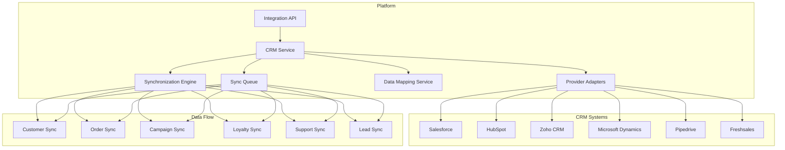

# Software Requirements Specification (SRS)

## Part 16D: CRM Integration

**Module:** Integrations & Third-Party (Part 16)
**Version:** 1.0.0
**Status:** Final / For Review
**Date:** 2026-06-30

---

## Chapter 1 – Overview

### Purpose

The CRM Integration module defines the comprehensive integration capabilities with Customer Relationship Management (CRM) systems for the **[Platform Name]** platform. This encompasses customer data synchronization, marketing campaign integration, loyalty program synchronization, support ticket integration, and lead management.

CRM integrations are essential for marketing automation, customer retention, and personalized customer experiences. By integrating with existing CRM systems, the platform enables seamless customer data flow, targeted marketing campaigns, and unified customer profiles. This module ensures that the platform can connect with leading CRM providers to enhance customer engagement and retention.

### Objectives

- Enable seamless CRM system integration
- Synchronize customer profiles and data
- Integrate marketing campaigns and promotions
- Support loyalty program synchronization
- Enable support ticket integration
- Provide lead management capabilities
- Ensure data consistency and privacy compliance
- Enable personalized customer experiences

---

## Chapter 2 – Architecture

### CRM-001 Architecture Overview

### CRM-002 Components

| Component | Description | Priority |
| :--- | :--- | :--- |
| **CRM Service** | Core CRM integration logic | **Required** |
| **Provider Adapters** | Provider-specific adapters | **Required** |
| **Synchronization Engine** | Data synchronization logic | **Required** |
| **Data Mapping Service** | Map data between systems | **Required** |
| **Sync Queue** | Asynchronous sync queue | **Required** |
| **Webhook Handler** | Process CRM webhooks | **Required** |
| **Conflict Resolution** | Handle data conflicts | **Required** |

---

## Chapter 3 – Supported CRM Systems

### CRM-003 CRM Systems

| System | Integration Type | Priority |
| :--- | :--- | :--- |
| **Salesforce** | REST API, SOAP, Bulk API | **Required** |
| **HubSpot** | REST API, Webhooks | **Required** |
| **Zoho CRM** | REST API | **Required** |
| **Microsoft Dynamics** | REST API, OData | **Required** |
| **Pipedrive** | REST API | **Required** |
| **Freshsales** | REST API | **Required** |
| **Insightly** | REST API | **Required** |
| **SugarCRM** | REST API | **Required** |
| **Salesloft** | REST API | **Required** |
| **Outreach** | REST API | **Required** |

### CRM-004 CRM Features

| Feature | Description | Priority |
| :--- | :--- | :--- |
| **Customer Sync** | Synchronize customer profiles | **Required** |
| **Order Sync** | Synchronize order history | **Required** |
| **Campaign Sync** | Synchronize marketing campaigns | **Required** |
| **Loyalty Sync** | Synchronize loyalty program data | **Required** |
| **Support Sync** | Synchronize support tickets | **Required** |
| **Lead Sync** | Synchronize leads | **Required** |
| **Contact Sync** | Synchronize contacts | **Required** |
| **Activity Sync** | Synchronize user activity | **Required** |

---

## Chapter 4 – Data Synchronization

### CRM-005 Customer Synchronization

| Direction | Description | Priority |
| :--- | :--- | :--- |
| **Platform → CRM** | Push customer data to CRM | **Required** |
| **CRM → Platform** | Pull customer data from CRM | **Required** |
| **Bidirectional** | Two-way synchronization | **Required** |

### CRM-006 Customer Sync Data Model

| Column | Type | Constraints | Description |
| :--- | :--- | :--- | :--- |
| `customer_sync_id` | UUID | PRIMARY KEY | Unique identifier |
| `customer_id` | UUID | FOREIGN KEY (customers.customer_id) | Associated customer |
| `sync_type` | VARCHAR(20) | NOT NULL | FULL/INCREMENTAL/ON_CHANGE |
| `sync_direction` | VARCHAR(20) | NOT NULL | PLATFORM_TO_CRM/CRM_TO_PLATFORM |
| `status` | VARCHAR(20) | DEFAULT 'PENDING' | PENDING/IN_PROGRESS/SUCCESS/FAILED |
| `fields_synced` | TEXT[] | | Fields synced |
| `fields_failed` | TEXT[] | | Fields failed |
| `started_at` | TIMESTAMP | | Start timestamp |
| `completed_at` | TIMESTAMP` | | Completion timestamp |
| `error_message` | TEXT` | | Error message |
| `created_at` | TIMESTAMP | DEFAULT NOW() | Creation timestamp |
| `updated_at` | TIMESTAMP | DEFAULT NOW() | Last update timestamp |

### CRM-007 Order Synchronization

| Direction | Description | Priority |
| :--- | :--- | :--- |
| **Platform → CRM** | Push order data to CRM | **Required** |
| **CRM → Platform** | Pull order data from CRM | **Required** |

### CRM-008 Order Sync Data Model

| Column | Type | Constraints | Description |
| :--- | :--- | :--- | :--- |
| `order_sync_id` | UUID | PRIMARY KEY | Unique identifier |
| `order_id` | UUID | FOREIGN KEY (orders.order_id) | Associated order |
| `customer_id` | UUID | FOREIGN KEY (customers.customer_id) | Associated customer |
| `sync_type` | VARCHAR(20) | NOT NULL | CREATED/UPDATED/COMPLETED |
| `sync_direction` | VARCHAR(20) | NOT NULL | PLATFORM_TO_CRM/CRM_TO_PLATFORM |
| `status` | VARCHAR(20) | DEFAULT 'PENDING' | PENDING/IN_PROGRESS/SUCCESS/FAILED |
| `started_at` | TIMESTAMP | | Start timestamp |
| `completed_at` | TIMESTAMP` | | Completion timestamp |
| `error_message` | TEXT` | | Error message |
| `created_at` | TIMESTAMP | DEFAULT NOW() | Creation timestamp |
| `updated_at` | TIMESTAMP | DEFAULT NOW() | Last update timestamp |

### CRM-009 Campaign Synchronization

| Direction | Description | Priority |
| :--- | :--- | :--- |
| **CRM → Platform** | Pull campaign data from CRM | **Required** |
| **Platform → CRM** | Push campaign results to CRM | **Required** |

### CRM-010 Campaign Sync Data Model

| Column | Type | Constraints | Description |
| :--- | :--- | :--- | :--- |
| `campaign_sync_id` | UUID | PRIMARY KEY | Unique identifier |
| `campaign_id` | UUID | FOREIGN KEY (campaigns.campaign_id) | Associated campaign |
| `sync_type` | VARCHAR(20) | NOT NULL | CREATED/UPDATED/RESULTS |
| `sync_direction` | VARCHAR(20) | NOT NULL | CRM_TO_PLATFORM/PLATFORM_TO_CRM |
| `status` | VARCHAR(20) | DEFAULT 'PENDING' | PENDING/IN_PROGRESS/SUCCESS/FAILED |
| `started_at` | TIMESTAMP | | Start timestamp |
| `completed_at` | TIMESTAMP` | | Completion timestamp |
| `error_message` | TEXT` | | Error message |
| `created_at` | TIMESTAMP | DEFAULT NOW() | Creation timestamp |
| `updated_at` | TIMESTAMP | DEFAULT NOW() | Last update timestamp |

### CRM-011 Loyalty Synchronization

| Direction | Description | Priority |
| :--- | :--- | :--- |
| **Platform → CRM** | Push loyalty data to CRM | **Required** |
| **CRM → Platform** | Pull loyalty data from CRM | **Required** |

### CRM-012 Loyalty Sync Data Model

| Column | Type | Constraints | Description |
| :--- | :--- | :--- | :--- |
| `loyalty_sync_id` | UUID | PRIMARY KEY | Unique identifier |
| `customer_id` | UUID | FOREIGN KEY (customers.customer_id) | Associated customer |
| `sync_type` | VARCHAR(20) | NOT NULL | POINTS/TIER/REDEMPTION |
| `sync_direction` | VARCHAR(20) | NOT NULL | PLATFORM_TO_CRM/CRM_TO_PLATFORM |
| `status` | VARCHAR(20) | DEFAULT 'PENDING' | PENDING/IN_PROGRESS/SUCCESS/FAILED |
| `started_at` | TIMESTAMP | | Start timestamp |
| `completed_at` | TIMESTAMP` | | Completion timestamp |
| `error_message` | TEXT` | | Error message |
| `created_at` | TIMESTAMP | DEFAULT NOW() | Creation timestamp |
| `updated_at` | TIMESTAMP | DEFAULT NOW() | Last update timestamp |

### CRM-013 Support Ticket Synchronization

| Direction | Description | Priority |
| :--- | :--- | :--- |
| **Platform → CRM** | Push support tickets to CRM | **Required** |
| **CRM → Platform** | Pull support tickets from CRM | **Required** |

### CRM-014 Support Sync Data Model

| Column | Type | Constraints | Description |
| :--- | :--- | :--- | :--- |
| `support_sync_id` | UUID | PRIMARY KEY | Unique identifier |
| `ticket_id` | UUID | FOREIGN KEY (support_tickets.ticket_id) | Associated ticket |
| `customer_id` | UUID | FOREIGN KEY (customers.customer_id) | Associated customer |
| `sync_type` | VARCHAR(20) | NOT NULL | CREATED/UPDATED/RESOLVED |
| `sync_direction` | VARCHAR(20) | NOT NULL | PLATFORM_TO_CRM/CRM_TO_PLATFORM |
| `status` | VARCHAR(20) | DEFAULT 'PENDING' | PENDING/IN_PROGRESS/SUCCESS/FAILED |
| `started_at` | TIMESTAMP | | Start timestamp |
| `completed_at` | TIMESTAMP` | | Completion timestamp |
| `error_message` | TEXT` | | Error message |
| `created_at` | TIMESTAMP | DEFAULT NOW() | Creation timestamp |
| `updated_at` | TIMESTAMP | DEFAULT NOW() | Last update timestamp |

### CRM-015 Lead Synchronization

| Direction | Description | Priority |
| :--- | :--- | :--- |
| **Platform → CRM** | Push leads to CRM | **Required** |
| **CRM → Platform** | Pull leads from CRM | **Required** |

### CRM-016 Lead Sync Data Model

| Column | Type | Constraints | Description |
| :--- | :--- | :--- | :--- |
| `lead_sync_id` | UUID | PRIMARY KEY | Unique identifier |
| `lead_id` | UUID | | Associated lead |
| `sync_type` | VARCHAR(20) | NOT NULL | CREATED/UPDATED/CONVERTED |
| `sync_direction` | VARCHAR(20) | NOT NULL | PLATFORM_TO_CRM/CRM_TO_PLATFORM |
| `status` | VARCHAR(20) | DEFAULT 'PENDING' | PENDING/IN_PROGRESS/SUCCESS/FAILED |
| `started_at` | TIMESTAMP | | Start timestamp |
| `completed_at` | TIMESTAMP` | | Completion timestamp |
| `error_message` | TEXT` | | Error message |
| `created_at` | TIMESTAMP | DEFAULT NOW() | Creation timestamp |
| `updated_at` | TIMESTAMP | DEFAULT NOW() | Last update timestamp |

---

## Chapter 5 – Data Mapping

### CRM-017 Mapping Features

| Feature | Description | Priority |
| :--- | :--- | :--- |
| **Field Mapping** | Map fields between systems | **Required** |
| **Data Transformation** | Transform data formats | **Required** |
| **Validation Rules** | Validate mapped data | **Required** |
| **Default Values** | Set default values for missing fields | **Required** |
| **Conditional Mapping** | Conditional field mapping | **Required** |
| **Custom Mapping** | Custom mapping configurations | **Required** |

### CRM-018 Mapping Data Model

| Column | Type | Constraints | Description |
| :--- | :--- | :--- | :--- |
| `mapping_id` | UUID | PRIMARY KEY | Unique identifier |
| `crm_system` | VARCHAR(50) | NOT NULL | CRM system name |
| `source_field` | VARCHAR(100) | NOT NULL | Source field name |
| `target_field` | VARCHAR(100) | NOT NULL | Target field name |
| `transformation` | VARCHAR(50) | | Transformation type |
| `default_value` | TEXT` | | Default value |
| `is_required` | BOOLEAN | DEFAULT FALSE | Required field |
| `created_at` | TIMESTAMP | DEFAULT NOW() | Creation timestamp |
| `updated_at` | TIMESTAMP | DEFAULT NOW() | Last update timestamp |

---

## Chapter 6 – Marketing Integration

### CRM-019 Marketing Features

| Feature | Description | Priority |
| :--- | :--- | :--- |
| **Campaign Sync** | Synchronize marketing campaigns | **Required** |
| **Email Marketing** | Sync email marketing data | **Required** |
| **Segment Sync** | Sync customer segments | **Required** |
| **Event Tracking** | Track marketing events | **Required** |
| **Attribution** | Track campaign attribution | **Required** |
| **Lead Scoring** | Sync lead scores | **Required** |

### CRM-020 Marketing Data Model

| Column | Type | Constraints | Description |
| :--- | :--- | :--- | :--- |
| `marketing_id` | UUID | PRIMARY KEY | Unique identifier |
| `campaign_id` | UUID | FOREIGN KEY (campaigns.campaign_id) | Associated campaign |
| `customer_id` | UUID | FOREIGN KEY (customers.customer_id) | Associated customer |
| `event_type` | VARCHAR(50) | NOT NULL | VIEW/CLICK/CONVERT/UNSUBSCRIBE |
| `event_data` | JSONB` | | Event data |
| `source` | VARCHAR(50) | | Traffic source |
| `medium` | VARCHAR(50) | | Traffic medium |
| `campaign` | VARCHAR(100) | | Campaign name |
| `created_at` | TIMESTAMP | DEFAULT NOW() | Creation timestamp |

---

## Chapter 7 – Webhook Processing

### CRM-021 Webhook Events

| Event | Description | Priority |
| :--- | :--- | :--- |
| `contact.created` | Contact created in CRM | **Required** |
| `contact.updated` | Contact updated in CRM | **Required** |
| `contact.deleted` | Contact deleted in CRM | **Required** |
| `deal.created` | Deal created in CRM | **Required** |
| `deal.updated` | Deal updated in CRM | **Required** |
| `deal.won` | Deal won in CRM | **Required** |
| `deal.lost` | Deal lost in CRM | **Required** |
| `campaign.created` | Campaign created in CRM | **Required** |
| `campaign.updated` | Campaign updated in CRM | **Required** |
| `ticket.created` | Ticket created in CRM | **Required** |
| `ticket.updated` | Ticket updated in CRM | **Required** |

### CRM-022 Webhook Data Model

| Column | Type | Constraints | Description |
| :--- | :--- | :--- | :--- |
| `webhook_id` | UUID | PRIMARY KEY | Unique identifier |
| `crm_system` | VARCHAR(50) | NOT NULL | CRM system name |
| `event_type` | VARCHAR(50) | NOT NULL | Event type |
| `event_payload` | JSONB | NOT NULL | Full webhook payload |
| `signature` | VARCHAR(255) | | Webhook signature |
| `verified` | BOOLEAN | DEFAULT FALSE | Signature verified |
| `processed` | BOOLEAN | DEFAULT FALSE | Processing status |
| `processed_at` | TIMESTAMP` | | Processing timestamp |
| `error_message` | TEXT` | | Error message |
| `created_at` | TIMESTAMP | DEFAULT NOW() | Creation timestamp |
| `updated_at` | TIMESTAMP | DEFAULT NOW() | Last update timestamp |

---

## Chapter 8 – Database Tables

### crm_syncs

| Column | Type | Constraints | Description |
| :--- | :--- | :--- | :--- |
| `sync_id` | UUID | PRIMARY KEY | Unique identifier |
| `crm_system` | VARCHAR(50) | NOT NULL | CRM system name |
| `sync_type` | VARCHAR(20) | NOT NULL | CUSTOMER/ORDER/CAMPAIGN/LOYALTY/SUPPORT/LEAD |
| `sync_direction` | VARCHAR(20) | NOT NULL | PLATFORM_TO_CRM/CRM_TO_PLATFORM |
| `status` | VARCHAR(20) | DEFAULT 'PENDING' | PENDING/IN_PROGRESS/SUCCESS/FAILED |
| `items_synced` | INTEGER | | Number of items synced |
| `items_failed` | INTEGER` | | Number of items failed |
| `started_at` | TIMESTAMP | | Start timestamp |
| `completed_at` | TIMESTAMP` | | Completion timestamp |
| `error_message` | TEXT` | | Error message |
| `created_at` | TIMESTAMP | DEFAULT NOW() | Creation timestamp |
| `updated_at` | TIMESTAMP | DEFAULT NOW() | Last update timestamp |

### crm_mappings

| Column | Type | Constraints | Description |
| :--- | :--- | :--- | :--- |
| `mapping_id` | UUID | PRIMARY KEY | Unique identifier |
| `crm_system` | VARCHAR(50) | NOT NULL | CRM system name |
| `source_field` | VARCHAR(100) | NOT NULL | Source field name |
| `target_field` | VARCHAR(100) | NOT NULL | Target field name |
| `transformation` | VARCHAR(50) | | Transformation type |
| `default_value` | TEXT` | | Default value |
| `is_required` | BOOLEAN | DEFAULT FALSE | Required field |
| `created_at` | TIMESTAMP | DEFAULT NOW() | Creation timestamp |
| `updated_at` | TIMESTAMP | DEFAULT NOW() | Last update timestamp |

### crm_webhooks

| Column | Type | Constraints | Description |
| :--- | :--- | :--- | :--- |
| `webhook_id` | UUID | PRIMARY KEY | Unique identifier |
| `crm_system` | VARCHAR(50) | NOT NULL | CRM system name |
| `event_type` | VARCHAR(50) | NOT NULL | Event type |
| `event_payload` | JSONB | NOT NULL | Full webhook payload |
| `signature` | VARCHAR(255) | | Webhook signature |
| `verified` | BOOLEAN | DEFAULT FALSE | Signature verified |
| `processed` | BOOLEAN | DEFAULT FALSE | Processing status |
| `processed_at` | TIMESTAMP` | | Processing timestamp |
| `error_message` | TEXT` | | Error message |
| `created_at` | TIMESTAMP | DEFAULT NOW() | Creation timestamp |
| `updated_at` | TIMESTAMP | DEFAULT NOW() | Last update timestamp |

### crm_connections

| Column | Type | Constraints | Description |
| :--- | :--- | :--- | :--- |
| `connection_id` | UUID | PRIMARY KEY | Unique identifier |
| `crm_system` | VARCHAR(50) | NOT NULL | CRM system name |
| `connection_type` | VARCHAR(20) | NOT NULL | API/WEBHOOK/BATCH |
| `configuration` | JSONB | NOT NULL | Connection configuration |
| `status` | VARCHAR(20) | DEFAULT 'ACTIVE' | ACTIVE/INACTIVE/ERROR |
| `last_sync_at` | TIMESTAMP | | Last sync timestamp |
| `created_at` | TIMESTAMP | DEFAULT NOW() | Creation timestamp |
| `updated_at` | TIMESTAMP | DEFAULT NOW() | Last update timestamp |

### crm_errors

| Column | Type | Constraints | Description |
| :--- | :--- | :--- | :--- |
| `error_id` | UUID | PRIMARY KEY | Unique identifier |
| `sync_id` | UUID` | | Associated sync ID |
| `crm_system` | VARCHAR(50) | NOT NULL | CRM system name |
| `error_type` | VARCHAR(30) | NOT NULL | CONNECTION/TIMEOUT/VALIDATION/CONFLICT/RATE_LIMIT/SYSTEM |
| `error_code` | VARCHAR(50) | | Error code |
| `error_message` | TEXT | NOT NULL | Error message |
| `retry_count` | INTEGER | DEFAULT 0 | Retry count |
| `status` | VARCHAR(20) | DEFAULT 'OPEN' | OPEN/RETRYING/RESOLVED/FAILED |
| `resolved_at` | TIMESTAMP` | | Resolution timestamp |
| `created_at` | TIMESTAMP | DEFAULT NOW() | Creation timestamp |
| `updated_at` | TIMESTAMP | DEFAULT NOW() | Last update timestamp |

### crm_marketing

| Column | Type | Constraints | Description |
| :--- | :--- | :--- | :--- |
| `marketing_id` | UUID | PRIMARY KEY | Unique identifier |
| `campaign_id` | UUID | FOREIGN KEY (campaigns.campaign_id) | Associated campaign |
| `customer_id` | UUID | FOREIGN KEY (customers.customer_id) | Associated customer |
| `event_type` | VARCHAR(50) | NOT NULL | VIEW/CLICK/CONVERT/UNSUBSCRIBE |
| `event_data` | JSONB` | | Event data |
| `source` | VARCHAR(50) | | Traffic source |
| `medium` | VARCHAR(50) | | Traffic medium |
| `campaign` | VARCHAR(100) | | Campaign name |
| `created_at` | TIMESTAMP | DEFAULT NOW() | Creation timestamp |

---

## Chapter 9 – REST APIs

### Sync APIs

| Method | Endpoint | Description |
| :--- | :--- | :--- |
| `GET` | `/api/v1/integrations/crm/syncs` | List syncs |
| `GET` | `/api/v1/integrations/crm/syncs/{id}` | Get sync details |
| `POST` | `/api/v1/integrations/crm/syncs` | Create sync |
| `POST` | `/api/v1/integrations/crm/syncs/{id}/start` | Start sync |
| `POST` | `/api/v1/integrations/crm/syncs/{id}/retry` | Retry sync |
| `GET` | `/api/v1/integrations/crm/syncs/status` | Get sync status |

### Mapping APIs

| Method | Endpoint | Description |
| :--- | :--- | :--- |
| `GET` | `/api/v1/integrations/crm/mappings` | List mappings |
| `GET` | `/api/v1/integrations/crm/mappings/{id}` | Get mapping details |
| `POST` | `/api/v1/integrations/crm/mappings` | Create mapping |
| `PUT` | `/api/v1/integrations/crm/mappings/{id}` | Update mapping |
| `DELETE` | `/api/v1/integrations/crm/mappings/{id}` | Delete mapping |

### Connection APIs

| Method | Endpoint | Description |
| :--- | :--- | :--- |
| `GET` | `/api/v1/integrations/crm/connections` | List connections |
| `GET` | `/api/v1/integrations/crm/connections/{id}` | Get connection details |
| `POST` | `/api/v1/integrations/crm/connections` | Create connection |
| `PUT` | `/api/v1/integrations/crm/connections/{id}` | Update connection |
| `DELETE` | `/api/v1/integrations/crm/connections/{id}` | Delete connection |
| `POST` | `/api/v1/integrations/crm/connections/{id}/test` | Test connection |

### Webhook APIs

| Method | Endpoint | Description |
| :--- | :--- | :--- |
| `POST` | `/api/v1/integrations/crm/webhooks/salesforce` | Salesforce webhook endpoint |
| `POST` | `/api/v1/integrations/crm/webhooks/hubspot` | HubSpot webhook endpoint |
| `POST` | `/api/v1/integrations/crm/webhooks/zoho` | Zoho webhook endpoint |
| `GET` | `/api/v1/integrations/crm/webhooks` | List webhook events |
| `GET` | `/api/v1/integrations/crm/webhooks/{id}` | Get webhook event details |
| `POST` | `/api/v1/integrations/crm/webhooks/{id}/retry` | Retry webhook processing |

### Marketing APIs

| Method | Endpoint | Description |
| :--- | :--- | :--- |
| `GET` | `/api/v1/integrations/crm/marketing` | Get marketing data |
| `GET` | `/api/v1/integrations/crm/marketing/{id}` | Get marketing event details |
| `POST` | `/api/v1/integrations/crm/marketing` | Create marketing event |

---

## Chapter 10 – Business Rules

| Rule ID | Rule Description | Priority |
| :--- | :--- | :--- |
| **BR-CRM-001** | Customer sync must be completed within 5 minutes. | **High** |
| **BR-CRM-002** | Order sync must be completed within 1 minute. | **High** |
| **BR-CRM-003** | Campaign sync must be completed within 1 hour. | **High** |
| **BR-CRM-004** | Loyalty sync must be completed within 5 minutes. | **High** |
| **BR-CRM-005** | Support ticket sync must be completed within 1 minute. | **High** |
| **BR-CRM-006** | Failed syncs must retry with exponential backoff. | **High** |
| **BR-CRM-007** | Data mapping must be validated before sync. | **High** |
| **BR-CRM-008** | Conflicting data must be resolved manually. | **High** |
| **BR-CRM-009** | CRM connections must be tested periodically. | **High** |
| **BR-CRM-010** | All sync operations must be logged. | **High** |

---

## Chapter 11 – Acceptance Tests

| Test ID | Test Description | Priority |
| :--- | :--- | :--- |
| **TEST-CRM-001** | Customer sync from platform to CRM succeeds. | **High** |
| **TEST-CRM-002** | Customer sync from CRM to platform succeeds. | **High** |
| **TEST-CRM-003** | Order sync from platform to CRM succeeds. | **High** |
| **TEST-CRM-004** | Order sync from CRM to platform succeeds. | **High** |
| **TEST-CRM-005** | Campaign sync from CRM to platform succeeds. | **High** |
| **TEST-CRM-006** | Loyalty sync from platform to CRM succeeds. | **High** |
| **TEST-CRM-007** | Loyalty sync from CRM to platform succeeds. | **High** |
| **TEST-CRM-008** | Support ticket sync from platform to CRM succeeds. | **High** |
| **TEST-CRM-009** | Support ticket sync from CRM to platform succeeds. | **High** |
| **TEST-CRM-010** | Lead sync from platform to CRM succeeds. | **High** |
| **TEST-CRM-011** | Lead sync from CRM to platform succeeds. | **High** |
| **TEST-CRM-012** | Data mapping works correctly. | **High** |
| **TEST-CRM-013** | Sync retry works on failure. | **High** |
| **TEST-CRM-014** | Connection test works correctly. | **High** |
| **TEST-CRM-015** | Webhook processing works correctly. | **High** |
| **TEST-CRM-016** | Conflict resolution works correctly. | **High** |
| **TEST-CRM-017** | Marketing event tracking works correctly. | **High** |
| **TEST-CRM-018** | Campaign attribution works correctly. | **High** |
| **TEST-CRM-019** | Lead scoring sync works correctly. | **High** |
| **TEST-CRM-020** | Integration dashboard displays correctly. | **High** |

---

## Chapter 12 – Traceability Matrix

| Requirement | Database Table | API Endpoint(s) | Acceptance Test |
| :--- | :--- | :--- | :--- |
| CRM-005 | crm_syncs | POST /api/v1/integrations/crm/syncs | TEST-CRM-001, TEST-CRM-002 |
| CRM-007 | crm_syncs | POST /api/v1/integrations/crm/syncs | TEST-CRM-003, TEST-CRM-004 |
| CRM-009 | crm_syncs | POST /api/v1/integrations/crm/syncs | TEST-CRM-005 |
| CRM-011 | crm_syncs | POST /api/v1/integrations/crm/syncs | TEST-CRM-006, TEST-CRM-007 |
| CRM-013 | crm_syncs | POST /api/v1/integrations/crm/syncs | TEST-CRM-008, TEST-CRM-009 |
| CRM-015 | crm_syncs | POST /api/v1/integrations/crm/syncs | TEST-CRM-010, TEST-CRM-011 |
| CRM-017 | crm_mappings | GET /api/v1/integrations/crm/mappings | TEST-CRM-012 |
| CRM-003 | crm_connections | POST /api/v1/integrations/crm/connections/{id}/test | TEST-CRM-013, TEST-CRM-014 |
| CRM-021 | crm_webhooks | GET /api/v1/integrations/crm/webhooks | TEST-CRM-015 |
| CRM-019 | crm_marketing | POST /api/v1/integrations/crm/marketing | TEST-CRM-016, TEST-CRM-017, TEST-CRM-018, TEST-CRM-019 |
| CRM-002 | crm_syncs | GET /api/v1/integrations/crm/syncs | TEST-CRM-020 |

---

## Chapter 13 – Summary

This document establishes the complete CRM integration capability for the **[Platform Name]** platform. Key takeaways:

- **Supported CRM Systems:** Salesforce, HubSpot, Zoho CRM, Microsoft Dynamics, Pipedrive, Freshsales, Insightly, SugarCRM, Salesloft, and Outreach.
- **Data Synchronization:** Customer sync, order sync, campaign sync, loyalty sync, support sync, and lead sync with bidirectional support.
- **Sync Frequency:** Real-time customer sync, real-time order sync, on-change campaign sync, and configurable frequencies.
- **Data Mapping:** Field mapping, data transformation, validation rules, default values, conditional mapping, and custom mapping.
- **Webhook Processing:** Real-time event processing for contact, deal, campaign, and ticket events.
- **Marketing Integration:** Campaign sync, email marketing, segment sync, event tracking, attribution, and lead scoring.
- **Error Handling:** Comprehensive error types with exponential backoff retry policy and resolution workflows.
- **Privacy Compliance:** GDPR/CCPA compliance for customer data synchronization.

The CRM integration module enables seamless customer data flow and personalized customer experiences across the platform.

---

**Next Document:**

`Part_16E_Identity_Federation.md`

*(This builds on CRM integration to define identity federation capabilities.)*