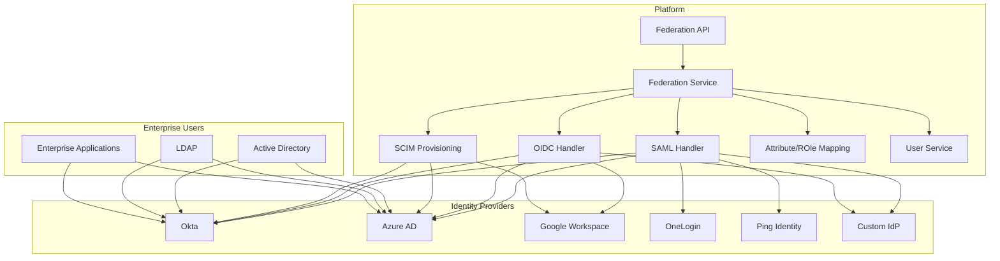
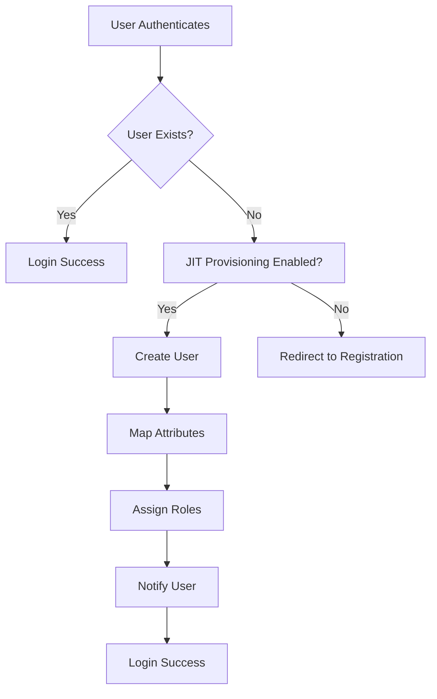
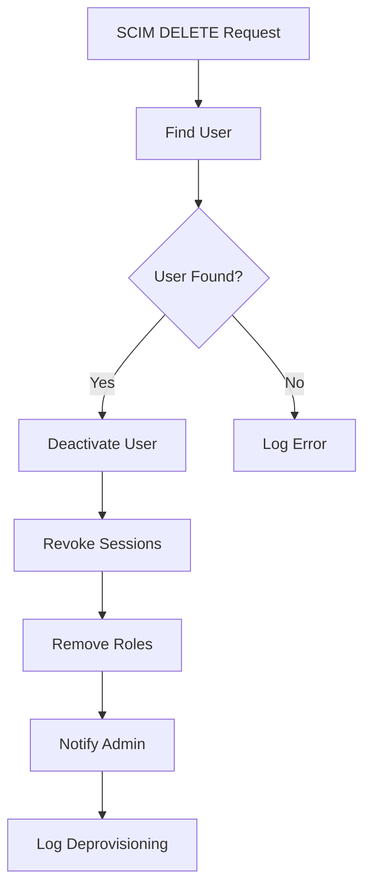

# Part 16E: Identity Federation

**Module:** Integrations & Third-Party (Part 16)
**Version:** 1.0.0
**Status:** Final / For Review
**Date:** 2026-06-30

---

## Chapter 1 – Overview

### Purpose

The Identity Federation module defines the comprehensive identity federation capabilities for the **[Platform Name]** platform. This encompasses Single Sign-On (SSO), enterprise identity integration, user provisioning, attribute mapping, role mapping, and identity provider management.

Identity federation is essential for enterprise customers, merchants, and partners who require seamless authentication using their existing corporate credentials. By supporting industry-standard federation protocols, the platform enables secure, frictionless access for enterprise users while maintaining centralized identity management. This module ensures that the platform can integrate with leading identity providers and support enterprise authentication requirements.

### Objectives

- Enable Single Sign-On (SSO) for enterprise users
- Support SAML 2.0 and OpenID Connect (OIDC) protocols
- Integrate with enterprise identity providers
- Enable automatic user provisioning (SCIM)
- Support attribute mapping and role mapping
- Manage identity provider configurations
- Ensure secure federation integration
- Provide self-service federation management

---

## Chapter 2 – Architecture

### FED-001 Architecture Overview



### FED-002 Components

| Component | Description | Priority |
| :--- | :--- | :--- |
| **Federation Service** | Core federation logic | **Required** |
| **SAML Handler** | SAML 2.0 protocol handling | **Required** |
| **OIDC Handler** | OpenID Connect protocol handling | **Required** |
| **SCIM Provisioning** | User provisioning and deprovisioning | **Required** |
| **Attribute Mapping** | Map IdP attributes to platform | **Required** |
| **Role Mapping** | Map IdP roles to platform roles | **Required** |
| **Identity Provider Management** | Manage IdP configurations | **Required** |
| **User Service** | User creation and management | **Required** |

---

## Chapter 3 – Federation Protocols

### FED-003 Supported Protocols

| Protocol | Description | Use Case | Priority |
| :--- | :--- | :--- | :--- |
| **SAML 2.0** | Security Assertion Markup Language | Enterprise SSO | **Required** |
| **OpenID Connect** | OAuth 2.0-based identity | Modern SSO, Mobile | **Required** |
| **SCIM** | System for Cross-domain Identity Management | User provisioning | **Required** |
| **LDAP** | Lightweight Directory Access Protocol | Legacy integration | **Optional** |

### FED-004 Protocol Features

| Feature | SAML | OIDC | SCIM | Priority |
| :--- | :--- | :--- | :--- | :--- |
| **Single Sign-On** | ✅ | ✅ | ❌ | **Required** |
| **Single Logout** | ✅ | ✅ | ❌ | **Required** |
| **User Provisioning** | ❌ | ❌ | ✅ | **Required** |
| **User Deprovisioning** | ❌ | ❌ | ✅ | **Required** |
| **Attribute Mapping** | ✅ | ✅ | ✅ | **Required** |
| **Role Mapping** | ✅ | ✅ | ✅ | **Required** |
| **Just-in-Time Provisioning** | ✅ | ✅ | ❌ | **Required** |

---

## Chapter 4 – Identity Providers

### FED-005 Supported Identity Providers

| Provider | SAML | OIDC | SCIM | Priority |
| :--- | :--- | :--- | :--- | :--- |
| **Okta** | ✅ | ✅ | ✅ | **Required** |
| **Azure AD** | ✅ | ✅ | ✅ | **Required** |
| **Google Workspace** | ✅ | ✅ | ✅ | **Required** |
| **OneLogin** | ✅ | ✅ | ✅ | **Required** |
| **Ping Identity** | ✅ | ✅ | ✅ | **Required** |
| **Auth0** | ✅ | ✅ | ✅ | **Required** |
| **Keycloak** | ✅ | ✅ | ✅ | **Required** |
| **Amazon Cognito** | ✅ | ✅ | ✅ | **Required** |
| **Custom IdP** | ✅ | ✅ | ✅ | **Required** |

### FED-006 Provider Configuration Data Model

| Column | Type | Constraints | Description |
| :--- | :--- | :--- | :--- |
| `provider_id` | UUID | PRIMARY KEY | Unique identifier |
| `provider_name` | VARCHAR(100) | NOT NULL | Provider name |
| `provider_type` | VARCHAR(30) | NOT NULL | OKTA/AZURE/GOOGLE/ONELOGIN/PING/AUTH0/KEYCLOAK/COGNITO/CUSTOM |
| `protocol` | VARCHAR(20) | NOT NULL | SAML/OIDC |
| `metadata_url` | VARCHAR(500) | | SAML metadata URL |
| `metadata_xml` | TEXT` | | SAML metadata XML |
| `entity_id` | VARCHAR(255)` | | SAML entity ID |
| `sso_url` | VARCHAR(500)` | | SAML SSO URL |
| `slo_url` | VARCHAR(500)` | | SAML SLO URL |
| `certificate` | TEXT` | | X.509 certificate |
| `client_id` | VARCHAR(255)` | | OIDC client ID |
| `client_secret` | VARCHAR(255)` | | OIDC client secret |
| `authorization_endpoint` | VARCHAR(500)` | | OIDC auth endpoint |
| `token_endpoint` | VARCHAR(500)` | | OIDC token endpoint |
| `userinfo_endpoint` | VARCHAR(500)` | | OIDC userinfo endpoint |
| `jwks_url` | VARCHAR(500)` | | OIDC JWKS URL |
| `scim_endpoint` | VARCHAR(500)` | | SCIM endpoint |
| `scim_token` | VARCHAR(255)` | | SCIM bearer token |
| `attribute_mapping` | JSONB` | | Attribute mapping rules |
| `role_mapping` | JSONB` | | Role mapping rules |
| `status` | VARCHAR(20) | DEFAULT 'ACTIVE' | ACTIVE/INACTIVE/ERROR |
| `created_at` | TIMESTAMP | DEFAULT NOW() | Creation timestamp |
| `updated_at` | TIMESTAMP | DEFAULT NOW() | Last update timestamp |

---

## Chapter 5 – SAML 2.0 Integration

### FED-007 SAML Features

| Feature | Description | Priority |
| :--- | :--- | :--- |
| **SP-Initiated SSO** | Service provider initiated SSO | **Required** |
| **IdP-Initiated SSO** | Identity provider initiated SSO | **Required** |
| **Single Logout (SLO)** | Logout from all applications | **Required** |
| **Attribute Mapping** | Map SAML attributes to platform | **Required** |
| **Role Mapping** | Map SAML roles to platform roles | **Required** |
| **Just-in-Time Provisioning** | Create user on first login | **Required** |
| **Encryption** | Encrypt SAML assertions | **Required** |
| **Signing** | Sign SAML requests and responses | **Required** |

### FED-008 SAML Configuration Example

```xml
<!-- SAML SP Metadata -->
<md:EntityDescriptor 
    xmlns:md="urn:oasis:names:tc:SAML:2.0:metadata" 
    entityID="https://platform.com/saml">
    
    <md:SPSSODescriptor 
        protocolSupportEnumeration="urn:oasis:names:tc:SAML:2.0:protocol">
        
        <md:NameIDFormat>
            urn:oasis:names:tc:SAML:1.1:nameid-format:emailAddress
        </md:NameIDFormat>
        
        <md:AssertionConsumerService 
            Binding="urn:oasis:names:tc:SAML:2.0:bindings:HTTP-POST" 
            Location="https://platform.com/api/v1/auth/saml/acs" 
            index="1"/>
        
        <md:SingleLogoutService 
            Binding="urn:oasis:names:tc:SAML:2.0:bindings:HTTP-Redirect" 
            Location="https://platform.com/api/v1/auth/saml/slo"/>
        
        <md:AttributeConsumingService index="1">
            <md:ServiceName xml:lang="en">Platform Attributes</md:ServiceName>
            <md:RequestedAttribute Name="email" NameFormat="urn:oasis:names:tc:SAML:2.0:attrname-format:basic"/>
            <md:RequestedAttribute Name="firstName" NameFormat="urn:oasis:names:tc:SAML:2.0:attrname-format:basic"/>
            <md:RequestedAttribute Name="lastName" NameFormat="urn:oasis:names:tc:SAML:2.0:attrname-format:basic"/>
            <md:RequestedAttribute Name="roles" NameFormat="urn:oasis:names:tc:SAML:2.0:attrname-format:basic"/>
        </md:AttributeConsumingService>
    </md:SPSSODescriptor>
</md:EntityDescriptor>
```

---

## Chapter 6 – OpenID Connect (OIDC) Integration

### FED-009 OIDC Features

| Feature | Description | Priority |
| :--- | :--- | :--- |
| **Authorization Code Flow** | Standard OIDC flow | **Required** |
| **Implicit Flow** | Simplified OIDC flow | **Required** |
| **Client Credentials Flow** | Server-to-server authentication | **Required** |
| **Refresh Token** | Token refresh capability | **Required** |
| **ID Token** | Identity information | **Required** |
| **Userinfo Endpoint** | User profile information | **Required** |
| **Claim Mapping** | Map OIDC claims to platform | **Required** |
| **Role Mapping** | Map OIDC roles to platform roles | **Required** |
| **Just-in-Time Provisioning** | Create user on first login | **Required** |

### FED-010 OIDC Configuration Example

```yaml
# OIDC Client Configuration
client_id: platform-client
client_secret: 1234567890abcdef
authorization_endpoint: https://identity-provider.com/authorize
token_endpoint: https://identity-provider.com/token
userinfo_endpoint: https://identity-provider.com/userinfo
jwks_uri: https://identity-provider.com/keys
scopes:
  - openid
  - profile
  - email
  - roles
redirect_uris:
  - https://platform.com/api/v1/auth/oidc/callback
```

---

## Chapter 7 – SCIM Provisioning

### FED-011 SCIM Features

| Feature | Description | Priority |
| :--- | :--- | :--- |
| **User Creation** | Create user in platform | **Required** |
| **User Update** | Update user in platform | **Required** |
| **User Deletion** | Delete user from platform | **Required** |
| **User Deactivation** | Deactivate user in platform | **Required** |
| **Group Provisioning** | Provision groups | **Required** |
| **Group Membership** | Manage group memberships | **Required** |
| **Attribute Mapping** | Map SCIM attributes | **Required** |
| **Role Mapping** | Map SCIM roles | **Required** |

### FED-012 SCIM Schema

```json
{
  "schemas": ["urn:ietf:params:scim:schemas:core:2.0:User"],
  "id": "1234567890",
  "userName": "john.doe@example.com",
  "name": {
    "givenName": "John",
    "familyName": "Doe"
  },
  "emails": [
    {
      "value": "john.doe@example.com",
      "primary": true
    }
  ],
  "active": true,
  "groups": [
    {
      "value": "12345",
      "display": "Admins"
    }
  ],
  "urn:ietf:params:scim:schemas:extension:platform:2.0:User": {
    "roles": ["ADMIN", "MANAGER"]
  }
}
```

### FED-013 SCIM Endpoints

| Endpoint | Method | Description |
| :--- | :--- | :--- |
| `/scim/v2/Users` | POST | Create user |
| `/scim/v2/Users/{id}` | GET | Get user |
| `/scim/v2/Users/{id}` | PUT | Update user |
| `/scim/v2/Users/{id}` | PATCH | Partial update user |
| `/scim/v2/Users/{id}` | DELETE | Delete user |
| `/scim/v2/Groups` | POST | Create group |
| `/scim/v2/Groups/{id}` | GET | Get group |
| `/scim/v2/Groups/{id}` | PUT | Update group |
| `/scim/v2/Groups/{id}` | DELETE | Delete group |

---

## Chapter 8 – Attribute & Role Mapping

### FED-014 Attribute Mapping

| Platform Field | SAML Attribute | OIDC Claim | SCIM Attribute | Priority |
| :--- | :--- | :--- | :--- | :--- |
| `email` | `email` | `email` | `emails[0].value` | **Required** |
| `first_name` | `firstName` | `given_name` | `name.givenName` | **Required** |
| `last_name` | `lastName` | `family_name` | `name.familyName` | **Required** |
| `display_name` | `displayName` | `name` | `displayName` | **Required** |
| `phone` | `phone` | `phone_number` | `phoneNumbers[0].value` | **Required** |
| `title` | `title` | `title` | `title` | **Required** |
| `department` | `department` | `department` | `urn:ietf:params:scim:schemas:extension:enterprise:2.0:User.department` | **Required** |
| `manager` | `manager` | `manager` | `urn:ietf:params:scim:schemas:extension:enterprise:2.0:User.manager` | **Required** |

### FED-015 Role Mapping

| Platform Role | SAML Attribute | OIDC Claim | SCIM Attribute | Priority |
| :--- | :--- | :--- | :--- | :--- |
| `ADMIN` | `roles` | `roles` | `roles` | **Required** |
| `MANAGER` | `roles` | `roles` | `roles` | **Required** |
| `SUPPORT` | `roles` | `roles` | `roles` | **Required** |
| `AUDITOR` | `roles` | `roles` | `roles` | **Required** |
| `CUSTOMER` | `roles` | `roles` | `roles` | **Required** |
| `MERCHANT` | `roles` | `roles` | `roles` | **Required** |
| `DRIVER` | `roles` | `roles` | `roles` | **Required** |

### FED-016 Mapping Data Model

| Column | Type | Constraints | Description |
| :--- | :--- | :--- | :--- |
| `mapping_id` | UUID | PRIMARY KEY | Unique identifier |
| `provider_id` | UUID | FOREIGN KEY (identity_providers.provider_id) | Associated provider |
| `protocol` | VARCHAR(20) | NOT NULL | SAML/OIDC/SCIM |
| `source_field` | VARCHAR(100) | NOT NULL | Source field name |
| `target_field` | VARCHAR(100) | NOT NULL | Target field name |
| `transformation` | VARCHAR(50) | | Transformation type |
| `is_required` | BOOLEAN | DEFAULT FALSE | Required field |
| `created_at` | TIMESTAMP | DEFAULT NOW() | Creation timestamp |
| `updated_at` | TIMESTAMP | DEFAULT NOW() | Last update timestamp |

---

## Chapter 9 – User Provisioning

### FED-017 Provisioning Methods

| Method | Description | Priority |
| :--- | :--- | :--- |
| **Just-in-Time Provisioning** | Create user on first login | **Required** |
| **SCIM Provisioning** | Automated user provisioning | **Required** |
| **Bulk Import** | CSV/Excel bulk import | **Required** |
| **Manual Creation** | Admin creates user | **Required** |

### FED-018 Provisioning Workflow



### FED-019 Deprovisioning Workflow



---

## Chapter 10 – Security Considerations

### FED-020 Security Requirements

| Requirement | Description | Priority |
| :--- | :--- | :--- |
| **TLS Encryption** | All federation traffic must be encrypted | **Required** |
| **Signature Verification** | Verify SAML signatures | **Required** |
| **Certificate Validation** | Validate IdP certificates | **Required** |
| **Audit Logging** | Log all federation events | **Required** |
| **Session Management** | Manage SSO sessions | **Required** |
| **MFA Support** | Support IdP MFA | **Required** |
| **IP Restriction** | Restrict IdP IPs | **Required** |
| **Token Security** | Secure token storage | **Required** |

### FED-021 Security Data Model

| Column | Type | Constraints | Description |
| :--- | :--- | :--- | :--- |
| `security_id` | UUID | PRIMARY KEY | Unique identifier |
| `provider_id` | UUID | FOREIGN KEY (identity_providers.provider_id) | Associated provider |
| `tls_enabled` | BOOLEAN | DEFAULT TRUE | TLS encryption |
| `signature_required` | BOOLEAN | DEFAULT TRUE | Signature verification |
| `mfa_required` | BOOLEAN | DEFAULT FALSE | MFA required |
| `ip_restrictions` | TEXT[] | | Allowed IPs |
| `session_timeout` | INTEGER | DEFAULT 480 | Session timeout (minutes) |
| `created_at` | TIMESTAMP | DEFAULT NOW() | Creation timestamp |
| `updated_at` | TIMESTAMP | DEFAULT NOW() | Last update timestamp |

---

## Chapter 11 – Database Tables

### identity_providers

| Column | Type | Constraints | Description |
| :--- | :--- | :--- | :--- |
| `provider_id` | UUID | PRIMARY KEY | Unique identifier |
| `provider_name` | VARCHAR(100) | NOT NULL | Provider name |
| `provider_type` | VARCHAR(30) | NOT NULL | OKTA/AZURE/GOOGLE/ONELOGIN/PING/AUTH0/KEYCLOAK/COGNITO/CUSTOM |
| `protocol` | VARCHAR(20) | NOT NULL | SAML/OIDC |
| `metadata_url` | VARCHAR(500) | | SAML metadata URL |
| `metadata_xml` | TEXT | | SAML metadata XML |
| `entity_id` | VARCHAR(255) | | SAML entity ID |
| `sso_url` | VARCHAR(500) | | SAML SSO URL |
| `slo_url` | VARCHAR(500) | | SAML SLO URL |
| `certificate` | TEXT | | X.509 certificate |
| `client_id` | VARCHAR(255) | | OIDC client ID |
| `client_secret` | VARCHAR(255) | | OIDC client secret |
| `authorization_endpoint` | VARCHAR(500) | | OIDC auth endpoint |
| `token_endpoint` | VARCHAR(500) | | OIDC token endpoint |
| `userinfo_endpoint` | VARCHAR(500) | | OIDC userinfo endpoint |
| `jwks_url` | VARCHAR(500) | | OIDC JWKS URL |
| `scim_endpoint` | VARCHAR(500) | | SCIM endpoint |
| `scim_token` | VARCHAR(255) | | SCIM bearer token |
| `attribute_mapping` | JSONB | | Attribute mapping rules |
| `role_mapping` | JSONB | | Role mapping rules |
| `status` | VARCHAR(20) | DEFAULT 'ACTIVE' | ACTIVE/INACTIVE/ERROR |
| `created_at` | TIMESTAMP | DEFAULT NOW() | Creation timestamp |
| `updated_at` | TIMESTAMP | DEFAULT NOW() | Last update timestamp |

### fed_mappings

| Column | Type | Constraints | Description |
| :--- | :--- | :--- | :--- |
| `mapping_id` | UUID | PRIMARY KEY | Unique identifier |
| `provider_id` | UUID | FOREIGN KEY (identity_providers.provider_id) | Associated provider |
| `protocol` | VARCHAR(20) | NOT NULL | SAML/OIDC/SCIM |
| `source_field` | VARCHAR(100) | NOT NULL | Source field name |
| `target_field` | VARCHAR(100) | NOT NULL | Target field name |
| `transformation` | VARCHAR(50) | | Transformation type |
| `is_required` | BOOLEAN | DEFAULT FALSE | Required field |
| `created_at` | TIMESTAMP | DEFAULT NOW() | Creation timestamp |
| `updated_at` | TIMESTAMP | DEFAULT NOW() | Last update timestamp |

### fed_sessions

| Column | Type | Constraints | Description |
| :--- | :--- | :--- | :--- |
| `session_id` | UUID | PRIMARY KEY | Unique identifier |
| `user_id` | UUID | FOREIGN KEY (users.user_id) | Associated user |
| `provider_id` | UUID | FOREIGN KEY (identity_providers.provider_id) | Associated provider |
| `session_data` | JSONB | | Session data |
| `created_at` | TIMESTAMP | DEFAULT NOW() | Creation timestamp |
| `expires_at` | TIMESTAMP | NOT NULL | Expiration timestamp |
| `updated_at` | TIMESTAMP | DEFAULT NOW() | Last update timestamp |

### fed_audit_logs

| Column | Type | Constraints | Description |
| :--- | :--- | :--- | :--- |
| `audit_id` | UUID | PRIMARY KEY | Unique identifier |
| `provider_id` | UUID | FOREIGN KEY (identity_providers.provider_id) | Associated provider |
| `user_id` | UUID | | Associated user |
| `event_type` | VARCHAR(50) | NOT NULL | LOGIN/LOGOUT/PROVISION/DEPROVISION/UPDATE |
| `event_data` | JSONB` | | Event data |
| `status` | VARCHAR(20) | NOT NULL | SUCCESS/FAILURE |
| `ip_address` | VARCHAR(45) | | Client IP address |
| `created_at` | TIMESTAMP | DEFAULT NOW() | Creation timestamp |

### fed_security

| Column | Type | Constraints | Description |
| :--- | :--- | :--- | :--- |
| `security_id` | UUID | PRIMARY KEY | Unique identifier |
| `provider_id` | UUID | FOREIGN KEY (identity_providers.provider_id) | Associated provider |
| `tls_enabled` | BOOLEAN | DEFAULT TRUE | TLS encryption |
| `signature_required` | BOOLEAN | DEFAULT TRUE | Signature verification |
| `mfa_required` | BOOLEAN | DEFAULT FALSE | MFA required |
| `ip_restrictions` | TEXT[] | | Allowed IPs |
| `session_timeout` | INTEGER | DEFAULT 480 | Session timeout (minutes) |
| `created_at` | TIMESTAMP | DEFAULT NOW() | Creation timestamp |
| `updated_at` | TIMESTAMP | DEFAULT NOW() | Last update timestamp |

---

## Chapter 12 – REST APIs

### Provider APIs

| Method | Endpoint | Description |
| :--- | :--- | :--- |
| `GET` | `/api/v1/federation/providers` | List identity providers |
| `GET` | `/api/v1/federation/providers/{id}` | Get provider details |
| `POST` | `/api/v1/federation/providers` | Create provider |
| `PUT` | `/api/v1/federation/providers/{id}` | Update provider |
| `DELETE` | `/api/v1/federation/providers/{id}` | Delete provider |
| `GET` | `/api/v1/federation/providers/{id}/metadata` | Get provider metadata |
| `POST` | `/api/v1/federation/providers/{id}/test` | Test provider connection |

### SAML APIs

| Method | Endpoint | Description |
| :--- | :--- | :--- |
| `POST` | `/api/v1/auth/saml/login` | SAML SSO login |
| `POST` | `/api/v1/auth/saml/acs` | SAML ACS endpoint |
| `GET` | `/api/v1/auth/saml/logout` | SAML SLO logout |
| `GET` | `/api/v1/auth/saml/metadata` | SAML SP metadata |

### OIDC APIs

| Method | Endpoint | Description |
| :--- | :--- | :--- |
| `GET` | `/api/v1/auth/oidc/authorize` | OIDC authorization |
| `POST` | `/api/v1/auth/oidc/token` | OIDC token endpoint |
| `GET` | `/api/v1/auth/oidc/userinfo` | OIDC userinfo endpoint |
| `GET` | `/api/v1/auth/oidc/logout` | OIDC logout endpoint |
| `GET` | `/api/v1/auth/oidc/jwks` | OIDC JWKS endpoint |

### SCIM APIs

| Method | Endpoint | Description |
| :--- | :--- | :--- |
| `POST` | `/api/v1/scim/v2/Users` | Create user |
| `GET` | `/api/v1/scim/v2/Users/{id}` | Get user |
| `PUT` | `/api/v1/scim/v2/Users/{id}` | Update user |
| `PATCH` | `/api/v1/scim/v2/Users/{id}` | Partial update user |
| `DELETE` | `/api/v1/scim/v2/Users/{id}` | Delete user |
| `GET` | `/api/v1/scim/v2/Users` | List users |
| `POST` | `/api/v1/scim/v2/Groups` | Create group |
| `GET` | `/api/v1/scim/v2/Groups/{id}` | Get group |
| `PUT` | `/api/v1/scim/v2/Groups/{id}` | Update group |
| `DELETE` | `/api/v1/scim/v2/Groups/{id}` | Delete group |
| `GET` | `/api/v1/scim/v2/Groups` | List groups |

### Mapping APIs

| Method | Endpoint | Description |
| :--- | :--- | :--- |
| `GET` | `/api/v1/federation/mappings` | List mappings |
| `GET` | `/api/v1/federation/mappings/{id}` | Get mapping details |
| `POST` | `/api/v1/federation/mappings` | Create mapping |
| `PUT` | `/api/v1/federation/mappings/{id}` | Update mapping |
| `DELETE` | `/api/v1/federation/mappings/{id}` | Delete mapping |

### Audit APIs

| Method | Endpoint | Description |
| :--- | :--- | :--- |
| `GET` | `/api/v1/federation/audit` | List audit logs |
| `GET` | `/api/v1/federation/audit/{id}` | Get audit details |
| `GET` | `/api/v1/federation/audit/provider/{id}` | Get audit logs by provider |

---

## Chapter 13 – Business Rules

| Rule ID | Rule Description | Priority |
| :--- | :--- | :--- |
| **BR-FED-001** | Identity providers must have valid certificates. | **High** |
| **BR-FED-002** | SAML assertions must be signed and encrypted. | **High** |
| **BR-FED-003** | OIDC tokens must be validated with JWKS. | **High** |
| **BR-FED-004** | JIT provisioning creates users with default roles. | **High** |
| **BR-FED-005** | SCIM provisioning must validate user data. | **High** |
| **BR-FED-006** | Deprovisioning must revoke all user sessions. | **High** |
| **BR-FED-007** | Role mapping must validate platform roles. | **High** |
| **BR-FED-008** | All federation events must be logged. | **High** |
| **BR-FED-009** | Provider configurations must be encrypted. | **High** |
| **BR-FED-010** | Federation must support IdP-initiated logout. | **High** |

---

## Chapter 14 – Acceptance Tests

| Test ID | Test Description | Priority |
| :--- | :--- | :--- |
| **TEST-FED-001** | SAML SSO login succeeds. | **High** |
| **TEST-FED-002** | SAML SSO login with invalid certificate fails. | **High** |
| **TEST-FED-003** | SAML SLO logout succeeds. | **High** |
| **TEST-FED-004** | OIDC login succeeds. | **High** |
| **TEST-FED-005** | OIDC token refresh works. | **High** |
| **TEST-FED-006** | SCIM user creation succeeds. | **High** |
| **TEST-FED-007** | SCIM user update succeeds. | **High** |
| **TEST-FED-008** | SCIM user deletion succeeds. | **High** |
| **TEST-FED-009** | JIT provisioning creates user on first login. | **High** |
| **TEST-FED-010** | Attribute mapping works correctly. | **High** |
| **TEST-FED-011** | Role mapping works correctly. | **High** |
| **TEST-FED-012** | IdP configuration creates successfully. | **High** |
| **TEST-FED-013** | IdP configuration updates successfully. | **High** |
| **TEST-FED-014** | IdP configuration deletes successfully. | **High** |
| **TEST-FED-015** | IdP metadata validates correctly. | **High** |
| **TEST-FED-016** | IdP connection test succeeds. | **High** |
| **TEST-FED-017** | Audit logs capture federation events. | **High** |
| **TEST-FED-018** | Role mapping validates platform roles. | **High** |
| **TEST-FED-019** | SCIM group provisioning works. | **High** |
| **TEST-FED-020** | Deprovisioning revokes sessions. | **High** |

---

## Chapter 15 – Traceability Matrix

| Requirement | Database Table | API Endpoint(s) | Acceptance Test |
| :--- | :--- | :--- | :--- |
| FED-007 | identity_providers | POST /api/v1/auth/saml/login | TEST-FED-001, TEST-FED-002, TEST-FED-003 |
| FED-009 | identity_providers | GET /api/v1/auth/oidc/authorize | TEST-FED-004, TEST-FED-005 |
| FED-011 | identity_providers | POST /api/v1/scim/v2/Users | TEST-FED-006, TEST-FED-007, TEST-FED-008 |
| FED-017 | identity_providers | POST /api/v1/auth/saml/login | TEST-FED-009 |
| FED-014 | fed_mappings | GET /api/v1/federation/mappings | TEST-FED-010, TEST-FED-011 |
| FED-006 | identity_providers | POST /api/v1/federation/providers | TEST-FED-012, TEST-FED-013, TEST-FED-014, TEST-FED-015, TEST-FED-016 |
| FED-020 | fed_audit_logs | GET /api/v1/federation/audit | TEST-FED-017 |
| FED-015 | fed_mappings | GET /api/v1/federation/mappings | TEST-FED-018 |
| FED-011 | identity_providers | POST /api/v1/scim/v2/Groups | TEST-FED-019 |
| FED-017 | identity_providers | DELETE /api/v1/scim/v2/Users/{id} | TEST-FED-020 |

---

## Chapter 16 – Summary

This document establishes the complete identity federation capability for the **[Platform Name]** platform. Key takeaways:

- **Supported Protocols:** SAML 2.0, OpenID Connect, and SCIM for enterprise identity federation.
- **Identity Providers:** Okta, Azure AD, Google Workspace, OneLogin, Ping Identity, Auth0, Keycloak, Amazon Cognito, and custom IdPs.
- **SAML Integration:** SP-initiated and IdP-initiated SSO, single logout, attribute mapping, role mapping, and Just-in-Time provisioning.
- **OIDC Integration:** Authorization code flow, implicit flow, client credentials flow, refresh tokens, ID tokens, and userinfo endpoint.
- **SCIM Provisioning:** User creation, update, deletion, deactivation, group provisioning, and group membership management.
- **Attribute & Role Mapping:** Flexible mapping of SAML attributes, OIDC claims, and SCIM attributes to platform fields and roles.
- **User Provisioning:** Just-in-Time provisioning, SCIM provisioning, bulk import, and manual creation.
- **Security:** TLS encryption, signature verification, certificate validation, audit logging, session management, MFA support, and IP restriction.

The identity federation module enables seamless enterprise SSO and identity management for enterprise customers and partners.

---

**Next Document:**

`17_Appendices/A_Glossary_Terms.md`

*(This transitions from integrations to the appendices, starting with the glossary of terms.)*