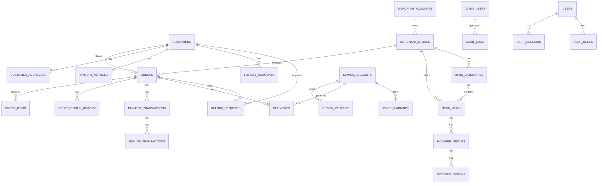

# Software Requirements Specification (SRS)

## Appendix C: Data Dictionary

**Version:** 1.0.0
**Last Updated:** 2026-06-30

---

## Purpose

This appendix provides a comprehensive data dictionary for the **[Platform Name]** platform. It defines all data entities, attributes, field types, constraints, and relationships across the platform's data model. This dictionary serves as the single source of truth for data definitions, ensuring consistent understanding across engineering, product, QA, and operations teams.

---

## Data Model Overview

### Entity Relationship Diagram (Conceptual)

---

## Section 1: Customer Data

### Customer Accounts

| Field Name | Data Type | Constraints | Description | Source Tables |
| :--- | :--- | :--- | :--- | :--- |
| `customer_id` | UUID | PRIMARY KEY, NOT NULL | Unique customer identifier. | customers |
| `first_name` | VARCHAR(100) | NOT NULL | Customer's legal first name. | customers |
| `last_name` | VARCHAR(100) | NOT NULL | Customer's legal last name. | customers |
| `display_name` | VARCHAR(100) | | Customer's public display alias. | customers |
| `email` | VARCHAR(255) | UNIQUE, NOT NULL | Primary email address. | customers |
| `phone` | VARCHAR(20) | UNIQUE, NOT NULL | Primary phone number (E.164 format). | customers |
| `password_hash` | VARCHAR(255) | | bcrypt/Argon2 password hash. | customers |
| `avatar_url` | VARCHAR(500) | | CDN URL for profile picture. | customers |
| `date_of_birth` | DATE | | Customer's date of birth (age verification). | customers |
| `language_preference` | VARCHAR(5) | DEFAULT 'en' | ISO 639-1 language code. | customers |
| `currency_preference` | VARCHAR(3) | DEFAULT 'USD' | ISO 4217 currency code. | customers |
| `theme_preference` | VARCHAR(10) | DEFAULT 'system' | light/dark/system theme. | customers |
| `marketing_consent` | BOOLEAN | DEFAULT FALSE | Opt-in for marketing communications. | customers |
| `push_enabled` | BOOLEAN | DEFAULT TRUE | Push notifications enabled. | customers |
| `email_enabled` | BOOLEAN | DEFAULT TRUE | Email notifications enabled. | customers |
| `sms_enabled` | BOOLEAN | DEFAULT TRUE | SMS notifications enabled. | customers |
| `status` | VARCHAR(20) | DEFAULT 'PENDING_VERIFICATION' | ACTIVE/SUSPENDED/DELETED/PENDING_VERIFICATION. | customers |
| `mfa_enabled` | BOOLEAN | DEFAULT FALSE | Multi-factor authentication enabled. | customers |
| `last_login_at` | TIMESTAMP | | Last successful login timestamp. | customers |
| `created_at` | TIMESTAMP | DEFAULT NOW() | Account creation timestamp. | customers |
| `updated_at` | TIMESTAMP | DEFAULT NOW() | Last profile update timestamp. | customers |
| `deleted_at` | TIMESTAMP | | Soft delete timestamp (GDPR). | customers |

---

### Customer Addresses

| Field Name | Data Type | Constraints | Description | Source Tables |
| :--- | :--- | :--- | :--- | :--- |
| `address_id` | UUID | PRIMARY KEY | Unique address identifier. | customer_addresses |
| `customer_id` | UUID | FOREIGN KEY (customers.customer_id) | Owner of the address. | customer_addresses |
| `label` | VARCHAR(50) | NOT NULL | Address label (e.g., "Home", "Work"). | customer_addresses |
| `address_line_1` | VARCHAR(255) | NOT NULL | Street address / building. | customer_addresses |
| `address_line_2` | VARCHAR(255) | | Apartment, suite, floor. | customer_addresses |
| `city` | VARCHAR(100) | NOT NULL | City name. | customer_addresses |
| `state` | VARCHAR(100) | | State/province. | customer_addresses |
| `postal_code` | VARCHAR(20) | | ZIP/Postal code. | customer_addresses |
| `country` | VARCHAR(5) | NOT NULL | ISO 3166-1 alpha-2 country code. | customer_addresses |
| `latitude` | DECIMAL(10, 8) | NOT NULL | Geocoded latitude. | customer_addresses |
| `longitude` | DECIMAL(11, 8) | NOT NULL | Geocoded longitude. | customer_addresses |
| `is_default` | BOOLEAN | DEFAULT FALSE | Primary delivery address. | customer_addresses |
| `instructions` | TEXT | | Delivery instructions (e.g., gate code). | customer_addresses |
| `created_at` | TIMESTAMP | DEFAULT NOW() | Creation timestamp. | customer_addresses |
| `updated_at` | TIMESTAMP | DEFAULT NOW() | Last update timestamp. | customer_addresses |

---

### Customer Sessions

| Field Name | Data Type | Constraints | Description | Source Tables |
| :--- | :--- | :--- | :--- | :--- |
| `session_id` | UUID | PRIMARY KEY | Unique session identifier. | customer_sessions |
| `customer_id` | UUID | FOREIGN KEY (customers.customer_id) | Associated customer. | customer_sessions |
| `refresh_token` | VARCHAR(255) | UNIQUE | Encrypted refresh token. | customer_sessions |
| `device_id` | VARCHAR(255) | | Unique device identifier. | customer_sessions |
| `device_name` | VARCHAR(100) | | e.g., "iPhone 15 Pro". | customer_sessions |
| `device_type` | VARCHAR(20) | | ios/android/web. | customer_sessions |
| `ip_address` | VARCHAR(45) | | IPv4 or IPv6 address. | customer_sessions |
| `user_agent` | TEXT | | Browser/device user agent. | customer_sessions |
| `is_active` | BOOLEAN | DEFAULT TRUE | Session active status. | customer_sessions |
| `expires_at` | TIMESTAMP | NOT NULL | Session expiration timestamp. | customer_sessions |
| `revoked_at` | TIMESTAMP | | Session revocation timestamp. | customer_sessions |
| `created_at` | TIMESTAMP | DEFAULT NOW() | Session creation timestamp. | customer_sessions |

---

## Section 2: Merchant Data

### Merchant Accounts

| Field Name | Data Type | Constraints | Description | Source Tables |
| :--- | :--- | :--- | :--- | :--- |
| `merchant_id` | UUID | PRIMARY KEY | Unique merchant identifier. | merchant_accounts |
| `business_legal_name` | VARCHAR(255) | NOT NULL | Registered legal business name. | merchant_accounts |
| `business_trading_name` | VARCHAR(255) | NOT NULL | Name displayed to customers. | merchant_accounts |
| `business_registration_number` | VARCHAR(100) | UNIQUE, NOT NULL | Company registration number. | merchant_accounts |
| `tax_id` | VARCHAR(50) | UNIQUE | VAT/GST/EIN/TIN number. | merchant_accounts |
| `business_type` | VARCHAR(50) | NOT NULL | SOLE_PROPRIETORSHIP/LLC/CORPORATION/PARTNERSHIP. | merchant_accounts |
| `business_category` | VARCHAR(50) | NOT NULL | RESTAURANT/CAFE/FAST_FOOD/BAKERY/GROCERY/PHARMACY/RETAIL. | merchant_accounts |
| `primary_cuisine` | VARCHAR(50) | | Primary cuisine type. | merchant_accounts |
| `segment` | VARCHAR(50) | DEFAULT 'INDIVIDUAL' | INDIVIDUAL/MULTI_STORE/GROCERY/ENTERPRISE/DARK_STORE. | merchant_accounts |
| `commission_rate` | DECIMAL(5, 2) | DEFAULT 20.00 | Agreed commission percentage. | merchant_accounts |
| `settlement_frequency` | VARCHAR(20) | DEFAULT 'WEEKLY' | DAILY/WEEKLY/BIWEEKLY/MONTHLY. | merchant_accounts |
| `settlement_day_of_week` | INTEGER | DEFAULT 1 | Day of week for settlements (if weekly). | merchant_accounts |
| `minimum_order_value` | DECIMAL(10, 2) | DEFAULT 0 | Minimum order value for delivery. | merchant_accounts |
| `delivery_radius` | INTEGER | DEFAULT 5000 | Maximum delivery distance in meters. | merchant_accounts |
| `estimated_prep_time` | INTEGER | DEFAULT 15 | Average preparation time in minutes. | merchant_accounts |
| `status` | VARCHAR(20) | DEFAULT 'PENDING' | DRAFT/SUBMITTED/UNDER_REVIEW/ACTION_REQUIRED/APPROVED/ACTIVE/REJECTED/SUSPENDED. | merchant_accounts |
| `application_data` | JSONB | | Full application data snapshot. | merchant_accounts |
| `verified_at` | TIMESTAMP | | Verification completion timestamp. | merchant_accounts |
| `activated_at` | TIMESTAMP | | Account activation timestamp. | merchant_accounts |
| `suspended_at` | TIMESTAMP | | Account suspension timestamp. | merchant_accounts |
| `suspension_reason` | TEXT | | Reason for suspension. | merchant_accounts |
| `created_at` | TIMESTAMP | DEFAULT NOW() | Account creation timestamp. | merchant_accounts |
| `updated_at` | TIMESTAMP | DEFAULT NOW() | Last update timestamp. | merchant_accounts |

---

### Merchant Stores

| Field Name | Data Type | Constraints | Description | Source Tables |
| :--- | :--- | :--- | :--- | :--- |
| `store_id` | UUID | PRIMARY KEY | Unique store identifier. | merchant_stores |
| `merchant_id` | UUID | FOREIGN KEY (merchant_accounts.merchant_id) | Parent merchant account. | merchant_stores |
| `store_name` | VARCHAR(255) | NOT NULL | Store name displayed to customers. | merchant_stores |
| `store_description` | TEXT | | Store description. | merchant_stores |
| `store_category` | VARCHAR(50) | NOT NULL | Primary category. | merchant_stores |
| `store_subcategory` | VARCHAR(50) | | Subcategory (if applicable). | merchant_stores |
| `address_line_1` | VARCHAR(255) | NOT NULL | Street address. | merchant_stores |
| `address_line_2` | VARCHAR(255) | | Apartment/suite/floor. | merchant_stores |
| `city` | VARCHAR(100) | NOT NULL | City. | merchant_stores |
| `state` | VARCHAR(100) | NOT NULL | State/province. | merchant_stores |
| `postal_code` | VARCHAR(20) | NOT NULL | ZIP/Postal code. | merchant_stores |
| `country` | VARCHAR(5) | NOT NULL | ISO country code. | merchant_stores |
| `latitude` | DECIMAL(10, 8) | NOT NULL | Geocoded latitude. | merchant_stores |
| `longitude` | DECIMAL(11, 8) | NOT NULL | Geocoded longitude. | merchant_stores |
| `store_phone` | VARCHAR(20) | NOT NULL | Store contact number. | merchant_stores |
| `store_email` | VARCHAR(255) | NOT NULL | Store contact email. | merchant_stores |
| `store_website` | VARCHAR(255) | | Store website URL. | merchant_stores |
| `logo_url` | VARCHAR(500) | | Store logo URL. | merchant_stores |
| `cover_image_url` | VARCHAR(500) | | Cover/hero image URL. | merchant_stores |
| `store_images` | TEXT[] | | Gallery image URLs. | merchant_stores |
| `operating_days` | JSONB | NOT NULL | Days of operation (JSON). | merchant_stores |
| `operating_hours` | JSONB | NOT NULL | Opening/closing times (JSON). | merchant_stores |
| `is_delivery_enabled` | BOOLEAN | DEFAULT TRUE | Delivery enabled status. | merchant_stores |
| `is_pickup_enabled` | BOOLEAN | DEFAULT TRUE | Pickup enabled status. | merchant_stores |
| `is_active` | BOOLEAN | DEFAULT FALSE | Store active status. | merchant_stores |
| `is_verified` | BOOLEAN | DEFAULT FALSE | Store verification status. | merchant_stores |
| `created_at` | TIMESTAMP | DEFAULT NOW() | Store creation timestamp. | merchant_stores |
| `updated_at` | TIMESTAMP | DEFAULT NOW() | Last update timestamp. | merchant_stores |

---

### Merchant Documents

| Field Name | Data Type | Constraints | Description | Source Tables |
| :--- | :--- | :--- | :--- | :--- |
| `document_id` | UUID | PRIMARY KEY | Unique document identifier. | merchant_documents |
| `merchant_id` | UUID | FOREIGN KEY (merchant_accounts.merchant_id) | Associated merchant. | merchant_documents |
| `document_type` | VARCHAR(50) | NOT NULL | BUSINESS_LICENSE/OWNER_ID/ADDRESS_PROOF/BANK_PROOF/TAX_CERTIFICATE/HEALTH_SAFETY/PREMISES_PHOTOS/MENU. | merchant_documents |
| `document_name` | VARCHAR(255) | NOT NULL | Original filename. | merchant_documents |
| `document_url` | VARCHAR(500) | NOT NULL | CDN/document storage URL. | merchant_documents |
| `document_size` | INTEGER | | File size in bytes. | merchant_documents |
| `document_mime_type` | VARCHAR(50) | | MIME type. | merchant_documents |
| `verification_status` | VARCHAR(20) | DEFAULT 'PENDING' | PENDING/UNDER_REVIEW/VERIFIED/REJECTED/EXPIRED/ACTION_REQUIRED. | merchant_documents |
| `rejection_reason` | TEXT | | Reason if rejected. | merchant_documents |
| `expiry_date` | DATE | | Document expiry date (if applicable). | merchant_documents |
| `uploaded_at` | TIMESTAMP | DEFAULT NOW() | Upload timestamp. | merchant_documents |
| `verified_at` | TIMESTAMP | | Verification timestamp. | merchant_documents |
| `verified_by` | UUID | | Admin who verified. | merchant_documents |
| `created_at` | TIMESTAMP | DEFAULT NOW() | Record creation timestamp. | merchant_documents |
| `updated_at` | TIMESTAMP | DEFAULT NOW() | Last update timestamp. | merchant_documents |

---

### Merchant Contacts

| Field Name | Data Type | Constraints | Description | Source Tables |
| :--- | :--- | :--- | :--- | :--- |
| `contact_id` | UUID | PRIMARY KEY | Unique contact identifier. | merchant_contacts |
| `merchant_id` | UUID | FOREIGN KEY (merchant_accounts.merchant_id) | Associated merchant. | merchant_contacts |
| `contact_type` | VARCHAR(20) | NOT NULL | OWNER/MANAGER/ACCOUNTING/OPERATIONS/TECHNICAL. | merchant_contacts |
| `first_name` | VARCHAR(100) | NOT NULL | First name. | merchant_contacts |
| `last_name` | VARCHAR(100) | NOT NULL | Last name. | merchant_contacts |
| `email` | VARCHAR(255) | NOT NULL | Email address. | merchant_contacts |
| `phone` | VARCHAR(20) | NOT NULL | Phone number. | merchant_contacts |
| `role` | VARCHAR(50) | | Job title/role. | merchant_contacts |
| `is_primary` | BOOLEAN | DEFAULT FALSE | Primary contact for this type. | merchant_contacts |
| `is_active` | BOOLEAN | DEFAULT TRUE | Active status. | merchant_contacts |
| `created_at` | TIMESTAMP | DEFAULT NOW() | Creation timestamp. | merchant_contacts |
| `updated_at` | TIMESTAMP | DEFAULT NOW() | Last update timestamp. | merchant_contacts |

---

### Menu Categories

| Field Name | Data Type | Constraints | Description | Source Tables |
| :--- | :--- | :--- | :--- | :--- |
| `category_id` | UUID | PRIMARY KEY | Unique category identifier. | menu_categories |
| `store_id` | UUID | FOREIGN KEY (merchant_stores.store_id) | Associated store. | menu_categories |
| `category_name` | VARCHAR(100) | NOT NULL | Display name. | menu_categories |
| `category_description` | TEXT | | Category description. | menu_categories |
| `category_image` | VARCHAR(500) | | Category image URL. | menu_categories |
| `display_order` | INTEGER | DEFAULT 0 | Sorting order within menu. | menu_categories |
| `is_available` | BOOLEAN | DEFAULT TRUE | Category availability toggle. | menu_categories |
| `display_on_website` | BOOLEAN | DEFAULT TRUE | Show/hide on web/mobile. | menu_categories |
| `parent_category_id` | UUID | FOREIGN KEY (menu_categories.category_id) | Parent category (sub-categories). | menu_categories |
| `is_featured` | BOOLEAN | DEFAULT FALSE | Featured category flag. | menu_categories |
| `slug` | VARCHAR(255) | UNIQUE | URL-friendly identifier. | menu_categories |
| `created_at` | TIMESTAMP | DEFAULT NOW() | Creation timestamp. | menu_categories |
| `updated_at` | TIMESTAMP | DEFAULT NOW() | Last update timestamp. | menu_categories |

---

### Menu Items

| Field Name | Data Type | Constraints | Description | Source Tables |
| :--- | :--- | :--- | :--- | :--- |
| `item_id` | UUID | PRIMARY KEY | Unique item identifier. | menu_items |
| `store_id` | UUID | FOREIGN KEY (merchant_stores.store_id) | Associated store. | menu_items |
| `category_id` | UUID | FOREIGN KEY (menu_categories.category_id) | Parent category. | menu_items |
| `item_name` | VARCHAR(255) | NOT NULL | Product display name. | menu_items |
| `item_description` | TEXT | | Detailed description. | menu_items |
| `item_short_description` | VARCHAR(255) | | Brief description. | menu_items |
| `price` | DECIMAL(12, 2) | NOT NULL | Current selling price. | menu_items |
| `compare_at_price` | DECIMAL(12, 2) | | Original price (for discounts). | menu_items |
| `cost_price` | DECIMAL(12, 2) | | Merchant cost. | menu_items |
| `primary_image` | VARCHAR(500) | | Primary product image URL. | menu_items |
| `gallery_images` | TEXT[] | | Gallery image URLs. | menu_items |
| `sku` | VARCHAR(100) | | Stock keeping unit. | menu_items |
| `barcode` | VARCHAR(50) | | Barcode/UPC. | menu_items |
| `weight` | DECIMAL(10, 2) | | Product weight. | menu_items |
| `preparation_time` | INTEGER` | | Prep time override (minutes). | menu_items |
| `is_available` | BOOLEAN | DEFAULT TRUE | Availability toggle. | menu_items |
| `is_featured` | BOOLEAN | DEFAULT FALSE | Featured item flag. | menu_items |
| `is_best_seller` | BOOLEAN | DEFAULT FALSE | Best seller badge. | menu_items |
| `is_new` | BOOLEAN | DEFAULT FALSE | New item badge. | menu_items |
| `dietary_tags` | TEXT[] | | VEGAN/VEGETARIAN/GLUTEN_FREE/HALAL. | menu_items |
| `allergen_tags` | TEXT[] | | NUTS/DAIRY/EGGS/SOY/SHELLFISH/WHEAT. | menu_items |
| `portion_size` | VARCHAR(50) | | Serving size. | menu_items |
| `calories` | INTEGER | | Calorie count. | menu_items |
| `nutrition_facts` | JSONB | | Structured nutrition information. | menu_items |
| `tags` | TEXT[] | | Custom search tags. | menu_items |
| `slug` | VARCHAR(255) | UNIQUE | URL-friendly identifier. | menu_items |
| `sort_order` | INTEGER | DEFAULT 0 | Display order. | menu_items |
| `min_order_quantity` | INTEGER | DEFAULT 1 | Minimum quantity. | menu_items |
| `max_order_quantity` | INTEGER | | Maximum quantity. | menu_items |
| `allow_zero_price` | BOOLEAN | DEFAULT FALSE | Allow free items. | menu_items |
| `created_at` | TIMESTAMP | DEFAULT NOW() | Creation timestamp. | menu_items |
| `updated_at` | TIMESTAMP | DEFAULT NOW() | Last update timestamp. | menu_items |
| `last_ordered_at` | TIMESTAMP | | Last order timestamp. | menu_items |

---

### Modifier Groups

| Field Name | Data Type | Constraints | Description | Source Tables |
| :--- | :--- | :--- | :--- | :--- |
| `modifier_group_id` | UUID | PRIMARY KEY | Unique group identifier. | modifier_groups |
| `item_id` | UUID | FOREIGN KEY (menu_items.item_id) | Associated menu item. | modifier_groups |
| `group_name` | VARCHAR(100) | NOT NULL | Display name. | modifier_groups |
| `group_type` | VARCHAR(20) | NOT NULL | SINGLE/MULTI/QUANTITY/TEXT. | modifier_groups |
| `min_selections` | INTEGER | DEFAULT 0 | Minimum selections required. | modifier_groups |
| `max_selections` | INTEGER | | Maximum selections allowed. | modifier_groups |
| `is_required` | BOOLEAN | DEFAULT FALSE | Required selection. | modifier_groups |
| `display_order` | INTEGER | DEFAULT 0 | Display order. | modifier_groups |
| `is_available` | BOOLEAN | DEFAULT TRUE | Availability toggle. | modifier_groups |
| `created_at` | TIMESTAMP | DEFAULT NOW() | Creation timestamp. | modifier_groups |
| `updated_at` | TIMESTAMP | DEFAULT NOW() | Last update timestamp. | modifier_groups |

---

### Modifier Options

| Field Name | Data Type | Constraints | Description | Source Tables |
| :--- | :--- | :--- | :--- | :--- |
| `modifier_option_id` | UUID | PRIMARY KEY | Unique option identifier. | modifier_options |
| `modifier_group_id` | UUID | FOREIGN KEY (modifier_groups.modifier_group_id) | Associated group. | modifier_options |
| `option_name` | VARCHAR(100) | NOT NULL | Display name. | modifier_options |
| `price_adjustment` | DECIMAL(12, 2) | DEFAULT 0 | Price change. | modifier_options |
| `weight_adjustment` | DECIMAL(10, 2) | | Weight change. | modifier_options |
| `prep_time_adjustment` | INTEGER | | Prep time impact (minutes). | modifier_options |
| `calorie_adjustment` | INTEGER | | Calorie impact. | modifier_options |
| `is_available` | BOOLEAN | DEFAULT TRUE | Availability toggle. | modifier_options |
| `is_default` | BOOLEAN | DEFAULT FALSE | Default selection. | modifier_options |
| `display_order` | INTEGER | DEFAULT 0 | Display order. | modifier_options |
| `created_at` | TIMESTAMP | DEFAULT NOW() | Creation timestamp. | modifier_options |
| `updated_at` | TIMESTAMP | DEFAULT NOW() | Last update timestamp. | modifier_options |

---

## Section 3: Driver Data

### Driver Accounts

| Field Name | Data Type | Constraints | Description | Source Tables |
| :--- | :--- | :--- | :--- | :--- |
| `driver_id` | UUID | PRIMARY KEY | Unique driver identifier. | driver_accounts |
| `first_name` | VARCHAR(100) | NOT NULL | Legal first name. | driver_accounts |
| `last_name` | VARCHAR(100) | NOT NULL | Legal last name. | driver_accounts |
| `date_of_birth` | DATE | NOT NULL | Date of birth. | driver_accounts |
| `nationality` | VARCHAR(50) | NOT NULL | Country of nationality. | driver_accounts |
| `email` | VARCHAR(255) | UNIQUE, NOT NULL | Primary email. | driver_accounts |
| `phone` | VARCHAR(20) | UNIQUE, NOT NULL | Primary phone (E.164). | driver_accounts |
| `alternate_phone` | VARCHAR(20) | | Alternate phone. | driver_accounts |
| `address_line_1` | VARCHAR(255) | NOT NULL | Residential address. | driver_accounts |
| `address_line_2` | VARCHAR(255) | | Apartment/suite/floor. | driver_accounts |
| `city` | VARCHAR(100) | NOT NULL | City. | driver_accounts |
| `state` | VARCHAR(100) | NOT NULL | State/province. | driver_accounts |
| `postal_code` | VARCHAR(20) | NOT NULL | ZIP/Postal code. | driver_accounts |
| `country` | VARCHAR(5) | NOT NULL | Country. | driver_accounts |
| `languages_spoken` | TEXT[] | | Languages spoken. | driver_accounts |
| `driver_type` | VARCHAR(30) | NOT NULL | INDIVIDUAL/FLEET/ENTERPRISE. | driver_accounts |
| `availability` | JSONB | | Preferred working hours/days. | driver_accounts |
| `status` | VARCHAR(20) | DEFAULT 'PENDING' | DRAFT/SUBMITTED/UNDER_REVIEW/VERIFIED/ONBOARDING/ACTIVE/REJECTED/SUSPENDED. | driver_accounts |
| `rating` | DECIMAL(3, 2) | DEFAULT 0 | Average driver rating. | driver_accounts |
| `total_deliveries` | INTEGER | DEFAULT 0 | Total deliveries completed. | driver_accounts |
| `active_since` | TIMESTAMP` | | Account activation timestamp. | driver_accounts |
| `last_active_at` | TIMESTAMP` | | Last activity timestamp. | driver_accounts |
| `created_at` | TIMESTAMP | DEFAULT NOW() | Account creation timestamp. | driver_accounts |
| `updated_at` | TIMESTAMP | DEFAULT NOW() | Last update timestamp. | driver_accounts |

---

### Driver Vehicles

| Field Name | Data Type | Constraints | Description | Source Tables |
| :--- | :--- | :--- | :--- | :--- |
| `vehicle_id` | UUID | PRIMARY KEY | Unique vehicle identifier. | driver_vehicles |
| `driver_id` | UUID | FOREIGN KEY (driver_accounts.driver_id) | Associated driver. | driver_vehicles |
| `vehicle_type` | VARCHAR(20) | NOT NULL | CAR/MOTORCYCLE/SCOOTER/BICYCLE/VAN/TRUCK. | driver_vehicles |
| `vehicle_make` | VARCHAR(50) | NOT NULL | Vehicle manufacturer. | driver_vehicles |
| `vehicle_model` | VARCHAR(50) | NOT NULL | Vehicle model. | driver_vehicles |
| `vehicle_year` | INTEGER | NOT NULL | Manufacturing year. | driver_vehicles |
| `vehicle_color` | VARCHAR(30) | NOT NULL | Vehicle color. | driver_vehicles |
| `license_plate` | VARCHAR(50) | UNIQUE, NOT NULL | License plate number. | driver_vehicles |
| `registration_number` | VARCHAR(100) | NOT NULL | Registration document number. | driver_vehicles |
| `registration_expiry` | DATE | NOT NULL | Registration expiry date. | driver_vehicles |
| `insurance_provider` | VARCHAR(100) | NOT NULL | Insurance company. | driver_vehicles |
| `insurance_policy_number` | VARCHAR(100) | NOT NULL | Insurance policy number. | driver_vehicles |
| `insurance_expiry` | DATE | NOT NULL | Insurance expiry date. | driver_vehicles |
| `vehicle_capacity` | INTEGER | | Vehicle capacity (kg/liters). | driver_vehicles |
| `has_insulated_bag` | BOOLEAN | DEFAULT FALSE | Has thermal delivery bag. | driver_vehicles |
| `has_helmet` | BOOLEAN | DEFAULT FALSE | Has safety helmet. | driver_vehicles |
| `vehicle_photos` | TEXT[] | | Vehicle photo URLs. | driver_vehicles |
| `is_active` | BOOLEAN | DEFAULT TRUE | Active status. | driver_vehicles |
| `verified_at` | TIMESTAMP | | Verification timestamp. | driver_vehicles |
| `created_at` | TIMESTAMP | DEFAULT NOW() | Creation timestamp. | driver_vehicles |
| `updated_at` | TIMESTAMP | DEFAULT NOW() | Last update timestamp. | driver_vehicles |

---

### Driver Documents

| Field Name | Data Type | Constraints | Description | Source Tables |
| :--- | :--- | :--- | :--- | :--- |
| `document_id` | UUID | PRIMARY KEY | Unique document identifier. | driver_documents |
| `driver_id` | UUID | FOREIGN KEY (driver_accounts.driver_id) | Associated driver. | driver_documents |
| `document_type` | VARCHAR(30) | NOT NULL | ID_PROOF/DRIVING_LICENSE/VEHICLE_REGISTRATION/INSURANCE/PHOTO/BANK_PROOF/BACKGROUND_CONSENT/HEALTH_CERTIFICATE/POLICE_CLEARANCE/WORK_PERMIT. | driver_documents |
| `document_name` | VARCHAR(255) | NOT NULL | Original filename. | driver_documents |
| `document_url` | VARCHAR(500) | NOT NULL | CDN/document storage URL. | driver_documents |
| `document_size` | INTEGER | | File size in bytes. | driver_documents |
| `document_mime_type` | VARCHAR(50) | | MIME type. | driver_documents |
| `document_number` | VARCHAR(100) | | Document number (license, policy, etc.). | driver_documents |
| `expiry_date` | DATE | | Document expiry date. | driver_documents |
| `verification_status` | VARCHAR(20) | DEFAULT 'PENDING' | PENDING/UNDER_REVIEW/VERIFIED/REJECTED/EXPIRED/ACTION_REQUIRED. | driver_documents |
| `rejection_reason` | TEXT | | Reason if rejected. | driver_documents |
| `verified_by` | UUID | | Admin who verified. | driver_documents |
| `verified_at` | TIMESTAMP | | Verification timestamp. | driver_documents |
| `created_at` | TIMESTAMP | DEFAULT NOW() | Upload timestamp. | driver_documents |
| `updated_at` | TIMESTAMP | DEFAULT NOW() | Last update timestamp. | driver_documents |

---

## Section 4: Order Data

### Orders

| Field Name | Data Type | Constraints | Description | Source Tables |
| :--- | :--- | :--- | :--- | :--- |
| `order_id` | UUID | PRIMARY KEY | Unique order identifier. | orders |
| `customer_id` | UUID | FOREIGN KEY (customers.customer_id) | Customer who placed the order. | orders |
| `merchant_id` | UUID | FOREIGN KEY (merchant_accounts.merchant_id) | Merchant fulfilling the order. | orders |
| `store_id` | UUID | FOREIGN KEY (merchant_stores.store_id) | Specific store location. | orders |
| `driver_id` | UUID | FOREIGN KEY (driver_accounts.driver_id) | Assigned driver. | orders |
| `order_reference` | VARCHAR(50) | UNIQUE, NOT NULL | Human-readable order number. | orders |
| `status` | VARCHAR(20) | NOT NULL | Current order status. | orders |
| `order_data` | JSONB | NOT NULL | Full order snapshot. | orders |
| `subtotal` | DECIMAL(12, 2) | NOT NULL | Sum of item prices. | orders |
| `delivery_fee` | DECIMAL(12, 2) | DEFAULT 0 | Delivery charge. | orders |
| `service_fee` | DECIMAL(12, 2) | DEFAULT 0 | Platform service fee. | orders |
| `tax` | DECIMAL(12, 2) | DEFAULT 0 | Tax amount. | orders |
| `discount` | DECIMAL(12, 2) | DEFAULT 0 | Discount amount. | orders |
| `total` | DECIMAL(12, 2) | NOT NULL | Order total. | orders |
| `currency` | VARCHAR(3) | NOT NULL | ISO 4217 currency. | orders |
| `payment_method` | VARCHAR(50) | NOT NULL | Payment method used. | orders |
| `payment_status` | VARCHAR(20) | DEFAULT 'PENDING' | PENDING/AUTHORIZED/CAPTURED/REFUNDED/FAILED. | orders |
| `delivery_address` | JSONB | NOT NULL | Delivery address snapshot. | orders |
| `customer_notes` | TEXT | | Customer instructions. | orders |
| `internal_notes` | TEXT | | Internal merchant/ops notes. | orders |
| `preparation_time_estimate` | INTEGER | | Estimated prep time (minutes). | orders |
| `preparation_time_actual` | INTEGER | | Actual prep time (minutes). | orders |
| `delivery_time_estimate` | INTEGER | | Estimated delivery time (minutes). | orders |
| `delivery_time_actual` | INTEGER | | Actual delivery time (minutes). | orders |
| `is_scheduled` | BOOLEAN | DEFAULT FALSE | Scheduled order flag. | orders |
| `scheduled_time` | TIMESTAMP | | Requested delivery time. | orders |
| `idempotency_key` | VARCHAR(255) | UNIQUE | Deduplication key. | orders |
| `cancellation_reason` | VARCHAR(100) | | Reason for cancellation. | orders |
| `cancelled_by` | VARCHAR(20) | | CUSTOMER/MERCHANT/PLATFORM. | orders |
| `cancelled_at` | TIMESTAMP | | Cancellation timestamp. | orders |
| `confirmed_at` | TIMESTAMP | | Confirmation timestamp. | orders |
| `preparing_at` | TIMESTAMP | | Preparation start timestamp. | orders |
| `ready_at` | TIMESTAMP | | Ready timestamp. | orders |
| `assigned_at` | TIMESTAMP | | Driver assignment timestamp. | orders |
| `picked_up_at` | TIMESTAMP | | Pickup timestamp. | orders |
| `delivered_at` | TIMESTAMP | | Delivery timestamp. | orders |
| `is_archived` | BOOLEAN | DEFAULT FALSE | Archival flag. | orders |
| `archived_at` | TIMESTAMP | | Archival timestamp. | orders |
| `created_at` | TIMESTAMP | DEFAULT NOW() | Order creation timestamp. | orders |
| `updated_at` | TIMESTAMP | DEFAULT NOW() | Last update timestamp. | orders |

---

### Order Items

| Field Name | Data Type | Constraints | Description | Source Tables |
| :--- | :--- | :--- | :--- | :--- |
| `order_item_id` | UUID | PRIMARY KEY | Unique identifier. | order_items |
| `order_id` | UUID | FOREIGN KEY (orders.order_id) | Associated order. | order_items |
| `item_id` | UUID | FOREIGN KEY (menu_items.item_id) | Menu item (snapshot reference). | order_items |
| `item_name` | VARCHAR(255) | NOT NULL | Item name (snapshot). | order_items |
| `item_price` | DECIMAL(12, 2) | NOT NULL | Item price at order time. | order_items |
| `quantity` | INTEGER | NOT NULL | Quantity ordered. | order_items |
| `subtotal` | DECIMAL(12, 2) | NOT NULL | Item subtotal (price * quantity). | order_items |
| `modifiers` | JSONB | | Modifiers snapshot. | order_items |
| `special_instructions` | TEXT | | Item-specific instructions. | order_items |
| `status` | VARCHAR(20) | DEFAULT 'PENDING' | PENDING/PREPARING/READY/CANCELLED. | order_items |
| `created_at` | TIMESTAMP | DEFAULT NOW() | Creation timestamp. | order_items |
| `updated_at` | TIMESTAMP | DEFAULT NOW() | Last update timestamp. | order_items |

---

### Order Status History

| Field Name | Data Type | Constraints | Description | Source Tables |
| :--- | :--- | :--- | :--- | :--- |
| `history_id` | UUID | PRIMARY KEY | Unique identifier. | order_status_history |
| `order_id` | UUID | FOREIGN KEY (orders.order_id) | Associated order. | order_status_history |
| `status` | VARCHAR(20) | NOT NULL | Status at this point. | order_status_history |
| `source` | VARCHAR(20) | NOT NULL | CUSTOMER/MERCHANT/DRIVER/SYSTEM/ADMIN. | order_status_history |
| `source_id` | UUID | | User/driver ID who triggered. | order_status_history |
| `reason` | TEXT | | Reason for status change. | order_status_history |
| `metadata` | JSONB | | Additional context. | order_status_history |
| `created_at` | TIMESTAMP | DEFAULT NOW() | Status timestamp. | order_status_history |

---

### Order Timeline

| Field Name | Data Type | Constraints | Description | Source Tables |
| :--- | :--- | :--- | :--- | :--- |
| `timeline_id` | UUID | PRIMARY KEY | Unique identifier. | order_timeline |
| `order_id` | UUID | FOREIGN KEY (orders.order_id) | Associated order. | order_timeline |
| `event_type` | VARCHAR(30) | NOT NULL | order_placed/order_confirmed/preparation_started/order_ready/driver_assigned/order_picked_up/in_transit/arriving_soon/order_delivered/order_cancelled/delivery_failed/refund_processed. | order_timeline |
| `status` | VARCHAR(20) | NOT NULL | Order status at event. | order_timeline |
| `description` | TEXT | NOT NULL | Human-readable description. | order_timeline |
| `source_type` | VARCHAR(20) | | CUSTOMER/MERCHANT/DRIVER/SYSTEM/ADMIN. | order_timeline |
| `source_id` | UUID | | Source identifier. | order_timeline |
| `location` | JSONB | | Location at event. | order_timeline |
| `metadata` | JSONB | | Additional event data. | order_timeline |
| `created_at` | TIMESTAMP | DEFAULT NOW() | Event timestamp. | order_timeline |

---

## Section 5: Payment Data

### Payment Transactions

| Field Name | Data Type | Constraints | Description | Source Tables |
| :--- | :--- | :--- | :--- | :--- |
| `transaction_id` | UUID | PRIMARY KEY | Unique transaction identifier. | payment_transactions |
| `order_id` | UUID | FOREIGN KEY (orders.order_id) | Associated order. | payment_transactions |
| `customer_id` | UUID | FOREIGN KEY (customers.customer_id) | Associated customer. | payment_transactions |
| `gateway_name` | VARCHAR(50) | NOT NULL | stripe/paymob/adyen. | payment_transactions |
| `gateway_transaction_id` | VARCHAR(255) | | Gateway transaction ID. | payment_transactions |
| `transaction_type` | VARCHAR(20) | NOT NULL | AUTHORIZATION/CAPTURE/REFUND/VOID. | payment_transactions |
| `amount` | DECIMAL(12, 2) | NOT NULL | Transaction amount. | payment_transactions |
| `currency` | VARCHAR(3) | NOT NULL | ISO 4217 currency. | payment_transactions |
| `status` | VARCHAR(20) | NOT NULL | PENDING/AUTHORIZED/CAPTURED/FAILED/REFUNDED/VOIDED. | payment_transactions |
| `payment_method` | VARCHAR(50) | | Payment method used. | payment_transactions |
| `payment_method_details` | JSONB` | | Payment method details. | payment_transactions |
| `idempotency_key` | VARCHAR(255) | UNIQUE | Idempotency key. | payment_transactions |
| `error_code` | VARCHAR(50) | | Error code. | payment_transactions |
| `error_message` | TEXT` | | Error message. | payment_transactions |
| `created_at` | TIMESTAMP | DEFAULT NOW() | Creation timestamp. | payment_transactions |
| `updated_at` | TIMESTAMP | DEFAULT NOW() | Last update timestamp. | payment_transactions |

---

### Payment Methods

| Field Name | Data Type | Constraints | Description | Source Tables |
| :--- | :--- | :--- | :--- | :--- |
| `payment_method_id` | UUID | PRIMARY KEY | Unique payment method identifier. | payment_methods |
| `customer_id` | UUID | FOREIGN KEY (customers.customer_id) | Owner of the payment method. | payment_methods |
| `method_type` | VARCHAR(30) | NOT NULL | CARD/WALLET/MOBILE_WALLET/COD/BNPL/LOCAL. | payment_methods |
| `provider` | VARCHAR(50) | | stripe/paymob/adyen/apple_pay/google_pay/tabby/tamara. | payment_methods |
| `provider_token` | VARCHAR(255) | | Token from payment provider. | payment_methods |
| `last_four` | VARCHAR(4) | | Last 4 digits (for cards). | payment_methods |
| `card_brand` | VARCHAR(20) | | visa/mastercard/amex/mada. | payment_methods |
| `expiry_month` | INTEGER | | Expiry month (MM). | payment_methods |
| `expiry_year` | INTEGER | | Expiry year (YYYY). | payment_methods |
| `cardholder_name` | VARCHAR(100) | | Name on card. | payment_methods |
| `billing_address` | JSONB` | | Billing address. | payment_methods |
| `is_default` | BOOLEAN | DEFAULT FALSE | Default payment method. | payment_methods |
| `is_active` | BOOLEAN | DEFAULT TRUE | Active status. | payment_methods |
| `last_used_at` | TIMESTAMP` | | Last use timestamp. | payment_methods |
| `created_at` | TIMESTAMP | DEFAULT NOW() | Creation timestamp. | payment_methods |
| `updated_at` | TIMESTAMP | DEFAULT NOW() | Last update timestamp. | payment_methods |

---

### Refund Requests

| Field Name | Data Type | Constraints | Description | Source Tables |
| :--- | :--- | :--- | :--- | :--- |
| `request_id` | UUID | PRIMARY KEY | Unique identifier. | refund_requests |
| `order_id` | UUID | FOREIGN KEY (orders.order_id) | Associated order. | refund_requests |
| `customer_id` | UUID | FOREIGN KEY (customers.customer_id) | Requesting customer. | refund_requests |
| `refund_type` | VARCHAR(20) | NOT NULL | FULL/PARTIAL/ITEM/FEE/VOUCHER/WALLET. | refund_requests |
| `reason` | VARCHAR(30) | NOT NULL | MISSING_ITEMS/WRONG_ITEMS/DAMAGED/LATE/NOT_DELIVERED/QUALITY/OTHER. | refund_requests |
| `description` | TEXT | | Detailed description. | refund_requests |
| `requested_amount` | DECIMAL(10, 2) | NOT NULL | Amount requested. | refund_requests |
| `approved_amount` | DECIMAL(10, 2) | | Approved amount. | refund_requests |
| `refund_method` | VARCHAR(20) | | WALLET/ORIGINAL/VOUCHER. | refund_requests |
| `status` | VARCHAR(20) | DEFAULT 'PENDING' | PENDING/APPROVED/REJECTED/PROCESSING/COMPLETED/FAILED. | refund_requests |
| `reviewed_by` | UUID | | Admin who reviewed. | refund_requests |
| `reviewed_at` | TIMESTAMP | | Review timestamp. | refund_requests |
| `processed_by` | UUID | | Admin who processed. | refund_requests |
| `processed_at` | TIMESTAMP | | Processing timestamp. | refund_requests |
| `completed_at` | TIMESTAMP | | Completion timestamp. | refund_requests |
| `failure_reason` | TEXT | | Reason for failure. | refund_requests |
| `created_at` | TIMESTAMP | DEFAULT NOW() | Creation timestamp. | refund_requests |
| `updated_at` | TIMESTAMP | DEFAULT NOW() | Last update timestamp. | refund_requests |

---

## Section 6: Delivery Data

### Deliveries

| Field Name | Data Type | Constraints | Description | Source Tables |
| :--- | :--- | :--- | :--- | :--- |
| `delivery_id` | UUID | PRIMARY KEY | Unique delivery identifier. | deliveries |
| `order_id` | UUID | UNIQUE, FOREIGN KEY (orders.order_id) | Associated order (one delivery per order). | deliveries |
| `driver_id` | UUID | FOREIGN KEY (driver_accounts.driver_id) | Assigned driver. | deliveries |
| `status` | VARCHAR(20) | NOT NULL | ASSIGNED/PICKED_UP/IN_TRANSIT/ARRIVING/COMPLETED/FAILED. | deliveries |
| `assigned_at` | TIMESTAMP | | Driver assignment timestamp. | deliveries |
| `picked_up_at` | TIMESTAMP | | Driver pickup timestamp. | deliveries |
| `in_transit_at` | TIMESTAMP | | Start of transit timestamp. | deliveries |
| `arriving_soon_at` | TIMESTAMP | | Within 2-minute ETA timestamp. | deliveries |
| `delivered_at` | TIMESTAMP | | Delivery completion timestamp. | deliveries |
| `failed_at` | TIMESTAMP | | Delivery failure timestamp. | deliveries |
| `failure_reason` | VARCHAR(50) | | Reason for delivery failure. | deliveries |
| `qr_code` | VARCHAR(100) | | QR code for delivery verification. | deliveries |
| `otp_code` | VARCHAR(10) | | OTP for delivery verification (encrypted). | deliveries |
| `verification_method` | VARCHAR(20) | | QR/OTP/PHOTO/GPS/SIGNATURE. | deliveries |
| `verification_status` | VARCHAR(20) | DEFAULT 'PENDING' | PENDING/VERIFIED/FAILED. | deliveries |
| `customer_contacted` | BOOLEAN | DEFAULT FALSE | Whether driver contacted customer. | deliveries |
| `instructions_used` | TEXT | | Delivery instructions applied. | deliveries |
| `route_data` | JSONB | | Encoded route polyline. | deliveries |
| `total_distance` | DECIMAL(10, 2) | | Total distance driven (km). | deliveries |
| `total_time` | INTEGER | | Total time from pickup to delivery (seconds). | deliveries |
| `created_at` | TIMESTAMP | DEFAULT NOW() | Delivery record creation timestamp. | deliveries |
| `updated_at` | TIMESTAMP | DEFAULT NOW() | Last update timestamp. | deliveries |

---

### Delivery Location History

| Field Name | Data Type | Constraints | Description | Source Tables |
| :--- | :--- | :--- | :--- | :--- |
| `history_id` | UUID | PRIMARY KEY | Unique location history entry. | delivery_location_history |
| `delivery_id` | UUID | FOREIGN KEY (deliveries.delivery_id) | Associated delivery. | delivery_location_history |
| `latitude` | DECIMAL(10, 8) | NOT NULL | GPS latitude. | delivery_location_history |
| `longitude` | DECIMAL(11, 8) | NOT NULL | GPS longitude. | delivery_location_history |
| `accuracy` | DECIMAL(5, 2) | | GPS accuracy (meters). | delivery_location_history |
| `speed` | DECIMAL(5, 2) | | Speed (km/h). | delivery_location_history |
| `heading` | DECIMAL(5, 2) | | Heading direction (degrees). | delivery_location_history |
| `recorded_at` | TIMESTAMP | DEFAULT NOW() | When location was recorded. | delivery_location_history |
| `created_at` | TIMESTAMP | DEFAULT NOW() | Record creation timestamp. | delivery_location_history |

---

## Section 7: Financial Data

### Merchant Settlements

| Field Name | Data Type | Constraints | Description | Source Tables |
| :--- | :--- | :--- | :--- | :--- |
| `settlement_id` | UUID | PRIMARY KEY | Unique settlement identifier. | merchant_settlements |
| `merchant_id` | UUID | FOREIGN KEY (merchant_accounts.merchant_id) | Associated merchant. | merchant_settlements |
| `store_id` | UUID | FOREIGN KEY (merchant_stores.store_id) | Associated store. | merchant_settlements |
| `period_start` | DATE | NOT NULL | Settlement period start. | merchant_settlements |
| `period_end` | DATE | NOT NULL | Settlement period end. | merchant_settlements |
| `order_count` | INTEGER | NOT NULL | Number of orders. | merchant_settlements |
| `gross_revenue` | DECIMAL(12, 2) | NOT NULL | Total order value. | merchant_settlements |
| `total_commission` | DECIMAL(12, 2) | NOT NULL | Commission deducted. | merchant_settlements |
| `total_service_fee` | DECIMAL(12, 2) | DEFAULT 0 | Service fees deducted. | merchant_settlements |
| `total_delivery_fee_retained` | DECIMAL(12, 2) | DEFAULT 0 | Delivery fees retained. | merchant_settlements |
| `total_payment_fee` | DECIMAL(12, 2) | DEFAULT 0 | Payment processing fees. | merchant_settlements |
| `total_promotions` | DECIMAL(12, 2) | DEFAULT 0 | Promotions/discounts. | merchant_settlements |
| `total_adjustments` | DECIMAL(12, 2) | DEFAULT 0 | Manual adjustments. | merchant_settlements |
| `total_tax` | DECIMAL(12, 2) | DEFAULT 0 | Tax collected. | merchant_settlements |
| `net_amount` | DECIMAL(12, 2) | NOT NULL | Net settlement amount. | merchant_settlements |
| `currency` | VARCHAR(3) | NOT NULL | ISO 4217 currency. | merchant_settlements |
| `status` | VARCHAR(20) | DEFAULT 'PENDING' | PENDING/PROCESSING/COMPLETED/FAILED. | merchant_settlements |
| `settlement_date` | DATE | | Date processed. | merchant_settlements |
| `payout_id` | UUID | | Reference to payout. | merchant_settlements |
| `created_at` | TIMESTAMP | DEFAULT NOW() | Creation timestamp. | merchant_settlements |
| `updated_at` | TIMESTAMP | DEFAULT NOW() | Last update timestamp. | merchant_settlements |

---

### Driver Earnings

| Field Name | Data Type | Constraints | Description | Source Tables |
| :--- | :--- | :--- | :--- | :--- |
| `earning_id` | UUID | PRIMARY KEY | Unique identifier. | driver_earnings |
| `driver_id` | UUID | FOREIGN KEY (driver_accounts.driver_id) | Associated driver. | driver_earnings |
| `order_id` | UUID | FOREIGN KEY (orders.order_id) | Associated order. | driver_earnings |
| `delivery_id` | UUID | FOREIGN KEY (deliveries.delivery_id) | Associated delivery. | driver_earnings |
| `base_fee` | DECIMAL(10, 2) | DEFAULT 0 | Base delivery fee. | driver_earnings |
| `distance_fee` | DECIMAL(10, 2) | DEFAULT 0 | Distance-based fee. | driver_earnings |
| `distance_km` | DECIMAL(10, 2) | | Distance in kilometers. | driver_earnings |
| `time_fee` | DECIMAL(10, 2) | DEFAULT 0 | Time-based fee. | driver_earnings |
| `time_minutes` | INTEGER | | Time in minutes. | driver_earnings |
| `peak_bonus` | DECIMAL(10, 2) | DEFAULT 0 | Peak hour bonus. | driver_earnings |
| `tip_amount` | DECIMAL(10, 2) | DEFAULT 0 | Customer tip. | driver_earnings |
| `incentive_bonus` | DECIMAL(10, 2) | DEFAULT 0 | Performance bonus. | driver_earnings |
| `wait_time_compensation` | DECIMAL(10, 2) | DEFAULT 0 | Wait time compensation. | driver_earnings |
| `cancellation_fee` | DECIMAL(10, 2) | DEFAULT 0 | Cancellation fee. | driver_earnings |
| `adjustment_amount` | DECIMAL(10, 2) | DEFAULT 0 | Manual adjustments. | driver_earnings |
| `total_earnings` | DECIMAL(10, 2) | NOT NULL | Total earnings for delivery. | driver_earnings |
| `currency` | VARCHAR(3) | NOT NULL | ISO 4217 currency code. | driver_earnings |
| `status` | VARCHAR(20) | DEFAULT 'PENDING' | PENDING/PROCESSED/PAID/ADJUSTED. | driver_earnings |
| `created_at` | TIMESTAMP | DEFAULT NOW() | Creation timestamp. | driver_earnings |
| `updated_at` | TIMESTAMP | DEFAULT NOW() | Last update timestamp. | driver_earnings |

---

## Section 8: Security & Audit Data

### Users

| Field Name | Data Type | Constraints | Description | Source Tables |
| :--- | :--- | :--- | :--- | :--- |
| `user_id` | UUID | PRIMARY KEY | Unique user identifier. | users |
| `user_type` | VARCHAR(20) | NOT NULL | CUSTOMER/MERCHANT/DRIVER/ADMIN/PARTNER. | users |
| `email` | VARCHAR(255) | UNIQUE | Email address. | users |
| `phone` | VARCHAR(20) | | Phone number (E.164). | users |
| `password_hash` | VARCHAR(255) | | bcrypt/Argon2 hash. | users |
| `first_name` | VARCHAR(100) | | First name. | users |
| `last_name` | VARCHAR(100) | | Last name. | users |
| `display_name` | VARCHAR(100) | | Display name. | users |
| `avatar_url` | VARCHAR(500) | | Profile image URL. | users |
| `language` | VARCHAR(5) | DEFAULT 'en' | Preferred language. | users |
| `timezone` | VARCHAR(50) | | Timezone. | users |
| `is_active` | BOOLEAN | DEFAULT TRUE | Active status. | users |
| `email_verified` | BOOLEAN | DEFAULT FALSE | Email verification. | users |
| `phone_verified` | BOOLEAN | DEFAULT FALSE | Phone verification. | users |
| `mfa_enabled` | BOOLEAN | DEFAULT FALSE | MFA enabled. | users |
| `last_login` | TIMESTAMP | | Last login timestamp. | users |
| `created_at` | TIMESTAMP | DEFAULT NOW() | Creation timestamp. | users |
| `updated_at` | TIMESTAMP | DEFAULT NOW() | Last update timestamp. | users |

---

### Audit Logs

| Field Name | Data Type | Constraints | Description | Source Tables |
| :--- | :--- | :--- | :--- | :--- |
| `audit_id` | UUID | PRIMARY KEY | Unique identifier. | admin_audit_logs |
| `user_id` | UUID | FOREIGN KEY (admin_users.user_id) | Associated user. | admin_audit_logs |
| `action_type` | VARCHAR(50) | NOT NULL | Action type. | admin_audit_logs |
| `action_description` | TEXT | NOT NULL | Description of action. | admin_audit_logs |
| `ip_address` | VARCHAR(45) | | IP address. | admin_audit_logs |
| `user_agent` | TEXT | | Browser/user agent. | admin_audit_logs |
| `metadata` | JSONB | | Additional context. | admin_audit_logs |
| `created_at` | TIMESTAMP | DEFAULT NOW() | Action timestamp. | admin_audit_logs |

---

### MFA Settings

| Field Name | Data Type | Constraints | Description | Source Tables |
| :--- | :--- | :--- | :--- | :--- |
| `mfa_id` | UUID | PRIMARY KEY | Unique identifier. | mfa_settings |
| `user_id` | UUID | FOREIGN KEY (users.user_id) | Associated user. | mfa_settings |
| `user_type` | VARCHAR(20) | NOT NULL | CUSTOMER/MERCHANT/DRIVER/ADMIN. | mfa_settings |
| `method` | VARCHAR(20) | NOT NULL | TOTP/SMS/EMAIL. | mfa_settings |
| `secret` | VARCHAR(255) | | Encrypted TOTP secret. | mfa_settings |
| `phone_number` | VARCHAR(20) | | For SMS MFA. | mfa_settings |
| `email` | VARCHAR(255) | | For email MFA. | mfa_settings |
| `is_primary` | BOOLEAN | DEFAULT FALSE | Primary MFA method. | mfa_settings |
| `is_active` | BOOLEAN | DEFAULT TRUE | Active status. | mfa_settings |
| `backup_codes` | TEXT | | Encrypted JSON array. | mfa_settings |
| `created_at` | TIMESTAMP | DEFAULT NOW() | Creation timestamp. | mfa_settings |
| `updated_at` | TIMESTAMP | DEFAULT NOW() | Last update timestamp. | mfa_settings |

---

## Section 9: Notification Data

### Notifications

| Field Name | Data Type | Constraints | Description | Source Tables |
| :--- | :--- | :--- | :--- | :--- |
| `notification_id` | UUID | PRIMARY KEY | Unique notification identifier. | notifications |
| `user_id` | UUID | FOREIGN KEY (users.user_id) | Recipient user. | notifications |
| `user_type` | VARCHAR(20) | NOT NULL | CUSTOMER/MERCHANT/DRIVER/ADMIN. | notifications |
| `event_type` | VARCHAR(50) | NOT NULL | Event triggering notification. | notifications |
| `channel` | VARCHAR(20) | NOT NULL | PUSH/EMAIL/SMS/IN_APP/WEBHOOK. | notifications |
| `template_id` | UUID | | Template used. | notifications |
| `subject` | VARCHAR(255) | | Notification subject. | notifications |
| `body` | TEXT | NOT NULL | Notification body. | notifications |
| `data` | JSONB | | Additional data. | notifications |
| `status` | VARCHAR(20) | DEFAULT 'QUEUED' | QUEUED/SENT/DELIVERED/OPENED/CLICKED/FAILED/BOUNCED/UNSUBSCRIBED. | notifications |
| `provider_reference` | VARCHAR(255) | | Provider reference ID. | notifications |
| `retry_count` | INTEGER | DEFAULT 0 | Number of retries. | notifications |
| `sent_at` | TIMESTAMP | | Sent timestamp. | notifications |
| `delivered_at` | TIMESTAMP | | Delivered timestamp. | notifications |
| `opened_at` | TIMESTAMP | | Opened timestamp. | notifications |
| `clicked_at` | TIMESTAMP | | Clicked timestamp. | notifications |
| `failed_at` | TIMESTAMP | | Failed timestamp. | notifications |
| `error_message` | TEXT` | | Error message. | notifications |
| `metadata` | JSONB` | | Additional context. | notifications |
| `created_at` | TIMESTAMP | DEFAULT NOW() | Creation timestamp. | notifications |
| `updated_at` | TIMESTAMP | DEFAULT NOW() | Last update timestamp. | notifications |

---

## Section 10: Analytics Data

### Quality Metrics

| Field Name | Data Type | Constraints | Description | Source Tables |
| :--- | :--- | :--- | :--- | :--- |
| `metric_id` | UUID | PRIMARY KEY | Unique identifier. | quality_metrics |
| `service_name` | VARCHAR(100) | NOT NULL | Service name. | quality_metrics |
| `date` | DATE | NOT NULL | Date. | quality_metrics |
| `unit_test_coverage` | DECIMAL(5, 2) | | Unit test coverage %. | quality_metrics |
| `integration_test_coverage` | DECIMAL(5, 2) | | Integration test coverage %. | quality_metrics |
| `test_pass_rate` | DECIMAL(5, 2) | | Test pass rate %. | quality_metrics |
| `defect_density` | DECIMAL(5, 2) | | Defect density. | quality_metrics |
| `mean_time_to_detect_hours` | DECIMAL(5, 2) | | Mean time to detect (hours). | quality_metrics |
| `mean_time_to_fix_hours` | DECIMAL(5, 2) | | Mean time to fix (hours). | quality_metrics |
| `code_churn_percentage` | DECIMAL(5, 2) | | Code churn %. | quality_metrics |
| `technical_debt_ratio` | DECIMAL(5, 2) | | Technical debt ratio %. | quality_metrics |
| `created_at` | TIMESTAMP | DEFAULT NOW() | Creation timestamp. | quality_metrics |
| `updated_at` | TIMESTAMP | DEFAULT NOW() | Last update timestamp. | quality_metrics |

---

## Data Type Reference

| Data Type | Description | Example |
| :--- | :--- | :--- |
| `UUID` | Universally Unique Identifier (128-bit) | `550e8400-e29b-41d4-a716-446655440000` |
| `VARCHAR(n)` | Variable-length string (max n characters) | `"John Doe"` |
| `TEXT` | Variable-length string (unlimited) | `"Long description..."` |
| `DECIMAL(p, s)` | Fixed-point decimal (precision p, scale s) | `19.99` |
| `INTEGER` | Whole number (32-bit) | `42` |
| `BIGINT` | Whole number (64-bit) | `123456789` |
| `BOOLEAN` | True/False value | `true` / `false` |
| `DATE` | Date (year-month-day) | `2026-06-30` |
| `TIMESTAMP` | Date and time with timezone | `2026-06-30T14:30:45.123Z` |
| `TIME` | Time (hour:minute:second) | `14:30:45` |
| `JSON` | JSON object | `{"key": "value"}` |
| `JSONB` | Binary JSON (indexable) | `{"key": "value"}` |
| `TEXT[]` | Array of text values | `["tag1", "tag2"]` |
| `INTEGER[]` | Array of integer values | `[1, 2, 3]` |

---

## Field Naming Conventions

| Prefix | Meaning | Example |
| :--- | :--- | :--- |
| `id` | Primary key identifier | `customer_id` |
| `_id` | Foreign key reference | `merchant_id` |
| `is_` | Boolean flag | `is_active` |
| `_at` | Timestamp | `created_at` |
| `_url` | URL string | `avatar_url` |
| `_count` | Count value | `order_count` |
| `_amount` | Monetary value | `total_amount` |
| `_status` | Status enum | `payment_status` |
| `_type` | Type enum | `document_type` |

---

## Version History

| Version | Date | Author | Changes |
| :--- | :--- | :--- | :--- |
| 1.0.0 | 2026-06-30 | [Author] | Initial data dictionary creation |

---

**Next Document:**

`D_Technical_Stack.md`

*(This continues the appendices with the technical stack documentation.)*