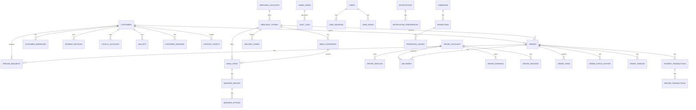

# Software Requirements Specification (SRS)

## Database Schema Overview

**Module:** Supporting Documents
**Version:** 1.0.0
**Last Updated:** 2026-06-30

---

## Purpose

This document provides a comprehensive overview of the database schema for the **[Platform Name]** platform. It includes entity relationship diagrams (ERD), table definitions, field descriptions, data types, constraints, and relationships across all modules.

---

## Database Overview

### Key Characteristics

| Characteristic | Description |
| :--- | :--- |
| **Primary Database** | PostgreSQL 16.x |
| **Cache Layer** | Redis 7.x |
| **Search Engine** | Elasticsearch 8.x |
| **Object Storage** | Amazon S3 / GCP Cloud Storage |
| **Data Warehouse** | Snowflake / BigQuery |
| **Replication** | Multi-AZ with read replicas |
| **Backup** | Continuous backup with PITR |

### Schema Naming Conventions

| Convention | Description |
| :--- | :--- |
| **Table Names** | Plural snake_case (e.g., `customers`, `orders`) |
| **Primary Keys** | `{table_name_singular}_id` (e.g., `customer_id`) |
| **Foreign Keys** | `{referenced_table_singular}_id` (e.g., `merchant_id`) |
| **Timestamps** | `created_at`, `updated_at`, `deleted_at` |
| **Boolean Fields** | `is_` prefix (e.g., `is_active`) |
| **Enum Fields** | UPPER_SNAKE_CASE (e.g., `PENDING`, `COMPLETED`) |

### Data Types Reference

| PostgreSQL Type | Usage | Example |
| :--- | :--- | :--- |
| `UUID` | Primary keys, foreign keys | `550e8400-e29b-41d4-a716-446655440000` |
| `VARCHAR(n)` | Short strings (names, emails) | `John Doe` |
| `TEXT` | Long strings (descriptions, notes) | `Detailed description...` |
| `DECIMAL(p,s)` | Monetary values, precise numbers | `19.99` |
| `INTEGER` | Whole numbers | `42` |
| `BIGINT` | Large whole numbers | `123456789` |
| `BOOLEAN` | True/False values | `true` |
| `DATE` | Date values | `2026-06-30` |
| `TIMESTAMP` | Date and time with timezone | `2026-06-30T14:30:45Z` |
| `TIME` | Time values | `14:30:45` |
| `JSONB` | Structured data | `{"key": "value"}` |
| `TEXT[]` | Array of text | `['tag1', 'tag2']` |
| `INTEGER[]` | Array of integers | `[1, 2, 3]` |

---

## Section 1: Conceptual Entity Relationship Diagram

---

## Section 2: Core Tables

### 2.1 Users & Authentication

#### customers

| Column | Type | Constraints | Description |
| :--- | :--- | :--- | :--- |
| `customer_id` | UUID | PRIMARY KEY | Unique customer identifier |
| `first_name` | VARCHAR(100) | NOT NULL | Legal first name |
| `last_name` | VARCHAR(100) | NOT NULL | Legal last name |
| `display_name` | VARCHAR(100) | | Public display alias |
| `email` | VARCHAR(255) | UNIQUE, NOT NULL | Primary email address |
| `phone` | VARCHAR(20) | UNIQUE, NOT NULL | Primary phone number (E.164) |
| `password_hash` | VARCHAR(255) | | bcrypt/Argon2 password hash |
| `avatar_url` | VARCHAR(500) | | CDN URL for profile picture |
| `date_of_birth` | DATE | | Date of birth (age verification) |
| `language_preference` | VARCHAR(5) | DEFAULT 'en' | ISO 639-1 language code |
| `currency_preference` | VARCHAR(3) | DEFAULT 'USD' | ISO 4217 currency code |
| `theme_preference` | VARCHAR(10) | DEFAULT 'system' | light/dark/system |
| `marketing_consent` | BOOLEAN | DEFAULT FALSE | Opt-in for marketing |
| `push_enabled` | BOOLEAN | DEFAULT TRUE | Push notifications enabled |
| `email_enabled` | BOOLEAN | DEFAULT TRUE | Email notifications enabled |
| `sms_enabled` | BOOLEAN | DEFAULT TRUE | SMS notifications enabled |
| `status` | VARCHAR(20) | DEFAULT 'PENDING_VERIFICATION' | ACTIVE/SUSPENDED/DELETED/PENDING_VERIFICATION |
| `mfa_enabled` | BOOLEAN | DEFAULT FALSE | Multi-factor authentication enabled |
| `last_login_at` | TIMESTAMP | | Last successful login timestamp |
| `created_at` | TIMESTAMP | DEFAULT NOW() | Account creation timestamp |
| `updated_at` | TIMESTAMP | DEFAULT NOW() | Last update timestamp |
| `deleted_at` | TIMESTAMP | | Soft delete timestamp (GDPR) |

**Indexes:**
- `idx_customers_email` ON `email`
- `idx_customers_phone` ON `phone`
- `idx_customers_status` ON `status`
- `idx_customers_created_at` ON `created_at`

---

#### customer_addresses

| Column | Type | Constraints | Description |
| :--- | :--- | :--- | :--- |
| `address_id` | UUID | PRIMARY KEY | Unique address identifier |
| `customer_id` | UUID | FOREIGN KEY (customers.customer_id) | Owner of the address |
| `label` | VARCHAR(50) | NOT NULL | Address label (e.g., "Home", "Work") |
| `address_line_1` | VARCHAR(255) | NOT NULL | Street address / building |
| `address_line_2` | VARCHAR(255) | | Apartment, suite, floor |
| `city` | VARCHAR(100) | NOT NULL | City name |
| `state` | VARCHAR(100) | | State/province |
| `postal_code` | VARCHAR(20) | | ZIP/Postal code |
| `country` | VARCHAR(5) | NOT NULL | ISO 3166-1 alpha-2 country code |
| `latitude` | DECIMAL(10, 8) | NOT NULL | Geocoded latitude |
| `longitude` | DECIMAL(11, 8) | NOT NULL | Geocoded longitude |
| `is_default` | BOOLEAN | DEFAULT FALSE | Primary delivery address |
| `instructions` | TEXT | | Delivery instructions (e.g., gate code) |
| `created_at` | TIMESTAMP | DEFAULT NOW() | Creation timestamp |
| `updated_at` | TIMESTAMP | DEFAULT NOW() | Last update timestamp |

**Indexes:**
- `idx_customer_addresses_customer_id` ON `customer_id`
- `idx_customer_addresses_default` ON `customer_id, is_default` WHERE `is_default = true`
- `idx_customer_addresses_location` ON `latitude, longitude`

---

#### customer_sessions

| Column | Type | Constraints | Description |
| :--- | :--- | :--- | :--- |
| `session_id` | UUID | PRIMARY KEY | Unique session identifier |
| `customer_id` | UUID | FOREIGN KEY (customers.customer_id) | Associated customer |
| `refresh_token` | VARCHAR(255) | UNIQUE | Encrypted refresh token |
| `device_id` | VARCHAR(255) | | Unique device identifier |
| `device_name` | VARCHAR(100) | | e.g., "iPhone 15 Pro" |
| `device_type` | VARCHAR(20) | | ios/android/web |
| `ip_address` | VARCHAR(45) | | IPv4 or IPv6 address |
| `user_agent` | TEXT | | Browser/device user agent |
| `is_active` | BOOLEAN | DEFAULT TRUE | Session active status |
| `expires_at` | TIMESTAMP | NOT NULL | Session expiration timestamp |
| `revoked_at` | TIMESTAMP | | Session revocation timestamp |
| `created_at` | TIMESTAMP | DEFAULT NOW() | Session creation timestamp |

**Indexes:**
- `idx_customer_sessions_customer_id` ON `customer_id`
- `idx_customer_sessions_refresh_token` ON `refresh_token`
- `idx_customer_sessions_expires_at` ON `expires_at`

---

## Section 3: Merchant Tables

### 3.1 Merchant Accounts

#### merchant_accounts

| Column | Type | Constraints | Description |
| :--- | :--- | :--- | :--- |
| `merchant_id` | UUID | PRIMARY KEY | Unique merchant identifier |
| `business_legal_name` | VARCHAR(255) | NOT NULL | Registered legal business name |
| `business_trading_name` | VARCHAR(255) | NOT NULL | Name displayed to customers |
| `business_registration_number` | VARCHAR(100) | UNIQUE, NOT NULL | Company registration number |
| `tax_id` | VARCHAR(50) | UNIQUE | VAT/GST/EIN/TIN number |
| `business_type` | VARCHAR(50) | NOT NULL | SOLE_PROPRIETORSHIP/LLC/CORPORATION/PARTNERSHIP |
| `business_category` | VARCHAR(50) | NOT NULL | RESTAURANT/CAFE/FAST_FOOD/BAKERY/GROCERY/PHARMACY/RETAIL |
| `primary_cuisine` | VARCHAR(50) | | Primary cuisine type |
| `segment` | VARCHAR(50) | DEFAULT 'INDIVIDUAL' | INDIVIDUAL/MULTI_STORE/GROCERY/ENTERPRISE/DARK_STORE |
| `commission_rate` | DECIMAL(5, 2) | DEFAULT 20.00 | Agreed commission percentage |
| `settlement_frequency` | VARCHAR(20) | DEFAULT 'WEEKLY' | DAILY/WEEKLY/BIWEEKLY/MONTHLY |
| `settlement_day_of_week` | INTEGER | DEFAULT 1 | Day of week for settlements (if weekly) |
| `minimum_order_value` | DECIMAL(10, 2) | DEFAULT 0 | Minimum order value for delivery |
| `delivery_radius` | INTEGER | DEFAULT 5000 | Maximum delivery distance in meters |
| `estimated_prep_time` | INTEGER | DEFAULT 15 | Average preparation time in minutes |
| `status` | VARCHAR(20) | DEFAULT 'PENDING' | DRAFT/SUBMITTED/UNDER_REVIEW/ACTION_REQUIRED/APPROVED/ACTIVE/REJECTED/SUSPENDED |
| `application_data` | JSONB | | Full application data snapshot |
| `verified_at` | TIMESTAMP | | Verification completion timestamp |
| `activated_at` | TIMESTAMP | | Account activation timestamp |
| `suspended_at` | TIMESTAMP | | Account suspension timestamp |
| `suspension_reason` | TEXT | | Reason for suspension |
| `created_at` | TIMESTAMP | DEFAULT NOW() | Account creation timestamp |
| `updated_at` | TIMESTAMP | DEFAULT NOW() | Last update timestamp |

**Indexes:**
- `idx_merchant_accounts_registration_number` ON `business_registration_number`
- `idx_merchant_accounts_tax_id` ON `tax_id`
- `idx_merchant_accounts_status` ON `status`

---

#### merchant_stores

| Column | Type | Constraints | Description |
| :--- | :--- | :--- | :--- |
| `store_id` | UUID | PRIMARY KEY | Unique store identifier |
| `merchant_id` | UUID | FOREIGN KEY (merchant_accounts.merchant_id) | Parent merchant account |
| `store_name` | VARCHAR(255) | NOT NULL | Store name displayed to customers |
| `store_description` | TEXT | | Store description |
| `store_category` | VARCHAR(50) | NOT NULL | Primary category |
| `store_subcategory` | VARCHAR(50) | | Subcategory (if applicable) |
| `address_line_1` | VARCHAR(255) | NOT NULL | Street address |
| `address_line_2` | VARCHAR(255) | | Apartment/suite/floor |
| `city` | VARCHAR(100) | NOT NULL | City |
| `state` | VARCHAR(100) | NOT NULL | State/province |
| `postal_code` | VARCHAR(20) | NOT NULL | ZIP/Postal code |
| `country` | VARCHAR(5) | NOT NULL | ISO country code |
| `latitude` | DECIMAL(10, 8) | NOT NULL | Geocoded latitude |
| `longitude` | DECIMAL(11, 8) | NOT NULL | Geocoded longitude |
| `store_phone` | VARCHAR(20) | NOT NULL | Store contact number |
| `store_email` | VARCHAR(255) | NOT NULL | Store contact email |
| `store_website` | VARCHAR(255) | | Store website URL |
| `logo_url` | VARCHAR(500) | | Store logo URL |
| `cover_image_url` | VARCHAR(500) | | Cover/hero image URL |
| `store_images` | TEXT[] | | Gallery image URLs |
| `operating_days` | JSONB | NOT NULL | Days of operation (JSON) |
| `operating_hours` | JSONB | NOT NULL | Opening/closing times (JSON) |
| `is_delivery_enabled` | BOOLEAN | DEFAULT TRUE | Delivery enabled status |
| `is_pickup_enabled` | BOOLEAN | DEFAULT TRUE | Pickup enabled status |
| `is_active` | BOOLEAN | DEFAULT FALSE | Store active status |
| `is_verified` | BOOLEAN | DEFAULT FALSE | Store verification status |
| `created_at` | TIMESTAMP | DEFAULT NOW() | Store creation timestamp |
| `updated_at` | TIMESTAMP | DEFAULT NOW() | Last update timestamp |

**Indexes:**
- `idx_merchant_stores_merchant_id` ON `merchant_id`
- `idx_merchant_stores_location` ON `latitude, longitude`
- `idx_merchant_stores_is_active` ON `is_active`

---

#### merchant_bank_accounts

| Column | Type | Constraints | Description |
| :--- | :--- | :--- | :--- |
| `bank_account_id` | UUID | PRIMARY KEY | Unique bank account identifier |
| `merchant_id` | UUID | FOREIGN KEY (merchant_accounts.merchant_id) | Associated merchant |
| `account_holder_name` | VARCHAR(255) | NOT NULL | Name on the bank account |
| `account_number` | VARCHAR(50) | NOT NULL | Bank account number (encrypted) |
| `iban` | VARCHAR(50) | | IBAN (encrypted) |
| `swift_code` | VARCHAR(20) | | SWIFT/BIC code |
| `bank_name` | VARCHAR(100) | NOT NULL | Bank name |
| `bank_branch` | VARCHAR(100) | | Bank branch/address |
| `bank_country` | VARCHAR(5) | NOT NULL | Bank country |
| `currency` | VARCHAR(3) | NOT NULL | Settlement currency |
| `is_primary` | BOOLEAN | DEFAULT TRUE | Primary settlement account |
| `is_verified` | BOOLEAN | DEFAULT FALSE | Bank account verification status |
| `verification_method` | VARCHAR(20) | | MICRO_DEPOSIT/BANK_API/MANUAL |
| `verified_at` | TIMESTAMP | | Verification timestamp |
| `created_at` | TIMESTAMP | DEFAULT NOW() | Creation timestamp |
| `updated_at` | TIMESTAMP | DEFAULT NOW() | Last update timestamp |

---

## Section 4: Menu & Catalog Tables

### menu_categories

| Column | Type | Constraints | Description |
| :--- | :--- | :--- | :--- |
| `category_id` | UUID | PRIMARY KEY | Unique category identifier |
| `store_id` | UUID | FOREIGN KEY (merchant_stores.store_id) | Associated store |
| `category_name` | VARCHAR(100) | NOT NULL | Display name |
| `category_description` | TEXT | | Category description |
| `category_image` | VARCHAR(500) | | Category image URL |
| `display_order` | INTEGER | DEFAULT 0 | Sorting order within menu |
| `is_available` | BOOLEAN | DEFAULT TRUE | Category availability toggle |
| `display_on_website` | BOOLEAN | DEFAULT TRUE | Show/hide on web/mobile |
| `parent_category_id` | UUID | FOREIGN KEY (menu_categories.category_id) | Parent category (sub-categories) |
| `is_featured` | BOOLEAN | DEFAULT FALSE | Featured category flag |
| `slug` | VARCHAR(255) | UNIQUE | URL-friendly identifier |
| `created_at` | TIMESTAMP | DEFAULT NOW() | Creation timestamp |
| `updated_at` | TIMESTAMP | DEFAULT NOW() | Last update timestamp |

**Indexes:**
- `idx_menu_categories_store_id` ON `store_id`
- `idx_menu_categories_parent_id` ON `parent_category_id`
- `idx_menu_categories_slug` ON `slug`

---

### menu_items

| Column | Type | Constraints | Description |
| :--- | :--- | :--- | :--- |
| `item_id` | UUID | PRIMARY KEY | Unique item identifier |
| `store_id` | UUID | FOREIGN KEY (merchant_stores.store_id) | Associated store |
| `category_id` | UUID | FOREIGN KEY (menu_categories.category_id) | Parent category |
| `item_name` | VARCHAR(255) | NOT NULL | Product display name |
| `item_description` | TEXT | | Detailed description |
| `item_short_description` | VARCHAR(255) | | Brief description |
| `price` | DECIMAL(12, 2) | NOT NULL | Current selling price |
| `compare_at_price` | DECIMAL(12, 2) | | Original price (for discounts) |
| `cost_price` | DECIMAL(12, 2) | | Merchant cost |
| `primary_image` | VARCHAR(500) | | Primary product image URL |
| `gallery_images` | TEXT[] | | Gallery image URLs |
| `sku` | VARCHAR(100) | | Stock keeping unit |
| `barcode` | VARCHAR(50) | | Barcode/UPC |
| `weight` | DECIMAL(10, 2) | | Product weight |
| `preparation_time` | INTEGER | | Prep time override (minutes) |
| `is_available` | BOOLEAN | DEFAULT TRUE | Availability toggle |
| `is_featured` | BOOLEAN | DEFAULT FALSE | Featured item flag |
| `is_best_seller` | BOOLEAN | DEFAULT FALSE | Best seller badge |
| `is_new` | BOOLEAN | DEFAULT FALSE | New item badge |
| `dietary_tags` | TEXT[] | | VEGAN/VEGETARIAN/GLUTEN_FREE/HALAL |
| `allergen_tags` | TEXT[] | | NUTS/DAIRY/EGGS/SOY/SHELLFISH/WHEAT |
| `portion_size` | VARCHAR(50) | | Serving size |
| `calories` | INTEGER | | Calorie count |
| `nutrition_facts` | JSONB | | Structured nutrition information |
| `tags` | TEXT[] | | Custom search tags |
| `slug` | VARCHAR(255) | UNIQUE | URL-friendly identifier |
| `sort_order` | INTEGER | DEFAULT 0 | Display order |
| `min_order_quantity` | INTEGER | DEFAULT 1 | Minimum quantity |
| `max_order_quantity` | INTEGER | | Maximum quantity |
| `allow_zero_price` | BOOLEAN | DEFAULT FALSE | Allow free items |
| `created_at` | TIMESTAMP | DEFAULT NOW() | Creation timestamp |
| `updated_at` | TIMESTAMP | DEFAULT NOW() | Last update timestamp |
| `last_ordered_at` | TIMESTAMP | | Last order timestamp |

**Indexes:**
- `idx_menu_items_store_id` ON `store_id`
- `idx_menu_items_category_id` ON `category_id`
- `idx_menu_items_sku` ON `sku`
- `idx_menu_items_slug` ON `slug`
- `idx_menu_items_is_available` ON `is_available`

---

## Section 5: Driver Tables

### driver_accounts

| Column | Type | Constraints | Description |
| :--- | :--- | :--- | :--- |
| `driver_id` | UUID | PRIMARY KEY | Unique driver identifier |
| `first_name` | VARCHAR(100) | NOT NULL | Legal first name |
| `last_name` | VARCHAR(100) | NOT NULL | Legal last name |
| `date_of_birth` | DATE | NOT NULL | Date of birth |
| `nationality` | VARCHAR(50) | NOT NULL | Country of nationality |
| `email` | VARCHAR(255) | UNIQUE, NOT NULL | Primary email |
| `phone` | VARCHAR(20) | UNIQUE, NOT NULL | Primary phone (E.164) |
| `alternate_phone` | VARCHAR(20) | | Alternate phone |
| `address_line_1` | VARCHAR(255) | NOT NULL | Residential address |
| `address_line_2` | VARCHAR(255) | | Apartment/suite/floor |
| `city` | VARCHAR(100) | NOT NULL | City |
| `state` | VARCHAR(100) | NOT NULL | State/province |
| `postal_code` | VARCHAR(20) | NOT NULL | ZIP/Postal code |
| `country` | VARCHAR(5) | NOT NULL | Country |
| `languages_spoken` | TEXT[] | | Languages spoken |
| `driver_type` | VARCHAR(30) | NOT NULL | INDIVIDUAL/FLEET/ENTERPRISE |
| `availability` | JSONB | | Preferred working hours/days |
| `status` | VARCHAR(20) | DEFAULT 'PENDING' | DRAFT/SUBMITTED/UNDER_REVIEW/VERIFIED/ONBOARDING/ACTIVE/REJECTED/SUSPENDED |
| `rating` | DECIMAL(3, 2) | DEFAULT 0 | Average driver rating |
| `total_deliveries` | INTEGER | DEFAULT 0 | Total deliveries completed |
| `active_since` | TIMESTAMP | | Account activation timestamp |
| `last_active_at` | TIMESTAMP | | Last activity timestamp |
| `created_at` | TIMESTAMP | DEFAULT NOW() | Account creation timestamp |
| `updated_at` | TIMESTAMP | DEFAULT NOW() | Last update timestamp |

**Indexes:**
- `idx_driver_accounts_email` ON `email`
- `idx_driver_accounts_phone` ON `phone`
- `idx_driver_accounts_status` ON `status`

---

### driver_vehicles

| Column | Type | Constraints | Description |
| :--- | :--- | :--- | :--- |
| `vehicle_id` | UUID | PRIMARY KEY | Unique vehicle identifier |
| `driver_id` | UUID | FOREIGN KEY (driver_accounts.driver_id) | Associated driver |
| `vehicle_type` | VARCHAR(20) | NOT NULL | CAR/MOTORCYCLE/SCOOTER/BICYCLE/VAN/TRUCK |
| `vehicle_make` | VARCHAR(50) | NOT NULL | Vehicle manufacturer |
| `vehicle_model` | VARCHAR(50) | NOT NULL | Vehicle model |
| `vehicle_year` | INTEGER | NOT NULL | Manufacturing year |
| `vehicle_color` | VARCHAR(30) | NOT NULL | Vehicle color |
| `license_plate` | VARCHAR(50) | UNIQUE, NOT NULL | License plate number |
| `registration_number` | VARCHAR(100) | NOT NULL | Registration document number |
| `registration_expiry` | DATE | NOT NULL | Registration expiry date |
| `insurance_provider` | VARCHAR(100) | NOT NULL | Insurance company |
| `insurance_policy_number` | VARCHAR(100) | NOT NULL | Insurance policy number |
| `insurance_expiry` | DATE | NOT NULL | Insurance expiry date |
| `vehicle_capacity` | INTEGER | | Vehicle capacity (kg/liters) |
| `has_insulated_bag` | BOOLEAN | DEFAULT FALSE | Has thermal delivery bag |
| `has_helmet` | BOOLEAN | DEFAULT FALSE | Has safety helmet |
| `vehicle_photos` | TEXT[] | | Vehicle photo URLs |
| `is_active` | BOOLEAN | DEFAULT TRUE | Active status |
| `verified_at` | TIMESTAMP | | Verification timestamp |
| `created_at` | TIMESTAMP | DEFAULT NOW() | Creation timestamp |
| `updated_at` | TIMESTAMP | DEFAULT NOW() | Last update timestamp |

**Indexes:**
- `idx_driver_vehicles_driver_id` ON `driver_id`
- `idx_driver_vehicles_license_plate` ON `license_plate`

---

## Section 6: Order Tables

### orders

| Column | Type | Constraints | Description |
| :--- | :--- | :--- | :--- |
| `order_id` | UUID | PRIMARY KEY | Unique order identifier |
| `customer_id` | UUID | FOREIGN KEY (customers.customer_id) | Customer who placed the order |
| `merchant_id` | UUID | FOREIGN KEY (merchant_accounts.merchant_id) | Merchant fulfilling the order |
| `store_id` | UUID | FOREIGN KEY (merchant_stores.store_id) | Specific store location |
| `driver_id` | UUID | FOREIGN KEY (driver_accounts.driver_id) | Assigned driver |
| `order_reference` | VARCHAR(50) | UNIQUE, NOT NULL | Human-readable order number |
| `status` | VARCHAR(20) | NOT NULL | Current order status |
| `order_data` | JSONB | NOT NULL | Full order snapshot |
| `subtotal` | DECIMAL(12, 2) | NOT NULL | Sum of item prices |
| `delivery_fee` | DECIMAL(12, 2) | DEFAULT 0 | Delivery charge |
| `service_fee` | DECIMAL(12, 2) | DEFAULT 0 | Platform service fee |
| `tax` | DECIMAL(12, 2) | DEFAULT 0 | Tax amount |
| `discount` | DECIMAL(12, 2) | DEFAULT 0 | Discount amount |
| `total` | DECIMAL(12, 2) | NOT NULL | Order total |
| `currency` | VARCHAR(3) | NOT NULL | ISO 4217 currency |
| `payment_method` | VARCHAR(50) | NOT NULL | Payment method used |
| `payment_status` | VARCHAR(20) | DEFAULT 'PENDING' | PENDING/AUTHORIZED/CAPTURED/REFUNDED/FAILED |
| `delivery_address` | JSONB | NOT NULL | Delivery address snapshot |
| `customer_notes` | TEXT` | | Customer instructions |
| `internal_notes` | TEXT` | | Internal merchant/ops notes |
| `preparation_time_estimate` | INTEGER` | | Estimated prep time (minutes) |
| `preparation_time_actual` | INTEGER` | | Actual prep time (minutes) |
| `delivery_time_estimate` | INTEGER` | | Estimated delivery time (minutes) |
| `delivery_time_actual` | INTEGER` | | Actual delivery time (minutes) |
| `is_scheduled` | BOOLEAN | DEFAULT FALSE | Scheduled order flag |
| `scheduled_time` | TIMESTAMP | | Requested delivery time |
| `idempotency_key` | VARCHAR(255) | UNIQUE | Deduplication key |
| `cancellation_reason` | VARCHAR(100) | | Reason for cancellation |
| `cancelled_by` | VARCHAR(20) | | CUSTOMER/MERCHANT/PLATFORM |
| `cancelled_at` | TIMESTAMP | | Cancellation timestamp |
| `confirmed_at` | TIMESTAMP | | Confirmation timestamp |
| `preparing_at` | TIMESTAMP | | Preparation start timestamp |
| `ready_at` | TIMESTAMP | | Ready timestamp |
| `assigned_at` | TIMESTAMP | | Driver assignment timestamp |
| `picked_up_at` | TIMESTAMP` | | Pickup timestamp |
| `delivered_at` | TIMESTAMP` | | Delivery timestamp |
| `is_archived` | BOOLEAN | DEFAULT FALSE | Archival flag |
| `archived_at` | TIMESTAMP | | Archival timestamp |
| `created_at` | TIMESTAMP | DEFAULT NOW() | Order creation timestamp |
| `updated_at` | TIMESTAMP | DEFAULT NOW() | Last update timestamp |

**Indexes:**
- `idx_orders_customer_id` ON `customer_id`
- `idx_orders_merchant_id` ON `merchant_id`
- `idx_orders_store_id` ON `store_id`
- `idx_orders_driver_id` ON `driver_id`
- `idx_orders_status` ON `status`
- `idx_orders_order_reference` ON `order_reference`
- `idx_orders_created_at` ON `created_at`
- `idx_orders_scheduled_time` ON `scheduled_time`

---

### order_items

| Column | Type | Constraints | Description |
| :--- | :--- | :--- | :--- |
| `order_item_id` | UUID | PRIMARY KEY | Unique identifier |
| `order_id` | UUID | FOREIGN KEY (orders.order_id) | Associated order |
| `item_id` | UUID | FOREIGN KEY (menu_items.item_id) | Menu item (snapshot reference) |
| `item_name` | VARCHAR(255) | NOT NULL | Item name (snapshot) |
| `item_price` | DECIMAL(12, 2) | NOT NULL | Item price at order time |
| `quantity` | INTEGER | NOT NULL | Quantity ordered |
| `subtotal` | DECIMAL(12, 2) | NOT NULL | Item subtotal (price * quantity) |
| `modifiers` | JSONB | | Modifiers snapshot |
| `special_instructions` | TEXT` | | Item-specific instructions |
| `status` | VARCHAR(20) | DEFAULT 'PENDING' | PENDING/PREPARING/READY/CANCELLED |
| `created_at` | TIMESTAMP | DEFAULT NOW() | Creation timestamp |
| `updated_at` | TIMESTAMP | DEFAULT NOW() | Last update timestamp |

**Indexes:**
- `idx_order_items_order_id` ON `order_id`
- `idx_order_items_item_id` ON `item_id`

---

### order_status_history

| Column | Type | Constraints | Description |
| :--- | :--- | :--- | :--- |
| `history_id` | UUID | PRIMARY KEY | Unique identifier |
| `order_id` | UUID | FOREIGN KEY (orders.order_id) | Associated order |
| `status` | VARCHAR(20) | NOT NULL | Status at this point |
| `source` | VARCHAR(20) | NOT NULL | CUSTOMER/MERCHANT/DRIVER/SYSTEM/ADMIN |
| `source_id` | UUID` | | User/driver ID who triggered |
| `reason` | TEXT` | | Reason for status change |
| `metadata` | JSONB` | | Additional context |
| `created_at` | TIMESTAMP | DEFAULT NOW() | Status timestamp |

**Indexes:**
- `idx_order_status_history_order_id` ON `order_id`
- `idx_order_status_history_created_at` ON `created_at`

---

## Section 7: Payment Tables

### payment_transactions

| Column | Type | Constraints | Description |
| :--- | :--- | :--- | :--- |
| `transaction_id` | UUID | PRIMARY KEY | Unique transaction identifier |
| `order_id` | UUID | FOREIGN KEY (orders.order_id) | Associated order |
| `customer_id` | UUID | FOREIGN KEY (customers.customer_id) | Associated customer |
| `gateway_name` | VARCHAR(50) | NOT NULL | stripe/paymob/adyen |
| `gateway_transaction_id` | VARCHAR(255) | | Gateway transaction ID |
| `transaction_type` | VARCHAR(20) | NOT NULL | AUTHORIZATION/CAPTURE/REFUND/VOID |
| `amount` | DECIMAL(12, 2) | NOT NULL | Transaction amount |
| `currency` | VARCHAR(3) | NOT NULL | ISO 4217 currency |
| `status` | VARCHAR(20) | NOT NULL | PENDING/AUTHORIZED/CAPTURED/FAILED/REFUNDED/VOIDED |
| `payment_method` | VARCHAR(50) | | Payment method used |
| `payment_method_details` | JSONB | | Payment method details |
| `idempotency_key` | VARCHAR(255) | UNIQUE | Idempotency key |
| `error_code` | VARCHAR(50) | | Error code |
| `error_message` | TEXT` | | Error message |
| `created_at` | TIMESTAMP | DEFAULT NOW() | Creation timestamp |
| `updated_at` | TIMESTAMP | DEFAULT NOW() | Last update timestamp |

**Indexes:**
- `idx_payment_transactions_order_id` ON `order_id`
- `idx_payment_transactions_gateway_transaction_id` ON `gateway_transaction_id`
- `idx_payment_transactions_idempotency_key` ON `idempotency_key`

---

### payment_methods

| Column | Type | Constraints | Description |
| :--- | :--- | :--- | :--- |
| `payment_method_id` | UUID | PRIMARY KEY | Unique payment method identifier |
| `customer_id` | UUID | FOREIGN KEY (customers.customer_id) | Owner of the payment method |
| `method_type` | VARCHAR(30) | NOT NULL | CARD/WALLET/MOBILE_WALLET/COD/BNPL/LOCAL |
| `provider` | VARCHAR(50) | | stripe/paymob/adyen/apple_pay/google_pay/tabby/tamara |
| `provider_token` | VARCHAR(255) | | Token from payment provider |
| `last_four` | VARCHAR(4) | | Last 4 digits (for cards) |
| `card_brand` | VARCHAR(20) | | visa/mastercard/amex/mada |
| `expiry_month` | INTEGER | | Expiry month (MM) |
| `expiry_year` | INTEGER | | Expiry year (YYYY) |
| `cardholder_name` | VARCHAR(100) | | Name on card |
| `billing_address` | JSONB | | Billing address |
| `is_default` | BOOLEAN | DEFAULT FALSE | Default payment method |
| `is_active` | BOOLEAN | DEFAULT TRUE | Active status |
| `last_used_at` | TIMESTAMP | | Last use timestamp |
| `created_at` | TIMESTAMP | DEFAULT NOW() | Creation timestamp |
| `updated_at` | TIMESTAMP | DEFAULT NOW() | Last update timestamp |

**Indexes:**
- `idx_payment_methods_customer_id` ON `customer_id`
- `idx_payment_methods_provider_token` ON `provider_token`

---

## Section 8: Delivery Tables

### deliveries

| Column | Type | Constraints | Description |
| :--- | :--- | :--- | :--- |
| `delivery_id` | UUID | PRIMARY KEY | Unique delivery identifier |
| `order_id` | UUID | UNIQUE, FOREIGN KEY (orders.order_id) | Associated order (one delivery per order) |
| `driver_id` | UUID | FOREIGN KEY (driver_accounts.driver_id) | Assigned driver |
| `status` | VARCHAR(20) | NOT NULL | ASSIGNED/PICKED_UP/IN_TRANSIT/ARRIVING/COMPLETED/FAILED |
| `assigned_at` | TIMESTAMP | | Driver assignment timestamp |
| `picked_up_at` | TIMESTAMP | | Driver pickup timestamp |
| `in_transit_at` | TIMESTAMP | | Start of transit timestamp |
| `arriving_soon_at` | TIMESTAMP | | Within 2-minute ETA timestamp |
| `delivered_at` | TIMESTAMP | | Delivery completion timestamp |
| `failed_at` | TIMESTAMP | | Delivery failure timestamp |
| `failure_reason` | VARCHAR(50) | | Reason for delivery failure |
| `qr_code` | VARCHAR(100) | | QR code for delivery verification |
| `otp_code` | VARCHAR(10) | | OTP for delivery verification (encrypted) |
| `verification_method` | VARCHAR(20) | | QR/OTP/PHOTO/GPS/SIGNATURE |
| `verification_status` | VARCHAR(20) | DEFAULT 'PENDING' | PENDING/VERIFIED/FAILED |
| `customer_contacted` | BOOLEAN | DEFAULT FALSE | Whether driver contacted customer |
| `instructions_used` | TEXT` | | Delivery instructions applied |
| `route_data` | JSONB | | Encoded route polyline |
| `total_distance` | DECIMAL(10, 2) | | Total distance driven (km) |
| `total_time` | INTEGER` | | Total time from pickup to delivery (seconds) |
| `created_at` | TIMESTAMP | DEFAULT NOW() | Delivery record creation timestamp |
| `updated_at` | TIMESTAMP | DEFAULT NOW() | Last update timestamp |

**Indexes:**
- `idx_deliveries_order_id` ON `order_id`
- `idx_deliveries_driver_id` ON `driver_id`
- `idx_deliveries_status` ON `status`

---

### delivery_location_history

| Column | Type | Constraints | Description |
| :--- | :--- | :--- | :--- |
| `history_id` | UUID | PRIMARY KEY | Unique location history entry |
| `delivery_id` | UUID | FOREIGN KEY (deliveries.delivery_id) | Associated delivery |
| `latitude` | DECIMAL(10, 8) | NOT NULL | GPS latitude |
| `longitude` | DECIMAL(11, 8) | NOT NULL | GPS longitude |
| `accuracy` | DECIMAL(5, 2) | | GPS accuracy (meters) |
| `speed` | DECIMAL(5, 2) | | Speed (km/h) |
| `heading` | DECIMAL(5, 2) | | Heading direction (degrees) |
| `recorded_at` | TIMESTAMP | DEFAULT NOW() | When location was recorded |
| `created_at` | TIMESTAMP | DEFAULT NOW() | Record creation timestamp |

**Indexes:**
- `idx_delivery_location_history_delivery_id` ON `delivery_id`
- `idx_delivery_location_history_recorded_at` ON `recorded_at`

---

## Section 9: Financial Tables

### merchant_settlements

| Column | Type | Constraints | Description |
| :--- | :--- | :--- | :--- |
| `settlement_id` | UUID | PRIMARY KEY | Unique settlement identifier |
| `merchant_id` | UUID | FOREIGN KEY (merchant_accounts.merchant_id) | Associated merchant |
| `store_id` | UUID | FOREIGN KEY (merchant_stores.store_id) | Associated store |
| `period_start` | DATE | NOT NULL | Settlement period start |
| `period_end` | DATE | NOT NULL | Settlement period end |
| `order_count` | INTEGER | NOT NULL | Number of orders |
| `gross_revenue` | DECIMAL(12, 2) | NOT NULL | Total order value |
| `total_commission` | DECIMAL(12, 2) | NOT NULL | Commission deducted |
| `total_service_fee` | DECIMAL(12, 2) | DEFAULT 0 | Service fees deducted |
| `total_delivery_fee_retained` | DECIMAL(12, 2) | DEFAULT 0 | Delivery fees retained |
| `total_payment_fee` | DECIMAL(12, 2) | DEFAULT 0 | Payment processing fees |
| `total_promotions` | DECIMAL(12, 2) | DEFAULT 0 | Promotions/discounts |
| `total_adjustments` | DECIMAL(12, 2) | DEFAULT 0 | Manual adjustments |
| `total_tax` | DECIMAL(12, 2) | DEFAULT 0 | Tax collected |
| `net_amount` | DECIMAL(12, 2) | NOT NULL | Net settlement amount |
| `currency` | VARCHAR(3) | NOT NULL | ISO 4217 currency |
| `status` | VARCHAR(20) | DEFAULT 'PENDING' | PENDING/PROCESSING/COMPLETED/FAILED |
| `settlement_date` | DATE | | Date processed |
| `payout_id` | UUID | | Reference to payout |
| `created_at` | TIMESTAMP | DEFAULT NOW() | Creation timestamp |
| `updated_at` | TIMESTAMP | DEFAULT NOW() | Last update timestamp |

**Indexes:**
- `idx_merchant_settlements_merchant_id` ON `merchant_id`
- `idx_merchant_settlements_period` ON `period_start, period_end`
- `idx_merchant_settlements_status` ON `status`

---

### driver_earnings

| Column | Type | Constraints | Description |
| :--- | :--- | :--- | :--- |
| `earning_id` | UUID | PRIMARY KEY | Unique identifier |
| `driver_id` | UUID | FOREIGN KEY (driver_accounts.driver_id) | Associated driver |
| `order_id` | UUID | FOREIGN KEY (orders.order_id) | Associated order |
| `delivery_id` | UUID | FOREIGN KEY (deliveries.delivery_id) | Associated delivery |
| `base_fee` | DECIMAL(10, 2) | DEFAULT 0 | Base delivery fee |
| `distance_fee` | DECIMAL(10, 2) | DEFAULT 0 | Distance-based fee |
| `distance_km` | DECIMAL(10, 2) | | Distance in kilometers |
| `time_fee` | DECIMAL(10, 2) | DEFAULT 0 | Time-based fee |
| `time_minutes` | INTEGER | | Time in minutes |
| `peak_bonus` | DECIMAL(10, 2) | DEFAULT 0 | Peak hour bonus |
| `tip_amount` | DECIMAL(10, 2) | DEFAULT 0 | Customer tip |
| `incentive_bonus` | DECIMAL(10, 2) | DEFAULT 0 | Performance bonus |
| `wait_time_compensation` | DECIMAL(10, 2) | DEFAULT 0 | Wait time compensation |
| `cancellation_fee` | DECIMAL(10, 2) | DEFAULT 0 | Cancellation fee |
| `adjustment_amount` | DECIMAL(10, 2) | DEFAULT 0 | Manual adjustments |
| `total_earnings` | DECIMAL(10, 2) | NOT NULL | Total earnings for delivery |
| `currency` | VARCHAR(3) | NOT NULL | ISO 4217 currency code |
| `status` | VARCHAR(20) | DEFAULT 'PENDING' | PENDING/PROCESSED/PAID/ADJUSTED |
| `created_at` | TIMESTAMP | DEFAULT NOW() | Creation timestamp |
| `updated_at` | TIMESTAMP | DEFAULT NOW() | Last update timestamp |

**Indexes:**
- `idx_driver_earnings_driver_id` ON `driver_id`
- `idx_driver_earnings_order_id` ON `order_id`
- `idx_driver_earnings_delivery_id` ON `delivery_id`

---

## Section 10: Security & Audit Tables

### users

| Column | Type | Constraints | Description |
| :--- | :--- | :--- | :--- |
| `user_id` | UUID | PRIMARY KEY | Unique user identifier |
| `user_type` | VARCHAR(20) | NOT NULL | CUSTOMER/MERCHANT/DRIVER/ADMIN/PARTNER |
| `email` | VARCHAR(255) | UNIQUE | Email address |
| `phone` | VARCHAR(20) | | Phone number (E.164) |
| `password_hash` | VARCHAR(255) | | bcrypt/Argon2 hash |
| `first_name` | VARCHAR(100) | | First name |
| `last_name` | VARCHAR(100) | | Last name |
| `display_name` | VARCHAR(100) | | Display name |
| `avatar_url` | VARCHAR(500) | | Profile image URL |
| `language` | VARCHAR(5) | DEFAULT 'en' | Preferred language |
| `timezone` | VARCHAR(50) | | Timezone |
| `is_active` | BOOLEAN | DEFAULT TRUE | Active status |
| `email_verified` | BOOLEAN | DEFAULT FALSE | Email verification |
| `phone_verified` | BOOLEAN | DEFAULT FALSE | Phone verification |
| `mfa_enabled` | BOOLEAN | DEFAULT FALSE | MFA enabled |
| `last_login` | TIMESTAMP | | Last login timestamp |
| `created_at` | TIMESTAMP | DEFAULT NOW() | Creation timestamp |
| `updated_at` | TIMESTAMP | DEFAULT NOW() | Last update timestamp |

**Indexes:**
- `idx_users_email` ON `email`
- `idx_users_phone` ON `phone`
- `idx_users_user_type` ON `user_type`

---

### mfa_settings

| Column | Type | Constraints | Description |
| :--- | :--- | :--- | :--- |
| `mfa_id` | UUID | PRIMARY KEY | Unique identifier |
| `user_id` | UUID | FOREIGN KEY (users.user_id) | Associated user |
| `user_type` | VARCHAR(20) | NOT NULL | CUSTOMER/MERCHANT/DRIVER/ADMIN |
| `method` | VARCHAR(20) | NOT NULL | TOTP/SMS/EMAIL |
| `secret` | VARCHAR(255) | | Encrypted TOTP secret |
| `phone_number` | VARCHAR(20) | | For SMS MFA |
| `email` | VARCHAR(255) | | For email MFA |
| `is_primary` | BOOLEAN | DEFAULT FALSE | Primary MFA method |
| `is_active` | BOOLEAN | DEFAULT TRUE | Active status |
| `backup_codes` | TEXT | | Encrypted JSON array |
| `created_at` | TIMESTAMP | DEFAULT NOW() | Creation timestamp |
| `updated_at` | TIMESTAMP | DEFAULT NOW() | Last update timestamp |

**Indexes:**
- `idx_mfa_settings_user_id` ON `user_id`

---

### audit_logs

| Column | Type | Constraints | Description |
| :--- | :--- | :--- | :--- |
| `audit_id` | UUID | PRIMARY KEY | Unique identifier |
| `user_id` | UUID | FOREIGN KEY (users.user_id) | Associated user |
| `action_type` | VARCHAR(50) | NOT NULL | Action type |
| `action_description` | TEXT | NOT NULL | Description of action |
| `ip_address` | VARCHAR(45) | | IP address |
| `user_agent` | TEXT | | Browser/user agent |
| `metadata` | JSONB | | Additional context |
| `created_at` | TIMESTAMP | DEFAULT NOW() | Action timestamp |

**Indexes:**
- `idx_audit_logs_user_id` ON `user_id`
- `idx_audit_logs_action_type` ON `action_type`
- `idx_audit_logs_created_at` ON `created_at`

---

## Section 11: Notification Tables

### notification_templates

| Column | Type | Constraints | Description |
| :--- | :--- | :--- | :--- |
| `template_id` | UUID | PRIMARY KEY | Unique identifier |
| `template_name` | VARCHAR(100) | NOT NULL | Template name |
| `template_type` | VARCHAR(30) | NOT NULL | PUSH/EMAIL/SMS/IN_APP/WEBHOOK |
| `event_type` | VARCHAR(50) | NOT NULL | Associated event |
| `subject` | VARCHAR(255) | | Subject line |
| `body` | TEXT | NOT NULL | Template body |
| `body_html` | TEXT | | HTML body |
| `language` | VARCHAR(5) | DEFAULT 'en' | ISO 639-1 language |
| `variables` | JSONB | | Required variables |
| `version` | INTEGER | DEFAULT 1 | Template version |
| `status` | VARCHAR(20) | DEFAULT 'DRAFT' | DRAFT/ACTIVE/ARCHIVED |
| `created_by` | UUID | | Creator identifier |
| `created_at` | TIMESTAMP | DEFAULT NOW() | Creation timestamp |
| `updated_at` | TIMESTAMP | DEFAULT NOW() | Last update timestamp |

**Indexes:**
- `idx_notification_templates_event_type` ON `event_type`
- `idx_notification_templates_type` ON `template_type`

---

### notifications

| Column | Type | Constraints | Description |
| :--- | :--- | :--- | :--- |
| `notification_id` | UUID | PRIMARY KEY | Unique notification identifier |
| `user_id` | UUID | FOREIGN KEY (users.user_id) | Recipient user |
| `user_type` | VARCHAR(20) | NOT NULL | CUSTOMER/MERCHANT/DRIVER/ADMIN |
| `event_type` | VARCHAR(50) | NOT NULL | Event triggering notification |
| `channel` | VARCHAR(20) | NOT NULL | PUSH/EMAIL/SMS/IN_APP/WEBHOOK |
| `template_id` | UUID | | Template used |
| `subject` | VARCHAR(255) | | Notification subject |
| `body` | TEXT | NOT NULL | Notification body |
| `data` | JSONB | | Additional data |
| `status` | VARCHAR(20) | DEFAULT 'QUEUED' | QUEUED/SENT/DELIVERED/OPENED/CLICKED/FAILED/BOUNCED/UNSUBSCRIBED |
| `provider_reference` | VARCHAR(255) | | Provider reference ID |
| `retry_count` | INTEGER | DEFAULT 0 | Number of retries |
| `sent_at` | TIMESTAMP` | | Sent timestamp |
| `delivered_at` | TIMESTAMP` | | Delivered timestamp |
| `opened_at` | TIMESTAMP` | | Opened timestamp |
| `clicked_at` | TIMESTAMP` | | Clicked timestamp |
| `failed_at` | TIMESTAMP` | | Failed timestamp |
| `error_message` | TEXT` | | Error message |
| `metadata` | JSONB` | | Additional context |
| `created_at` | TIMESTAMP | DEFAULT NOW() | Creation timestamp |
| `updated_at` | TIMESTAMP | DEFAULT NOW() | Last update timestamp |

**Indexes:**
- `idx_notifications_user_id` ON `user_id`
- `idx_notifications_event_type` ON `event_type`
- `idx_notifications_channel` ON `channel`
- `idx_notifications_status` ON `status`

---

## Section 12: Analytics Tables

### quality_metrics

| Column | Type | Constraints | Description |
| :--- | :--- | :--- | :--- |
| `metric_id` | UUID | PRIMARY KEY | Unique identifier |
| `service_name` | VARCHAR(100) | NOT NULL | Service name |
| `date` | DATE | NOT NULL | Date |
| `unit_test_coverage` | DECIMAL(5, 2) | | Unit test coverage % |
| `integration_test_coverage` | DECIMAL(5, 2) | | Integration test coverage % |
| `test_pass_rate` | DECIMAL(5, 2) | | Test pass rate % |
| `defect_density` | DECIMAL(5, 2) | | Defect density |
| `mean_time_to_detect_hours` | DECIMAL(5, 2) | | Mean time to detect (hours) |
| `mean_time_to_fix_hours` | DECIMAL(5, 2) | | Mean time to fix (hours) |
| `code_churn_percentage` | DECIMAL(5, 2) | | Code churn % |
| `technical_debt_ratio` | DECIMAL(5, 2) | | Technical debt ratio % |
| `created_at` | TIMESTAMP | DEFAULT NOW() | Creation timestamp |
| `updated_at` | TIMESTAMP | DEFAULT NOW() | Last update timestamp |

**Indexes:**
- `idx_quality_metrics_service_name` ON `service_name`
- `idx_quality_metrics_date` ON `date`

---

### performance_metrics

| Column | Type | Constraints | Description |
| :--- | :--- | :--- | :--- |
| `metric_id` | UUID | PRIMARY KEY | Unique identifier |
| `service_name` | VARCHAR(100) | NOT NULL | Service name |
| `metric_name` | VARCHAR(100) | NOT NULL | Metric name |
| `metric_value` | DECIMAL(10, 2) | NOT NULL | Metric value |
| `unit` | VARCHAR(20) | | Unit |
| `labels` | JSONB | | Labels |
| `timestamp` | TIMESTAMP | NOT NULL | Timestamp |
| `created_at` | TIMESTAMP | DEFAULT NOW() | Creation timestamp |

**Indexes:**
- `idx_performance_metrics_service_name` ON `service_name`
- `idx_performance_metrics_timestamp` ON `timestamp`

---

## Section 13: Table Count Summary

| Module | Tables | Total Columns | Indexes |
| :--- | :--- | :--- | :--- |
| **Customer** | 5 | 62 | 12 |
| **Merchant** | 9 | 120 | 18 |
| **Driver** | 6 | 85 | 10 |
| **Order** | 5 | 85 | 18 |
| **Payment** | 5 | 55 | 8 |
| **Delivery** | 2 | 35 | 6 |
| **Financial** | 7 | 80 | 12 |
| **Security/Audit** | 6 | 50 | 10 |
| **Notifications** | 4 | 50 | 10 |
| **Analytics** | 4 | 35 | 6 |
| **Other** | 10 | 80 | 15 |
| **Total** | **63** | **737** | **125** |

---

## Version History

| Version | Date | Author | Changes |
| :--- | :--- | :--- | :--- |
| 1.0.0 | 2026-06-30 | [Author] | Initial database schema documentation |

---

**Next Document:**

`Traceability_Matrix_Master.csv`

*(This continues with the traceability matrix for requirements tracking.)*