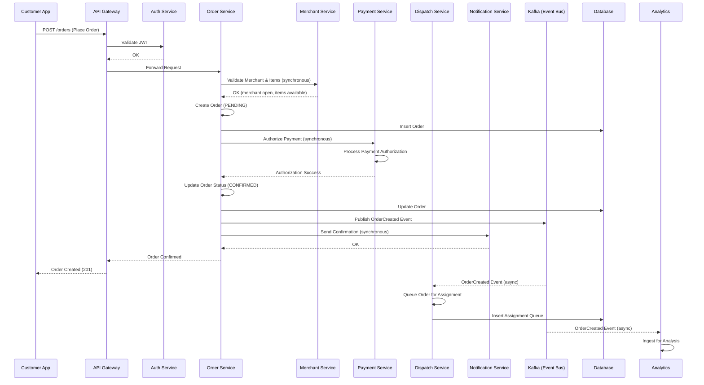
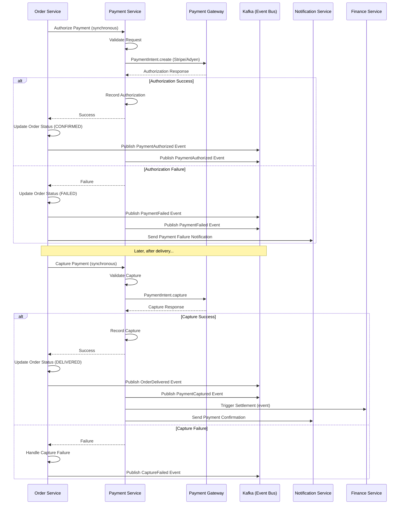
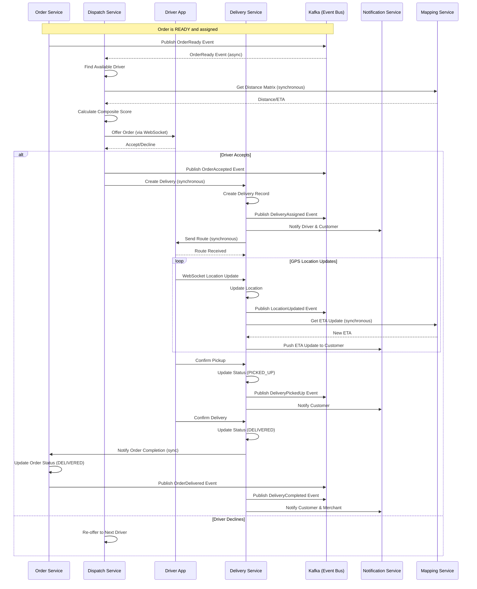
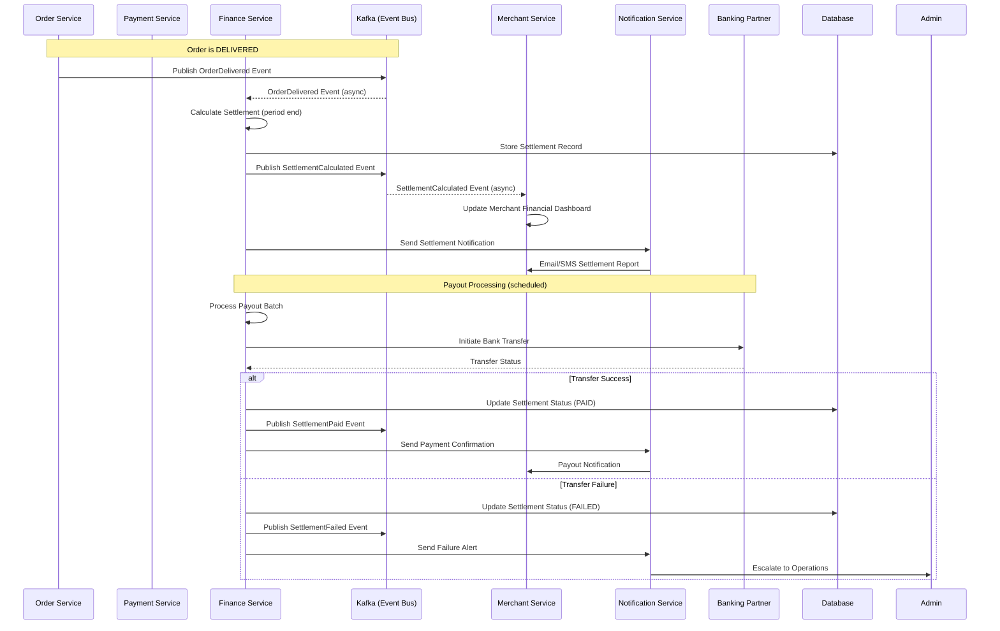
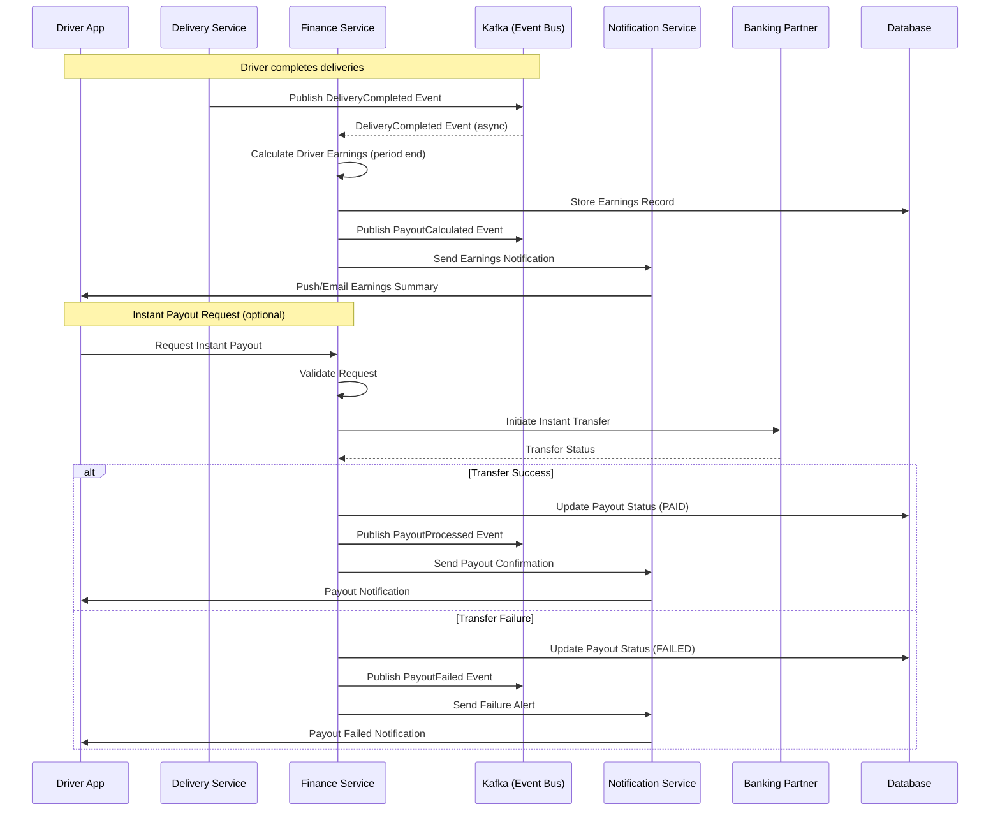
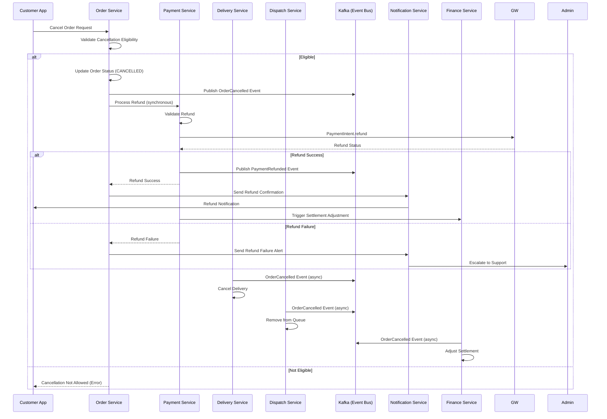
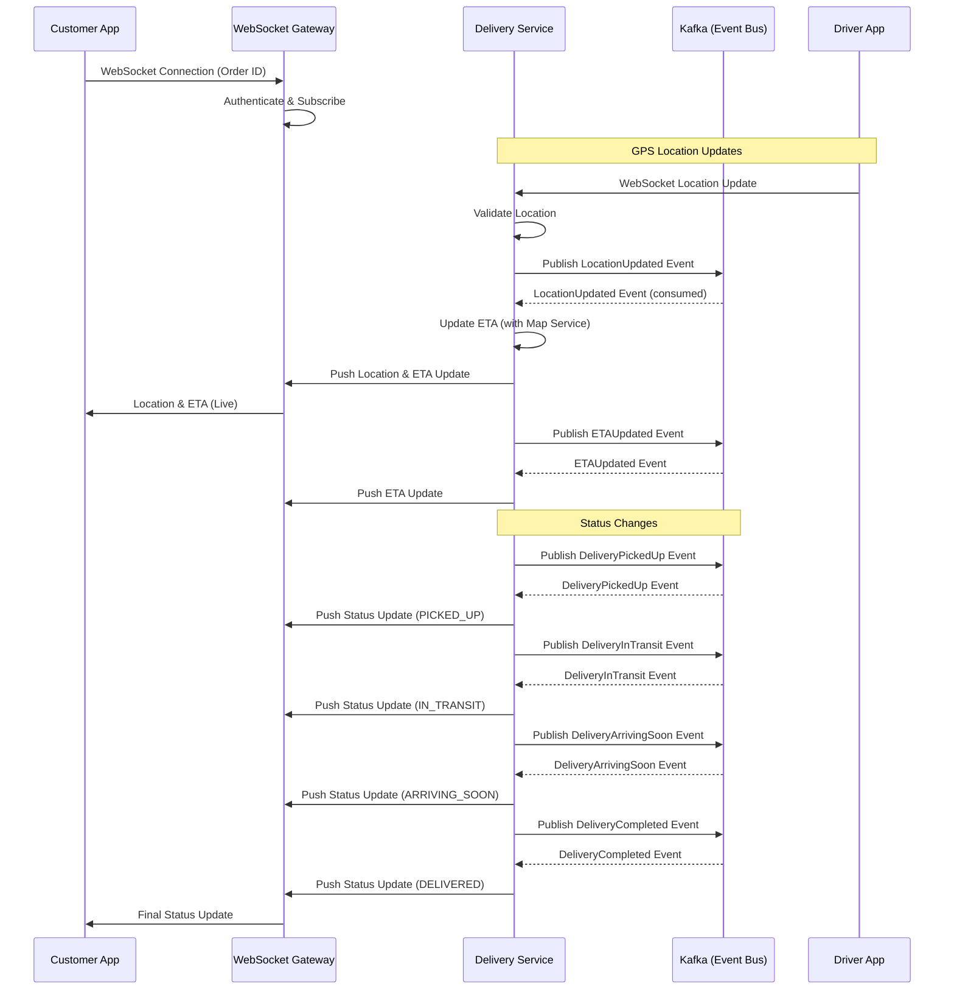
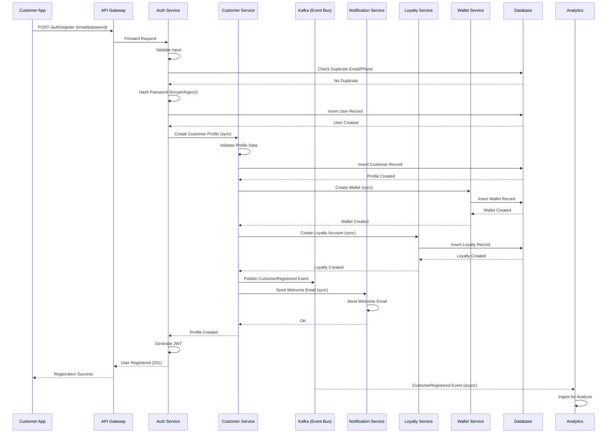
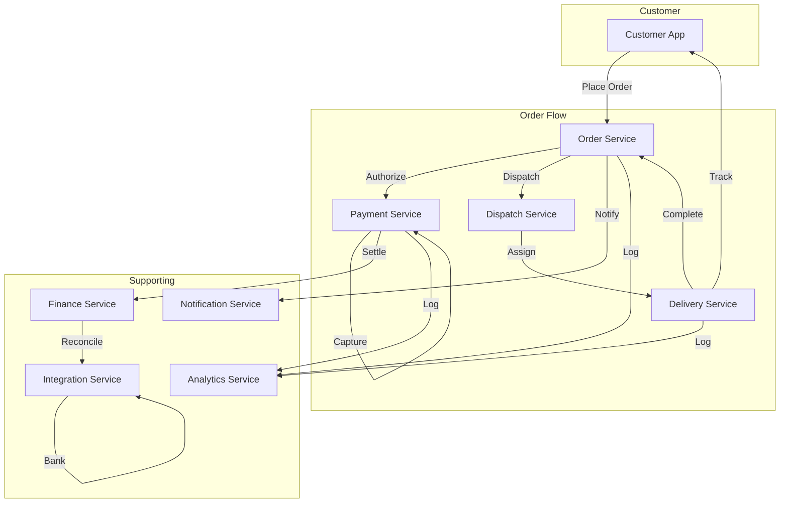
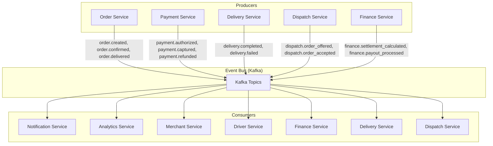

# Software Architecture Document (SAD)

## Data Flow & Sequence Diagrams

**Version:** 1.0.0
**Last Updated:** 2026-06-30

---

## Purpose

This document provides a comprehensive view of the data flows and interaction sequences between services for the **[Platform Name]** platform. It illustrates how data moves through the system, how services collaborate to fulfill business processes, and the communication patterns used (synchronous vs. asynchronous). These diagrams serve as the blueprint for implementing service interactions, ensuring consistency and clarity across the engineering team.

---

## Data Flow Patterns Overview

| Pattern | Description | Protocols | Use Cases |
| :--- | :--- | :--- | :--- |
| **Synchronous Request-Response** | Direct service-to-service calls with immediate response. | gRPC, HTTP/REST | Order validation, payment authorization, user authentication |
| **Asynchronous Event-Driven** | Services publish events to a message broker; consumers react asynchronously. | Kafka | Order lifecycle, notifications, analytics, eventual consistency |
| **Batch Processing** | Scheduled or on-demand processing of large data sets. | ETL, SQL | Financial reconciliation, settlement calculations, reporting |
| **Real-Time Streaming** | Continuous data streams for real-time updates. | WebSocket, SSE, Kafka | GPS tracking, live order updates, driver location |

---

## Key Workflow Sequence Diagrams

### 1. Order Placement Flow

### 2. Payment Authorization & Capture Flow

### 3. Delivery Execution Flow

### 4. Merchant Settlement Flow

### 5. Driver Payout Flow

### 6. Cancellation & Refund Flow

### 7. Real-Time Tracking Flow

### 8. Customer Registration Flow

---

## High-Level Data Flow Diagrams

### End-to-End Order Data Flow

### Event Flow: Order Lifecycle

---

## Data Consistency & Transaction Boundaries

### Saga Pattern

| Workflow | Saga Steps | Compensation Steps |
| :--- | :--- | :--- |
| **Order Placement** | 1. Reserve Inventory 2. Authorize Payment 3. Confirm Order | 1. Release Inventory 2. Void Authorization 3. Cancel Order |
| **Delivery Execution** | 1. Assign Driver 2. Pickup Order 3. Deliver Order | 1. Reassign Order 2. Return Order 3. Cancel Delivery |
| **Refund Processing** | 1. Process Refund 2. Update Order 3. Notify Customer | 1. Reverse Refund 2. Restore Order 3. Notify Customer |

### Distributed Transaction Boundaries

| Transaction Type | Pattern | Services Involved | Coordinator |
| :--- | :--- | :--- | :--- |
| **Order Placement** | Saga | Order, Payment, Inventory | Order Service |
| **Payment Capture** | Two-Phase Commit (simplified) | Order, Payment, Gateway | Payment Service |
| **Settlement** | Saga | Finance, Merchant, Driver, Banking | Finance Service |
| **Refund** | Saga | Order, Payment, Gateway | Payment Service |

---

## Data Flow Best Practices

| Practice | Description |
| :--- | :--- |
| **Idempotency** | All event consumers must handle duplicate events idempotently. |
| **Eventual Consistency** | Systems are eventually consistent; use compensation actions for failures. |
| **Correlation IDs** | All events and logs include a correlation ID for tracing. |
| **Retry & Backoff** | Event consumers implement retry with exponential backoff. |
| **Dead Letter Queue** | Failed events are routed to DLQ for manual intervention. |
| **Circuit Breakers** | Service-to-service calls use circuit breakers to prevent cascading failures. |
| **Timeouts** | All synchronous calls have timeouts (5s default). |

---

## Version History

| Version | Date | Author | Changes |
| :--- | :--- | :--- | :--- |
| 1.0.0 | 2026-06-30 | [Author] | Initial data flow and sequence diagrams creation |

---

**Next Document:**

`README.md` (Project Overview)

*(This completes the Software Architecture Document (SAD) suite.)*