# Software Architecture Document (SAD)

## Domain Model & Bounded Contexts

**Version:** 1.0.0
**Last Updated:** 2026-06-30

---

## Purpose

This document defines the domain model and bounded contexts for the **[Platform Name]** platform using Domain-Driven Design (DDD) principles. It serves as the foundational architecture document that establishes the boundaries of each business domain, their responsibilities, aggregates, entities, value objects, and the relationships between contexts.

By clearly defining bounded contexts, the platform ensures that each microservice has a well-defined scope, evolves independently, and maintains a ubiquitous language within its domain. This document guides the decomposition of the monolith into microservices and informs the design of APIs, event-driven communication, and data persistence strategies.

---

## Domain-Driven Design Overview

### Core Principles

| Principle | Description |
| :--- | :--- |
| **Ubiquitous Language** | A shared language between domain experts and developers, embedded in code and documentation. |
| **Bounded Context** | The boundary within which a domain model is defined and applies. Each context has its own ubiquitous language. |
| **Aggregate** | A cluster of domain objects treated as a single unit. Each aggregate has a root entity (Aggregate Root) that controls access. |
| **Entity** | An object with an identity that persists over time (e.g., Customer, Order). |
| **Value Object** | An object that describes a characteristic but has no identity (e.g., Address, Money). |
| **Domain Event** | A significant occurrence within the domain that other parts of the system may react to. |
| **Context Map** | A visual representation of the relationships and integration patterns between bounded contexts. |

### Strategic Design

| Pattern | Description |
| :--- | :--- |
| **Core Domain** | The primary business differentiator; the most important domain to invest in. |
| **Supporting Subdomain** | Important but not differentiating; can be built or bought. |
| **Generic Subdomain** | Commodity functionality; often purchased or outsourced. |
| **Partnership** | Two contexts collaborate closely, often with shared models. |
| **Shared Kernel** | A shared subset of the domain model between two contexts. |
| **Customer/Supplier** | One context provides services to another; upstream/downstream relationship. |
| **Conformist** | Downstream context conforms to the upstream's model. |
| **Anticorruption Layer** | A translation layer that protects the downstream context from upstream changes. |
| **Open Host Service** | Upstream context provides a well-documented API for downstream consumers. |
| **Published Language** | A shared data format (e.g., JSON schemas) used for integration. |

---

## Bounded Contexts Overview

### Context Map

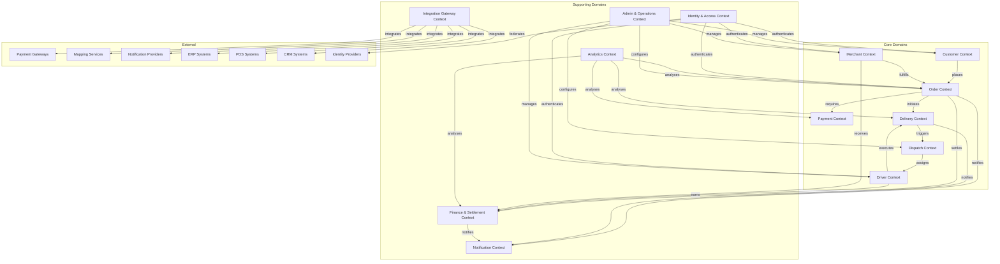

### Context Summary

| Context | Type | Priority | Description |
| :--- | :--- | :--- | :--- |
| **Customer Context** | Core | High | Manages customer identities, profiles, preferences, and loyalty. |
| **Merchant Context** | Core | High | Manages merchant onboarding, stores, menus, and inventory. |
| **Driver Context** | Core | High | Manages driver onboarding, availability, and performance. |
| **Order Context** | Core | High | Orchestrates the order lifecycle and fulfillment process. |
| **Payment Context** | Core | High | Processes payments, refunds, wallets, and subscriptions. |
| **Delivery Context** | Core | High | Manages delivery execution, tracking, and geofencing. |
| **Dispatch Context** | Core | High | Optimizes order routing, batching, and driver assignment. |
| **Finance Context** | Supporting | High | Handles settlements, invoicing, taxation, and reconciliation. |
| **Notification Context** | Supporting | High | Manages multi-channel communication delivery. |
| **Admin Context** | Supporting | High | Provides platform administration and configuration. |
| **Analytics Context** | Supporting | Medium | Collects and analyzes platform data for insights. |
| **Identity Context** | Supporting | High | Manages authentication, authorization, and SSO. |
| **Integration Context** | Supporting | High | Manages third-party integrations and adapters. |

---

## Bounded Contexts Detailed

### 1. Customer Context

| Attribute | Description |
| :--- | :--- |
| **Responsibility** | Manage customer identities, profiles, preferences, addresses, loyalty, and consent. |
| **Aggregate Root** | `Customer` |
| **Key Entities** | `Customer`, `CustomerAddress`, `CustomerSession`, `LoyaltyAccount`, `Wallet` |
| **Value Objects** | `Address`, `Money`, `Consent`, `NotificationPreferences` |
| **Domain Events** | `CustomerRegistered`, `CustomerUpdated`, `CustomerAddressAdded`, `CustomerAddressUpdated`, `CustomerAddressRemoved`, `CustomerDeactivated`, `CustomerDeletionRequested`, `LoyaltyPointsEarned`, `LoyaltyPointsRedeemed`, `LoyaltyTierChanged` |
| **Key Use Cases** | Registration, login, profile update, address management, loyalty program, consent management. |
| **Integration Patterns** | **Open Host Service** (public API for customer data). **Customer/Supplier** with Order Context (customers place orders). |
| **Ubiquitous Language** | Customer, Address, Loyalty Points, Tier, Referral, Consent, Wallet, Balance. |

**Aggregate Diagram:**

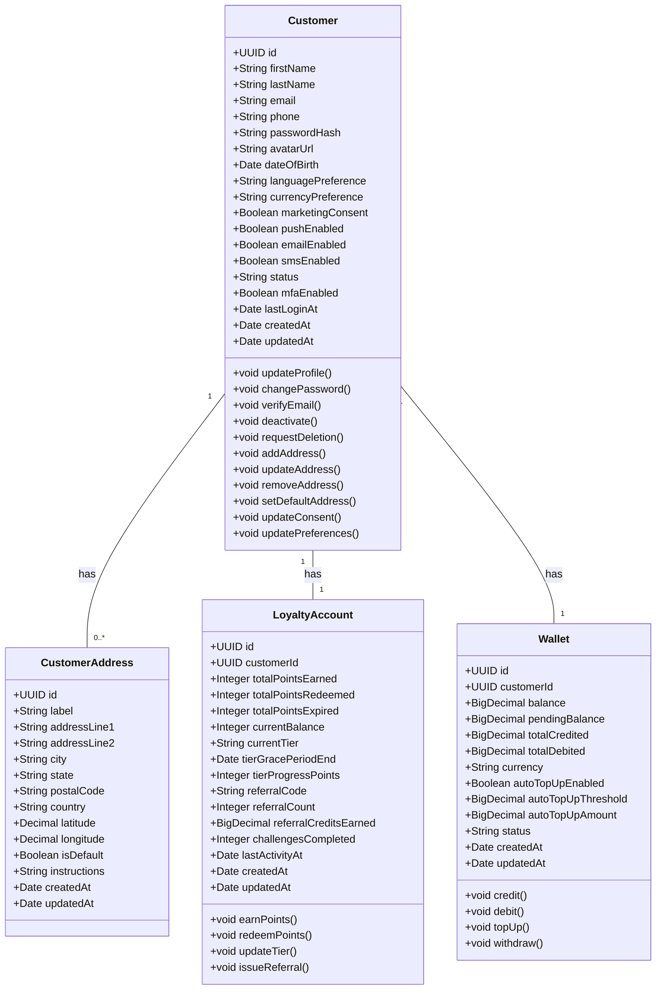

---

### 2. Merchant Context

| Attribute | Description |
| :--- | :--- |
| **Responsibility** | Manage merchant onboarding, store profiles, menus, catalog, and operational settings. |
| **Aggregate Root** | `MerchantAccount`, `Store` |
| **Key Entities** | `MerchantAccount`, `Store`, `MenuCategory`, `MenuItem`, `ModifierGroup`, `ModifierOption`, `InventoryItem` |
| **Value Objects** | `Address`, `OperatingHours`, `DeliveryZone`, `CommissionRate`, `SettlementSchedule` |
| **Domain Events** | `MerchantRegistered`, `MerchantApproved`, `MerchantSuspended`, `StoreCreated`, `StoreUpdated`, `MenuItemAdded`, `MenuItemUpdated`, `MenuItemRemoved`, `InventoryUpdated` |
| **Key Use Cases** | Registration, document verification, store setup, menu management, inventory management, operating hours configuration. |
| **Integration Patterns** | **Customer/Supplier** with Order Context (merchants fulfill orders). **Anticorruption Layer** with ERP/POS integrations. |
| **Ubiquitous Language** | Merchant, Store, Menu, Category, Item, Modifier, Inventory, Operating Hours, Delivery Zone, Commission. |

**Aggregate Diagram:**

```mermaid
classDiagram
    class MerchantAccount {
        +UUID id
        +String businessLegalName
        +String businessTradingName
        +String businessRegistrationNumber
        +String taxId
        +String businessType
        +String businessCategory
        +String primaryCuisine
        +String segment
        +BigDecimal commissionRate
        +String settlementFrequency
        +Integer settlementDayOfWeek
        +BigDecimal minimumOrderValue
        +Integer deliveryRadius
        +Integer estimatedPrepTime
        +String status
        +JSON applicationData
        +Date verifiedAt
        +Date activatedAt
        +Date suspendedAt
        +String suspensionReason
        +Date createdAt
        +Date updatedAt
        +void approve()
        +void suspend()
        +void reactivate()
        +void updateCommissionRate()
        +void updateSettlementSchedule()
    }
    class Store {
        +UUID id
        +UUID merchantId
        +String storeName
        +String storeDescription
        +String storeCategory
        +String storeSubcategory
        +Address address
        +String storePhone
        +String storeEmail
        +String storeWebsite
        +String logoUrl
        +String coverImageUrl
        +String[] storeImages
        +OperatingHours operatingHours
        +Boolean isDeliveryEnabled
        +Boolean isPickupEnabled
        +Boolean isActive
        +Boolean isVerified
        +Date createdAt
        +Date updatedAt
        +void activate()
        +void deactivate()
        +void updateOperatingHours()
        +void updateStoreDetails()
    }
    class MenuItem {
        +UUID id
        +UUID storeId
        +UUID categoryId
        +String itemName
        +String itemDescription
        +String itemShortDescription
        +BigDecimal price
        +BigDecimal compareAtPrice
        +BigDecimal costPrice
        +String primaryImage
        +String[] galleryImages
        +String sku
        +String barcode
        +BigDecimal weight
        +Integer preparationTime
        +Boolean isAvailable
        +Boolean isFeatured
        +Boolean isBestSeller
        +Boolean isNew
        +String[] dietaryTags
        +String[] allergenTags
        +String portionSize
        +Integer calories
        +JSON nutritionFacts
        +String[] tags
        +String slug
        +Integer sortOrder
        +Integer minOrderQuantity
        +Integer maxOrderQuantity
        +Boolean allowZeroPrice
        +Date createdAt
        +Date updatedAt
        +Date lastOrderedAt
        +void updatePrice()
        +void toggleAvailability()
        +void addModifierGroup()
        +void updateModifierGroup()
        +void removeModifierGroup()
    }
    class ModifierGroup {
        +UUID id
        +UUID itemId
        +String groupName
        +String groupType
        +Integer minSelections
        +Integer maxSelections
        +Boolean isRequired
        +Integer displayOrder
        +Boolean isAvailable
        +Date createdAt
        +Date updatedAt
        +void addOption()
        +void updateOption()
        +void removeOption()
    }
    class InventoryItem {
        +UUID id
        +UUID itemId
        +UUID storeId
        +Integer currentStock
        +Integer minimumStock
        +Integer maximumStock
        +Integer reorderPoint
        +Integer reorderQuantity
        +String unitType
        +Date lastUpdated
        +UUID updatedBy
        +Date createdAt
        +Date updatedAt
        +void adjustStock()
        +void deductStock()
        +void replenishStock()
    }
    MerchantAccount "1" -- "0..*" Store : owns
    Store "1" -- "0..*" MenuItem : has
    MenuItem "1" -- "0..*" ModifierGroup : has
    MenuItem "1" -- "1" InventoryItem : has
```

---

### 3. Driver Context

| Attribute | Description |
| :--- | :--- |
| **Responsibility** | Manage driver onboarding, profiles, availability, vehicle management, and performance. |
| **Aggregate Root** | `DriverAccount` |
| **Key Entities** | `DriverAccount`, `DriverVehicle`, `DriverDocument`, `DriverSession`, `DriverRating` |
| **Value Objects** | `Location`, `VehicleType`, `Document` |
| **Domain Events** | `DriverRegistered`, `DriverApproved`, `DriverSuspended`, `DriverActivated`, `DriverLocationUpdated`, `DriverStatusChanged`, `DriverRatingUpdated` |
| **Key Use Cases** | Registration, document verification, training, online/offline status, location updates, performance tracking. |
| **Integration Patterns** | **Customer/Supplier** with Dispatch Context (drivers are assigned orders). **Open Host Service** for driver availability. |
| **Ubiquitous Language** | Driver, Vehicle, Availability, Online, Offline, Busy, Rating, Earnings, Payout, Shift. |

**Aggregate Diagram:**

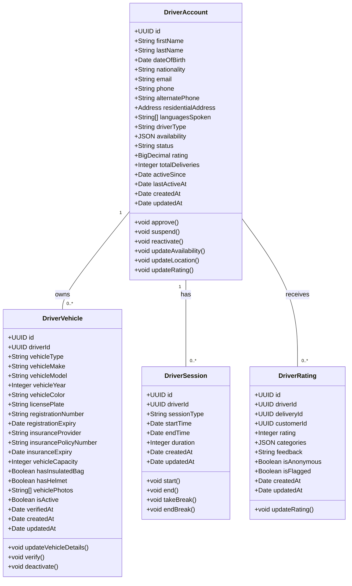

---

### 4. Order Context

| Attribute | Description |
| :--- | :--- |
| **Responsibility** | Orchestrate the order lifecycle from creation to delivery, managing state transitions, validation, and coordination with other contexts. |
| **Aggregate Root** | `Order` |
| **Key Entities** | `Order`, `OrderItem`, `OrderStatusHistory`, `OrderTimeline` |
| **Value Objects** | `OrderStatus`, `PaymentMethod`, `DeliveryAddress`, `Money`, `OrderItemModifier` |
| **Domain Events** | `OrderCreated`, `OrderConfirmed`, `OrderPreparationStarted`, `OrderReady`, `OrderAssigned`, `OrderPickedUp`, `OrderInTransit`, `OrderArrivingSoon`, `OrderDelivered`, `OrderCancelled`, `OrderFailed`, `OrderRefunded` |
| **Key Use Cases** | Place order, confirm order, start preparation, mark ready, assign driver, pickup, deliver, cancel, refund. |
| **Integration Patterns** | **Open Host Service** (public API). **Customer/Supplier** with Payment, Delivery, Dispatch, and Notification contexts. |
| **Ubiquitous Language** | Order, Order Status, Order Item, Modifier, Cart, Checkout, Timeline, Confirmation, Preparation, Readiness, Assignment, Pickup, Delivery. |

**Aggregate Diagram:**

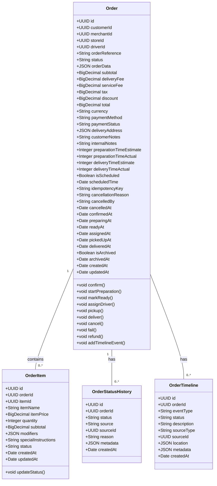

---

### 5. Payment Context

| Attribute | Description |
| :--- | :--- |
| **Responsibility** | Process payments, refunds, wallet operations, and subscriptions. |
| **Aggregate Root** | `PaymentTransaction`, `Wallet`, `Subscription` |
| **Key Entities** | `PaymentTransaction`, `PaymentMethod`, `Wallet`, `WalletTransaction`, `Subscription`, `Invoice` |
| **Value Objects** | `Money`, `PaymentStatus`, `SubscriptionPlan`, `BillingCycle` |
| **Domain Events** | `PaymentAuthorized`, `PaymentCaptured`, `PaymentFailed`, `PaymentRefunded`, `WalletCredited`, `WalletDebited`, `SubscriptionCreated`, `SubscriptionUpdated`, `SubscriptionCancelled` |
| **Key Use Cases** | Authorize payment, capture payment, refund, wallet top-up, wallet payment, create subscription, cancel subscription. |
| **Integration Patterns** | **Anticorruption Layer** with payment gateway integrations. **Shared Kernel** (Money, Currency) with Finance Context. |
| **Ubiquitous Language** | Payment, Authorization, Capture, Refund, Wallet, Balance, Top-up, Subscription, Invoice, Gateway. |

**Aggregate Diagram:**

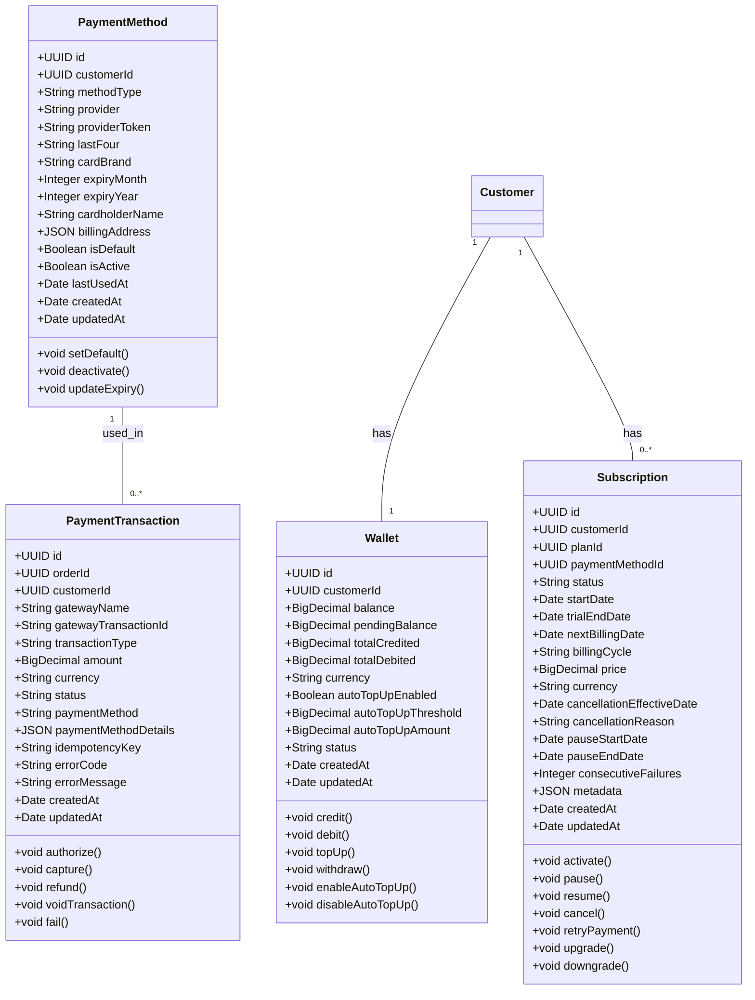

---

### 6. Delivery Context

| Attribute | Description |
| :--- | :--- |
| **Responsibility** | Manage delivery execution, real-time tracking, geofencing, and driver-customer communication. |
| **Aggregate Root** | `Delivery` |
| **Key Entities** | `Delivery`, `DeliveryLocationHistory`, `DeliveryCommunication` |
| **Value Objects** | `Location`, `DeliveryStatus`, `VerificationMethod` |
| **Domain Events** | `DeliveryAssigned`, `DeliveryPickedUp`, `DeliveryInTransit`, `DeliveryArrivingSoon`, `DeliveryCompleted`, `DeliveryFailed` |
| **Key Use Cases** | Assign driver, track location, confirm pickup, confirm delivery, handle exceptions, communicate with customer. |
| **Integration Patterns** | **Customer/Supplier** with Order and Dispatch Contexts. **Open Host Service** for real-time tracking. |
| **Ubiquitous Language** | Delivery, Driver, Tracking, GPS, Location, Geofence, ETA, Pickup, Dropoff, Verification, QR Code, OTP, Photo Proof. |

**Aggregate Diagram:**

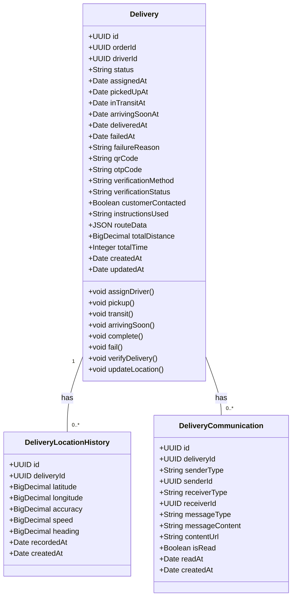

---

### 7. Dispatch Context

| Attribute | Description |
| :--- | :--- |
| **Responsibility** | Optimize order routing, batch consolidation, and driver assignment algorithms. |
| **Aggregate Root** | `AssignmentQueue`, `BatchTrip` |
| **Key Entities** | `AssignmentQueue`, `AssignmentAttempt`, `BatchTrip`, `TripStop` |
| **Value Objects** | `CompositeScore`, `Route`, `ETA` |
| **Domain Events** | `OrderQueued`, `OrderOffered`, `OrderAccepted`, `OrderDeclined`, `OrderExpired`, `BatchCreated`, `BatchCompleted` |
| **Key Use Cases** | Queue orders, calculate composite scores, offer orders, accept/decline, batch orders, optimize routes, reassign orders. |
| **Integration Patterns** | **Customer/Supplier** with Order and Delivery Contexts. **Anticorruption Layer** with mapping services for routing. |
| **Ubiquitous Language** | Queue, Offer, Accept, Decline, Score, Batch, Trip, Route, Optimization, Reassignment, Surge Pricing. |

**Aggregate Diagram:**

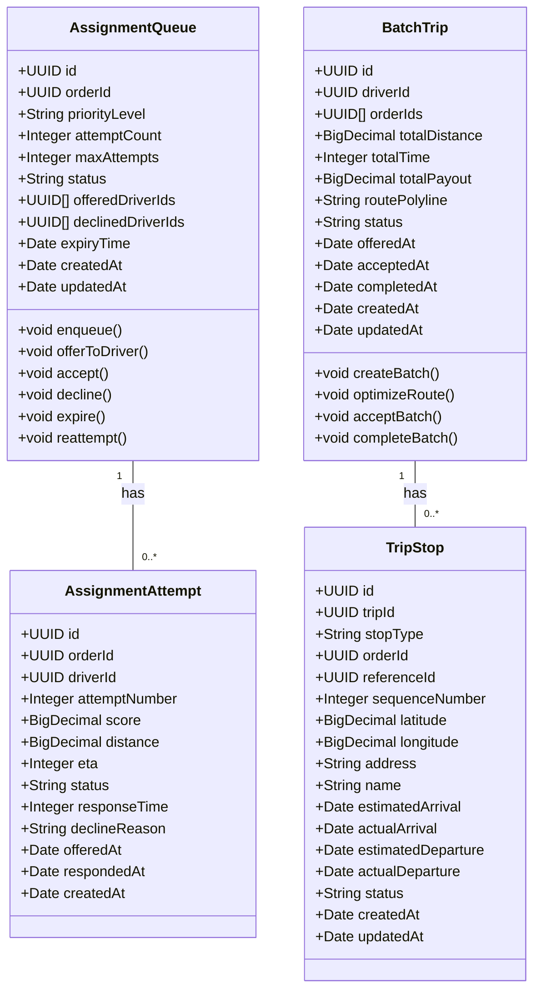

---

### 8. Finance Context

| Attribute | Description |
| :--- | :--- |
| **Responsibility** | Calculate merchant settlements, driver payouts, commissions, fees, taxes, and reconciliation. |
| **Aggregate Root** | `Settlement`, `Invoice`, `Reconciliation` |
| **Key Entities** | `MerchantSettlement`, `DriverPayout`, `Invoice`, `Reconciliation`, `Adjustment` |
| **Value Objects** | `Money`, `CommissionRate`, `TaxRate`, `SettlementPeriod` |
| **Domain Events** | `SettlementCalculated`, `SettlementPaid`, `PayoutProcessed`, `InvoiceGenerated`, `ReconciliationCompleted` |
| **Key Use Cases** | Calculate merchant settlements, process driver payouts, generate invoices, reconcile with gateways, handle adjustments. |
| **Integration Patterns** | **Shared Kernel** (Money, Currency) with Payment Context. **Customer/Supplier** with Merchant, Driver, and Order Contexts. |
| **Ubiquitous Language** | Settlement, Payout, Commission, Fee, Tax, Invoice, Reconciliation, Adjustment, Gross Revenue, Net Revenue. |

**Aggregate Diagram:**

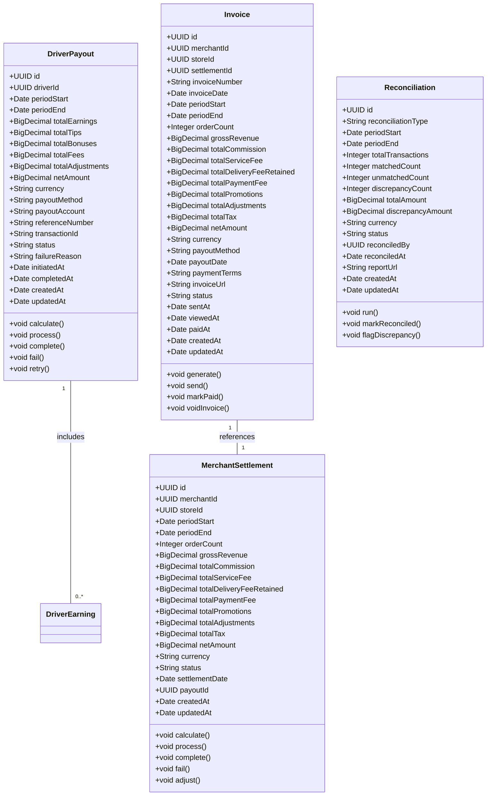

---

### 9. Notification Context

| Attribute | Description |
| :--- | :--- |
| **Responsibility** | Manage multi-channel notification delivery (push, email, SMS, in-app, webhook). |
| **Aggregate Root** | `Notification`, `NotificationTemplate` |
| **Key Entities** | `Notification`, `NotificationTemplate`, `NotificationPreference`, `NotificationDelivery`, `WebhookSubscription` |
| **Value Objects** | `Channel`, `DeliveryStatus`, `NotificationType` |
| **Domain Events** | `NotificationQueued`, `NotificationSent`, `NotificationDelivered`, `NotificationOpened`, `NotificationClicked`, `NotificationFailed` |
| **Key Use Cases** | Send push, email, SMS, in-app, webhook notifications; manage templates; track delivery and engagement. |
| **Integration Patterns** | **Customer/Supplier** with all contexts. **Anticorruption Layer** with notification providers. |
| **Ubiquitous Language** | Notification, Push, Email, SMS, In-App, Webhook, Template, Channel, Delivery, Open, Click, Unsubscribe. |

**Aggregate Diagram:**

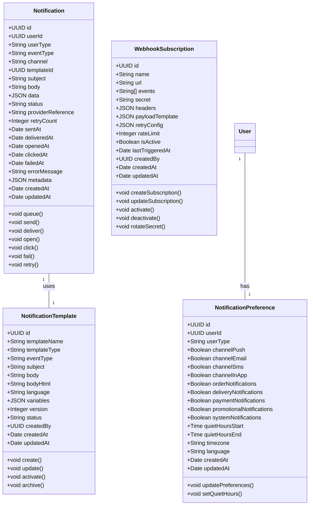

---

### 10. Admin & Operations Context

| Attribute | Description |
| :--- | :--- |
| **Responsibility** | Provide platform administration, user management, configuration, content management, and operational oversight. |
| **Aggregate Root** | `AdminUser`, `PlatformConfiguration`, `AuditLog` |
| **Key Entities** | `AdminUser`, `PlatformConfiguration`, `AuditLog`, `SupportTicket`, `ContentItem`, `Campaign` |
| **Value Objects** | `Permission`, `Role`, `ConfigurationKey` |
| **Domain Events** | `AdminUserCreated`, `AdminUserUpdated`, `ConfigurationChanged`, `AuditEventLogged`, `SupportTicketCreated`, `SupportTicketResolved` |
| **Key Use Cases** | Admin login, user management, configuration update, audit log query, support ticket management, content publishing. |
| **Integration Patterns** | **Open Host Service** (admin API). **Conformist** with other contexts for read-only operations. |
| **Ubiquitous Language** | Admin, User, Role, Permission, Configuration, Audit Log, Support Ticket, Content, Campaign, Promotion. |

**Aggregate Diagram:**

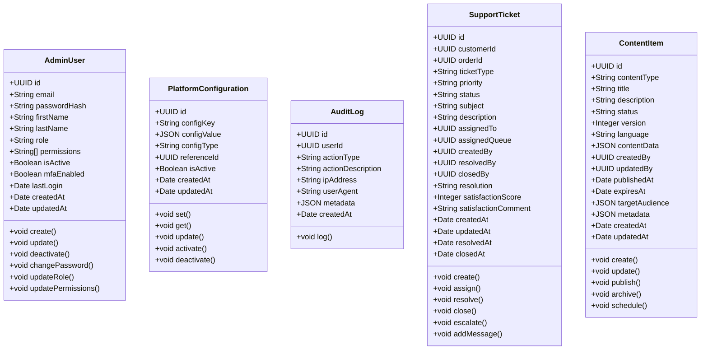

---

### 11. Analytics Context

| Attribute | Description |
| :--- | :--- |
| **Responsibility** | Collect, process, and analyze platform data for business intelligence, reporting, and predictive analytics. |
| **Aggregate Root** | `AnalyticsReport`, `Dashboard` |
| **Key Entities** | `AnalyticsReport`, `Dashboard`, `KPI`, `Prediction`, `Metric` |
| **Value Objects** | `MetricValue`, `TimePeriod`, `Aggregation` |
| **Domain Events** | `DataIngested`, `ReportGenerated`, `ForecastUpdated`, `AnomalyDetected` |
| **Key Use Cases** | Generate reports, update dashboards, calculate KPIs, run predictive models, detect anomalies. |
| **Integration Patterns** | **Customer/Supplier** with all contexts (data sources). **Open Host Service** for analytics API. |
| **Ubiquitous Language** | Report, Dashboard, KPI, Metric, Trend, Forecast, Anomaly, Prediction, Cohort, Retention, Churn, LTV. |

---

### 12. Identity & Access Context

| Attribute | Description |
| :--- | :--- |
| **Responsibility** | Manage authentication, authorization, Single Sign-On (SSO), and identity federation. |
| **Aggregate Root** | `User`, `IdentityProvider` |
| **Key Entities** | `User`, `UserRole`, `UserSession`, `IdentityProvider`, `MfaSetting`, `ApiKey` |
| **Value Objects** | `Token`, `Permission`, `Scope`, `Claim` |
| **Domain Events** | `UserLoggedIn`, `UserLoggedOut`, `PasswordChanged`, `MfaEnabled`, `MfaVerified`, `TokenRevoked` |
| **Key Use Cases** | Login, logout, password reset, MFA enrollment, SSO login, token refresh, API key management. |
| **Integration Patterns** | **Open Host Service** (authentication API). **Anticorruption Layer** with identity providers (Okta, Azure AD). |
| **Ubiquitous Language** | User, Authentication, Authorization, JWT, Refresh Token, MFA, SSO, SAML, OIDC, SCIM, Role, Permission, Scope. |

---

### 13. Integration Gateway Context

| Attribute | Description |
| :--- | :--- |
| **Responsibility** | Manage third-party integrations, adapters, and data synchronization with external systems (ERP, POS, CRM, payment gateways, mapping services, notification providers). |
| **Aggregate Root** | `IntegrationConnection`, `SyncJob` |
| **Key Entities** | `IntegrationConnection`, `SyncJob`, `DataMapping`, `ProviderConfiguration` |
| **Value Objects** | `ConnectionStatus`, `SyncFrequency`, `MappingRule` |
| **Domain Events** | `ConnectionEstablished`, `SyncStarted`, `SyncCompleted`, `SyncFailed`, `DataMapped` |
| **Key Use Cases** | Configure integrations, run sync jobs, map data fields, monitor connection health, handle errors. |
| **Integration Patterns** | **Anticorruption Layer** for each external system. **Open Host Service** for internal APIs. |
| **Ubiquitous Language** | Integration, Connection, Sync, Mapping, Provider, Adapter, Webhook, Batch, Real-Time, Fallback. |

---

## Context Maps

### Context Relationship Matrix

| Context | Customer | Merchant | Driver | Order | Payment | Delivery | Dispatch | Finance | Notification | Admin | Analytics | Identity | Integration |
| :--- | :--- | :--- | :--- | :--- | :--- | :--- | :--- | :--- | :--- | :--- | :--- | :--- | :--- |
| **Customer** | - | - | - | OHS | - | - | - | - | - | - | - | C/S | - |
| **Merchant** | - | - | - | C/S | - | - | - | - | - | - | - | - | ACL |
| **Driver** | - | - | - | - | - | C/S | - | - | - | - | - | - | - |
| **Order** | C/S | C/S | - | - | C/S | C/S | C/S | - | C/S | - | - | - | - |
| **Payment** | - | - | - | C/S | - | - | - | ACL | - | - | - | - | ACL |
| **Delivery** | - | - | C/S | C/S | - | - | C/S | - | C/S | - | - | - | ACL |
| **Dispatch** | - | - | - | C/S | - | C/S | - | - | - | - | - | - | ACL |
| **Finance** | - | C/S | C/S | - | - | - | - | - | C/S | - | - | - | ACL |
| **Notification** | - | - | - | C/S | - | C/S | - | C/S | - | - | - | - | ACL |
| **Admin** | - | C/S | C/S | - | - | - | - | - | - | - | - | - | - |
| **Analytics** | - | - | - | - | - | - | - | - | - | - | - | - | - |
| **Identity** | - | - | - | - | - | - | - | - | - | - | - | - | - |
| **Integration** | - | ACL | ACL | - | ACL | ACL | ACL | ACL | ACL | - | - | - | - |

**Legend:**
- **OHS** = Open Host Service
- **C/S** = Customer/Supplier
- **ACL** = Anticorruption Layer
- **SK** = Shared Kernel
- **P** = Partnership

---

## Event Catalog Summary

| Event | Source Context | Consumers |
| :--- | :--- | :--- |
| `CustomerRegistered` | Customer | Order, Notification, Analytics, Identity |
| `CustomerUpdated` | Customer | Order, Notification, Analytics |
| `OrderCreated` | Order | Payment, Delivery, Dispatch, Notification, Analytics, Finance |
| `OrderConfirmed` | Order | Notification, Analytics, Merchant |
| `OrderPrepared` | Order | Notification, Analytics, Delivery |
| `OrderReady` | Order | Dispatch, Notification, Analytics |
| `OrderAssigned` | Dispatch | Order, Delivery, Notification |
| `OrderPickedUp` | Delivery | Order, Notification, Analytics |
| `OrderInTransit` | Delivery | Order, Notification, Analytics, Customer |
| `OrderDelivered` | Delivery | Order, Payment, Finance, Notification, Analytics, Merchant |
| `OrderCancelled` | Order | Payment, Delivery, Notification, Analytics, Finance |
| `PaymentAuthorized` | Payment | Order, Notification, Analytics |
| `PaymentCaptured` | Payment | Order, Finance, Notification, Analytics |
| `PaymentFailed` | Payment | Order, Notification, Analytics |
| `PaymentRefunded` | Payment | Order, Finance, Notification, Analytics |
| `SettlementCalculated` | Finance | Merchant, Notification, Analytics |
| `SettlementPaid` | Finance | Merchant, Notification, Analytics |
| `DriverPayoutProcessed` | Finance | Driver, Notification, Analytics |
| `DeliveryAssigned` | Dispatch | Order, Delivery, Notification |
| `DeliveryCompleted` | Delivery | Order, Finance, Notification, Analytics |
| `WalletCredited` | Payment | Customer, Notification, Analytics |
| `WalletDebited` | Payment | Customer, Notification, Analytics |
| `SubscriptionCreated` | Payment | Customer, Notification, Analytics |
| `SubscriptionCancelled` | Payment | Customer, Notification, Analytics |

---

## Architectural Decisions

### Key Decisions

| Decision | Rationale | Consequences |
| :--- | :--- | :--- |
| **Bounded Context Decomposition** | Separated by business capabilities to enable independent evolution and deployment. | Increased complexity in inter-context communication; need for robust event-driven architecture. |
| **Order Context as Orchestrator** | Order is the central flow; it coordinates payment, delivery, and dispatch. | Order service becomes a critical point; must handle failures gracefully. |
| **Event-Driven Communication** | Loose coupling and eventual consistency between contexts. | Requires Kafka; handling eventual consistency and idempotency. |
| **Shared Kernel (Money, Currency)** | Finance and Payment contexts share a common value object for monetary amounts. | Reduces duplication; requires careful versioning of the shared kernel. |
| **Anticorruption Layer for Integrations** | Protects internal domains from external system changes (payment gateways, ERP, POS). | Adds translation overhead; isolates impact of external changes. |
| **Open Host Service for Public APIs** | Well-defined, versioned APIs for external developers and partners. | Increases API surface; requires strong documentation and governance. |

---

## Version History

| Version | Date | Author | Changes |
| :--- | :--- | :--- | :--- |
| 1.0.0 | 2026-06-30 | [Author] | Initial domain model and bounded contexts documentation |

---

**Next Document:**

`Event_Catalog.md`

*(This continues the architecture design documentation with a detailed event catalog.)*