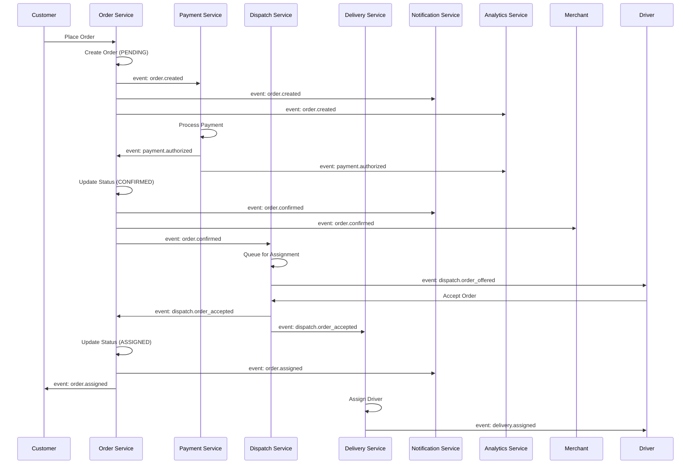
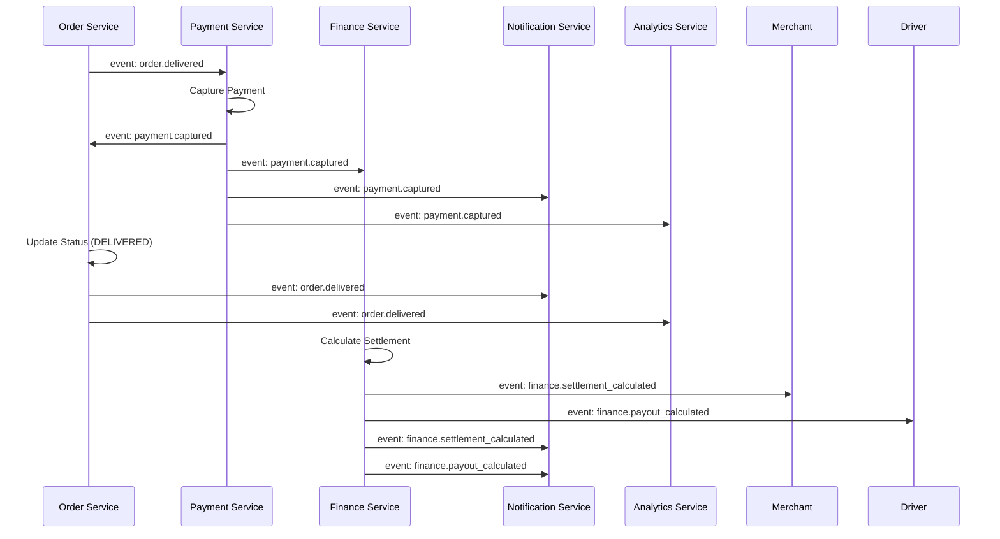
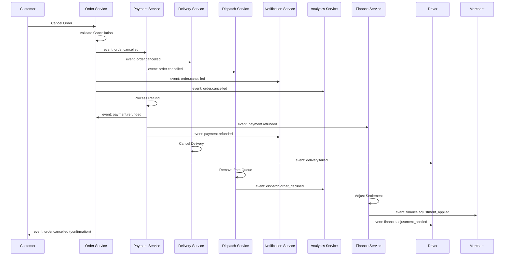

# Software Architecture Document (SAD)

## Event Catalog

**Version:** 1.0.0
**Last Updated:** 2026-06-30

---

## Purpose

This document provides a comprehensive catalog of all domain events across the **[Platform Name]** platform. Events are the backbone of the platform's event-driven architecture, enabling loose coupling, asynchronous communication, and eventual consistency between bounded contexts.

This catalog serves as the single source of truth for event definitions, schemas, producers, consumers, and flow patterns. It guides the implementation of event-driven services and ensures consistent event handling across the platform.

---

## Event Architecture Overview

### Event Characteristics

| Characteristic | Description |
| :--- | :--- |
| **Immutable** | Events represent facts that have occurred; they cannot be changed. |
| **Idempotent** | Consumers must handle duplicate events without adverse effects. |
| **Versioned** | Events are versioned to support schema evolution. |
| **Timestamped** | Each event carries a timestamp of when it occurred. |
| **Traceable** | Events include correlation IDs for distributed tracing. |
| **Partitioned** | Events are partitioned by aggregate ID for ordering guarantees. |

### Event Structure

| Field | Type | Required | Description |
| :--- | :--- | :--- | :--- |
| `event_id` | UUID | Yes | Unique event identifier |
| `event_type` | String | Yes | Fully qualified event name |
| `event_version` | String | Yes | Semantic version (e.g., "1.0") |
| `aggregate_id` | UUID | Yes | ID of the aggregate that produced the event |
| `aggregate_type` | String | Yes | Type of aggregate (e.g., "Order", "Customer") |
| `timestamp` | Timestamp | Yes | ISO 8601 UTC timestamp |
| `correlation_id` | UUID | Yes | Correlation ID for distributed tracing |
| `causation_id` | UUID | No | ID of the event that caused this event |
| `data` | JSON | Yes | Event payload |
| `metadata` | JSON | No | Additional event metadata |

### Event Schema Registry

| Schema Type | Description | Location |
| :--- | :--- | :--- |
| **JSON Schema** | Validation schemas for event payloads | `/schemas/events/{event_type}.json` |
| **Avro Schema** | Avro schemas for Kafka serialization | `/schemas/avro/{event_type}.avsc` |
| **Protobuf** | Protobuf definitions for gRPC streaming | `/proto/events/{event_type}.proto` |

---

## Event Catalog by Bounded Context

### 1. Customer Context Events

| Event | Description | Source | Consumers | Version |
| :--- | :--- | :--- | :--- | :--- |
| `customer.registered` | Customer registered on the platform | Customer Service | Order, Notification, Analytics, Identity | 1.0 |
| `customer.verified` | Customer email/phone verified | Customer Service | Notification, Analytics | 1.0 |
| `customer.updated` | Customer profile updated | Customer Service | Order, Notification, Analytics | 1.0 |
| `customer.address_added` | Customer added a new address | Customer Service | Order, Notification | 1.0 |
| `customer.address_updated` | Customer updated an address | Customer Service | Order | 1.0 |
| `customer.address_removed` | Customer removed an address | Customer Service | Order | 1.0 |
| `customer.mfa_enabled` | Customer enabled MFA | Customer Service | Notification, Identity | 1.0 |
| `customer.mfa_disabled` | Customer disabled MFA | Customer Service | Notification, Identity | 1.0 |
| `customer.suspended` | Customer account suspended | Admin Service | Order, Notification | 1.0 |
| `customer.activated` | Customer account reactivated | Admin Service | Order, Notification | 1.0 |
| `customer.deletion_requested` | Customer requested GDPR deletion | Customer Service | Analytics, Notification | 1.0 |
| `customer.deleted` | Customer account deleted (GDPR) | Customer Service | Analytics | 1.0 |
| `customer.loyalty_points_earned` | Customer earned loyalty points | Loyalty Service | Notification, Analytics | 1.0 |
| `customer.loyalty_points_redeemed` | Customer redeemed loyalty points | Loyalty Service | Notification, Analytics | 1.0 |
| `customer.loyalty_tier_changed` | Customer loyalty tier changed | Loyalty Service | Notification, Analytics | 1.0 |
| `customer.wallet_credited` | Customer wallet credited | Wallet Service | Notification, Analytics | 1.0 |
| `customer.wallet_debited` | Customer wallet debited | Wallet Service | Notification, Analytics | 1.0 |
| `customer.referral_created` | Customer created a referral | Referral Service | Notification, Analytics | 1.0 |
| `customer.referral_used` | Referral used by new customer | Referral Service | Customer, Analytics | 1.0 |

### 2. Merchant Context Events

| Event | Description | Source | Consumers | Version |
| :--- | :--- | :--- | :--- | :--- |
| `merchant.registered` | Merchant application submitted | Merchant Service | Admin, Notification, Analytics | 1.0 |
| `merchant.verified` | Merchant documents verified | Admin Service | Merchant, Notification | 1.0 |
| `merchant.approved` | Merchant application approved | Admin Service | Merchant, Notification, Analytics | 1.0 |
| `merchant.rejected` | Merchant application rejected | Admin Service | Merchant, Notification | 1.0 |
| `merchant.activated` | Merchant account activated | Admin Service | Order, Notification | 1.0 |
| `merchant.suspended` | Merchant account suspended | Admin Service | Order, Notification | 1.0 |
| `merchant.reactivated` | Merchant account reactivated | Admin Service | Order, Notification | 1.0 |
| `merchant.store_created` | New store created | Merchant Service | Order, Analytics | 1.0 |
| `merchant.store_updated` | Store details updated | Merchant Service | Order | 1.0 |
| `merchant.store_closed` | Store closed (temporarily) | Merchant Service | Order, Notification | 1.0 |
| `merchant.store_opened` | Store reopened | Merchant Service | Order, Notification | 1.0 |
| `merchant.menu_item_added` | Menu item added | Merchant Service | Order, Search, Analytics | 1.0 |
| `merchant.menu_item_updated` | Menu item updated | Merchant Service | Order, Search | 1.0 |
| `merchant.menu_item_removed` | Menu item removed | Merchant Service | Order, Search | 1.0 |
| `merchant.menu_item_available` | Menu item marked available | Merchant Service | Order | 1.0 |
| `merchant.menu_item_unavailable` | Menu item marked unavailable | Merchant Service | Order | 1.0 |
| `merchant.inventory_updated` | Inventory level changed | Merchant Service | Order | 1.0 |
| `merchant.inventory_low` | Inventory below threshold | Merchant Service | Merchant, Notification | 1.0 |
| `merchant.operating_hours_updated` | Operating hours changed | Merchant Service | Order | 1.0 |
| `merchant.commission_rate_updated` | Commission rate changed | Admin Service | Merchant, Finance | 1.0 |

### 3. Driver Context Events

| Event | Description | Source | Consumers | Version |
| :--- | :--- | :--- | :--- | :--- |
| `driver.registered` | Driver application submitted | Driver Service | Admin, Notification, Analytics | 1.0 |
| `driver.verified` | Driver documents verified | Admin Service | Driver, Notification | 1.0 |
| `driver.approved` | Driver application approved | Admin Service | Driver, Notification, Analytics | 1.0 |
| `driver.rejected` | Driver application rejected | Admin Service | Driver, Notification | 1.0 |
| `driver.activated` | Driver account activated | Admin Service | Dispatch, Notification | 1.0 |
| `driver.suspended` | Driver account suspended | Admin Service | Dispatch, Notification | 1.0 |
| `driver.reactivated` | Driver account reactivated | Admin Service | Dispatch, Notification | 1.0 |
| `driver.online` | Driver went online | Driver Service | Dispatch, Analytics | 1.0 |
| `driver.offline` | Driver went offline | Driver Service | Dispatch, Analytics | 1.0 |
| `driver.on_break` | Driver started break | Driver Service | Dispatch | 1.0 |
| `driver.off_break` | Driver ended break | Driver Service | Dispatch | 1.0 |
| `driver.location_updated` | Driver GPS location updated | Driver Service | Dispatch, Delivery, Tracking | 1.0 |
| `driver.rating_updated` | Driver rating updated | Driver Service | Driver, Analytics | 1.0 |
| `driver.vehicle_added` | Vehicle added to driver profile | Driver Service | Dispatch | 1.0 |
| `driver.vehicle_updated` | Vehicle details updated | Driver Service | Dispatch | 1.0 |
| `driver.vehicle_verified` | Vehicle verified | Admin Service | Driver, Dispatch | 1.0 |

### 4. Order Context Events

| Event | Description | Source | Consumers | Version |
| :--- | :--- | :--- | :--- | :--- |
| `order.created` | Order placed by customer | Order Service | Payment, Delivery, Dispatch, Notification, Analytics, Finance | 1.0 |
| `order.confirmed` | Merchant confirmed order | Order Service | Payment, Notification, Analytics, Merchant | 1.0 |
| `order.preparation_started` | Merchant started preparation | Order Service | Notification, Analytics | 1.0 |
| `order.ready` | Order ready for pickup | Order Service | Dispatch, Notification, Analytics | 1.0 |
| `order.assigned` | Driver assigned to order | Order Service | Delivery, Notification, Analytics | 1.0 |
| `order.picked_up` | Driver picked up order | Order Service | Delivery, Notification, Analytics, Tracking | 1.0 |
| `order.in_transit` | Driver en route to customer | Order Service | Delivery, Notification, Analytics, Tracking | 1.0 |
| `order.arriving_soon` | Driver near customer location | Order Service | Delivery, Notification, Analytics, Tracking | 1.0 |
| `order.delivered` | Order delivered successfully | Order Service | Payment, Finance, Notification, Analytics, Merchant, Driver | 1.0 |
| `order.cancelled` | Order cancelled | Order Service | Payment, Delivery, Dispatch, Notification, Analytics, Finance | 1.0 |
| `order.failed` | Order delivery failed | Order Service | Payment, Notification, Analytics, Finance | 1.0 |
| `order.refunded` | Order refunded | Order Service | Payment, Notification, Analytics, Finance | 1.0 |
| `order.scheduled` | Order scheduled for future delivery | Order Service | Dispatch, Notification | 1.0 |
| `order.scheduled_ready` | Scheduled order ready for processing | Order Service | Dispatch | 1.0 |
| `order.status_updated` | Order status changed (generic) | Order Service | Notification, Analytics | 1.0 |

### 5. Payment Context Events

| Event | Description | Source | Consumers | Version |
| :--- | :--- | :--- | :--- | :--- |
| `payment.authorized` | Payment authorized successfully | Payment Service | Order, Notification, Analytics | 1.0 |
| `payment.captured` | Payment captured successfully | Payment Service | Order, Finance, Notification, Analytics | 1.0 |
| `payment.failed` | Payment authorization failed | Payment Service | Order, Notification, Analytics | 1.0 |
| `payment.refunded` | Payment refunded | Payment Service | Order, Finance, Notification, Analytics | 1.0 |
| `payment.disputed` | Payment disputed (chargeback) | Payment Service | Order, Notification, Analytics, Finance | 1.0 |
| `payment.dispute_resolved` | Payment dispute resolved | Payment Service | Order, Notification, Finance | 1.0 |
| `payment.method_added` | New payment method added | Payment Service | Customer, Notification | 1.0 |
| `payment.method_removed` | Payment method removed | Payment Service | Customer | 1.0 |
| `payment.method_default_set` | Default payment method changed | Payment Service | Customer | 1.0 |
| `wallet.credited` | Wallet balance increased | Wallet Service | Customer, Notification, Analytics | 1.0 |
| `wallet.debited` | Wallet balance decreased | Wallet Service | Customer, Notification, Analytics | 1.0 |
| `wallet.auto_topup_executed` | Auto top-up executed | Wallet Service | Customer, Notification | 1.0 |
| `subscription.created` | Subscription created | Subscription Service | Customer, Notification, Analytics | 1.0 |
| `subscription.updated` | Subscription updated | Subscription Service | Customer, Notification | 1.0 |
| `subscription.cancelled` | Subscription cancelled | Subscription Service | Customer, Notification, Analytics | 1.0 |
| `subscription.renewed` | Subscription renewed | Subscription Service | Customer, Notification | 1.0 |
| `subscription.failed` | Subscription payment failed | Subscription Service | Customer, Notification | 1.0 |

### 6. Delivery Context Events

| Event | Description | Source | Consumers | Version |
| :--- | :--- | :--- | :--- | :--- |
| `delivery.assigned` | Delivery assigned to driver | Dispatch Service | Order, Driver, Notification, Analytics | 1.0 |
| `delivery.picked_up` | Driver picked up order | Delivery Service | Order, Notification, Analytics, Tracking | 1.0 |
| `delivery.in_transit` | Delivery in transit | Delivery Service | Order, Notification, Analytics, Tracking | 1.0 |
| `delivery.arriving_soon` | Delivery arriving soon | Delivery Service | Order, Notification, Analytics, Tracking | 1.0 |
| `delivery.completed` | Delivery completed | Delivery Service | Order, Payment, Finance, Notification, Analytics, Merchant, Driver | 1.0 |
| `delivery.failed` | Delivery failed | Delivery Service | Order, Payment, Notification, Analytics, Finance | 1.0 |
| `delivery.location_updated` | Driver location updated | Delivery Service | Order, Tracking, Notification | 1.0 |
| `delivery.eta_updated` | ETA recalculated | Delivery Service | Order, Tracking | 1.0 |
| `delivery.verification_failed` | Delivery verification failed | Delivery Service | Order, Notification | 1.0 |
| `delivery.issue_reported` | Delivery issue reported | Delivery Service | Order, Notification, Support | 1.0 |

### 7. Dispatch Context Events

| Event | Description | Source | Consumers | Version |
| :--- | :--- | :--- | :--- | :--- |
| `dispatch.order_queued` | Order added to assignment queue | Order Service | Dispatch, Analytics | 1.0 |
| `dispatch.order_offered` | Order offered to driver | Dispatch Service | Driver, Analytics | 1.0 |
| `dispatch.order_accepted` | Order accepted by driver | Dispatch Service | Order, Delivery, Notification, Analytics | 1.0 |
| `dispatch.order_declined` | Order declined by driver | Dispatch Service | Dispatch, Analytics | 1.0 |
| `dispatch.order_expired` | Order expired in queue | Dispatch Service | Order, Analytics | 1.0 |
| `dispatch.batch_created` | Batch trip created | Dispatch Service | Driver, Analytics | 1.0 |
| `dispatch.batch_accepted` | Batch trip accepted by driver | Dispatch Service | Order, Delivery, Analytics | 1.0 |
| `dispatch.batch_completed` | Batch trip completed | Dispatch Service | Order, Delivery, Finance, Analytics | 1.0 |
| `dispatch.reassigned` | Order reassigned to new driver | Dispatch Service | Order, Delivery, Driver, Notification | 1.0 |
| `dispatch.surge_applied` | Surge pricing applied | Dispatch Service | Order, Analytics | 1.0 |

### 8. Finance Context Events

| Event | Description | Source | Consumers | Version |
| :--- | :--- | :--- | :--- | :--- |
| `finance.settlement_calculated` | Merchant settlement calculated | Finance Service | Merchant, Notification, Analytics | 1.0 |
| `finance.settlement_paid` | Merchant settlement paid | Finance Service | Merchant, Notification, Analytics | 1.0 |
| `finance.settlement_failed` | Merchant settlement failed | Finance Service | Merchant, Notification, Admin | 1.0 |
| `finance.payout_calculated` | Driver payout calculated | Finance Service | Driver, Notification, Analytics | 1.0 |
| `finance.payout_processed` | Driver payout processed | Finance Service | Driver, Notification, Analytics | 1.0 |
| `finance.payout_failed` | Driver payout failed | Finance Service | Driver, Notification, Admin | 1.0 |
| `finance.invoice_generated` | Invoice generated | Finance Service | Merchant, Notification | 1.0 |
| `finance.invoice_paid` | Invoice marked paid | Finance Service | Merchant, Notification | 1.0 |
| `finance.reconciliation_completed` | Reconciliation completed | Finance Service | Admin, Analytics | 1.0 |
| `finance.reconciliation_discrepancy` | Reconciliation discrepancy found | Finance Service | Admin, Analytics | 1.0 |
| `finance.adjustment_applied` | Financial adjustment applied | Finance Service | Merchant, Driver, Analytics | 1.0 |
| `finance.tax_filing_completed` | Tax filing completed | Finance Service | Admin, Compliance | 1.0 |

### 9. Notification Context Events

| Event | Description | Source | Consumers | Version |
| :--- | :--- | :--- | :--- | :--- |
| `notification.sent` | Notification sent to provider | Notification Service | Analytics | 1.0 |
| `notification.delivered` | Notification delivered to user | Notification Service | Analytics | 1.0 |
| `notification.opened` | Notification opened by user | Notification Service | Analytics | 1.0 |
| `notification.clicked` | Notification clicked by user | Notification Service | Analytics | 1.0 |
| `notification.failed` | Notification delivery failed | Notification Service | Analytics, Admin | 1.0 |
| `notification.unsubscribed` | User unsubscribed from notifications | Notification Service | Analytics | 1.0 |

### 10. Admin Context Events

| Event | Description | Source | Consumers | Version |
| :--- | :--- | :--- | :--- | :--- |
| `admin.user_created` | Admin user created | Admin Service | Notification, Audit | 1.0 |
| `admin.user_updated` | Admin user updated | Admin Service | Notification, Audit | 1.0 |
| `admin.user_deleted` | Admin user deleted | Admin Service | Notification, Audit | 1.0 |
| `admin.configuration_changed` | Platform configuration changed | Admin Service | All Services, Audit | 1.0 |
| `admin.support_ticket_created` | Support ticket created | Admin Service | Notification, Analytics | 1.0 |
| `admin.support_ticket_resolved` | Support ticket resolved | Admin Service | Notification, Analytics | 1.0 |
| `admin.content_published` | Content published | Admin Service | Analytics | 1.0 |
| `admin.content_archived` | Content archived | Admin Service | Analytics | 1.0 |
| `admin.promotion_created` | Promotion created | Admin Service | Order, Notification, Analytics | 1.0 |
| `admin.promotion_updated` | Promotion updated | Admin Service | Order, Notification | 1.0 |

---

## Event Flow Diagrams

### Order Creation Flow



### Payment Success Flow



### Cancellation Flow



---

## Event Store & Retention

### Event Store Configuration

| Parameter | Value | Description |
| :--- | :--- | :--- |
| **Storage** | Kafka (hot), S3 (cold) | Primary storage for events |
| **Retention (Hot)** | 7 days | Events available for real-time consumption |
| **Retention (Cold)** | 90 days | Events available for replay and audit |
| **Retention (Archive)** | 7 years | Events stored for compliance and audit |
| **Partition Key** | `aggregate_id` | Ensures ordering per aggregate |
| **Replication Factor** | 3 | Fault tolerance |
| **Min In-Sync Replicas** | 2 | Durability guarantee |

### Event Replay Capabilities

| Use Case | Description | Method |
| :--- | :--- | :--- |
| **State Reconstruction** | Rebuild aggregate state from events | Event Sourcing |
| **Analytics** | Historical analysis and reporting | Batch Processing |
| **Audit** | Compliance and regulatory audits | Query |
| **Debugging** | Troubleshoot production issues | Query |
| **Migration** | Data migration between versions | Batch Processing |

---

## Event Schema Examples

### Order Created Event

```json
{
  "event_id": "550e8400-e29b-41d4-a716-446655440000",
  "event_type": "order.created",
  "event_version": "1.0",
  "aggregate_id": "550e8400-e29b-41d4-a716-446655440001",
  "aggregate_type": "Order",
  "timestamp": "2026-06-30T14:30:45.123Z",
  "correlation_id": "550e8400-e29b-41d4-a716-446655440002",
  "causation_id": null,
  "data": {
    "order_id": "550e8400-e29b-41d4-a716-446655440001",
    "order_reference": "ORD-2026-001",
    "customer_id": "550e8400-e29b-41d4-a716-446655440003",
    "merchant_id": "550e8400-e29b-41d4-a716-446655440004",
    "store_id": "550e8400-e29b-41d4-a716-446655440005",
    "items": [
      {
        "item_id": "550e8400-e29b-41d4-a716-446655440006",
        "name": "Margherita Pizza",
        "quantity": 1,
        "price": 45.00,
        "modifiers": [
          {
            "name": "Extra Cheese",
            "price": 5.00
          }
        ]
      }
    ],
    "subtotal": 45.00,
    "delivery_fee": 5.00,
    "service_fee": 1.00,
    "tax": 2.50,
    "total": 53.50,
    "currency": "USD",
    "payment_method": "CARD",
    "delivery_address": {
      "line1": "456 Oak Avenue",
      "city": "Dubai",
      "state": "Dubai",
      "postal_code": "12345",
      "country": "AE"
    },
    "customer_notes": "Please leave at reception",
    "is_scheduled": false,
    "created_at": "2026-06-30T14:30:45.123Z"
  },
  "metadata": {
    "source_service": "order-service",
    "source_host": "order-service-pod-12345",
    "user_agent": "Mozilla/5.0 (iPhone; CPU iPhone OS 15_0)",
    "ip_address": "192.168.1.100"
  }
}
```

### Payment Captured Event

```json
{
  "event_id": "550e8400-e29b-41d4-a716-446655440007",
  "event_type": "payment.captured",
  "event_version": "1.0",
  "aggregate_id": "550e8400-e29b-41d4-a716-446655440008",
  "aggregate_type": "PaymentTransaction",
  "timestamp": "2026-06-30T14:35:12.456Z",
  "correlation_id": "550e8400-e29b-41d4-a716-446655440002",
  "causation_id": "550e8400-e29b-41d4-a716-446655440000",
  "data": {
    "transaction_id": "550e8400-e29b-41d4-a716-446655440008",
    "order_id": "550e8400-e29b-41d4-a716-446655440001",
    "amount": 53.50,
    "currency": "USD",
    "gateway": "stripe",
    "gateway_transaction_id": "pi_123456789",
    "payment_method": "CARD",
    "card_brand": "VISA",
    "last_four": "4242"
  },
  "metadata": {
    "source_service": "payment-service",
    "source_host": "payment-service-pod-67890"
  }
}
```

### Delivery Completed Event

```json
{
  "event_id": "550e8400-e29b-41d4-a716-446655440009",
  "event_type": "delivery.completed",
  "event_version": "1.0",
  "aggregate_id": "550e8400-e29b-41d4-a716-446655440010",
  "aggregate_type": "Delivery",
  "timestamp": "2026-06-30T14:45:30.789Z",
  "correlation_id": "550e8400-e29b-41d4-a716-446655440002",
  "causation_id": "550e8400-e29b-41d4-a716-446655440007",
  "data": {
    "delivery_id": "550e8400-e29b-41d4-a716-446655440010",
    "order_id": "550e8400-e29b-41d4-a716-446655440001",
    "driver_id": "550e8400-e29b-41d4-a716-446655440011",
    "total_distance": 8.5,
    "total_time": 900,
    "verification_method": "QR_CODE",
    "delivered_at": "2026-06-30T14:45:30.789Z",
    "photo_url": "https://platform.com/deliveries/photo_123.jpg"
  },
  "metadata": {
    "source_service": "delivery-service",
    "source_host": "delivery-service-pod-abcde"
  }
}
```

---

## Event Validation

### Validation Rules

| Rule | Description | Priority |
| :--- | :--- | :--- |
| **Schema Validation** | Event payload must conform to JSON Schema | High |
| **Timestamp Validation** | Event timestamp must be within 5 minutes of current time | High |
| **Correlation ID** | Events in a flow must share correlation ID | High |
| **Idempotency** | Duplicate events must be handled idempotently | High |
| **Version Compatibility** | Consumers must handle compatible versions | High |
| **Mandatory Fields** | All required fields must be present | High |

### Schema Validation Example

```json
{
  "$schema": "http://json-schema.org/draft-07/schema#",
  "$id": "https://schemas.platform.com/events/order.created.v1.json",
  "title": "Order Created Event",
  "description": "Event emitted when a new order is created",
  "type": "object",
  "required": [
    "event_id",
    "event_type",
    "aggregate_id",
    "timestamp",
    "data"
  ],
  "properties": {
    "event_id": { "type": "string", "format": "uuid" },
    "event_type": { "const": "order.created" },
    "event_version": { "type": "string", "pattern": "^\\d+\\.\\d+$" },
    "aggregate_id": { "type": "string", "format": "uuid" },
    "aggregate_type": { "const": "Order" },
    "timestamp": { "type": "string", "format": "date-time" },
    "correlation_id": { "type": "string", "format": "uuid" },
    "causation_id": { "type": ["string", "null"], "format": "uuid" },
    "data": {
      "type": "object",
      "required": ["order_id", "order_reference", "customer_id", "merchant_id"],
      "properties": {
        "order_id": { "type": "string", "format": "uuid" },
        "order_reference": { "type": "string" },
        "customer_id": { "type": "string", "format": "uuid" },
        "merchant_id": { "type": "string", "format": "uuid" },
        "store_id": { "type": "string", "format": "uuid" }
      }
    }
  }
}
```

---

## Event Retry & Error Handling

### Retry Policy

| Attempt | Delay | Description |
| :--- | :--- | :--- |
| **1** | 0s | Immediate retry |
| **2** | 1s | Short delay |
| **3** | 5s | Medium delay |
| **4** | 30s | Longer delay |
| **5** | 5m | Significant delay |
| **6** | 30m | Extended delay |
| **7** | 2h | Long delay |
| **8** | 6h | Very long delay |
| **9** | 24h | Final attempt |

### Error Handling

| Error Type | Action | Escalation |
| :--- | :--- | :--- |
| **Transient** | Retry with backoff | After 5 attempts |
| **Permanent** | Log error, move to DLQ | Immediate |
| **Schema Mismatch** | Log error, move to DLQ | Immediate |
| **Timeout** | Retry with backoff | After 3 attempts |
| **Business Rule Violation** | Log error, move to DLQ | Immediate |

### Dead Letter Queue (DLQ)

| Parameter | Value | Description |
| :--- | :--- | :--- |
| **Topic** | `dead-letter-events` | DLQ topic name |
| **Retention** | 7 days | Time to retain failed events |
| **Alert** | Immediate | Alert on DLQ entry |
| **Review** | Daily | Manual review of DLQ |

---

## Event Monitoring & Metrics

### Key Metrics

| Metric | Description | Alert Threshold |
| :--- | :--- | :--- |
| **Event Rate** | Events per second | > 10,000 |
| **Event Latency** | Time from production to consumption | > 5s |
| **Event Error Rate** | Percentage of failed events | > 1% |
| **Consumer Lag** | Kafka consumer lag | > 1,000 |
| **DLQ Size** | Number of events in DLQ | > 100 |
| **Retry Rate** | Percentage of events requiring retry | > 10% |

### Dashboard

| Widget | Description | Visualization |
| :--- | :--- | :--- |
| **Event Volume** | Total events over time | Line Chart |
| **Event Type Distribution** | Breakdown by event type | Pie Chart |
| **Consumer Lag** | Lag by consumer group | Gauge |
| **Error Rate** | Error rate by event type | Bar Chart |
| **DLQ Size** | DLQ size over time | Line Chart |
| **Event Latency** | Latency percentiles | Heatmap |

---

## Business Rules

| Rule ID | Rule Description | Priority |
| :--- | :--- | :--- |
| **BR-EVENT-001** | Events must be immutable and append-only. | High |
| **BR-EVENT-002** | Events must be versioned with semantic versioning. | High |
| **BR-EVENT-003** | Duplicate events must be handled idempotently. | High |
| **BR-EVENT-004** | Events must include correlation ID for distributed tracing. | High |
| **BR-EVENT-005** | Event schema must be validated on production and consumption. | High |
| **BR-EVENT-006** | Failed events must be sent to DLQ for manual review. | High |
| **BR-EVENT-007** | Events must be retained for 90 days (hot), 7 years (cold). | High |
| **BR-EVENT-008** | Event consumers must handle all compatible versions. | High |
| **BR-EVENT-009** | Event producer must guarantee at-least-once delivery. | High |
| **BR-EVENT-010** | Event timestamps must be in UTC (ISO 8601). | High |

---

## Version History

| Version | Date | Author | Changes |
| :--- | :--- | :--- | :--- |
| 1.0.0 | 2026-06-30 | [Author] | Initial event catalog creation |

---

**Next Document:**

`Service_Decomposition.md`

*(This continues the architecture design documentation with service decomposition.)*