# Software Architecture Document (SAD)

## [Platform Name] - Software Architecture Document

**Version:** 1.0.0
**Status:** Final / For Review
**Date:** 2026-06-30

---

## Executive Summary

This Software Architecture Document (SAD) provides a comprehensive architectural blueprint for the **[Platform Name]** platform. It defines the system's structure, components, interfaces, data flows, and architectural decisions that guide the implementation of a world-class, API-first, multi-sided commerce and logistics platform.

The SAD is the companion document to the Software Requirements Specification (SRS). While the SRS defines *what* the system must do, the SAD defines *how* it will be built. Together, these documents provide a complete blueprint for engineering teams, architects, and stakeholders to build and operate the platform.

---

## Document Overview

### Purpose

This document serves as the master index and overview for the complete Software Architecture Document suite. It provides:

- A high-level summary of the architecture
- The architectural principles and patterns
- Links to all detailed architecture documents
- Technology stack decisions
- Deployment architecture
- Security architecture
- Operational considerations

### Target Audience

| Audience | Relevance |
| :--- | :--- |
| **Software Architects** | System design, component interactions, technology choices |
| **Engineering Teams** | Implementation guidance, service boundaries, APIs |
| **DevOps Engineers** | Deployment, infrastructure, monitoring, scaling |
| **Product Managers** | System capabilities, integration points, constraints |
| **Quality Assurance** | Testing strategies, integration points |
| **Security Teams** | Security architecture, compliance |
| **Stakeholders** | High-level understanding of the architecture |

### Document Structure

The SAD is organized into the following sections:

| Section | Description |
| :--- | :--- |
| **1. Architecture Principles** | Foundational principles guiding architectural decisions |
| **2. C4 Model Diagrams** | Context, Container, Component, and Deployment diagrams |
| **3. Domain Model & Bounded Contexts** | DDD-based domain decomposition |
| **4. Event Catalog** | Complete catalog of domain events |
| **5. Service Decomposition** | Detailed microservice definitions |
| **6. Data Flow & Sequence Diagrams** | Interaction sequences for key workflows |
| **7. API Contracts** | OpenAPI specifications for all services |
| **8. Database Design** | Physical database schemas and relationships |
| **9. Infrastructure Design** | Cloud, Kubernetes, networking, and security |
| **10. Technology Stack** | Detailed technology choices and versions |

---

## Architecture Principles

### Core Principles

| Principle | Description | Priority |
| :--- | :--- | :--- |
| **API-First** | All capabilities are exposed via well-defined, versioned APIs. | High |
| **Event-Driven** | Asynchronous communication via events for loose coupling. | High |
| **Domain-Driven Design** | Service boundaries aligned with business domains. | High |
| **Microservices** | Independently deployable services with bounded contexts. | High |
| **Cloud-Native** | Designed for cloud with elasticity, resilience, and automation. | High |
| **Security by Design** | Security integrated at every layer, not as an afterthought. | High |
| **Observability** | Metrics, logs, and traces for comprehensive visibility. | High |
| **Automation** | Everything as code: infrastructure, pipelines, configuration. | High |

### Architectural Patterns

| Pattern | Description | Used In |
| :--- | :--- | :--- |
| **CQRS** | Command Query Responsibility Segregation | Order Service, Analytics Service |
| **Event Sourcing** | Store state changes as events | Order Service, Finance Service |
| **Saga** | Distributed transaction management | Order Placement, Refund Processing |
| **Circuit Breaker** | Prevent cascading failures | All Services |
| **API Gateway** | Single entry point for clients | Edge Layer |
| **Service Mesh** | Service-to-service communication management | Istio |
| **Strangler Fig** | Incremental migration from monolith | N/A (Greenfield) |
| **Anti-Corruption Layer** | Protect internal domains from external changes | Integration Service |

---

## Architecture Overview

### High-Level Architecture Diagram

```mermaid
graph TD
    subgraph "Clients"
        WEB[Web App]
        MOB[Mobile App]
        THD[Third-Party Apps]
        MCH[Merchant POS]
        DRV[Driver App]
    end

    subgraph "Edge Layer"
        GW[API Gateway]
        AUTH[Auth Service]
        CDN[CDN]
    end

    subgraph "Core Services"
        CUST[Customer Service]
        MERCH[Merchant Service]
        DRIV[Driver Service]
        ORD[Order Service]
        PAY[Payment Service]
        DELIV[Delivery Service]
        DISP[Dispatch Service]
    end

    subgraph "Supporting Services"
        FIN[Finance Service]
        NOTIF[Notification Service]
        ANALYTICS[Analytics Service]
        ADMIN[Admin Service]
        INTEG[Integration Service]
        SEARCH[Search Service]
    end

    subgraph "Infrastructure"
        KAFKA[Message Bus - Kafka]
        DB[(PostgreSQL)]
        CACHE[(Redis)]
        ES[(Elasticsearch)]
        DW[(Data Warehouse)]
        S3[(Object Storage)]
    end

    subgraph "External Systems"
        PAYMENT[Payment Gateways]
        MAPS[Mapping Services]
        ERP[ERP Systems]
        POS[POS Systems]
        CRM[CRM Systems]
        NOTIFY[Notification Providers]
    end

    WEB --> GW
    MOB --> GW
    THD --> GW
    MCH --> GW
    DRV --> GW

    GW --> AUTH
    GW --> CUST
    GW --> MERCH
    GW --> DRIV
    GW --> ORD
    GW --> PAY
    GW --> DELIV
    GW --> DISP
    GW --> FIN
    GW --> NOTIF
    GW --> ANALYTICS
    GW --> ADMIN
    GW --> INTEG
    GW --> SEARCH

    KAFKA --> NOTIF
    KAFKA --> ANALYTICS
    KAFKA --> FIN
    KAFKA --> MERCH
    KAFKA --> DRIV

    DB --> CUST
    DB --> MERCH
    DB --> DRIV
    DB --> ORD
    DB --> PAY
    DB --> DELIV
    DB --> DISP
    DB --> FIN
    DB --> ADMIN

    INTEG --> PAYMENT
    INTEG --> MAPS
    INTEG --> ERP
    INTEG --> POS
    INTEG --> CRM
    NOTIF --> NOTIFY

    SEARCH --> ES
    ANALYTICS --> DW
```



---

## Key Architecture Decisions

### Technology Decisions

| Decision | Rationale | Alternatives Considered |
| :--- | :--- | :--- |
| **Go for Core Services** | Performance, concurrency, simplicity | Java, Node.js, Python |
| **PostgreSQL for OLTP** | ACID compliance, reliability, ecosystem | MySQL, CockroachDB |
| **Kafka for Event Streaming** | Durability, scalability, ecosystem | RabbitMQ, AWS SQS |
| **Kubernetes for Orchestration** | Portability, ecosystem, scalability | ECS, Nomad |
| **React for Web Frontend** | Ecosystem, performance, developer experience | Vue.js, Angular |
| **Flutter for Mobile** | Cross-platform performance, UI consistency | React Native, Native iOS/Android |
| **Prometheus & Grafana** | Open-source, ecosystem, community | Datadog, New Relic |
| **Terraform for IaC** | Multi-cloud support, ecosystem, maturity | CloudFormation, Pulumi |

### Architectural Decisions

| Decision | Rationale |
| :--- | :--- |
| **Event-Driven Architecture** | Loose coupling, scalability, resilience |
| **CQRS with Event Sourcing** | Auditability, event replay, scalability |
| **Multi-Region Deployment** | High availability, disaster recovery |
| **Blue/Green Deployments** | Zero-downtime deployments |
| **Service Mesh (Istio)** | Observability, security, traffic management |
| **API Versioning (URI-based)** | Backward compatibility, migration control |

---

## Architecture Documents Index

### Core Architecture Documents

| # | Document | Description | Status |
| :--- | :--- | :--- | :--- |
| 1 | [C4_Diagrams.puml](#) | C4 Model diagrams (Context, Container, Component, Deployment) | ✅ Complete |
| 2 | [Domain_Model_Bounded_Contexts.md](#) | Domain model and bounded contexts (DDD) | ✅ Complete |
| 3 | [Event_Catalog.md](#) | Complete catalog of domain events | ✅ Complete |
| 4 | [Service_Decomposition.md](#) | Detailed microservice definitions | ✅ Complete |
| 5 | [Data_Flow_Sequence_Diagrams.md](#) | Data flows and interaction sequences | ✅ Complete |

### API Specifications

| # | Document | Description | Status |
| :--- | :--- | :--- | :--- |
| 6 | [OpenAPI_Specification.yaml](#) | Complete OpenAPI 3.1 specification | Planned |
| 7 | [Internal_API_Contracts.proto](#) | gRPC service definitions | Planned |

### Database & Infrastructure

| # | Document | Description | Status |
| :--- | :--- | :--- | :--- |
| 8 | [Database_Design.md](#) | Physical database schemas and indexing | Planned |
| 9 | [Infrastructure_Design.md](#) | Cloud, Kubernetes, networking, security | Planned |
| 10 | [Threat_Model.md](#) | STRIDE threat model | Planned |

### Operations & Runbooks

| # | Document | Description | Status |
| :--- | :--- | :--- | :--- |
| 11 | [Operations_Manual.md](#) | Deployment, runbooks, incident response | Planned |
| 12 | [Runbooks.md](#) | Standard operating procedures | Planned |

---

## Technology Stack Summary

### Development Stack

| Layer | Technologies | Versions |
| :--- | :--- | :--- |
| **Frontend** | React, Next.js, TypeScript, Tailwind CSS | 18.x, 14.x, 5.x, 3.x |
| **Mobile** | Flutter, Dart | 3.x, 3.x |
| **Backend** | Go, Java, Python, Node.js | 1.22, 17+, 3.12, 20.x |
| **API** | REST, GraphQL, gRPC, WebSocket | OpenAPI 3.1, GraphQL 2023 |
| **Database** | PostgreSQL, Redis, Elasticsearch | 16.x, 7.x, 8.x |
| **Messaging** | Apache Kafka | 3.x |
| **Infrastructure** | Kubernetes, Docker, Terraform | 1.28, 24.x, 1.5.x |
| **Monitoring** | Prometheus, Grafana, Jaeger, ELK | 2.x, 10.x, 1.x, 8.x |
| **CI/CD** | GitHub Actions, Argo CD | Latest, 2.x |
| **Security** | OAuth 2.1, OIDC, SAML 2.0, SCIM | - |

### Infrastructure Stack

| Component | Technology | Provider |
| :--- | :--- | :--- |
| **Cloud Provider** | AWS (Primary), GCP (DR) | Amazon, Google |
| **Compute** | EKS (Kubernetes) | AWS |
| **Database** | RDS PostgreSQL | AWS |
| **Cache** | ElastiCache Redis | AWS |
| **Object Storage** | S3 | AWS |
| **Message Bus** | MSK (Kafka) | AWS |
| **Load Balancing** | ALB | AWS |
| **CDN** | CloudFront | AWS |
| **DNS** | Route 53 | AWS |
| **Monitoring** | Prometheus, Grafana | Self-managed |
| **Logging** | ELK Stack | Self-managed |

---

## Deployment Architecture

### Multi-Region Deployment

| Region | Purpose | Services |
| :--- | :--- | :--- |
| **Primary (us-east-1)** | Production | All services (active) |
| **Secondary (us-west-2)** | Disaster Recovery | All services (standby) |
| **Development (us-east-2)** | Development | All services (reduced) |
| **Staging (eu-west-1)** | Staging | All services (reduced) |

### Kubernetes Cluster Layout

| Namespace | Purpose | Services |
| :--- | :--- | :--- |
| `edge` | Edge Layer | API Gateway, Auth Service |
| `core` | Core Services | Customer, Merchant, Driver, Order, Payment, Delivery, Dispatch |
| `support` | Supporting Services | Finance, Notification, Analytics, Admin, Integration, Search |
| `infrastructure` | Infrastructure | Kafka, Redis, PostgreSQL, Elasticsearch |
| `monitoring` | Monitoring | Prometheus, Grafana, Jaeger, ELK |

---

## Security Architecture

### Security Layers

| Layer | Controls | Description |
| :--- | :--- | :--- |
| **Edge** | WAF, DDoS Protection, TLS 1.3 | Protect against external threats |
| **API** | Authentication, Authorization, Rate Limiting | Secure API access |
| **Service** | mTLS, Service Mesh | Secure service-to-service communication |
| **Data** | Encryption at Rest (AES-256), Encryption in Transit (TLS 1.3) | Protect data |
| **Application** | Input Validation, Output Filtering, Security Headers | Secure application code |
| **Infrastructure** | Network Policies, IAM, Security Groups | Secure infrastructure |

### Compliance Standards

| Standard | Applicability | Status |
| :--- | :--- | :--- |
| **PCI DSS** | Payment Processing | Planned |
| **SOC 2** | Security, Availability, Confidentiality | Planned |
| **ISO 27001** | Information Security Management | Planned |
| **ISO 27701** | Privacy Information Management | Planned |
| **GDPR** | EU Data Subjects | Planned |
| **CCPA** | California Residents | Planned |

---

## Operational Considerations

### SLO Targets

| SLO | Target | Measurement |
| :--- | :--- | :--- |
| **API Availability** | 99.95% | Uptime monitoring |
| **API Latency (P95)** | < 500ms | Prometheus/Grafana |
| **API Error Rate** | < 1% | Prometheus/Grafana |
| **Order Completion Rate** | > 95% | Business metrics |
| **RTO** | < 15 minutes | Disaster recovery drills |
| **RPO** | < 5 minutes | Backup/restore validation |

### Scaling Strategy

| Dimension | Strategy | Description |
| :--- | :--- | :--- |
| **Horizontal** | Horizontal Pod Autoscaler (HPA) | Scale based on CPU/memory |
| **Vertical** | Vertical scaling (instance types) | Scale based on resource requirements |
| **Database** | Read replicas, connection pooling | Scale read capacity |
| **Cache** | Redis Cluster | Scale cache capacity |
| **Messaging** | Kafka partitions | Scale event throughput |

---

## Document Review & Approval

### Reviewers

| Role | Name | Status |
| :--- | :--- | :--- |
| **Lead Architect** | [Name] | Pending |
| **Engineering Lead** | [Name] | Pending |
| **Product Manager** | [Name] | Pending |
| **Security Lead** | [Name] | Pending |
| **Operations Lead** | [Name] | Pending |

### Approval Signoff

```
╔═══════════════════════════════════════════════════════════════════════════════╗
║                         SOFTWARE ARCHITECTURE APPROVAL                       ║
╠═══════════════════════════════════════════════════════════════════════════════╣
║                                                                              ║
║  Project:       [Platform Name]                                              ║
║  Document:      Software Architecture Document (SAD)                        ║
║  Version:       1.0.0                                                       ║
║  Date:          [Date]                                                      ║
║                                                                              ║
║  I have reviewed the Software Architecture Document and confirm             ║
║  that the architecture is approved for implementation.                     ║
║                                                                              ║
║  Lead Architect:    ___________________________  Date: ______               ║
║                                                                              ║
║  Engineering Lead:  ___________________________  Date: ______               ║
║                                                                              ║
║  Product Manager:   ___________________________  Date: ______               ║
║                                                                              ║
║  Security Lead:     ___________________________  Date: ______               ║
║                                                                              ║
║  Operations Lead:   ___________________________  Date: ______               ║
║                                                                              ║
╚═══════════════════════════════════════════════════════════════════════════════╝
```

---

## Version History

| Version | Date | Author | Changes |
| :--- | :--- | :--- | :--- |
| 1.0.0 | 2026-06-30 | [Author] | Initial SAD creation |

---

## References

### Internal Documents

| Document | Description |
| :--- | :--- |
| Software Requirements Specification (SRS) | Complete functional and non-functional requirements |
| Project Vision Document | Product vision and strategic direction |
| Business Plan | Business model, revenue streams, go-to-market strategy |
| Market Analysis | Market research and competitive analysis |
| Roadmap | Product evolution roadmap |

### External Standards

| Standard | Description |
| :--- | :--- |
| C4 Model | Architecture visualization standard |
| OpenAPI 3.1 | API specification standard |
| gRPC | RPC framework standard |
| ISO/IEC 42010 | Systems and software engineering - Architecture description |
| TOGAF | Enterprise architecture framework |

---

**Next Document:**

`C4_Diagrams.puml`

*(This begins the detailed C4 Model diagrams.)*