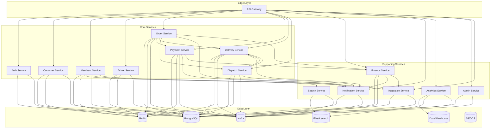

# Software Architecture Document (SAD)

## Service Decomposition

**Version:** 1.0.0
**Last Updated:** 2026-06-30

---

## Purpose

This document provides a comprehensive service decomposition for the **[Platform Name]** platform. It defines each microservice's responsibilities, boundaries, APIs, data models, dependencies, and technology choices. This service decomposition is derived from the Domain-Driven Design (DDD) bounded contexts defined in the Domain Model document and serves as the blueprint for implementing the platform's microservices architecture.

---

## Service Overview

### Service Inventory

| # | Service | Context | Type | Team | Priority |
| :--- | :--- | :--- | :--- | :--- | :--- |
| 1 | **API Gateway** | Infrastructure | Edge | Platform | High |
| 2 | **Auth Service** | Identity & Access | Core | Platform | High |
| 3 | **Customer Service** | Customer | Core | Customer | High |
| 4 | **Merchant Service** | Merchant | Core | Merchant | High |
| 5 | **Driver Service** | Driver | Core | Driver | High |
| 6 | **Order Service** | Order | Core | Order | High |
| 7 | **Payment Service** | Payment | Core | Payment | High |
| 8 | **Delivery Service** | Delivery | Core | Delivery | High |
| 9 | **Dispatch Service** | Dispatch | Core | Dispatch | High |
| 10 | **Finance Service** | Finance | Supporting | Finance | High |
| 11 | **Notification Service** | Notification | Supporting | Platform | High |
| 12 | **Analytics Service** | Analytics | Supporting | Data | Medium |
| 13 | **Admin Service** | Admin | Supporting | Platform | High |
| 14 | **Integration Service** | Integration | Supporting | Platform | High |
| 15 | **Search Service** | Search | Supporting | Platform | Medium |

### Service Dependencies Map



---

## Service Details

### 1. API Gateway

| Attribute | Description |
| :--- | :--- |
| **Context** | Infrastructure |
| **Responsibility** | Single entry point for all API requests; handles routing, authentication, rate limiting, caching, logging, and request/response transformation. |
| **Technology** | Kong / KrakenD / Envoy |
| **Port** | 8080 |
| **Replicas** | 5 (Production) |
| **Database** | None (configuration via Redis) |

**Key Features:**
- Request routing to appropriate services
- JWT and API key validation
- Rate limiting (per client, per endpoint)
- Request/response caching
- Request validation (schema validation)
- Response transformation (versioning)
- Logging and metrics
- Circuit breaker and retry
- CORS handling

**Dependencies:**
- Auth Service (authentication validation)
- Redis (rate limiting, caching)

---

### 2. Auth Service

| Attribute | Description |
| :--- | :--- |
| **Context** | Identity & Access |
| **Responsibility** | Authentication, authorization, MFA, SSO, token management, and identity federation. |
| **Technology** | Go / Spring Boot |
| **Port** | 8081 |
| **Replicas** | 5 (Production) |
| **Database** | PostgreSQL |

**Key Features:**
- User registration and login (email/password, OTP, social)
- JWT generation and validation
- Refresh token management
- MFA (TOTP, SMS, backup codes)
- Role-Based Access Control (RBAC)
- SSO (SAML 2.0, OIDC)
- SCIM user provisioning
- Session management
- Password policies and reset

**API Endpoints:**
| Method | Endpoint | Description |
| :--- | :--- | :--- |
| `POST` | `/auth/register` | Register new user |
| `POST` | `/auth/login` | Login with email/password |
| `POST` | `/auth/login/otp` | Login with phone OTP |
| `POST` | `/auth/login/social` | Social login |
| `POST` | `/auth/refresh` | Refresh JWT |
| `POST` | `/auth/logout` | Logout |
| `POST` | `/auth/mfa/enable` | Enable MFA |
| `POST` | `/auth/mfa/verify` | Verify MFA |
| `POST` | `/auth/saml/login` | SAML SSO login |
| `GET` | `/auth/oidc/authorize` | OIDC authorization |

**Dependencies:**
- User Database (PostgreSQL)
- Redis (token blacklist, session cache)
- Identity Providers (Okta, Azure AD)

---

### 3. Customer Service

| Attribute | Description |
| :--- | :--- |
| **Context** | Customer |
| **Responsibility** | Manage customer identities, profiles, addresses, loyalty, and consent. |
| **Technology** | Go / Spring Boot |
| **Port** | 8082 |
| **Replicas** | 5 (Production) |
| **Database** | PostgreSQL |

**Key Features:**
- Customer CRUD operations
- Profile management
- Address book management
- Loyalty points and tiers
- Referral program
- Consent management
- Notification preferences
- Wallet integration

**API Endpoints:**
| Method | Endpoint | Description |
| :--- | :--- | :--- |
| `GET` | `/customers/me` | Get current customer profile |
| `PUT` | `/customers/me` | Update profile |
| `GET` | `/customers/me/addresses` | List addresses |
| `POST` | `/customers/me/addresses` | Add address |
| `PUT` | `/customers/me/addresses/{id}` | Update address |
| `DELETE` | `/customers/me/addresses/{id}` | Delete address |
| `GET` | `/customers/me/loyalty` | Get loyalty account |
| `POST` | `/customers/me/loyalty/redeem` | Redeem points |
| `GET` | `/customers/me/referral` | Get referral code |
| `DELETE` | `/customers/me` | Delete account (GDPR) |

**Published Events:**
- `customer.registered`
- `customer.updated`
- `customer.address_added`
- `customer.loyalty_points_earned`
- `customer.loyalty_points_redeemed`
- `customer.deletion_requested`

**Dependencies:**
- Customer Database (PostgreSQL)
- Redis (customer cache)
- Loyalty Service (internal)
- Kafka (event publishing)

---

### 4. Merchant Service

| Attribute | Description |
| :--- | :--- |
| **Context** | Merchant |
| **Responsibility** | Manage merchant onboarding, stores, menus, catalog, and inventory. |
| **Technology** | Go / Spring Boot |
| **Port** | 8083 |
| **Replicas** | 5 (Production) |
| **Database** | PostgreSQL |

**Key Features:**
- Merchant registration and onboarding
- Document verification
- Store management
- Menu and catalog management
- Modifiers and options
- Inventory management
- Operating hours management
- Delivery zone configuration

**API Endpoints:**
| Method | Endpoint | Description |
| :--- | :--- | :--- |
| `POST` | `/merchant/application` | Start application |
| `PUT` | `/merchant/application/{id}` | Update application |
| `GET` | `/merchant/stores` | List stores |
| `POST` | `/merchant/stores` | Create store |
| `GET` | `/merchant/stores/{id}/menu/items` | List menu items |
| `POST` | `/merchant/stores/{id}/menu/items` | Add menu item |
| `PUT` | `/merchant/stores/{id}/menu/items/{id}` | Update menu item |
| `GET` | `/merchant/stores/{id}/inventory` | Get inventory |
| `PUT` | `/merchant/stores/{id}/inventory/{item_id}` | Update inventory |
| `GET` | `/merchant/stores/{id}/operating-hours` | Get operating hours |

**Published Events:**
- `merchant.registered`
- `merchant.approved`
- `merchant.store_created`
- `merchant.menu_item_added`
- `merchant.menu_item_updated`
- `merchant.inventory_updated`
- `merchant.inventory_low`

**Dependencies:**
- Merchant Database (PostgreSQL)
- Redis (menu cache)
- Search Service (indexing)
- Integration Service (ERP/POS sync)

---

### 5. Driver Service

| Attribute | Description |
| :--- | :--- |
| **Context** | Driver |
| **Responsibility** | Manage driver onboarding, profiles, vehicles, availability, and performance. |
| **Technology** | Go / Spring Boot |
| **Port** | 8084 |
| **Replicas** | 5 (Production) |
| **Database** | PostgreSQL |

**Key Features:**
- Driver registration and onboarding
- Document verification
- Vehicle management
- Online/offline status
- Location updates
- Performance metrics
- Rating management

**API Endpoints:**
| Method | Endpoint | Description |
| :--- | :--- | :--- |
| `POST` | `/driver/application` | Start application |
| `PUT` | `/driver/application/{id}` | Update application |
| `POST` | `/driver/session/online` | Go online |
| `POST` | `/driver/session/offline` | Go offline |
| `POST` | `/driver/session/break` | Take break |
| `PUT` | `/driver/orders/{id}/location` | Update GPS location |
| `GET` | `/driver/performance` | Get performance metrics |
| `GET` | `/driver/ratings` | Get driver ratings |
| `GET` | `/driver/earnings/today` | Get today's earnings |

**Published Events:**
- `driver.registered`
- `driver.approved`
- `driver.online`
- `driver.offline`
- `driver.location_updated`
- `driver.rating_updated`

**Dependencies:**
- Driver Database (PostgreSQL)
- Redis (driver availability, location cache)
- Dispatch Service (location consumption)

---

### 6. Order Service

| Attribute | Description |
| :--- | :--- |
| **Context** | Order |
| **Responsibility** | Orchestrate the order lifecycle from creation to delivery. |
| **Technology** | Go / Spring Boot |
| **Port** | 8085 |
| **Replicas** | 5 (Production) |
| **Database** | PostgreSQL |

**Key Features:**
- Order creation and validation
- Order state machine
- Cart management
- Order timeline
- Scheduled orders
- Order cancellation
- Idempotency

**API Endpoints:**
| Method | Endpoint | Description |
| :--- | :--- | :--- |
| `POST` | `/orders` | Place order |
| `GET` | `/orders/{id}` | Get order details |
| `GET` | `/orders/{id}/status` | Get order status |
| `GET` | `/orders/{id}/timeline` | Get order timeline |
| `DELETE` | `/orders/{id}` | Cancel order |
| `PUT` | `/merchant/orders/{id}/confirm` | Confirm order |
| `PUT` | `/merchant/orders/{id}/prepare` | Start preparation |
| `PUT` | `/merchant/orders/{id}/ready` | Mark ready |
| `GET` | `/merchant/orders` | List merchant orders |

**State Machine:**
```
PENDING → CONFIRMED → PREPARING → READY → ASSIGNED → PICKED_UP → IN_TRANSIT → ARRIVING_SOON → DELIVERED
   ↓          ↓            ↓          ↓         ↓           ↓           ↓              ↓
CANCELLED  CANCELLED     CANCELLED  CANCELLED  CANCELLED   FAILED     FAILED         REFUNDED
```

**Published Events:**
- `order.created`
- `order.confirmed`
- `order.preparation_started`
- `order.ready`
- `order.assigned`
- `order.picked_up`
- `order.in_transit`
- `order.arriving_soon`
- `order.delivered`
- `order.cancelled`
- `order.failed`
- `order.refunded`

**Dependencies:**
- Order Database (PostgreSQL)
- Redis (order cache)
- Payment Service (payment processing)
- Delivery Service (delivery execution)
- Dispatch Service (driver assignment)
- Notification Service (notifications)
- Finance Service (settlement)

---

### 7. Payment Service

| Attribute | Description |
| :--- | :--- |
| **Context** | Payment |
| **Responsibility** | Process payments, refunds, wallet operations, and subscriptions. |
| **Technology** | Go / Spring Boot |
| **Port** | 8086 |
| **Replicas** | 5 (Production) |
| **Database** | PostgreSQL |

**Key Features:**
- Payment authorization and capture
- Refund processing (full/partial)
- Payment method management
- Wallet management (top-up, payment, withdraw)
- Subscription management
- Payment gateway abstraction
- Webhook handling
- Idempotency

**API Endpoints:**
| Method | Endpoint | Description |
| :--- | :--- | :--- |
| `POST` | `/payments/authorize` | Authorize payment |
| `POST` | `/payments/capture` | Capture payment |
| `POST` | `/payments/refund` | Refund payment |
| `GET` | `/payments/{id}` | Get transaction details |
| `GET` | `/payments/methods` | Get payment methods |
| `POST` | `/payments/methods` | Add payment method |
| `GET` | `/customers/me/wallet` | Get wallet balance |
| `POST` | `/customers/me/wallet/topup` | Top up wallet |
| `GET` | `/subscriptions/plans` | List subscription plans |
| `POST` | `/customers/me/subscription` | Create subscription |

**Published Events:**
- `payment.authorized`
- `payment.captured`
- `payment.failed`
- `payment.refunded`
- `payment.disputed`
- `wallet.credited`
- `wallet.debited`
- `subscription.created`
- `subscription.cancelled`

**Dependencies:**
- Payment Database (PostgreSQL)
- Redis (transaction cache)
- Payment Gateway Adapters (Stripe, Paymob, Adyen)
- Integration Service (gateway configuration)

---

### 8. Delivery Service

| Attribute | Description |
| :--- | :--- |
| **Context** | Delivery |
| **Responsibility** | Manage delivery execution, real-time tracking, geofencing, and communication. |
| **Technology** | Go / Spring Boot |
| **Port** | 8087 |
| **Replicas** | 5 (Production) |
| **Database** | PostgreSQL |

**Key Features:**
- Delivery assignment and management
- Real-time GPS tracking
- Geofencing (merchant, customer, zones)
- ETA calculation and updates
- Delivery verification (QR, OTP, photo)
- Driver-customer communication
- Delivery failure handling
- Location history

**API Endpoints:**
| Method | Endpoint | Description |
| :--- | :--- | :--- |
| `GET` | `/deliveries/{id}` | Get delivery details |
| `GET` | `/deliveries/{id}/tracking` | Get real-time tracking |
| `POST` | `/deliveries/{id}/assign` | Assign driver |
| `POST` | `/deliveries/{id}/pickup` | Confirm pickup |
| `POST` | `/deliveries/{id}/deliver` | Confirm delivery |
| `POST` | `/deliveries/{id}/fail` | Report delivery failure |
| `GET` | `/deliveries/{id}/messages` | Get chat history |
| `POST` | `/deliveries/{id}/messages` | Send message |
| `POST` | `/deliveries/{id}/call` | Initiate masked call |

**Published Events:**
- `delivery.assigned`
- `delivery.picked_up`
- `delivery.in_transit`
- `delivery.arriving_soon`
- `delivery.completed`
- `delivery.failed`
- `delivery.location_updated`
- `delivery.eta_updated`

**Dependencies:**
- Delivery Database (PostgreSQL)
- Redis (location cache, tracking)
- Map Service (geocoding, routing)
- Dispatch Service (assignment)
- Notification Service (notifications)

---

### 9. Dispatch Service

| Attribute | Description |
| :--- | :--- |
| **Context** | Dispatch |
| **Responsibility** | Optimize order routing, batching, and driver assignment algorithms. |
| **Technology** | Go / Spring Boot |
| **Port** | 8088 |
| **Replicas** | 5 (Production) |
| **Database** | PostgreSQL |

**Key Features:**
- Order queuing and prioritization
- Driver availability management
- Composite scoring algorithm
- Order offering and acceptance
- Batch creation and optimization
- Route optimization
- Dynamic reassignment
- Surge pricing

**API Endpoints:**
| Method | Endpoint | Description |
| :--- | :--- | :--- |
| `GET` | `/dispatch/queue` | Get assignment queue |
| `POST` | `/dispatch/order/{id}/assign` | Assign order |
| `POST` | `/dispatch/batch/create` | Create batch |
| `GET` | `/dispatch/drivers/available` | Get available drivers |
| `GET` | `/dispatch/surge/current` | Get current surge pricing |
| `POST` | `/dispatch/order/{id}/reassign` | Reassign order |
| `GET` | `/dispatch/analytics/metrics` | Get assignment metrics |

**Published Events:**
- `dispatch.order_queued`
- `dispatch.order_offered`
- `dispatch.order_accepted`
- `dispatch.order_declined`
- `dispatch.batch_created`
- `dispatch.batch_accepted`
- `dispatch.reassigned`
- `dispatch.surge_applied`

**Dependencies:**
- Dispatch Database (PostgreSQL)
- Redis (queue, availability cache)
- Map Service (distance matrix, routing)
- Delivery Service (assignment execution)
- Notification Service (driver notifications)

---

### 10. Finance Service

| Attribute | Description |
| :--- | :--- |
| **Context** | Finance |
| **Responsibility** | Calculate merchant settlements, driver payouts, commissions, fees, taxes, and reconciliation. |
| **Technology** | Go / Spring Boot |
| **Port** | 8089 |
| **Replicas** | 3 (Production) |
| **Database** | PostgreSQL |

**Key Features:**
- Merchant settlement calculation
- Driver payout calculation
- Commission and fee calculation
- Invoice generation
- Tax calculation and reporting
- Reconciliation (gateway, merchant, driver)
- Adjustment processing

**API Endpoints:**
| Method | Endpoint | Description |
| :--- | :--- | :--- |
| `GET` | `/merchant/finance/settlements` | List settlements |
| `GET` | `/merchant/finance/settlements/{id}` | Get settlement details |
| `GET` | `/merchant/finance/invoices` | List invoices |
| `GET` | `/merchant/finance/invoices/{id}/download` | Download invoice |
| `GET` | `/driver/payouts` | List payouts |
| `POST` | `/driver/payouts/instant` | Request instant payout |
| `GET` | `/merchant/finance/commission` | Get commission structure |
| `GET` | `/finance/reconciliation` | Get reconciliation status |

**Published Events:**
- `finance.settlement_calculated`
- `finance.settlement_paid`
- `finance.payout_calculated`
- `finance.payout_processed`
- `finance.invoice_generated`
- `finance.reconciliation_completed`
- `finance.adjustment_applied`

**Dependencies:**
- Finance Database (PostgreSQL)
- Integration Service (banking, payment gateway reconciliation)
- Notification Service (settlement notifications)

---

### 11. Notification Service

| Attribute | Description |
| :--- | :--- |
| **Context** | Notification |
| **Responsibility** | Manage multi-channel notification delivery (push, email, SMS, in-app, webhook). |
| **Technology** | Node.js / Go |
| **Port** | 8090 |
| **Replicas** | 3 (Production) |
| **Database** | PostgreSQL |

**Key Features:**
- Multi-channel delivery (push, email, SMS, in-app)
- Template management
- Personalization
- Delivery tracking (sent, delivered, opened, clicked)
- User preferences
- Webhook delivery
- Scheduled notifications
- Retry and fallback

**API Endpoints:**
| Method | Endpoint | Description |
| :--- | :--- | :--- |
| `POST` | `/notifications` | Send notification |
| `POST` | `/notifications/schedule` | Schedule notification |
| `GET` | `/notifications/templates` | List templates |
| `POST` | `/notifications/templates` | Create template |
| `GET` | `/notifications/preferences` | Get user preferences |
| `PUT` | `/notifications/preferences` | Update preferences |
| `POST` | `/notifications/webhooks` | Register webhook |
| `GET` | `/notifications/analytics` | Get notification analytics |

**Published Events:**
- `notification.sent`
- `notification.delivered`
- `notification.opened`
- `notification.clicked`
- `notification.failed`

**Dependencies:**
- Notification Database (PostgreSQL)
- Redis (queue)
- Push Providers (FCM, APNs)
- Email Providers (SendGrid, SES)
- SMS Providers (Twilio, SNS)

---

### 12. Analytics Service

| Attribute | Description |
| :--- | :--- |
| **Context** | Analytics |
| **Responsibility** | Collect, process, and analyze platform data for business intelligence and reporting. |
| **Technology** | Python / Go |
| **Port** | 8091 |
| **Replicas** | 2 (Production) |
| **Database** | Data Warehouse (Snowflake/BigQuery) |

**Key Features:**
- Data ingestion and ETL
- Business intelligence dashboards
- KPI calculation and tracking
- Predictive analytics
- Customer segmentation
- Cohort analysis
- Anomaly detection
- Report generation

**API Endpoints:**
| Method | Endpoint | Description |
| :--- | :--- | :--- |
| `GET` | `/analytics/dashboards/executive` | Get executive dashboard |
| `GET` | `/analytics/dashboards/operations` | Get operations dashboard |
| `GET` | `/analytics/kpis` | List KPIs |
| `POST` | `/analytics/reports/generate` | Generate report |
| `GET` | `/analytics/segments` | Get customer segments |
| `GET` | `/analytics/forecast` | Get forecasts |
| `GET` | `/analytics/predictions` | Get predictions |

**Dependencies:**
- Data Warehouse (Snowflake/BigQuery)
- Elasticsearch (search, logs)
- Kafka (event consumption)
- All Services (data sources)

---

### 13. Admin Service

| Attribute | Description |
| :--- | :--- |
| **Context** | Admin & Operations |
| **Responsibility** | Provide platform administration, user management, configuration, content management, and operational oversight. |
| **Technology** | Go / Spring Boot |
| **Port** | 8092 |
| **Replicas** | 3 (Production) |
| **Database** | PostgreSQL |

**Key Features:**
- Admin user management
- Role-based access control
- Platform configuration
- Content management (banners, promotions)
- Support ticket management
- Audit log viewing
- Operational monitoring

**API Endpoints:**
| Method | Endpoint | Description |
| :--- | :--- | :--- |
| `GET` | `/admin/orders` | List orders |
| `GET` | `/admin/merchants` | List merchants |
| `GET` | `/admin/drivers` | List drivers |
| `PUT` | `/admin/merchants/{id}/approve` | Approve merchant |
| `PUT` | `/admin/merchants/{id}/suspend` | Suspend merchant |
| `GET` | `/admin/support/tickets` | List tickets |
| `GET` | `/admin/audit` | Get audit logs |
| `PUT` | `/admin/config` | Update configuration |
| `POST` | `/admin/banners` | Create banner |
| `POST` | `/admin/promotions` | Create promotion |

**Published Events:**
- `admin.user_created`
- `admin.configuration_changed`
- `admin.support_ticket_created`
- `admin.content_published`
- `admin.promotion_created`

**Dependencies:**
- Admin Database (PostgreSQL)
- All Services (read/write access)
- Kafka (event publishing)

---

### 14. Integration Service

| Attribute | Description |
| :--- | :--- |
| **Context** | Integration |
| **Responsibility** | Manage third-party integrations, adapters, and data synchronization with external systems. |
| **Technology** | Go / Python |
| **Port** | 8093 |
| **Replicas** | 3 (Production) |
| **Database** | PostgreSQL |

**Key Features:**
- Payment gateway adapters
- Mapping service adapters
- ERP/POS synchronization
- CRM synchronization
- Identity federation
- Webhook delivery
- Data mapping and transformation

**API Endpoints:**
| Method | Endpoint | Description |
| :--- | :--- | :--- |
| `GET` | `/integrations/payment/providers` | List payment providers |
| `POST` | `/integrations/payment/providers` | Add payment provider |
| `GET` | `/integrations/erp-pos/syncs` | List syncs |
| `POST` | `/integrations/erp-pos/syncs` | Create sync |
| `POST` | `/integrations/erp-pos/connections/{id}/test` | Test connection |
| `GET` | `/integrations/crm/mappings` | List mappings |
| `POST` | `/integrations/crm/mappings` | Create mapping |

**Dependencies:**
- Integration Database (PostgreSQL)
- External Systems (ERP, POS, CRM, Payment Gateways)
- Kafka (event publishing/consuming)

---

### 15. Search Service

| Attribute | Description |
| :--- | :--- |
| **Context** | Search |
| **Responsibility** | Provide search capabilities for merchants, menu items, and orders. |
| **Technology** | Python / Elasticsearch |
| **Port** | 8094 |
| **Replicas** | 2 (Production) |
| **Database** | Elasticsearch |

**Key Features:**
- Merchant search
- Menu item search
- Full-text search
- Faceted search
- Autocomplete
- Geospatial search
- Relevance ranking

**API Endpoints:**
| Method | Endpoint | Description |
| :--- | :--- | :--- |
| `GET` | `/search/merchants` | Search merchants |
| `GET` | `/search/menu-items` | Search menu items |
| `GET` | `/search/autocomplete` | Autocomplete suggestions |
| `POST` | `/search/reindex` | Reindex all data (admin) |
| `GET` | `/search/suggestions` | Get search suggestions |

**Dependencies:**
- Elasticsearch
- Merchant Service (data source)
- Kafka (indexing events)

---

## Service Communication Patterns

### Synchronous Communication

| Pattern | Description | Protocol | Use Case |
| :--- | :--- | :--- | :--- |
| **Request-Response** | Direct service-to-service calls | gRPC / HTTP | Order Service → Payment Service |
| **API Gateway** | Client to services | HTTP / WebSocket | All client requests |
| **Service Mesh** | Service-to-service communication | gRPC / HTTP | All internal services |

### Asynchronous Communication

| Pattern | Description | Protocol | Use Case |
| :--- | :--- | :--- | :--- |
| **Event-Driven** | Publish/Subscribe events | Kafka | Order events, payment events |
| **Command** | Request/Reply with acknowledgment | Kafka | Long-running operations |
| **Notification** | One-way updates | Kafka | Notifications, analytics |

---

## Service Mesh Configuration

### Istio Configuration

| Parameter | Value | Description |
| :--- | :--- | :--- |
| **mTLS** | STRICT | Mutual TLS for all service-to-service communication |
| **Circuit Breaker** | 50% failure threshold | Prevent cascading failures |
| **Retry** | 3 attempts | Retry failed requests |
| **Timeout** | 5s | Request timeout |
| **Connection Pool** | 100 max connections | Connection management |

---

## Deployment Considerations

### Service Scaling

| Service | Min Replicas | Max Replicas | Target CPU |
| :--- | :--- | :--- | :--- |
| **API Gateway** | 3 | 10 | 50% |
| **Auth Service** | 3 | 10 | 60% |
| **Customer Service** | 3 | 10 | 60% |
| **Merchant Service** | 3 | 10 | 60% |
| **Driver Service** | 3 | 10 | 60% |
| **Order Service** | 3 | 15 | 50% |
| **Payment Service** | 3 | 10 | 50% |
| **Delivery Service** | 3 | 10 | 50% |
| **Dispatch Service** | 3 | 10 | 50% |
| **Finance Service** | 2 | 5 | 60% |
| **Notification Service** | 2 | 5 | 60% |
| **Analytics Service** | 1 | 3 | 70% |
| **Admin Service** | 2 | 5 | 60% |
| **Integration Service** | 2 | 5 | 60% |
| **Search Service** | 1 | 3 | 70% |

### Resource Allocation

| Service | CPU Request | CPU Limit | Memory Request | Memory Limit |
| :--- | :--- | :--- | :--- | :--- |
| **API Gateway** | 100m | 500m | 256Mi | 512Mi |
| **Auth Service** | 200m | 1000m | 512Mi | 1Gi |
| **Customer Service** | 200m | 1000m | 512Mi | 1Gi |
| **Merchant Service** | 200m | 1000m | 512Mi | 1Gi |
| **Driver Service** | 200m | 1000m | 512Mi | 1Gi |
| **Order Service** | 200m | 1000m | 512Mi | 1Gi |
| **Payment Service** | 200m | 1000m | 512Mi | 1Gi |
| **Delivery Service** | 200m | 1000m | 512Mi | 1Gi |
| **Dispatch Service** | 200m | 1000m | 512Mi | 1Gi |
| **Finance Service** | 200m | 500m | 512Mi | 1Gi |
| **Notification Service** | 100m | 500m | 256Mi | 512Mi |
| **Analytics Service** | 200m | 1000m | 1Gi | 2Gi |
| **Admin Service** | 100m | 500m | 256Mi | 512Mi |
| **Integration Service** | 200m | 500m | 512Mi | 1Gi |
| **Search Service** | 200m | 1000m | 1Gi | 2Gi |

---

## Version History

| Version | Date | Author | Changes |
| :--- | :--- | :--- | :--- |
| 1.0.0 | 2026-06-30 | [Author] | Initial service decomposition documentation |

---

**Next Document:**

`Data_Flow_Sequence_Diagrams.md`

*(This continues the architecture design documentation with data flow and sequence diagrams.)*
